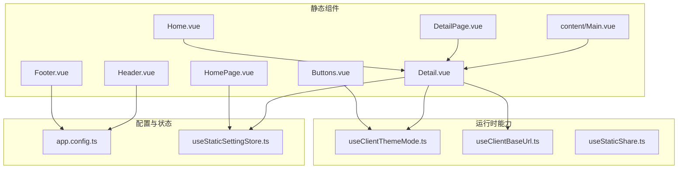
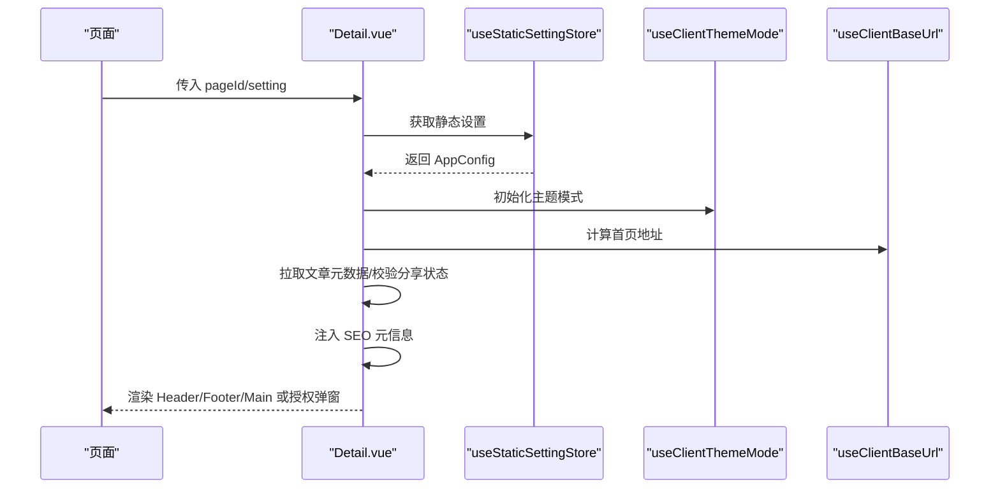
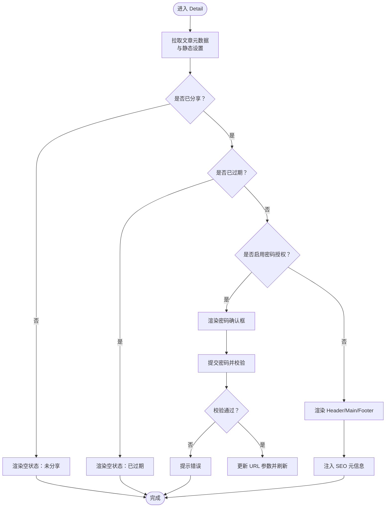
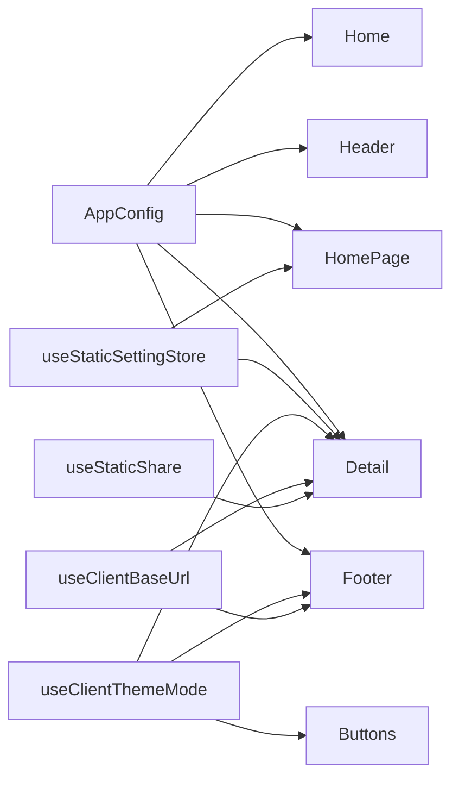

# 静态组件

<cite>
**本文引用的文件**
- [apps/app/components/static/Header.vue](file://apps/app/components/static/Header.vue)
- [apps/app/components/static/Footer.vue](file://apps/app/components/static/Footer.vue)
- [apps/app/components/static/Home.vue](file://apps/app/components/static/Home.vue)
- [apps/app/components/static/Detail.vue](file://apps/app/components/static/Detail.vue)
- [apps/app/components/static/Buttons.vue](file://apps/app/components/static/Buttons.vue)
- [apps/app/components/static/content/Main.vue](file://apps/app/components/static/content/Main.vue)
- [apps/app/components/static/DetailPage.vue](file://apps/app/components/static/DetailPage.vue)
- [apps/app/components/static/HomePage.vue](file://apps/app/components/static/HomePage.vue)
- [apps/app/app.config.ts](file://apps/app/app.config.ts)
- [apps/app/stores/useStaticSettingStore.ts](file://apps/app/stores/useStaticSettingStore.ts)
- [apps/app/composables/useClientThemeMode.ts](file://apps/app/composables/useClientThemeMode.ts)
- [apps/app/plugins/libs/renderer/useClientBaseUrl.ts](file://apps/app/plugins/libs/renderer/useClientBaseUrl.ts)
- [apps/siyuan/src/composables/useStaticShare.ts](file://apps/siyuan/src/composables/useStaticShare.ts)
</cite>

## 目录
1. [简介](#简介)
2. [项目结构](#项目结构)
3. [核心组件](#核心组件)
4. [架构总览](#架构总览)
5. [详细组件分析](#详细组件分析)
6. [依赖分析](#依赖分析)
7. [性能考虑](#性能考虑)
8. [故障排查指南](#故障排查指南)
9. [结论](#结论)
10. [附录](#附录)

## 简介
本文件面向“静态组件”模块，系统性梳理并说明以下组件的功能特性与使用方式：Header、Footer、Home、Detail、Main、Buttons，以及与之配套的 DetailPage、HomePage。文档从模板结构、样式设计、交互逻辑、数据绑定、API 接口（props/events/slots）、组件协作关系、SEO/主题/导航等维度进行深入解析，并提供可操作的使用示例与最佳实践，帮助开发者在不同页面布局中正确集成与定制这些静态组件。

## 项目结构
静态组件主要位于应用前端工程 apps/app/components/static 及其子目录，配合静态设置存储、主题模式控制、基础路径工具与静态分享能力，形成完整的静态页面渲染与展示体系。

图表来源
- [apps/app/components/static/Header.vue:1-131](file://apps/app/components/static/Header.vue#L1-L131)
- [apps/app/components/static/Footer.vue:1-115](file://apps/app/components/static/Footer.vue#L1-L115)
- [apps/app/components/static/Detail.vue:1-173](file://apps/app/components/static/Detail.vue#L1-L173)
- [apps/app/components/static/content/Main.vue:1-80](file://apps/app/components/static/content/Main.vue#L1-L80)
- [apps/app/components/static/Buttons.vue:1-240](file://apps/app/components/static/Buttons.vue#L1-L240)
- [apps/app/components/static/DetailPage.vue:1-21](file://apps/app/components/static/DetailPage.vue#L1-L21)
- [apps/app/components/static/HomePage.vue:1-49](file://apps/app/components/static/HomePage.vue#L1-L49)
- [apps/app/app.config.ts:1-92](file://apps/app/app.config.ts#L1-L92)
- [apps/app/stores/useStaticSettingStore.ts:1-28](file://apps/app/stores/useStaticSettingStore.ts#L1-L28)
- [apps/app/composables/useClientThemeMode.ts:1-158](file://apps/app/composables/useClientThemeMode.ts#L1-L158)
- [apps/app/plugins/libs/renderer/useClientBaseUrl.ts:1-42](file://apps/app/plugins/libs/renderer/useClientBaseUrl.ts#L1-L42)
- [apps/siyuan/src/composables/useStaticShare.ts:1-97](file://apps/siyuan/src/composables/useStaticShare.ts#L1-L97)

章节来源
- [apps/app/components/static/Header.vue:1-131](file://apps/app/components/static/Header.vue#L1-L131)
- [apps/app/components/static/Footer.vue:1-115](file://apps/app/components/static/Footer.vue#L1-L115)
- [apps/app/components/static/Detail.vue:1-173](file://apps/app/components/static/Detail.vue#L1-L173)
- [apps/app/components/static/content/Main.vue:1-80](file://apps/app/components/static/content/Main.vue#L1-L80)
- [apps/app/components/static/Buttons.vue:1-240](file://apps/app/components/static/Buttons.vue#L1-L240)
- [apps/app/components/static/DetailPage.vue:1-21](file://apps/app/components/static/DetailPage.vue#L1-L21)
- [apps/app/components/static/HomePage.vue:1-49](file://apps/app/components/static/HomePage.vue#L1-L49)
- [apps/app/app.config.ts:1-92](file://apps/app/app.config.ts#L1-L92)
- [apps/app/stores/useStaticSettingStore.ts:1-28](file://apps/app/stores/useStaticSettingStore.ts#L1-L28)
- [apps/app/composables/useClientThemeMode.ts:1-158](file://apps/app/composables/useClientThemeMode.ts#L1-L158)
- [apps/app/plugins/libs/renderer/useClientBaseUrl.ts:1-42](file://apps/app/plugins/libs/renderer/useClientBaseUrl.ts#L1-L42)
- [apps/siyuan/src/composables/useStaticShare.ts:1-97](file://apps/siyuan/src/composables/useStaticShare.ts#L1-L97)

## 核心组件
- Header：站点顶部导航与品牌展示，支持 Logo、站点名称与自定义 HTML 片段注入。
- Footer：站点底部信息与主题切换入口，支持自定义 HTML 片段注入与主题模式切换。
- Detail：静态详情页容器，负责拉取文章元数据、处理分享授权、SEO 元信息注入、条件渲染与布局组织。
- Main：静态正文渲染容器，负责标题与富文本内容的渲染、插件化指令与图片预览。
- Buttons：悬浮工具按钮，提供“回到顶部”、“主题模式切换”等交互。
- HomePage：首页入口，根据静态设置决定直接渲染首页内容或提示未配置。
- DetailPage：详情页入口，简化为仅渲染 Detail 组件并关闭标题后缀。
- Home：首页内容容器，委托给 Detail 并覆盖 SEO 与标题显示行为。

章节来源
- [apps/app/components/static/Header.vue:1-131](file://apps/app/components/static/Header.vue#L1-L131)
- [apps/app/components/static/Footer.vue:1-115](file://apps/app/components/static/Footer.vue#L1-L115)
- [apps/app/components/static/Detail.vue:1-173](file://apps/app/components/static/Detail.vue#L1-L173)
- [apps/app/components/static/content/Main.vue:1-80](file://apps/app/components/static/content/Main.vue#L1-L80)
- [apps/app/components/static/Buttons.vue:1-240](file://apps/app/components/static/Buttons.vue#L1-L240)
- [apps/app/components/static/HomePage.vue:1-49](file://apps/app/components/static/HomePage.vue#L1-L49)
- [apps/app/components/static/DetailPage.vue:1-21](file://apps/app/components/static/DetailPage.vue#L1-L21)
- [apps/app/components/static/Home.vue:1-18](file://apps/app/components/static/Home.vue#L1-L18)

## 架构总览
静态组件围绕“设置驱动 + 运行时能力 + 内容渲染”的三层架构工作：
- 设置驱动：通过静态设置存储获取全局配置（站点标题、Logo、主题、导航/页脚 HTML 片段等）。
- 运行时能力：主题模式切换、基础地址计算、静态分享生成与清理。
- 内容渲染：Header/Footer/Buttons 提供布局与交互；Detail 聚合数据与条件渲染；Main 负责正文渲染与插件化增强。

图表来源
- [apps/app/components/static/Detail.vue:1-173](file://apps/app/components/static/Detail.vue#L1-L173)
- [apps/app/stores/useStaticSettingStore.ts:1-28](file://apps/app/stores/useStaticSettingStore.ts#L1-L28)
- [apps/app/composables/useClientThemeMode.ts:1-158](file://apps/app/composables/useClientThemeMode.ts#L1-L158)
- [apps/app/plugins/libs/renderer/useClientBaseUrl.ts:1-42](file://apps/app/plugins/libs/renderer/useClientBaseUrl.ts#L1-L42)

## 详细组件分析

### Header 组件
- 功能定位：顶部导航与品牌展示，支持 Logo、站点名称与自定义 HTML 片段注入。
- 模板结构：包含品牌链接、Logo、站点名与右侧自定义区域；自定义区域由 VNode 渲染传入的 HTML 字符串。
- 样式设计：固定定位、模糊背景、响应式布局；Logo 与站点名在窄屏下有隐藏策略。
- 交互逻辑：无交互事件，作为纯展示组件。
- 数据绑定：接收 AppConfig，读取站点标题、Logo 与 header HTML 片段。
- API 接口
  - Props
    - setting: AppConfig（必填）
  - Events: 无
  - Slots: 无
- 使用场景
  - 在 Detail/HomePage 中作为页面头部统一展示。
  - 通过 setting.header 注入额外导航或广告位 HTML。
- 最佳实践
  - Logo 与站点名同时存在时，站点名可按需隐藏以节省空间。
  - header 片段建议仅放置轻量 HTML，避免影响首屏渲染。

章节来源
- [apps/app/components/static/Header.vue:1-131](file://apps/app/components/static/Header.vue#L1-L131)
- [apps/app/app.config.ts:1-92](file://apps/app/app.config.ts#L1-L92)

### Footer 组件
- 功能定位：底部信息与主题模式切换入口，支持自定义 HTML 片段注入。
- 模板结构：在非 Provider 模式且未配置 footer 片段时，渲染主题切换按钮与版权、版本、跳转等信息；否则渲染自定义 footer 片段。
- 样式设计：居中文字、浅色字体、可点击项高亮。
- 交互逻辑：点击 GitHub/关于/首页等触发外部链接或跳转；主题切换通过事件向上抛出。
- 数据绑定：接收 AppConfig，读取 footer 片段、站点标题、版本号等。
- API 接口
  - Props
    - setting: AppConfig（必填）
  - Events
    - toggle-theme-mode(auto|light|dark): 触发主题模式切换
  - Slots: 无
- 使用场景
  - 在 Detail/HomePage 中作为页面底部统一展示。
  - 通过 setting.footer 注入版权、统计或自定义链接。
- 最佳实践
  - footer 片段为空时，优先使用内置按钮与信息，确保一致性。
  - 主题切换事件应由父组件或全局主题管理器处理。

章节来源
- [apps/app/components/static/Footer.vue:1-115](file://apps/app/components/static/Footer.vue#L1-L115)
- [apps/app/plugins/libs/renderer/useClientBaseUrl.ts:1-42](file://apps/app/plugins/libs/renderer/useClientBaseUrl.ts#L1-L42)
- [apps/app/composables/useClientThemeMode.ts:1-158](file://apps/app/composables/useClientThemeMode.ts#L1-L158)

### Detail 组件
- 功能定位：静态详情页容器，负责文章数据获取、分享授权校验、SEO 注入与布局组织。
- 模板结构：根据共享状态、过期状态、是否需要密码授权分别渲染；否则渲染 Header/Main/Footer 的完整布局。
- 交互逻辑：当启用密码授权时，弹出确认框并调用授权验证接口，成功后更新 URL 参数并刷新。
- 数据绑定：接收 pageId/setting/overrideSeo/showTitleSign；内部通过静态设置存储与 Provider 模式开关拉取数据。
- API 接口
  - Props
    - pageId?: string
    - setting?: AppConfig
    - overrideSeo?: boolean
    - showTitleSign?: boolean
  - Events: 无
  - Slots: 无
- 流程图（授权与渲染）

图表来源
- [apps/app/components/static/Detail.vue:1-173](file://apps/app/components/static/Detail.vue#L1-L173)

章节来源
- [apps/app/components/static/Detail.vue:1-173](file://apps/app/components/static/Detail.vue#L1-L173)
- [apps/app/stores/useStaticSettingStore.ts:1-28](file://apps/app/stores/useStaticSettingStore.ts#L1-L28)

### Main 组件
- 功能定位：静态正文渲染容器，负责标题与富文本内容的渲染、插件化指令与图片预览。
- 模板结构：标题区域与正文区域分离；正文区域应用多种插件化指令以增强渲染效果。
- 交互逻辑：无交互事件，作为纯展示组件。
- 数据绑定：接收 post（含标题、editorDom 等）与 setting。
- API 接口
  - Props
    - post: any（必填）
    - setting?: any
  - Events: 无
  - Slots: 无
- 使用场景
  - 作为 Detail 的正文渲染器，承载富文本与插件化渲染。
- 最佳实践
  - editorDom 中的 contenteditable 属性会被统一替换为只读，确保静态展示一致性。
  - 图片预览通过独立组件实现，注意资源路径与跨域问题。

章节来源
- [apps/app/components/static/content/Main.vue:1-80](file://apps/app/components/static/content/Main.vue#L1-L80)

### Buttons 组件
- 功能定位：悬浮工具按钮，提供“回到顶部”、“主题模式切换”等交互。
- 模板结构：在客户端渲染，包含回到顶部、主题模式切换等按钮；主题模式切换通过事件向上抛出。
- 交互逻辑：监听滚动事件，超过阈值显示“回到顶部”；点击主题按钮展开模式列表，选择后触发事件。
- 数据绑定：接收 defaultMode；内部维护滚动位置、模式列表等状态。
- API 接口
  - Props
    - defaultMode?: "auto"|"light"|"dark"
  - Events
    - toggleThemeMode(auto|light|dark): 触发主题模式切换
  - Slots: 无
- 使用场景
  - 在 Detail/HomePage 中作为全局悬浮工具，提升可访问性。
- 最佳实践
  - 模式切换事件应由全局主题管理器处理，保持一致的主题状态。

章节来源
- [apps/app/components/static/Buttons.vue:1-240](file://apps/app/components/static/Buttons.vue#L1-L240)
- [apps/app/composables/useClientThemeMode.ts:1-158](file://apps/app/composables/useClientThemeMode.ts#L1-L158)

### HomePage 组件
- 功能定位：首页入口，根据静态设置决定直接渲染首页内容或提示未配置。
- 模板结构：获取静态设置后，若未配置首页 ID，则渲染空状态与警告；否则渲染 Home 组件并传入首页 ID。
- 交互逻辑：无交互事件，作为路由入口组件。
- 数据绑定：接收 AppConfig，读取首页 ID、站点标题与标语等。
- API 接口
  - Props: 无
  - Events: 无
  - Slots: 无
- 使用场景
  - 作为首页路由组件，统一入口与 SEO 元信息注入。
- 最佳实践
  - 首页 ID 未配置时，应引导用户在后台设置中配置。

章节来源
- [apps/app/components/static/HomePage.vue:1-49](file://apps/app/components/static/HomePage.vue#L1-L49)

### DetailPage 组件
- 功能定位：详情页入口，简化为仅渲染 Detail 组件并关闭标题后缀。
- 模板结构：包裹 Detail 并传入 showTitleSign=false。
- 交互逻辑：无交互事件，作为路由入口组件。
- 数据绑定：无额外 props。
- API 接口
  - Props: 无
  - Events: 无
  - Slots: 无
- 使用场景
  - 作为详情页路由组件，适合不需要标题后缀的场景。
- 最佳实践
  - 与 HomePage 类似，确保 Detail 的数据流与权限校验正常。

章节来源
- [apps/app/components/static/DetailPage.vue:1-21](file://apps/app/components/static/DetailPage.vue#L1-L21)

### Home 组件
- 功能定位：首页内容容器，委托给 Detail 并覆盖 SEO 与标题显示行为。
- 模板结构：渲染 Detail 并传入 pageId 与 overrideSeo=true、showTitleSign=false。
- 交互逻辑：无交互事件，作为内容容器。
- 数据绑定：接收 pageId。
- API 接口
  - Props
    - pageId?: string
  - Events: 无
  - Slots: 无
- 使用场景
  - 作为首页内容展示的轻量封装。
- 最佳实践
  - 首页 ID 由静态设置提供，确保一致性。

章节来源
- [apps/app/components/static/Home.vue:1-18](file://apps/app/components/static/Home.vue#L1-L18)

## 依赖分析
- Header/Footer 依赖 AppConfig 与主题模式能力，Footer 还依赖基础地址工具与国际化。
- Detail 依赖静态设置存储、Provider 模式、主题模式、基础地址工具与认证模式能力。
- Main 依赖图片预览与富文本插件化渲染能力。
- Buttons 依赖主题模式能力与滚动事件。
- HomePage/DetailPage/Home 依赖静态设置存储与路由参数。

图表来源
- [apps/app/app.config.ts:1-92](file://apps/app/app.config.ts#L1-L92)
- [apps/app/stores/useStaticSettingStore.ts:1-28](file://apps/app/stores/useStaticSettingStore.ts#L1-L28)
- [apps/app/composables/useClientThemeMode.ts:1-158](file://apps/app/composables/useClientThemeMode.ts#L1-L158)
- [apps/app/plugins/libs/renderer/useClientBaseUrl.ts:1-42](file://apps/app/plugins/libs/renderer/useClientBaseUrl.ts#L1-L42)
- [apps/siyuan/src/composables/useStaticShare.ts:1-97](file://apps/siyuan/src/composables/useStaticShare.ts#L1-L97)

章节来源
- [apps/app/app.config.ts:1-92](file://apps/app/app.config.ts#L1-L92)
- [apps/app/stores/useStaticSettingStore.ts:1-28](file://apps/app/stores/useStaticSettingStore.ts#L1-L28)
- [apps/app/composables/useClientThemeMode.ts:1-158](file://apps/app/composables/useClientThemeMode.ts#L1-L158)
- [apps/app/plugins/libs/renderer/useClientBaseUrl.ts:1-42](file://apps/app/plugins/libs/renderer/useClientBaseUrl.ts#L1-L42)
- [apps/siyuan/src/composables/useStaticShare.ts:1-97](file://apps/siyuan/src/composables/useStaticShare.ts#L1-L97)

## 性能考虑
- 懒加载与客户端渲染：Buttons 与图片预览采用客户端渲染，减少 SSR 压力。
- 滚动节流：Buttons 对滚动事件使用防抖，降低频繁重绘。
- SEO 注入：Detail 在客户端注入 SEO 元信息，避免 SSR 期间的不确定性。
- 主题切换：主题模式切换通过 DOM 属性与样式链接切换，避免全量重绘。
- 静态设置缓存：静态设置存储对配置文本进行解析缓存，减少重复请求。

## 故障排查指南
- 未显示首页内容
  - 检查静态设置中的首页 ID 是否配置；若为空，HomePage 会渲染空状态与警告。
  - 参考：[apps/app/components/static/HomePage.vue:34-44](file://apps/app/components/static/HomePage.vue#L34-L44)
- 详情页未显示或提示未分享/已过期
  - 检查文章是否已分享、是否过期；必要时重新生成静态分享。
  - 参考：[apps/app/components/static/Detail.vue:133-138](file://apps/app/components/static/Detail.vue#L133-L138)
- 主题模式切换无效
  - 确认 Buttons 的 toggle-theme-mode 事件被正确处理；检查 useClientThemeMode 的主题链接与属性设置。
  - 参考：[apps/app/components/static/Buttons.vue:91-94](file://apps/app/components/static/Buttons.vue#L91-L94)、[apps/app/composables/useClientThemeMode.ts:57-97](file://apps/app/composables/useClientThemeMode.ts#L57-L97)
- 底部链接无法打开
  - 检查 useClientBaseUrl 的 getHome 与 getOrigin 实现，确认环境变量与 origin 配置。
  - 参考：[apps/app/plugins/libs/renderer/useClientBaseUrl.ts:20-24](file://apps/app/plugins/libs/renderer/useClientBaseUrl.ts#L20-L24)
- 静态分享数据异常
  - 使用 useStaticShare 的清理与重建能力，确保 JSON 与附件目录一致。
  - 参考：[apps/siyuan/src/composables/useStaticShare.ts:40-53](file://apps/siyuan/src/composables/useStaticShare.ts#L40-L53)

章节来源
- [apps/app/components/static/HomePage.vue:34-44](file://apps/app/components/static/HomePage.vue#L34-L44)
- [apps/app/components/static/Detail.vue:133-138](file://apps/app/components/static/Detail.vue#L133-L138)
- [apps/app/components/static/Buttons.vue:91-94](file://apps/app/components/static/Buttons.vue#L91-L94)
- [apps/app/composables/useClientThemeMode.ts:57-97](file://apps/app/composables/useClientThemeMode.ts#L57-L97)
- [apps/app/plugins/libs/renderer/useClientBaseUrl.ts:20-24](file://apps/app/plugins/libs/renderer/useClientBaseUrl.ts#L20-L24)
- [apps/siyuan/src/composables/useStaticShare.ts:40-53](file://apps/siyuan/src/composables/useStaticShare.ts#L40-L53)

## 结论
静态组件通过“设置驱动 + 运行时能力 + 内容渲染”的分层设计，实现了可配置、可扩展、可维护的静态页面体系。Header/Footer 提供统一布局与品牌信息，Detail/Main 负责内容渲染与 SEO，Buttons 提升交互体验，HomePage/DetailPage/Home 作为入口与容器。结合静态设置存储、主题模式与基础地址工具，开发者可以灵活地在不同页面布局中集成与定制这些组件，满足多样化的静态展示需求。

## 附录
- 配置项参考（AppConfig）
  - 基础字段：lang、siteUrl、siteTitle、siteSlogan、siteDescription、homePageId、header、footer、shareTemplate
  - 主题字段：theme.mode、theme.lightTheme、theme.darkTheme、theme.themeVersion
  - 导航字段：themeConfig.logo
  - 自定义 CSS：customCss（数组，包含 name 与 content）
  - 参考：[apps/app/app.config.ts:28-72](file://apps/app/app.config.ts#L28-L72)