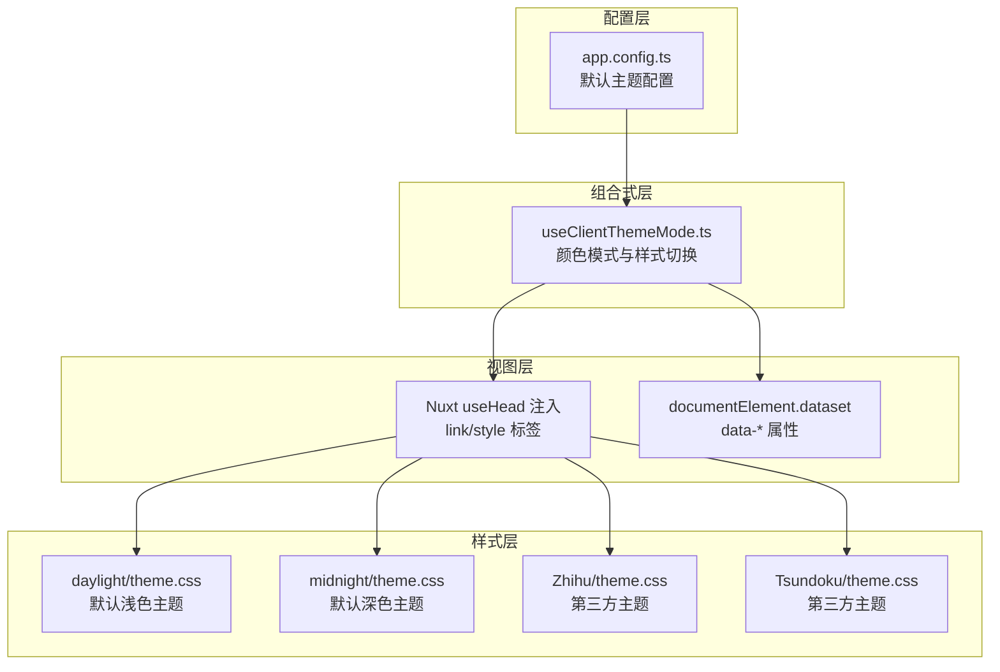
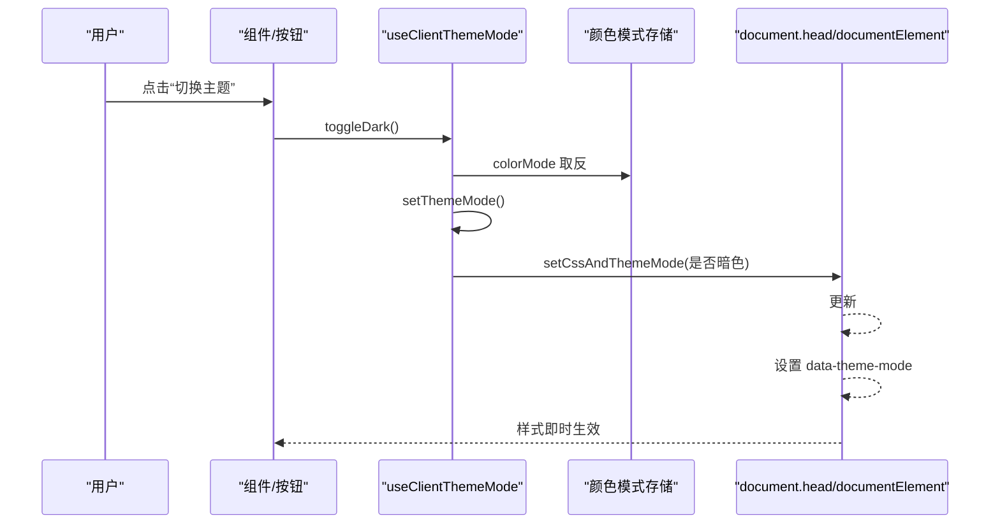
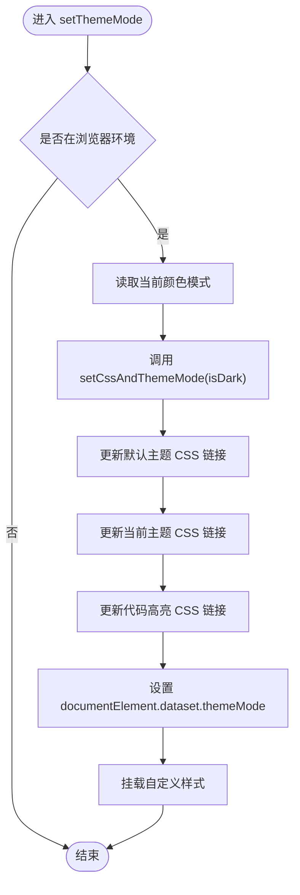
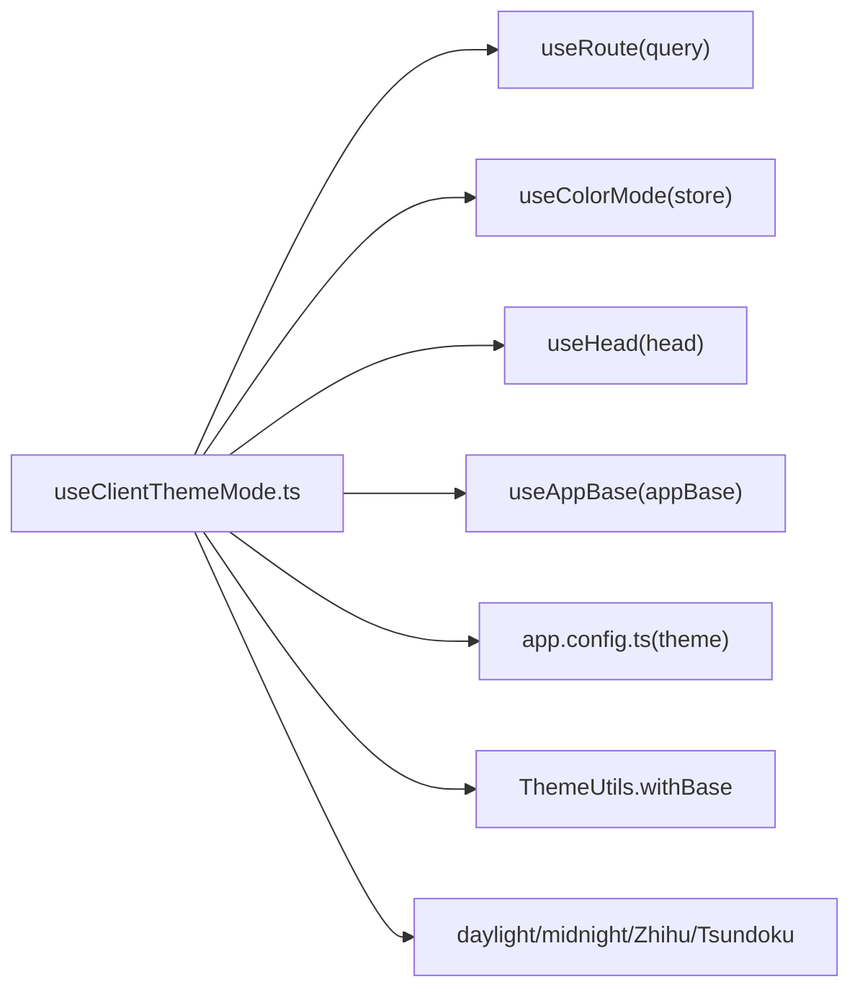

# 主题切换机制

<cite>
**本文引用的文件**
- [apps/app/composables/useClientThemeMode.ts](file://apps/app/composables/useClientThemeMode.ts)
- [apps/app/app.config.ts](file://apps/app/app.config.ts)
- [apps/app/utils/ThemeUtils.ts](file://apps/app/utils/ThemeUtils.ts)
- [apps/app/public/resources/appearance/themes/daylight/theme.css](file://apps/app/public/resources/appearance/themes/daylight/theme.css)
- [apps/app/public/resources/appearance/themes/midnight/theme.css](file://apps/app/public/resources/appearance/themes/midnight/theme.css)
- [apps/app/public/resources/appearance/themes/Zhihu/theme.css](file://apps/app/public/resources/appearance/themes/Zhihu/theme.css)
- [apps/app/public/resources/appearance/themes/Tsundoku/theme.css](file://apps/app/public/resources/appearance/themes/Tsundoku/theme.css)
- [apps/app/components/static/Header.vue](file://apps/app/components/static/Header.vue)
- [apps/app/assets/css/theme/index.styl](file://apps/app/assets/css/theme/index.styl)
</cite>

## 目录
1. [引言](#引言)
2. [项目结构](#项目结构)
3. [核心组件](#核心组件)
4. [架构总览](#架构总览)
5. [详细组件分析](#详细组件分析)
6. [依赖关系分析](#依赖关系分析)
7. [性能考虑](#性能考虑)
8. [故障排除指南](#故障排除指南)
9. [结论](#结论)

## 引言
本文件面向“主题切换机制”的技术实现，围绕用户交互触发、状态管理、DOM 更新与样式重载等环节进行系统化梳理。重点解析组合式函数 useClientThemeMode 中的切换逻辑、setThemeMode 与 setCssAndThemeMode 的样式更新机制，并给出性能优化策略、缓存与回退处理建议，以及调试与排障方法。

## 项目结构
本项目的主题系统由“配置驱动 + 组合式函数 + 运行时 DOM 注入”构成：
- 配置层：应用配置文件定义默认主题模式、明暗主题名与版本号等。
- 组合式层：useClientThemeMode 负责读取配置、维护颜色模式状态、注入/更新样式资源。
- 样式层：内置默认主题（白天/黑夜）与多套第三方主题（如 Zhihu、Tsundoku），通过 CSS 变量与选择器实现明暗适配。
- 视图层：组件在构建阶段或挂载阶段根据当前模式注入 head 标签与自定义样式。

图表来源
- [apps/app/composables/useClientThemeMode.ts:57-97](file://apps/app/composables/useClientThemeMode.ts#L57-L97)
- [apps/app/app.config.ts:85-90](file://apps/app/app.config.ts#L85-L90)
- [apps/app/public/resources/appearance/themes/daylight/theme.css:1-224](file://apps/app/public/resources/appearance/themes/daylight/theme.css#L1-L224)
- [apps/app/public/resources/appearance/themes/midnight/theme.css:1-224](file://apps/app/public/resources/appearance/themes/midnight/theme.css#L1-L224)
- [apps/app/public/resources/appearance/themes/Zhihu/theme.css:1-319](file://apps/app/public/resources/appearance/themes/Zhihu/theme.css#L1-L319)
- [apps/app/public/resources/appearance/themes/Tsundoku/theme.css:1-800](file://apps/app/public/resources/appearance/themes/Tsundoku/theme.css#L1-L800)

章节来源
- [apps/app/composables/useClientThemeMode.ts:23-97](file://apps/app/composables/useClientThemeMode.ts#L23-L97)
- [apps/app/app.config.ts:26-91](file://apps/app/app.config.ts#L26-L91)

## 核心组件
- useClientThemeMode：负责颜色模式的读取与写入、主题资源注入与动态切换、自定义样式的挂载。
- app.config：提供主题模式、明/暗主题名、主题版本号等默认值。
- ThemeUtils：提供资源路径拼接能力（withBase）。
- 多套主题 CSS：daylight/midnight 为默认主题，Zhihu/Tsundoku 等为第三方主题，均通过 CSS 变量与选择器实现明暗适配。

章节来源
- [apps/app/composables/useClientThemeMode.ts:23-158](file://apps/app/composables/useClientThemeMode.ts#L23-L158)
- [apps/app/app.config.ts:26-91](file://apps/app/app.config.ts#L26-L91)
- [apps/app/utils/ThemeUtils.ts:18-38](file://apps/app/utils/ThemeUtils.ts#L18-L38)

## 架构总览
主题切换的端到端流程如下：
- 用户交互触发：调用 toggleDark 切换颜色模式。
- 状态管理：通过 colorMode 计算属性读写底层 store（暗/亮）。
- DOM 更新与样式重载：setThemeMode -> setCssAndThemeMode 动态更新 link 标签的 href 与 documentElement.dataset，同时挂载自定义样式。
- 样式生效：CSS 变量与选择器根据 data-theme-mode 生效，第三方主题通过 @import 或模块化 CSS 实现。

图表来源
- [apps/app/composables/useClientThemeMode.ts:46-111](file://apps/app/composables/useClientThemeMode.ts#L46-L111)
- [apps/app/composables/useClientThemeMode.ts:114-141](file://apps/app/composables/useClientThemeMode.ts#L114-L141)

## 详细组件分析

### useClientThemeMode 组合式函数
- 颜色模式状态
  - 使用颜色模式存储与计算属性，将底层 store 的“dark/ light”映射为布尔值，便于模板与逻辑使用。
- 主题资源注入
  - 在构建阶段通过 useHead 注入默认主题与第三方主题的 CSS 链接，以及代码高亮样式。
  - 注入的链接带有版本参数，用于缓存控制与强制刷新。
- 切换逻辑
  - toggleDark：翻转颜色模式并调用 setThemeMode。
  - setThemeMode：仅在浏览器环境执行，委托给 setCssAndThemeMode 完成样式更新。
- 样式更新机制
  - setCssAndThemeMode：定位并更新三类样式资源的 href（默认主题、当前主题、代码高亮），设置 documentElement.dataset.themeMode，最后挂载自定义样式。
  - setCustomCss：遍历配置中的自定义 CSS，动态创建 style 标签插入 head。

图表来源
- [apps/app/composables/useClientThemeMode.ts:103-141](file://apps/app/composables/useClientThemeMode.ts#L103-L141)

章节来源
- [apps/app/composables/useClientThemeMode.ts:35-48](file://apps/app/composables/useClientThemeMode.ts#L35-L48)
- [apps/app/composables/useClientThemeMode.ts:103-141](file://apps/app/composables/useClientThemeMode.ts#L103-L141)

### 主题资源与明暗适配
- 默认主题
  - daylight：浅色主题，包含大量 CSS 变量与针对不同语言的字体适配。
  - midnight：深色主题，变量值与浅色版互补，适配夜间阅读。
- 第三方主题
  - Zhihu：通过 html[data-theme-mode] 选择器在明/暗模式下覆盖关键变量，实现双模式适配。
  - Tsundoku：采用模块化 CSS 与 @import 组织，主题变量集中于根节点，明暗模式通过选择器覆盖。
- 资源注入策略
  - useHead 在构建阶段注入默认与第三方主题 CSS 链接；若第三方主题与默认相同则跳过注入，避免冗余请求。

章节来源
- [apps/app/public/resources/appearance/themes/daylight/theme.css:1-224](file://apps/app/public/resources/appearance/themes/daylight/theme.css#L1-L224)
- [apps/app/public/resources/appearance/themes/midnight/theme.css:1-224](file://apps/app/public/resources/appearance/themes/midnight/theme.css#L1-L224)
- [apps/app/public/resources/appearance/themes/Zhihu/theme.css:46-61](file://apps/app/public/resources/appearance/themes/Zhihu/theme.css#L46-L61)
- [apps/app/public/resources/appearance/themes/Tsundoku/theme.css:1-800](file://apps/app/public/resources/appearance/themes/Tsundoku/theme.css#L1-L800)
- [apps/app/composables/useClientThemeMode.ts:57-97](file://apps/app/composables/useClientThemeMode.ts#L57-L97)

### 配置与工具
- app.config
  - 定义主题模式（系统/暗/亮）、明/暗主题名称、主题版本号等。
  - 提供自定义 CSS 列表，用于运行时动态挂载。
- ThemeUtils
  - 提供 withBase(path, setting) 将相对路径与站点基础路径拼接，保证资源引用正确。

章节来源
- [apps/app/app.config.ts:26-91](file://apps/app/app.config.ts#L26-L91)
- [apps/app/utils/ThemeUtils.ts:18-38](file://apps/app/utils/ThemeUtils.ts#L18-L38)

### 视图层联动
- Header 组件在构建阶段引入主题样式入口，配合 useHead 注入的 CSS 共同生效。
- 样式入口文件通过 @import 引入调色板与主题主样式，确保组件样式一致。

章节来源
- [apps/app/components/static/Header.vue:55-56](file://apps/app/components/static/Header.vue#L55-L56)
- [apps/app/assets/css/theme/index.styl:1-4](file://apps/app/assets/css/theme/index.styl#L1-L4)

## 依赖关系分析
- 组合式函数依赖
  - useRoute：从查询参数读取 lightTheme、darkTheme、themeVersion，作为主题切换的优先来源。
  - useColorMode：提供底层颜色模式存储与读写。
  - useHead：向 head 注入 CSS 链接与自定义样式。
  - useAppBase：提供站点基础路径，用于拼接资源 URL。
- 样式依赖
  - 默认主题与第三方主题均依赖 CSS 变量与选择器，通过 data-theme-mode 或 html[data-theme-mode] 实现明暗切换。
- 组件依赖
  - Header 组件在构建阶段引入主题样式入口，确保首屏样式一致性。

图表来源
- [apps/app/composables/useClientThemeMode.ts:23-97](file://apps/app/composables/useClientThemeMode.ts#L23-L97)
- [apps/app/app.config.ts:85-90](file://apps/app/app.config.ts#L85-L90)
- [apps/app/utils/ThemeUtils.ts:22-34](file://apps/app/utils/ThemeUtils.ts#L22-L34)

章节来源
- [apps/app/composables/useClientThemeMode.ts:23-97](file://apps/app/composables/useClientThemeMode.ts#L23-L97)
- [apps/app/app.config.ts:26-91](file://apps/app/app.config.ts#L26-L91)

## 性能考虑
- 缓存与版本控制
  - 主题 CSS 与高亮样式均附加版本参数，便于浏览器缓存与强制刷新控制。
  - 建议在主题升级时更新版本号，避免旧缓存导致样式异常。
- 避免重复注入
  - 当第三方主题与默认主题一致时，跳过注入以减少网络请求。
- 动态更新最小化
  - setCssAndThemeMode 仅更新必要的 link 标签 href 与 dataset，尽量避免全量重绘。
- 自定义样式挂载
  - 自定义 CSS 通过动态 style 标签挂载，注意数量与体积，避免影响首屏渲染。

章节来源
- [apps/app/composables/useClientThemeMode.ts:64-88](file://apps/app/composables/useClientThemeMode.ts#L64-L88)
- [apps/app/composables/useClientThemeMode.ts:114-141](file://apps/app/composables/useClientThemeMode.ts#L114-L141)

## 故障排除指南
- 症状：切换主题后样式未生效
  - 排查步骤
    - 确认浏览器环境判断逻辑已执行（仅在浏览器端更新样式）。
    - 检查 documentElement.dataset.themeMode 是否已更新为目标模式。
    - 核对 useHead 注入的 CSS 链接是否正确，确认 href 已更新为当前主题。
    - 若使用第三方主题，确认主题 CSS 中是否存在基于 data-theme-mode 的覆盖规则。
- 症状：高亮样式未随主题切换
  - 排查步骤
    - 检查代码高亮 CSS 链接是否被正确更新。
    - 确认高亮库样式与主题 CSS 的加载顺序，避免后者覆盖前者。
- 症状：自定义样式丢失
  - 排查步骤
    - 确认 setCustomCss 是否被执行。
    - 检查自定义 CSS 列表是否正确传入，style 标签是否成功插入 head。
- 症状：默认主题与第三方主题冲突
  - 排查步骤
    - 检查 useHead 注入条件，避免重复注入相同主题。
    - 确认第三方主题 CSS 的选择器优先级，必要时提升权重或调整覆盖方式。

章节来源
- [apps/app/composables/useClientThemeMode.ts:103-141](file://apps/app/composables/useClientThemeMode.ts#L103-L141)
- [apps/app/composables/useClientThemeMode.ts:143-154](file://apps/app/composables/useClientThemeMode.ts#L143-L154)

## 结论
本主题切换机制以配置驱动与组合式函数为核心，结合 useHead 与 DOM 操作实现运行时样式切换。通过 CSS 变量与选择器，系统在默认主题与第三方主题之间平滑切换，并支持自定义样式扩展。为获得最佳体验，建议合理使用版本参数与缓存策略，避免重复注入与过度 DOM 操作，并在第三方主题适配中关注选择器优先级与加载顺序。