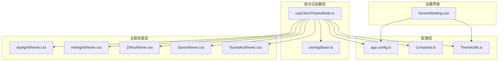
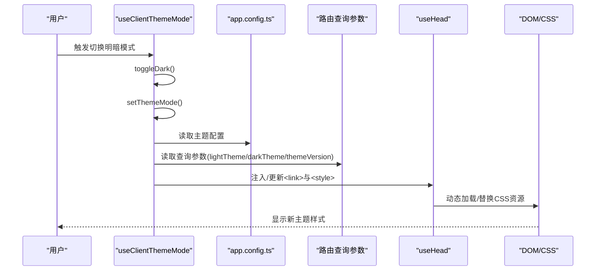
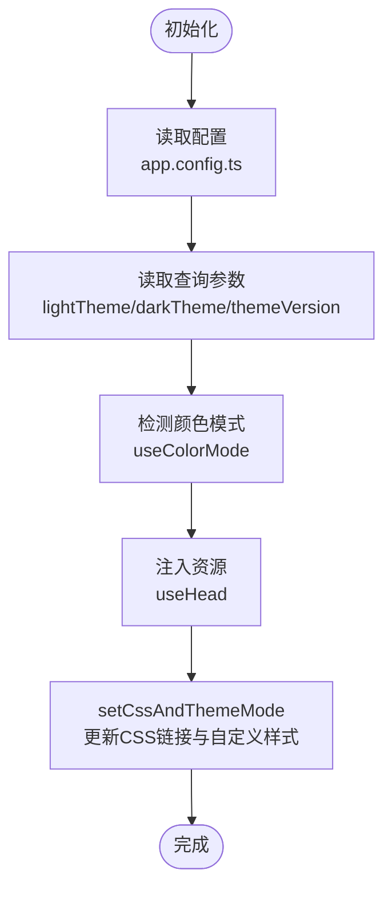
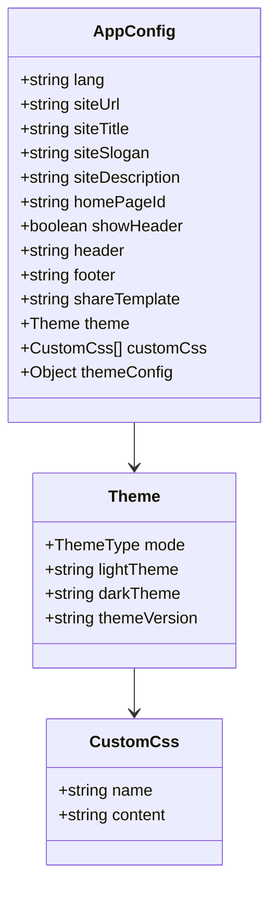
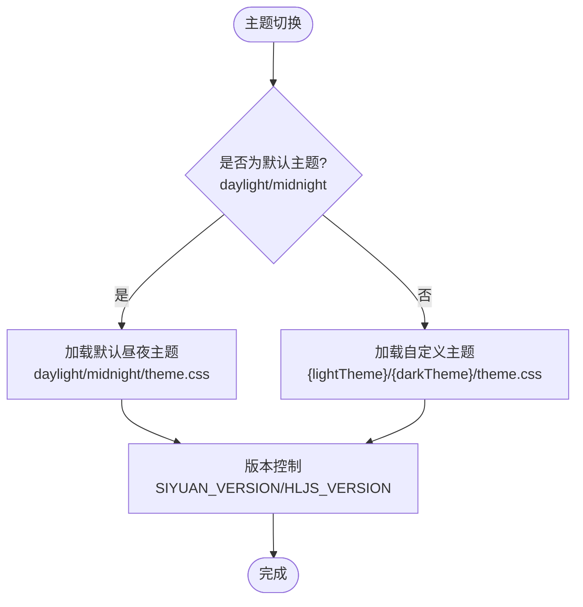
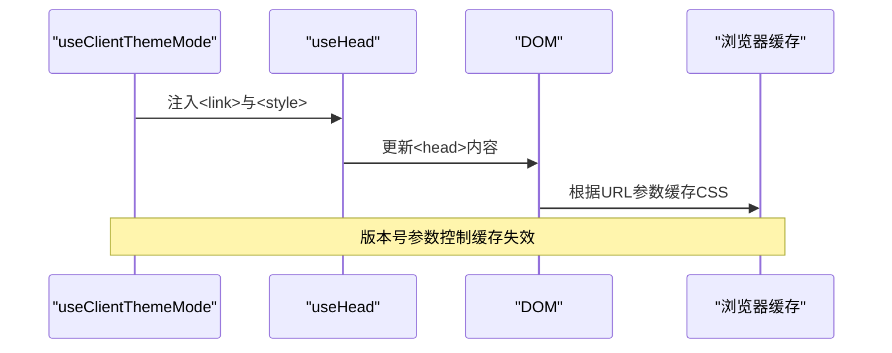
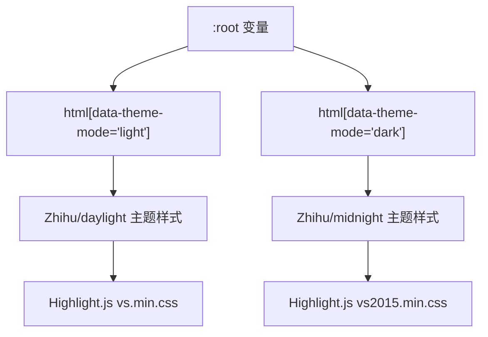
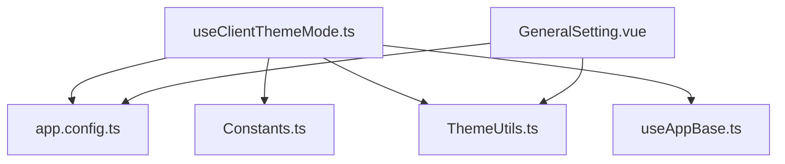

# 主题架构设计

<cite>
**本文档引用的文件**
- [useClientThemeMode.ts](file://apps/app/composables/useClientThemeMode.ts)
- [app.config.ts](file://apps/app/app.config.ts)
- [Constants.ts](file://apps/app/utils/Constants.ts)
- [ThemeUtils.ts](file://apps/app/utils/ThemeUtils.ts)
- [useAppBase.ts](file://apps/app/composables/useAppBase.ts)
- [GeneralSetting.vue](file://apps/siyuan/src/pages/Setting/GeneralSetting.vue)
- [ThemeUtils.ts（siyuan）](file://apps/siyuan/src/app.config.ts)
- [daylight/theme.css](file://apps/app/public/resources/appearance/themes/daylight/theme.css)
- [midnight/theme.css](file://apps/app/public/resources/appearance/themes/midnight/theme.css)
- [Zhihu/theme.css](file://apps/app/public/resources/appearance/themes/Zhihu/theme.css)
- [Savor/theme.css](file://apps/app/public/resources/appearance/themes/Savor/theme.css)
- [Tsundoku/theme.css](file://apps/app/public/resources/appearance/themes/Tsundoku/theme.css)
</cite>

## 目录
1. [简介](#简介)
2. [项目结构](#项目结构)
3. [核心组件](#核心组件)
4. [架构总览](#架构总览)
5. [详细组件分析](#详细组件分析)
6. [依赖关系分析](#依赖关系分析)
7. [性能考虑](#性能考虑)
8. [故障排除指南](#故障排除指南)
9. [结论](#结论)

## 简介
本技术文档围绕 Siyuan 笔记本插件博客应用的主题架构展开，重点阐释主题切换机制、主题配置数据结构、样式加载与缓存策略，以及 useClientThemeMode 组合式函数的实现逻辑。文档还涵盖主题版本管理、主题回退策略与浏览器兼容性处理等关键技术点，并提供最佳实践与性能优化建议，帮助开发者在复杂主题生态下实现稳定、可维护且高性能的主题系统。

## 项目结构
主题系统主要分布在以下模块：
- 组合式函数层：useClientThemeMode 负责主题模式检测、动态资源加载与 CSS 注入
- 配置层：app.config.ts 定义主题配置结构，包含模式、明暗主题名称与版本号
- 工具层：Constants.ts 提供版本常量，ThemeUtils.ts 提供路径拼接工具，useAppBase.ts 提供基础路径
- 主题资源层：public/resources/appearance/themes 下包含多个主题目录及默认昼夜主题
- 设置界面：GeneralSetting.vue 提供主题选择与版本映射配置入口

**图表来源**
- [useClientThemeMode.ts:1-158](file://apps/app/composables/useClientThemeMode.ts#L1-158)
- [useAppBase.ts:16-21](file://apps/app/composables/useAppBase.ts#L16-21)
- [app.config.ts:28-91](file://apps/app/app.config.ts#L28-91)
- [Constants.ts:15-17](file://apps/app/utils/Constants.ts#L15-17)
- [ThemeUtils.ts:18-37](file://apps/app/utils/ThemeUtils.ts#L18-37)
- [GeneralSetting.vue:25-118](file://apps/siyuan/src/pages/Setting/GeneralSetting.vue#L25-118)
- [daylight/theme.css:1-224](file://apps/app/public/resources/appearance/themes/daylight/theme.css#L1-224)
- [midnight/theme.css:1-224](file://apps/app/public/resources/appearance/themes/midnight/theme.css#L1-224)
- [Zhihu/theme.css:26-61](file://apps/app/public/resources/appearance/themes/Zhihu/theme.css#L26-61)
- [Savor/theme.css:73-128](file://apps/app/public/resources/appearance/themes/Savor/theme.css#L73-128)
- [Tsundoku/theme.css:32-226](file://apps/app/public/resources/appearance/themes/Tsundoku/theme.css#L32-226)

**章节来源**
- [useClientThemeMode.ts:1-158](file://apps/app/composables/useClientThemeMode.ts#L1-158)
- [app.config.ts:28-91](file://apps/app/app.config.ts#L28-91)
- [Constants.ts:15-17](file://apps/app/utils/Constants.ts#L15-17)
- [ThemeUtils.ts:18-37](file://apps/app/utils/ThemeUtils.ts#L18-37)
- [useAppBase.ts:16-21](file://apps/app/composables/useAppBase.ts#L16-21)
- [GeneralSetting.vue:25-118](file://apps/siyuan/src/pages/Setting/GeneralSetting.vue#L25-118)

## 核心组件
- useClientThemeMode：负责主题模式检测、主题资源动态加载与 CSS 注入，支持明暗主题切换与版本控制
- app.config.ts：定义主题配置结构，包含模式、明暗主题名称与版本号
- Constants.ts：提供 Siyuan 与 Highlight.js 版本常量，用于资源缓存控制
- ThemeUtils.ts：提供路径拼接工具，确保资源路径正确
- useAppBase.ts：提供基础路径，便于在不同部署环境下正确加载资源
- GeneralSetting.vue：提供主题选择与版本映射配置入口，支持用户自定义主题

**章节来源**
- [useClientThemeMode.ts:23-157](file://apps/app/composables/useClientThemeMode.ts#L23-157)
- [app.config.ts:28-91](file://apps/app/app.config.ts#L28-91)
- [Constants.ts:15-17](file://apps/app/utils/Constants.ts#L15-17)
- [ThemeUtils.ts:18-37](file://apps/app/utils/ThemeUtils.ts#L18-37)
- [useAppBase.ts:16-21](file://apps/app/composables/useAppBase.ts#L16-21)
- [GeneralSetting.vue:25-118](file://apps/siyuan/src/pages/Setting/GeneralSetting.vue#L25-118)

## 架构总览
主题系统采用“配置驱动 + 动态资源加载”的架构。核心流程如下：
- 初始化阶段：读取 app.config.ts 中的主题配置，结合路由查询参数与运行时环境，确定当前主题模式与主题资源
- 资源加载阶段：通过 useHead 注入默认昼夜主题与当前主题的 CSS，同时根据模式注入代码高亮样式
- 运行时切换：当用户切换明暗模式时，调用 setThemeMode 并更新 CSS 链接与自定义样式
- 版本控制：通过版本号参数控制资源缓存，避免浏览器缓存导致的主题样式不一致

**图表来源**
- [useClientThemeMode.ts:46-111](file://apps/app/composables/useClientThemeMode.ts#L46-111)
- [app.config.ts:85-90](file://apps/app/app.config.ts#L85-90)
- [GeneralSetting.vue:95-118](file://apps/siyuan/src/pages/Setting/GeneralSetting.vue#L95-118)

**章节来源**
- [useClientThemeMode.ts:23-157](file://apps/app/composables/useClientThemeMode.ts#L23-157)
- [app.config.ts:85-90](file://apps/app/app.config.ts#L85-90)
- [GeneralSetting.vue:95-118](file://apps/siyuan/src/pages/Setting/GeneralSetting.vue#L95-118)

## 详细组件分析

### useClientThemeMode 组合式函数
该函数是主题系统的核心，负责：
- 颜色模式检测与双向绑定：基于 @vueuse/core 的 useColorMode，提供 computed 属性 colorMode 与 toggleDark 方法
- 主题资源动态加载：通过 useHead 注入默认昼夜主题与当前主题的 CSS，同时根据模式注入代码高亮样式
- CSS 样式注入机制：在 setCssAndThemeMode 中更新 CSS 链接与自定义样式，确保运行时切换即时生效
- 版本控制：通过 Constants.ts 中的版本号参数控制资源缓存，避免浏览器缓存导致的主题样式不一致

**图表来源**
- [useClientThemeMode.ts:23-157](file://apps/app/composables/useClientThemeMode.ts#L23-157)
- [Constants.ts:15-17](file://apps/app/utils/Constants.ts#L15-17)

**章节来源**
- [useClientThemeMode.ts:23-157](file://apps/app/composables/useClientThemeMode.ts#L23-157)
- [Constants.ts:15-17](file://apps/app/utils/Constants.ts#L15-17)

### 主题配置数据结构
主题配置位于 app.config.ts，包含以下关键字段：
- mode：主题模式（system/light/dark）
- lightTheme：浅色主题名称
- darkTheme：深色主题名称
- themeVersion：主题版本号
- customCss：自定义 CSS 数组，包含 name 与 content

**图表来源**
- [app.config.ts:28-72](file://apps/app/app.config.ts#L28-72)

**章节来源**
- [app.config.ts:28-72](file://apps/app/app.config.ts#L28-72)

### 主题版本管理与回退策略
- 版本管理：通过 Constants.ts 中的 SIYUAN_VERSION 与 HLJS_VERSION 控制资源缓存，确保主题与编辑器版本匹配
- 回退策略：当 lightTheme 或 darkTheme 为 daylight/midnight 时，仅加载默认昼夜主题；否则加载对应主题的 theme.css
- 版本映射：GeneralSetting.vue 中维护主题到版本的映射表，确保用户选择的主题与版本一致

**图表来源**
- [useClientThemeMode.ts:70-87](file://apps/app/composables/useClientThemeMode.ts#L70-87)
- [Constants.ts:15-17](file://apps/app/utils/Constants.ts#L15-17)
- [GeneralSetting.vue:84-92](file://apps/siyuan/src/pages/Setting/GeneralSetting.vue#L84-92)

**章节来源**
- [useClientThemeMode.ts:70-87](file://apps/app/composables/useClientThemeMode.ts#L70-87)
- [Constants.ts:15-17](file://apps/app/utils/Constants.ts#L15-17)
- [GeneralSetting.vue:84-92](file://apps/siyuan/src/pages/Setting/GeneralSetting.vue#L84-92)

### 样式加载与缓存策略
- 动态注入：通过 useHead 在 <head> 中动态注入 CSS 链接与内联样式，支持运行时切换
- 缓存控制：在 CSS 链接后追加版本号参数，避免浏览器缓存导致的主题样式不一致
- 自定义样式：通过 setCustomCss 动态创建 <style> 标签，将自定义 CSS 注入到页面头部

**图表来源**
- [useClientThemeMode.ts:57-97](file://apps/app/composables/useClientThemeMode.ts#L57-97)
- [Constants.ts:15-17](file://apps/app/utils/Constants.ts#L15-17)

**章节来源**
- [useClientThemeMode.ts:57-97](file://apps/app/composables/useClientThemeMode.ts#L57-97)
- [Constants.ts:15-17](file://apps/app/utils/Constants.ts#L15-17)

### 浏览器兼容性处理
- CSS 变量：主题样式大量使用 CSS 变量，通过 :root 与 html[data-theme-mode="..."] 实现明暗主题切换
- 字体与图标：主题通过 @import 引入字体与图标资源，确保跨平台一致性
- 代码高亮：根据模式动态加载不同版本的 Highlight.js 样式文件

**图表来源**
- [Zhihu/theme.css:46-61](file://apps/app/public/resources/appearance/themes/Zhihu/theme.css#L46-61)
- [daylight/theme.css:1-224](file://apps/app/public/resources/appearance/themes/daylight/theme.css#L1-224)
- [midnight/theme.css:1-224](file://apps/app/public/resources/appearance/themes/midnight/theme.css#L1-224)
- [useClientThemeMode.ts:82-87](file://apps/app/composables/useClientThemeMode.ts#L82-87)

**章节来源**
- [Zhihu/theme.css:46-61](file://apps/app/public/resources/appearance/themes/Zhihu/theme.css#L46-61)
- [daylight/theme.css:1-224](file://apps/app/public/resources/appearance/themes/daylight/theme.css#L1-224)
- [midnight/theme.css:1-224](file://apps/app/public/resources/appearance/themes/midnight/theme.css#L1-224)
- [useClientThemeMode.ts:82-87](file://apps/app/composables/useClientThemeMode.ts#L82-87)

## 依赖关系分析
主题系统的关键依赖关系如下：
- useClientThemeMode 依赖 app.config.ts、Constants.ts、ThemeUtils.ts、useAppBase.ts
- ThemeUtils 提供路径拼接能力，确保资源路径在不同部署环境下正确
- GeneralSetting.vue 与 app.config.ts 协同，提供主题选择与版本映射配置

**图表来源**
- [useClientThemeMode.ts:10-15](file://apps/app/composables/useClientThemeMode.ts#L10-15)
- [app.config.ts:28-91](file://apps/app/app.config.ts#L28-91)
- [ThemeUtils.ts:18-37](file://apps/app/utils/ThemeUtils.ts#L18-37)
- [useAppBase.ts:16-21](file://apps/app/composables/useAppBase.ts#L16-21)
- [GeneralSetting.vue:25-118](file://apps/siyuan/src/pages/Setting/GeneralSetting.vue#L25-118)

**章节来源**
- [useClientThemeMode.ts:10-15](file://apps/app/composables/useClientThemeMode.ts#L10-15)
- [app.config.ts:28-91](file://apps/app/app.config.ts#L28-91)
- [ThemeUtils.ts:18-37](file://apps/app/utils/ThemeUtils.ts#L18-37)
- [useAppBase.ts:16-21](file://apps/app/composables/useAppBase.ts#L16-21)
- [GeneralSetting.vue:25-118](file://apps/siyuan/src/pages/Setting/GeneralSetting.vue#L25-118)

## 性能考虑
- 资源缓存：通过版本号参数控制 CSS 缓存，避免浏览器缓存导致的主题样式不一致
- 动态加载：仅在运行时按需加载主题 CSS，减少初始加载体积
- CSS 变量：使用 CSS 变量实现明暗主题切换，避免重复定义样式
- 自定义样式注入：通过动态创建 <style> 标签注入自定义样式，避免额外网络请求

## 故障排除指南
- 主题切换无效：检查 useClientThemeMode 中的 setThemeMode 与 setCssAndThemeMode 是否正确执行，确认 CSS 链接已更新
- 版本不匹配：确认 Constants.ts 中的 SIYUAN_VERSION 与 HLJS_VERSION 与实际环境一致
- 路径错误：使用 ThemeUtils.withBase 确保资源路径在不同部署环境下正确
- 自定义样式未生效：检查 setCustomCss 是否正确创建并插入 <style> 标签

**章节来源**
- [useClientThemeMode.ts:103-154](file://apps/app/composables/useClientThemeMode.ts#L103-154)
- [Constants.ts:15-17](file://apps/app/utils/Constants.ts#L15-17)
- [ThemeUtils.ts:18-37](file://apps/app/utils/ThemeUtils.ts#L18-37)

## 结论
本主题架构通过配置驱动与动态资源加载实现了灵活的主题切换与版本控制。useClientThemeMode 作为核心组合式函数，提供了完整的主题切换机制与样式注入能力；app.config.ts 与 Constants.ts 确保了配置与版本的一致性；ThemeUtils 与 useAppBase 提供了可靠的路径拼接与基础路径支持。通过合理的缓存策略与浏览器兼容性处理，系统在保证用户体验的同时具备良好的可维护性与扩展性。