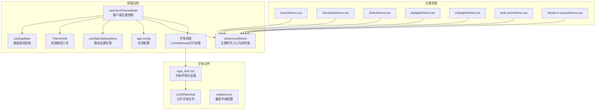
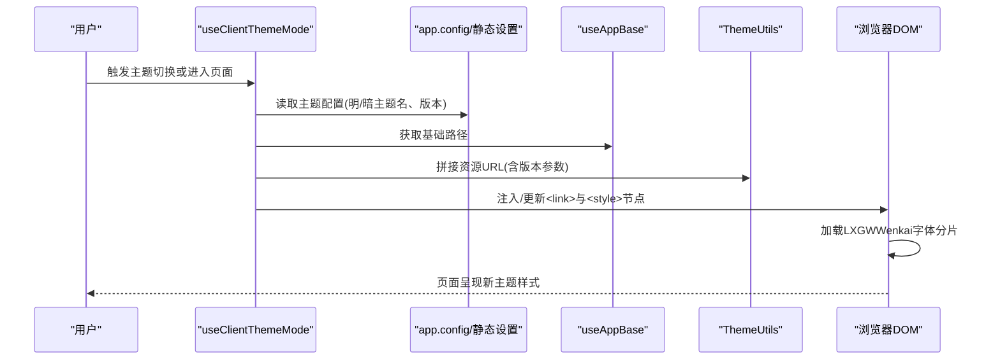
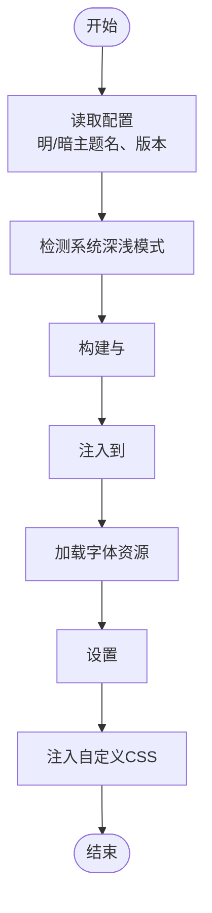
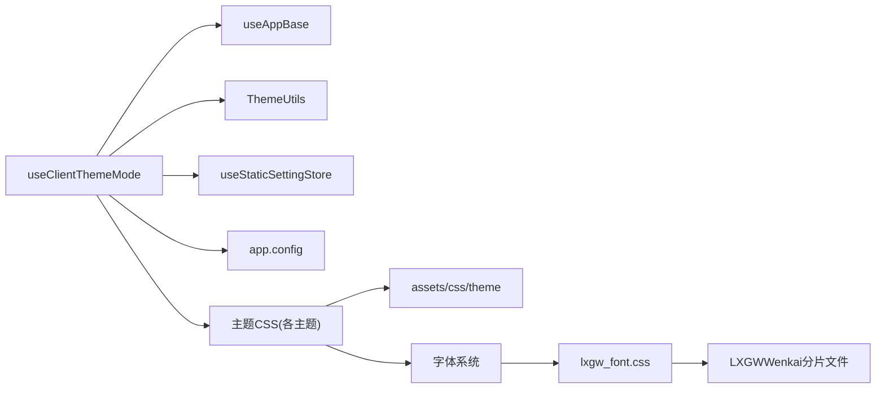

# 主题系统

<cite>
**本文档引用的文件**
- [apps/app/composables/useClientThemeMode.ts](file://apps/app/composables/useClientThemeMode.ts)
- [apps/app/utils/ThemeUtils.ts](file://apps/app/utils/ThemeUtils.ts)
- [apps/app/stores/useStaticSettingStore.ts](file://apps/app/stores/useStaticSettingStore.ts)
- [apps/app/app.config.ts](file://apps/app/app.config.ts)
- [apps/app/composables/useAppBase.ts](file://apps/app/composables/useAppBase.ts)
- [apps/app/assets/css/theme/index.styl](file://apps/app/assets/css/theme/index.styl)
- [apps/app/assets/css/theme/palette.styl](file://apps/app/assets/css/theme/palette.styl)
- [apps/app/public/libs/fonts/lxgw_font.css](file://apps/app/public/libs/fonts/lxgw_font.css)
- [apps/app/public/libs/fonts/webfont.css](file://apps/app/public/libs/fonts/webfont.css)
- [apps/app/public/resources/appearance/themes/Savor/theme.css](file://apps/app/public/resources/appearance/themes/Savor/theme.css)
- [apps/app/public/resources/appearance/themes/Tsundoku/theme.css](file://apps/app/public/resources/appearance/themes/Tsundoku/theme.css)
- [apps/app/public/resources/appearance/themes/Zhihu/theme.css](file://apps/app/public/resources/appearance/themes/Zhihu/theme.css)
- [apps/app/public/resources/appearance/themes/daylight/theme.css](file://apps/app/public/resources/appearance/themes/daylight/theme.css)
- [apps/app/public/resources/appearance/themes/midnight/theme.css](file://apps/app/public/resources/appearance/themes/midnight/theme.css)
- [apps/app/public/resources/appearance/themes/pink-room/theme.css](file://apps/app/public/resources/appearance/themes/pink-room/theme.css)
- [apps/app/public/resources/appearance/themes/trends-in-siyuan/theme.css](file://apps/app/public/resources/appearance/themes/trends-in-siyuan/theme.css)
</cite>

## 更新摘要
**所做更改**
- 新增字体系统重构章节，详细说明LXGWWenkai字体加载机制
- 更新主题CSS字体配置，反映字体文件优化和加载策略
- 添加字体文件组织结构和Unicode范围优化说明
- 更新预设主题的字体配置实现

## 目录
1. [引言](#引言)
2. [项目结构](#项目结构)
3. [核心组件](#核心组件)
4. [架构总览](#架构总览)
5. [详细组件分析](#详细组件分析)
6. [字体系统重构](#字体系统重构)
7. [依赖关系分析](#依赖关系分析)
8. [性能考量](#性能考量)
9. [故障排查指南](#故障排查指南)
10. [结论](#结论)
11. [附录](#附录)

## 引言
本技术文档围绕 Siyuan 笔记插件中的"主题系统"展开，系统性阐述主题架构设计、主题切换机制、主题配置管理与样式加载流程。特别关注字体系统重构后的LXGWWenkai字体加载机制、字体文件优化策略以及主题CSS的相应调整。同时，对预设主题（Savor、Tsundoku、Zhihu、daylight、midnight、pink-room、trends-in-siyuan）的功能特性与适用场景进行说明，并提供自定义主题的开发流程、样式编写规范、资源组织方式与打包发布的实践建议。最后给出主题切换的操作指南与最佳实践。

## 项目结构
主题系统主要由以下部分组成：
- 客户端主题控制与动态样式加载：位于应用前端，负责根据用户偏好与系统模式动态注入/切换主题 CSS 与代码高亮样式。
- 主题资源目录：集中存放各主题的 CSS 与模块化样式文件，支持按需导入与组合。
- 字体系统：包含LXGWWenkai字体的分片加载、字体文件优化和字体栈配置。
- 配置与存储：应用配置与静态设置存储，用于读取主题默认值与版本信息。
- 工具与路径：提供资源路径拼接与基础路径处理能力。

**图表来源**
- [apps/app/composables/useClientThemeMode.ts:1-158](file://apps/app/composables/useClientThemeMode.ts#L1-L158)
- [apps/app/composables/useAppBase.ts:1-22](file://apps/app/composables/useAppBase.ts#L1-L22)
- [apps/app/utils/ThemeUtils.ts:1-38](file://apps/app/utils/ThemeUtils.ts#L1-L38)
- [apps/app/stores/useStaticSettingStore.ts:1-28](file://apps/app/stores/useStaticSettingStore.ts#L1-L28)
- [apps/app/app.config.ts:1-92](file://apps/app/app.config.ts#L1-L92)
- [apps/app/assets/css/theme/index.styl:1-4](file://apps/app/assets/css/theme/index.styl#L1-L4)
- [apps/app/assets/css/theme/palette.styl:1-52](file://apps/app/assets/css/theme/palette.styl#L1-L52)
- [apps/app/public/libs/fonts/lxgw_font.css:1-784](file://apps/app/public/libs/fonts/lxgw_font.css#L1-L784)
- [apps/app/public/libs/fonts/webfont.css:1-7](file://apps/app/public/libs/fonts/webfont.css#L1-L7)

**章节来源**
- [apps/app/composables/useClientThemeMode.ts:1-158](file://apps/app/composables/useClientThemeMode.ts#L1-L158)
- [apps/app/composables/useAppBase.ts:1-22](file://apps/app/composables/useAppBase.ts#L1-L22)
- [apps/app/utils/ThemeUtils.ts:1-38](file://apps/app/utils/ThemeUtils.ts#L1-L38)
- [apps/app/stores/useStaticSettingStore.ts:1-28](file://apps/app/stores/useStaticSettingStore.ts#L1-L28)
- [apps/app/app.config.ts:1-92](file://apps/app/app.config.ts#L1-L92)
- [apps/app/assets/css/theme/index.styl:1-4](file://apps/app/assets/css/theme/index.styl#L1-L4)
- [apps/app/assets/css/theme/palette.styl:1-52](file://apps/app/assets/css/theme/palette.styl#L1-L52)

## 核心组件
- useClientThemeMode：负责主题模式检测、主题切换、动态样式注入与更新，支持明暗模式与多主题组合。
- useAppBase：提供应用基础路径，确保资源加载的正确性。
- ThemeUtils：提供带基础路径的资源拼接能力，便于在不同部署环境下正确引用静态资源。
- useStaticSettingStore：从静态配置文件读取应用设置，作为主题配置的数据来源之一。
- app.config：定义主题配置结构与默认值，包含主题模式、明暗主题名称与主题版本等字段。
- assets/css/theme：主题样式入口与调色板，提供全局变量与通用样式。
- 字体系统：包含LXGWWenkai字体的分片加载机制，通过Unicode范围优化字体文件大小。

**章节来源**
- [apps/app/composables/useClientThemeMode.ts:1-158](file://apps/app/composables/useClientThemeMode.ts#L1-L158)
- [apps/app/composables/useAppBase.ts:1-22](file://apps/app/composables/useAppBase.ts#L1-L22)
- [apps/app/utils/ThemeUtils.ts:1-38](file://apps/app/utils/ThemeUtils.ts#L1-L38)
- [apps/app/stores/useStaticSettingStore.ts:1-28](file://apps/app/stores/useStaticSettingStore.ts#L1-L28)
- [apps/app/app.config.ts:1-92](file://apps/app/app.config.ts#L1-L92)
- [apps/app/assets/css/theme/index.styl:1-4](file://apps/app/assets/css/theme/index.styl#L1-L4)
- [apps/app/assets/css/theme/palette.styl:1-52](file://apps/app/assets/css/theme/palette.styl#L1-L52)

## 架构总览
主题系统采用"配置驱动 + 动态样式注入 + 字体优化"的架构：
- 配置层：应用配置与静态设置存储提供主题默认值与版本号。
- 控制层：客户端主题控制根据系统/用户偏好与配置计算当前主题，动态注入/替换样式表。
- 资源层：主题 CSS 以模块化方式组织，按需导入，支持明暗主题与第三方高亮库样式。
- 字体层：LXGWWenkai字体采用分片加载策略，通过Unicode范围优化文件大小，提升加载性能。
- 工具层：路径工具保证在不同部署环境下的资源可访问性。

**图表来源**
- [apps/app/composables/useClientThemeMode.ts:51-97](file://apps/app/composables/useClientThemeMode.ts#L51-L97)
- [apps/app/app.config.ts:85-90](file://apps/app/app.config.ts#L85-L90)
- [apps/app/composables/useAppBase.ts:16-21](file://apps/app/composables/useAppBase.ts#L16-L21)
- [apps/app/utils/ThemeUtils.ts:18-34](file://apps/app/utils/ThemeUtils.ts#L18-L34)

## 详细组件分析

### 组件一：useClientThemeMode（主题切换与样式加载）
职责与行为：
- 读取系统深浅模式并暴露响应式状态。
- 从路由参数、应用配置与静态设置中解析当前明/暗主题名称与主题版本。
- 使用 Head 插件注入默认主题与当前主题的 CSS 链接，并按需注入代码高亮样式。
- 在浏览器端切换时，动态更新样式表链接与自定义样式节点。
- 通过 data-* 属性标记当前主题模式与主题名，供样式与脚本使用。

关键流程（切换与更新）：

**图表来源**
- [apps/app/composables/useClientThemeMode.ts:35-154](file://apps/app/composables/useClientThemeMode.ts#L35-L154)

**章节来源**
- [apps/app/composables/useClientThemeMode.ts:1-158](file://apps/app/composables/useClientThemeMode.ts#L1-L158)

### 组件二：app.config（主题配置结构）
- 定义主题类型（系统/深色/浅色）与默认主题名、主题版本。
- 支持自定义 CSS 列表，便于注入额外样式。
- 兼容扩展字段，便于后续主题相关配置扩展。

**章节来源**
- [apps/app/app.config.ts:26-91](file://apps/app/app.config.ts#L26-L91)

### 组件三：useStaticSettingStore（静态设置存储）
- 从静态配置文件读取应用设置，作为主题配置的来源之一。
- 提供异步获取接口，便于在 SSR/SSG 场景下稳定获取配置。

**章节来源**
- [apps/app/stores/useStaticSettingStore.ts:1-28](file://apps/app/stores/useStaticSettingStore.ts#L1-L28)

### 组件四：ThemeUtils（资源路径工具）
- 提供带基础路径的资源拼接方法，避免硬编码路径导致的部署问题。
- 支持在不同站点根路径下正确加载主题与资源。

**章节来源**
- [apps/app/utils/ThemeUtils.ts:1-38](file://apps/app/utils/ThemeUtils.ts#L1-L38)

### 组件五：assets/css/theme（主题样式入口与调色板）
- index.styl：引入调色板与通用模糊滤镜等基础样式。
- palette.styl：定义主题变量（颜色、布局、移动端断点等），为各主题提供统一的变量体系。

**章节来源**
- [apps/app/assets/css/theme/index.styl:1-4](file://apps/app/assets/css/theme/index.styl#L1-L4)
- [apps/app/assets/css/theme/palette.styl:1-52](file://apps/app/assets/css/theme/palette.styl#L1-L52)

### 预设主题概览与特性
- Savor
  - 特性：丰富的自定义变量与模块化样式，强调编辑器与工具栏的定制化体验。
  - 适用场景：对编辑器细节有较高定制需求的用户。
  - 关键文件：[apps/app/public/resources/appearance/themes/Savor/theme.css:1-791](file://apps/app/public/resources/appearance/themes/Savor/theme.css#L1-L791)

- Tsundoku
  - 特性：模块化导入编辑器基础块、代码块、列表转换与导出样式，强调结构清晰与可维护性。
  - 适用场景：注重内容结构与可读性的用户。
  - 关键文件：[apps/app/public/resources/appearance/themes/Tsundoku/theme.css:1-1159](file://apps/app/public/resources/appearance/themes/Tsundoku/theme.css#L1-L1159)

- Zhihu
  - 特性：基于数据主题模式的明/暗/绿主题变量，强调代码块与行内元素的视觉一致性。
  - 适用场景：追求简洁一致风格的用户。
  - 关键文件：[apps/app/public/resources/appearance/themes/Zhihu/theme.css:1-41](file://apps/app/public/resources/appearance/themes/Zhihu/theme.css#L1-L41)

- daylight
  - 特性：浅色主题的基础变量与字体适配，强调清晰与易读。
  - 适用场景：白天/浅色偏好用户。
  - 关键文件：[apps/app/public/resources/appearance/themes/daylight/theme.css:1-232](file://apps/app/public/resources/appearance/themes/daylight/theme.css#L1-L232)

- midnight
  - 特性：深色主题的基础变量与高对比度设计，强调夜间使用体验。
  - 适用场景：夜间/深色偏好用户。
  - 关键文件：[apps/app/public/resources/appearance/themes/midnight/theme.css:1-231](file://apps/app/public/resources/appearance/themes/midnight/theme.css#L1-L231)

- pink-room
  - 特性：模块化导入大量界面与元素样式，强调细节定制与面板优化。
  - 适用场景：对界面细节有深度定制需求的用户。
  - 关键文件：[apps/app/public/resources/appearance/themes/pink-room/theme.css:1-100](file://apps/app/public/resources/appearance/themes/pink-room/theme.css#L1-L100)

- trends-in-siyuan
  - 特性：模块化导入标题、引用、表格、代码等样式，强调内容排版与可读性。
  - 适用场景：注重内容排版与阅读体验的用户。
  - 关键文件：[apps/app/public/resources/appearance/themes/trends-in-siyuan/theme.css:1-200](file://apps/app/public/resources/appearance/themes/trends-in-siyuan/theme.css#L1-L200)

**章节来源**
- [apps/app/public/resources/appearance/themes/Savor/theme.css:1-791](file://apps/app/public/resources/appearance/themes/Savor/theme.css#L1-L791)
- [apps/app/public/resources/appearance/themes/Tsundoku/theme.css:1-1159](file://apps/app/public/resources/appearance/themes/Tsundoku/theme.css#L1-L1159)
- [apps/app/public/resources/appearance/themes/Zhihu/theme.css:1-41](file://apps/app/public/resources/appearance/themes/Zhihu/theme.css#L1-L41)
- [apps/app/public/resources/appearance/themes/daylight/theme.css:1-232](file://apps/app/public/resources/appearance/themes/daylight/theme.css#L1-L232)
- [apps/app/public/resources/appearance/themes/midnight/theme.css:1-231](file://apps/app/public/resources/appearance/themes/midnight/theme.css#L1-L231)
- [apps/app/public/resources/appearance/themes/pink-room/theme.css:1-100](file://apps/app/public/resources/appearance/themes/pink-room/theme.css#L1-L100)
- [apps/app/public/resources/appearance/themes/trends-in-siyuan/theme.css:1-200](file://apps/app/public/resources/appearance/themes/trends-in-siyuan/theme.css#L1-L200)

### 自定义主题开发流程
- 样式编写规范
  - 使用 CSS 变量统一管理颜色、字体与阴影等，便于主题切换与一致性。
  - 优先采用模块化组织，按"模块/功能/页面"维度拆分样式文件，便于维护与复用。
  - 遵循平台约定的命名与层级，避免与内置样式冲突。

- 主题资源组织
  - 在主题根目录下建立 style 与 module 子目录，分别放置模块化样式与通用模块。
  - 通过 theme.css 统一导入，避免重复与遗漏。
  - 如需字体或图标，统一放置于主题根目录的对应子目录，并在 theme.css 中按需引入。

- 字体配置策略
  - 优先使用系统字体栈，确保跨平台兼容性。
  - 对于中文字体，推荐使用LXGWWenkai等开源字体，注意字体文件大小优化。
  - 采用字体分片加载策略，通过Unicode范围限制字体文件大小。

- 主题打包与发布
  - 保持 theme.css 作为唯一入口，确保加载顺序与依赖关系明确。
  - 为静态资源（字体、图标、背景）提供相对路径或通过工具拼接绝对路径。
  - 在 app.config 中注册主题名称与默认版本，便于配置与版本管理。

- 最佳实践
  - 明/暗主题分离：为明/暗主题分别提供变量与样式，确保在不同模式下均具备良好可读性。
  - 性能优化：尽量减少重绘与回流，避免大范围使用复杂选择器。
  - 兼容性：考虑不同语言与字体环境，提供降级方案与回退字体。

**章节来源**
- [apps/app/assets/css/theme/palette.styl:1-52](file://apps/app/assets/css/theme/palette.styl#L1-L52)
- [apps/app/public/resources/appearance/themes/Savor/theme.css:1-791](file://apps/app/public/resources/appearance/themes/Savor/theme.css#L1-L791)
- [apps/app/public/resources/appearance/themes/Tsundoku/theme.css:1-1159](file://apps/app/public/resources/appearance/themes/Tsundoku/theme.css#L1-L1159)
- [apps/app/public/resources/appearance/themes/Zhihu/theme.css:1-41](file://apps/app/public/resources/appearance/themes/Zhihu/theme.css#L1-L41)
- [apps/app/public/resources/appearance/themes/daylight/theme.css:1-232](file://apps/app/public/resources/appearance/themes/daylight/theme.css#L1-L232)
- [apps/app/public/resources/appearance/themes/midnight/theme.css:1-231](file://apps/app/public/resources/appearance/themes/midnight/theme.css#L1-L231)
- [apps/app/public/resources/appearance/themes/pink-room/theme.css:1-100](file://apps/app/public/resources/appearance/themes/pink-room/theme.css#L1-L100)
- [apps/app/public/resources/appearance/themes/trends-in-siyuan/theme.css:1-200](file://apps/app/public/resources/appearance/themes/trends-in-siyuan/theme.css#L1-L200)

## 字体系统重构

### LXGWWenkai字体加载机制
字体系统重构的核心是LXGWWenkai字体的分片加载策略，通过Unicode范围优化字体文件大小，提升加载性能。

#### 字体文件组织结构
- 主字体文件：`lxgw_font.css` - 包含LXGWWenkai字体的完整声明
- 分片字体文件：`LXGWWenkai/` 目录下包含多个woff2格式的分片文件
- Unicode范围：每个分片文件对应特定的Unicode字符范围

#### 分片加载策略
字体系统采用Unicode范围分片加载，将庞大的中文字体文件分割为多个小文件：
- 每个分片文件包含特定Unicode范围的字符
- 浏览器按需加载所需字符对应的分片
- 减少初始加载时间，提升用户体验

#### 字体栈配置
各主题通过不同的字体栈配置实现字体优先级：
- Zhihu主题：`"Open Sans", "LXGW WenKai", "方正北魏楷书简体", ...`
- Tsundoku主题：`'Helvetica Neue', 'Luxi Sans', 'DejaVu Sans', 'Hiragino Sans GB', 'Microsoft Yahei', ...`
- Savor主题：`Roboto, 'Twitter Emoji', "Noto Sans SC", ...`

#### 字体文件优化
- 文件格式：使用woff2格式，提供更好的压缩率
- 字符范围：精确控制字符集，避免加载不必要的字符
- 加载策略：采用font-display: swap，确保字体加载过程中的文本可见性

**章节来源**
- [apps/app/public/libs/fonts/lxgw_font.css:1-784](file://apps/app/public/libs/fonts/lxgw_font.css#L1-L784)
- [apps/app/public/libs/fonts/webfont.css:1-7](file://apps/app/public/libs/fonts/webfont.css#L1-L7)
- [apps/app/public/resources/appearance/themes/Zhihu/theme.css:1-41](file://apps/app/public/resources/appearance/themes/Zhihu/theme.css#L1-L41)
- [apps/app/public/resources/appearance/themes/Tsundoku/theme.css:1-200](file://apps/app/public/resources/appearance/themes/Tsundoku/theme.css#L1-L200)
- [apps/app/public/resources/appearance/themes/Savor/theme.css:1-200](file://apps/app/public/resources/appearance/themes/Savor/theme.css#L1-L200)

## 依赖关系分析
主题系统内部依赖关系如下：
- useClientThemeMode 依赖 useAppBase、ThemeUtils、useStaticSettingStore、app.config。
- 各主题 CSS 通过 theme.css 统一入口，内部再按模块化导入。
- 字体系统通过lxgw_font.css统一管理LXGWWenkai字体的分片加载。
- assets/css/theme 提供全局变量与通用样式，为各主题提供统一的变量体系。

**图表来源**
- [apps/app/composables/useClientThemeMode.ts:1-158](file://apps/app/composables/useClientThemeMode.ts#L1-L158)
- [apps/app/composables/useAppBase.ts:1-22](file://apps/app/composables/useAppBase.ts#L1-L22)
- [apps/app/utils/ThemeUtils.ts:1-38](file://apps/app/utils/ThemeUtils.ts#L1-L38)
- [apps/app/stores/useStaticSettingStore.ts:1-28](file://apps/app/stores/useStaticSettingStore.ts#L1-L28)
- [apps/app/app.config.ts:1-92](file://apps/app/app.config.ts#L1-L92)
- [apps/app/assets/css/theme/index.styl:1-4](file://apps/app/assets/css/theme/index.styl#L1-L4)
- [apps/app/assets/css/theme/palette.styl:1-52](file://apps/app/assets/css/theme/palette.styl#L1-L52)
- [apps/app/public/libs/fonts/lxgw_font.css:1-784](file://apps/app/public/libs/fonts/lxgw_font.css#L1-L784)

**章节来源**
- [apps/app/composables/useClientThemeMode.ts:1-158](file://apps/app/composables/useClientThemeMode.ts#L1-L158)
- [apps/app/composables/useAppBase.ts:1-22](file://apps/app/composables/useAppBase.ts#L1-L22)
- [apps/app/utils/ThemeUtils.ts:1-38](file://apps/app/utils/ThemeUtils.ts#L1-L38)
- [apps/app/stores/useStaticSettingStore.ts:1-28](file://apps/app/stores/useStaticSettingStore.ts#L1-L28)
- [apps/app/app.config.ts:1-92](file://apps/app/app.config.ts#L1-L92)
- [apps/app/assets/css/theme/index.styl:1-4](file://apps/app/assets/css/theme/index.styl#L1-L4)
- [apps/app/assets/css/theme/palette.styl:1-52](file://apps/app/assets/css/theme/palette.styl#L1-L52)

## 性能考量
- 样式加载策略
  - 使用动态注入与替换链接的方式，避免全量重载页面。
  - 通过版本参数（如主题版本与高亮库版本）控制缓存失效，兼顾更新与缓存效率。
- 字体加载优化
  - 采用LXGWWenkai字体分片加载，按需加载字符对应的字体文件。
  - 使用font-display: swap确保字体加载过程中的文本可见性。
  - 通过Unicode范围精确控制字体文件大小，减少网络传输。
- DOM 操作
  - 仅在浏览器端执行样式更新，避免服务端渲染阻塞。
  - 通过 data-* 属性快速定位与更新样式节点，减少选择器匹配成本。
- 资源路径
  - 使用工具拼接基础路径，避免因部署路径变化导致的资源 404，降低重试与失败成本。

## 故障排查指南
- 主题未生效
  - 检查 useClientThemeMode 是否正确注入了主题 CSS 链接与自定义样式。
  - 确认 app.config 与静态设置中的主题名称与版本是否正确。
  - 核对 useAppBase 返回的基础路径是否与部署路径一致。

- 明/暗主题切换异常
  - 确认系统深浅模式检测逻辑与用户手动切换逻辑是否一致。
  - 检查 setCssAndThemeMode 是否正确更新了主题链接与 data-* 属性。

- 字体加载问题
  - 检查LXGWWenkai字体分片文件是否完整加载。
  - 确认Unicode范围配置是否覆盖所需的字符集。
  - 验证字体栈配置的优先级设置。

- 资源 404 或样式错位
  - 使用 ThemeUtils 的路径拼接方法，确保资源 URL 正确。
  - 检查主题 CSS 的导入顺序与模块化组织是否合理。

**章节来源**
- [apps/app/composables/useClientThemeMode.ts:103-154](file://apps/app/composables/useClientThemeMode.ts#L103-L154)
- [apps/app/composables/useAppBase.ts:16-21](file://apps/app/composables/useAppBase.ts#L16-L21)
- [apps/app/utils/ThemeUtils.ts:18-34](file://apps/app/utils/ThemeUtils.ts#L18-L34)
- [apps/app/app.config.ts:85-90](file://apps/app/app.config.ts#L85-L90)

## 结论
主题系统通过"配置驱动 + 动态样式注入 + 字体优化"的方式，实现了灵活的主题切换与稳定的样式加载。字体系统重构引入的LXGWWenkai分片加载策略显著提升了字体加载性能，而模块化的主题资源组织与统一的变量体系则为自定义主题提供了良好的扩展基础。预设主题覆盖了多种使用场景，遵循本文档提供的开发流程与最佳实践，可高效地完成主题的定制、打包与发布。

## 附录
- 主题切换操作指南
  - 在系统深浅模式与主题配置之间进行选择，确保明/暗主题名称与版本正确。
  - 在浏览器端触发切换后，观察样式节点与 data-* 属性的变化，确认主题已生效。
  - 检查字体加载状态，确保LXGWWenkai字体分片正确加载。
- 最佳实践建议
  - 优先采用模块化样式与变量体系，便于维护与升级。
  - 在不同语言与字体环境下测试主题，确保可读性与一致性。
  - 合理利用版本参数与缓存策略，在更新与性能之间取得平衡。
  - 优化字体加载策略，提升整体页面性能。
  - 考虑字体文件大小与加载时间，选择合适的字体解决方案。