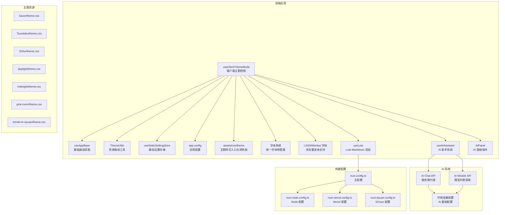
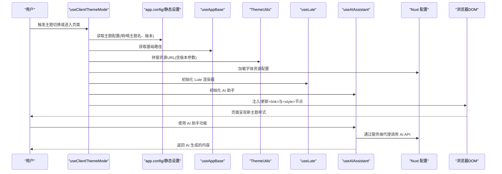
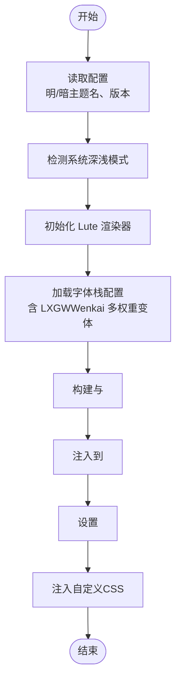
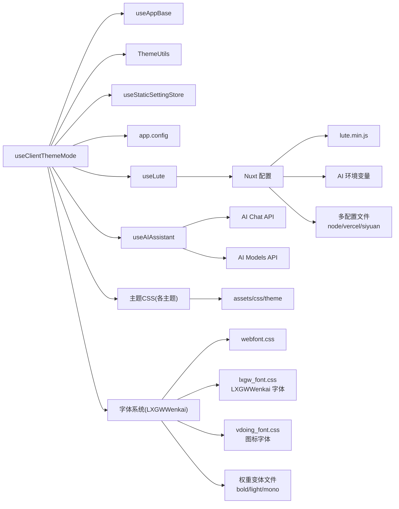

# 主题系统

<cite>
**本文档引用的文件**
- [apps/app/composables/useClientThemeMode.ts](file://apps/app/composables/useClientThemeMode.ts)
- [apps/app/utils/ThemeUtils.ts](file://apps/app/utils/ThemeUtils.ts)
- [apps/app/stores/useStaticSettingStore.ts](file://apps/app/stores/useStaticSettingStore.ts)
- [apps/app/app.config.ts](file://apps/app/app.config.ts)
- [apps/app/composables/useAppBase.ts](file://apps/app/composables/useAppBase.ts)
- [apps/app/composables/useLute.ts](file://apps/app/composables/useLute.ts)
- [apps/app/composables/useAIAssistant.ts](file://apps/app/composables/useAIAssistant.ts)
- [apps/app/components/ai-assistant/AIPanel.vue](file://apps/app/components/ai-assistant/AIPanel.vue)
- [apps/app/server/api/ai/chat.post.ts](file://apps/app/server/api/ai/chat.post.ts)
- [apps/app/server/api/ai/models.get.ts](file://apps/app/server/api/ai/models.get.ts)
- [apps/app/assets/css/theme/index.styl](file://apps/app/assets/css/theme/index.styl)
- [apps/app/assets/css/theme/palette.styl](file://apps/app/assets/css/theme/palette.styl)
- [apps/app/public/resources/appearance/themes/Savor/theme.css](file://apps/app/public/resources/appearance/themes/Savor/theme.css)
- [apps/app/public/resources/appearance/themes/Tsundoku/theme.css](file://apps/app/public/resources/appearance/themes/Tsundoku/theme.css)
- [apps/app/public/resources/appearance/themes/Zhihu/theme.css](file://apps/app/public/resources/appearance/themes/Zhihu/theme.css)
- [apps/app/public/resources/appearance/themes/Zhihu/style/common/fonts/webfont/webfont.css](file://apps/app/public/resources/appearance/themes/Zhihu/style/common/fonts/webfont/webfont.css)
- [apps/app/public/resources/appearance/themes/daylight/theme.css](file://apps/app/public/resources/appearance/themes/daylight/theme.css)
- [apps/app/public/resources/appearance/themes/midnight/theme.css](file://apps/app/public/resources/appearance/themes/midnight/theme.css)
- [apps/app/public/resources/appearance/themes/pink-room/theme.css](file://apps/app/public/resources/appearance/themes/pink-room/theme.css)
- [apps/app/public/resources/appearance/themes/trends-in-siyuan/theme.css](file://apps/app/public/resources/appearance/themes/trends-in-siyuan/theme.css)
- [apps/app/public/libs/fonts/webfont.css](file://apps/app/public/libs/fonts/webfont.css)
- [apps/app/public/libs/fonts/lxgw_font.css](file://apps/app/public/libs/fonts/lxgw_font.css)
- [apps/app/public/libs/fonts/vdoing_font.css](file://apps/app/public/libs/fonts/vdoing_font.css)
- [apps/app/nuxt.config.ts](file://apps/app/nuxt.config.ts)
- [apps/app/nuxt.siyuan.config.ts](file://apps/app/nuxt.siyuan.config.ts)
- [apps/app/nuxt.vercel.config.ts](file://apps/app/nuxt.vercel.config.ts)
- [apps/app/nuxt.node.config.ts](file://apps/app/nuxt.node.config.ts)
- [apps/app/script/node.sh](file://apps/app/script/node.sh)
- [apps/app/script/cloudflare.sh](file://apps/app/script/cloudflare.sh)
- [apps/app/script/vercel.sh](file://apps/app/script/vercel.sh)
- [apps/app/script/dev.sh](file://apps/app/script/dev.sh)
- [startup.example.sh](file://startup.example.sh)
- [apps/app/package.json](file://apps/app/package.json)
- [apps/siyuan/src/webfont.css](file://apps/siyuan/src/webfont.css)
</cite>

## 更新摘要
**所做更改**
- 新增 AI 环境变量支持，包括 NUXT_AI_BASE_URL、NUXT_AI_API_KEY、NUXT_AI_MODEL 等配置项
- 集成 Lute markdown 库到构建流程，通过 nuxt.config.ts 的 head.script 加载
- 新增统一的 AI 助手系统，支持内置模型和自定义模型两种模式
- 更新构建配置，支持多平台部署（Node、Vercel、Cloudflare）
- 优化字体系统架构，通过 Nuxt 配置文件集中加载字体资源

## 目录
1. [引言](#引言)
2. [项目结构](#项目结构)
3. [核心组件](#核心组件)
4. [架构总览](#架构总览)
5. [详细组件分析](#详细组件分析)
6. [AI 系统集成](#ai-系统集成)
7. [依赖关系分析](#依赖关系分析)
8. [性能考量](#性能考量)
9. [故障排查指南](#故障排查指南)
10. [结论](#结论)
11. [附录](#附录)

## 引言
本技术文档围绕 Siyuan 笔记插件中的"主题系统"展开，系统性阐述主题架构设计、主题切换机制、主题配置管理与样式加载流程。同时，对预设主题（Savor、Tsundoku、Zhihu、daylight、midnight、pink-room、trends-in-siyuan）的功能特性与适用场景进行说明，并提供自定义主题的开发流程、样式编写规范、资源组织方式与打包发布的实践建议。最后给出主题切换的操作指南与最佳实践。

**更新** 本次更新重点关注 AI 环境变量支持和 Lute markdown 库集成，实现了统一的 AI 助手系统和增强的主题渲染能力。

## 项目结构
主题系统主要由以下部分组成：
- 客户端主题控制与动态样式加载：位于应用前端，负责根据用户偏好与系统模式动态注入/切换主题 CSS 与代码高亮样式。
- 主题资源目录：集中存放各主题的 CSS 与模块化样式文件，支持按需导入与组合。
- 配置与存储：应用配置与静态设置存储，用于读取主题默认值与版本信息。
- 工具与路径：提供资源路径拼接与基础路径处理能力。
- 字体系统：统一的字体栈管理，确保跨主题的一致性与性能优化。
- **新增** AI 系统：统一的 AI 助手系统，支持内置模型和自定义模型两种模式，通过服务端代理安全调用 AI API。
- **新增** Lute 集成：Markdown 渲染库集成，提供高质量的 Markdown 到 HTML 转换能力。

**图表来源**
- [apps/app/composables/useClientThemeMode.ts:1-158](file://apps/app/composables/useClientThemeMode.ts#L1-L158)
- [apps/app/composables/useAppBase.ts:1-22](file://apps/app/composables/useAppBase.ts#L1-L22)
- [apps/app/utils/ThemeUtils.ts:1-38](file://apps/app/utils/ThemeUtils.ts#L1-L38)
- [apps/app/stores/useStaticSettingStore.ts:1-28](file://apps/app/stores/useStaticSettingStore.ts#L1-L28)
- [apps/app/app.config.ts:1-92](file://apps/app/app.config.ts#L1-L92)
- [apps/app/composables/useLute.ts:1-83](file://apps/app/composables/useLute.ts#L1-L83)
- [apps/app/composables/useAIAssistant.ts:1-488](file://apps/app/composables/useAIAssistant.ts#L1-L488)
- [apps/app/components/ai-assistant/AIPanel.vue:1-800](file://apps/app/components/ai-assistant/AIPanel.vue#L1-L800)
- [apps/app/server/api/ai/chat.post.ts:1-153](file://apps/app/server/api/ai/chat.post.ts#L1-L153)
- [apps/app/server/api/ai/models.get.ts:1-102](file://apps/app/server/api/ai/models.get.ts#L1-L102)
- [apps/app/nuxt.config.ts:132-145](file://apps/app/nuxt.config.ts#L132-L145)

**章节来源**
- [apps/app/composables/useClientThemeMode.ts:1-158](file://apps/app/composables/useClientThemeMode.ts#L1-L158)
- [apps/app/composables/useAppBase.ts:1-22](file://apps/app/composables/useAppBase.ts#L1-L22)
- [apps/app/utils/ThemeUtils.ts:1-38](file://apps/app/utils/ThemeUtils.ts#L1-L38)
- [apps/app/stores/useStaticSettingStore.ts:1-28](file://apps/app/stores/useStaticSettingStore.ts#L1-L28)
- [apps/app/app.config.ts:1-92](file://apps/app/app.config.ts#L1-L92)
- [apps/app/composables/useLute.ts:1-83](file://apps/app/composables/useLute.ts#L1-L83)
- [apps/app/composables/useAIAssistant.ts:1-488](file://apps/app/composables/useAIAssistant.ts#L1-L488)
- [apps/app/components/ai-assistant/AIPanel.vue:1-800](file://apps/app/components/ai-assistant/AIPanel.vue#L1-L800)
- [apps/app/server/api/ai/chat.post.ts:1-153](file://apps/app/server/api/ai/chat.post.ts#L1-L153)
- [apps/app/server/api/ai/models.get.ts:1-102](file://apps/app/server/api/ai/models.get.ts#L1-L102)
- [apps/app/nuxt.config.ts:132-145](file://apps/app/nuxt.config.ts#L132-L145)

## 核心组件
- useClientThemeMode：负责主题模式检测、主题切换、动态样式注入与更新，支持明暗模式与多主题组合。
- useAppBase：提供应用基础路径，确保资源加载的正确性。
- ThemeUtils：提供带基础路径的资源拼接能力，便于在不同部署环境下正确引用静态资源。
- useStaticSettingStore：从静态配置文件读取应用设置，作为主题配置的数据来源之一。
- app.config：定义主题配置结构与默认值，包含主题模式、明暗主题名称与主题版本等字段。
- assets/css/theme：主题样式入口与调色板，提供全局变量与通用样式。
- 字体系统：统一管理字体栈，确保跨主题字体的一致性与性能优化。
- **新增** useLute：Lute Markdown 渲染工具，提供高质量的 Markdown 到 HTML 转换能力。
- **新增** useAIAssistant：统一的 AI 助手系统，支持内置模型和自定义模型两种模式。
- **新增** AIPanel：AI 助手面板组件，提供用户友好的 AI 交互界面。

**章节来源**
- [apps/app/composables/useClientThemeMode.ts:1-158](file://apps/app/composables/useClientThemeMode.ts#L1-L158)
- [apps/app/composables/useAppBase.ts:1-22](file://apps/app/composables/useAppBase.ts#L1-L22)
- [apps/app/utils/ThemeUtils.ts:1-38](file://apps/app/utils/ThemeUtils.ts#L1-L38)
- [apps/app/stores/useStaticSettingStore.ts:1-28](file://apps/app/stores/useStaticSettingStore.ts#L1-L28)
- [apps/app/app.config.ts:1-92](file://apps/app/app.config.ts#L1-L92)
- [apps/app/assets/css/theme/index.styl:1-4](file://apps/app/assets/css/theme/index.styl#L1-L4)
- [apps/app/assets/css/theme/palette.styl:1-52](file://apps/app/assets/css/theme/palette.styl#L1-L52)
- [apps/app/composables/useLute.ts:1-83](file://apps/app/composables/useLute.ts#L1-L83)
- [apps/app/composables/useAIAssistant.ts:1-488](file://apps/app/composables/useAIAssistant.ts#L1-L488)
- [apps/app/components/ai-assistant/AIPanel.vue:1-800](file://apps/app/components/ai-assistant/AIPanel.vue#L1-L800)

## 架构总览
主题系统采用"配置驱动 + 动态样式注入"的架构：
- 配置层：应用配置与静态设置存储提供主题默认值与版本号。
- 控制层：客户端主题控制根据系统/用户偏好与配置计算当前主题，动态注入/替换样式表。
- 资源层：主题 CSS 以模块化方式组织，按需导入，支持明暗主题与第三方高亮库样式。
- 工具层：路径工具保证在不同部署环境下的资源可访问性。
- 字体层：统一字体栈管理，确保跨主题字体的一致性与性能优化。
- **新增** AI 层：统一的 AI 助手系统，通过服务端代理安全调用 AI API，支持多种模型模式。
- **新增** Lute 层：Markdown 渲染库集成，提供高质量的内容渲染能力。

**图表来源**
- [apps/app/composables/useClientThemeMode.ts:51-97](file://apps/app/composables/useClientThemeMode.ts#L51-L97)
- [apps/app/app.config.ts:85-90](file://apps/app/app.config.ts#L85-L90)
- [apps/app/composables/useAppBase.ts:16-21](file://apps/app/composables/useAppBase.ts#L16-L21)
- [apps/app/utils/ThemeUtils.ts:18-34](file://apps/app/utils/ThemeUtils.ts#L18-L34)
- [apps/app/composables/useLute.ts:18-37](file://apps/app/composables/useLute.ts#L18-L37)
- [apps/app/composables/useAIAssistant.ts:243-482](file://apps/app/composables/useAIAssistant.ts#L243-L482)
- [apps/app/nuxt.config.ts:57-59](file://apps/app/nuxt.config.ts#L57-L59)

## 详细组件分析

### 组件一：useClientThemeMode（主题切换与样式加载）
职责与行为：
- 读取系统深浅模式并暴露响应式状态。
- 从路由参数、应用配置与静态设置中解析当前明/暗主题名称与主题版本。
- 使用 Head 插件注入默认主题与当前主题的 CSS 链接，并按需注入代码高亮样式。
- 在浏览器端切换时，动态更新样式表链接与自定义样式节点。
- 通过 data-* 属性标记当前主题模式与主题名，供样式与脚本使用。

关键流程（切换与更新）：

**图表来源**
- [apps/app/composables/useClientThemeMode.ts:35-154](file://apps/app/composables/useClientThemeMode.ts#L35-L154)

**章节来源**
- [apps/app/composables/useClientThemeMode.ts:1-158](file://apps/app/composables/useClientThemeMode.ts#L1-L158)

### 组件二：app.config（主题配置结构）
- 定义主题类型（系统/深色/浅色）与默认主题名、主题版本。
- 支持自定义 CSS 列表，便于注入额外样式。
- 兼容扩展字段，便于后续主题相关配置扩展。

**章节来源**
- [apps/app/app.config.ts:26-91](file://apps/app/app.config.ts#L26-L91)

### 组件三：useStaticSettingStore（静态设置存储）
- 从静态配置文件读取应用设置，作为主题配置的来源之一。
- 提供异步获取接口，便于在 SSR/SSG 场景下稳定获取配置。

**章节来源**
- [apps/app/stores/useStaticSettingStore.ts:1-28](file://apps/app/stores/useStaticSettingStore.ts#L1-L28)

### 组件四：ThemeUtils（资源路径工具）
- 提供带基础路径的资源拼接方法，避免硬编码路径导致的部署问题。
- 支持在不同站点根路径下正确加载主题与资源。

**章节来源**
- [apps/app/utils/ThemeUtils.ts:1-38](file://apps/app/utils/ThemeUtils.ts#L1-L38)

### 组件五：assets/css/theme（主题样式入口与调色板）
- index.styl：引入调色板与通用模糊滤镜等基础样式。
- palette.styl：定义主题变量（颜色、布局、移动端断点等），为各主题提供统一的变量体系。

**章节来源**
- [apps/app/assets/css/theme/index.styl:1-4](file://apps/app/assets/css/theme/index.styl#L1-L4)
- [apps/app/assets/css/theme/palette.styl:1-52](file://apps/app/assets/css/theme/palette.styl#L1-L52)

### 组件六：字体系统（统一字体栈管理）
- 字体栈标准化：统一使用 Fangzheng Beiwei Kai 作为主要字体，确保跨主题一致性。
- **新增** LXGWWenkai 字体支持：实现 783 行 CSS 字体文件，支持多 Unicode 范围覆盖（1-119 个 Unicode 区间），提供四种字体权重变体（常规、粗体、细体、等宽）。
- **更新** 字体加载架构：通过 Nuxt 配置文件集中加载字体资源，提升加载性能与管理便利性。
- webfont.css简化：大幅简化字体加载机制，减少冗余配置。
- 主题字体优化：Zhihu、daylight、midnight主题的字体配置得到优化，提升性能与兼容性。

**更新** 字体系统经过重大优化，实现了真正的标准化管理，并新增了 LXGWWenkai 字体的完整支持。

**章节来源**
- [apps/app/public/libs/fonts/lxgw_font.css:1-784](file://apps/app/public/libs/fonts/lxgw_font.css#L1-L784)
- [apps/app/public/libs/fonts/webfont.css:1-7](file://apps/app/public/libs/fonts/webfont.css#L1-L7)
- [apps/app/public/libs/fonts/vdoing_font.css:1-200](file://apps/app/public/libs/fonts/vdoing_font.css#L1-L200)
- [apps/app/nuxt.config.ts:57-59](file://apps/app/nuxt.config.ts#L57-L59)

### 组件七：Nuxt 配置（多平台构建支持）
- **新增** 多配置文件支持：nuxt.config.ts（主配置）、nuxt.node.config.ts（Node 部署）、nuxt.vercel.config.ts（Vercel 部署）、nuxt.siyuan.config.ts（SiYuan 部署）。
- **新增** Lute 库集成：通过 head.script 在开发和生产环境中加载 lute.min.js。
- **新增** 环境变量配置：runtimeConfig 支持 AI 相关环境变量（NUXT_AI_BASE_URL、NUXT_AI_API_KEY、NUXT_AI_MODEL）。
- **优化** 字体加载策略：实现字体资源的预连接和预加载，减少字体加载延迟。
- **增强** 字体权重支持：通过权重变体文件实现更丰富的字体样式支持。

**章节来源**
- [apps/app/nuxt.config.ts:57-59](file://apps/app/nuxt.config.ts#L57-L59)
- [apps/app/nuxt.config.ts:132-145](file://apps/app/nuxt.config.ts#L132-L145)
- [apps/app/nuxt.siyuan.config.ts:103-137](file://apps/app/nuxt.siyuan.config.ts#L103-L137)
- [apps/app/nuxt.vercel.config.ts:72-106](file://apps/app/nuxt.vercel.config.ts#L72-L106)
- [apps/app/nuxt.node.config.ts:109-145](file://apps/app/nuxt.node.config.ts#L109-L145)

### 预设主题概览与特性
- Savor
  - 特性：丰富的自定义变量与模块化样式，强调编辑器与工具栏的定制化体验。
  - 适用场景：对编辑器细节有较高定制需求的用户。
  - 关键文件：[apps/app/public/resources/appearance/themes/Savor/theme.css:1-791](file://apps/app/public/resources/appearance/themes/Savor/theme.css#L1-L791)

- Tsundoku
  - 特性：模块化导入编辑器基础块、代码块、列表转换与导出样式，强调结构清晰与可维护性。
  - 适用场景：注重内容结构与可读性的用户。
  - 关键文件：[apps/app/public/resources/appearance/themes/Tsundoku/theme.css:1-1159](file://apps/app/public/resources/appearance/themes/Tsundoku/theme.css#L1-L1159)

- Zhihu
  - 特性：基于数据主题模式的明/暗/绿主题变量，强调代码块与行内元素的视觉一致性。**更新** 字体系统经过优化，使用统一的 Fangzheng Beiwei Kai 字体栈，提升性能与兼容性。
  - 适用场景：追求简洁一致风格的用户。
  - 关键文件：[apps/app/public/resources/appearance/themes/Zhihu/theme.css:1-39](file://apps/app/public/resources/appearance/themes/Zhihu/theme.css#L1-L39)

- daylight
  - 特性：浅色主题的基础变量与字体适配，强调清晰与易读。**更新** 字体配置经过优化，移除了冲突字体，提升显示效果。
  - 适用场景：白天/浅色偏好用户。
  - 关键文件：[apps/app/public/resources/appearance/themes/daylight/theme.css:1-232](file://apps/app/public/resources/appearance/themes/daylight/theme.css#L1-L232)

- midnight
  - 特性：深色主题的基础变量与高对比度设计，强调夜间使用体验。**更新** 字体配置经过优化，解决了字体冲突问题，提升夜间阅读体验。
  - 适用场景：夜间/深色偏好用户。
  - 关键文件：[apps/app/public/resources/appearance/themes/midnight/theme.css:1-231](file://apps/app/public/resources/appearance/themes/midnight/theme.css#L1-L231)

- pink-room
  - 特性：模块化导入大量界面与元素样式，强调细节定制与面板优化。
  - 适用场景：对界面细节有深度定制需求的用户。
  - 关键文件：[apps/app/public/resources/appearance/themes/pink-room/theme.css:1-100](file://apps/app/public/resources/appearance/themes/pink-room/theme.css#L1-L100)

- trends-in-siyuan
  - 特性：模块化导入标题、引用、表格、代码等样式，强调内容排版与可读性。
  - 适用场景：注重内容排版与阅读体验的用户。
  - 关键文件：[apps/app/public/resources/appearance/themes/trends-in-siyuan/theme.css:1-200](file://apps/app/public/resources/appearance/themes/trends-in-siyuan/theme.css#L1-L200)

**章节来源**
- [apps/app/public/resources/appearance/themes/Savor/theme.css:1-791](file://apps/app/public/resources/appearance/themes/Savor/theme.css#L1-L791)
- [apps/app/public/resources/appearance/themes/Tsundoku/theme.css:1-1159](file://apps/app/public/resources/appearance/themes/Tsundoku/theme.css#L1-L1159)
- [apps/app/public/resources/appearance/themes/Zhihu/theme.css:1-39](file://apps/app/public/resources/appearance/themes/Zhihu/theme.css#L1-L39)
- [apps/app/public/resources/appearance/themes/daylight/theme.css:1-232](file://apps/app/public/resources/appearance/themes/daylight/theme.css#L1-L232)
- [apps/app/public/resources/appearance/themes/midnight/theme.css:1-231](file://apps/app/public/resources/appearance/themes/midnight/theme.css#L1-L231)
- [apps/app/public/resources/appearance/themes/pink-room/theme.css:1-100](file://apps/app/public/resources/appearance/themes/pink-room/theme.css#L1-L100)
- [apps/app/public/resources/appearance/themes/trends-in-siyuan/theme.css:1-200](file://apps/app/public/resources/appearance/themes/trends-in-siyuan/theme.css#L1-L200)

### 自定义主题开发流程
- 样式编写规范
  - 使用 CSS 变量统一管理颜色、字体与阴影等，便于主题切换与一致性。
  - 优先采用模块化组织，按"模块/功能/页面"维度拆分样式文件，便于维护与复用。
  - 遵循平台约定的命名与层级，避免与内置样式冲突。

- 主题资源组织
  - 在主题根目录下建立 style 与 module 子目录，分别放置模块化样式与通用模块。
  - 通过 theme.css 统一导入，避免重复与遗漏。
  - 如需字体或图标，统一放置于主题根目录的对应子目录，并在 theme.css 中按需引入。

- 字体系统集成
  - **更新** 优先使用统一的字体栈变量，如 `--b3-font-family` 和 `--b3-font-family-code`。
  - **新增** 支持 LXGWWenkai 字体的多权重变体，可通过 `font-weight` 属性选择不同的字体样式。
  - 字体配置应遵循标准化原则，避免字体冲突和性能问题。
  - 字体文件应放在主题目录下的合适位置，并通过 @font-face 正确声明。

- 主题打包与发布
  - 保持 theme.css 作为唯一入口，确保加载顺序与依赖关系明确。
  - 为静态资源（字体、图标、背景）提供相对路径或通过工具拼接绝对路径。
  - 在 app.config 中注册主题名称与默认版本，便于配置与版本管理。

- 最佳实践
  - 明/暗主题分离：为明/暗主题分别提供变量与样式，确保在不同模式下均具备良好可读性。
  - 性能优化：尽量减少重绘与回流，避免大范围使用复杂选择器。
  - 兼容性：考虑不同语言与字体环境，提供降级方案与回退字体。
  - **更新** 字体优化：遵循统一的字体栈标准，确保跨主题字体的一致性与性能。
  - **新增** 字体权重支持：充分利用 LXGWWenkai 字体的多权重变体，提升字体显示效果。
  - 字体加载优化：通过 Nuxt 配置实现字体资源的预加载，提升页面渲染性能。

**章节来源**
- [apps/app/assets/css/theme/palette.styl:1-52](file://apps/app/assets/css/theme/palette.styl#L1-L52)
- [apps/app/public/libs/fonts/lxgw_font.css:1-784](file://apps/app/public/libs/fonts/lxgw_font.css#L1-L784)
- [apps/app/public/resources/appearance/themes/Zhihu/theme.css:1-39](file://apps/app/public/resources/appearance/themes/Zhihu/theme.css#L1-L39)
- [apps/app/public/resources/appearance/themes/daylight/theme.css:1-232](file://apps/app/public/resources/appearance/themes/daylight/theme.css#L1-L232)
- [apps/app/public/resources/appearance/themes/midnight/theme.css:1-231](file://apps/app/public/resources/appearance/themes/midnight/theme.css#L1-L231)

## AI 系统集成

### AI 环境变量配置
系统支持以下 AI 相关环境变量：
- NUXT_AI_BASE_URL：AI API 基础 URL，默认值为 "https://api.openai.com"
- NUXT_AI_API_KEY：AI API 密钥，用于认证
- NUXT_AI_MODEL：默认使用的 AI 模型，如 "gpt-3.5-turbo"

这些配置通过 Nuxt 的 runtimeConfig 进行管理，支持服务端私有配置和客户端公开配置的分离。

**章节来源**
- [apps/app/nuxt.config.ts:132-145](file://apps/app/nuxt.config.ts#L132-L145)
- [apps/app/nuxt.siyuan.config.ts:142-154](file://apps/app/nuxt.siyuan.config.ts#L142-L154)
- [apps/app/nuxt.vercel.config.ts:142-155](file://apps/app/nuxt.vercel.config.ts#L142-L155)
- [apps/app/nuxt.node.config.ts:132-145](file://apps/app/nuxt.node.config.ts#L132-L145)

### Lute Markdown 渲染集成
Lute 库通过以下方式集成到系统中：

- **加载方式**：通过 nuxt.config.ts 的 head.script 在开发和生产环境中加载 lute.min.js
- **初始化**：useLute 组合式函数提供 Lute 实例的创建和管理
- **渲染功能**：支持将 Markdown 文本转换为 HTML，提供高质量的渲染效果
- **错误处理**：包含完整的错误处理机制，确保系统稳定性

**章节来源**
- [apps/app/composables/useLute.ts:1-83](file://apps/app/composables/useLute.ts#L1-L83)
- [apps/app/nuxt.config.ts:89-104](file://apps/app/nuxt.config.ts#L89-L104)
- [apps/app/nuxt.siyuan.config.ts:121-136](file://apps/app/nuxt.siyuan.config.ts#L121-L136)
- [apps/app/nuxt.vercel.config.ts:90-106](file://apps/app/nuxt.vercel.config.ts#L90-L106)

### AI 助手系统架构
AI 助手系统采用统一的设计理念：

- **统一交互**：所有 AI 交互都以对话气泡的形式呈现
- **模式区分**：
  - builtin：使用服务端内置模型，无次数限制
  - custom：使用用户自定义模型，受次数限制
- **架构优势**：
  - 上下文连续性
  - Token 效率（文档内容只发送一次）
  - 统一的使用计数（仅自定义模型）
  - 更好的用户体验

**章节来源**
- [apps/app/composables/useAIAssistant.ts:1-488](file://apps/app/composables/useAIAssistant.ts#L1-L488)
- [apps/app/components/ai-assistant/AIPanel.vue:1-800](file://apps/app/components/ai-assistant/AIPanel.vue#L1-L800)

### 服务端 API 集成
系统提供两个核心的 AI 服务端 API：

- **AI Chat API** (`/api/ai/chat`)：处理 AI 对话请求，支持流式响应
- **AI Models API** (`/api/ai/models`)：获取可用模型列表

这两个 API 通过服务端代理实现，确保 API 密钥的安全性。

**章节来源**
- [apps/app/server/api/ai/chat.post.ts:1-153](file://apps/app/server/api/ai/chat.post.ts#L1-L153)
- [apps/app/server/api/ai/models.get.ts:1-102](file://apps/app/server/api/ai/models.get.ts#L1-L102)

## 依赖关系分析
主题系统内部依赖关系如下：
- useClientThemeMode 依赖 useAppBase、ThemeUtils、useStaticSettingStore、app.config。
- 各主题 CSS 通过 theme.css 统一入口，内部再按模块化导入。
- assets/css/theme 提供全局变量与通用样式，为各主题提供统一的变量体系。
- 字体系统统一管理字体栈，确保跨主题字体的一致性与性能优化。
- **新增** useLute 依赖 Nuxt 配置中的 Lute 库加载。
- **新增** useAIAssistant 依赖服务端 AI API 和环境变量配置。
- **新增** 多配置文件支持不同部署环境的需求。
- Nuxt 配置集中管理字体资源加载，提升字体系统的性能与可维护性。

**图表来源**
- [apps/app/composables/useClientThemeMode.ts:1-158](file://apps/app/composables/useClientThemeMode.ts#L1-L158)
- [apps/app/composables/useAppBase.ts:1-22](file://apps/app/composables/useAppBase.ts#L1-L22)
- [apps/app/utils/ThemeUtils.ts:1-38](file://apps/app/utils/ThemeUtils.ts#L1-L38)
- [apps/app/stores/useStaticSettingStore.ts:1-28](file://apps/app/stores/useStaticSettingStore.ts#L1-L28)
- [apps/app/app.config.ts:1-92](file://apps/app/app.config.ts#L1-L92)
- [apps/app/composables/useLute.ts:1-83](file://apps/app/composables/useLute.ts#L1-L83)
- [apps/app/composables/useAIAssistant.ts:1-488](file://apps/app/composables/useAIAssistant.ts#L1-L488)
- [apps/app/nuxt.config.ts:132-145](file://apps/app/nuxt.config.ts#L132-L145)

**章节来源**
- [apps/app/composables/useClientThemeMode.ts:1-158](file://apps/app/composables/useClientThemeMode.ts#L1-L158)
- [apps/app/composables/useAppBase.ts:1-22](file://apps/app/composables/useAppBase.ts#L1-L22)
- [apps/app/utils/ThemeUtils.ts:1-38](file://apps/app/utils/ThemeUtils.ts#L1-L38)
- [apps/app/stores/useStaticSettingStore.ts:1-28](file://apps/app/stores/useStaticSettingStore.ts#L1-L28)
- [apps/app/app.config.ts:1-92](file://apps/app/app.config.ts#L1-L92)
- [apps/app/composables/useLute.ts:1-83](file://apps/app/composables/useLute.ts#L1-L83)
- [apps/app/composables/useAIAssistant.ts:1-488](file://apps/app/composables/useAIAssistant.ts#L1-L488)
- [apps/app/nuxt.config.ts:132-145](file://apps/app/nuxt.config.ts#L132-L145)

## 性能考量
- 样式加载策略
  - 使用动态注入与替换链接的方式，避免全量重载页面。
  - 通过版本参数（如主题版本与高亮库版本）控制缓存失效，兼顾更新与缓存效率。
- DOM 操作
  - 仅在浏览器端执行样式更新，避免服务端渲染阻塞。
  - 通过 data-* 属性快速定位与更新样式节点，减少选择器匹配成本。
- 资源路径
  - 使用工具拼接基础路径，避免因部署路径变化导致的资源 404，降低重试与失败成本。
- **更新** 字体系统优化
  - webfont.css大幅简化，减少了字体加载的开销。
  - **新增** LXGWWenkai 字体的多 Unicode 范围覆盖，提升字体显示的完整性。
  - **新增** 字体权重变体文件，支持更丰富的字体样式需求。
  - **新增** Nuxt 配置的字体资源集中管理，提升字体加载性能。
  - 统一字体栈管理，避免重复加载相同字体文件。
  - 优化字体配置，解决字体冲突问题，提升渲染性能。
- **新增** Lute 性能优化
  - 单例模式管理 Lute 实例，避免重复创建。
  - 通过 head.script 预加载 Lute 库，提升渲染性能。
  - 错误处理机制确保系统稳定性。
- **新增** AI 系统性能优化
  - 服务端代理模式保护 API 密钥安全。
  - 流式响应处理，提升用户体验。
  - 统一的消息上下文管理，提高 Token 效率。

## 故障排查指南
- 主题未生效
  - 检查 useClientThemeMode 是否正确注入了主题 CSS 链接与自定义样式。
  - 确认 app.config 与静态设置中的主题名称与版本是否正确。
  - 核对 useAppBase 返回的基础路径是否与部署路径一致。

- 明/暗主题切换异常
  - 确认系统深浅模式检测逻辑与用户手动切换逻辑是否一致。
  - 检查 setCssAndThemeMode 是否正确更新了主题链接与 data-* 属性。

- 资源 404 或样式错位
  - 使用 ThemeUtils 的路径拼接方法，确保资源 URL 正确。
  - 检查主题 CSS 的导入顺序与模块化组织是否合理。

- **更新** 字体相关问题
  - 检查字体栈配置是否正确，确保统一字体栈的变量被正确使用。
  - 验证 lxgw_font.css 文件是否存在且路径正确。
  - **新增** 确认 LXGWWenkai 字体的权重变体文件是否完整加载。
  - **新增** 检查 Nuxt 配置中的字体资源加载是否正常。
  - 确认字体文件（如方正北魏楷书简体、LXGWWenkai）是否正确加载。
  - 检查是否有字体冲突或加载失败的情况。

- **新增** Lute 渲染问题
  - 检查 Lute 库是否正确加载（通过 head.script）。
  - 验证 useLute 组合式函数的初始化过程。
  - 确认 Markdown 内容格式是否符合 Lute 渲染要求。
  - 检查浏览器控制台是否有 Lute 相关的错误信息。

- **新增** AI 系统问题
  - 检查环境变量配置是否正确（NUXT_AI_BASE_URL、NUXT_AI_API_KEY、NUXT_AI_MODEL）。
  - 验证服务端 AI API 是否正常运行。
  - 确认网络连接和防火墙设置允许 AI API 访问。
  - 检查 AI 助手面板的错误提示信息。
  - 验证用户权限和配额限制。

**章节来源**
- [apps/app/composables/useClientThemeMode.ts:103-154](file://apps/app/composables/useClientThemeMode.ts#L103-L154)
- [apps/app/composables/useAppBase.ts:16-21](file://apps/app/composables/useAppBase.ts#L16-L21)
- [apps/app/utils/ThemeUtils.ts:18-34](file://apps/app/utils/ThemeUtils.ts#L18-L34)
- [apps/app/app.config.ts:85-90](file://apps/app/app.config.ts#L85-L90)
- [apps/app/public/libs/fonts/lxgw_font.css:1-784](file://apps/app/public/libs/fonts/lxgw_font.css#L1-L784)
- [apps/app/composables/useLute.ts:18-37](file://apps/app/composables/useLute.ts#L18-L37)
- [apps/app/server/api/ai/chat.post.ts:14-57](file://apps/app/server/api/ai/chat.post.ts#L14-L57)
- [apps/app/nuxt.config.ts:132-145](file://apps/app/nuxt.config.ts#L132-L145)

## 结论
主题系统通过"配置驱动 + 动态样式注入"的方式，实现了灵活的主题切换与稳定的样式加载。预设主题覆盖了多种使用场景，而模块化的主题资源组织与统一的变量体系则为自定义主题提供了良好的扩展基础。**更新** 本次更新显著增强了系统的功能性和安全性，特别是新增的 AI 环境变量支持、Lute markdown 库集成和统一的 AI 助手系统，实现了高质量的内容渲染和智能交互能力。通过多配置文件支持不同部署环境，以及 Nuxt 配置的字体资源集中管理，进一步优化了系统的性能与可维护性。遵循本文档提供的开发流程与最佳实践，可高效地完成主题的定制、打包与发布。

## 附录
- 主题切换操作指南
  - 在系统深浅模式与主题配置之间进行选择，确保明/暗主题名称与版本正确。
  - 在浏览器端触发切换后，观察样式节点与 data-* 属性的变化，确认主题已生效。
  - **更新** 注意字体栈的加载状态，确保字体正确显示，特别是 LXGWWenkai 字体的多权重变体。
  - **新增** 检查 Lute 渲染器是否正确初始化，确保 Markdown 内容能够正常渲染。

- 最佳实践建议
  - 优先采用模块化样式与变量体系，便于维护与升级。
  - 在不同语言与字体环境下测试主题，确保可读性与一致性。
  - 合理利用版本参数与缓存策略，在更新与性能之间取得平衡。
  - **更新** 遵循统一的字体栈标准，确保跨主题字体的一致性与性能。
  - **新增** 充分利用 LXGWWenkai 字体的多权重变体，提升字体显示效果。
  - **新增** 通过 Nuxt 配置优化字体资源加载，提升页面渲染性能。
  - 优化字体配置，避免字体冲突和加载失败的问题。
  - **新增** 利用 Nuxt 的预加载功能，提升字体和 Lute 库的加载速度。
  - **新增** 合理配置 AI 环境变量，确保 AI 功能的正常使用。
  - **新增** 通过服务端代理模式保护 API 密钥安全，避免泄露风险。
  - **新增** 在不同部署环境中验证多配置文件的正确性。