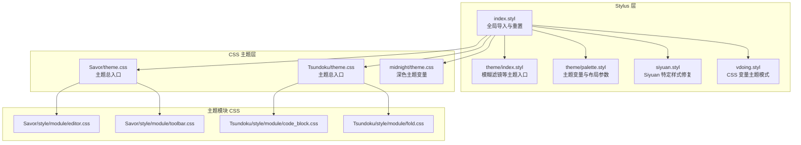
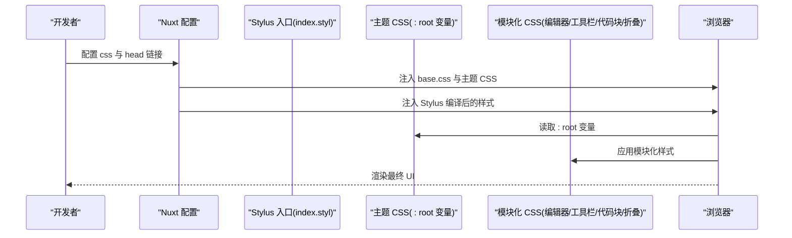
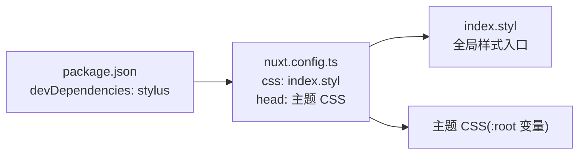

# Stylus 与 CSS 编写

<cite>
**本文引用的文件**
- [apps/app/assets/css/theme/index.styl](file://apps/app/assets/css/theme/index.styl)
- [apps/app/assets/css/theme/palette.styl](file://apps/app/assets/css/theme/palette.styl)
- [apps/app/assets/css/index.styl](file://apps/app/assets/css/index.styl)
- [apps/app/assets/css/siyuan.styl](file://apps/app/assets/css/siyuan.styl)
- [apps/app/assets/css/vdoing.styl](file://apps/app/assets/css/vdoing.styl)
- [apps/app/public/resources/appearance/themes/Savor/theme.css](file://apps/app/public/resources/appearance/themes/Savor/theme.css)
- [apps/app/public/resources/appearance/themes/Tsundoku/theme.css](file://apps/app/public/resources/appearance/themes/Tsundoku/theme.css)
- [apps/app/public/resources/appearance/themes/midnight/theme.css](file://apps/app/public/resources/appearance/themes/midnight/theme.css)
- [apps/app/public/resources/appearance/themes/Savor/style/module/editor.css](file://apps/app/public/resources/appearance/themes/Savor/style/module/editor.css)
- [apps/app/public/resources/appearance/themes/Savor/style/module/toolbar.css](file://apps/app/public/resources/appearance/themes/Savor/style/module/toolbar.css)
- [apps/app/public/resources/appearance/themes/Tsundoku/style/module/code_block.css](file://apps/app/public/resources/appearance/themes/Tsundoku/style/module/code_block.css)
- [apps/app/public/resources/appearance/themes/Tsundoku/style/module/fold.css](file://apps/app/public/resources/appearance/themes/Tsundoku/style/module/fold.css)
- [apps/app/package.json](file://apps/app/package.json)
- [apps/app/nuxt.config.ts](file://apps/app/nuxt.config.ts)
</cite>

## 目录
1. [简介](#简介)
2. [项目结构](#项目结构)
3. [核心组件](#核心组件)
4. [架构总览](#架构总览)
5. [详细组件分析](#详细组件分析)
6. [依赖关系分析](#依赖关系分析)
7. [性能考虑](#性能考虑)
8. [故障排查指南](#故障排查指南)
9. [结论](#结论)
10. [附录](#附录)

## 简介
本指南面向在 Siyuan 笔记本生态中进行样式开发的工程师与设计师，系统讲解 Stylus 与 CSS 的编写方法与最佳实践。结合本仓库中的实际样式文件，我们将从变量系统、嵌套规则、混合器与函数的使用，到 CSS 变量（CSS 自定义属性）的应用，再到主题化与响应式设计的落地策略，提供可操作的指导与排错建议。

## 项目结构
本项目采用“Stylus 预处理 + 多主题 CSS”的混合方案：
- Stylus 层：集中于 apps/app/assets/css 下，负责全局布局、字体、主题变量与模块化导入。
- CSS 主题层：apps/app/public/resources/appearance/themes 下提供多套主题（如 Savor、Tsundoku、midnight），每套主题通过 :root 定义 CSS 变量，并以模块化 CSS 文件组织功能样式（如编辑器、工具栏、代码块、折叠等）。

图表来源
- [apps/app/assets/css/index.styl:1-39](file://apps/app/assets/css/index.styl#L1-L39)
- [apps/app/assets/css/theme/index.styl:1-4](file://apps/app/assets/css/theme/index.styl#L1-L4)
- [apps/app/assets/css/theme/palette.styl:1-52](file://apps/app/assets/css/theme/palette.styl#L1-L52)
- [apps/app/assets/css/siyuan.styl:1-64](file://apps/app/assets/css/siyuan.styl#L1-L64)
- [apps/app/assets/css/vdoing.styl:1-39](file://apps/app/assets/css/vdoing.styl#L1-L39)
- [apps/app/public/resources/appearance/themes/Savor/theme.css:1-791](file://apps/app/public/resources/appearance/themes/Savor/theme.css#L1-L791)
- [apps/app/public/resources/appearance/themes/Tsundoku/theme.css:1-1159](file://apps/app/public/resources/appearance/themes/Tsundoku/theme.css#L1-L1159)
- [apps/app/public/resources/appearance/themes/midnight/theme.css:1-224](file://apps/app/public/resources/appearance/themes/midnight/theme.css#L1-L224)
- [apps/app/public/resources/appearance/themes/Savor/style/module/editor.css:1-581](file://apps/app/public/resources/appearance/themes/Savor/style/module/editor.css#L1-L581)
- [apps/app/public/resources/appearance/themes/Savor/style/module/toolbar.css:1-59](file://apps/app/public/resources/appearance/themes/Savor/style/module/toolbar.css#L1-L59)
- [apps/app/public/resources/appearance/themes/Tsundoku/style/module/code_block.css:1-187](file://apps/app/public/resources/appearance/themes/Tsundoku/style/module/code_block.css#L1-L187)
- [apps/app/public/resources/appearance/themes/Tsundoku/style/module/fold.css:1-319](file://apps/app/public/resources/appearance/themes/Tsundoku/style/module/fold.css#L1-L319)

章节来源
- [apps/app/assets/css/index.styl:1-39](file://apps/app/assets/css/index.styl#L1-L39)
- [apps/app/nuxt.config.ts:106](file://apps/app/nuxt.config.ts#L106)

## 核心组件
- Stylus 入口与模块化
  - index.styl：全局重置、字体、模块导入与修复样式。
  - theme/index.styl：主题入口，如模糊滤镜等。
  - theme/palette.styl：主题变量（颜色、布局、移动端断点等）。
  - siyuan.styl：针对 Siyuan 编辑器的特定样式修复。
  - vdoing.styl：以 CSS 变量驱动的主题模式（light/dark/read）。
- CSS 主题与模块
  - Savor、Tsundoku、midnight：各主题通过 :root 定义丰富的 CSS 变量，覆盖字体、颜色、阴影、滚动条、编辑器、工具栏、代码块、折叠等。
  - 模块化 CSS：editor.css、toolbar.css、code_block.css、fold.css 等按功能拆分，便于维护与复用。

章节来源
- [apps/app/assets/css/index.styl:1-39](file://apps/app/assets/css/index.styl#L1-L39)
- [apps/app/assets/css/theme/index.styl:1-4](file://apps/app/assets/css/theme/index.styl#L1-L4)
- [apps/app/assets/css/theme/palette.styl:1-52](file://apps/app/assets/css/theme/palette.styl#L1-L52)
- [apps/app/assets/css/siyuan.styl:1-64](file://apps/app/assets/css/siyuan.styl#L1-L64)
- [apps/app/assets/css/vdoing.styl:1-39](file://apps/app/assets/css/vdoing.styl#L1-L39)
- [apps/app/public/resources/appearance/themes/Savor/theme.css:1-791](file://apps/app/public/resources/appearance/themes/Savor/theme.css#L1-L791)
- [apps/app/public/resources/appearance/themes/Tsundoku/theme.css:1-1159](file://apps/app/public/resources/appearance/themes/Tsundoku/theme.css#L1-L1159)
- [apps/app/public/resources/appearance/themes/midnight/theme.css:1-224](file://apps/app/public/resources/appearance/themes/midnight/theme.css#L1-L224)

## 架构总览
Stylus 与 CSS 的协同工作流如下：
- 开发阶段：Stylus 文件通过 Nuxt 配置加载，作为全局样式入口；同时引入主题 CSS。
- 主题阶段：各主题通过 :root 定义 CSS 变量，模块化 CSS 以类名方式覆盖具体 UI 组件。
- 运行时：通过 data-theme-mode 等属性切换主题模式，CSS 变量即时生效。

图表来源
- [apps/app/nuxt.config.ts:46-87](file://apps/app/nuxt.config.ts#L46-L87)
- [apps/app/nuxt.config.ts:106](file://apps/app/nuxt.config.ts#L106)
- [apps/app/assets/css/index.styl:1-39](file://apps/app/assets/css/index.styl#L1-L39)
- [apps/app/public/resources/appearance/themes/Savor/theme.css:32-226](file://apps/app/public/resources/appearance/themes/Savor/theme.css#L32-L226)
- [apps/app/public/resources/appearance/themes/Tsundoku/theme.css:1-319](file://apps/app/public/resources/appearance/themes/Tsundoku/theme.css#L1-L319)

## 详细组件分析

### Stylus 语法与最佳实践
- 变量定义与使用
  - 在 theme/palette.styl 中集中定义颜色、布局尺寸与移动端断点，供其他 Stylus 文件引用，避免重复与不一致。
  - 示例路径参考：[apps/app/assets/css/theme/palette.styl:34-52](file://apps/app/assets/css/theme/palette.styl#L34-L52)
- 嵌套规则
  - 使用层级缩进组织选择器，提升可读性与可维护性；例如全局重置与字体声明。
  - 示例路径参考：[apps/app/assets/css/index.styl:1-16](file://apps/app/assets/css/index.styl#L1-L16)
- 模块化导入
  - 通过 @import 将不同功能样式拆分为独立文件，再由 index.styl 统一导入。
  - 示例路径参考：[apps/app/assets/css/index.styl:18-26](file://apps/app/assets/css/index.styl#L18-L26)
- 混合器与函数
  - 本仓库未直接展示 stylus mixin/function 的使用；建议在复杂计算或复用逻辑处引入 mixin，以减少重复代码。
- 响应式设计
  - 使用移动端断点变量控制小屏适配，配合媒体查询实现响应式布局。
  - 示例路径参考：[apps/app/assets/css/theme/palette.styl:52](file://apps/app/assets/css/theme/palette.styl#L52)

章节来源
- [apps/app/assets/css/theme/palette.styl:1-52](file://apps/app/assets/css/theme/palette.styl#L1-L52)
- [apps/app/assets/css/index.styl:1-39](file://apps/app/assets/css/index.styl#L1-L39)

### CSS 变量系统与主题模式
- 变量定义
  - 各主题通过 :root 定义大量 CSS 变量，覆盖主色、文字色、背景、阴影、滚动条、编辑器、工具栏、代码块、PDF 等。
  - 示例路径参考：[apps/app/public/resources/appearance/themes/Savor/theme.css:32-226](file://apps/app/public/resources/appearance/themes/Savor/theme.css#L32-L226)
- 主题模式
  - vdoing.styl 通过 data-theme-mode 切换浅色/深色/阅读模式，对应不同的 CSS 变量值。
  - 示例路径参考：[apps/app/assets/css/vdoing.styl:1-39](file://apps/app/assets/css/vdoing.styl#L1-L39)
- 颜色、字体、间距变量
  - 颜色：--b3-theme-*、--b3-font-color*、--b3-font-background*
  - 字体：--b3-font-family、--b3-font-family-code、--b3-font-family-emoji
  - 间距：border-radius、滚动条尺寸等
  - 示例路径参考：[apps/app/public/resources/appearance/themes/Tsundoku/theme.css:58-128](file://apps/app/public/resources/appearance/themes/Tsundoku/theme.css#L58-L128)

章节来源
- [apps/app/assets/css/vdoing.styl:1-39](file://apps/app/assets/css/vdoing.styl#L1-L39)
- [apps/app/public/resources/appearance/themes/Savor/theme.css:32-226](file://apps/app/public/resources/appearance/themes/Savor/theme.css#L32-L226)
- [apps/app/public/resources/appearance/themes/Tsundoku/theme.css:58-128](file://apps/app/public/resources/appearance/themes/Tsundoku/theme.css#L58-L128)

### 模块化样式与主题化
- 编辑器样式
  - Savor 的 editor.css 覆盖标题、列表、任务、表格、标签、块引用、超链接、嵌入块、代码块、折叠等细节。
  - 示例路径参考：[apps/app/public/resources/appearance/themes/Savor/style/module/editor.css:1-581](file://apps/app/public/resources/appearance/themes/Savor/style/module/editor.css#L1-L581)
- 工具栏样式
  - Savor 的 toolbar.css 控制顶栏背景、悬停态、关闭按钮等。
  - 示例路径参考：[apps/app/public/resources/appearance/themes/Savor/style/module/toolbar.css:1-59](file://apps/app/public/resources/appearance/themes/Savor/style/module/toolbar.css#L1-L59)
- 代码块样式
  - Tsundoku 的 code_block.css 控制代码块背景、行号、语言选择、复制按钮等。
  - 示例路径参考：[apps/app/public/resources/appearance/themes/Tsundoku/style/module/code_block.css:1-187](file://apps/app/public/resources/appearance/themes/Tsundoku/style/module/code_block.css#L1-L187)
- 折叠样式
  - Tsundoku 的 fold.css 控制折叠块的占位、提示文案、隐藏内容等。
  - 示例路径参考：[apps/app/public/resources/appearance/themes/Tsundoku/style/module/fold.css:1-319](file://apps/app/public/resources/appearance/themes/Tsundoku/style/module/fold.css#L1-L319)

章节来源
- [apps/app/public/resources/appearance/themes/Savor/style/module/editor.css:1-581](file://apps/app/public/resources/appearance/themes/Savor/style/module/editor.css#L1-L581)
- [apps/app/public/resources/appearance/themes/Savor/style/module/toolbar.css:1-59](file://apps/app/public/resources/appearance/themes/Savor/style/module/toolbar.css#L1-L59)
- [apps/app/public/resources/appearance/themes/Tsundoku/style/module/code_block.css:1-187](file://apps/app/public/resources/appearance/themes/Tsundoku/style/module/code_block.css#L1-L187)
- [apps/app/public/resources/appearance/themes/Tsundoku/style/module/fold.css:1-319](file://apps/app/public/resources/appearance/themes/Tsundoku/style/module/fold.css#L1-L319)

### 命名规范与组织原则
- 命名规范
  - 类名采用语义化与功能化结合的方式，如 .protyle-*、.b3-*、.layout-*、.toolbar-* 等，便于跨主题复用。
  - 变量命名遵循前缀约定（如 --b3-*、--S-*），清晰表达作用域与用途。
- 组织原则
  - Stylus：入口统一、模块拆分、变量集中。
  - CSS：主题总入口 + 功能模块 CSS，按 UI 组件维度划分。
  - 通过 data-theme-mode 与 :root 变量实现主题切换与一致性。

章节来源
- [apps/app/assets/css/index.styl:1-39](file://apps/app/assets/css/index.styl#L1-L39)
- [apps/app/public/resources/appearance/themes/Savor/theme.css:32-226](file://apps/app/public/resources/appearance/themes/Savor/theme.css#L32-L226)

### 响应式设计实现
- 断点与布局
  - 使用移动端断点变量控制小屏体验，配合媒体查询与弹性布局实现响应式。
  - 示例路径参考：[apps/app/assets/css/theme/palette.styl:52](file://apps/app/assets/css/theme/palette.styl#L52)
- 主题模式下的响应式
  - 不同主题在 :root 中定义不同变量，确保在 light/dark/read 模式下均具备良好的可读性与对比度。

章节来源
- [apps/app/assets/css/theme/palette.styl:52](file://apps/app/assets/css/theme/palette.styl#L52)
- [apps/app/assets/css/vdoing.styl:1-39](file://apps/app/assets/css/vdoing.styl#L1-L39)

## 依赖关系分析
- 构建与运行
  - Nuxt 配置中通过 css 数组加载 Stylus 入口，并在 head 中注入主题 CSS 与字体资源。
  - 示例路径参考：[apps/app/nuxt.config.ts:106](file://apps/app/nuxt.config.ts#L106)、[apps/app/nuxt.config.ts:46-87](file://apps/app/nuxt.config.ts#L46-L87)
- 依赖项
  - stylus 作为开发依赖用于编译 Stylus 文件。
  - 示例路径参考：[apps/app/package.json:36](file://apps/app/package.json#L36)

图表来源
- [apps/app/package.json:36](file://apps/app/package.json#L36)
- [apps/app/nuxt.config.ts:106](file://apps/app/nuxt.config.ts#L106)
- [apps/app/nuxt.config.ts:46-87](file://apps/app/nuxt.config.ts#L46-L87)

章节来源
- [apps/app/package.json:36](file://apps/app/package.json#L36)
- [apps/app/nuxt.config.ts:106](file://apps/app/nuxt.config.ts#L106)
- [apps/app/nuxt.config.ts:46-87](file://apps/app/nuxt.config.ts#L46-L87)

## 性能考虑
- 样式体积控制
  - 优先使用 CSS 变量与模块化 CSS，避免在 Stylus 中重复计算与生成冗余规则。
- 加载顺序
  - 将通用基础样式（如 base.css）与主题 CSS 分离加载，减少阻塞。
- 主题切换
  - 通过 data-theme-mode 切换主题模式，尽量避免强制重绘与大范围样式变更。

## 故障排查指南
- 样式未生效
  - 检查 Nuxt 配置是否正确引入 Stylus 入口与主题 CSS。
  - 确认 :root 变量是否在目标主题中定义。
  - 参考路径：[apps/app/nuxt.config.ts:106](file://apps/app/nuxt.config.ts#L106)、[apps/app/public/resources/appearance/themes/Savor/theme.css:32-226](file://apps/app/public/resources/appearance/themes/Savor/theme.css#L32-L226)
- 编辑器样式异常
  - 检查 editor.css 是否被正确导入与覆盖。
  - 参考路径：[apps/app/public/resources/appearance/themes/Savor/style/module/editor.css:1-581](file://apps/app/public/resources/appearance/themes/Savor/style/module/editor.css#L1-L581)
- 代码块显示问题
  - 检查 code_block.css 的背景、行号与复制按钮样式。
  - 参考路径：[apps/app/public/resources/appearance/themes/Tsundoku/style/module/code_block.css:1-187](file://apps/app/public/resources/appearance/themes/Tsundoku/style/module/code_block.css#L1-L187)
- 折叠块占位与提示
  - 检查 fold.css 的伪元素与隐藏逻辑。
  - 参考路径：[apps/app/public/resources/appearance/themes/Tsundoku/style/module/fold.css:1-319](file://apps/app/public/resources/appearance/themes/Tsundoku/style/module/fold.css#L1-L319)

章节来源
- [apps/app/nuxt.config.ts:106](file://apps/app/nuxt.config.ts#L106)
- [apps/app/public/resources/appearance/themes/Savor/style/module/editor.css:1-581](file://apps/app/public/resources/appearance/themes/Savor/style/module/editor.css#L1-L581)
- [apps/app/public/resources/appearance/themes/Tsundoku/style/module/code_block.css:1-187](file://apps/app/public/resources/appearance/themes/Tsundoku/style/module/code_block.css#L1-L187)
- [apps/app/public/resources/appearance/themes/Tsundoku/style/module/fold.css:1-319](file://apps/app/public/resources/appearance/themes/Tsundoku/style/module/fold.css#L1-L319)

## 结论
本项目通过 Stylus 与 CSS 的协同，实现了可维护、可扩展、可主题化的样式体系。Stylus 负责全局与模块化入口，CSS 主题通过 :root 变量提供一致的视觉与交互体验。遵循本文的命名规范、组织原则与响应式策略，可在保持一致性的同时快速迭代样式功能。

## 附录
- 实际代码示例路径（仅列出路径，不展示具体内容）
  - Stylus 变量与导入：[apps/app/assets/css/theme/palette.styl:1-52](file://apps/app/assets/css/theme/palette.styl#L1-L52)、[apps/app/assets/css/index.styl:18-26](file://apps/app/assets/css/index.styl#L18-L26)
  - CSS 变量与主题模式：[apps/app/assets/css/vdoing.styl:1-39](file://apps/app/assets/css/vdoing.styl#L1-L39)、[apps/app/public/resources/appearance/themes/Savor/theme.css:32-226](file://apps/app/public/resources/appearance/themes/Savor/theme.css#L32-L226)
  - 模块化样式：[apps/app/public/resources/appearance/themes/Savor/style/module/editor.css:1-581](file://apps/app/public/resources/appearance/themes/Savor/style/module/editor.css#L1-L581)、[apps/app/public/resources/appearance/themes/Tsundoku/style/module/code_block.css:1-187](file://apps/app/public/resources/appearance/themes/Tsundoku/style/module/code_block.css#L1-L187)、[apps/app/public/resources/appearance/themes/Tsundoku/style/module/fold.css:1-319](file://apps/app/public/resources/appearance/themes/Tsundoku/style/module/fold.css#L1-L319)