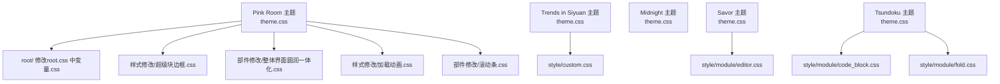
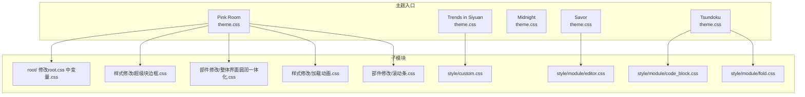
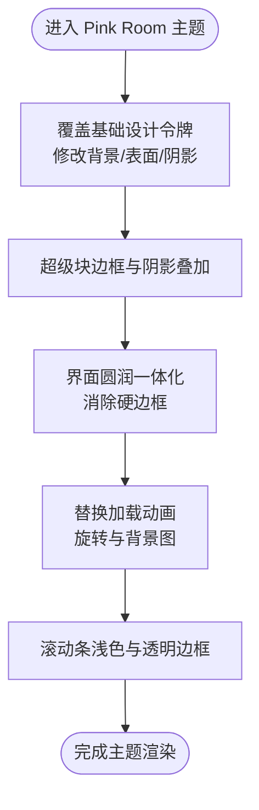
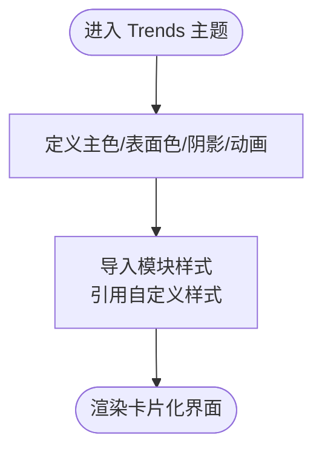
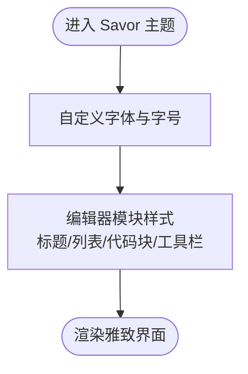
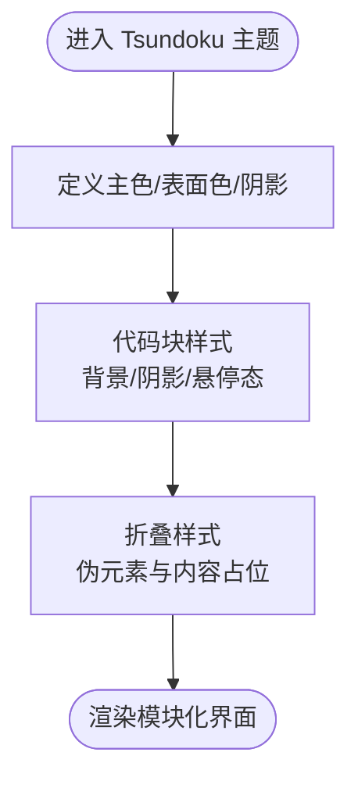
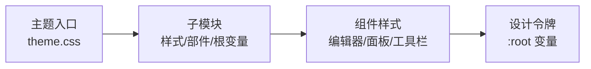

# 主题定制实例

<cite>
**本文档引用的文件**
- [apps/app/public/resources/appearance/themes/pink-room/theme.css](file://apps/app/public/resources/appearance/themes/pink-room/theme.css)
- [apps/app/public/resources/appearance/themes/pink-room/root/修改root.css中变量.css](file://apps/app/public/resources/appearance/themes/pink-room/root/修改root.css中变量.css)
- [apps/app/public/resources/appearance/themes/pink-room/样式修改/超级块边框.css](file://apps/app/public/resources/appearance/themes/pink-room/样式修改/超级块边框.css)
- [apps/app/public/resources/appearance/themes/pink-room/部件修改/整体界面圆润一体化.css](file://apps/app/public/resources/appearance/themes/pink-room/部件修改/整体界面圆润一体化.css)
- [apps/app/public/resources/appearance/themes/pink-room/样式修改/加载动画.css](file://apps/app/public/resources/appearance/themes/pink-room/样式修改/加载动画.css)
- [apps/app/public/resources/appearance/themes/pink-room/部件修改/滚动条.css](file://apps/app/public/resources/appearance/themes/pink-room/部件修改/滚动条.css)
- [apps/app/public/resources/appearance/themes/trends-in-siyuan/theme.css](file://apps/app/public/resources/appearance/themes/trends-in-siyuan/theme.css)
- [apps/app/public/resources/appearance/themes/trends-in-siyuan/style/custom.css](file://apps/app/public/resources/appearance/themes/trends-in-siyuan/style/custom.css)
- [apps/app/public/resources/appearance/themes/midnight/theme.css](file://apps/app/public/resources/appearance/themes/midnight/theme.css)
- [apps/app/public/resources/appearance/themes/Savor/theme.css](file://apps/app/public/resources/appearance/themes/Savor/theme.css)
- [apps/app/public/resources/appearance/themes/Savor/style/module/editor.css](file://apps/app/public/resources/appearance/themes/Savor/style/module/editor.css)
- [apps/app/public/resources/appearance/themes/Tsundoku/theme.css](file://apps/app/public/resources/appearance/themes/Tsundoku/theme.css)
- [apps/app/public/resources/appearance/themes/Tsundoku/style/module/code_block.css](file://apps/app/public/resources/appearance/themes/Tsundoku/style/module/code_block.css)
- [apps/app/public/resources/appearance/themes/Tsundoku/style/module/fold.css](file://apps/app/public/resources/appearance/themes/Tsundoku/style/module/fold.css)
</cite>

## 目录
1. [引言](#引言)
2. [项目结构](#项目结构)
3. [核心组件](#核心组件)
4. [架构总览](#架构总览)
5. [详细组件分析](#详细组件分析)
6. [依赖分析](#依赖分析)
7. [性能考量](#性能考量)
8. [故障排查指南](#故障排查指南)
9. [结论](#结论)
10. [附录](#附录)

## 引言
本文件围绕 Siyuan 笔记插件博客应用中的主题系统，提供可复用的主题定制实例与实践指南。通过对 Pink Room（粉红房间）、Trends in Siyuan（紫罗兰风）、Midnight（午夜）等主题的实际实现进行深入解析，总结设计理念、样式特色与实现技巧，并给出可直接参考的样式片段路径与扩展建议，帮助读者快速实现渐变背景、特殊滤镜、动画效果等视觉目标。

## 项目结构
主题资源集中于应用前端资源目录，按主题独立组织，采用“主题入口 + 子模块导入”的方式管理样式。典型结构包括：
- 主题入口：theme.css 统一导入各子模块样式
- 根变量覆盖：root/ 修改基础设计令牌
- 子模块：部件修改、样式修改、自定义属性等按功能域拆分
- 特性样式：如 Tsundoku 的模块化样式文件

**图表来源**
- [apps/app/public/resources/appearance/themes/pink-room/theme.css:1-100](file://apps/app/public/resources/appearance/themes/pink-room/theme.css#L1-L100)
- [apps/app/public/resources/appearance/themes/pink-room/root/修改root.css中变量.css:1-79](file://apps/app/public/resources/appearance/themes/pink-room/root/修改root.css中变量.css#L1-L79)
- [apps/app/public/resources/appearance/themes/pink-room/样式修改/超级块边框.css:1-66](file://apps/app/public/resources/appearance/themes/pink-room/样式修改/超级块边框.css#L1-L66)
- [apps/app/public/resources/appearance/themes/pink-room/部件修改/整体界面圆润一体化.css:1-158](file://apps/app/public/resources/appearance/themes/pink-room/部件修改/整体界面圆润一体化.css#L1-L158)
- [apps/app/public/resources/appearance/themes/pink-room/样式修改/加载动画.css:1-63](file://apps/app/public/resources/appearance/themes/pink-room/样式修改/加载动画.css#L1-L63)
- [apps/app/public/resources/appearance/themes/pink-room/部件修改/滚动条.css:1-15](file://apps/app/public/resources/appearance/themes/pink-room/部件修改/滚动条.css#L1-L15)
- [apps/app/public/resources/appearance/themes/trends-in-siyuan/theme.css:1-200](file://apps/app/public/resources/appearance/themes/trends-in-siyuan/theme.css#L1-L200)
- [apps/app/public/resources/appearance/themes/trends-in-siyuan/style/custom.css:1-5](file://apps/app/public/resources/appearance/themes/trends-in-siyuan/style/custom.css#L1-L5)
- [apps/app/public/resources/appearance/themes/midnight/theme.css:1-224](file://apps/app/public/resources/appearance/themes/midnight/theme.css#L1-L224)
- [apps/app/public/resources/appearance/themes/Savor/theme.css:1-791](file://apps/app/public/resources/appearance/themes/Savor/theme.css#L1-L791)
- [apps/app/public/resources/appearance/themes/Savor/style/module/editor.css:1-581](file://apps/app/public/resources/appearance/themes/Savor/style/module/editor.css#L1-L581)
- [apps/app/public/resources/appearance/themes/Tsundoku/theme.css:1-1159](file://apps/app/public/resources/appearance/themes/Tsundoku/theme.css#L1-L1159)
- [apps/app/public/resources/appearance/themes/Tsundoku/style/module/code_block.css:1-187](file://apps/app/public/resources/appearance/themes/Tsundoku/style/module/code_block.css#L1-L187)
- [apps/app/public/resources/appearance/themes/Tsundoku/style/module/fold.css:1-319](file://apps/app/public/resources/appearance/themes/Tsundoku/style/module/fold.css#L1-L319)

**章节来源**
- [apps/app/public/resources/appearance/themes/pink-room/theme.css:1-100](file://apps/app/public/resources/appearance/themes/pink-room/theme.css#L1-L100)
- [apps/app/public/resources/appearance/themes/trends-in-siyuan/theme.css:1-200](file://apps/app/public/resources/appearance/themes/trends-in-siyuan/theme.css#L1-L200)
- [apps/app/public/resources/appearance/themes/midnight/theme.css:1-224](file://apps/app/public/resources/appearance/themes/midnight/theme.css#L1-L224)
- [apps/app/public/resources/appearance/themes/Savor/theme.css:1-791](file://apps/app/public/resources/appearance/themes/Savor/theme.css#L1-L791)
- [apps/app/public/resources/appearance/themes/Tsundoku/theme.css:1-1159](file://apps/app/public/resources/appearance/themes/Tsundoku/theme.css#L1-L1159)

## 核心组件
- 设计令牌与主题变量：通过 :root 定义主色、表面色、文字色、阴影、动画曲线等，作为全站风格基线
- 子模块导入：主题入口集中引入各功能域样式，便于维护与组合
- 组件级样式：针对编辑器块、面板、工具栏、滚动条等进行精细化控制
- 动画与交互：通过关键帧、过渡与混合模式实现流畅体验

**章节来源**
- [apps/app/public/resources/appearance/themes/trends-in-siyuan/theme.css:17-193](file://apps/app/public/resources/appearance/themes/trends-in-siyuan/theme.css#L17-L193)
- [apps/app/public/resources/appearance/themes/midnight/theme.css:1-224](file://apps/app/public/resources/appearance/themes/midnight/theme.css#L1-L224)
- [apps/app/public/resources/appearance/themes/pink-room/theme.css:1-100](file://apps/app/public/resources/appearance/themes/pink-room/theme.css#L1-L100)

## 架构总览
主题系统采用“入口聚合 + 子模块解耦”的架构。主题入口负责全局变量与模块导入，子模块按功能域拆分，确保可维护性与可扩展性。

**图表来源**
- [apps/app/public/resources/appearance/themes/pink-room/theme.css:1-100](file://apps/app/public/resources/appearance/themes/pink-room/theme.css#L1-L100)
- [apps/app/public/resources/appearance/themes/pink-room/root/修改root.css中变量.css:1-79](file://apps/app/public/resources/appearance/themes/pink-room/root/修改root.css中变量.css#L1-L79)
- [apps/app/public/resources/appearance/themes/pink-room/样式修改/超级块边框.css:1-66](file://apps/app/public/resources/appearance/themes/pink-room/样式修改/超级块边框.css#L1-L66)
- [apps/app/public/resources/appearance/themes/pink-room/部件修改/整体界面圆润一体化.css:1-158](file://apps/app/public/resources/appearance/themes/pink-room/部件修改/整体界面圆润一体化.css#L1-L158)
- [apps/app/public/resources/appearance/themes/pink-room/样式修改/加载动画.css:1-63](file://apps/app/public/resources/appearance/themes/pink-room/样式修改/加载动画.css#L1-L63)
- [apps/app/public/resources/appearance/themes/pink-room/部件修改/滚动条.css:1-15](file://apps/app/public/resources/appearance/themes/pink-room/部件修改/滚动条.css#L1-L15)
- [apps/app/public/resources/appearance/themes/trends-in-siyuan/style/custom.css:1-5](file://apps/app/public/resources/appearance/themes/trends-in-siyuan/style/custom.css#L1-L5)
- [apps/app/public/resources/appearance/themes/Savor/style/module/editor.css:1-581](file://apps/app/public/resources/appearance/themes/Savor/style/module/editor.css#L1-L581)
- [apps/app/public/resources/appearance/themes/Tsundoku/style/module/code_block.css:1-187](file://apps/app/public/resources/appearance/themes/Tsundoku/style/module/code_block.css#L1-L187)
- [apps/app/public/resources/appearance/themes/Tsundoku/style/module/fold.css:1-319](file://apps/app/public/resources/appearance/themes/Tsundoku/style/module/fold.css#L1-L319)

## 详细组件分析

### Pink Room（粉红房间）
- 设计理念：以柔和粉色为主基调，强调圆润一体化界面与细腻动画，突出编辑器与面板的融合感
- 样式特色：
  - 通过 root 覆盖基础设计令牌，统一工具栏、面包屑、表面色与阴影
  - 超级块边框与阴影叠加，形成层次感与可辨识度
  - 整体界面圆润一体化，减少硬边框，提升柔和度
  - 加载动画替换官方 SVG，使用旋转与背景图实现动态提示
  - 滚动条采用浅色与透明边框，保持背景透亮
- 实现技巧：
  - 使用 :root 变量集中管理主色与表面色，便于主题切换
  - 通过伪元素与动画关键帧实现加载指示器的旋转与位移
  - 利用 box-shadow 与 mix-blend-mode 增强层次与融合

**图表来源**
- [apps/app/public/resources/appearance/themes/pink-room/root/修改root.css中变量.css:1-79](file://apps/app/public/resources/appearance/themes/pink-room/root/修改root.css中变量.css#L1-L79)
- [apps/app/public/resources/appearance/themes/pink-room/样式修改/超级块边框.css:14-20](file://apps/app/public/resources/appearance/themes/pink-room/样式修改/超级块边框.css#L14-L20)
- [apps/app/public/resources/appearance/themes/pink-room/部件修改/整体界面圆润一体化.css:1-158](file://apps/app/public/resources/appearance/themes/pink-room/部件修改/整体界面圆润一体化.css#L1-L158)
- [apps/app/public/resources/appearance/themes/pink-room/样式修改/加载动画.css:12-54](file://apps/app/public/resources/appearance/themes/pink-room/样式修改/加载动画.css#L12-L54)
- [apps/app/public/resources/appearance/themes/pink-room/部件修改/滚动条.css:1-15](file://apps/app/public/resources/appearance/themes/pink-room/部件修改/滚动条.css#L1-L15)

**章节来源**
- [apps/app/public/resources/appearance/themes/pink-room/theme.css:1-100](file://apps/app/public/resources/appearance/themes/pink-room/theme.css#L1-L100)
- [apps/app/public/resources/appearance/themes/pink-room/root/修改root.css中变量.css:1-79](file://apps/app/public/resources/appearance/themes/pink-room/root/修改root.css中变量.css#L1-L79)
- [apps/app/public/resources/appearance/themes/pink-room/样式修改/超级块边框.css:1-66](file://apps/app/public/resources/appearance/themes/pink-room/样式修改/超级块边框.css#L1-L66)
- [apps/app/public/resources/appearance/themes/pink-room/部件修改/整体界面圆润一体化.css:1-158](file://apps/app/public/resources/appearance/themes/pink-room/部件修改/整体界面圆润一体化.css#L1-L158)
- [apps/app/public/resources/appearance/themes/pink-room/样式修改/加载动画.css:1-63](file://apps/app/public/resources/appearance/themes/pink-room/样式修改/加载动画.css#L1-L63)
- [apps/app/public/resources/appearance/themes/pink-room/部件修改/滚动条.css:1-15](file://apps/app/public/resources/appearance/themes/pink-room/部件修改/滚动条.css#L1-L15)

### Trends in Siyuan（紫罗兰风）
- 设计理念：以蓝紫主色与几何线条为核心，强调卡片化与模块化布局
- 样式特色：
  - 通过 :root 定义丰富的主色、表面色、阴影与动画曲线
  - 自定义样式模块（如 custom.css）用于强调摘要等元素
- 实现技巧：
  - 使用 CSS 变量统一管理色彩体系，便于扩展与维护
  - 通过过渡与阴影变量实现一致的交互反馈

**图表来源**
- [apps/app/public/resources/appearance/themes/trends-in-siyuan/theme.css:17-193](file://apps/app/public/resources/appearance/themes/trends-in-siyuan/theme.css#L17-L193)
- [apps/app/public/resources/appearance/themes/trends-in-siyuan/style/custom.css:1-5](file://apps/app/public/resources/appearance/themes/trends-in-siyuan/style/custom.css#L1-L5)

**章节来源**
- [apps/app/public/resources/appearance/themes/trends-in-siyuan/theme.css:1-200](file://apps/app/public/resources/appearance/themes/trends-in-siyuan/theme.css#L1-L200)
- [apps/app/public/resources/appearance/themes/trends-in-siyuan/style/custom.css:1-5](file://apps/app/public/resources/appearance/themes/trends-in-siyuan/style/custom.css#L1-L5)

### Midnight（午夜）
- 设计理念：深色主题，强调对比与可读性，适合夜间或护眼场景
- 样式特色：
  - 深背景与浅文字色搭配，降低视觉疲劳
  - 通过 mix-blend-mode 与滤镜增强图标与工具栏的可辨识度
- 实现技巧：
  - 使用 :root 变量集中管理深色系主色与表面色
  - 通过滤镜与混合模式改善控件在深色背景下的表现

**图表来源**
- [apps/app/public/resources/appearance/themes/midnight/theme.css:1-224](file://apps/app/public/resources/appearance/themes/midnight/theme.css#L1-L224)

**章节来源**
- [apps/app/public/resources/appearance/themes/midnight/theme.css:1-224](file://apps/app/public/resources/appearance/themes/midnight/theme.css#L1-L224)

### Savor（雅致）
- 设计理念：以柔和与圆润为核心，强调编辑器与面板的和谐统一
- 样式特色：
  - 通过 :root 定义丰富的色彩与阴影，配合自定义字体
  - 编辑器模块样式强化标题、列表、代码块与工具栏的细节
- 实现技巧：
  - 使用自定义变量与模块化样式，提升编辑器体验的一致性
  - 通过过渡与阴影变量统一交互反馈

**图表来源**
- [apps/app/public/resources/appearance/themes/Savor/theme.css:73-438](file://apps/app/public/resources/appearance/themes/Savor/theme.css#L73-L438)
- [apps/app/public/resources/appearance/themes/Savor/style/module/editor.css:1-581](file://apps/app/public/resources/appearance/themes/Savor/style/module/editor.css#L1-L581)

**章节来源**
- [apps/app/public/resources/appearance/themes/Savor/theme.css:1-791](file://apps/app/public/resources/appearance/themes/Savor/theme.css#L1-L791)
- [apps/app/public/resources/appearance/themes/Savor/style/module/editor.css:1-581](file://apps/app/public/resources/appearance/themes/Savor/style/module/editor.css#L1-L581)

### Tsundoku（东京）
- 设计理念：以简洁与模块化为主，强调代码块与折叠样式的可读性
- 样式特色：
  - 代码块样式通过背景、阴影与悬停态优化可读性
  - 折叠样式通过伪元素与内容占位符提升折叠块的辨识度
- 实现技巧：
  - 使用 :root 变量统一主色与表面色
  - 通过伪元素与关键帧实现折叠块的视觉提示

**图表来源**
- [apps/app/public/resources/appearance/themes/Tsundoku/theme.css:32-226](file://apps/app/public/resources/appearance/themes/Tsundoku/theme.css#L32-L226)
- [apps/app/public/resources/appearance/themes/Tsundoku/style/module/code_block.css:1-187](file://apps/app/public/resources/appearance/themes/Tsundoku/style/module/code_block.css#L1-L187)
- [apps/app/public/resources/appearance/themes/Tsundoku/style/module/fold.css:1-319](file://apps/app/public/resources/appearance/themes/Tsundoku/style/module/fold.css#L1-L319)

**章节来源**
- [apps/app/public/resources/appearance/themes/Tsundoku/theme.css:1-1159](file://apps/app/public/resources/appearance/themes/Tsundoku/theme.css#L1-L1159)
- [apps/app/public/resources/appearance/themes/Tsundoku/style/module/code_block.css:1-187](file://apps/app/public/resources/appearance/themes/Tsundoku/style/module/code_block.css#L1-L187)
- [apps/app/public/resources/appearance/themes/Tsundoku/style/module/fold.css:1-319](file://apps/app/public/resources/appearance/themes/Tsundoku/style/module/fold.css#L1-L319)

## 依赖分析
- 主题入口与子模块：主题入口集中导入子模块，子模块之间低耦合，便于按需启用
- 设计令牌依赖：各主题通过 :root 变量统一管理色彩与交互，减少重复定义
- 组件依赖：编辑器块、面板、工具栏等组件样式相互独立，通过通用变量与类名约定协同

**图表来源**
- [apps/app/public/resources/appearance/themes/pink-room/theme.css:1-100](file://apps/app/public/resources/appearance/themes/pink-room/theme.css#L1-L100)
- [apps/app/public/resources/appearance/themes/trends-in-siyuan/theme.css:17-193](file://apps/app/public/resources/appearance/themes/trends-in-siyuan/theme.css#L17-L193)
- [apps/app/public/resources/appearance/themes/midnight/theme.css:1-224](file://apps/app/public/resources/appearance/themes/midnight/theme.css#L1-L224)
- [apps/app/public/resources/appearance/themes/Savor/theme.css:73-438](file://apps/app/public/resources/appearance/themes/Savor/theme.css#L73-L438)
- [apps/app/public/resources/appearance/themes/Tsundoku/theme.css:32-226](file://apps/app/public/resources/appearance/themes/Tsundoku/theme.css#L32-L226)

**章节来源**
- [apps/app/public/resources/appearance/themes/pink-room/theme.css:1-100](file://apps/app/public/resources/appearance/themes/pink-room/theme.css#L1-L100)
- [apps/app/public/resources/appearance/themes/trends-in-siyuan/theme.css:1-200](file://apps/app/public/resources/appearance/themes/trends-in-siyuan/theme.css#L1-L200)
- [apps/app/public/resources/appearance/themes/midnight/theme.css:1-224](file://apps/app/public/resources/appearance/themes/midnight/theme.css#L1-L224)
- [apps/app/public/resources/appearance/themes/Savor/theme.css:1-791](file://apps/app/public/resources/appearance/themes/Savor/theme.css#L1-L791)
- [apps/app/public/resources/appearance/themes/Tsundoku/theme.css:1-1159](file://apps/app/public/resources/appearance/themes/Tsundoku/theme.css#L1-L1159)

## 性能考量
- 变量集中管理：通过 :root 变量统一色彩与阴影，减少重复计算与重绘
- 动画与过渡：合理使用过渡与关键帧，避免过度复杂动画导致性能下降
- 模块化导入：按需启用子模块，减少无关样式对渲染的影响
- 深色主题优化：深色背景与浅色文字搭配，减少屏幕亮度波动，提升长时间使用的舒适度

## 故障排查指南
- 加载动画异常：检查伪元素与关键帧是否正确绑定，确认背景图路径与尺寸
- 滚动条样式失效：确认浏览器兼容性与 ::-webkit-scrollbar 规则未被覆盖
- 折叠样式显示异常：检查伪元素与内容占位符是否正确匹配块类型
- 深色主题控件不可辨识：通过 mix-blend-mode 与滤镜调整控件颜色与对比度

**章节来源**
- [apps/app/public/resources/appearance/themes/pink-room/样式修改/加载动画.css:1-63](file://apps/app/public/resources/appearance/themes/pink-room/样式修改/加载动画.css#L1-L63)
- [apps/app/public/resources/appearance/themes/pink-room/部件修改/滚动条.css:1-15](file://apps/app/public/resources/appearance/themes/pink-room/部件修改/滚动条.css#L1-L15)
- [apps/app/public/resources/appearance/themes/Tsundoku/style/module/fold.css:1-319](file://apps/app/public/resources/appearance/themes/Tsundoku/style/module/fold.css#L1-L319)
- [apps/app/public/resources/appearance/themes/midnight/theme.css:216-223](file://apps/app/public/resources/appearance/themes/midnight/theme.css#L216-L223)

## 结论
通过对 Pink Room、Trends in Siyuan、Midnight、Savor、Tsundoku 等主题的系统分析，可以看出该主题系统以“入口聚合 + 子模块解耦”为核心，结合 :root 设计令牌与模块化样式，实现了高度可定制与可维护的视觉体系。读者可据此快速实现渐变背景、特殊滤镜与动画效果，并根据自身需求扩展更多视觉特性。

## 附录
- 实用技巧与创意灵感
  - 使用 :root 变量集中管理色彩与阴影，便于主题切换与一致性维护
  - 通过伪元素与关键帧实现加载动画与折叠提示，提升用户体验
  - 在深色主题中利用 mix-blend-mode 与滤镜优化控件可辨识度
  - 采用模块化导入策略，按需启用子模块，减少样式冗余