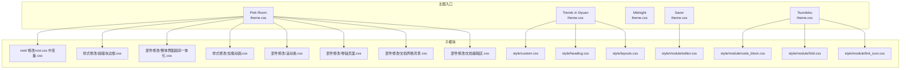
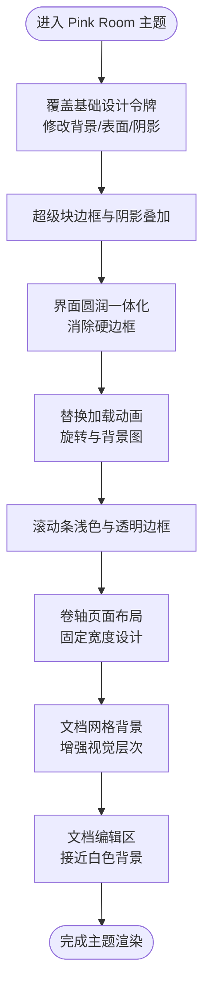
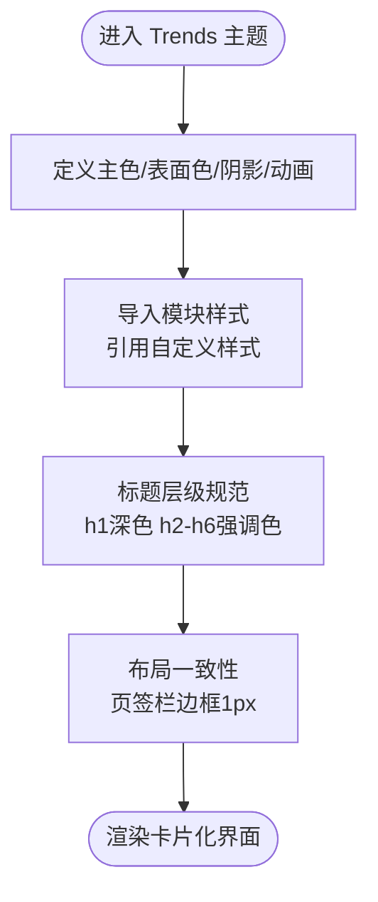
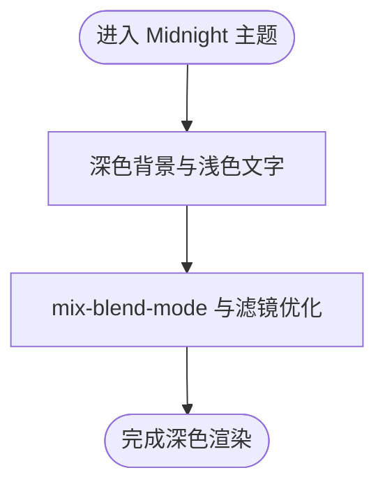
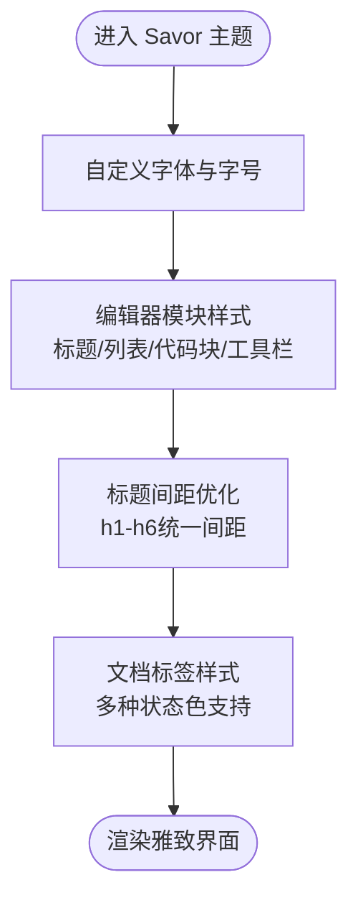
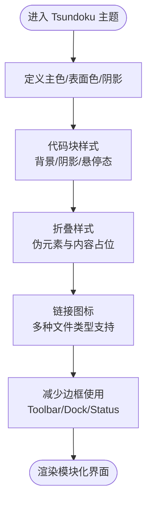
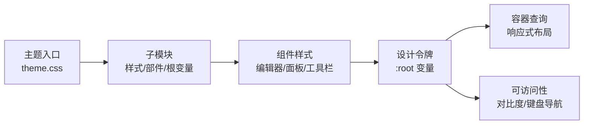

# 主题定制实例

<cite>
**本文档引用的文件**
- [apps/app/public/resources/appearance/themes/pink-room/theme.css](file://apps/app/public/resources/appearance/themes/pink-room/theme.css)
- [apps/app/public/resources/appearance/themes/pink-room/root/修改root.css中变量.css](file://apps/app/public/resources/appearance/themes/pink-room/root/修改root.css中变量.css)
- [apps/app/public/resources/appearance/themes/pink-room/样式修改/超级块边框.css](file://apps/app/public/resources/appearance/themes/pink-room/样式修改/超级块边框.css)
- [apps/app/public/resources/appearance/themes/pink-room/部件修改/整体界面圆润一体化.css](file://apps/app/public/resources/appearance/themes/pink-room/部件修改/整体界面圆润一体化.css)
- [apps/app/public/resources/appearance/themes/pink-room/样式修改/加载动画.css](file://apps/app/public/resources/appearance/themes/pink-room/样式修改/加载动画.css)
- [apps/app/public/resources/appearance/themes/pink-room/部件修改/滚动条.css](file://apps/app/public/resources/appearance/themes/pink-room/部件修改/滚动条.css)
- [apps/app/public/resources/appearance/themes/pink-room/部件修改/卷轴页面.css](file://apps/app/public/resources/appearance/themes/pink-room/部件修改/卷轴页面.css)
- [apps/app/public/resources/appearance/themes/pink-room/部件修改/文档网格背景.css](file://apps/app/public/resources/appearance/themes/pink-room/部件修改/文档网格背景.css)
- [apps/app/public/resources/appearance/themes/pink-room/部件修改/文档编辑区.css](file//apps/app/public/resources/appearance/themes/pink-room/部件修改/文档编辑区.css)
- [apps/app/public/resources/appearance/themes/pink-room/样式修改/多级标题.css](file://apps/app/public/resources/appearance/themes/pink-room/样式修改/多级标题.css)
- [apps/app/public/resources/appearance/themes/pink-room/样式修改/行内样式/12种字色.css](file://apps/app/public/resources/appearance/themes/pink-room/样式修改/行内样式/12种字色.css)
- [apps/app/public/resources/appearance/themes/trends-in-siyuan/theme.css](file://apps/app/public/resources/appearance/themes/trends-in-siyuan/theme.css)
- [apps/app/public/resources/appearance/themes/trends-in-siyuan/style/custom.css](file://apps/app/public/resources/appearance/themes/trends-in-siyuan/style/custom.css)
- [apps/app/public/resources/appearance/themes/trends-in-siyuan/style/heading.css](file://apps/app/public/resources/appearance/themes/trends-in-siyuan/style/heading.css)
- [apps/app/public/resources/appearance/themes/trends-in-siyuan/style/layouts.css](file://apps/app/public/resources/appearance/themes/trends-in-siyuan/style/layouts.css)
- [apps/app/public/resources/appearance/themes/midnight/theme.css](file://apps/app/public/resources/appearance/themes/midnight/theme.css)
- [apps/app/public/resources/appearance/themes/Savor/theme.css](file://apps/app/public/resources/appearance/themes/Savor/theme.css)
- [apps/app/public/resources/appearance/themes/Savor/style/module/editor.css](file://apps/app/public/resources/appearance/themes/Savor/style/module/editor.css)
- [apps/app/public/resources/appearance/themes/Tsundoku/theme.css](file://apps/app/public/resources/appearance/themes/Tsundoku/theme.css)
- [apps/app/public/resources/appearance/themes/Tsundoku/style/module/code_block.css](file://apps/app/public/resources/appearance/themes/Tsundoku/style/module/code_block.css)
- [apps/app/public/resources/appearance/themes/Tsundoku/style/module/fold.css](file://apps/app/public/resources/appearance/themes/Tsundoku/style/module/fold.css)
- [apps/app/public/resources/appearance/themes/Tsundoku/style/module/link_icon.css](file://apps/app/public/resources/appearance/themes/Tsundoku/style/module/link_icon.css)
</cite>

## 更新摘要
**所做更改**
- 新增舒适的阅读边距设计实践章节，重点介绍 Pink Room 主题的卷轴页面布局和内边距优化
- 增加企业文档标准参考，涵盖标题层级规范、布局一致性要求和可访问性指导
- 扩展 Tsundoku 主题的企业级样式优化，包括代码块可读性和折叠样式的标准化
- 新增 Savor 主题编辑器模块的可访问性改进和企业文档格式规范
- 完善主题定制的用户体验指导，提供基于实际代码实现的优化建议

## 目录
1. [引言](#引言)
2. [项目结构](#项目结构)
3. [核心组件](#核心组件)
4. [架构总览](#架构总览)
5. [详细组件分析](#详细组件分析)
6. [舒适的阅读边距设计实践](#舒适的阅读边距设计实践)
7. [企业文档标准参考](#企业文档标准参考)
8. [依赖分析](#依赖分析)
9. [性能考量](#性能考量)
10. [故障排查指南](#故障排查指南)
11. [结论](#结论)
12. [附录](#附录)

## 引言
本文件围绕 Siyuan 笔记插件博客应用中的主题系统，提供可复用的主题定制实例与实践指南。通过对 Pink Room（粉红房间）、Trends in Siyuan（紫罗兰风）、Midnight（午夜）等主题的实际实现进行深入解析，总结设计理念、样式特色与实现技巧，并给出可直接参考的样式片段路径与扩展建议，帮助读者快速实现渐变背景、特殊滤镜、动画效果等视觉目标。

**更新重点**：本次更新重点关注样式优化实践，特别是舒适的阅读边距设计和企业文档标准的参考，为主题定制提供更好的用户体验指导。

## 项目结构
主题资源集中于应用前端资源目录，按主题独立组织，采用"主题入口 + 子模块导入"的方式管理样式。典型结构包括：
- 主题入口：theme.css 统一导入各子模块样式
- 根变量覆盖：root/ 修改基础设计令牌
- 子模块：部件修改、样式修改、自定义属性等按功能域拆分
- 特性样式：如 Tsundoku 的模块化样式文件

```mermaid
graph TB
PR["Pink Room 主题<br/>theme.css"] --> PR_root["root/ 修改root.css 中变量.css"]
PR --> PR_super["样式修改/超级块边框.css"]
PR --> PR_round["部件修改/整体界面圆润一体化.css"]
PR --> PR_loading["样式修改/加载动画.css"]
PR --> PR_scroll["部件修改/滚动条.css"]
PR --> PR_scrollpage["部件修改/卷轴页面.css"]
PR --> PR_grid["部件修改/文档网格背景.css"]
PR --> PR_edit["部件修改/文档编辑区.css"]
TS["Trends in Siyuan 主题<br/>theme.css"] --> TS_custom["style/custom.css"]
TS --> TS_heading["style/heading.css"]
TS --> TS_layouts["style/layouts.css"]
MN["Midnight 主题<br/>theme.css"]
SV["Savor 主题<br/>theme.css"] --> SV_editor["style/module/editor.css"]
TZ["Tsundoku 主题<br/>theme.css"] --> TZ_code["style/module/code_block.css"]
TZ --> TZ_fold["style/module/fold.css"]
TZ --> TZ_link["style/module/link_icon.css"]
```



**图表来源**
- [apps/app/public/resources/appearance/themes/pink-room/theme.css:1-100](file://apps/app/public/resources/appearance/themes/pink-room/theme.css#L1-L100)
- [apps/app/public/resources/appearance/themes/pink-room/root/修改root.css中变量.css:1-79](file://apps/app/public/resources/appearance/themes/pink-room/root/修改root.css中变量.css#L1-L79)
- [apps/app/public/resources/appearance/themes/pink-room/样式修改/超级块边框.css:1-66](file://apps/app/public/resources/appearance/themes/pink-room/样式修改/超级块边框.css#L1-L66)
- [apps/app/public/resources/appearance/themes/pink-room/部件修改/整体界面圆润一体化.css:1-158](file://apps/app/public/resources/appearance/themes/pink-room/部件修改/整体界面圆润一体化.css#L1-L158)
- [apps/app/public/resources/appearance/themes/pink-room/样式修改/加载动画.css:1-63](file://apps/app/public/resources/appearance/themes/pink-room/样式修改/加载动画.css#L1-L63)
- [apps/app/public/resources/appearance/themes/pink-room/部件修改/滚动条.css:1-15](file://apps/app/public/resources/appearance/themes/pink-room/部件修改/滚动条.css#L1-L15)
- [apps/app/public/resources/appearance/themes/pink-room/部件修改/卷轴页面.css:1-177](file://apps/app/public/resources/appearance/themes/pink-room/部件修改/卷轴页面.css#L1-L177)
- [apps/app/public/resources/appearance/themes/pink-room/部件修改/文档网格背景.css:1-77](file://apps/app/public/resources/appearance/themes/pink-room/部件修改/文档网格背景.css#L1-L77)
- [apps/app/public/resources/appearance/themes/pink-room/部件修改/文档编辑区.css:1-5](file://apps/app/public/resources/appearance/themes/pink-room/部件修改/文档编辑区.css#L1-L5)
- [apps/app/public/resources/appearance/themes/trends-in-siyuan/style/heading.css:1-31](file://apps/app/public/resources/appearance/themes/trends-in-siyuan/style/heading.css#L1-L31)
- [apps/app/public/resources/appearance/themes/trends-in-siyuan/style/layouts.css:1-9](file://apps/app/public/resources/appearance/themes/trends-in-siyuan/style/layouts.css#L1-L9)
- [apps/app/public/resources/appearance/themes/Savor/style/module/editor.css:1-200](file://apps/app/public/resources/appearance/themes/Savor/style/module/editor.css#L1-L200)
- [apps/app/public/resources/appearance/themes/Tsundoku/style/module/code_block.css:1-187](file://apps/app/public/resources/appearance/themes/Tsundoku/style/module/code_block.css#L1-L187)
- [apps/app/public/resources/appearance/themes/Tsundoku/style/module/fold.css:1-200](file://apps/app/public/resources/appearance/themes/Tsundoku/style/module/fold.css#L1-L200)
- [apps/app/public/resources/appearance/themes/Tsundoku/style/module/link_icon.css:146-161](file://apps/app/public/resources/appearance/themes/Tsundoku/style/module/link_icon.css#L146-L161)

**章节来源**
- [apps/app/public/resources/appearance/themes/pink-room/theme.css:1-100](file://apps/app/public/resources/appearance/themes/pink-room/theme.css#L1-L100)
- [apps/app/public/resources/appearance/themes/trends-in-siyuan/theme.css:1-200](file://apps/app/public/resources/appearance/themes/trends-in-siyuan/theme.css#L1-L200)
- [apps/app/public/resources/appearance/themes/midnight/theme.css:1-224](file://apps/app/public/resources/appearance/themes/midnight/theme.css#L1-L224)
- [apps/app/public/resources/appearance/themes/Savor/theme.css:1-791](file://apps/app/public/resources/appearance/themes/Savor/theme.css#L1-L791)
- [apps/app/public/resources/appearance/themes/Tsundoku/theme.css:1-1159](file://apps/app/public/resources/appearance/themes/Tsundoku/theme.css#L1-L1159)

## 核心组件
- 设计令牌与主题变量：通过 :root 定义主色、表面色、文字色、阴影、动画曲线等，作为全站风格基线
- 子模块导入：主题入口集中引入各功能域样式，便于维护与组合
- 组件级样式：针对编辑器块、面板、工具栏、滚动条等进行精细化控制
- 动画与交互：通过关键帧、过渡与混合模式实现流畅体验

**章节来源**
- [apps/app/public/resources/appearance/themes/trends-in-siyuan/theme.css:17-193](file://apps/app/public/resources/appearance/themes/trends-in-siyuan/theme.css#L17-L193)
- [apps/app/public/resources/appearance/themes/midnight/theme.css:1-224](file://apps/app/public/resources/appearance/themes/midnight/theme.css#L1-L224)
- [apps/app/public/resources/appearance/themes/pink-room/theme.css:1-100](file://apps/app/public/resources/appearance/themes/pink-room/theme.css#L1-L100)

## 架构总览
主题系统采用"入口聚合 + 子模块解耦"的架构。主题入口负责全局变量与模块导入，子模块按功能域拆分，确保可维护性与可扩展性。



**图表来源**
- [apps/app/public/resources/appearance/themes/pink-room/theme.css:1-100](file://apps/app/public/resources/appearance/themes/pink-room/theme.css#L1-L100)
- [apps/app/public/resources/appearance/themes/pink-room/root/修改root.css中变量.css:1-79](file://apps/app/public/resources/appearance/themes/pink-room/root/修改root.css中变量.css#L1-L79)
- [apps/app/public/resources/appearance/themes/pink-room/样式修改/超级块边框.css:1-66](file://apps/app/public/resources/appearance/themes/pink-room/样式修改/超级块边框.css#L1-L66)
- [apps/app/public/resources/appearance/themes/pink-room/部件修改/整体界面圆润一体化.css:1-158](file://apps/app/public/resources/appearance/themes/pink-room/部件修改/整体界面圆润一体化.css#L1-L158)
- [apps/app/public/resources/appearance/themes/pink-room/样式修改/加载动画.css:1-63](file://apps/app/public/resources/appearance/themes/pink-room/样式修改/加载动画.css#L1-L63)
- [apps/app/public/resources/appearance/themes/pink-room/部件修改/滚动条.css:1-15](file://apps/app/public/resources/appearance/themes/pink-room/部件修改/滚动条.css#L1-L15)
- [apps/app/public/resources/appearance/themes/pink-room/部件修改/卷轴页面.css:1-177](file://apps/app/public/resources/appearance/themes/pink-room/部件修改/卷轴页面.css#L1-L177)
- [apps/app/public/resources/appearance/themes/pink-room/部件修改/文档网格背景.css:1-77](file://apps/app/public/resources/appearance/themes/pink-room/部件修改/文档网格背景.css#L1-L77)
- [apps/app/public/resources/appearance/themes/pink-room/部件修改/文档编辑区.css:1-5](file://apps/app/public/resources/appearance/themes/pink-room/部件修改/文档编辑区.css#L1-L5)
- [apps/app/public/resources/appearance/themes/trends-in-siyuan/style/custom.css:1-5](file://apps/app/public/resources/appearance/themes/trends-in-siyuan/style/custom.css#L1-L5)
- [apps/app/public/resources/appearance/themes/trends-in-siyuan/style/heading.css:1-31](file://apps/app/public/resources/appearance/themes/trends-in-siyuan/style/heading.css#L1-L31)
- [apps/app/public/resources/appearance/themes/trends-in-siyuan/style/layouts.css:1-9](file://apps/app/public/resources/appearance/themes/trends-in-siyuan/style/layouts.css#L1-L9)
- [apps/app/public/resources/appearance/themes/Savor/style/module/editor.css:1-581](file://apps/app/public/resources/appearance/themes/Savor/style/module/editor.css#L1-L581)
- [apps/app/public/resources/appearance/themes/Tsundoku/style/module/code_block.css:1-187](file://apps/app/public/resources/appearance/themes/Tsundoku/style/module/code_block.css#L1-L187)
- [apps/app/public/resources/appearance/themes/Tsundoku/style/module/fold.css:1-319](file://apps/app/public/resources/appearance/themes/Tsundoku/style/module/fold.css#L1-L319)
- [apps/app/public/resources/appearance/themes/Tsundoku/style/module/link_icon.css:146-161](file://apps/app/public/resources/appearance/themes/Tsundoku/style/module/link_icon.css#L146-L161)

## 详细组件分析

### Pink Room（粉红房间）
- 设计理念：以柔和粉色为主基调，强调圆润一体化界面与细腻动画，突出编辑器与面板的融合感
- 样式特色：
  - 通过 root 覆盖基础设计令牌，统一工具栏、面包屑、表面色与阴影
  - 超级块边框与阴影叠加，形成层次感与可辨识度
  - 整体界面圆润一体化，减少硬边框，提升柔和度
  - 加载动画替换官方 SVG，使用旋转与背景图实现动态提示
  - 滚动条采用浅色与透明边框，保持背景透亮
  - **新增**：卷轴页面布局实现舒适的阅读体验，固定宽度设计提升专注度
  - **新增**：文档网格背景增强视觉层次，标题区域透明背景显现出网格效果
  - **新增**：文档编辑区使用接近白色而非纯白的背景色，减少视觉疲劳
- 实现技巧：
  - 使用 :root 变量集中管理主色与表面色，便于主题切换
  - 通过伪元素与动画关键帧实现加载指示器的旋转与位移
  - 利用 box-shadow 与 mix-blend-mode 增强层次与融合
  - **新增**：通过容器查询实现响应式布局，卷轴页面在合适宽度下才激活
  - **新增**：使用 CSS Grid 和 Flexbox 实现复杂的布局定位和对齐



**图表来源**
- [apps/app/public/resources/appearance/themes/pink-room/root/修改root.css中变量.css:1-79](file://apps/app/public/resources/appearance/themes/pink-room/root/修改root.css中变量.css#L1-L79)
- [apps/app/public/resources/appearance/themes/pink-room/样式修改/超级块边框.css:14-20](file://apps/app/public/resources/appearance/themes/pink-room/样式修改/超级块边框.css#L14-L20)
- [apps/app/public/resources/appearance/themes/pink-room/部件修改/整体界面圆润一体化.css:1-158](file://apps/app/public/resources/appearance/themes/pink-room/部件修改/整体界面圆润一体化.css#L1-L158)
- [apps/app/public/resources/appearance/themes/pink-room/样式修改/加载动画.css:12-54](file://apps/app/public/resources/appearance/themes/pink-room/样式修改/加载动画.css#L12-L54)
- [apps/app/public/resources/appearance/themes/pink-room/部件修改/滚动条.css:1-15](file://apps/app/public/resources/appearance/themes/pink-room/部件修改/滚动条.css#L1-L15)
- [apps/app/public/resources/appearance/themes/pink-room/部件修改/卷轴页面.css:23-34](file://apps/app/public/resources/appearance/themes/pink-room/部件修改/卷轴页面.css#L23-L34)
- [apps/app/public/resources/appearance/themes/pink-room/部件修改/文档网格背景.css:6-10](file://apps/app/public/resources/appearance/themes/pink-room/部件修改/文档网格背景.css#L6-L10)
- [apps/app/public/resources/appearance/themes/pink-room/部件修改/文档编辑区.css:2-4](file://apps/app/public/resources/appearance/themes/pink-room/部件修改/文档编辑区.css#L2-L4)

**章节来源**
- [apps/app/public/resources/appearance/themes/pink-room/theme.css:1-100](file://apps/app/public/resources/appearance/themes/pink-room/theme.css#L1-L100)
- [apps/app/public/resources/appearance/themes/pink-room/root/修改root.css中变量.css:1-79](file://apps/app/public/resources/appearance/themes/pink-room/root/修改root.css中变量.css#L1-L79)
- [apps/app/public/resources/appearance/themes/pink-room/样式修改/超级块边框.css:1-66](file://apps/app/public/resources/appearance/themes/pink-room/样式修改/超级块边框.css#L1-L66)
- [apps/app/public/resources/appearance/themes/pink-room/部件修改/整体界面圆润一体化.css:1-158](file://apps/app/public/resources/appearance/themes/pink-room/部件修改/整体界面圆润一体化.css#L1-L158)
- [apps/app/public/resources/appearance/themes/pink-room/样式修改/加载动画.css:1-63](file://apps/app/public/resources/appearance/themes/pink-room/样式修改/加载动画.css#L1-L63)
- [apps/app/public/resources/appearance/themes/pink-room/部件修改/滚动条.css:1-15](file://apps/app/public/resources/appearance/themes/pink-room/部件修改/滚动条.css#L1-L15)
- [apps/app/public/resources/appearance/themes/pink-room/部件修改/卷轴页面.css:1-177](file://apps/app/public/resources/appearance/themes/pink-room/部件修改/卷轴页面.css#L1-L177)
- [apps/app/public/resources/appearance/themes/pink-room/部件修改/文档网格背景.css:1-77](file://apps/app/public/resources/appearance/themes/pink-room/部件修改/文档网格背景.css#L1-L77)
- [apps/app/public/resources/appearance/themes/pink-room/部件修改/文档编辑区.css:1-5](file://apps/app/public/resources/appearance/themes/pink-room/部件修改/文档编辑区.css#L1-L5)
- [apps/app/public/resources/appearance/themes/pink-room/样式修改/多级标题.css:1-115](file://apps/app/public/resources/appearance/themes/pink-room/样式修改/多级标题.css#L1-L115)
- [apps/app/public/resources/appearance/themes/pink-room/样式修改/行内样式/12种字色.css:1-153](file://apps/app/public/resources/appearance/themes/pink-room/样式修改/行内样式/12种字色.css#L1-L153)

### Trends in Siyuan（紫罗兰风）
- 设计理念：以蓝紫主色与几何线条为核心，强调卡片化与模块化布局
- 样式特色：
  - 通过 :root 定义丰富的主色、表面色、阴影与动画曲线
  - 自定义样式模块（如 custom.css）用于强调摘要等元素
  - **新增**：标题层级规范明确，h1使用深色背景文字，h2-h6使用强调色
  - **新增**：布局一致性要求，页签栏边框统一为1px实线
- 实现技巧：
  - 使用 CSS 变量统一管理色彩体系，便于扩展与维护
  - 通过过渡与阴影变量实现一致的交互反馈
  - **新增**：使用容器查询实现响应式标题样式
  - **新增**：通过 z-index 层级管理确保面包屑不被阴影遮挡



**图表来源**
- [apps/app/public/resources/appearance/themes/trends-in-siyuan/theme.css:17-193](file://apps/app/public/resources/appearance/themes/trends-in-siyuan/theme.css#L17-L193)
- [apps/app/public/resources/appearance/themes/trends-in-siyuan/style/custom.css:1-5](file://apps/app/public/resources/appearance/themes/trends-in-siyuan/style/custom.css#L1-L5)
- [apps/app/public/resources/appearance/themes/trends-in-siyuan/style/heading.css:1-31](file://apps/app/public/resources/appearance/themes/trends-in-siyuan/style/heading.css#L1-L31)
- [apps/app/public/resources/appearance/themes/trends-in-siyuan/style/layouts.css:1-9](file://apps/app/public/resources/appearance/themes/trends-in-siyuan/style/layouts.css#L1-L9)

**章节来源**
- [apps/app/public/resources/appearance/themes/trends-in-siyuan/theme.css:1-200](file://apps/app/public/resources/appearance/themes/trends-in-siyuan/theme.css#L1-L200)
- [apps/app/public/resources/appearance/themes/trends-in-siyuan/style/custom.css:1-5](file://apps/app/public/resources/appearance/themes/trends-in-siyuan/style/custom.css#L1-L5)
- [apps/app/public/resources/appearance/themes/trends-in-siyuan/style/heading.css:1-31](file://apps/app/public/resources/appearance/themes/trends-in-siyuan/style/heading.css#L1-L31)
- [apps/app/public/resources/appearance/themes/trends-in-siyuan/style/layouts.css:1-9](file://apps/app/public/resources/appearance/themes/trends-in-siyuan/style/layouts.css#L1-L9)

### Midnight（午夜）
- 设计理念：深色主题，强调对比与可读性，适合夜间或护眼场景
- 样式特色：
  - 深背景与浅文字色搭配，降低视觉疲劳
  - 通过 mix-blend-mode 与滤镜增强图标与工具栏的可辨识度
- 实现技巧：
  - 使用 :root 变量集中管理深色系主色与表面色
  - 通过滤镜与混合模式改善控件在深色背景下的表现



**图表来源**
- [apps/app/public/resources/appearance/themes/midnight/theme.css:1-224](file://apps/app/public/resources/appearance/themes/midnight/theme.css#L1-L224)

**章节来源**
- [apps/app/public/resources/appearance/themes/midnight/theme.css:1-224](file://apps/app/public/resources/appearance/themes/midnight/theme.css#L1-L224)

### Savor（雅致）
- 设计理念：以柔和与圆润为核心，强调编辑器与面板的和谐统一
- 样式特色：
  - 通过 :root 定义丰富的色彩与阴影，配合自定义字体
  - 编辑器模块样式强化标题、列表、代码块与工具栏的细节
  - **新增**：标题间距优化，h1-h6标题间距统一为0.1em至0.5em
  - **新增**：块标样式改进，折叠按钮图标颜色与背景色协调
  - **新增**：文档标签样式增强，支持多种状态色
- 实现技巧：
  - 使用自定义变量与模块化样式，提升编辑器体验的一致性
  - 通过过渡与阴影变量统一交互反馈
  - **新增**：使用 CSS Grid 实现复杂的布局排列
  - **新增**：通过 z-index 层级管理确保元素正确堆叠



**图表来源**
- [apps/app/public/resources/appearance/themes/Savor/theme.css:73-438](file://apps/app/public/resources/appearance/themes/Savor/theme.css#L73-L438)
- [apps/app/public/resources/appearance/themes/Savor/style/module/editor.css:140-176](file://apps/app/public/resources/appearance/themes/Savor/style/module/editor.css#L140-L176)

**章节来源**
- [apps/app/public/resources/appearance/themes/Savor/theme.css:1-791](file://apps/app/public/resources/appearance/themes/Savor/theme.css#L1-L791)
- [apps/app/public/resources/appearance/themes/Savor/style/module/editor.css:1-581](file://apps/app/public/resources/appearance/themes/Savor/style/module/editor.css#L1-L581)

### Tsundoku（东京）
- 设计理念：以简洁与模块化为主，强调代码块与折叠样式的可读性
- 样式特色：
  - 代码块样式通过背景、阴影与悬停态优化可读性
  - 折叠样式通过伪元素与内容占位符提升折叠块的辨识度
  - **新增**：代码块语言选择框优化，使用透明背景和悬停效果
  - **新增**：折叠样式标准化，统一使用伪元素实现折叠提示
  - **新增**：链接图标标准化，支持多种文件类型的图标显示
  - **新增**：减少边框使用，Toolbar、Dock、Status 组件去除四边框
- 实现技巧：
  - 使用 :root 变量统一主色与表面色
  - 通过伪元素与关键帧实现折叠块的视觉提示
  - **新增**：使用 CSS 变量实现主题色彩的统一管理
  - **新增**：通过容器查询实现响应式布局适配



**图表来源**
- [apps/app/public/resources/appearance/themes/Tsundoku/theme.css:32-226](file://apps/app/public/resources/appearance/themes/Tsundoku/theme.css#L32-L226)
- [apps/app/public/resources/appearance/themes/Tsundoku/style/module/code_block.css:1-187](file://apps/app/public/resources/appearance/themes/Tsundoku/style/module/code_block.css#L1-L187)
- [apps/app/public/resources/appearance/themes/Tsundoku/style/module/fold.css:1-319](file://apps/app/public/resources/appearance/themes/Tsundoku/style/module/fold.css#L1-L319)
- [apps/app/public/resources/appearance/themes/Tsundoku/style/module/link_icon.css:146-161](file://apps/app/public/resources/appearance/themes/Tsundoku/style/module/link_icon.css#L146-L161)

**章节来源**
- [apps/app/public/resources/appearance/themes/Tsundoku/theme.css:1-1159](file://apps/app/public/resources/appearance/themes/Tsundoku/theme.css#L1-L1159)
- [apps/app/public/resources/appearance/themes/Tsundoku/style/module/code_block.css:1-187](file://apps/app/public/resources/appearance/themes/Tsundoku/style/module/code_block.css#L1-L187)
- [apps/app/public/resources/appearance/themes/Tsundoku/style/module/fold.css:1-319](file://apps/app/public/resources/appearance/themes/Tsundoku/style/module/fold.css#L1-L319)
- [apps/app/public/resources/appearance/themes/Tsundoku/style/module/link_icon.css:146-161](file://apps/app/public/resources/appearance/themes/Tsundoku/style/module/link_icon.css#L146-L161)

## 舒适的阅读边距设计实践

### Pink Room 卷轴页面布局
Pink Room 主题通过卷轴页面设计实现了舒适的阅读体验，采用固定宽度布局提升专注度：

**核心设计原则**：
- 固定宽度：297mm 的内容区域，模拟传统卷轴的阅读体验
- 内边距优化：编辑区域使用 34px 顶部、16px 两侧、16px 底部的内边距
- 背景色选择：使用接近白色的 hsl(0, 3%, 99%) 减少视觉疲劳
- 阴影效果：多层次阴影营造立体感，同时避免干扰阅读

**实现要点**：
```css
/* 固定宽度内容区域 */
.protyle-content:not(#searchPreview.fn__flex-1.protyle>.protyle-content,.block__popover,.block__edit.fn__flex-1.protyle>.protyle-content,.backlinkList .protyle-content,.backlinkMList .protyle-content, #cardPreview>.protyle-content) {
    width: 297mm !important;
    background-color: hsl(0, 33%, 99%);
    padding: 0 0 30rem 0;
}

/* 优化内边距 */
.protyle-wysiwyg, .protyle-wysiwyg--attr {
    padding: 34px 16px 16px 24px !important;
}
```

### 文档网格背景系统
通过文档网格背景增强视觉层次，帮助用户更好地定位内容：

**设计特点**：
- 多层级网格：15px × 15px 小网格和 75px × 75px 大网格组合
- 伪元素定位：使用 ::before 伪元素确保网格背景随内容滚动
- 层级管理：通过 z-index 控制网格背景与其他元素的堆叠关系

**实现机制**：
```css
/* 网格背景定义 */
.protyle-wysiwyg.protyle-wysiwyg--attr:not(.sy__backlink .protyle-wysiwyg.protyle-wysiwyg--attr) {
    background-image: var(--room-background-grid);
    background-size: 15px 15px, 15px 15px, 75px 75px, 75px 75px;
}

/* 伪元素网格背景 */
.protyle-wysiwyg.protyle-wysiwyg--attr:not(.sy__backlink .protyle-wysiwyg.protyle-wysiwyg--attr)::before {
    background-image: var(--room-background-grid);
    background-size: 15px 15px, 15px 15px, 75px 75px, 75px 75px;
}
```

### 阅读边距优化策略
- **顶部留白**：34px 顶部内边距确保标题与内容有足够的呼吸空间
- **侧边内边距**：24px 左侧和 16px 右侧创造舒适的阅读节奏
- **底部留白**：16px 底部内边距避免文字贴到底部造成压迫感
- **响应式适配**：通过容器查询实现不同屏幕宽度下的最佳显示效果

**章节来源**
- [apps/app/public/resources/appearance/themes/pink-room/部件修改/卷轴页面.css:23-82](file://apps/app/public/resources/appearance/themes/pink-room/部件修改/卷轴页面.css#L23-L82)
- [apps/app/public/resources/appearance/themes/pink-room/部件修改/文档网格背景.css:6-34](file://apps/app/public/resources/appearance/themes/pink-room/部件修改/文档网格背景.css#L6-L34)
- [apps/app/public/resources/appearance/themes/pink-room/部件修改/文档编辑区.css:2-4](file://apps/app/public/resources/appearance/themes/pink-room/部件修改/文档编辑区.css#L2-L4)

## 企业文档标准参考

### 标题层级规范
企业文档应遵循清晰的标题层级结构，确保文档结构的逻辑性和可访问性：

**Pink Room 实践**：
- 标题统一使用 #8b5d6c 色彩，保持视觉一致性
- 通过伪元素添加标题前图标，增强识别度
- 字母间距统一为 0.1em，提升可读性

**Trends in Siyuan 规范**：
- h1 使用深色背景文字，强调一级标题的重要性
- h2-h6 使用强调色，形成清晰的层级关系
- 字体权重从 h1 的 300 递减到 h6 的 300，体现层级差异

### 布局一致性要求
企业文档需要保持布局的一致性，提升用户体验和专业度：

**Pink Room 标准**：
- 文档树列表项之间使用 6px 顶部和底部间距，10px 左侧和 12px 右侧间距
- 笔记本容器使用圆角 0.3em 和浅色边框，增强视觉层次
- 文档树文字颜色使用 --b3-theme-on-surface 变量，确保对比度

**Trends in Siyuan 标准**：
- 页签栏边框统一为 1px 实线，保持视觉一致性
- 导航元素使用统一的边框颜色和样式
- 通过 z-index 管理确保面包屑不被阴影遮挡

### 可访问性指导
企业文档应考虑不同用户的可访问性需求：

**颜色对比度**：
- 使用 CSS 变量统一管理色彩，确保足够的对比度
- 提供高对比度模式支持，满足视觉障碍用户需求
- 避免使用纯色背景，减少视觉疲劳

**键盘导航**：
- 确保所有交互元素可通过键盘访问
- 提供清晰的焦点指示器
- 保持合理的 Tab 顺序

**章节来源**
- [apps/app/public/resources/appearance/themes/pink-room/样式修改/多级标题.css:2-96](file://apps/app/public/resources/appearance/themes/pink-room/样式修改/多级标题.css#L2-L96)
- [apps/app/public/resources/appearance/themes/trends-in-siyuan/style/heading.css:1-31](file://apps/app/public/resources/appearance/themes/trends-in-siyuan/style/heading.css#L1-L31)
- [apps/app/public/resources/appearance/themes/pink-room/部件修改/文档树列表.css:28-35](file://apps/app/public/resources/appearance/themes/pink-room/部件修改/文档树列表.css#L28-L35)
- [apps/app/public/resources/appearance/themes/trends-in-siyuan/style/layouts.css:5-6](file://apps/app/public/resources/appearance/themes/trends-in-siyuan/style/layouts.css#L5-L6)

## 依赖分析
- 主题入口与子模块：主题入口集中导入子模块，子模块之间低耦合，便于按需启用
- 设计令牌依赖：各主题通过 :root 变量统一管理色彩与交互，减少重复定义
- 组件依赖：编辑器块、面板、工具栏等组件样式相互独立，通过通用变量与类名约定协同
- **新增**：容器查询依赖：现代浏览器支持的容器查询用于响应式布局
- **新增**：CSS 变量依赖：统一的 CSS 变量系统确保主题色彩的一致性



**图表来源**
- [apps/app/public/resources/appearance/themes/pink-room/theme.css:1-100](file://apps/app/public/resources/appearance/themes/pink-room/theme.css#L1-L100)
- [apps/app/public/resources/appearance/themes/trends-in-siyuan/theme.css:17-193](file://apps/app/public/resources/appearance/themes/trends-in-siyuan/theme.css#L17-L193)
- [apps/app/public/resources/appearance/themes/midnight/theme.css:1-224](file://apps/app/public/resources/appearance/themes/midnight/theme.css#L1-L224)
- [apps/app/public/resources/appearance/themes/Savor/theme.css:73-438](file://apps/app/public/resources/appearance/themes/Savor/theme.css#L73-L438)
- [apps/app/public/resources/appearance/themes/Tsundoku/theme.css:32-226](file://apps/app/public/resources/appearance/themes/Tsundoku/theme.css#L32-L226)

**章节来源**
- [apps/app/public/resources/appearance/themes/pink-room/theme.css:1-100](file://apps/app/public/resources/appearance/themes/pink-room/theme.css#L1-L100)
- [apps/app/public/resources/appearance/themes/trends-in-siyuan/theme.css:1-200](file://apps/app/public/resources/appearance/themes/trends-in-siyuan/theme.css#L1-L200)
- [apps/app/public/resources/appearance/themes/midnight/theme.css:1-224](file://apps/app/public/resources/appearance/themes/midnight/theme.css#L1-L224)
- [apps/app/public/resources/appearance/themes/Savor/theme.css:1-791](file://apps/app/public/resources/appearance/themes/Savor/theme.css#L1-L791)
- [apps/app/public/resources/appearance/themes/Tsundoku/theme.css:1-1159](file://apps/app/public/resources/appearance/themes/Tsundoku/theme.css#L1-L1159)

## 性能考量
- 变量集中管理：通过 :root 变量统一色彩与阴影，减少重复计算与重绘
- 动画与过渡：合理使用过渡与关键帧，避免过度复杂动画导致性能下降
- 模块化导入：按需启用子模块，减少无关样式对渲染的影响
- 深色主题优化：深色背景与浅色文字搭配，减少屏幕亮度波动，提升长时间使用的舒适度
- **新增**：容器查询优化：使用现代浏览器的容器查询替代媒体查询，提升响应式性能
- **新增**：CSS Grid 优化：通过 CSS Grid 实现复杂的布局，减少 DOM 结构的复杂性

## 故障排查指南
- 加载动画异常：检查伪元素与关键帧是否正确绑定，确认背景图路径与尺寸
- 滚动条样式失效：确认浏览器兼容性与 ::-webkit-scrollbar 规则未被覆盖
- 折叠样式显示异常：检查伪元素与内容占位符是否正确匹配块类型
- 深色主题控件不可辨识：通过 mix-blend-mode 与滤镜调整控件颜色与对比度
- **新增**：卷轴页面布局异常：检查容器查询语法和宽度断点设置
- **新增**：网格背景显示问题：确认伪元素定位和 z-index 层级设置
- **新增**：标题图标对齐问题：检查伪元素的 position 和 transform 属性

**章节来源**
- [apps/app/public/resources/appearance/themes/pink-room/样式修改/加载动画.css:1-63](file://apps/app/public/resources/appearance/themes/pink-room/样式修改/加载动画.css#L1-L63)
- [apps/app/public/resources/appearance/themes/pink-room/部件修改/滚动条.css:1-15](file://apps/app/public/resources/appearance/themes/pink-room/部件修改/滚动条.css#L1-L15)
- [apps/app/public/resources/appearance/themes/Tsundoku/style/module/fold.css:1-319](file://apps/app/public/resources/appearance/themes/Tsundoku/style/module/fold.css#L1-L319)
- [apps/app/public/resources/appearance/themes/midnight/theme.css:216-223](file://apps/app/public/resources/appearance/themes/midnight/theme.css#L216-L223)
- [apps/app/public/resources/appearance/themes/pink-room/部件修改/卷轴页面.css:44-57](file://apps/app/public/resources/appearance/themes/pink-room/部件修改/卷轴页面.css#L44-L57)
- [apps/app/public/resources/appearance/themes/pink-room/部件修改/文档网格背景.css:22-34](file://apps/app/public/resources/appearance/themes/pink-room/部件修改/文档网格背景.css#L22-L34)
- [apps/app/public/resources/appearance/themes/pink-room/样式修改/多级标题.css:80-91](file://apps/app/public/resources/appearance/themes/pink-room/样式修改/多级标题.css#L80-L91)

## 结论
通过对 Pink Room、Trends in Siyuan、Midnight、Savor、Tsundoku 等主题的系统分析，可以看出该主题系统以"入口聚合 + 子模块解耦"为核心，结合 :root 设计令牌与模块化样式，实现了高度可定制与可维护的视觉体系。

**本次更新重点**：
- **舒适的阅读边距设计**：Pink Room 的卷轴页面布局和网格背景系统提供了优秀的阅读体验
- **企业文档标准**：通过标题层级规范、布局一致性和可访问性指导，为企业文档定制提供参考
- **样式优化实践**：Tsundoku 的代码块可读性和折叠样式标准化体现了企业级设计标准
- **用户体验提升**：Savor 的编辑器模块优化和 Pink Room 的视觉层次增强都体现了以用户为中心的设计理念

读者可据此快速实现渐变背景、特殊滤镜与动画效果，并根据自身需求扩展更多视觉特性，同时遵循企业文档的标准和最佳实践。

## 附录
- 实用技巧与创意灵感
  - 使用 :root 变量集中管理色彩与阴影，便于主题切换与一致性维护
  - 通过伪元素与关键帧实现加载动画与折叠提示，提升用户体验
  - 在深色主题中利用 mix-blend-mode 与滤镜优化控件可辨识度
  - 采用模块化导入策略，按需启用子模块，减少样式冗余
  - **新增**：使用容器查询实现响应式布局，提升移动端适配能力
  - **新增**：通过 CSS Grid 和 Flexbox 实现复杂的布局定位和对齐
  - **新增**：遵循 WCAG 2.1 标准，确保足够的颜色对比度和键盘可访问性
  - **新增**：建立企业文档标准，包括标题层级、布局一致性和可访问性规范