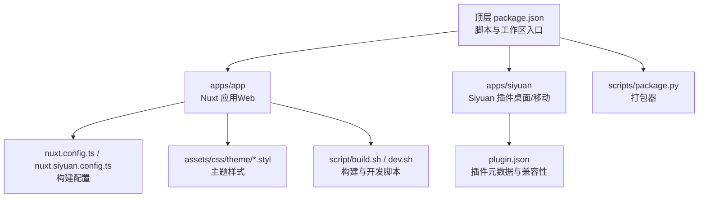
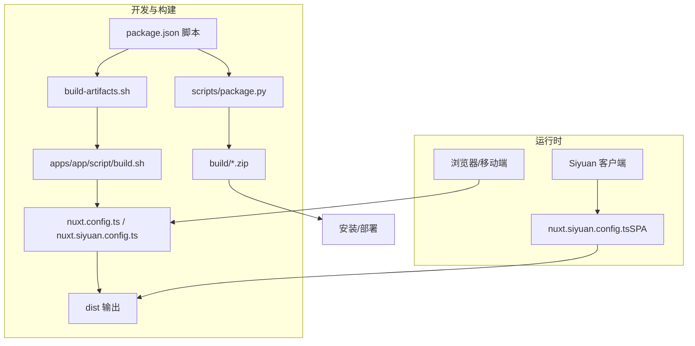
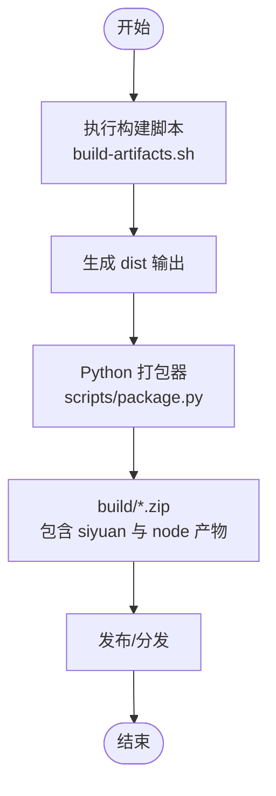
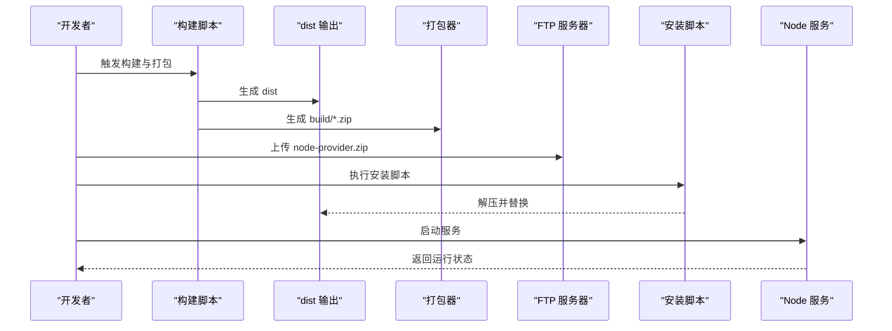
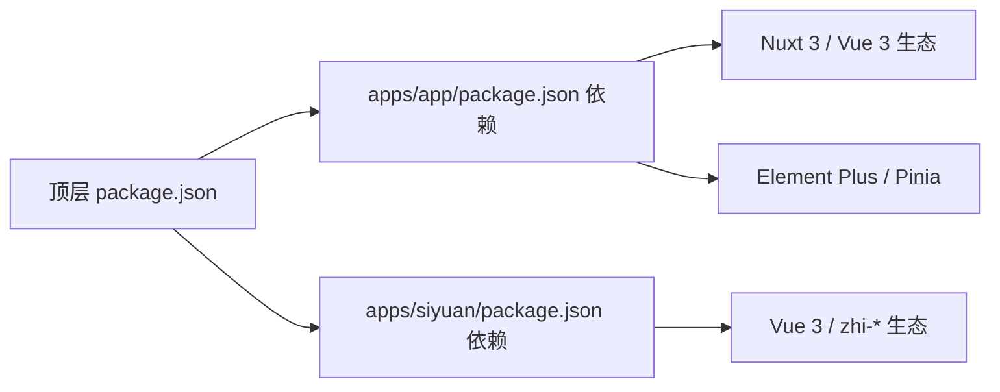

# 主题测试与部署

<cite>
**本文引用的文件**
- [plugin.json](file://plugin.json)
- [package.json](file://package.json)
- [DEVELOPMENT.md](file://DEVELOPMENT.md)
- [DEVELOPMENT_zh_CN.md](file://DEVELOPMENT_zh_CN.md)
- [build-artifacts.sh](file://build-artifacts.sh)
- [scripts/package.py](file://scripts/package.py)
- [install.sh](file://install.sh)
- [apps/app/package.json](file://apps/app/package.json)
- [apps/siyuan/package.json](file://apps/siyuan/package.json)
- [apps/app/nuxt.config.ts](file://apps/app/nuxt.config.ts)
- [apps/app/nuxt.siyuan.config.ts](file://apps/app/nuxt.siyuan.config.ts)
- [apps/app/script/build.sh](file://apps/app/script/build.sh)
- [apps/app/script/dev.sh](file://apps/app/script/dev.sh)
- [apps/app/assets/css/theme/index.styl](file://apps/app/assets/css/theme/index.styl)
- [apps/app/assets/css/theme/palette.styl](file://apps/app/assets/css/theme/palette.styl)
</cite>

## 目录
1. [引言](#引言)
2. [项目结构](#项目结构)
3. [核心组件](#核心组件)
4. [架构总览](#架构总览)
5. [详细组件分析](#详细组件分析)
6. [依赖分析](#依赖分析)
7. [性能考虑](#性能考虑)
8. [故障排查指南](#故障排查指南)
9. [结论](#结论)
10. [附录](#附录)

## 引言
本指南面向主题开发与部署工程师，系统阐述主题在开发、测试（浏览器兼容性、响应式、性能）、打包发布与安装部署（手动与自动）全流程。结合仓库中的多平台构建配置与脚本，给出可操作步骤、可视化流程图与常见问题排查建议，帮助快速完成从本地开发到生产发布的闭环。

## 项目结构
该仓库采用多包工作区组织，包含 Web 应用（apps/app）、Siyuan 插件（apps/siyuan）与统一的顶层脚本与打包工具。主题样式位于应用资源中，支持多主题变体与模块化样式组织；构建与发布通过脚本与 Python 打包器实现自动化。

图表来源
- [package.json:1-27](file://package.json#L1-L27)
- [apps/app/package.json:1-41](file://apps/app/package.json#L1-L41)
- [apps/siyuan/package.json:1-43](file://apps/siyuan/package.json#L1-L43)
- [scripts/package.py:1-52](file://scripts/package.py#L1-L52)
- [apps/app/nuxt.config.ts:1-125](file://apps/app/nuxt.config.ts#L1-L125)
- [apps/app/nuxt.siyuan.config.ts:1-133](file://apps/app/nuxt.siyuan.config.ts#L1-L133)
- [apps/app/script/build.sh:1-63](file://apps/app/script/build.sh#L1-L63)
- [apps/app/script/dev.sh:1-15](file://apps/app/script/dev.sh#L1-L15)
- [apps/app/assets/css/theme/index.styl:1-4](file://apps/app/assets/css/theme/index.styl#L1-L4)
- [apps/app/assets/css/theme/palette.styl:1-52](file://apps/app/assets/css/theme/palette.styl#L1-L52)
- [plugin.json:1-43](file://plugin.json#L1-L43)

章节来源
- [package.json:1-27](file://package.json#L1-L27)
- [apps/app/package.json:1-41](file://apps/app/package.json#L1-L41)
- [apps/siyuan/package.json:1-43](file://apps/siyuan/package.json#L1-L43)
- [plugin.json:1-43](file://plugin.json#L1-L43)

## 核心组件
- 构建与发布脚本
  - 顶层脚本：用于触发多包构建、打包与版本同步等任务。
  - 应用构建脚本：根据目标平台（vercel/node/cloudflare/siyuan）生成不同产物。
  - 打包器：Python 脚本负责将 dist 输出压缩为 zip 包，便于分发。
- 构建配置
  - Nuxt 配置：分别针对 Node 服务端渲染与 Siyuan SPA 场景，控制路由、资源注入与环境变量。
- 主题样式
  - Stylus 主题文件：提供调色板与布局变量，支撑多主题风格切换与移动端适配。
- 插件元数据
  - plugin.json：声明作者、版本、前后端兼容平台、国际化与说明文件等。

章节来源
- [package.json:4-21](file://package.json#L4-L21)
- [apps/app/script/build.sh:12-63](file://apps/app/script/build.sh#L12-L63)
- [scripts/package.py:5-52](file://scripts/package.py#L5-L52)
- [apps/app/nuxt.config.ts:20-125](file://apps/app/nuxt.config.ts#L20-L125)
- [apps/app/nuxt.siyuan.config.ts:20-133](file://apps/app/nuxt.siyuan.config.ts#L20-L133)
- [apps/app/assets/css/theme/palette.styl:10-52](file://apps/app/assets/css/theme/palette.styl#L10-L52)
- [plugin.json:1-43](file://plugin.json#L1-L43)

## 架构总览
下图展示主题在不同运行环境下的构建与部署路径，以及关键配置对运行时行为的影响。

图表来源
- [package.json:4-21](file://package.json#L4-L21)
- [build-artifacts.sh:1-6](file://build-artifacts.sh#L1-L6)
- [apps/app/script/build.sh:12-63](file://apps/app/script/build.sh#L12-L63)
- [apps/app/nuxt.config.ts:20-125](file://apps/app/nuxt.config.ts#L20-L125)
- [apps/app/nuxt.siyuan.config.ts:20-133](file://apps/app/nuxt.siyuan.config.ts#L20-L133)
- [scripts/package.py:5-52](file://scripts/package.py#L5-L52)

## 详细组件分析

### 浏览器兼容性测试
- 目标与范围
  - 覆盖桌面端与移动端浏览器，验证主题样式、交互与脚本在不同设备与分辨率下的表现。
- 关键配置点
  - 视口与语言：head 中设置 viewport 与 html 属性，确保移动端缩放与主题模式初始化。
  - 资源加载：link/script 注入字体、KaTeX、ECharts 等外部资源，需关注跨域与 CDN 可达性。
  - SPA 模式：Siyuan 场景禁用 SSR 并启用 hash 路由，避免服务端渲染差异带来的兼容性问题。
- 实施建议
  - 使用浏览器开发者工具的设备模拟与网络条件模拟进行回归测试。
  - 在主流浏览器（Chrome、Firefox、Safari、Edge）与移动端（iOS Safari、Android Chrome）验证。
  - 关注字体回退、图片懒加载与第三方脚本加载失败的降级处理。

章节来源
- [apps/app/nuxt.config.ts:35-88](file://apps/app/nuxt.config.ts#L35-L88)
- [apps/app/nuxt.siyuan.config.ts:35-119](file://apps/app/nuxt.siyuan.config.ts#L35-L119)

### 响应式测试
- 设计要点
  - 移动端断点：Stylus 中定义移动端断点，确保在小屏设备上的可读性与可用性。
  - 导航与侧边栏：侧栏宽度与内容宽度在不同断点下应保持合理比例。
- 实施建议
  - 使用浏览器设备模式与真实设备进行对比测试。
  - 检查导航折叠、按钮尺寸、文字大小与行高在不同断点的表现。
  - 验证滚动与触摸手势在移动端的流畅度。

章节来源
- [apps/app/assets/css/theme/palette.styl:44-52](file://apps/app/assets/css/theme/palette.styl#L44-L52)

### 性能测试
- 关注指标
  - 首屏渲染时间（FCP/LCP）、交互就绪时间（INP）、资源体积与请求数。
- 优化策略
  - 动态版本号：构建时注入动态版本参数，提升缓存命中与更新可控性。
  - 资源延迟加载：按需加载 KaTeX、ECharts 等重型库，减少首屏负担。
  - 样式与脚本：合并与压缩，避免重复依赖，减少不必要的全局样式。
- 测试工具
  - Lighthouse、WebPageTest、Chrome DevTools Performance 面板等。

章节来源
- [apps/app/nuxt.config.ts:5-13](file://apps/app/nuxt.config.ts#L5-L13)
- [apps/app/nuxt.config.ts:90-104](file://apps/app/nuxt.config.ts#L90-L104)
- [apps/app/nuxt.siyuan.config.ts:5-13](file://apps/app/nuxt.siyuan.config.ts#L5-L13)
- [apps/app/nuxt.siyuan.config.ts:43-57](file://apps/app/nuxt.siyuan.config.ts#L43-L57)

### 打包发布流程
- 构建产物
  - Web（Node/SSR）与 Siyuan（SPA）分别产出 dist 目录。
- 打包步骤
  - Python 打包器会将 dist 输出压缩为 zip，同时生成通用 package.zip，便于分发。
- 版本管理
  - 顶层脚本提供版本同步与变更日志解析，确保发布一致性。

图表来源
- [build-artifacts.sh:1-6](file://build-artifacts.sh#L1-L6)
- [scripts/package.py:5-52](file://scripts/package.py#L5-L52)

章节来源
- [build-artifacts.sh:1-6](file://build-artifacts.sh#L1-L6)
- [scripts/package.py:5-52](file://scripts/package.py#L5-L52)
- [package.json:16-20](file://package.json#L16-L20)

### 安装部署步骤
- 手动安装（Siyuan 插件）
  - 构建应用与插件：先构建 Web 应用，再构建 Siyuan 插件，最后建立开发链接并持续监听。
  - 访问地址：根据开发文档提供的本地访问地址进行验证。
- 自动安装（Node 提供商模式）
  - 构建与打包：构建 Node 产物并打包为 node-provider.zip。
  - 上传替换：通过 FTP 上传至服务器并替换旧版本。
  - 解压与安装：执行安装脚本解压并准备运行环境。
  - 启动服务：使用启动脚本运行服务端。

图表来源
- [DEVELOPMENT.md:44-86](file://DEVELOPMENT.md#L44-L86)
- [DEVELOPMENT_zh_CN.md:44-96](file://DEVELOPMENT_zh_CN.md#L44-L96)
- [scripts/package.py:5-52](file://scripts/package.py#L5-L52)
- [install.sh:1-11](file://install.sh#L1-L11)

章节来源
- [DEVELOPMENT.md:21-43](file://DEVELOPMENT.md#L21-L43)
- [DEVELOPMENT_zh_CN.md:21-42](file://DEVELOPMENT_zh_CN.md#L21-L42)
- [DEVELOPMENT.md:94-117](file://DEVELOPMENT.md#L94-L117)
- [DEVELOPMENT_zh_CN.md:97-117](file://DEVELOPMENT_zh_CN.md#L97-L117)
- [install.sh:1-11](file://install.sh#L1-L11)
- [scripts/package.py:5-52](file://scripts/package.py#L5-L52)

### 兼容性测试方法与工具
- 平台兼容性
  - 前后端平台：通过插件元数据声明支持的平台与前端类型，确保安装与运行环境匹配。
- 测试工具
  - 浏览器自动化：如 Playwright/Cypress 进行端到端回归。
  - 性能监控：Lighthouse、WebPageTest、Sentry 等。
  - 资源检查：Webpack Bundle Analyzer、BundlePhobia 等辅助体积优化。

章节来源
- [plugin.json:7-21](file://plugin.json#L7-L21)

## 依赖分析
- 包管理与工作区
  - 顶层使用 pnpm 工作区，统一脚本与依赖管理。
- 应用依赖
  - Nuxt 3、Vue 3、Element Plus、Pinia 等，支撑 Web 应用与主题样式体系。
- 插件依赖
  - Vue 生态与设备检测、API 封装等，满足 Siyuan 插件场景需求。

图表来源
- [package.json:1-27](file://package.json#L1-L27)
- [apps/app/package.json:12-40](file://apps/app/package.json#L12-L40)
- [apps/siyuan/package.json:14-42](file://apps/siyuan/package.json#L14-L42)

章节来源
- [package.json:1-27](file://package.json#L1-L27)
- [apps/app/package.json:12-40](file://apps/app/package.json#L12-L40)
- [apps/siyuan/package.json:14-42](file://apps/siyuan/package.json#L14-L42)

## 性能考虑
- 构建期优化
  - 动态版本号注入，提升缓存命中与更新可控性。
  - 按需加载重型库，减少首屏资源压力。
- 运行期优化
  - 合理拆分样式与脚本，避免全局污染。
  - 在移动端启用必要的性能开关，降低重绘与回流。

章节来源
- [apps/app/nuxt.config.ts:5-13](file://apps/app/nuxt.config.ts#L5-L13)
- [apps/app/nuxt.siyuan.config.ts:5-13](file://apps/app/nuxt.siyuan.config.ts#L5-L13)

## 故障排查指南
- 构建失败
  - 检查脚本参数与平台选择是否正确，确认 -f|--from 参数值有效。
  - 查看构建日志定位具体阶段错误。
- 打包失败
  - 确认 dist 输出是否存在，Python 打包器异常时查看输出提示。
- 安装失败（Node 提供商模式）
  - 确认上传的 zip 是否成功解压，安装脚本返回码是否为 0。
  - 检查服务启动前的依赖与权限。
- 运行异常
  - 在开发模式下启用调试脚本，观察控制台输出与网络请求。
  - 核对环境变量与资源路径，确保静态资源可访问。

章节来源
- [apps/app/script/build.sh:12-63](file://apps/app/script/build.sh#L12-L63)
- [scripts/package.py:15-21](file://scripts/package.py#L15-L21)
- [install.sh:1-11](file://install.sh#L1-L11)
- [apps/app/nuxt.config.ts:60-87](file://apps/app/nuxt.config.ts#L60-L87)
- [apps/app/nuxt.siyuan.config.ts:91-118](file://apps/app/nuxt.siyuan.config.ts#L91-L118)

## 结论
通过统一的脚本与配置，本主题实现了多平台构建、自动化打包与便捷的安装部署。配合浏览器兼容性、响应式与性能测试，可确保在不同设备与环境下稳定运行。建议在每次发布前执行完整测试与打包流程，并保留变更日志以便追溯。

## 附录
- 快速参考
  - 开发与构建：参见开发文档中的开发、构建与打包章节。
  - 主题样式：参考主题调色板与布局变量，按需调整移动端断点与组件样式。
  - 插件元数据：核对版本、平台与国际化字段，确保安装与显示正常。

章节来源
- [DEVELOPMENT.md:19-86](file://DEVELOPMENT.md#L19-L86)
- [DEVELOPMENT_zh_CN.md:21-96](file://DEVELOPMENT_zh_CN.md#L21-L96)
- [apps/app/assets/css/theme/palette.styl:10-52](file://apps/app/assets/css/theme/palette.styl#L10-L52)
- [plugin.json:1-43](file://plugin.json#L1-L43)