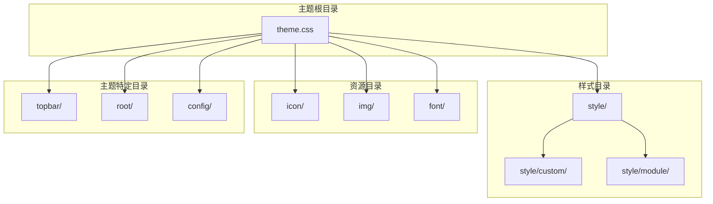
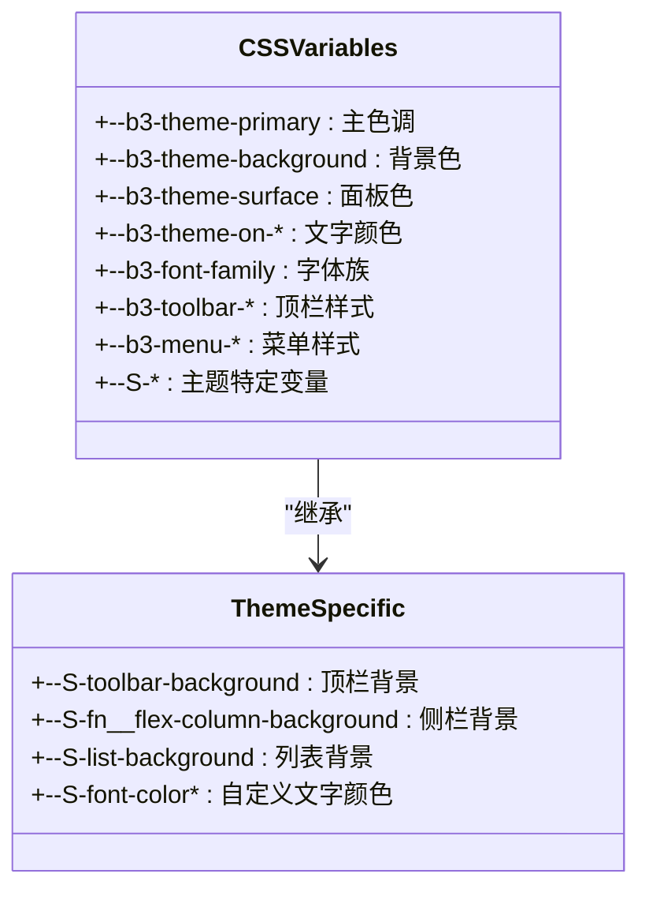
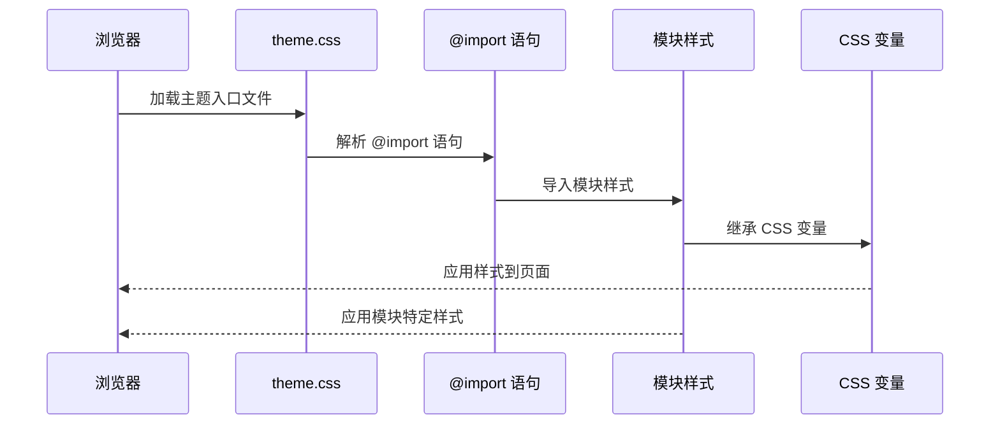
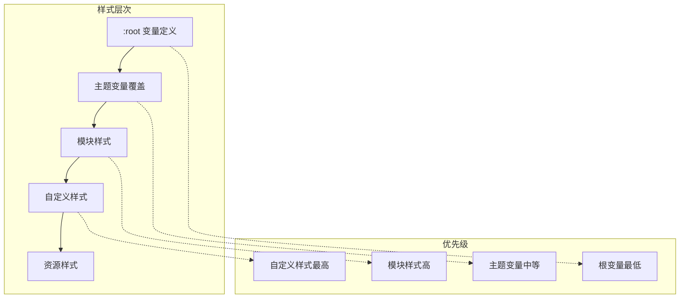
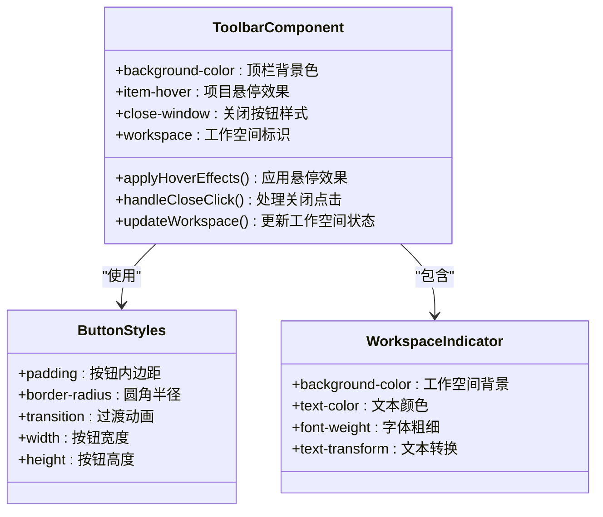
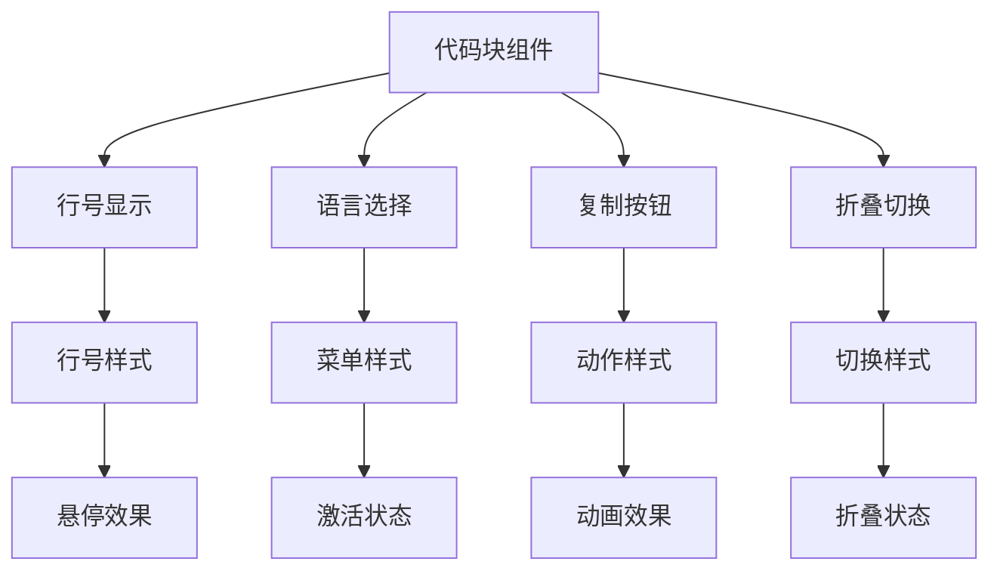
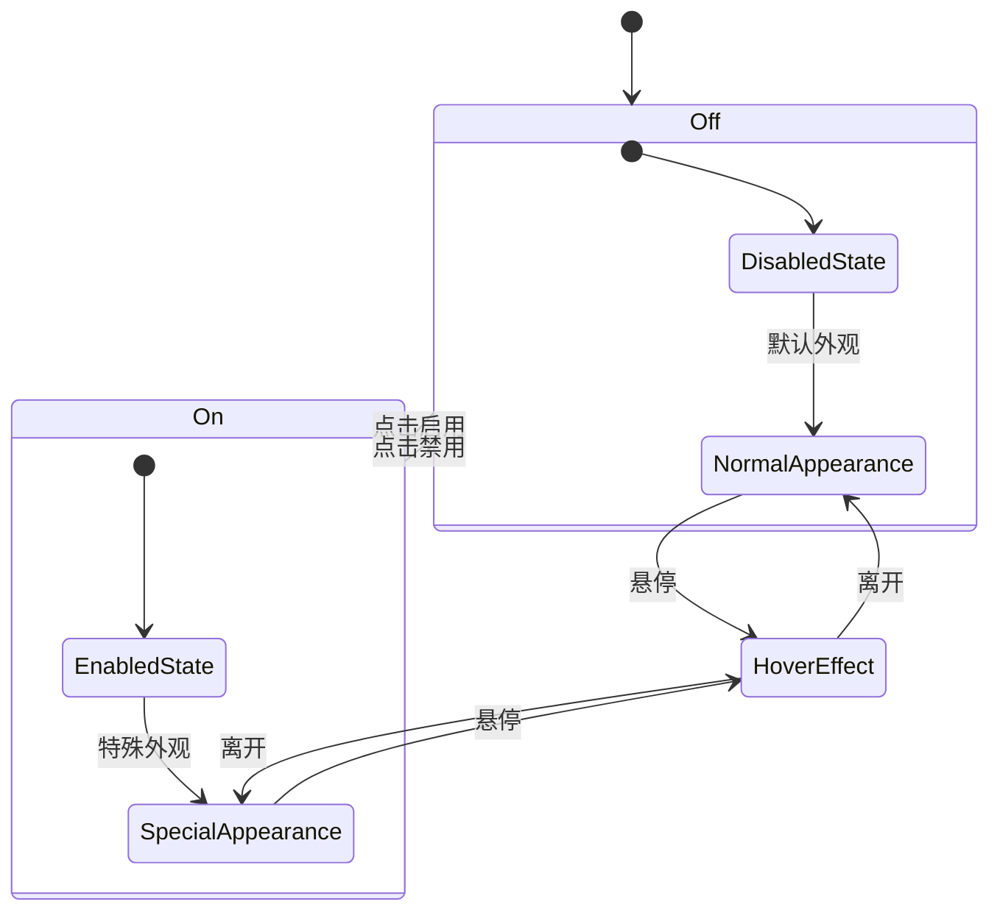
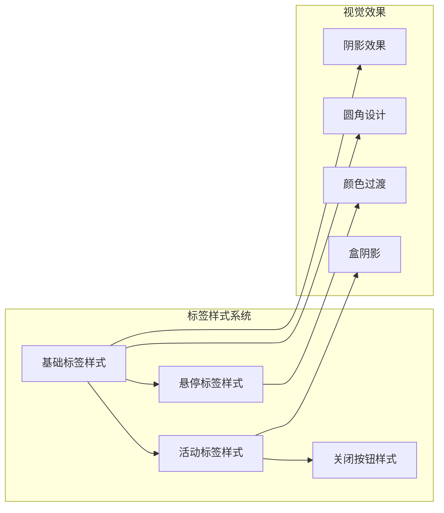

# 主题目录结构与配置

<cite>
**本文档引用的文件**
- [theme.css](file://apps/app/public/resources/appearance/themes/Savor/theme.css)
- [theme.css](file://apps/app/public/resources/appearance/themes/Tsundoku/theme.css)
- [theme.css](file://apps/app/public/resources/appearance/themes/Zhihu/theme.css)
- [theme.css](file://apps/app/public/resources/appearance/themes/pink-room/theme.css)
- [theme.css](file://apps/app/public/resources/appearance/themes/trends-in-siyuan/theme.css)
- [toolbar.css](file://apps/app/public/resources/appearance/themes/Savor/style/module/toolbar.css)
- [setting.css](file://apps/app/public/resources/appearance/themes/Savor/style/custom/setting.css)
- [code_block.css](file://apps/app/public/resources/appearance/themes/Tsundoku/style/module/code_block.css)
- [修改root.css中变量.css](file://apps/app/public/resources/appearance/themes/pink-room/root/修改root.css中变量.css)
- [页签栏.css](file://apps/app/public/resources/appearance/themes/pink-room/部件修改/页签栏.css)
- [超级块边框.css](file://apps/app/public/resources/appearance/themes/pink-room/样式修改/超级块边框.css)
- [取消超级块边框.css](file://apps/app/public/resources/appearance/themes/pink-room/自定义属性/取消超级块边框.css)
</cite>

## 目录
1. [简介](#简介)
2. [项目结构](#项目结构)
3. [核心组件](#核心组件)
4. [架构概览](#架构概览)
5. [详细组件分析](#详细组件分析)
6. [依赖分析](#依赖分析)
7. [性能考虑](#性能考虑)
8. [故障排除指南](#故障排除指南)
9. [结论](#结论)

## 简介

本文档为 Siyuan 笔记主题目录结构与配置的详细开发指南。通过分析仓库中的多个主题实现，总结了主题开发的最佳实践，包括标准目录结构、配置文件编写规范、模块化样式组织方法等。文档旨在帮助开发者快速理解和掌握如何创建符合 Siyuan 主题规范的高质量主题。

## 项目结构

基于对仓库中多个主题的分析，Siyuan 主题的标准目录结构如下：



**图表来源**
- [theme.css:1-791](file://apps/app/public/resources/appearance/themes/Savor/theme.css#L1-L791)
- [theme.css:1-1159](file://apps/app/public/resources/appearance/themes/Tsundoku/theme.css#L1-L1159)

### 目录结构详解

#### 主样式文件 (theme.css)
- **作用**: 主题的入口文件，负责导入所有子样式文件和定义全局 CSS 变量
- **位置**: 主题根目录
- **特点**: 使用 `@import` 语句组织模块化样式

#### 样式目录 (style/)
- **作用**: 存放所有样式文件的主目录
- **子目录**:
  - `style/custom/`: 自定义功能样式
  - `style/module/`: 模块化组件样式

#### 资源目录
- **icon/**: 图标资源目录
- **img/**: 图片资源目录  
- **font/**: 字体文件目录

#### 主题特定目录
- **topbar/**: 顶栏特定样式
- **root/**: 根变量修改文件
- **config/**: 配置文件集合

**章节来源**
- [theme.css:1-791](file://apps/app/public/resources/appearance/themes/Savor/theme.css#L1-L791)
- [theme.css:1-1159](file://apps/app/public/resources/appearance/themes/Tsundoku/theme.css#L1-L1159)

## 核心组件

### CSS 变量系统

主题采用统一的 CSS 变量命名规范，确保主题的一致性和可维护性：



**图表来源**
- [theme.css:73-438](file://apps/app/public/resources/appearance/themes/Savor/theme.css#L73-L438)

### 模块化样式组织

主题采用模块化的样式组织方式，每个功能模块独立管理：

```mermaid
graph LR
subgraph "模块化组织"
MODULES[模块样式]
CUSTOM[自定义样式]
RESOURCES[资源文件]
end
subgraph "导入机制"
IMPORT[@import 语句]
ROOT[:root 定义]
COMPONENTS[组件样式]
end
MODULES --> IMPORT
CUSTOM --> IMPORT
RESOURCES --> IMPORT
IMPORT --> ROOT
ROOT --> COMPONENTS
```

**图表来源**
- [theme.css:1-32](file://apps/app/public/resources/appearance/themes/Tsundoku/theme.css#L1-L32)

**章节来源**
- [theme.css:73-438](file://apps/app/public/resources/appearance/themes/Savor/theme.css#L73-L438)
- [theme.css:1-32](file://apps/app/public/resources/appearance/themes/Tsundoku/theme.css#L1-L32)

## 架构概览

### 主题加载流程



**图表来源**
- [theme.css:1-50](file://apps/app/public/resources/appearance/themes/Savor/theme.css#L1-L50)
- [theme.css:1-32](file://apps/app/public/resources/appearance/themes/Tsundoku/theme.css#L1-L32)

### 样式层次结构



**图表来源**
- [theme.css:1-79](file://apps/app/public/resources/appearance/themes/pink-room/root/修改root.css中变量.css#L1-L79)

**章节来源**
- [theme.css:1-79](file://apps/app/public/resources/appearance/themes/pink-room/root/修改root.css中变量.css#L1-L79)

## 详细组件分析

### 顶栏样式组件

顶栏是用户交互最频繁的区域，需要精心设计：



**图表来源**
- [toolbar.css:1-59](file://apps/app/public/resources/appearance/themes/Savor/style/module/toolbar.css#L1-L59)

#### 顶栏样式特性

- **响应式设计**: 支持桌面端和移动端的不同布局
- **交互反馈**: 悬停状态的视觉变化
- **品牌标识**: 工作空间的彩色标识
- **窗口控制**: 最小化、最大化、关闭按钮的统一设计

**章节来源**
- [toolbar.css:1-59](file://apps/app/public/resources/appearance/themes/Savor/style/module/toolbar.css#L1-L59)

### 代码块样式组件

代码块是技术类文档的核心组件：



**图表来源**
- [code_block.css:1-187](file://apps/app/public/resources/appearance/themes/Tsundoku/style/module/code_block.css#L1-L187)

#### 代码块功能特性

- **语法高亮**: 集成语法高亮显示
- **行号管理**: 可选的行号显示
- **语言标识**: 支持多种编程语言
- **折叠功能**: 长代码块的折叠显示
- **复制功能**: 一键复制代码

**章节来源**
- [code_block.css:1-187](file://apps/app/public/resources/appearance/themes/Tsundoku/style/module/code_block.css#L1-L187)

### 设置面板样式组件

设置面板提供主题功能的开关控制：



**图表来源**
- [setting.css:1-135](file://apps/app/public/resources/appearance/themes/Savor/style/custom/setting.css#L1-L135)

#### 设置面板设计原则

- **图标驱动**: 使用 SVG 图标提供直观的视觉反馈
- **状态明确**: 开启和关闭状态有清晰的视觉差异
- **位置固定**: 固定在顶栏的特定位置
- **快速访问**: 通过悬停展开的方式提供快捷操作

**章节来源**
- [setting.css:1-135](file://apps/app/public/resources/appearance/themes/Savor/style/custom/setting.css#L1-L135)

### 页面标签样式组件

页面标签是多文档界面的重要组成部分：



**图表来源**
- [页签栏.css:1-62](file://apps/app/public/resources/appearance/themes/pink-room/部件修改/页签栏.css#L1-L62)

#### 标签样式设计要素

- **层次感**: 通过阴影和边框营造层次感
- **色彩对比**: 活动标签与普通标签的明显区分
- **交互反馈**: 悬停时的颜色变化和阴影效果
- **一致性**: 全局统一的设计语言

**章节来源**
- [页签栏.css:1-62](file://apps/app/public/resources/appearance/themes/pink-room/部件修改/页签栏.css#L1-L62)

## 依赖分析

### 主题依赖关系

```mermaid
graph TB
subgraph "主题依赖层次"
RootTheme[基础主题]
SavorTheme[Savor 主题]
TsundokuTheme[Tsundoku 主题]
ZhihuTheme[Zhihu 主题]
PinkRoomTheme[Pink Room 主题]
TrendsTheme[Trends 主题]
end
subgraph "共享依赖"
CSSVariables[CSS 变量系统]
ImportMechanism[@import 机制]
ModulePattern[模块化模式]
end
subgraph "主题特定依赖"
SavorFeatures[Savor 特有功能]
TsundokuCode[Tsundoku 代码块]
ZhihuTypography[Zhihu 排版]
PinkRoomCustom[Pink Room 自定义]
TrendsColors[Trends 配色]
end
RootTheme --> CSSVariables
RootTheme --> ImportMechanism
RootTheme --> ModulePattern
SavorTheme --> SavorFeatures
TsundokuTheme --> TsundokuCode
ZhihuTheme --> ZhihuTypography
PinkRoomTheme --> PinkRoomCustom
TrendsTheme --> TrendsColors
SavorTheme --> RootTheme
TsundokuTheme --> RootTheme
ZhihuTheme --> RootTheme
PinkRoomTheme --> RootTheme
TrendsTheme --> RootTheme
```

**图表来源**
- [theme.css:1-791](file://apps/app/public/resources/appearance/themes/Savor/theme.css#L1-L791)
- [theme.css:1-1159](file://apps/app/public/resources/appearance/themes/Tsundoku/theme.css#L1-L1159)

### 样式文件依赖

每个主题都遵循相似的依赖模式：

1. **基础导入**: 导入核心样式文件
2. **模块化组织**: 按功能模块组织样式
3. **变量覆盖**: 在主题级别覆盖默认变量
4. **特定样式**: 添加主题特有的样式规则

**章节来源**
- [theme.css:1-100](file://apps/app/public/resources/appearance/themes/pink-room/theme.css#L1-L100)

## 性能考虑

### 样式加载优化

- **按需加载**: 使用 `@import` 语句按需导入样式
- **缓存策略**: 合理利用浏览器缓存机制
- **文件大小**: 控制单个样式文件的大小
- **重复定义**: 避免重复的 CSS 规则定义

### 渲染性能

- **选择器优化**: 使用高效的选择器减少重绘
- **动画性能**: 使用硬件加速的动画属性
- **阴影效果**: 合理使用阴影避免过度渲染
- **字体加载**: 优化字体加载策略

## 故障排除指南

### 常见问题及解决方案

#### 样式冲突问题
- **症状**: 样式显示异常或被覆盖
- **原因**: CSS 优先级问题或重复定义
- **解决**: 检查 CSS 选择器的特异性，确保正确的优先级

#### 资源加载失败
- **症状**: 图标或字体无法正常显示
- **原因**: 资源路径错误或文件缺失
- **解决**: 验证资源文件路径，确保文件存在且可访问

#### 响应式问题
- **症状**: 在不同设备上显示异常
- **原因**: 缺少适当的媒体查询或响应式设计
- **解决**: 添加媒体查询支持，测试不同屏幕尺寸

**章节来源**
- [theme.css:1-66](file://apps/app/public/resources/appearance/themes/pink-room/样式修改/超级块边框.css#L1-L66)
- [theme.css:1-21](file://apps/app/public/resources/appearance/themes/pink-room/自定义属性/取消超级块边框.css#L1-L21)

## 结论

通过对 Siyuan 笔记主题系统的深入分析，我们可以看到一个成熟主题开发框架的关键要素：

1. **标准化的目录结构**确保了主题的可维护性和扩展性
2. **模块化的样式组织**提供了灵活的功能组合能力
3. **统一的 CSS 变量系统**保证了主题的一致性和可定制性
4. **完善的依赖管理**确保了样式的正确加载和执行

这些最佳实践为开发者创建高质量的 Siyuan 主题提供了坚实的基础。通过遵循本文档的指导原则，开发者可以快速上手主题开发，并创建出既美观又实用的主题作品。