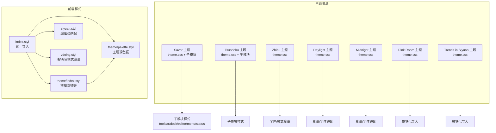
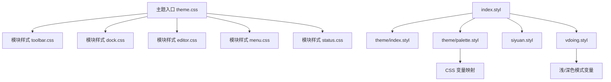
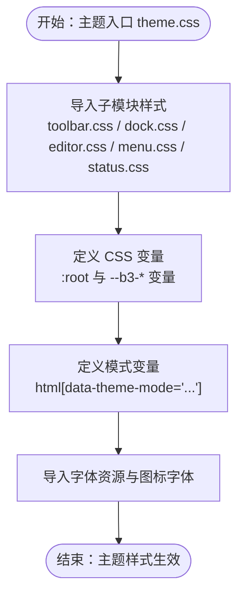
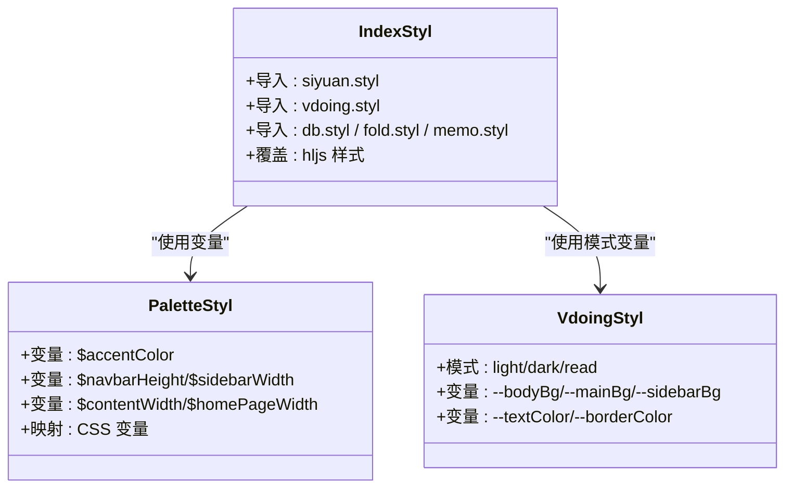
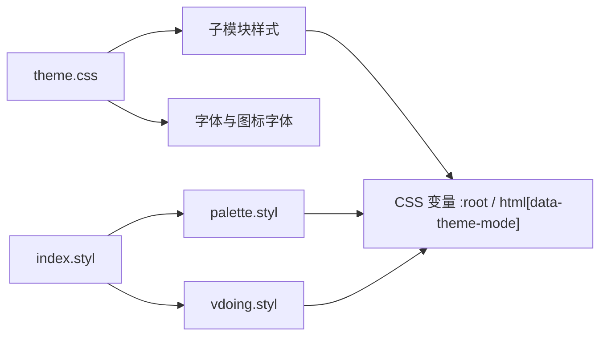

# 自定义主题开发

<cite>
**本文档引用的文件**
- [apps/app/assets/css/theme/index.styl](file://apps/app/assets/css/theme/index.styl)
- [apps/app/assets/css/theme/palette.styl](file://apps/app/assets/css/theme/palette.styl)
- [apps/app/assets/css/index.styl](file://apps/app/assets/css/index.styl)
- [apps/app/assets/css/siyuan.styl](file://apps/app/assets/css/siyuan.styl)
- [apps/app/assets/css/vdoing.styl](file://apps/app/assets/css/vdoing.styl)
- [apps/app/public/resources/appearance/themes/Savor/theme.css](file://apps/app/public/resources/appearance/themes/Savor/theme.css)
- [apps/app/public/resources/appearance/themes/Tsundoku/theme.css](file://apps/app/public/resources/appearance/themes/Tsundoku/theme.css)
- [apps/app/public/resources/appearance/themes/Zhihu/theme.css](file://apps/app/public/resources/appearance/themes/Zhihu/theme.css)
- [apps/app/public/resources/appearance/themes/daylight/theme.css](file://apps/app/public/resources/appearance/themes/daylight/theme.css)
- [apps/app/public/resources/appearance/themes/midnight/theme.css](file://apps/app/public/resources/appearance/themes/midnight/theme.css)
- [apps/app/public/resources/appearance/themes/pink-room/theme.css](file://apps/app/public/resources/appearance/themes/pink-room/theme.css)
- [apps/app/public/resources/appearance/themes/trends-in-siyuan/theme.css](file://apps/app/public/resources/appearance/themes/trends-in-siyuan/theme.css)
- [apps/app/public/resources/appearance/themes/Savor/style/module/toolbar.css](file://apps/app/public/resources/appearance/themes/Savor/style/module/toolbar.css)
- [apps/app/public/resources/appearance/themes/Savor/style/module/dock.css](file://apps/app/public/resources/appearance/themes/Savor/style/module/dock.css)
- [apps/app/public/resources/appearance/themes/Savor/style/module/editor.css](file://apps/app/public/resources/appearance/themes/Savor/style/module/editor.css)
- [apps/app/public/resources/appearance/themes/Savor/style/module/menu.css](file://apps/app/public/resources/appearance/themes/Savor/style/module/menu.css)
- [apps/app/public/resources/appearance/themes/Savor/style/module/status.css](file://apps/app/public/resources/appearance/themes/Savor/style/module/status.css)
</cite>

## 目录
1. [简介](#简介)
2. [项目结构](#项目结构)
3. [核心组件](#核心组件)
4. [架构总览](#架构总览)
5. [详细组件分析](#详细组件分析)
6. [依赖关系分析](#依赖关系分析)
7. [性能考虑](#性能考虑)
8. [故障排除指南](#故障排除指南)
9. [结论](#结论)
10. [附录](#附录)

## 简介
本指南面向希望在思源笔记生态中开发自定义主题的开发者，基于仓库中的现有主题与样式体系，系统讲解从目录结构到样式组织、从 Stylus 预处理到 CSS 变量系统、从响应式设计到打包发布的完整流程。文档同时提供模板与最佳实践，帮助你在保证兼容性的前提下快速构建高质量的主题。

## 项目结构
该仓库采用“主题资源 + 前端样式”双轨结构：
- 主题资源位于 `apps/app/public/resources/appearance/themes/`，按主题分目录存放，每个主题包含统一入口 `theme.css` 与细分子模块样式（如 toolbar、dock、editor、menu、status 等）。
- 前端样式位于 `apps/app/assets/css/`，以 Stylus 为主，通过 `index.styl` 统一导入，配合主题调色板与变量系统实现跨主题的一致性。

图表来源
- [apps/app/assets/css/index.styl:1-39](file://apps/app/assets/css/index.styl#L1-L39)
- [apps/app/assets/css/theme/index.styl:1-4](file://apps/app/assets/css/theme/index.styl#L1-L4)
- [apps/app/assets/css/theme/palette.styl:1-52](file://apps/app/assets/css/theme/palette.styl#L1-L52)
- [apps/app/public/resources/appearance/themes/Savor/theme.css:1-791](file://apps/app/public/resources/appearance/themes/Savor/theme.css#L1-L791)
- [apps/app/public/resources/appearance/themes/Tsundoku/theme.css:1-1159](file://apps/app/public/resources/appearance/themes/Tsundoku/theme.css#L1-L1159)
- [apps/app/public/resources/appearance/themes/Zhihu/theme.css:1-319](file://apps/app/public/resources/appearance/themes/Zhihu/theme.css#L1-L319)
- [apps/app/public/resources/appearance/themes/daylight/theme.css:1-224](file://apps/app/public/resources/appearance/themes/daylight/theme.css#L1-L224)
- [apps/app/public/resources/appearance/themes/midnight/theme.css:1-224](file://apps/app/public/resources/appearance/themes/midnight/theme.css#L1-L224)
- [apps/app/public/resources/appearance/themes/pink-room/theme.css:1-100](file://apps/app/public/resources/appearance/themes/pink-room/theme.css#L1-L100)
- [apps/app/public/resources/appearance/themes/trends-in-siyuan/theme.css:1-200](file://apps/app/public/resources/appearance/themes/trends-in-siyuan/theme.css#L1-L200)

章节来源
- [apps/app/assets/css/index.styl:1-39](file://apps/app/assets/css/index.styl#L1-L39)
- [apps/app/assets/css/theme/index.styl:1-4](file://apps/app/assets/css/theme/index.styl#L1-L4)
- [apps/app/assets/css/theme/palette.styl:1-52](file://apps/app/assets/css/theme/palette.styl#L1-L52)

## 核心组件
- 主题入口样式：各主题的 `theme.css` 作为聚合入口，统一导入模块化样式与字体资源，集中声明 CSS 变量与主题模式变量。
- 子模块样式：按 UI 组件拆分（如 toolbar、dock、editor、menu、status），便于维护与复用。
- Stylus 前端样式：通过 `index.styl` 统一导入，结合 `theme/palette.styl` 的变量与 `vdoing.styl` 的浅/深色模式变量，实现跨主题一致性。
- 字体与模式：主题通过 `:root` 或 `html[data-theme-mode="..."]` 定义字体族、字号与颜色变量，支持 light/dark/read 等模式。

章节来源
- [apps/app/public/resources/appearance/themes/Savor/theme.css:1-791](file://apps/app/public/resources/appearance/themes/Savor/theme.css#L1-L791)
- [apps/app/public/resources/appearance/themes/Tsundoku/theme.css:1-1159](file://apps/app/public/resources/appearance/themes/Tsundoku/theme.css#L1-L1159)
- [apps/app/public/resources/appearance/themes/Zhihu/theme.css:1-319](file://apps/app/public/resources/appearance/themes/Zhihu/theme.css#L1-L319)
- [apps/app/public/resources/appearance/themes/daylight/theme.css:1-224](file://apps/app/public/resources/appearance/themes/daylight/theme.css#L1-L224)
- [apps/app/public/resources/appearance/themes/midnight/theme.css:1-224](file://apps/app/public/resources/appearance/themes/midnight/theme.css#L1-L224)
- [apps/app/public/resources/appearance/themes/pink-room/theme.css:1-100](file://apps/app/public/resources/appearance/themes/pink-room/theme.css#L1-L100)
- [apps/app/public/resources/appearance/themes/trends-in-siyuan/theme.css:1-200](file://apps/app/public/resources/appearance/themes/trends-in-siyuan/theme.css#L1-L200)
- [apps/app/assets/css/index.styl:1-39](file://apps/app/assets/css/index.styl#L1-L39)
- [apps/app/assets/css/theme/palette.styl:1-52](file://apps/app/assets/css/theme/palette.styl#L1-L52)
- [apps/app/assets/css/vdoing.styl:1-39](file://apps/app/assets/css/vdoing.styl#L1-L39)

## 架构总览
主题开发遵循“入口聚合 + 子模块拆分 + 变量驱动”的三层架构：
- 入口聚合：主题入口 `theme.css` 使用 `@import` 导入模块样式与字体资源，集中声明 CSS 变量。
- 子模块拆分：将 toolbar、dock、editor、menu、status 等 UI 组件样式拆分为独立文件，提升可维护性。
- 变量驱动：通过 `:root` 与 `html[data-theme-mode="..."]` 定义主题变量，Stylus 侧通过 `palette.styl` 与 `vdoing.styl` 提供变量映射与模式变量。

图表来源
- [apps/app/public/resources/appearance/themes/Savor/theme.css:1-791](file://apps/app/public/resources/appearance/themes/Savor/theme.css#L1-L791)
- [apps/app/public/resources/appearance/themes/Savor/style/module/toolbar.css:1-59](file://apps/app/public/resources/appearance/themes/Savor/style/module/toolbar.css#L1-L59)
- [apps/app/public/resources/appearance/themes/Savor/style/module/dock.css:1-107](file://apps/app/public/resources/appearance/themes/Savor/style/module/dock.css#L1-L107)
- [apps/app/public/resources/appearance/themes/Savor/style/module/editor.css:1-581](file://apps/app/public/resources/appearance/themes/Savor/style/module/editor.css#L1-L581)
- [apps/app/public/resources/appearance/themes/Savor/style/module/menu.css:1-514](file://apps/app/public/resources/appearance/themes/Savor/style/module/menu.css#L1-L514)
- [apps/app/public/resources/appearance/themes/Savor/style/module/status.css:1-127](file://apps/app/public/resources/appearance/themes/Savor/style/module/status.css#L1-L127)
- [apps/app/assets/css/index.styl:1-39](file://apps/app/assets/css/index.styl#L1-L39)
- [apps/app/assets/css/theme/index.styl:1-4](file://apps/app/assets/css/theme/index.styl#L1-L4)
- [apps/app/assets/css/theme/palette.styl:1-52](file://apps/app/assets/css/theme/palette.styl#L1-L52)
- [apps/app/assets/css/siyuan.styl:1-64](file://apps/app/assets/css/siyuan.styl#L1-L64)
- [apps/app/assets/css/vdoing.styl:1-39](file://apps/app/assets/css/vdoing.styl#L1-L39)

## 详细组件分析

### 主题入口与模块化组织
- Savor 主题通过 `theme.css` 导入模块样式与字体资源，集中声明大量 CSS 变量（如 `--b3-theme-*`、`--b3-font-*`、`--b3-protyle-*` 等），并通过自定义变量（如 `--S-*`）实现模块化覆盖。
- 子模块样式按 UI 组件划分，例如 toolbar、dock、editor、menu、status，分别控制对应区域的外观与交互。

图表来源
- [apps/app/public/resources/appearance/themes/Savor/theme.css:1-791](file://apps/app/public/resources/appearance/themes/Savor/theme.css#L1-L791)
- [apps/app/public/resources/appearance/themes/Savor/style/module/toolbar.css:1-59](file://apps/app/public/resources/appearance/themes/Savor/style/module/toolbar.css#L1-L59)
- [apps/app/public/resources/appearance/themes/Savor/style/module/dock.css:1-107](file://apps/app/public/resources/appearance/themes/Savor/style/module/dock.css#L1-L107)
- [apps/app/public/resources/appearance/themes/Savor/style/module/editor.css:1-581](file://apps/app/public/resources/appearance/themes/Savor/style/module/editor.css#L1-L581)
- [apps/app/public/resources/appearance/themes/Savor/style/module/menu.css:1-514](file://apps/app/public/resources/appearance/themes/Savor/style/module/menu.css#L1-L514)
- [apps/app/public/resources/appearance/themes/Savor/style/module/status.css:1-127](file://apps/app/public/resources/appearance/themes/Savor/style/module/status.css#L1-L127)

章节来源
- [apps/app/public/resources/appearance/themes/Savor/theme.css:1-791](file://apps/app/public/resources/appearance/themes/Savor/theme.css#L1-L791)
- [apps/app/public/resources/appearance/themes/Savor/style/module/toolbar.css:1-59](file://apps/app/public/resources/appearance/themes/Savor/style/module/toolbar.css#L1-L59)
- [apps/app/public/resources/appearance/themes/Savor/style/module/dock.css:1-107](file://apps/app/public/resources/appearance/themes/Savor/style/module/dock.css#L1-L107)
- [apps/app/public/resources/appearance/themes/Savor/style/module/editor.css:1-581](file://apps/app/public/resources/appearance/themes/Savor/style/module/editor.css#L1-L581)
- [apps/app/public/resources/appearance/themes/Savor/style/module/menu.css:1-514](file://apps/app/public/resources/appearance/themes/Savor/style/module/menu.css#L1-L514)
- [apps/app/public/resources/appearance/themes/Savor/style/module/status.css:1-127](file://apps/app/public/resources/appearance/themes/Savor/style/module/status.css#L1-L127)

### Stylus 预处理器与变量系统
- Stylus 通过 `index.styl` 统一导入，包含基础布局、字体、数据库、折叠块、备注等样式，并覆盖部分高亮样式。
- `theme/palette.styl` 定义主题调色板变量，如 `--b3-protyle-inline-link-color` 映射到 `$accentColor`，用于跨主题保持视觉一致性。
- `vdoing.styl` 提供浅色/深色/阅读模式的变量映射，确保不同模式下的背景、文本、边框等颜色协调。

图表来源
- [apps/app/assets/css/index.styl:1-39](file://apps/app/assets/css/index.styl#L1-L39)
- [apps/app/assets/css/theme/palette.styl:1-52](file://apps/app/assets/css/theme/palette.styl#L1-L52)
- [apps/app/assets/css/vdoing.styl:1-39](file://apps/app/assets/css/vdoing.styl#L1-L39)

章节来源
- [apps/app/assets/css/index.styl:1-39](file://apps/app/assets/css/index.styl#L1-L39)
- [apps/app/assets/css/theme/palette.styl:1-52](file://apps/app/assets/css/theme/palette.styl#L1-L52)
- [apps/app/assets/css/vdoing.styl:1-39](file://apps/app/assets/css/vdoing.styl#L1-L39)

### 响应式设计与模式适配
- 字体与语言适配：daylight 与 midnight 主题通过 `:root:lang(...)` 覆盖字体族，适配不同语言环境。
- 模式变量：Zhihu、daylight、midnight 等主题通过 `html[data-theme-mode="..."]` 定义不同模式的颜色变量，实现一键切换。
- 响应式断点：vdoing.styl 中定义了移动端断点 `$MQMobile`，用于在小屏设备上的布局优化。

章节来源
- [apps/app/public/resources/appearance/themes/daylight/theme.css:204-214](file://apps/app/public/resources/appearance/themes/daylight/theme.css#L204-L214)
- [apps/app/public/resources/appearance/themes/midnight/theme.css:204-214](file://apps/app/public/resources/appearance/themes/midnight/theme.css#L204-L214)
- [apps/app/public/resources/appearance/themes/Zhihu/theme.css:46-70](file://apps/app/public/resources/appearance/themes/Zhihu/theme.css#L46-L70)
- [apps/app/assets/css/vdoing.styl:52](file://apps/app/assets/css/vdoing.styl#L52)

### 主题配置与兼容性
- Tsundoku 主题通过 `theme.css` 导入编辑器基础块、行内样式、代码块、折叠、链接图标、数据库、文档属性、Admonition、块自定义属性、列表转换等样式，形成统一的编辑体验。
- Trends in Siyuan 主题通过模块化导入 blockquote、ref、heading、title、memo、dock、embed、caption、inline、table、code、custom、plugin、layouts、bazzar 等样式，覆盖编辑器与界面的多个方面。
- Pink Room 主题通过大量 `@import` 将部件修改与样式修改分类组织，便于按需启用或禁用。

章节来源
- [apps/app/public/resources/appearance/themes/Tsundoku/theme.css:1-1159](file://apps/app/public/resources/appearance/themes/Tsundoku/theme.css#L1-L1159)
- [apps/app/public/resources/appearance/themes/trends-in-siyuan/theme.css:1-200](file://apps/app/public/resources/appearance/themes/trends-in-siyuan/theme.css#L1-L200)
- [apps/app/public/resources/appearance/themes/pink-room/theme.css:1-100](file://apps/app/public/resources/appearance/themes/pink-room/theme.css#L1-L100)

## 依赖关系分析
- 主题入口依赖子模块样式与字体资源，子模块样式进一步依赖 CSS 变量与模式变量。
- Stylus 层面，`index.styl` 依赖 `theme/palette.styl` 与 `vdoing.styl`，实现变量与模式的跨主题共享。
- 不同主题之间存在差异化：Savor 强调模块化覆盖与自定义变量，Tsundoku 强调编辑器模块化样式，Zhihu 强调字体与模式变量，daylight/midnight 强调语言适配与深色模式，trends-in-siyuan 强调模块化导入，pink-room 强调部件与样式拆分。

图表来源
- [apps/app/public/resources/appearance/themes/Savor/theme.css:1-791](file://apps/app/public/resources/appearance/themes/Savor/theme.css#L1-L791)
- [apps/app/assets/css/index.styl:1-39](file://apps/app/assets/css/index.styl#L1-L39)
- [apps/app/assets/css/theme/palette.styl:1-52](file://apps/app/assets/css/theme/palette.styl#L1-L52)
- [apps/app/assets/css/vdoing.styl:1-39](file://apps/app/assets/css/vdoing.styl#L1-L39)

章节来源
- [apps/app/public/resources/appearance/themes/Savor/theme.css:1-791](file://apps/app/public/resources/appearance/themes/Savor/theme.css#L1-L791)
- [apps/app/assets/css/index.styl:1-39](file://apps/app/assets/css/index.styl#L1-L39)
- [apps/app/assets/css/theme/palette.styl:1-52](file://apps/app/assets/css/theme/palette.styl#L1-L52)
- [apps/app/assets/css/vdoing.styl:1-39](file://apps/app/assets/css/vdoing.styl#L1-L39)

## 性能考虑
- 模块化导入：通过 `@import` 将样式拆分为子模块，减少单文件体积，便于缓存与增量更新。
- CSS 变量优先：使用 `--b3-*` 与 `html[data-theme-mode]` 控制颜色与布局，避免重复定义，降低维护成本。
- 字体与图标：合理引入字体与图标字体，避免过多字体文件导致加载时间过长；可按需启用或替换字体资源。
- Stylus 编译：Stylus 在构建时编译为 CSS，建议在开发阶段开启 sourcemap 以便调试，生产阶段压缩输出。

## 故障排除指南
- 编辑器滚动条异常：检查 `siyuan.styl` 中关于滚动条的选择器与 `theme.css` 中的 `::-webkit-scrollbar` 规则是否冲突。
- 模式切换失效：确认 `html[data-theme-mode="..."]` 是否正确设置，且对应模式变量已在 `theme.css` 或 `vdoing.styl` 中定义。
- 字体显示异常：检查 `:root:lang(...)` 与 `theme.css` 中的字体族声明，确保字体文件路径正确。
- 子模块样式未生效：确认 `theme.css` 是否正确导入对应子模块样式文件，且导入顺序是否影响优先级。

章节来源
- [apps/app/assets/css/siyuan.styl:451-463](file://apps/app/assets/css/siyuan.styl#L451-L463)
- [apps/app/public/resources/appearance/themes/daylight/theme.css:204-214](file://apps/app/public/resources/appearance/themes/daylight/theme.css#L204-L214)
- [apps/app/public/resources/appearance/themes/midnight/theme.css:204-214](file://apps/app/public/resources/appearance/themes/midnight/theme.css#L204-L214)

## 结论
通过模块化入口、子模块拆分与变量驱动的设计，该仓库提供了清晰的主题开发框架。开发者可在现有主题基础上扩展或定制，遵循统一的变量体系与导入规范，即可实现跨主题的一致性与良好的兼容性。

## 附录

### 主题开发模板与最佳实践
- 目录结构建议
  - 主题根目录包含 `theme.css` 作为入口，子目录按 UI 组件划分（如 `style/module/toolbar.css`、`style/module/editor.css` 等）。
  - 字体与图标资源放置于主题根目录，便于统一管理。
- 样式命名规范
  - 使用语义化类名，如 `.toolbar__item`、`.dock__item`、`.protyle-wysiwyg` 等，避免使用平台特有 ID。
  - 对于模块化覆盖，使用 `--S-*` 自定义变量，避免硬编码颜色与尺寸。
- 组件样式覆盖
  - 优先通过 CSS 变量与 `html[data-theme-mode]` 控制颜色与布局，必要时再使用子模块样式进行覆盖。
  - 避免在子模块中直接写死颜色值，尽量映射到全局变量。
- 主题兼容性测试
  - 在 light/dark/read 模式下验证颜色对比度与可读性。
  - 在不同语言环境下验证字体渲染与排版。
  - 在小屏设备上验证断点与交互行为。

### 主题打包与发布流程
- 构建产物
  - 将 `theme.css` 与其依赖的子模块样式与字体资源打包为主题包。
  - 保持相对路径引用，确保主题在不同环境下的可移植性。
- 版本管理策略
  - 使用语义化版本号，变更主题变量或导入结构时升级主版本或次版本。
  - 在变更破坏性较大时，提供迁移指南。
- 安装与部署
  - 将主题包放入 `appearance/themes/<主题名>/` 目录，重启应用后在设置中选择新主题。
  - 对于 Stylus 样式，确保构建产物生成到目标目录，避免样式未生效。