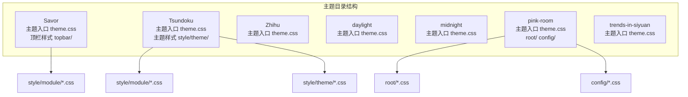
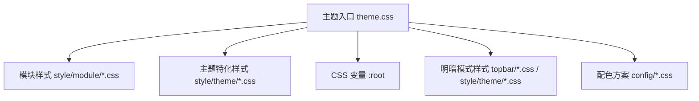
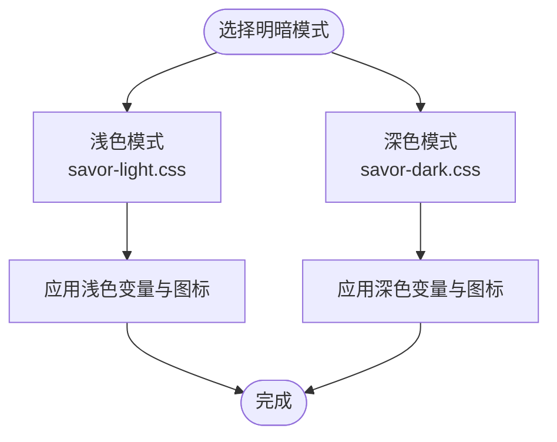
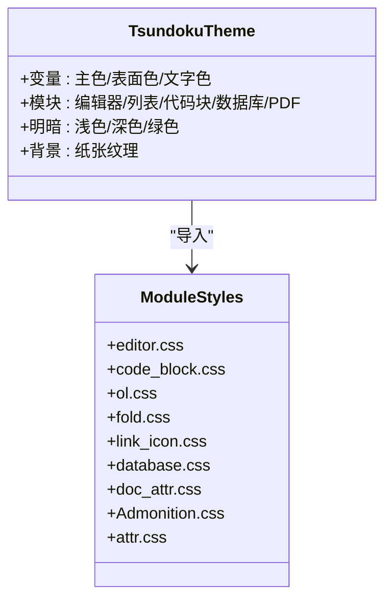
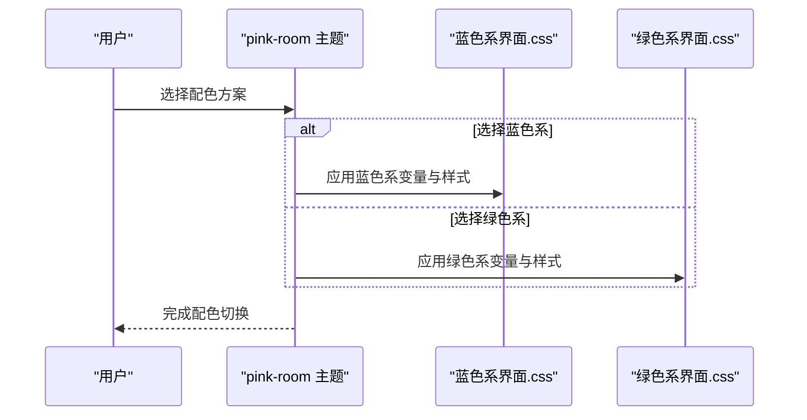
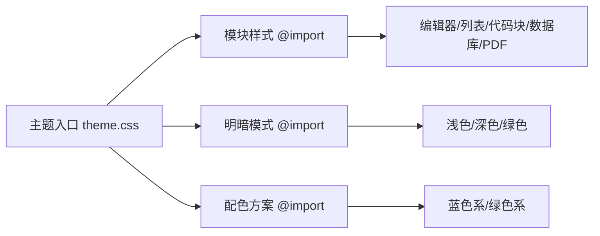

# 预设主题介绍

<cite>
**本文档引用的文件**
- [apps/app/public/resources/appearance/themes/Savor/theme.css](file://apps/app/public/resources/appearance/themes/Savor/theme.css)
- [apps/app/public/resources/appearance/themes/Savor/style/topbar/savor-light.css](file://apps/app/public/resources/appearance/themes/Savor/style/topbar/savor-light.css)
- [apps/app/public/resources/appearance/themes/Savor/style/topbar/savor-dark.css](file://apps/app/public/resources/appearance/themes/Savor/style/topbar/savor-dark.css)
- [apps/app/public/resources/appearance/themes/Tsundoku/theme.css](file://apps/app/public/resources/appearance/themes/Tsundoku/theme.css)
- [apps/app/public/resources/appearance/themes/Tsundoku/style/theme/Tsundoku_light.css](file://apps/app/public/resources/appearance/themes/Tsundoku/style/theme/Tsundoku_light.css)
- [apps/app/public/resources/appearance/themes/Tsundoku/style/theme/Tsundoku_dark.css](file://apps/app/public/resources/appearance/themes/Tsundoku/style/theme/Tsundoku_dark.css)
- [apps/app/public/resources/appearance/themes/Tsundoku/style/theme/Tsundoku_green.css](file://apps/app/public/resources/appearance/themes/Tsundoku/style/theme/Tsundoku_green.css)
- [apps/app/public/resources/appearance/themes/Zhihu/theme.css](file://apps/app/public/resources/appearance/themes/Zhihu/theme.css)
- [apps/app/public/resources/appearance/themes/daylight/theme.css](file://apps/app/public/resources/appearance/themes/daylight/theme.css)
- [apps/app/public/resources/appearance/themes/midnight/theme.css](file://apps/app/public/resources/appearance/themes/midnight/theme.css)
- [apps/app/public/resources/appearance/themes/pink-room/theme.css](file://apps/app/public/resources/appearance/themes/pink-room/theme.css)
- [apps/app/public/resources/appearance/themes/pink-room/root/修改root.css中变量.css](file://apps/app/public/resources/appearance/themes/pink-room/root/修改root.css中变量.css)
- [apps/app/public/resources/appearance/themes/pink-room/root/新增主题自用变量.css](file://apps/app/public/resources/appearance/themes/pink-room/root/新增主题自用变量.css)
- [apps/app/public/resources/appearance/themes/pink-room/config/蓝色系界面.css](file://apps/app/public/resources/appearance/themes/pink-room/config/蓝色系界面.css)
- [apps/app/public/resources/appearance/themes/pink-room/config/绿色系界面.css](file://apps/app/public/resources/appearance/themes/pink-room/config/绿色系界面.css)
- [apps/app/public/resources/appearance/themes/trends-in-siyuan/theme.css](file://apps/app/public/resources/appearance/themes/trends-in-siyuan/theme.css)
</cite>

## 目录
1. [简介](#简介)
2. [项目结构](#项目结构)
3. [核心组件](#核心组件)
4. [架构总览](#架构总览)
5. [详细组件分析](#详细组件分析)
6. [依赖分析](#依赖分析)
7. [性能考虑](#性能考虑)
8. [故障排除指南](#故障排除指南)
9. [结论](#结论)
10. [附录](#附录)

## 简介
本文件为 Siyuan 笔记插件博客模块的预设主题全面介绍文档。系统提供多个风格各异的主题，涵盖现代简洁、夜间护眼、日式美学、知乎风格、粉红房间、趋势风格等，满足不同用户的视觉偏好与使用场景需求。每个主题均包含设计理念、色彩搭配、字体选择、布局考量、平台适配与使用建议，并提供主题选择决策指南与推荐场景，帮助用户快速找到最适合自己的主题。

## 项目结构
主题资源集中于 `apps/app/public/resources/appearance/themes/` 目录下，按主题名划分子目录，每个主题包含：
- theme.css：主题主样式入口，统一导入模块化样式与变量
- style/ 或 src/：按功能拆分的模块样式（如编辑器、列表、代码块、数据库、PDF 等）
- topbar/（Savor）：顶栏相关样式与明暗模式切换
- config/（pink-room）：主题配色方案切换（蓝色系/绿色系）
- root/（pink-room）：根变量覆盖与自定义变量定义

**图表来源**
- [apps/app/public/resources/appearance/themes/Savor/theme.css:1-791](file://apps/app/public/resources/appearance/themes/Savor/theme.css#L1-L791)
- [apps/app/public/resources/appearance/themes/Tsundoku/theme.css:1-224](file://apps/app/public/resources/appearance/themes/Tsundoku/theme.css#L1-L224)
- [apps/app/public/resources/appearance/themes/pink-room/theme.css:1-100](file://apps/app/public/resources/appearance/themes/pink-room/theme.css#L1-L100)

**章节来源**
- [apps/app/public/resources/appearance/themes/Savor/theme.css:1-791](file://apps/app/public/resources/appearance/themes/Savor/theme.css#L1-L791)
- [apps/app/public/resources/appearance/themes/Tsundoku/theme.css:1-224](file://apps/app/public/resources/appearance/themes/Tsundoku/theme.css#L1-L224)
- [apps/app/public/resources/appearance/themes/Zhihu/theme.css:1-319](file://apps/app/public/resources/appearance/themes/Zhihu/theme.css#L1-L319)
- [apps/app/public/resources/appearance/themes/daylight/theme.css:1-224](file://apps/app/public/resources/appearance/themes/daylight/theme.css#L1-L224)
- [apps/app/public/resources/appearance/themes/midnight/theme.css:1-224](file://apps/app/public/resources/appearance/themes/midnight/theme.css#L1-L224)
- [apps/app/public/resources/appearance/themes/pink-room/theme.css:1-100](file://apps/app/public/resources/appearance/themes/pink-room/theme.css#L1-L100)
- [apps/app/public/resources/appearance/themes/trends-in-siyuan/theme.css:1-200](file://apps/app/public/resources/appearance/themes/trends-in-siyuan/theme.css#L1-L200)

## 核心组件
- 主题变量系统：通过 CSS 自定义属性（:root）集中管理主色、表面色、文字色、阴影、滚动条、菜单、工具提示、PDF、图表颜色等，确保主题一致性与可扩展性
- 模块化样式：将编辑器基础块、列表、代码块、数据库、PDF、工具栏、页签、面包屑等拆分为独立模块，便于按需引入与维护
- 明暗模式支持：部分主题提供明暗模式切换样式（如 Savor 的 savor-light.css、savor-dark.css；Tsundoku 的 Tsundoku_dark.css、Tsundoku_green.css），通过变量重定义实现
- 配色方案切换：pink-room 提供蓝色系/绿色系界面切换，通过 config/*.css 注入不同的色彩体系

**章节来源**
- [apps/app/public/resources/appearance/themes/Savor/style/topbar/savor-light.css:1-322](file://apps/app/public/resources/appearance/themes/Savor/style/topbar/savor-light.css#L1-L322)
- [apps/app/public/resources/appearance/themes/Savor/style/topbar/savor-dark.css:1-305](file://apps/app/public/resources/appearance/themes/Savor/style/topbar/savor-dark.css#L1-L305)
- [apps/app/public/resources/appearance/themes/Tsundoku/style/theme/Tsundoku_dark.css:1-800](file://apps/app/public/resources/appearance/themes/Tsundoku/style/theme/Tsundoku_dark.css#L1-L800)
- [apps/app/public/resources/appearance/themes/Tsundoku/style/theme/Tsundoku_green.css:1-800](file://apps/app/public/resources/appearance/themes/Tsundoku/style/theme/Tsundoku_green.css#L1-L800)
- [apps/app/public/resources/appearance/themes/pink-room/config/蓝色系界面.css:1-338](file://apps/app/public/resources/appearance/themes/pink-room/config/蓝色系界面.css#L1-L338)
- [apps/app/public/resources/appearance/themes/pink-room/config/绿色系界面.css:1-327](file://apps/app/public/resources/appearance/themes/pink-room/config/绿色系界面.css#L1-L327)

## 架构总览
主题系统采用“变量集中 + 模块化样式 + 明暗模式切换”的架构，主题入口通过 @import 统一组织模块样式，明暗模式通过独立样式文件覆盖变量实现，配色方案通过 config 文件注入不同色彩体系。

**图表来源**
- [apps/app/public/resources/appearance/themes/Savor/theme.css:1-791](file://apps/app/public/resources/appearance/themes/Savor/theme.css#L1-L791)
- [apps/app/public/resources/appearance/themes/Tsundoku/theme.css:1-224](file://apps/app/public/resources/appearance/themes/Tsundoku/theme.css#L1-L224)
- [apps/app/public/resources/appearance/themes/pink-room/theme.css:1-100](file://apps/app/public/resources/appearance/themes/pink-room/theme.css#L1-L100)

## 详细组件分析

### Savor 主题
- 设计理念：现代简洁与柔和对比，强调编辑区与面板的层次感，适合长时间阅读与写作
- 视觉特色：浅色背景、柔和主色与辅助色，丰富的自定义文字与背景色变量，支持明暗模式切换
- 色彩搭配：主色为蓝青，辅助色为暖橙，文字色采用深浅灰对比，强调可读性
- 字体选择：Roboto 与 Noto Sans SC，支持 Twitter Emoji 字体，兼顾中英文与表情符号
- 布局设计：顶栏、Dock、侧栏、页签、状态栏等模块化布局，支持垂直页签与浮动 Dock
- 平台适配：适用于桌面与 Web，移动端体验良好
- 使用限制：无明显限制，可根据个人偏好调整自定义颜色变量
- 推荐场景：日常笔记、知识整理、学术写作、轻度设计排版

**图表来源**
- [apps/app/public/resources/appearance/themes/Savor/style/topbar/savor-light.css:1-322](file://apps/app/public/resources/appearance/themes/Savor/style/topbar/savor-light.css#L1-L322)
- [apps/app/public/resources/appearance/themes/Savor/style/topbar/savor-dark.css:1-305](file://apps/app/public/resources/appearance/themes/Savor/style/topbar/savor-dark.css#L1-L305)

**章节来源**
- [apps/app/public/resources/appearance/themes/Savor/theme.css:1-791](file://apps/app/public/resources/appearance/themes/Savor/theme.css#L1-L791)
- [apps/app/public/resources/appearance/themes/Savor/style/topbar/savor-light.css:1-322](file://apps/app/public/resources/appearance/themes/Savor/style/topbar/savor-light.css#L1-L322)
- [apps/app/public/resources/appearance/themes/Savor/style/topbar/savor-dark.css:1-305](file://apps/app/public/resources/appearance/themes/Savor/style/topbar/savor-dark.css#L1-L305)

### Tsundoku 主题
- 设计理念：日式美学与现代科技感结合，强调纸张纹理与柔和色彩，营造阅读氛围
- 视觉特色：纸张纹理背景、柔和绿/蓝/黄配色，支持浅色、深色、绿色三种主题样式
- 色彩搭配：浅绿/蓝/黄为主色调，深色模式采用深蓝/青灰，绿色模式采用柔和绿意
- 字体选择：系统默认字体族，支持 Emoji 与数学公式字体
- 布局设计：顶栏、页签、侧栏、工具栏、PDF 界面均有专门样式，列表与任务框采用自定义样式
- 平台适配：适用于桌面与 Web，PDF 阅读体验优化
- 使用限制：绿色模式启用纸张纹理背景，可能影响部分高对比度需求
- 推荐场景：阅读类文档、文学创作、日式风格偏好用户

**图表来源**
- [apps/app/public/resources/appearance/themes/Tsundoku/theme.css:1-224](file://apps/app/public/resources/appearance/themes/Tsundoku/theme.css#L1-L224)
- [apps/app/public/resources/appearance/themes/Tsundoku/style/theme/Tsundoku_light.css:1-11](file://apps/app/public/resources/appearance/themes/Tsundoku/style/theme/Tsundoku_light.css#L1-L11)
- [apps/app/public/resources/appearance/themes/Tsundoku/style/theme/Tsundoku_dark.css:1-800](file://apps/app/public/resources/appearance/themes/Tsundoku/style/theme/Tsundoku_dark.css#L1-L800)
- [apps/app/public/resources/appearance/themes/Tsundoku/style/theme/Tsundoku_green.css:1-800](file://apps/app/public/resources/appearance/themes/Tsundoku/style/theme/Tsundoku_green.css#L1-L800)

**章节来源**
- [apps/app/public/resources/appearance/themes/Tsundoku/theme.css:1-224](file://apps/app/public/resources/appearance/themes/Tsundoku/theme.css#L1-L224)
- [apps/app/public/resources/appearance/themes/Tsundoku/style/theme/Tsundoku_light.css:1-11](file://apps/app/public/resources/appearance/themes/Tsundoku/style/theme/Tsundoku_light.css#L1-L11)
- [apps/app/public/resources/appearance/themes/Tsundoku/style/theme/Tsundoku_dark.css:1-800](file://apps/app/public/resources/appearance/themes/Tsundoku/style/theme/Tsundoku_dark.css#L1-L800)
- [apps/app/public/resources/appearance/themes/Tsundoku/style/theme/Tsundoku_green.css:1-800](file://apps/app/public/resources/appearance/themes/Tsundoku/style/theme/Tsundoku_green.css#L1-L800)

### Zhihu 主题
- 设计理念：借鉴知乎风格，强调简洁与信息密度，适合技术文档与问答式笔记
- 视觉特色：支持多主题模式（浅色/深色/绿色），代码块与标签样式突出
- 色彩搭配：浅色模式偏白/灰，深色模式偏黑/蓝灰，绿色模式偏米黄/墨绿
- 字体选择：Open Sans、LXGW WenKai、Microsoft YaHei 等，支持中英混排
- 布局设计：标题、代码块、标签、闪卡等元素样式优化，移动端适配良好
- 平台适配：适用于桌面与 Web，移动端体验良好
- 使用限制：部分样式针对特定元素优化，如闪卡、代码块、标签
- 推荐场景：技术博客、问答式笔记、知识库构建

**章节来源**
- [apps/app/public/resources/appearance/themes/Zhihu/theme.css:1-319](file://apps/app/public/resources/appearance/themes/Zhihu/theme.css#L1-L319)

### daylight 主题
- 设计理念：明亮通透的浅色主题，强调清晰与高效
- 视觉特色：高对比度浅色背景，强调主色与辅助色，适合长时间工作
- 色彩搭配：主色蓝，辅助色橙，强调成功/警告/错误等语义色
- 字体选择：系统默认字体族，支持 Emoji 与数学公式
- 布局设计：顶栏、页签、工具栏、PDF 界面样式统一
- 平台适配：适用于桌面与 Web
- 使用限制：高对比度可能不适合夜间使用
- 推荐场景：白天工作环境、需要高对比度的用户

**章节来源**
- [apps/app/public/resources/appearance/themes/daylight/theme.css:1-224](file://apps/app/public/resources/appearance/themes/daylight/theme.css#L1-L224)

### midnight 主题
- 设计理念：夜间护眼深色主题，降低屏幕亮度与蓝光
- 视觉特色：深色背景与柔和文字色，强调主色与辅助色的对比
- 色彩搭配：深蓝灰背景，主色蓝，辅助色橙，强调成功/警告/错误等语义色
- 字体选择：系统默认字体族，支持 Emoji 与数学公式
- 布局设计：顶栏、页签、工具栏、PDF 界面样式统一
- 平台适配：适用于桌面与 Web
- 使用限制：低对比度可能不适合强光环境
- 推荐场景：夜间使用、护眼需求、深色偏好用户

**章节来源**
- [apps/app/public/resources/appearance/themes/midnight/theme.css:1-224](file://apps/app/public/resources/appearance/themes/midnight/theme.css#L1-L224)

### pink-room 主题
- 设计理念：粉红房间，强调柔和与温馨，支持蓝色系/绿色系配色切换
- 视觉特色：柔和粉色系背景，支持蓝色系/绿色系两种配色方案，网格背景与高饱和色点缀
- 色彩搭配：粉色系为主，蓝色系/绿色系为可选配色，强调卡片与标签的边界
- 字体选择：系统默认字体族，支持 Emoji
- 布局设计：顶栏、页签、面包屑、文档树、搜索面板、反链面板、嵌入块、设置面板等均有专门样式
- 平台适配：适用于桌面与 Web，移动端体验良好
- 使用限制：配色方案切换通过 config/*.css 实现，需注意与明暗模式的兼容性
- 推荐场景：女性向内容、创意写作、需要温馨氛围的用户

**图表来源**
- [apps/app/public/resources/appearance/themes/pink-room/config/蓝色系界面.css:1-338](file://apps/app/public/resources/appearance/themes/pink-room/config/蓝色系界面.css#L1-L338)
- [apps/app/public/resources/appearance/themes/pink-room/config/绿色系界面.css:1-327](file://apps/app/public/resources/appearance/themes/pink-room/config/绿色系界面.css#L1-L327)

**章节来源**
- [apps/app/public/resources/appearance/themes/pink-room/theme.css:1-100](file://apps/app/public/resources/appearance/themes/pink-room/theme.css#L1-L100)
- [apps/app/public/resources/appearance/themes/pink-room/root/修改root.css中变量.css:1-79](file://apps/app/public/resources/appearance/themes/pink-room/root/修改root.css中变量.css#L1-L79)
- [apps/app/public/resources/appearance/themes/pink-room/root/新增主题自用变量.css:1-22](file://apps/app/public/resources/appearance/themes/pink-room/root/新增主题自用变量.css#L1-L22)
- [apps/app/public/resources/appearance/themes/pink-room/config/蓝色系界面.css:1-338](file://apps/app/public/resources/appearance/themes/pink-room/config/蓝色系界面.css#L1-L338)
- [apps/app/public/resources/appearance/themes/pink-room/config/绿色系界面.css:1-327](file://apps/app/public/resources/appearance/themes/pink-room/config/绿色系界面.css#L1-L327)

### trends-in-siyuan 主题
- 设计理念：追求简洁与趋势感，强调线条与留白
- 视觉特色：简洁线条、柔和阴影、强调主色与辅助色
- 色彩搭配：主色蓝，辅助色红，强调成功/警告/错误等语义色
- 字体选择：系统默认字体族，支持 Emoji
- 布局设计：顶栏、页签、工具栏、PDF 界面样式统一
- 平台适配：适用于桌面与 Web
- 使用限制：简洁风格可能不适合复杂排版需求
- 推荐场景：极简主义用户、追求清爽界面的用户

**章节来源**
- [apps/app/public/resources/appearance/themes/trends-in-siyuan/theme.css:1-200](file://apps/app/public/resources/appearance/themes/trends-in-siyuan/theme.css#L1-L200)

## 依赖分析
- 主题入口统一通过 @import 组织模块样式，减少重复与冲突
- 明暗模式通过独立样式文件覆盖变量，避免全局污染
- 配色方案通过 config 文件注入，便于切换与维护
- 模块化样式提升可维护性与可扩展性

**图表来源**
- [apps/app/public/resources/appearance/themes/Savor/theme.css:1-791](file://apps/app/public/resources/appearance/themes/Savor/theme.css#L1-L791)
- [apps/app/public/resources/appearance/themes/Tsundoku/theme.css:1-224](file://apps/app/public/resources/appearance/themes/Tsundoku/theme.css#L1-L224)
- [apps/app/public/resources/appearance/themes/pink-room/theme.css:1-100](file://apps/app/public/resources/appearance/themes/pink-room/theme.css#L1-L100)

**章节来源**
- [apps/app/public/resources/appearance/themes/Savor/theme.css:1-791](file://apps/app/public/resources/appearance/themes/Savor/theme.css#L1-L791)
- [apps/app/public/resources/appearance/themes/Tsundoku/theme.css:1-224](file://apps/app/public/resources/appearance/themes/Tsundoku/theme.css#L1-L224)
- [apps/app/public/resources/appearance/themes/pink-room/theme.css:1-100](file://apps/app/public/resources/appearance/themes/pink-room/theme.css#L1-L100)

## 性能考虑
- CSS 变量集中管理，减少重复定义与计算
- 模块化样式按需引入，避免不必要的样式加载
- 明暗模式与配色方案通过 @import 组织，避免运行时切换成本
- 建议在生产环境中合并与压缩 CSS，减少网络传输

## 故障排除指南
- 主题切换无效：检查是否正确引入了明暗模式或配色方案样式文件
- 字体显示异常：确认字体文件路径与网络可用性，检查 @font-face 定义
- 颜色不一致：检查 :root 变量是否被局部样式覆盖
- 移动端显示异常：检查媒体查询与响应式样式是否正确加载

**章节来源**
- [apps/app/public/resources/appearance/themes/Savor/style/topbar/savor-light.css:1-322](file://apps/app/public/resources/appearance/themes/Savor/style/topbar/savor-light.css#L1-L322)
- [apps/app/public/resources/appearance/themes/Savor/style/topbar/savor-dark.css:1-305](file://apps/app/public/resources/appearance/themes/Savor/style/topbar/savor-dark.css#L1-L305)
- [apps/app/public/resources/appearance/themes/Tsundoku/style/theme/Tsundoku_dark.css:1-800](file://apps/app/public/resources/appearance/themes/Tsundoku/style/theme/Tsundoku_dark.css#L1-L800)
- [apps/app/public/resources/appearance/themes/pink-room/config/蓝色系界面.css:1-338](file://apps/app/public/resources/appearance/themes/pink-room/config/蓝色系界面.css#L1-L338)
- [apps/app/public/resources/appearance/themes/pink-room/config/绿色系界面.css:1-327](file://apps/app/public/resources/appearance/themes/pink-room/config/绿色系界面.css#L1-L327)

## 结论
本主题集合覆盖了从现代简洁到日式美学、从夜间护眼到温馨粉红等多种风格，满足不同用户的视觉偏好与使用场景。通过变量集中、模块化样式与明暗模式切换，系统提供了良好的可维护性与可扩展性。建议根据使用场景与个人偏好选择合适主题，并在需要时进行微调以获得最佳体验。

## 附录
- 主题选择决策指南
  - 日常笔记与知识整理：Savor（浅色）、daylight
  - 夜间使用与护眼：midnight
  - 阅读与文学创作：Tsundoku（浅/深/绿）
  - 技术文档与问答：Zhihu
  - 创意写作与温馨氛围：pink-room（蓝色系/绿色系）
  - 极简主义与清爽界面：trends-in-siyuan

- 使用建议
  - 根据屏幕环境选择明暗模式
  - 在复杂排版场景下优先选择支持模块化样式的主题
  - 需要频繁切换配色时，优先选择支持配色方案切换的主题