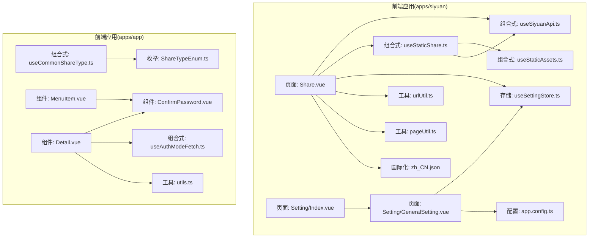
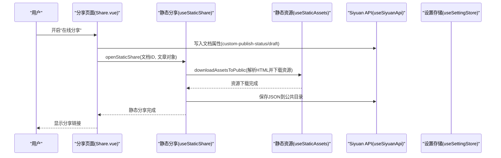
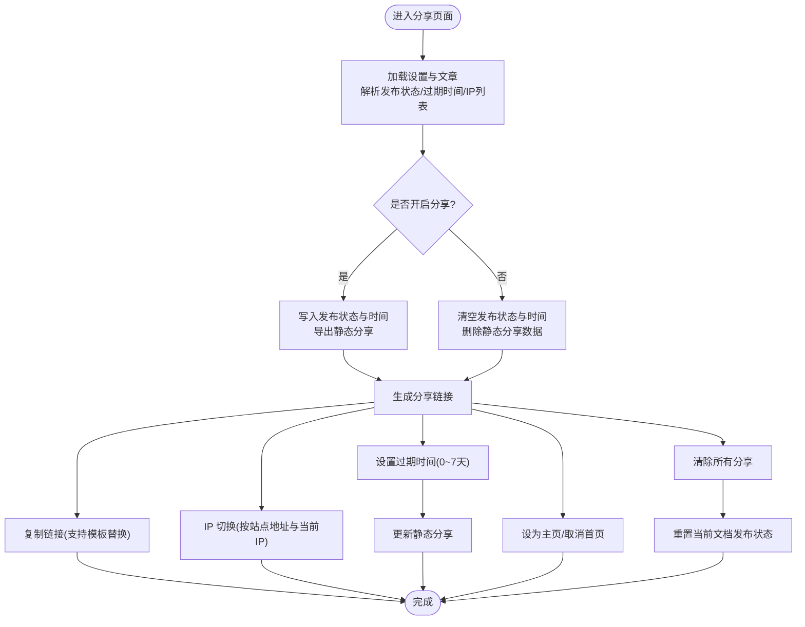
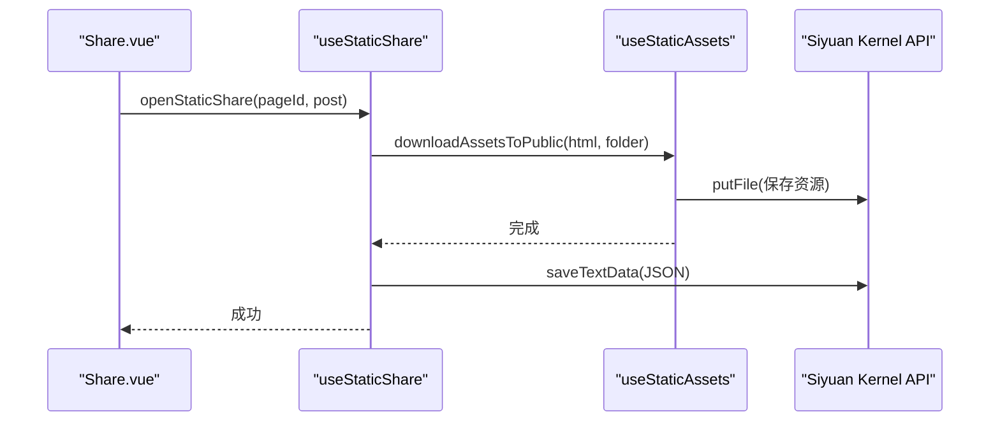
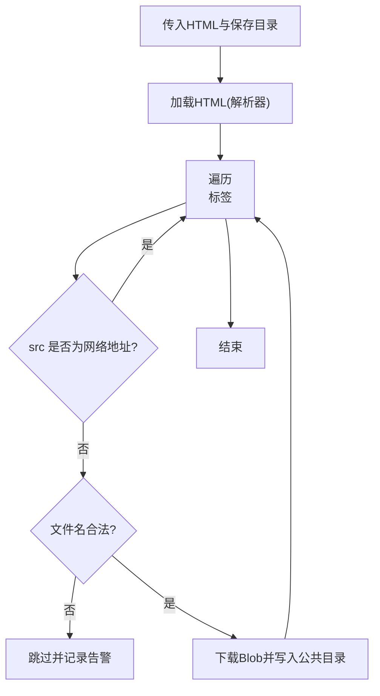
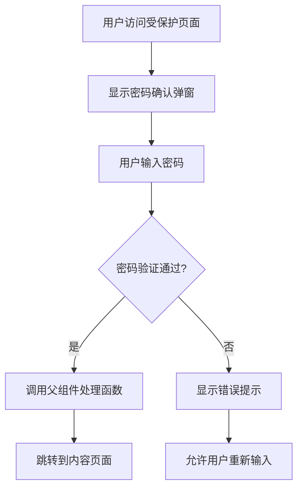
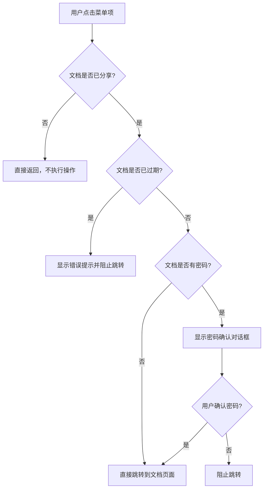
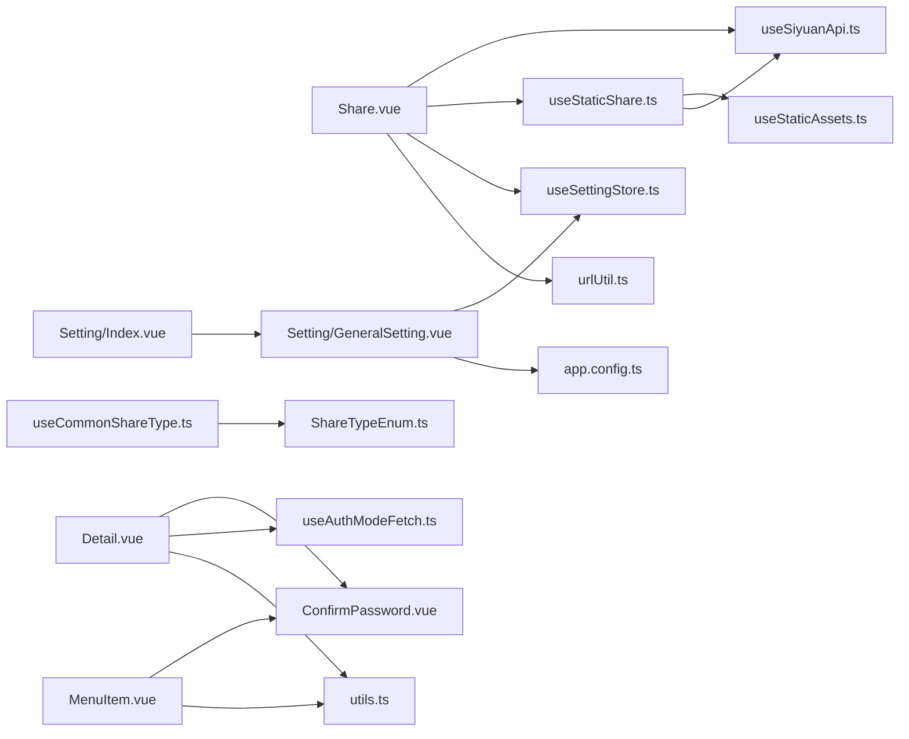

# 内容分享系统

<cite>
**本文引用的文件**
- [apps/siyuan/src/pages/Share.vue](file://apps/siyuan/src/pages/Share.vue)
- [apps/siyuan/src/composables/useStaticShare.ts](file://apps/siyuan/src/composables/useStaticShare.ts)
- [apps/siyuan/src/composables/useSiyuanApi.ts](file://apps/siyuan/src/composables/useSiyuanApi.ts)
- [apps/siyuan/src/stores/useSettingStore.ts](file://apps/siyuan/src/stores/useSettingStore.ts)
- [apps/siyuan/src/composables/useStaticAssets.ts](file://apps/siyuan/src/composables/useStaticAssets.ts)
- [apps/siyuan/src/utils/urlUtil.ts](file://apps/siyuan/src/utils/urlUtil.ts)
- [apps/siyuan/src/app.config.ts](file://apps/siyuan/src/app.config.ts)
- [apps/siyuan/src/pages/Setting/Index.vue](file://apps/siyuan/src/pages/Setting/Index.vue)
- [apps/siyuan/src/pages/Setting/GeneralSetting.vue](file://apps/siyuan/src/pages/Setting/GeneralSetting.vue)
- [apps/siyuan/src/utils/pageUtil.ts](file://apps/siyuan/src/utils/pageUtil.ts)
- [apps/siyuan/src/i18n/zh_CN.json](file://apps/siyuan/src/i18n/zh_CN.json)
- [apps/app/enums/ShareTypeEnum.ts](file://apps/app/enums/ShareTypeEnum.ts)
- [apps/app/composables/useCommonShareType.ts](file://apps/app/composables/useCommonShareType.ts)
- [apps/app/components/common/ConfirmPassword.vue](file://apps/app/components/common/ConfirmPassword.vue)
- [apps/app/components/static/content/left/MenuItem.vue](file://apps/app/components/static/content/left/MenuItem.vue)
- [apps/app/components/static/Detail.vue](file://apps/app/components/static/Detail.vue)
- [apps/app/composables/useAuthModeFetch.ts](file://apps/app/composables/useAuthModeFetch.ts)
- [apps/app/utils/utils.ts](file://apps/app/utils/utils.ts)
</cite>

## 更新摘要
**所做更改**
- 新增密码保护功能，包括密码确认组件和验证流程
- 新增过期控制功能，支持设置链接过期时间和自动过期检测
- 新增状态徽章显示，包括密码徽章和过期徽章
- 新增点击处理逻辑，包括密码验证和过期检查
- 新增视觉指示器，通过颜色和徽章提示分享状态

## 目录
1. [简介](#简介)
2. [项目结构](#项目结构)
3. [核心组件](#核心组件)
4. [架构总览](#架构总览)
5. [详细组件分析](#详细组件分析)
6. [依赖关系分析](#依赖关系分析)
7. [性能考量](#性能考量)
8. [故障排查指南](#故障排查指南)
9. [结论](#结论)
10. [附录](#附录)

## 简介
本技术文档面向内容分享系统，聚焦于将 Siyuan 笔记内容转换为可分享的网页链接。系统通过"静态分享"模式实现，结合文档属性设置、静态资源导出、IP 地址切换、过期时间控制、密码保护以及首页设置等功能，提供从创建分享到链接复制、权限控制的完整流程。文档同时阐述与 Siyuan 内核 API 的交互方式，包括文档属性写入、静态页面数据管理与资源下载。

**更新** 新增密码保护和过期控制功能，提供更完善的内容安全保护机制。

## 项目结构
系统主要由前端 Vue 组成，核心位于 apps/siyuan 下，包含页面、组合式函数、存储、工具与国际化等模块；apps/app 提供与前端页面相关的通用能力（如分享类型枚举与通用分享类型判断）。整体采用分层组织：页面层负责用户交互与视图渲染；组合式函数封装 API 与业务逻辑；存储层负责全局配置持久化；工具层提供 URL/IP、静态资源下载等辅助能力。

**图表来源**
- [apps/siyuan/src/pages/Share.vue:10-244](file://apps/siyuan/src/pages/Share.vue#L10-L244)
- [apps/siyuan/src/composables/useStaticShare.ts:17-96](file://apps/siyuan/src/composables/useStaticShare.ts#L17-L96)
- [apps/siyuan/src/composables/useSiyuanApi.ts:17-29](file://apps/siyuan/src/composables/useSiyuanApi.ts#L17-L29)
- [apps/siyuan/src/stores/useSettingStore.ts:20-79](file://apps/siyuan/src/stores/useSettingStore.ts#L20-L79)
- [apps/siyuan/src/utils/urlUtil.ts:47-77](file://apps/siyuan/src/utils/urlUtil.ts#L47-L77)
- [apps/siyuan/src/app.config.ts:12-58](file://apps/siyuan/src/app.config.ts#L12-L58)
- [apps/siyuan/src/pages/Setting/Index.vue:10-41](file://apps/siyuan/src/pages/Setting/Index.vue#L10-L41)
- [apps/siyuan/src/pages/Setting/GeneralSetting.vue:10-118](file://apps/siyuan/src/pages/Setting/GeneralSetting.vue#L10-L118)
- [apps/siyuan/src/utils/pageUtil.ts:13-24](file://apps/siyuan/src/utils/pageUtil.ts#L13-L24)
- [apps/siyuan/src/i18n/zh_CN.json:1-53](file://apps/siyuan/src/i18n/zh_CN.json#L1-L53)
- [apps/app/enums/ShareTypeEnum.ts:13-25](file://apps/app/enums/ShareTypeEnum.ts#L13-L25)
- [apps/app/composables/useCommonShareType.ts:12-53](file://apps/app/composables/useCommonShareType.ts#L12-L53)
- [apps/app/components/common/ConfirmPassword.vue:1-119](file://apps/app/components/common/ConfirmPassword.vue#L1-L119)
- [apps/app/components/static/content/left/MenuItem.vue:1-85](file://apps/app/components/static/content/left/MenuItem.vue#L1-L85)
- [apps/app/components/static/Detail.vue:1-41](file://apps/app/components/static/Detail.vue#L1-L41)
- [apps/app/composables/useAuthModeFetch.ts:1-319](file://apps/app/composables/useAuthModeFetch.ts#L1-L319)
- [apps/app/utils/utils.ts:17-34](file://apps/app/utils/utils.ts#L17-L34)

**章节来源**
- [apps/siyuan/src/pages/Share.vue:10-244](file://apps/siyuan/src/pages/Share.vue#L10-L244)
- [apps/siyuan/src/pages/Setting/Index.vue:10-41](file://apps/siyuan/src/pages/Setting/Index.vue#L10-L41)
- [apps/siyuan/src/pages/Setting/GeneralSetting.vue:10-118](file://apps/siyuan/src/pages/Setting/GeneralSetting.vue#L10-L118)

## 核心组件
- 分享页面组件：负责分享开关、链接生成、IP 切换、过期时间设置、首页设置、一键清除所有分享等交互。
- 静态分享组合式函数：负责将文章内容与资源导出至公共目录，维护静态分享数据与资源清理。
- Siyuan API 组合式函数：封装博客 API 与内核 API，提供文档属性读写与文件操作。
- 设置存储：负责全局配置（站点地址、主题、首页 ID、分享模板等）的读取与更新。
- URL 工具：提供本地 IP 列表获取与可用 Origin 推断，支撑 IP 切换功能。
- 静态资源下载：解析 HTML 中的图片资源，校验文件名合法性并下载到公共目录。
- 页面工具：从当前文档 DOM 结构提取文档 ID，作为分享标识。
- 国际化：提供中文文案，覆盖分享、设置、提示等场景。
- 分享类型：枚举定义分享类型，当前版本仅支持静态分享。
- **新增** 密码确认组件：提供密码输入界面，支持密码验证和错误提示。
- **新增** 状态徽章组件：在菜单中显示密码保护和过期状态的视觉指示。
- **新增** 过期检查工具：验证文档是否已过期，支持自定义过期时间控制。

**章节来源**
- [apps/siyuan/src/pages/Share.vue:36-243](file://apps/siyuan/src/pages/Share.vue#L36-L243)
- [apps/siyuan/src/composables/useStaticShare.ts:17-96](file://apps/siyuan/src/composables/useStaticShare.ts#L17-L96)
- [apps/siyuan/src/composables/useSiyuanApi.ts:17-29](file://apps/siyuan/src/composables/useSiyuanApi.ts#L17-L29)
- [apps/siyuan/src/stores/useSettingStore.ts:20-79](file://apps/siyuan/src/stores/useSettingStore.ts#L20-L79)
- [apps/siyuan/src/utils/urlUtil.ts:47-77](file://apps/siyuan/src/utils/urlUtil.ts#L47-L77)
- [apps/siyuan/src/composables/useStaticAssets.ts:14-97](file://apps/siyuan/src/composables/useStaticAssets.ts#L14-L97)
- [apps/siyuan/src/utils/pageUtil.ts:13-24](file://apps/siyuan/src/utils/pageUtil.ts#L13-L24)
- [apps/siyuan/src/i18n/zh_CN.json:1-53](file://apps/siyuan/src/i18n/zh_CN.json#L1-L53)
- [apps/app/enums/ShareTypeEnum.ts:13-25](file://apps/app/enums/ShareTypeEnum.ts#L13-L25)
- [apps/app/composables/useCommonShareType.ts:12-53](file://apps/app/composables/useCommonShareType.ts#L12-L53)
- [apps/app/components/common/ConfirmPassword.vue:1-119](file://apps/app/components/common/ConfirmPassword.vue#L1-L119)
- [apps/app/components/static/content/left/MenuItem.vue:1-85](file://apps/app/components/static/content/left/MenuItem.vue#L1-L85)
- [apps/app/components/static/Detail.vue:1-41](file://apps/app/components/static/Detail.vue#L1-L41)
- [apps/app/utils/utils.ts:17-34](file://apps/app/utils/utils.ts#L17-L34)

## 架构总览
系统围绕"静态分享"展开，核心流程如下：
- 用户在分享页面开启分享，系统将文档属性标记为"已发布"，并将文章内容与资源导出到公共目录，生成静态分享页面。
- 链接由站点地址与固定路径拼接而成，支持 IP 切换与过期时间控制。
- 设置页面提供站点地址、主题、首页 ID 等配置项，影响链接生成与展示。
- 通过内核 API 实现文档属性写入、静态数据删除与资源清理。
- **新增** 密码保护：当文档设置密码时，访问页面需要输入正确密码才能查看内容。
- **新增** 过期控制：通过 custom-expires 属性控制分享有效期，超过期限自动失效。

**图表来源**
- [apps/siyuan/src/pages/Share.vue:66-119](file://apps/siyuan/src/pages/Share.vue#L66-L119)
- [apps/siyuan/src/composables/useStaticShare.ts:62-83](file://apps/siyuan/src/composables/useStaticShare.ts#L62-L83)
- [apps/siyuan/src/composables/useStaticAssets.ts:18-51](file://apps/siyuan/src/composables/useStaticAssets.ts#L18-L51)
- [apps/siyuan/src/composables/useSiyuanApi.ts:17-29](file://apps/siyuan/src/composables/useSiyuanApi.ts#L17-L29)

## 详细组件分析

### 分享页面组件（Share.vue）
职责与行为：
- 初始化：加载设置、拉取文章详情、解析文档属性（发布状态、过期时间），计算基础链接与 IP 列表。
- 分享开关：开启时写入发布状态与发布时间，导出静态分享；关闭时清空发布状态并删除静态分享数据。
- 链接复制：支持模板替换占位符（标题、链接、过期时间），复制到剪贴板。
- IP 切换：根据站点地址与当前 IP 判断，动态调整分享链接的主机与端口。
- **新增** 过期时间：限制范围（0~7天），写入文档属性并触发静态分享更新。
- 首页设置：将当前文档设为首页或取消首页。
- 清理所有分享：批量删除公共目录下的静态分享数据，并重置当前文档的发布状态。

**图表来源**
- [apps/siyuan/src/pages/Share.vue:219-243](file://apps/siyuan/src/pages/Share.vue#L219-L243)
- [apps/siyuan/src/pages/Share.vue:66-119](file://apps/siyuan/src/pages/Share.vue#L66-L119)
- [apps/siyuan/src/pages/Share.vue:121-137](file://apps/siyuan/src/pages/Share.vue#L121-L137)
- [apps/siyuan/src/pages/Share.vue:149-164](file://apps/siyuan/src/pages/Share.vue#L149-L164)
- [apps/siyuan/src/pages/Share.vue:183-202](file://apps/siyuan/src/pages/Share.vue#L183-L202)
- [apps/siyuan/src/pages/Share.vue:166-181](file://apps/siyuan/src/pages/Share.vue#L166-L181)
- [apps/siyuan/src/pages/Share.vue:204-217](file://apps/siyuan/src/pages/Share.vue#L204-L217)

**章节来源**
- [apps/siyuan/src/pages/Share.vue:36-243](file://apps/siyuan/src/pages/Share.vue#L36-L243)

### 静态分享组合式函数（useStaticShare）
职责与行为：
- 打开静态分享：解析文章 HTML，下载图片等静态资源到公共目录，仅暴露必要字段并保存 JSON。
- 更新静态分享：根据最新文章内容刷新静态数据。
- 关闭静态分享：删除对应 JSON 与资源目录。
- 清理所有分享：删除公共目录根，用于修复与批量清理。

**图表来源**
- [apps/siyuan/src/composables/useStaticShare.ts:22-38](file://apps/siyuan/src/composables/useStaticShare.ts#L22-L38)
- [apps/siyuan/src/composables/useStaticAssets.ts:18-51](file://apps/siyuan/src/composables/useStaticAssets.ts#L18-L51)
- [apps/siyuan/src/composables/useSiyuanApi.ts:17-29](file://apps/siyuan/src/composables/useSiyuanApi.ts#L17-L29)

**章节来源**
- [apps/siyuan/src/composables/useStaticShare.ts:17-96](file://apps/siyuan/src/composables/useStaticShare.ts#L17-L96)

### 静态资源下载（useStaticAssets）
职责与行为：
- 使用解析器扫描 HTML 中的图片标签，过滤网络图片与非法文件名，将本地图片下载到公共目录对应子路径。
- 对文件名进行 Windows 合法性校验，避免保留名与非法字符。
- 错误处理：记录错误日志，不影响整体流程。

**图表来源**
- [apps/siyuan/src/composables/useStaticAssets.ts:18-51](file://apps/siyuan/src/composables/useStaticAssets.ts#L18-L51)

**章节来源**
- [apps/siyuan/src/composables/useStaticAssets.ts:14-97](file://apps/siyuan/src/composables/useStaticAssets.ts#L14-L97)

### URL 工具（urlUtil）
职责与行为：
- 获取本机 IPv4 列表，合并 Siyuan 配置中的本地 IP，去重后提供给 IP 切换功能。
- 推断可用 Origin，优先使用本地 IP 替换 127.0.0.1/localhost。

**章节来源**
- [apps/siyuan/src/utils/urlUtil.ts:47-77](file://apps/siyuan/src/utils/urlUtil.ts#L47-L77)

### 设置存储（useSettingStore）
职责与行为：
- 读取与更新全局配置，配置项包括站点地址、首页 ID、主题、分享模板等。
- 支持额外数据注入（如自定义 CSS），并持久化到公共目录文件。

**章节来源**
- [apps/siyuan/src/stores/useSettingStore.ts:20-79](file://apps/siyuan/src/stores/useSettingStore.ts#L20-L79)

### 分享类型与权限控制
- 分享类型：当前版本仅支持静态分享，公共分享已废弃。
- 权限控制：通过文档属性与静态分享数据的存在与否决定是否允许访问；过期时间通过文档属性控制，超过期限需重新分享。
- **新增** 密码保护：通过 shareOptions.passwordEnabled 和 password 字段控制密码保护状态。

**章节来源**
- [apps/app/enums/ShareTypeEnum.ts:13-25](file://apps/app/enums/ShareTypeEnum.ts#L13-L25)
- [apps/app/composables/useCommonShareType.ts:22-50](file://apps/app/composables/useCommonShareType.ts#L22-L50)
- [apps/siyuan/src/pages/Share.vue:183-202](file://apps/siyuan/src/pages/Share.vue#L183-L202)
- [apps/app/components/static/Detail.vue:44-47](file://apps/app/components/static/Detail.vue#L44-L47)

### **新增** 密码保护组件（ConfirmPassword.vue）
职责与行为：
- 提供密码输入界面，支持密码强度验证（至少4位）。
- 集成 Element Plus 表单验证，提供错误提示和加载状态。
- 暴露 reset 和 setValue 方法供外部组件调用。
- 支持初始值设置和锁定状态，防止重复提交。

**图表来源**
- [apps/app/components/common/ConfirmPassword.vue:89-101](file://apps/app/components/common/ConfirmPassword.vue#L89-L101)

**章节来源**
- [apps/app/components/common/ConfirmPassword.vue:1-119](file://apps/app/components/common/ConfirmPassword.vue#L1-L119)

### **新增** 状态徽章组件（MenuItem.vue）
职责与行为：
- 在菜单中显示文档的分享状态，包括密码保护和过期状态。
- 通过状态徽章（password-badge、expired-badge）提供视觉指示。
- 根据状态应用不同的颜色样式（警告色、危险色）。
- 实现点击处理逻辑，包括过期检查和密码确认。

**图表来源**
- [apps/app/components/static/content/left/MenuItem.vue:81-122](file://apps/app/components/static/content/left/MenuItem.vue#L81-L122)

**章节来源**
- [apps/app/components/static/content/left/MenuItem.vue:1-85](file://apps/app/components/static/content/left/MenuItem.vue#L1-L85)

### **新增** 过期检查工具（utils.ts）
职责与行为：
- 验证文档是否已过期，支持自定义过期时间控制。
- 计算发布时间与过期时间的差值，判断是否超过设定时限。
- 支持永久有效（0）和固定时限两种模式。

**章节来源**
- [apps/app/utils/utils.ts:17-34](file://apps/app/utils/utils.ts#L17-L34)

### **新增** 认证模式获取（useAuthModeFetch.ts）
职责与行为：
- 提供密码验证接口，支持加密密码的验证。
- 实现文档元数据获取，支持服务商模式和普通模式。
- 处理密码验证后的密钥传递和页面跳转。

**章节来源**
- [apps/app/composables/useAuthModeFetch.ts:260-298](file://apps/app/composables/useAuthModeFetch.ts#L260-L298)

## 依赖关系分析
- 页面依赖组合式函数与存储，组合式函数进一步依赖 API 与工具。
- 静态分享依赖静态资源下载与内核 API。
- 设置页面依赖设置存储与配置常量。
- 分享类型枚举与通用方法为前端页面提供分享类型判断依据。
- **新增** 密码保护组件依赖认证模式获取组合式函数。
- **新增** 状态徽章组件依赖 Element Plus 组件库和路由导航。

**图表来源**
- [apps/siyuan/src/pages/Share.vue:10-34](file://apps/siyuan/src/pages/Share.vue#L10-L34)
- [apps/siyuan/src/composables/useStaticShare.ts:17-20](file://apps/siyuan/src/composables/useStaticShare.ts#L17-L20)
- [apps/siyuan/src/composables/useSiyuanApi.ts:17-29](file://apps/siyuan/src/composables/useSiyuanApi.ts#L17-L29)
- [apps/siyuan/src/stores/useSettingStore.ts:20-26](file://apps/siyuan/src/stores/useSettingStore.ts#L20-L26)
- [apps/siyuan/src/utils/urlUtil.ts:47-66](file://apps/siyuan/src/utils/urlUtil.ts#L47-L66)
- [apps/siyuan/src/pages/Setting/Index.vue:10-35](file://apps/siyuan/src/pages/Setting/Index.vue#L10-L35)
- [apps/siyuan/src/pages/Setting/GeneralSetting.vue:10-21](file://apps/siyuan/src/pages/Setting/GeneralSetting.vue#L10-L21)
- [apps/siyuan/src/app.config.ts:12-58](file://apps/siyuan/src/app.config.ts#L12-L58)
- [apps/app/enums/ShareTypeEnum.ts:13-25](file://apps/app/enums/ShareTypeEnum.ts#L13-L25)
- [apps/app/composables/useCommonShareType.ts:12-53](file://apps/app/composables/useCommonShareType.ts#L12-L53)
- [apps/app/components/static/Detail.vue:116-129](file://apps/app/components/static/Detail.vue#L116-L129)
- [apps/app/components/static/content/left/MenuItem.vue:81-122](file://apps/app/components/static/content/left/MenuItem.vue#L81-L122)

**章节来源**
- [apps/siyuan/src/pages/Share.vue:10-34](file://apps/siyuan/src/pages/Share.vue#L10-L34)
- [apps/siyuan/src/composables/useStaticShare.ts:17-20](file://apps/siyuan/src/composables/useStaticShare.ts#L17-L20)
- [apps/siyuan/src/pages/Setting/GeneralSetting.vue:10-21](file://apps/siyuan/src/pages/Setting/GeneralSetting.vue#L10-L21)

## 性能考量
- 静态资源下载：对每张图片发起请求并写入文件，建议控制图片数量与体积，避免频繁 I/O。
- HTML 解析：解析器遍历图片节点，复杂页面可能增加 CPU 开销，建议在分享前优化图片数量。
- 文件名校验：包含多处校验逻辑，避免异常文件名导致写入失败。
- 配置读取：设置存储采用异步读取与缓存策略，减少重复请求。
- **新增** 密码验证：密码验证通过 API 调用实现，建议合理设置超时时间。
- **新增** 过期检查：过期检查为本地计算，性能开销较小，但需要确保时间同步。

## 故障排查指南
- 无法访问分享链接
  - 检查站点地址与端口是否正确，尝试切换 IP 或在设置中配置自定义域名。
  - 确认"网络服务"已开启，外网访问需在"设置->关于->网络服务"启用。
  - 若提示无法访问，可尝试切换 IP 或更换站点地址。
- 复制链接后仍无法打开
  - 检查过期时间设置，若已过期需重新分享。
  - 确认静态分享数据已生成，检查公共目录是否存在对应 JSON 与资源文件夹。
- 图片不显示
  - 检查图片是否为网络地址（网络图片会被跳过）。
  - 校验文件名是否合法，避免保留名与非法字符。
- 清理无效分享
  - 使用"清除所有分享"功能，系统会删除公共目录下全部静态分享数据并重置当前文档发布状态。
- **新增** 密码保护问题
  - 确认文档确实设置了密码保护，检查 shareOptions.passwordEnabled 是否为 true。
  - 验证输入的密码是否正确，注意区分大小写。
  - 检查密码验证接口是否正常工作，查看浏览器开发者工具的网络请求。
- **新增** 过期链接问题
  - 检查 custom-expires 和 custom-publish-time 属性是否正确设置。
  - 验证系统时间是否准确，过期检查基于本地时间计算。

**章节来源**
- [apps/siyuan/src/pages/Share.vue:149-164](file://apps/siyuan/src/pages/Share.vue#L149-L164)
- [apps/siyuan/src/pages/Share.vue:204-217](file://apps/siyuan/src/pages/Share.vue#L204-L217)
- [apps/siyuan/src/composables/useStaticAssets.ts:53-83](file://apps/siyuan/src/composables/useStaticAssets.ts#L53-L83)
- [apps/siyuan/src/i18n/zh_CN.json:25-34](file://apps/siyuan/src/i18n/zh_CN.json#L25-L34)
- [apps/app/components/static/Detail.vue:116-129](file://apps/app/components/static/Detail.vue#L116-L129)
- [apps/app/utils/utils.ts:17-34](file://apps/app/utils/utils.ts#L17-L34)

## 结论
本系统通过"静态分享"模式，将 Siyuan 笔记内容导出为可独立访问的网页，具备完善的分享生命周期管理：从创建、链接生成、IP 切换、过期控制到首页设置与一键清理。**新增的密码保护和过期控制功能进一步增强了内容安全性，通过状态徽章和视觉指示器提供了直观的状态反馈。** 通过与 Siyuan 内核 API 的紧密协作，系统实现了文档属性写入与静态数据管理，满足个人与团队的分享需求。未来可在分享类型扩展、访问统计与更细粒度的权限控制方面持续演进。

## 附录

### 使用示例（基于现有实现）
- 创建分享
  - 在文档页面打开分享面板，勾选"在线分享"，系统自动写入发布状态并导出静态分享数据。
  - 参考路径：[apps/siyuan/src/pages/Share.vue:66-119](file://apps/siyuan/src/pages/Share.vue#L66-L119)
- 复制分享链接
  - 点击"复制"按钮，系统根据模板替换占位符后复制到剪贴板。
  - 参考路径：[apps/siyuan/src/pages/Share.vue:121-137](file://apps/siyuan/src/pages/Share.vue#L121-L137)
- 切换 IP 地址
  - 在"切换IP"下拉框选择目标 IP，系统自动调整链接的主机与端口。
  - 参考路径：[apps/siyuan/src/pages/Share.vue:149-164](file://apps/siyuan/src/pages/Share.vue#L149-L164)、[apps/siyuan/src/utils/urlUtil.ts:47-66](file://apps/siyuan/src/utils/urlUtil.ts#L47-L66)
- **新增** 设置过期时间
  - 在"链接过期时间"输入秒数（0 表示永久），系统写入文档属性并更新静态分享。
  - 参考路径：[apps/siyuan/src/pages/Share.vue:183-202](file://apps/siyuan/src/pages/Share.vue#L183-L202)
- 设为主页
  - 勾选"设为主页"，系统将当前文档 ID 写入设置；取消则清空。
  - 参考路径：[apps/siyuan/src/pages/Share.vue:166-181](file://apps/siyuan/src/pages/Share.vue#L166-L181)
- 清除所有分享
  - 点击"清除所有分享"，系统删除公共目录下全部静态分享数据并重置当前文档发布状态。
  - 参考路径：[apps/siyuan/src/pages/Share.vue:204-217](file://apps/siyuan/src/pages/Share.vue#L204-L217)

### **新增** 密码保护使用示例
- 设置密码保护
  - 在分享页面设置密码保护选项，系统会在访问时要求输入密码。
  - 参考路径：[apps/app/components/static/Detail.vue:139-148](file://apps/app/components/static/Detail.vue#L139-L148)
- 密码验证流程
  - 用户输入密码后，系统调用 validatePassword 接口进行验证。
  - 参考路径：[apps/app/composables/useAuthModeFetch.ts:260-298](file://apps/app/composables/useAuthModeFetch.ts#L260-L298)
- 密码确认组件
  - 提供密码输入界面，支持表单验证和错误提示。
  - 参考路径：[apps/app/components/common/ConfirmPassword.vue:89-101](file://apps/app/components/common/ConfirmPassword.vue#L89-L101)

### **新增** 状态徽章使用示例
- 密码徽章显示
  - 当文档有密码保护时，在菜单中显示"(有密码)"徽章。
  - 参考路径：[apps/app/components/static/content/left/MenuItem.vue:16](file://apps/app/components/static/content/left/MenuItem.vue#L16)
- 过期徽章显示
  - 当文档已过期时，在菜单中显示"(已过期)"徽章。
  - 参考路径：[apps/app/components/static/content/left/MenuItem.vue:17](file://apps/app/components/static/content/left/MenuItem.vue#L17)
- 点击处理逻辑
  - 实现过期检查和密码确认的点击处理。
  - 参考路径：[apps/app/components/static/content/left/MenuItem.vue:81-122](file://apps/app/components/static/content/left/MenuItem.vue#L81-L122)

### 配置项说明
- 站点地址：用于生成分享链接的基础地址，支持自定义域名与端口。
- 主题：分别配置浅色与深色主题，主题版本随主题变化。
- 首页 ID：指定主页文档 ID，需为已分享的文档。
- 分享模板：支持占位符 [title]、[url]、[expired] 的提示信息模板。
- **新增** 过期时间：设置链接的有效期（秒），0 表示永久有效。
- **新增** 密码保护：启用密码保护功能，需要输入正确密码才能访问。
- 参考路径：
  - [apps/siyuan/src/app.config.ts:12-58](file://apps/siyuan/src/app.config.ts#L12-L58)
  - [apps/siyuan/src/pages/Setting/GeneralSetting.vue:104-118](file://apps/siyuan/src/pages/Setting/GeneralSetting.vue#L104-L118)
  - [apps/siyuan/src/i18n/zh_CN.json:37-52](file://apps/siyuan/src/i18n/zh_CN.json#L37-L52)
  - [apps/siyuan/src/pages/Share.vue:288-295](file://apps/siyuan/src/pages/Share.vue#L288-L295)