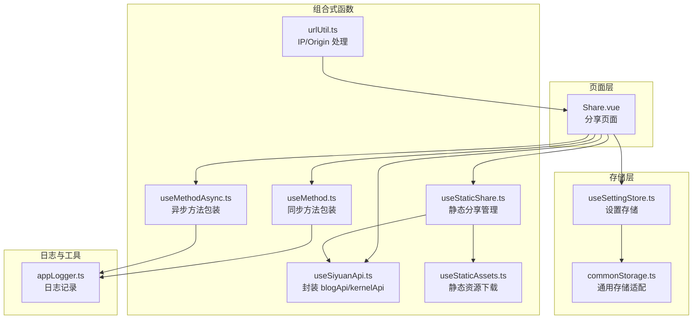
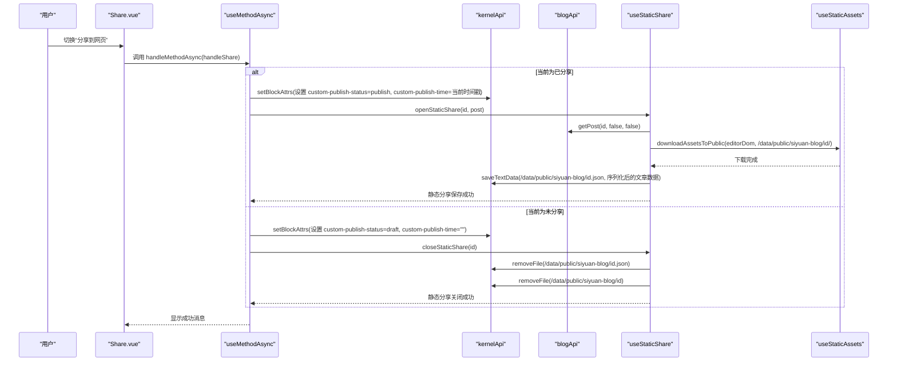
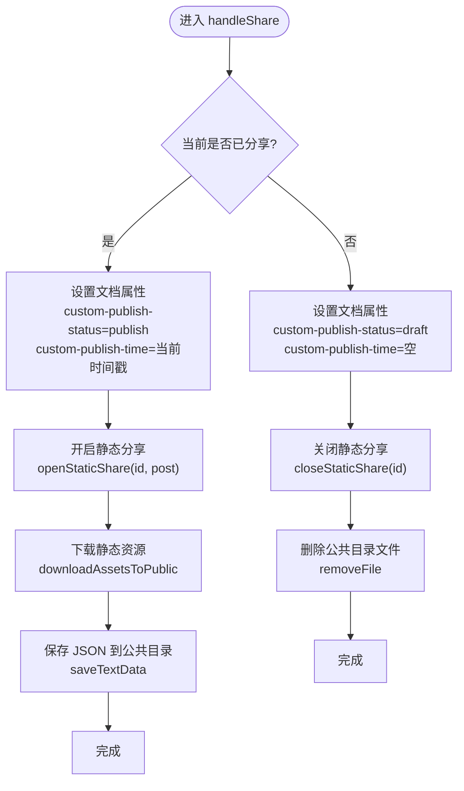
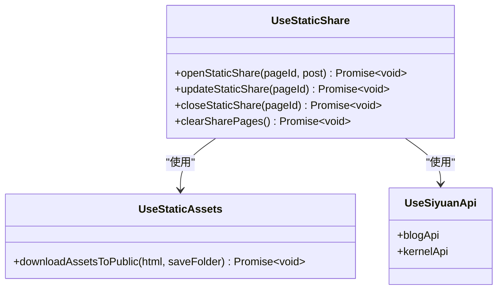
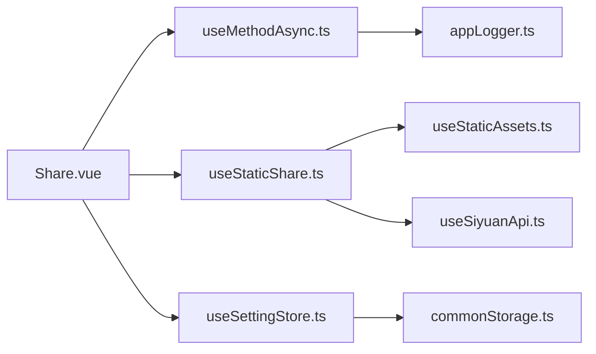

# 分享创建与管理

<cite>
**本文引用的文件**
- [apps/siyuan/src/pages/Share.vue](file://apps/siyuan/src/pages/Share.vue)
- [apps/siyuan/src/composables/useStaticShare.ts](file://apps/siyuan/src/composables/useStaticShare.ts)
- [apps/siyuan/src/composables/useSiyuanApi.ts](file://apps/siyuan/src/composables/useSiyuanApi.ts)
- [apps/siyuan/src/composables/useMethod.ts](file://apps/siyuan/src/composables/useMethod.ts)
- [apps/siyuan/src/composables/useMethodAsync.ts](file://apps/siyuan/src/composables/useMethodAsync.ts)
- [apps/siyuan/src/stores/useSettingStore.ts](file://apps/siyuan/src/stores/useSettingStore.ts)
- [apps/siyuan/src/stores/common/commonStorage.ts](file://apps/siyuan/src/stores/common/commonStorage.ts)
- [apps/siyuan/src/composables/useStaticAssets.ts](file://apps/siyuan/src/composables/useStaticAssets.ts)
- [apps/siyuan/src/utils/urlUtil.ts](file://apps/siyuan/src/utils/urlUtil.ts)
- [apps/siyuan/src/utils/appLogger.ts](file://apps/siyuan/src/utils/appLogger.ts)
- [plugin.json](file://plugin.json)
</cite>

## 目录
1. [引言](#引言)
2. [项目结构](#项目结构)
3. [核心组件](#核心组件)
4. [架构总览](#架构总览)
5. [详细组件分析](#详细组件分析)
6. [依赖关系分析](#依赖关系分析)
7. [性能考虑](#性能考虑)
8. [故障排查指南](#故障排查指南)
9. [结论](#结论)
10. [附录：使用示例](#附录使用示例)

## 引言
本技术文档围绕“分享创建与管理”功能展开，聚焦于如何在 Siyuan 笔记中创建与管理笔记分享，涵盖以下关键点：
- 分享状态切换机制：从草稿到发布的转换逻辑与持久化策略
- 分享链接生成算法：基于站点地址与页面 ID 的组合规则
- 文档属性设置：custom-publish-status、custom-publish-time、custom-expires 的作用与更新流程
- 异步操作处理与错误处理机制：统一的异常捕获与用户反馈
- 用户确认对话框的使用：在关键操作前进行二次确认
- 与 Siyuan 内核 API 的交互：setBlockAttrs、saveTextData、removeFile、putFile 等方法的使用
- 文档属性持久化存储：通过公共目录与内核 API 实现跨会话的数据一致性

## 项目结构
该功能主要位于 Siyuan 插件前端应用中，核心文件组织如下：
- 页面组件：负责展示与交互（分享开关、链接复制、过期时间设置、主页设置等）
- 组合式函数：封装与 Siyuan API 的交互、静态分享处理、方法执行与异常处理
- 存储层：配置与设置的持久化，支持公共目录读写
- 工具模块：日志、URL/IP 处理等

图表来源
- [apps/siyuan/src/pages/Share.vue:10-244](file://apps/siyuan/src/pages/Share.vue#L10-L244)
- [apps/siyuan/src/composables/useSiyuanApi.ts:17-29](file://apps/siyuan/src/composables/useSiyuanApi.ts#L17-L29)
- [apps/siyuan/src/composables/useStaticShare.ts:17-96](file://apps/siyuan/src/composables/useStaticShare.ts#L17-L96)
- [apps/siyuan/src/composables/useMethod.ts:16-31](file://apps/siyuan/src/composables/useMethod.ts#L16-L31)
- [apps/siyuan/src/composables/useMethodAsync.ts:16-37](file://apps/siyuan/src/composables/useMethodAsync.ts#L16-L37)
- [apps/siyuan/src/composables/useStaticAssets.ts:14-96](file://apps/siyuan/src/composables/useStaticAssets.ts#L14-L96)
- [apps/siyuan/src/stores/useSettingStore.ts:20-79](file://apps/siyuan/src/stores/useSettingStore.ts#L20-L79)
- [apps/siyuan/src/stores/common/commonStorage.ts:25-85](file://apps/siyuan/src/stores/common/commonStorage.ts#L25-L85)
- [apps/siyuan/src/utils/urlUtil.ts:47-77](file://apps/siyuan/src/utils/urlUtil.ts#L47-L77)
- [apps/siyuan/src/utils/appLogger.ts:20-22](file://apps/siyuan/src/utils/appLogger.ts#L20-L22)

章节来源
- [apps/siyuan/src/pages/Share.vue:10-244](file://apps/siyuan/src/pages/Share.vue#L10-L244)
- [apps/siyuan/src/composables/useSiyuanApi.ts:17-29](file://apps/siyuan/src/composables/useSiyuanApi.ts#L17-L29)
- [apps/siyuan/src/composables/useStaticShare.ts:17-96](file://apps/siyuan/src/composables/useStaticShare.ts#L17-L96)
- [apps/siyuan/src/composables/useMethod.ts:16-31](file://apps/siyuan/src/composables/useMethod.ts#L16-L31)
- [apps/siyuan/src/composables/useMethodAsync.ts:16-37](file://apps/siyuan/src/composables/useMethodAsync.ts#L16-L37)
- [apps/siyuan/src/stores/useSettingStore.ts:20-79](file://apps/siyuan/src/stores/useSettingStore.ts#L20-L79)
- [apps/siyuan/src/stores/common/commonStorage.ts:25-85](file://apps/siyuan/src/stores/common/commonStorage.ts#L25-L85)
- [apps/siyuan/src/utils/urlUtil.ts:47-77](file://apps/siyuan/src/utils/urlUtil.ts#L47-L77)
- [apps/siyuan/src/utils/appLogger.ts:20-22](file://apps/siyuan/src/utils/appLogger.ts#L20-L22)

## 核心组件
- 分享页面组件（Share.vue）：负责渲染分享状态、生成分享链接、处理 IP 切换、设置过期时间、设置主页、清除所有分享等
- 静态分享组合式函数（useStaticShare.ts）：封装静态分享的开启/关闭/更新/清理逻辑，涉及资源下载与 JSON 数据持久化
- Siyuan API 组合式函数（useSiyuanApi.ts）：统一创建 blogApi 与 kernelApi 实例，供页面与组合式函数调用
- 方法包装（useMethod.ts、useMethodAsync.ts）：提供统一的异常捕获与用户消息提示
- 设置存储（useSettingStore.ts、commonStorage.ts）：配置项持久化至公共目录，支持读取与更新
- 静态资源处理（useStaticAssets.ts）：解析 HTML 中的图片资源并下载到公共目录
- URL/IP 工具（urlUtil.ts）：获取可用 IP 列表与替换链接主机名

章节来源
- [apps/siyuan/src/pages/Share.vue:36-243](file://apps/siyuan/src/pages/Share.vue#L36-L243)
- [apps/siyuan/src/composables/useStaticShare.ts:17-96](file://apps/siyuan/src/composables/useStaticShare.ts#L17-L96)
- [apps/siyuan/src/composables/useSiyuanApi.ts:17-29](file://apps/siyuan/src/composables/useSiyuanApi.ts#L17-L29)
- [apps/siyuan/src/composables/useMethod.ts:16-31](file://apps/siyuan/src/composables/useMethod.ts#L16-L31)
- [apps/siyuan/src/composables/useMethodAsync.ts:16-37](file://apps/siyuan/src/composables/useMethodAsync.ts#L16-L37)
- [apps/siyuan/src/stores/useSettingStore.ts:20-79](file://apps/siyuan/src/stores/useSettingStore.ts#L20-L79)
- [apps/siyuan/src/stores/common/commonStorage.ts:25-85](file://apps/siyuan/src/stores/common/commonStorage.ts#L25-L85)
- [apps/siyuan/src/composables/useStaticAssets.ts:14-96](file://apps/siyuan/src/composables/useStaticAssets.ts#L14-L96)
- [apps/siyuan/src/utils/urlUtil.ts:47-77](file://apps/siyuan/src/utils/urlUtil.ts#L47-L77)

## 架构总览
下图展示了分享创建与管理的端到端流程，包括状态切换、链接生成、属性持久化与静态资源处理。

图表来源
- [apps/siyuan/src/pages/Share.vue:66-119](file://apps/siyuan/src/pages/Share.vue#L66-L119)
- [apps/siyuan/src/composables/useMethodAsync.ts:19-34](file://apps/siyuan/src/composables/useMethodAsync.ts#L19-L34)
- [apps/siyuan/src/composables/useStaticShare.ts:62-83](file://apps/siyuan/src/composables/useStaticShare.ts#L62-L83)
- [apps/siyuan/src/composables/useStaticAssets.ts:18-51](file://apps/siyuan/src/composables/useStaticAssets.ts#L18-L51)
- [apps/siyuan/src/composables/useSiyuanApi.ts:20-22](file://apps/siyuan/src/composables/useSiyuanApi.ts#L20-L22)

## 详细组件分析

### 分享页面组件（Share.vue）
职责与行为：
- 初始化：加载设置、获取文章详情、解析文档属性、生成基础分享链接
- 分享状态切换：通过 checkbox 切换 custom-publish-status，并写入 custom-publish-time；同时开启或关闭静态分享
- 链接生成：基于站点地址与 basePath 生成分享链接，支持 IP 切换
- 过期时间设置：设置 custom-expires 并更新静态分享
- 主页设置：设置 homePageId 并持久化
- 清除所有分享：一键清理公共目录下的全部分享数据并重置当前文档状态

关键流程图（状态切换）

图表来源
- [apps/siyuan/src/pages/Share.vue:66-119](file://apps/siyuan/src/pages/Share.vue#L66-L119)
- [apps/siyuan/src/composables/useStaticShare.ts:62-83](file://apps/siyuan/src/composables/useStaticShare.ts#L62-L83)
- [apps/siyuan/src/composables/useStaticAssets.ts:18-51](file://apps/siyuan/src/composables/useStaticAssets.ts#L18-L51)

章节来源
- [apps/siyuan/src/pages/Share.vue:36-243](file://apps/siyuan/src/pages/Share.vue#L36-L243)

### 静态分享组合式函数（useStaticShare.ts）
职责与行为：
- 开启静态分享：根据文章内容下载静态资源到公共目录，并将精简后的文章数据保存为 JSON
- 更新静态分享：重新拉取文章内容并执行保存流程
- 关闭静态分享：删除对应的 JSON 与资源目录
- 清理所有分享：删除公共目录根，用于修复与批量清理

类图（抽象关系）

图表来源
- [apps/siyuan/src/composables/useStaticShare.ts:17-96](file://apps/siyuan/src/composables/useStaticShare.ts#L17-L96)
- [apps/siyuan/src/composables/useStaticAssets.ts:14-96](file://apps/siyuan/src/composables/useStaticAssets.ts#L14-L96)
- [apps/siyuan/src/composables/useSiyuanApi.ts:17-29](file://apps/siyuan/src/composables/useSiyuanApi.ts#L17-L29)

章节来源
- [apps/siyuan/src/composables/useStaticShare.ts:17-96](file://apps/siyuan/src/composables/useStaticShare.ts#L17-L96)
- [apps/siyuan/src/composables/useStaticAssets.ts:14-96](file://apps/siyuan/src/composables/useStaticAssets.ts#L14-L96)

### Siyuan API 组合式函数（useSiyuanApi.ts）
职责与行为：
- 创建并返回 SiYuanApiAdaptor（blogApi）与 SiyuanKernelApi（kernelApi）实例
- 提供统一入口供页面与组合式函数调用内核能力

章节来源
- [apps/siyuan/src/composables/useSiyuanApi.ts:17-29](file://apps/siyuan/src/composables/useSiyuanApi.ts#L17-L29)

### 方法包装（useMethod.ts、useMethodAsync.ts）
职责与行为：
- 同步包装：捕获异常并显示成功/失败消息
- 异步包装：支持前置校验回调（errorHandler），通过后才执行异步方法，统一异常处理与消息提示

章节来源
- [apps/siyuan/src/composables/useMethod.ts:16-31](file://apps/siyuan/src/composables/useMethod.ts#L16-L31)
- [apps/siyuan/src/composables/useMethodAsync.ts:16-37](file://apps/siyuan/src/composables/useMethodAsync.ts#L16-L37)

### 设置存储（useSettingStore.ts、commonStorage.ts）
职责与行为：
- useSettingStore：以 ref + computed 的方式缓存设置，通过 useCommonStorageAsync 读取与写入公共配置文件
- commonStorage：实现 StorageLikeAsync 接口，基于 kernelApi 的 saveTextData 与 getFile 实现持久化

章节来源
- [apps/siyuan/src/stores/useSettingStore.ts:20-79](file://apps/siyuan/src/stores/useSettingStore.ts#L20-L79)
- [apps/siyuan/src/stores/common/commonStorage.ts:25-85](file://apps/siyuan/src/stores/common/commonStorage.ts#L25-L85)

### URL/IP 工具（urlUtil.ts）
职责与行为：
- 获取本机 IPv4 列表，去重并过滤无效项
- 提供可用 Origin 替换逻辑，便于在不同网络环境下访问本地服务

章节来源
- [apps/siyuan/src/utils/urlUtil.ts:47-77](file://apps/siyuan/src/utils/urlUtil.ts#L47-L77)

## 依赖关系分析
- 页面组件依赖组合式函数与存储层，形成清晰的分层
- 静态分享依赖静态资源处理与内核 API
- 方法包装统一了异常处理与用户反馈
- 设置存储通过公共目录实现跨会话持久化

图表来源
- [apps/siyuan/src/pages/Share.vue:30-34](file://apps/siyuan/src/pages/Share.vue#L30-L34)
- [apps/siyuan/src/composables/useStaticShare.ts:17-96](file://apps/siyuan/src/composables/useStaticShare.ts#L17-L96)
- [apps/siyuan/src/composables/useMethodAsync.ts:16-37](file://apps/siyuan/src/composables/useMethodAsync.ts#L16-L37)
- [apps/siyuan/src/stores/useSettingStore.ts:20-79](file://apps/siyuan/src/stores/useSettingStore.ts#L20-L79)
- [apps/siyuan/src/stores/common/commonStorage.ts:25-85](file://apps/siyuan/src/stores/common/commonStorage.ts#L25-L85)
- [apps/siyuan/src/composables/useStaticAssets.ts:14-96](file://apps/siyuan/src/composables/useStaticAssets.ts#L14-L96)
- [apps/siyuan/src/composables/useSiyuanApi.ts:17-29](file://apps/siyuan/src/composables/useSiyuanApi.ts#L17-L29)
- [apps/siyuan/src/utils/appLogger.ts:20-22](file://apps/siyuan/src/utils/appLogger.ts#L20-L22)

## 性能考虑
- 静态资源下载：在开启分享时进行，建议对大图进行压缩或懒加载策略，避免阻塞主流程
- JSON 保存：仅保存必要字段，减少 IO 压力
- IP 列表获取：在页面挂载时一次性计算，避免频繁调用系统接口
- 异步操作：统一使用 useMethodAsync 包裹，确保异常快速反馈，避免长时间无响应

## 故障排查指南
常见问题与定位要点：
- 分享状态未生效
  - 检查 setBlockAttrs 是否成功调用，确认 custom-publish-status 与 custom-publish-time 是否正确写入
  - 章节来源
    - [apps/siyuan/src/pages/Share.vue:73-86](file://apps/siyuan/src/pages/Share.vue#L73-L86)
- 链接无法打开
  - 校验 shareLink 生成逻辑与 IP 切换逻辑，确认目标主机名与端口正确
  - 章节来源
    - [apps/siyuan/src/pages/Share.vue:139-164](file://apps/siyuan/src/pages/Share.vue#L139-L164)
- 静态资源缺失
  - 检查 downloadAssetsToPublic 是否正常下载，排除非法文件名与网络图片
  - 章节来源
    - [apps/siyuan/src/composables/useStaticAssets.ts:18-51](file://apps/siyuan/src/composables/useStaticAssets.ts#L18-L51)
- 公共目录权限
  - 确认 saveTextData 与 removeFile 的路径存在且具备写权限
  - 章节来源
    - [apps/siyuan/src/composables/useStaticShare.ts:22-53](file://apps/siyuan/src/composables/useStaticShare.ts#L22-L53)
- 设置未持久化
  - 检查 useSettingStore 与 commonStorage 的读写流程
  - 章节来源
    - [apps/siyuan/src/stores/useSettingStore.ts:38-62](file://apps/siyuan/src/stores/useSettingStore.ts#L38-L62)
    - [apps/siyuan/src/stores/common/commonStorage.ts:43-84](file://apps/siyuan/src/stores/common/commonStorage.ts#L43-L84)

## 结论
该分享功能通过清晰的分层设计与统一的 API 封装，实现了从草稿到发布的一键切换、分享链接的动态生成、文档属性的持久化以及静态资源的自动下载与托管。配合统一的异常处理与用户反馈机制，保证了良好的用户体验与可维护性。

## 附录：使用示例

### 示例一：创建分享（草稿 → 发布）
- 步骤
  - 在分享页面勾选“分享到网页”
  - 系统自动设置 custom-publish-status 为 publish，并写入 custom-publish-time
  - 下载静态资源到 /data/public/siyuan-blog/{id}/
  - 将精简后的文章数据保存为 /data/public/siyuan-blog/{id}.json
- 关键调用
  - setBlockAttrs：写入发布状态与时间
  - openStaticShare：触发静态分享保存
- 章节来源
  - [apps/siyuan/src/pages/Share.vue:66-119](file://apps/siyuan/src/pages/Share.vue#L66-L119)
  - [apps/siyuan/src/composables/useStaticShare.ts:62-64](file://apps/siyuan/src/composables/useStaticShare.ts#L62-L64)

### 示例二：取消分享（发布 → 草稿）
- 步骤
  - 取消勾选“分享到网页”
  - 系统设置 custom-publish-status 为 draft，并清空 custom-publish-time
  - 删除 /data/public/siyuan-blog/{id}.json 与对应资源目录
- 关键调用
  - setBlockAttrs：重置发布状态
  - closeStaticShare：清理静态分享
- 章节来源
  - [apps/siyuan/src/pages/Share.vue:81-104](file://apps/siyuan/src/pages/Share.vue#L81-L104)
  - [apps/siyuan/src/composables/useStaticShare.ts:81-83](file://apps/siyuan/src/composables/useStaticShare.ts#L81-L83)

### 示例三：设置分享链接过期时间
- 步骤
  - 在“其他选项”中输入过期秒数
  - 点击保存，系统设置 custom-expires 并更新静态分享
- 关键调用
  - setBlockAttrs：写入 custom-expires
  - updateStaticShare：刷新静态分享数据
- 章节来源
  - [apps/siyuan/src/pages/Share.vue:183-202](file://apps/siyuan/src/pages/Share.vue#L183-L202)
  - [apps/siyuan/src/composables/useStaticShare.ts:71-74](file://apps/siyuan/src/composables/useStaticShare.ts#L71-L74)

### 示例四：设置主页
- 步骤
  - 勾选“设为主页”，系统将当前文档 ID 写入设置并持久化
- 关键调用
  - updateSetting：更新设置并保存
- 章节来源
  - [apps/siyuan/src/pages/Share.vue:166-181](file://apps/siyuan/src/pages/Share.vue#L166-L181)
  - [apps/siyuan/src/stores/useSettingStore.ts:50-62](file://apps/siyuan/src/stores/useSettingStore.ts#L50-L62)

### 示例五：复制可定制模板链接
- 步骤
  - 在“复制网页链接”区域点击复制，系统根据模板替换占位符（标题、链接、过期时间）后复制
- 关键调用
  - 模板替换与复制逻辑
- 章节来源
  - [apps/siyuan/src/pages/Share.vue:121-137](file://apps/siyuan/src/pages/Share.vue#L121-L137)

### 示例六：IP 切换与链接修正
- 步骤
  - 在“更改 IP”下拉中选择目标 IP
  - 若选择站点域名，自动将链接主机名与端口替换为站点配置
  - 否则将链接主机名替换为所选 IP，端口保持当前窗口端口
- 关键调用
  - URL 解析与替换
- 章节来源
  - [apps/siyuan/src/pages/Share.vue:139-164](file://apps/siyuan/src/pages/Share.vue#L139-L164)
  - [apps/siyuan/src/utils/urlUtil.ts:47-77](file://apps/siyuan/src/utils/urlUtil.ts#L47-L77)