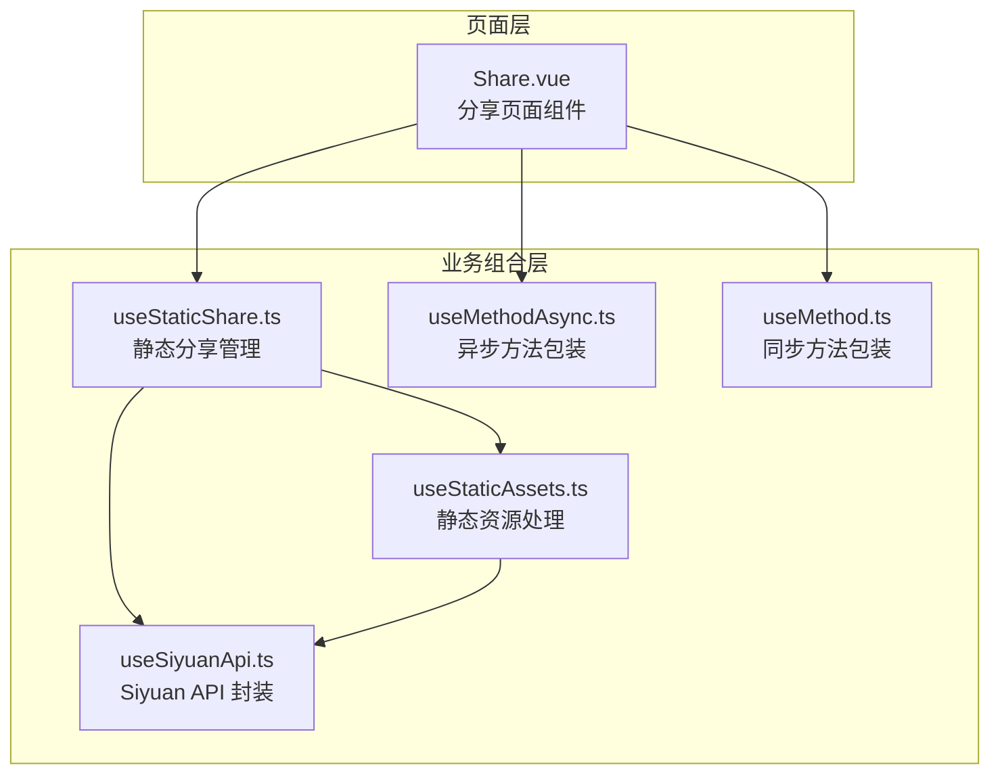
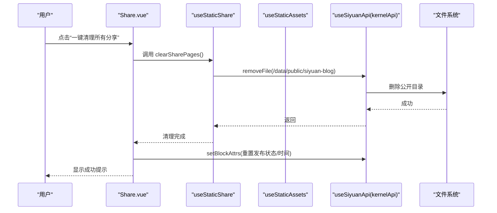
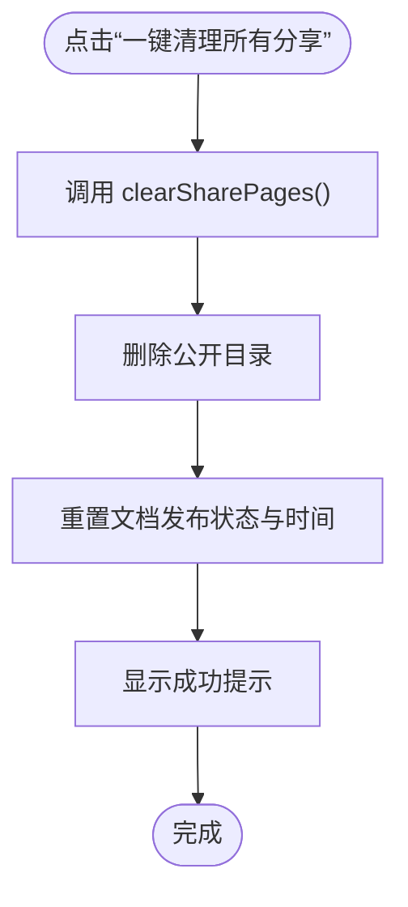
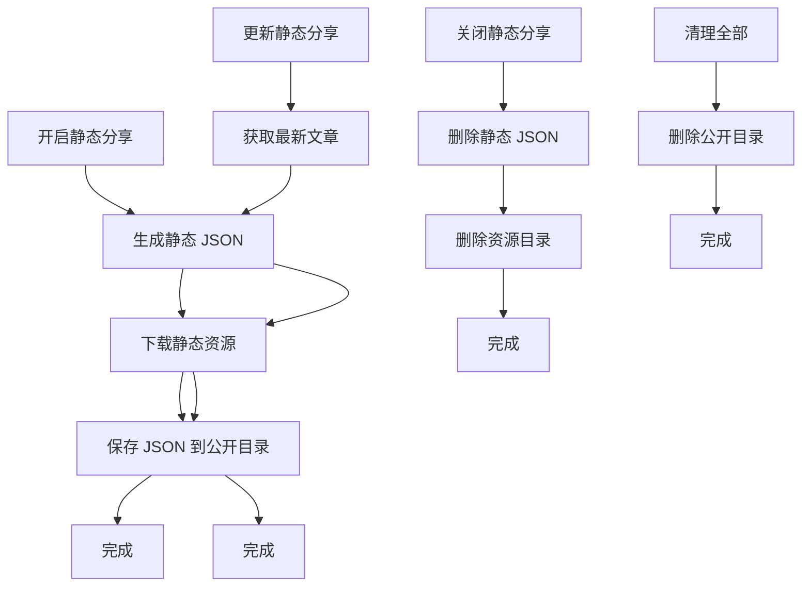
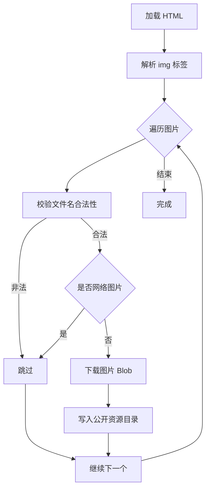
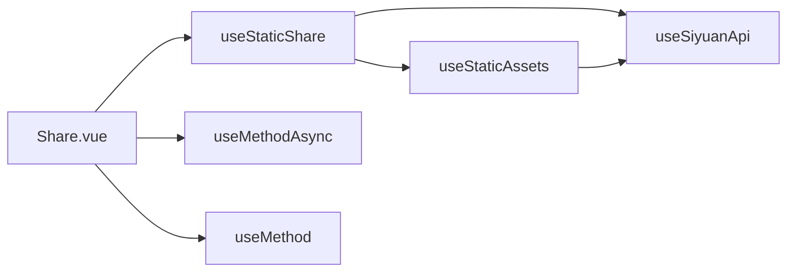

# 批量操作与清理

<cite>
**本文引用的文件**
- [apps/siyuan/src/pages/Share.vue](file://apps/siyuan/src/pages/Share.vue)
- [apps/siyuan/src/composables/useStaticShare.ts](file://apps/siyuan/src/composables/useStaticShare.ts)
- [apps/siyuan/src/composables/useStaticAssets.ts](file://apps/siyuan/src/composables/useStaticAssets.ts)
- [apps/siyuan/src/composables/useSiyuanApi.ts](file://apps/siyuan/src/composables/useSiyuanApi.ts)
- [apps/siyuan/src/composables/useMethodAsync.ts](file://apps/siyuan/src/composables/useMethodAsync.ts)
- [apps/siyuan/src/composables/useMethod.ts](file://apps/siyuan/src/composables/useMethod.ts)
- [apps/siyuan/src/utils/pageUtil.ts](file://apps/siyuan/src/utils/pageUtil.ts)
</cite>

## 目录
1. [引言](#引言)
2. [项目结构](#项目结构)
3. [核心组件](#核心组件)
4. [架构总览](#架构总览)
5. [详细组件分析](#详细组件分析)
6. [依赖关系分析](#依赖关系分析)
7. [性能考量](#性能考量)
8. [故障排查指南](#故障排查指南)
9. [结论](#结论)
10. [附录：使用示例与最佳实践](#附录使用示例与最佳实践)

## 引言
本技术文档聚焦于“批量操作与清理”能力，围绕静态分享页面的批量管理展开，涵盖一键清除所有分享页面、批量状态更新、批量权限重置等场景。文档详细说明清理操作的执行流程（静态分享页面删除、文档属性重置、缓存清理机制），并阐述安全保障措施（用户确认对话框、操作回滚机制、数据完整性保护）。最后提供完整的使用示例，帮助用户在实际场景中安全高效地进行批量管理。

## 项目结构
本功能位于 Siyuan 插件前端应用中，采用 Vue 组合式 API 架构，核心逻辑集中在页面组件与可组合函数中：
- 页面组件负责 UI 交互与用户确认
- 可组合函数封装与 Siyuan Kernel API 的交互
- 静态资源下载与存储由独立模块处理
- 方法包装器提供统一的成功/失败提示与错误处理

图表来源
- [apps/siyuan/src/pages/Share.vue:10-34](file://apps/siyuan/src/pages/Share.vue#L10-L34)
- [apps/siyuan/src/composables/useStaticShare.ts:17-20](file://apps/siyuan/src/composables/useStaticShare.ts#L17-L20)
- [apps/siyuan/src/composables/useStaticAssets.ts:14-16](file://apps/siyuan/src/composables/useStaticAssets.ts#L14-L16)
- [apps/siyuan/src/composables/useSiyuanApi.ts:17-28](file://apps/siyuan/src/composables/useSiyuanApi.ts#L17-L28)
- [apps/siyuan/src/composables/useMethodAsync.ts:16-36](file://apps/siyuan/src/composables/useMethodAsync.ts#L16-L36)
- [apps/siyuan/src/composables/useMethod.ts:16-30](file://apps/siyuan/src/composables/useMethod.ts#L16-L30)

章节来源
- [apps/siyuan/src/pages/Share.vue:10-34](file://apps/siyuan/src/pages/Share.vue#L10-L34)
- [apps/siyuan/src/composables/useStaticShare.ts:17-20](file://apps/siyuan/src/composables/useStaticShare.ts#L17-L20)
- [apps/siyuan/src/composables/useStaticAssets.ts:14-16](file://apps/siyuan/src/composables/useStaticAssets.ts#L14-L16)
- [apps/siyuan/src/composables/useSiyuanApi.ts:17-28](file://apps/siyuan/src/composables/useSiyuanApi.ts#L17-L28)
- [apps/siyuan/src/composables/useMethodAsync.ts:16-36](file://apps/siyuan/src/composables/useMethodAsync.ts#L16-L36)
- [apps/siyuan/src/composables/useMethod.ts:16-30](file://apps/siyuan/src/composables/useMethod.ts#L16-L30)

## 核心组件
- 分享页面组件：负责展示分享开关、复制链接、IP 切换、过期时间设置、首页标记以及一键清理所有分享页面等交互。
- 静态分享管理：封装静态分享的开启、关闭、更新与全量清理。
- 静态资源处理：解析 HTML 中的本地图片资源，下载并写入公开目录，确保静态页面渲染一致。
- Siyuan API 封装：统一封装博客与内核 API，提供文档属性设置与文件系统操作。
- 方法包装器：统一处理异步/同步调用的错误提示与成功反馈。

章节来源
- [apps/siyuan/src/pages/Share.vue:36-119](file://apps/siyuan/src/pages/Share.vue#L36-L119)
- [apps/siyuan/src/composables/useStaticShare.ts:22-93](file://apps/siyuan/src/composables/useStaticShare.ts#L22-L93)
- [apps/siyuan/src/composables/useStaticAssets.ts:18-51](file://apps/siyuan/src/composables/useStaticAssets.ts#L18-L51)
- [apps/siyuan/src/composables/useSiyuanApi.ts:17-28](file://apps/siyuan/src/composables/useSiyuanApi.ts#L17-L28)
- [apps/siyuan/src/composables/useMethodAsync.ts:19-34](file://apps/siyuan/src/composables/useMethodAsync.ts#L19-L34)
- [apps/siyuan/src/composables/useMethod.ts:19-27](file://apps/siyuan/src/composables/useMethod.ts#L19-L27)

## 架构总览
静态分享的生命周期与批量清理涉及以下关键步骤：
- 开启分享：设置文档发布状态与发布时间，生成静态 JSON 与资源目录
- 更新分享：拉取最新文章内容，重新生成静态 JSON 与资源目录
- 关闭分享：移除静态 JSON 与资源目录
- 清理全部：删除公开目录，重置当前文档的发布状态与发布时间

图表来源
- [apps/siyuan/src/pages/Share.vue:204-217](file://apps/siyuan/src/pages/Share.vue#L204-L217)
- [apps/siyuan/src/composables/useStaticShare.ts:89-93](file://apps/siyuan/src/composables/useStaticShare.ts#L89-L93)
- [apps/siyuan/src/composables/useSiyuanApi.ts:20-22](file://apps/siyuan/src/composables/useSiyuanApi.ts#L20-L22)

## 详细组件分析

### 组件一：分享页面组件（Share.vue）
职责与行为
- 展示与控制分享开关、复制链接、IP 切换、过期时间设置、首页标记
- 提供“一键清理所有分享页面”按钮，触发全量清理流程
- 在清理后重置当前文档的发布状态与发布时间，并提示成功

关键实现要点
- 分享开关切换时，通过内核 API 设置文档属性，并按需开启/关闭静态分享
- 过期时间设置时，校验范围并在更新后刷新静态分享
- 一键清理调用静态分享管理模块的清理函数，随后重置当前文档状态

图表来源
- [apps/siyuan/src/pages/Share.vue:204-217](file://apps/siyuan/src/pages/Share.vue#L204-L217)

章节来源
- [apps/siyuan/src/pages/Share.vue:66-119](file://apps/siyuan/src/pages/Share.vue#L66-L119)
- [apps/siyuan/src/pages/Share.vue:183-202](file://apps/siyuan/src/pages/Share.vue#L183-L202)
- [apps/siyuan/src/pages/Share.vue:204-217](file://apps/siyuan/src/pages/Share.vue#L204-L217)

### 组件二：静态分享管理（useStaticShare）
职责与行为
- 开启静态分享：生成静态 JSON 与资源目录
- 更新静态分享：拉取最新文章内容并重新生成
- 关闭静态分享：移除静态 JSON 与资源目录
- 清理全部静态分享：删除公开目录

内部流程
- 生成静态 JSON：仅暴露必要字段，避免泄露敏感信息
- 下载静态资源：解析 HTML 中的本地图片，下载至资源目录
- 文件系统操作：通过内核 API 执行保存与删除

图表来源
- [apps/siyuan/src/composables/useStaticShare.ts:22-38](file://apps/siyuan/src/composables/useStaticShare.ts#L22-L38)
- [apps/siyuan/src/composables/useStaticShare.ts:40-53](file://apps/siyuan/src/composables/useStaticShare.ts#L40-L53)
- [apps/siyuan/src/composables/useStaticShare.ts:89-93](file://apps/siyuan/src/composables/useStaticShare.ts#L89-L93)

章节来源
- [apps/siyuan/src/composables/useStaticShare.ts:22-38](file://apps/siyuan/src/composables/useStaticShare.ts#L22-L38)
- [apps/siyuan/src/composables/useStaticShare.ts:40-53](file://apps/siyuan/src/composables/useStaticShare.ts#L40-L53)
- [apps/siyuan/src/composables/useStaticShare.ts:89-93](file://apps/siyuan/src/composables/useStaticShare.ts#L89-L93)

### 组件三：静态资源处理（useStaticAssets）
职责与行为
- 解析 HTML 中的本地图片资源
- 校验文件名合法性（避免非法字符与保留名）
- 下载图片并写入公开资源目录

图表来源
- [apps/siyuan/src/composables/useStaticAssets.ts:18-51](file://apps/siyuan/src/composables/useStaticAssets.ts#L18-L51)
- [apps/siyuan/src/composables/useStaticAssets.ts:54-83](file://apps/siyuan/src/composables/useStaticAssets.ts#L54-L83)
- [apps/siyuan/src/composables/useStaticAssets.ts:86-94](file://apps/siyuan/src/composables/useStaticAssets.ts#L86-L94)

章节来源
- [apps/siyuan/src/composables/useStaticAssets.ts:18-51](file://apps/siyuan/src/composables/useStaticAssets.ts#L18-L51)
- [apps/siyuan/src/composables/useStaticAssets.ts:54-83](file://apps/siyuan/src/composables/useStaticAssets.ts#L54-L83)
- [apps/siyuan/src/composables/useStaticAssets.ts:86-94](file://apps/siyuan/src/composables/useStaticAssets.ts#L86-L94)

### 组件四：Siyuan API 封装（useSiyuanApi）
职责与行为
- 提供博客 API 与内核 API 实例
- 内核 API 支持设置文档属性与文件系统操作

章节来源
- [apps/siyuan/src/composables/useSiyuanApi.ts:17-28](file://apps/siyuan/src/composables/useSiyuanApi.ts#L17-L28)

### 组件五：方法包装器（useMethodAsync / useMethod）
职责与行为
- 统一捕获异常并提示用户
- 成功时显示成功消息，失败时显示错误消息并抛出异常

章节来源
- [apps/siyuan/src/composables/useMethodAsync.ts:19-34](file://apps/siyuan/src/composables/useMethodAsync.ts#L19-L34)
- [apps/siyuan/src/composables/useMethod.ts:19-27](file://apps/siyuan/src/composables/useMethod.ts#L19-L27)

## 依赖关系分析
- Share.vue 依赖 useStaticShare 与方法包装器，负责 UI 交互与错误提示
- useStaticShare 依赖 useStaticAssets 与 useSiyuanApi，负责静态分享与文件系统操作
- useStaticAssets 依赖 useSiyuanApi，负责资源下载与写入
- pageUtil 与本功能无直接耦合，但可用于页面入口 ID 获取（如需扩展批量选择）

图表来源
- [apps/siyuan/src/pages/Share.vue:10-34](file://apps/siyuan/src/pages/Share.vue#L10-L34)
- [apps/siyuan/src/composables/useStaticShare.ts:17-20](file://apps/siyuan/src/composables/useStaticShare.ts#L17-L20)
- [apps/siyuan/src/composables/useStaticAssets.ts:14-16](file://apps/siyuan/src/composables/useStaticAssets.ts#L14-L16)
- [apps/siyuan/src/composables/useSiyuanApi.ts:17-28](file://apps/siyuan/src/composables/useSiyuanApi.ts#L17-L28)

章节来源
- [apps/siyuan/src/pages/Share.vue:10-34](file://apps/siyuan/src/pages/Share.vue#L10-L34)
- [apps/siyuan/src/composables/useStaticShare.ts:17-20](file://apps/siyuan/src/composables/useStaticShare.ts#L17-L20)
- [apps/siyuan/src/composables/useStaticAssets.ts:14-16](file://apps/siyuan/src/composables/useStaticAssets.ts#L14-L16)
- [apps/siyuan/src/composables/useSiyuanApi.ts:17-28](file://apps/siyuan/src/composables/useSiyuanApi.ts#L17-L28)

## 性能考量
- 静态资源下载：对每张图片发起一次下载请求，建议在批量清理前确保网络稳定，避免频繁重试
- JSON 生成：仅序列化必要字段，减少冗余数据传输与存储
- 文件系统操作：删除公开目录为一次性操作，建议在低峰时段执行，避免影响其他进程
- 错误处理：统一的异常提示有助于快速定位问题，减少无效重试

## 故障排查指南
常见问题与处理
- 清理后页面仍可访问
  - 检查公开目录是否被完全删除
  - 确认内核 API 的文件删除操作返回成功
- 静态图片缺失
  - 校验 HTML 中图片路径是否为本地资源
  - 检查文件名合法性与网络图片过滤逻辑
- 过期时间设置无效
  - 确认数值范围校验通过
  - 检查更新静态分享流程是否执行
- 成功/失败提示异常
  - 检查方法包装器的错误捕获与消息显示逻辑

章节来源
- [apps/siyuan/src/composables/useStaticAssets.ts:30-40](file://apps/siyuan/src/composables/useStaticAssets.ts#L30-L40)
- [apps/siyuan/src/composables/useMethodAsync.ts:26-33](file://apps/siyuan/src/composables/useMethodAsync.ts#L26-L33)
- [apps/siyuan/src/composables/useMethod.ts:20-27](file://apps/siyuan/src/composables/useMethod.ts#L20-L27)

## 结论
本功能通过“一键清理所有分享页面”实现了对静态分享的批量管理，结合静态资源下载与文件系统操作，确保清理后的数据一致性与可恢复性。配合方法包装器的统一错误处理，提升了用户体验与安全性。建议在执行批量清理前做好备份与风险评估，遵循本文提供的最佳实践。

## 附录：使用示例与最佳实践

### 场景一：一键清理所有分享页面
- 步骤
  - 在分享页面点击“一键清理所有分享”
  - 系统删除公开目录并重置当前文档的发布状态与发布时间
  - 显示成功提示
- 注意事项
  - 该操作会删除所有静态分享产物，请谨慎执行
  - 建议在低峰时段执行，避免影响其他进程

章节来源
- [apps/siyuan/src/pages/Share.vue:204-217](file://apps/siyuan/src/pages/Share.vue#L204-L217)
- [apps/siyuan/src/composables/useStaticShare.ts:89-93](file://apps/siyuan/src/composables/useStaticShare.ts#L89-L93)

### 场景二：批量状态更新
- 步骤
  - 逐个设置过期时间或切换分享开关
  - 系统自动更新静态分享与文档属性
- 注意事项
  - 过期时间需在允许范围内
  - 更新后建议预览静态页面确保渲染正常

章节来源
- [apps/siyuan/src/pages/Share.vue:183-202](file://apps/siyuan/src/pages/Share.vue#L183-L202)
- [apps/siyuan/src/composables/useStaticShare.ts:71-74](file://apps/siyuan/src/composables/useStaticShare.ts#L71-L74)

### 场景三：批量权限重置
- 步骤
  - 逐个关闭分享，系统移除静态分享产物
  - 如需批量关闭，可结合“一键清理所有分享”快速清空
- 注意事项
  - 关闭分享会移除静态产物，无法恢复
  - 建议先备份重要数据

章节来源
- [apps/siyuan/src/pages/Share.vue:82-90](file://apps/siyuan/src/pages/Share.vue#L82-L90)
- [apps/siyuan/src/composables/useStaticShare.ts:81-83](file://apps/siyuan/src/composables/useStaticShare.ts#L81-L83)

### 安全保障措施
- 用户确认对话框
  - 当前实现未内置二次确认对话框，建议在调用清理函数前增加确认提示，防止误操作
- 操作回滚机制
  - 当前未提供回滚，建议在清理前备份公开目录，以便出现问题时恢复
- 数据完整性保护
  - 仅暴露必要字段生成静态 JSON，避免敏感信息泄露
  - 校验文件名合法性，过滤网络图片，确保静态资源可用

章节来源
- [apps/siyuan/src/pages/Share.vue:89-103](file://apps/siyuan/src/pages/Share.vue#L89-L103)
- [apps/siyuan/src/composables/useStaticShare.ts:30-37](file://apps/siyuan/src/composables/useStaticShare.ts#L30-L37)
- [apps/siyuan/src/composables/useStaticAssets.ts:30-40](file://apps/siyuan/src/composables/useStaticAssets.ts#L30-L40)