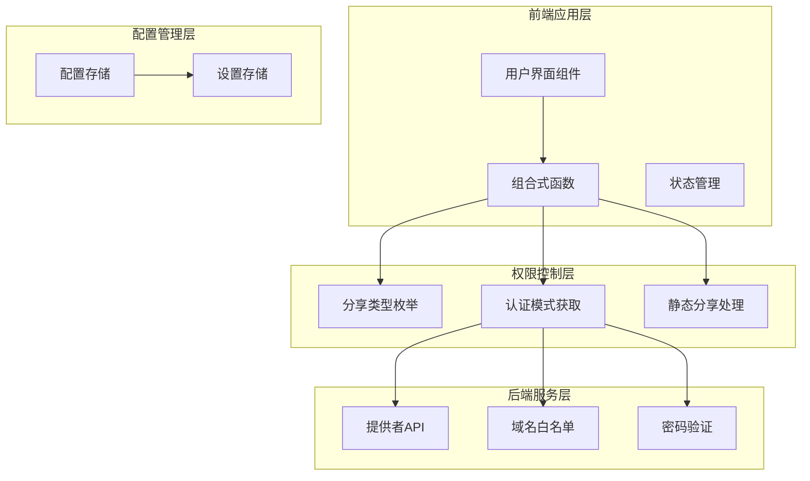
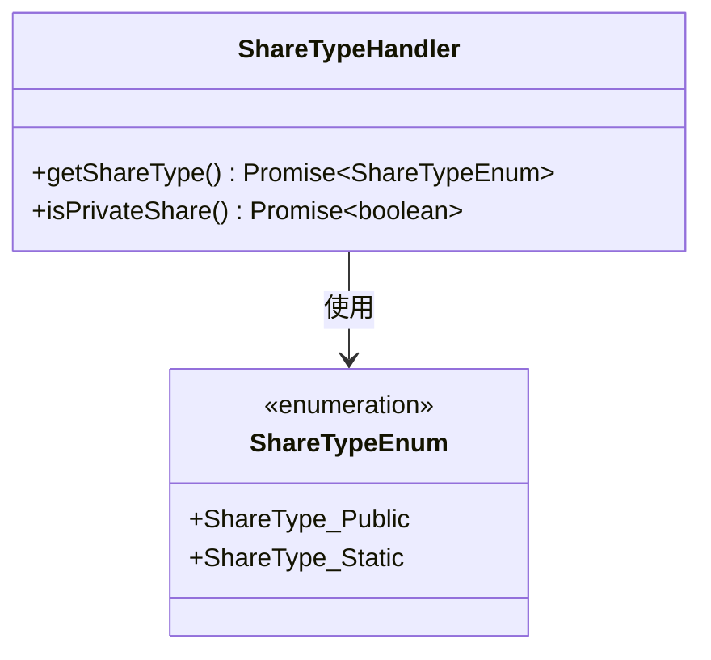
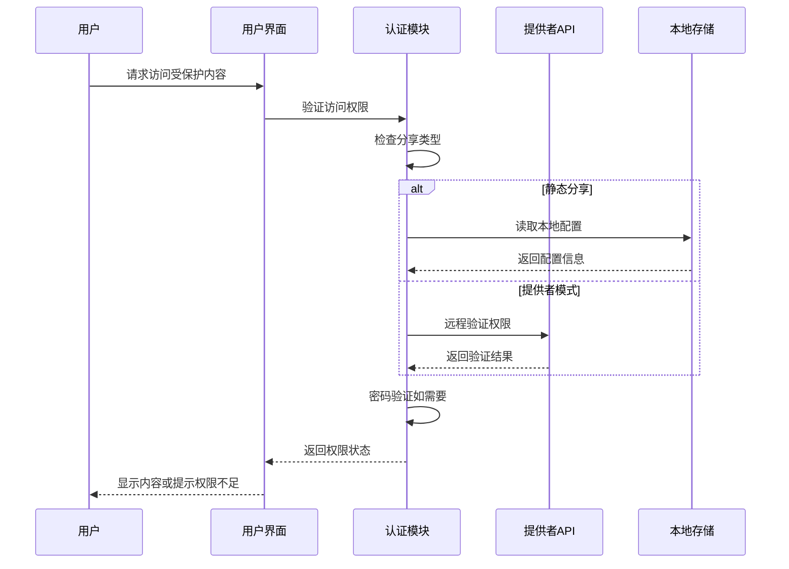
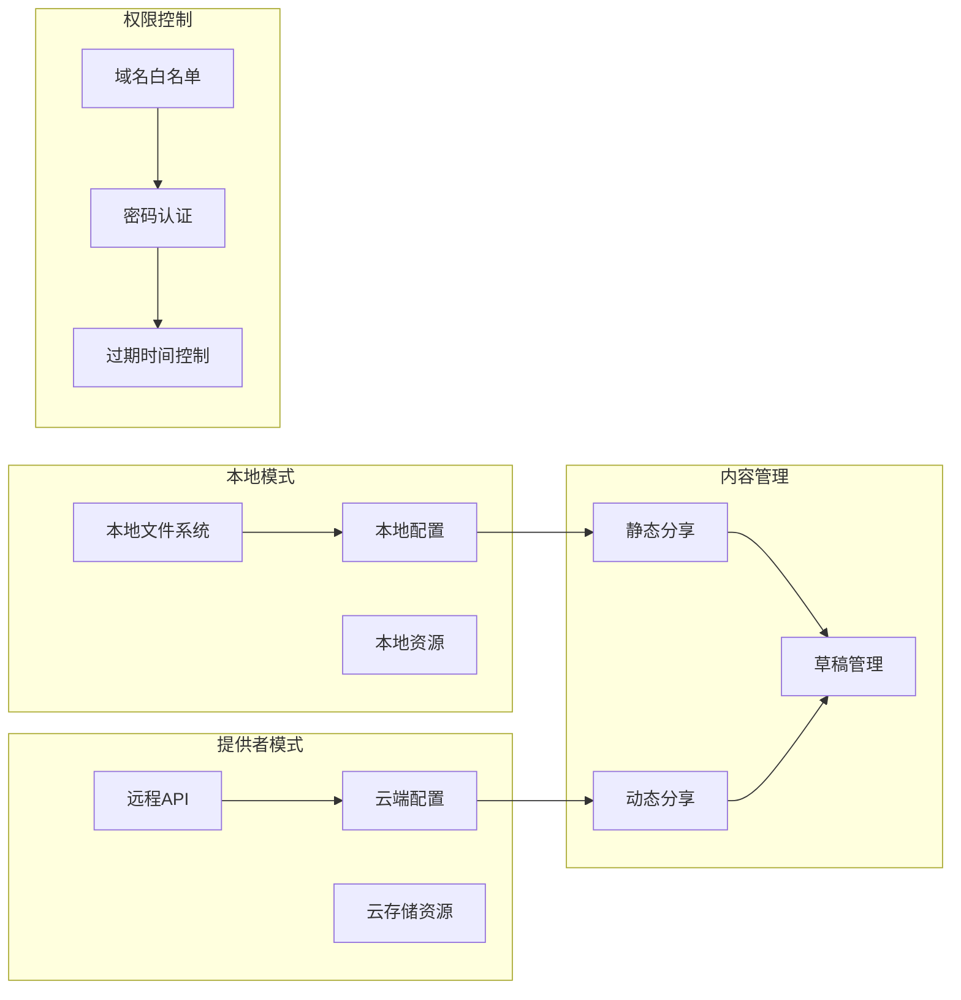
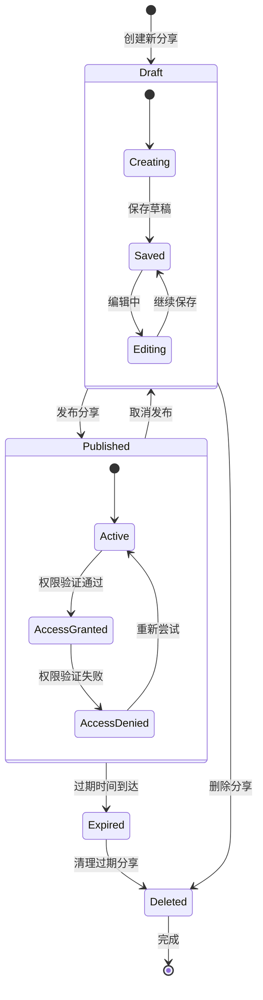
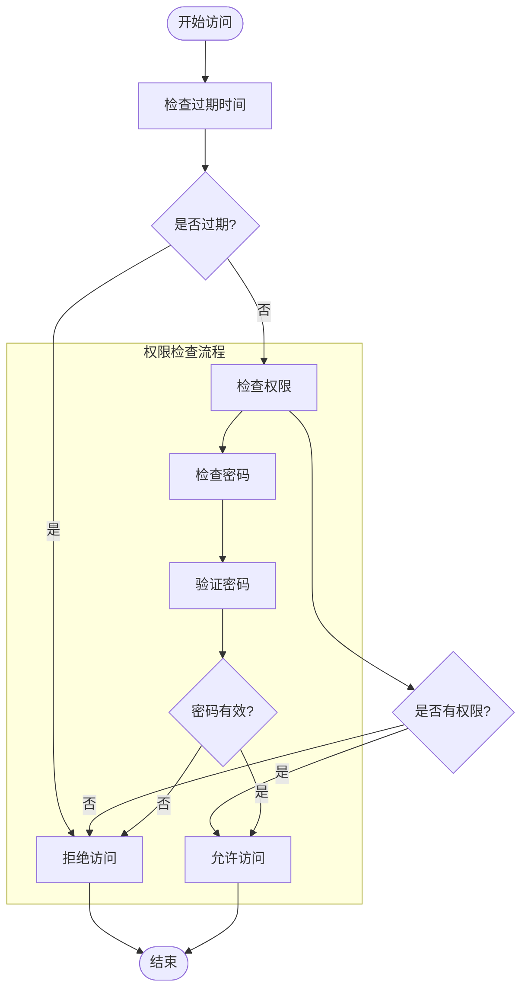
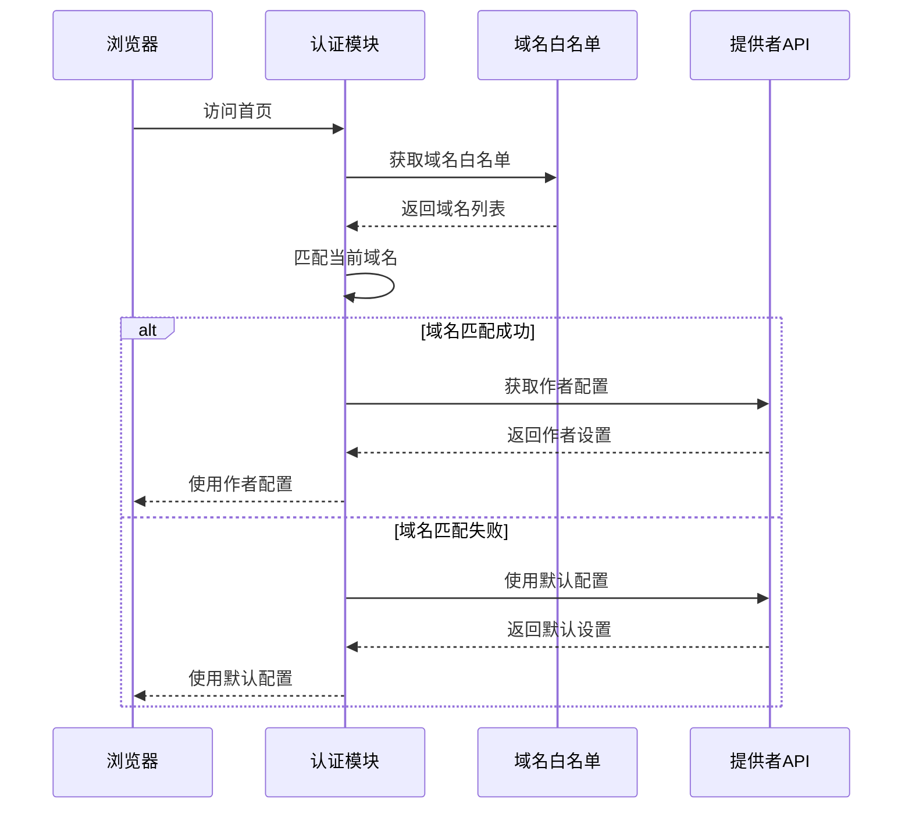
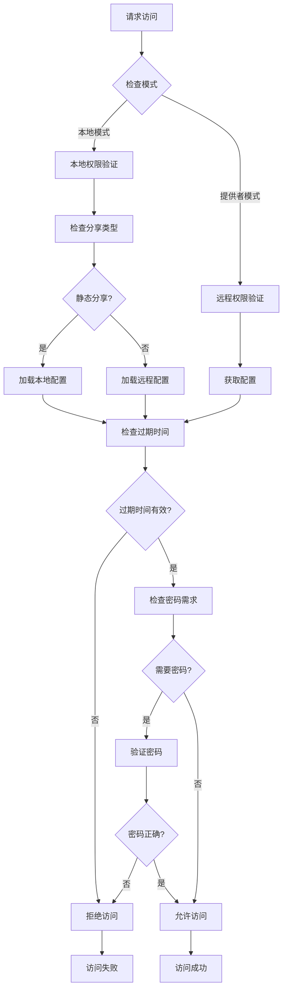
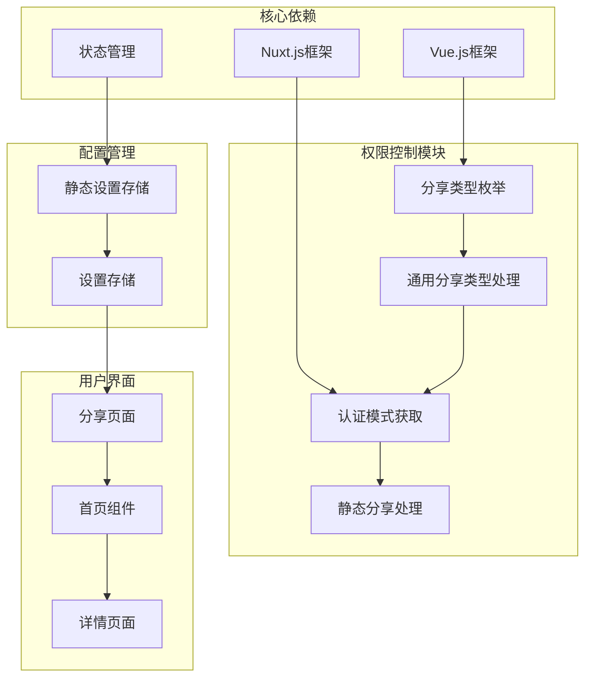

# 访问控制与权限管理

<cite>
**本文档引用的文件**
- [ShareTypeEnum.ts](file://apps/app/enums/ShareTypeEnum.ts)
- [useCommonShareType.ts](file://apps/app/composables/useCommonShareType.ts)
- [useAuthModeFetch.ts](file://apps/app/composables/useAuthModeFetch.ts)
- [useStaticShare.ts](file://apps/siyuan/src/composables/useStaticShare.ts)
- [useStaticSettingStore.ts](file://apps/app/stores/useStaticSettingStore.ts)
- [useSettingStore.ts](file://apps/siyuan/src/stores/useSettingStore.ts)
- [Share.vue](file://apps/siyuan/src/pages/Share.vue)
- [HomePage.vue](file://apps/app/components/public/HomePage.vue)
- [Home.vue](file://apps/app/components/public/Home.vue)
</cite>

## 目录
1. [引言](#引言)
2. [项目结构](#项目结构)
3. [核心组件](#核心组件)
4. [架构概览](#架构概览)
5. [详细组件分析](#详细组件分析)
6. [依赖关系分析](#依赖关系分析)
7. [性能考虑](#性能考虑)
8. [故障排除指南](#故障排除指南)
9. [结论](#结论)

## 引言

本文件为思源笔记博客插件的访问控制与权限管理功能提供详细技术文档。该系统主要围绕分享权限控制展开，包括分享状态管理（发布/草稿）、过期时间控制机制、首页设置功能，以及完整的权限验证流程。

系统采用双模式架构：本地模式和提供者模式。在本地模式下，权限控制基于静态分享文件；在提供者模式下，通过远程API进行权限验证和内容获取。该设计确保了灵活性和安全性，既支持离线访问，又提供了云端管理能力。

## 项目结构

项目采用分层架构设计，权限管理功能分布在多个层次中：

**图表来源**
- [ShareTypeEnum.ts:13-25](file://apps/app/enums/ShareTypeEnum.ts#L13-L25)
- [useAuthModeFetch.ts:15-319](file://apps/app/composables/useAuthModeFetch.ts#L15-L319)
- [useStaticShare.ts:17-97](file://apps/siyuan/src/composables/useStaticShare.ts#L17-L97)

**章节来源**
- [ShareTypeEnum.ts:1-26](file://apps/app/enums/ShareTypeEnum.ts#L1-L26)
- [useAuthModeFetch.ts:1-319](file://apps/app/composables/useAuthModeFetch.ts#L1-L319)
- [useStaticShare.ts:1-97](file://apps/siyuan/src/composables/useStaticShare.ts#L1-L97)

## 核心组件

### 分享类型枚举系统

系统定义了两种分享类型，通过枚举进行统一管理：

**图表来源**
- [ShareTypeEnum.ts:13-25](file://apps/app/enums/ShareTypeEnum.ts#L13-L25)
- [useCommonShareType.ts:12-53](file://apps/app/composables/useCommonShareType.ts#L12-L53)

当前版本中，系统已废弃公共分享类型，仅支持静态分享。这种设计提高了安全性，避免了公开分享可能带来的安全风险。

**章节来源**
- [ShareTypeEnum.ts:10-26](file://apps/app/enums/ShareTypeEnum.ts#L10-L26)
- [useCommonShareType.ts:18-50](file://apps/app/composables/useCommonShareType.ts#L18-L50)

### 权限验证流程

系统实现了多层权限验证机制：

**图表来源**
- [useAuthModeFetch.ts:181-215](file://apps/app/composables/useAuthModeFetch.ts#L181-L215)
- [useStaticShare.ts:62-83](file://apps/siyuan/src/composables/useStaticShare.ts#L62-L83)

**章节来源**
- [useAuthModeFetch.ts:23-215](file://apps/app/composables/useAuthModeFetch.ts#L23-L215)
- [useStaticShare.ts:22-83](file://apps/siyuan/src/composables/useStaticShare.ts#L22-L83)

## 架构概览

系统采用混合架构，结合本地和云端两种模式：

**图表来源**
- [useAuthModeFetch.ts:58-208](file://apps/app/composables/useAuthModeFetch.ts#L58-L208)
- [useStaticShare.ts:22-53](file://apps/siyuan/src/composables/useStaticShare.ts#L22-L53)

## 详细组件分析

### 分享状态管理系统

系统实现了完整的分享状态生命周期管理：

**图表来源**
- [useStaticShare.ts:22-53](file://apps/siyuan/src/composables/useStaticShare.ts#L22-L53)
- [useStaticShare.ts:62-93](file://apps/siyuan/src/composables/useStaticShare.ts#L62-L93)

#### 静态分享处理流程

静态分享是系统的核心功能，负责将文章内容转换为可公开访问的静态文件：

**章节来源**
- [useStaticShare.ts:22-53](file://apps/siyuan/src/composables/useStaticShare.ts#L22-L53)

### 过期时间控制机制

系统提供了灵活的过期时间控制机制：

**图表来源**
- [useAuthModeFetch.ts:260-298](file://apps/app/composables/useAuthModeFetch.ts#L260-L298)

**章节来源**
- [useAuthModeFetch.ts:260-298](file://apps/app/composables/useAuthModeFetch.ts#L260-L298)

### 首页设置功能

首页设置功能支持根据域名白名单自动识别作者信息：

**图表来源**
- [useAuthModeFetch.ts:81-101](file://apps/app/composables/useAuthModeFetch.ts#L81-L101)
- [useAuthModeFetch.ts:181-204](file://apps/app/composables/useAuthModeFetch.ts#L181-L204)

**章节来源**
- [useAuthModeFetch.ts:81-101](file://apps/app/composables/useAuthModeFetch.ts#L81-L101)
- [useAuthModeFetch.ts:181-204](file://apps/app/composables/useAuthModeFetch.ts#L181-L204)

### 权限验证流程详解

系统实现了多层次的权限验证机制：

**图表来源**
- [useAuthModeFetch.ts:181-215](file://apps/app/composables/useAuthModeFetch.ts#L181-L215)
- [useCommonShareType.ts:22-50](file://apps/app/composables/useCommonShareType.ts#L22-L50)

**章节来源**
- [useAuthModeFetch.ts:181-215](file://apps/app/composables/useAuthModeFetch.ts#L181-L215)
- [useCommonShareType.ts:22-50](file://apps/app/composables/useCommonShareType.ts#L22-L50)

## 依赖关系分析

系统各组件之间的依赖关系如下：

**图表来源**
- [ShareTypeEnum.ts:10-26](file://apps/app/enums/ShareTypeEnum.ts#L10-L26)
- [useAuthModeFetch.ts:15-319](file://apps/app/composables/useAuthModeFetch.ts#L15-L319)
- [useStaticSettingStore.ts:10-27](file://apps/app/stores/useStaticSettingStore.ts#L10-L27)

**章节来源**
- [ShareTypeEnum.ts:10-26](file://apps/app/enums/ShareTypeEnum.ts#L10-L26)
- [useAuthModeFetch.ts:15-319](file://apps/app/composables/useAuthModeFetch.ts#L15-L319)
- [useStaticSettingStore.ts:10-27](file://apps/app/stores/useStaticSettingStore.ts#L10-L27)

## 性能考虑

系统在设计时充分考虑了性能优化：

1. **缓存策略**：通过本地存储机制减少重复请求
2. **懒加载**：按需加载分享内容，避免不必要的资源消耗
3. **并发处理**：合理安排API调用顺序，提高响应速度
4. **资源压缩**：对静态资源进行压缩处理

## 故障排除指南

### 常见问题及解决方案

**权限验证失败**
- 检查分享类型配置是否正确
- 验证过期时间设置是否合理
- 确认密码输入是否准确

**内容无法加载**
- 检查网络连接状态
- 验证提供者API配置
- 确认文件路径是否正确

**性能问题**
- 清理本地缓存数据
- 检查资源文件大小
- 优化图片等媒体资源

**章节来源**
- [useAuthModeFetch.ts:52-56](file://apps/app/composables/useAuthModeFetch.ts#L52-L56)
- [useStaticShare.ts:44-53](file://apps/siyuan/src/composables/useStaticShare.ts#L44-L53)

## 结论

该访问控制与权限管理系统通过精心设计的架构，实现了灵活而安全的内容分享功能。系统的主要优势包括：

1. **安全性**：采用静态分享和密码验证双重保障
2. **灵活性**：支持本地和云端两种部署模式
3. **易用性**：提供直观的配置界面和管理功能
4. **可扩展性**：模块化设计便于功能扩展和维护

通过本文档的详细分析，开发者可以更好地理解和使用系统的权限管理功能，为用户提供安全可靠的内容分享体验。