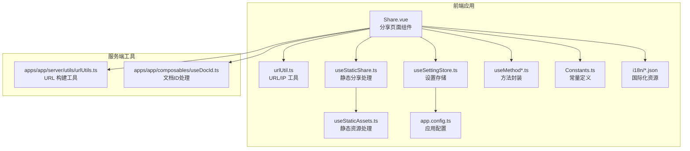
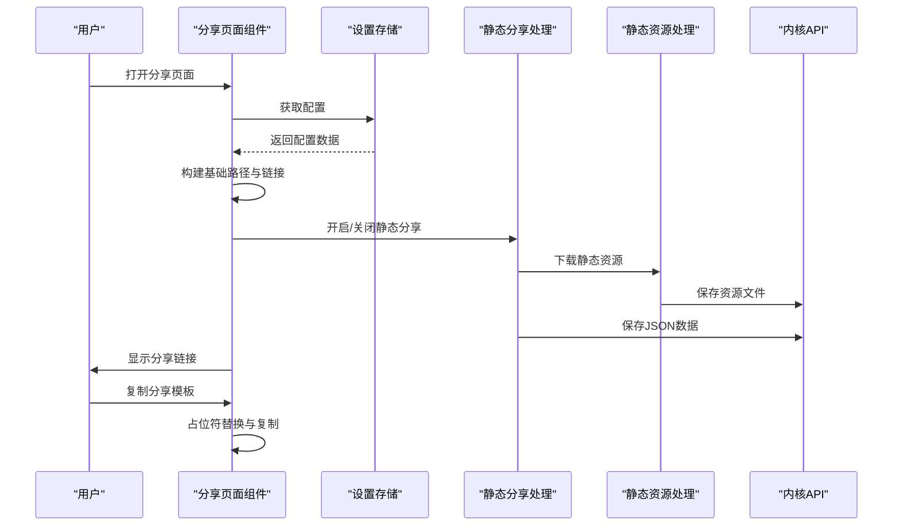
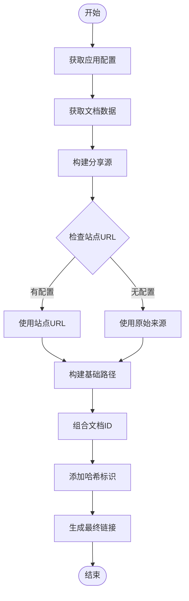
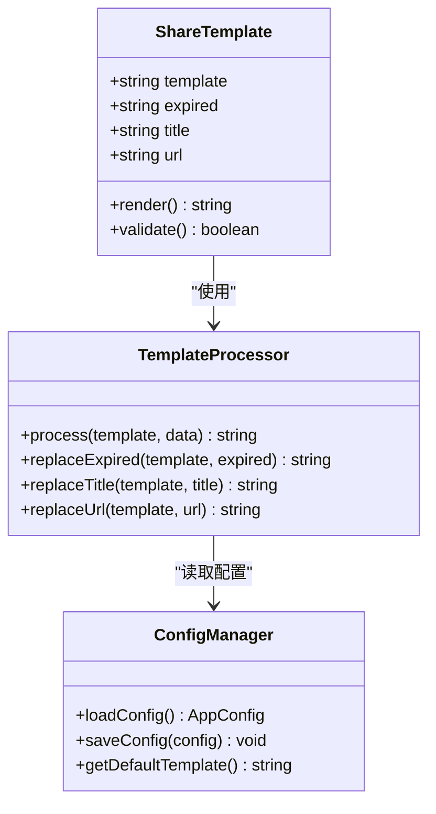
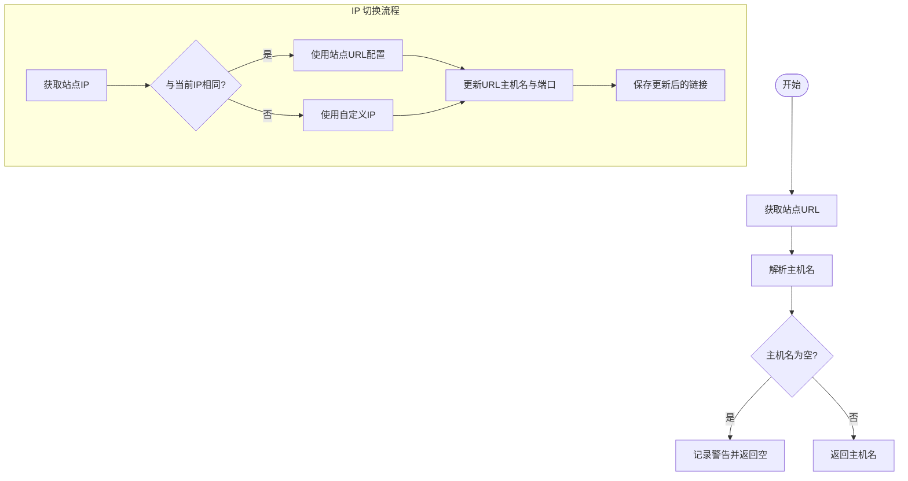
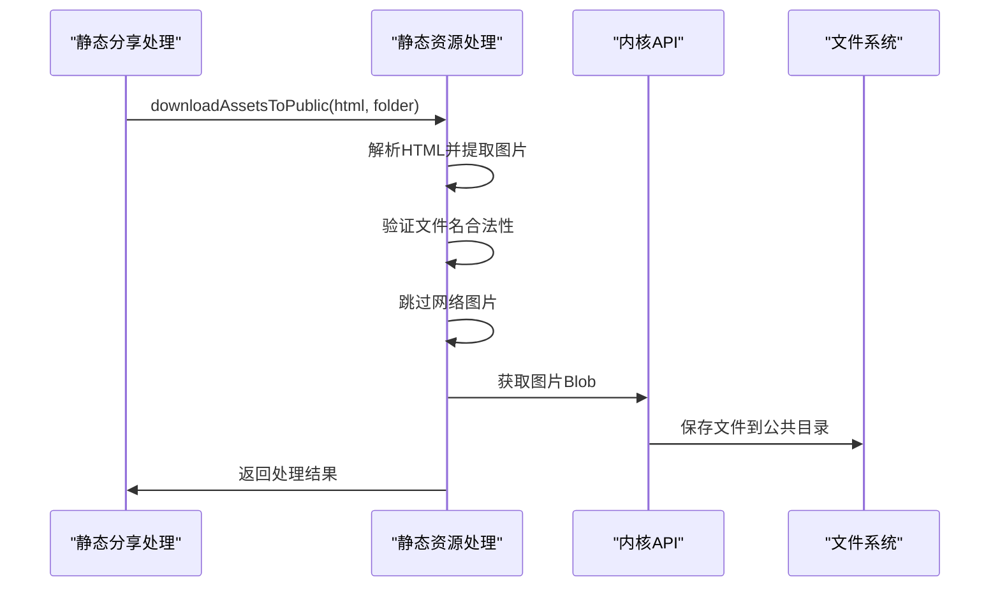
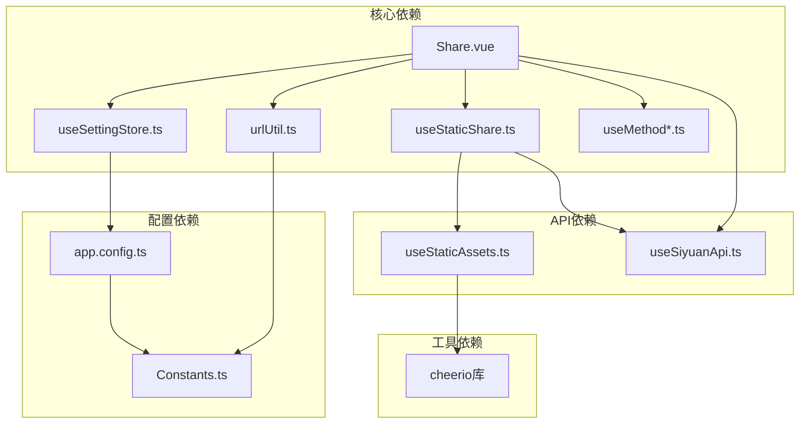

# 链接生成与模板系统

<cite>
**本文档引用的文件**
- [apps/siyuan/src/pages/Share.vue](file://apps/siyuan/src/pages/Share.vue)
- [apps/siyuan/src/utils/urlUtil.ts](file://apps/siyuan/src/utils/urlUtil.ts)
- [apps/siyuan/src/composables/useStaticShare.ts](file://apps/siyuan/src/composables/useStaticShare.ts)
- [apps/siyuan/src/composables/useStaticAssets.ts](file://apps/siyuan/src/composables/useStaticAssets.ts)
- [apps/siyuan/src/app.config.ts](file://apps/siyuan/src/app.config.ts)
- [apps/siyuan/src/stores/useSettingStore.ts](file://apps/siyuan/src/stores/useSettingStore.ts)
- [apps/siyuan/src/composables/useSiyuanApi.ts](file://apps/siyuan/src/composables/useSiyuanApi.ts)
- [apps/siyuan/src/composables/useMethod.ts](file://apps/siyuan/src/composables/useMethod.ts)
- [apps/siyuan/src/composables/useMethodAsync.ts](file://apps/siyuan/src/composables/useMethodAsync.ts)
- [apps/siyuan/src/Constants.ts](file://apps/siyuan/src/Constants.ts)
- [apps/siyuan/src/i18n/zh_CN.json](file://apps/siyuan/src/i18n/zh_CN.json)
- [apps/siyuan/src/i18n/en_US.json](file://apps/siyuan/src/i18n/en_US.json)
- [apps/app/server/utils/urlUtils.ts](file://apps/app/server/utils/urlUtils.ts)
- [apps/app/composables/useDocId.ts](file://apps/app/composables/useDocId.ts)
</cite>

## 目录
1. [简介](#简介)
2. [项目结构](#项目结构)
3. [核心组件](#核心组件)
4. [架构概览](#架构概览)
5. [详细组件分析](#详细组件分析)
6. [依赖关系分析](#依赖关系分析)
7. [性能考虑](#性能考虑)
8. [故障排除指南](#故障排除指南)
9. [结论](#结论)
10. [附录](#附录)

## 简介
本技术文档深入解析 Siyuan 笔记插件中的链接生成与模板系统，涵盖以下关键功能：
- 分享链接的生成机制：基础路径构建（basePath）、文档 ID 组合、URL 参数处理
- 分享模板系统：占位符替换机制（[expired]、[title]、[url]）、模板配置选项、动态内容生成
- IP 地址处理逻辑：本地 IP 检测、远程服务器 IP 配置、动态 IP 切换功能
- 完整使用示例：链接格式化、模板自定义、IP 地址管理的实际应用场景

该系统通过 Vue 组件与服务端工具的协作，实现了从文档到可分享链接的完整流程，并提供了灵活的模板化输出与多 IP 支持。

## 项目结构
链接生成与模板系统主要分布在前端 Vue 应用中，涉及页面组件、工具函数、配置存储与国际化资源：

**图表来源**
- [apps/siyuan/src/pages/Share.vue:1-499](file://apps/siyuan/src/pages/Share.vue#L1-L499)
- [apps/siyuan/src/utils/urlUtil.ts:1-78](file://apps/siyuan/src/utils/urlUtil.ts#L1-L78)
- [apps/siyuan/src/composables/useStaticShare.ts:1-97](file://apps/siyuan/src/composables/useStaticShare.ts#L1-L97)
- [apps/siyuan/src/composables/useStaticAssets.ts:1-97](file://apps/siyuan/src/composables/useStaticAssets.ts#L1-L97)
- [apps/siyuan/src/app.config.ts:1-59](file://apps/siyuan/src/app.config.ts#L1-L59)
- [apps/siyuan/src/stores/useSettingStore.ts:1-80](file://apps/siyuan/src/stores/useSettingStore.ts#L1-L80)
- [apps/siyuan/src/composables/useMethod.ts:1-32](file://apps/siyuan/src/composables/useMethod.ts#L1-L32)
- [apps/siyuan/src/composables/useMethodAsync.ts:1-38](file://apps/siyuan/src/composables/useMethodAsync.ts#L1-L38)
- [apps/siyuan/src/Constants.ts:1-16](file://apps/siyuan/src/Constants.ts#L1-L16)
- [apps/siyuan/src/i18n/zh_CN.json:1-53](file://apps/siyuan/src/i18n/zh_CN.json#L1-L53)
- [apps/siyuan/src/i18n/en_US.json:1-54](file://apps/siyuan/src/i18n/en_US.json#L1-L54)
- [apps/app/server/utils/urlUtils.ts:1-14](file://apps/app/server/utils/urlUtils.ts#L1-L14)
- [apps/app/composables/useDocId.ts:1-28](file://apps/app/composables/useDocId.ts#L1-L28)

**章节来源**
- [apps/siyuan/src/pages/Share.vue:1-499](file://apps/siyuan/src/pages/Share.vue#L1-L499)
- [apps/siyuan/src/utils/urlUtil.ts:1-78](file://apps/siyuan/src/utils/urlUtil.ts#L1-L78)

## 核心组件
本系统的核心由以下组件构成：

### 分享页面组件（Share.vue）
负责链接生成、模板渲染、IP 切换与设置管理：
- 基础路径构建：使用 basePath "/plugins/siyuan-blog/app/#"
- 文档 ID 组合：从路由参数获取并处理 .html/.htm 后缀
- URL 参数处理：组合 shareOrigin 与 basePath 形成最终链接
- 模板渲染：支持 [expired]、[title]、[url] 占位符
- IP 切换：根据站点配置动态调整链接主机名与端口

### URL/IP 工具（urlUtil.ts）
提供本地 IP 检测与可用性判断：
- 本地 IPv4 列表获取：扫描系统网络接口
- IP 去重与过滤：移除 IPv6、本地回环地址
- 可用 IP 选择：优先选择非本地回环地址
- 原始地址获取：基于本地 IP 动态替换 127.0.0.1/localhost

### 静态分享处理（useStaticShare.ts）
实现静态分享的数据持久化：
- 分享页面更新：下载资源到公共目录，保存精简后的文章数据
- 分享页面移除：清理分享数据与附件
- 清理所有分享：批量移除所有静态分享页面

### 设置存储（useSettingStore.ts）
管理应用配置的持久化：
- 配置加载：从公共存储加载初始配置
- 配置更新：支持额外设置数据的合并与保存
- 缓存策略：避免重复加载，提升性能

**章节来源**
- [apps/siyuan/src/pages/Share.vue:36-243](file://apps/siyuan/src/pages/Share.vue#L36-L243)
- [apps/siyuan/src/utils/urlUtil.ts:15-77](file://apps/siyuan/src/utils/urlUtil.ts#L15-L77)
- [apps/siyuan/src/composables/useStaticShare.ts:22-93](file://apps/siyuan/src/composables/useStaticShare.ts#L22-L93)
- [apps/siyuan/src/stores/useSettingStore.ts:28-78](file://apps/siyuan/src/stores/useSettingStore.ts#L28-L78)

## 架构概览
系统采用前后端分离的架构设计，前端负责用户交互与链接生成，后端提供静态资源与数据持久化支持：

**图表来源**
- [apps/siyuan/src/pages/Share.vue:66-119](file://apps/siyuan/src/pages/Share.vue#L66-L119)
- [apps/siyuan/src/composables/useStaticShare.ts:22-53](file://apps/siyuan/src/composables/useStaticShare.ts#L22-L53)
- [apps/siyuan/src/composables/useStaticAssets.ts:18-51](file://apps/siyuan/src/composables/useStaticAssets.ts#L18-L51)

## 详细组件分析

### 链接生成机制
链接生成过程包含多个步骤，确保生成的链接既符合用户期望又具备良好的可访问性：

**图表来源**
- [apps/siyuan/src/pages/Share.vue:219-243](file://apps/siyuan/src/pages/Share.vue#L219-L243)

关键实现要点：
- 基础路径构建：使用固定 basePath "/plugins/siyuan-blog/app/#"
- 文档 ID 处理：自动去除 .html/.htm 后缀，确保 ID 纯净
- URL 组合：通过字符串拼接形成完整的分享链接
- 错误处理：对无效配置进行降级处理，保证系统稳定性

**章节来源**
- [apps/siyuan/src/pages/Share.vue:36-243](file://apps/siyuan/src/pages/Share.vue#L36-L243)

### 模板系统工作原理
模板系统提供了灵活的消息生成能力，支持多种占位符的动态替换：

**图表来源**
- [apps/siyuan/src/pages/Share.vue:121-137](file://apps/siyuan/src/pages/Share.vue#L121-L137)
- [apps/siyuan/src/app.config.ts:39-58](file://apps/siyuan/src/app.config.ts#L39-L58)

模板配置选项：
- 占位符支持：[expired]、[title]、[url]
- 默认模板："[url]"（仅输出链接）
- 自定义模板：通过设置界面配置
- 国际化支持：中英文双语模板说明

占位符替换逻辑：
- [expired]：当过期时间为 0 或空时显示"永久"，否则显示具体数值
- [title]：直接替换为文档标题
- [url]：替换为生成的分享链接

**章节来源**
- [apps/siyuan/src/pages/Share.vue:121-137](file://apps/siyuan/src/pages/Share.vue#L121-L137)
- [apps/siyuan/src/app.config.ts:48-48](file://apps/siyuan/src/app.config.ts#L48-L48)
- [apps/siyuan/src/i18n/zh_CN.json:51-52](file://apps/siyuan/src/i18n/zh_CN.json#L51-L52)
- [apps/siyuan/src/i18n/en_US.json:52-53](file://apps/siyuan/src/i18n/en_US.json#L52-L53)

### IP 地址处理逻辑
系统提供了完善的 IP 地址检测与切换功能，确保链接在不同网络环境下的可用性：

**图表来源**
- [apps/siyuan/src/pages/Share.vue:139-164](file://apps/siyuan/src/pages/Share.vue#L139-L164)
- [apps/siyuan/src/utils/urlUtil.ts:47-77](file://apps/siyuan/src/utils/urlUtil.ts#L47-L77)

IP 处理特性：
- 本地 IP 检测：自动扫描系统网络接口获取 IPv4 地址
- IP 列表管理：去重、过滤、排序，确保唯一性
- 动态 IP 切换：根据用户选择实时更新链接
- 远程服务器支持：支持自定义站点 URL 配置

**章节来源**
- [apps/siyuan/src/pages/Share.vue:139-164](file://apps/siyuan/src/pages/Share.vue#L139-L164)
- [apps/siyuan/src/utils/urlUtil.ts:15-77](file://apps/siyuan/src/utils/urlUtil.ts#L15-L77)

### 静态资源处理
静态分享功能需要处理文档中的静态资源，确保分享页面的完整性：

**图表来源**
- [apps/siyuan/src/composables/useStaticShare.ts:26-28](file://apps/siyuan/src/composables/useStaticShare.ts#L26-L28)
- [apps/siyuan/src/composables/useStaticAssets.ts:18-51](file://apps/siyuan/src/composables/useStaticAssets.ts#L18-L51)

资源处理规则：
- 文件名验证：检查长度、非法字符、保留名称
- 资源过滤：跳过网络图片，仅处理相对路径图片
- 错误处理：记录错误但不影响整体流程
- 存储位置：按文档 ID 创建独立的资源目录

**章节来源**
- [apps/siyuan/src/composables/useStaticShare.ts:22-53](file://apps/siyuan/src/composables/useStaticShare.ts#L22-L53)
- [apps/siyuan/src/composables/useStaticAssets.ts:18-97](file://apps/siyuan/src/composables/useStaticAssets.ts#L18-L97)

## 依赖关系分析
系统各组件之间的依赖关系清晰明确，遵循单一职责原则：

**图表来源**
- [apps/siyuan/src/pages/Share.vue:10-34](file://apps/siyuan/src/pages/Share.vue#L10-L34)
- [apps/siyuan/src/stores/useSettingStore.ts:10-26](file://apps/siyuan/src/stores/useSettingStore.ts#L10-L26)
- [apps/siyuan/src/composables/useStaticShare.ts:10-20](file://apps/siyuan/src/composables/useStaticShare.ts#L10-L20)
- [apps/siyuan/src/composables/useSiyuanApi.ts:10-23](file://apps/siyuan/src/composables/useSiyuanApi.ts#L10-L23)

依赖特点：
- 松耦合设计：各组件通过组合式 API 交互
- 明确边界：每个组件职责单一，便于维护
- 可测试性：依赖注入使单元测试成为可能
- 扩展性：新增功能通过扩展配置或组件实现

**章节来源**
- [apps/siyuan/src/pages/Share.vue:10-34](file://apps/siyuan/src/pages/Share.vue#L10-L34)
- [apps/siyuan/src/stores/useSettingStore.ts:10-79](file://apps/siyuan/src/stores/useSettingStore.ts#L10-L79)

## 性能考虑
系统在设计时充分考虑了性能优化：

### 缓存策略
- 设置缓存：useSettingStore 实现配置缓存，避免重复加载
- 方法包装：useMethod/useMethodAsync 提供统一的错误处理与消息反馈
- 配置持久化：应用配置存储在公共目录，启动时一次性加载

### 异步处理
- 异步 API 调用：所有网络请求采用异步方式，避免阻塞主线程
- 并发控制：静态资源下载使用循环而非并发，减少服务器压力
- 错误隔离：单个资源下载失败不影响整体流程

### 内存管理
- 对象冻结：使用 toRaw 包装避免响应式带来的性能开销
- 及时释放：组件卸载时及时清理事件监听器和定时器

## 故障排除指南
常见问题及解决方案：

### 链接无法访问
1. **IP 地址问题**：检查本地 IP 检测结果，尝试手动选择其他 IP
2. **端口冲突**：确认服务端口未被占用，必要时修改端口配置
3. **防火墙设置**：检查防火墙规则，确保端口开放

### 模板显示异常
1. **占位符未替换**：确认模板中占位符格式正确
2. **数据为空**：检查文档标题、过期时间等数据是否正常
3. **编码问题**：确保模板文本使用 UTF-8 编码

### 静态资源缺失
1. **文件名验证失败**：检查图片文件名是否包含非法字符
2. **网络图片跳过**：确认图片路径为相对路径
3. **权限问题**：检查公共目录写入权限

**章节来源**
- [apps/siyuan/src/pages/Share.vue:183-202](file://apps/siyuan/src/pages/Share.vue#L183-L202)
- [apps/siyuan/src/composables/useStaticAssets.ts:53-83](file://apps/siyuan/src/composables/useStaticAssets.ts#L53-L83)

## 结论
链接生成与模板系统通过精心设计的架构实现了以下目标：
- **可靠性**：完善的错误处理与降级机制确保系统稳定运行
- **灵活性**：可配置的模板系统满足不同场景需求
- **易用性**：直观的用户界面与智能的 IP 管理提升用户体验
- **可维护性**：模块化的组件设计便于后续功能扩展

该系统为 Siyuan 笔记提供了强大的分享能力，既满足个人用户的简单需求，也为复杂场景提供了足够的定制空间。

## 附录

### 使用示例

#### 基础链接生成
1. 打开文档分享页面
2. 系统自动检测可用 IP 地址
3. 生成包含文档 ID 的分享链接
4. 复制链接进行分享

#### 自定义模板配置
1. 在设置中找到"分享模板"选项
2. 输入自定义模板，支持占位符 [title]、[url]、[expired]
3. 保存配置后，复制按钮将使用新模板
4. 示例：`【文章标题】[url]（有效期：[expired]）`

#### IP 地址管理
1. 在分享页面选择"切换IP"
2. 从下拉列表中选择可用的 IP 地址
3. 系统自动更新链接的主机名与端口
4. 适用于局域网访问与远程服务器场景

### 配置参考
- **默认模板**：`[url]`
- **过期时间范围**：0-604800 秒（0 表示永久）
- **IP 列表来源**：本地网络接口 + 用户自定义配置
- **资源存储路径**：`/data/public/siyuan-blog/{docId}/`

**章节来源**
- [apps/siyuan/src/app.config.ts:39-58](file://apps/siyuan/src/app.config.ts#L39-L58)
- [apps/siyuan/src/i18n/zh_CN.json:25-52](file://apps/siyuan/src/i18n/zh_CN.json#L25-L52)
- [apps/siyuan/src/i18n/en_US.json:25-53](file://apps/siyuan/src/i18n/en_US.json#L25-L53)