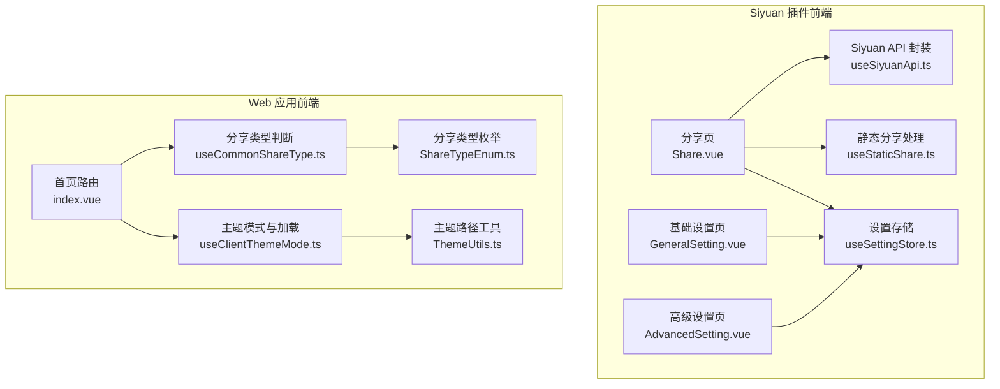
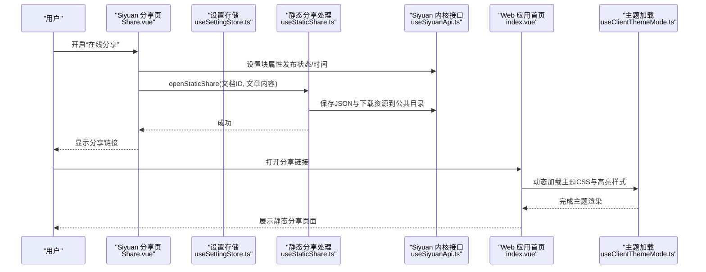
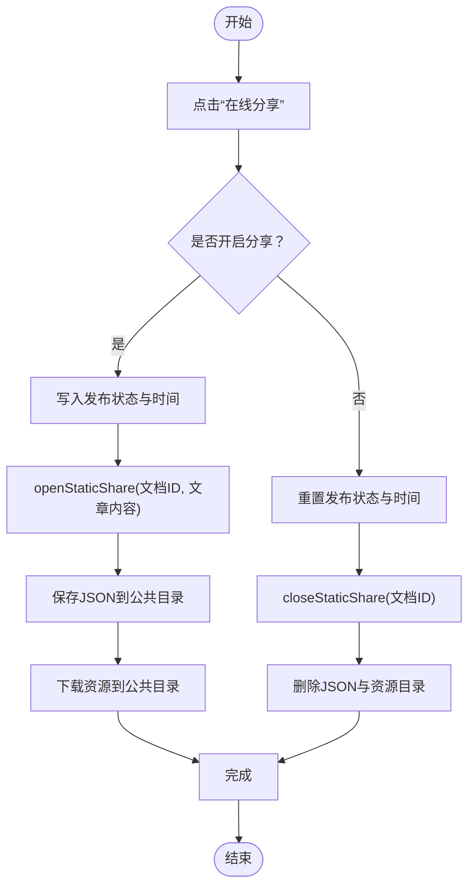
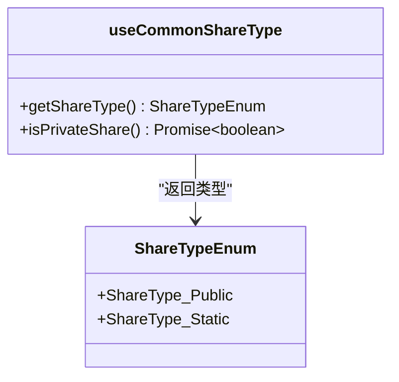
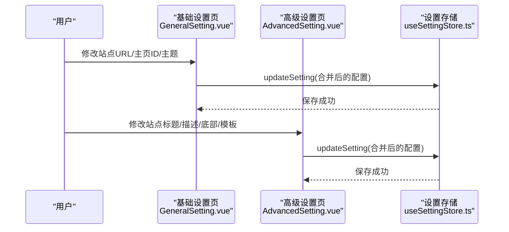
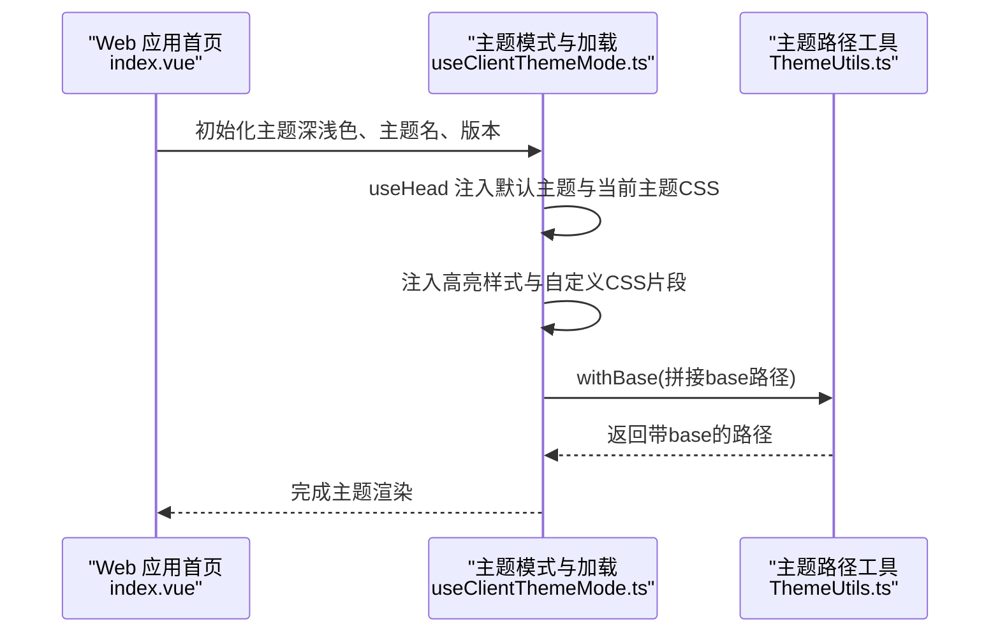
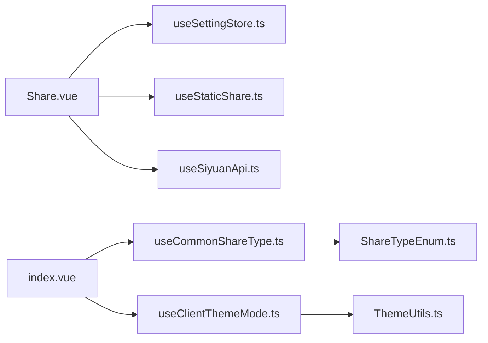

# 核心功能

<cite>
**本文引用的文件**
- [apps/siyuan/src/pages/Share.vue](file://apps/siyuan/src/pages/Share.vue)
- [apps/siyuan/src/stores/useSettingStore.ts](file://apps/siyuan/src/stores/useSettingStore.ts)
- [apps/siyuan/src/composables/useStaticShare.ts](file://apps/siyuan/src/composables/useStaticShare.ts)
- [apps/siyuan/src/composables/useSiyuanApi.ts](file://apps/siyuan/src/composables/useSiyuanApi.ts)
- [apps/siyuan/src/pages/Setting/GeneralSetting.vue](file://apps/siyuan/src/pages/Setting/GeneralSetting.vue)
- [apps/siyuan/src/pages/Setting/AdvancedSetting.vue](file://apps/siyuan/src/pages/Setting/AdvancedSetting.vue)
- [apps/app/pages/index.vue](file://apps/app/pages/index.vue)
- [apps/app/composables/useCommonShareType.ts](file://apps/app/composables/useCommonShareType.ts)
- [apps/app/enums/ShareTypeEnum.ts](file://apps/app/enums/ShareTypeEnum.ts)
- [apps/app/composables/useClientThemeMode.ts](file://apps/app/composables/useClientThemeMode.ts)
- [apps/app/utils/ThemeUtils.ts](file://apps/app/utils/ThemeUtils.ts)
- [apps/siyuan/src/i18n/zh_CN.json](file://apps/siyuan/src/i18n/zh_CN.json)
- [apps/app/i18n/locales/zh_CN.json](file://apps/app/i18n/locales/zh_CN.json)
</cite>

## 目录
1. [引言](#引言)
2. [项目结构](#项目结构)
3. [核心组件](#核心组件)
4. [架构总览](#架构总览)
5. [详细组件分析](#详细组件分析)
6. [依赖关系分析](#依赖关系分析)
7. [性能考量](#性能考量)
8. [故障排查指南](#故障排查指南)
9. [结论](#结论)
10. [附录](#附录)

## 引言
本文件面向 Siyuan Plugin Blog 的使用者与维护者，系统性阐述“内容分享系统”的工作原理与实现细节，覆盖以下关键主题：
- 如何将 Siyuan 笔记转换为可分享的静态网页链接
- 分享类型与权限控制（公开分享、私有静态分享、主页设置、过期时间）
- 设置管理（基础设置、高级配置、多语言支持）
- 主题系统（主题选择、动态加载、深浅色模式）
- 实际使用示例与最佳实践

## 项目结构
本项目采用前后端分离与多应用布局：
- Siyuan 插件前端（Vue 组合式 API + Pinia Store）：负责分享开关、链接生成、设置管理、静态资源落盘与清理
- Web 应用前端（Nuxt/Vue）：负责展示静态分享页面、主题加载、权限判断与页面渲染

图表来源
- [apps/siyuan/src/pages/Share.vue:10-244](file://apps/siyuan/src/pages/Share.vue#L10-L244)
- [apps/siyuan/src/stores/useSettingStore.ts:20-79](file://apps/siyuan/src/stores/useSettingStore.ts#L20-L79)
- [apps/siyuan/src/composables/useStaticShare.ts:17-96](file://apps/siyuan/src/composables/useStaticShare.ts#L17-L96)
- [apps/siyuan/src/composables/useSiyuanApi.ts:17-29](file://apps/siyuan/src/composables/useSiyuanApi.ts#L17-L29)
- [apps/siyuan/src/pages/Setting/GeneralSetting.vue:95-118](file://apps/siyuan/src/pages/Setting/GeneralSetting.vue#L95-L118)
- [apps/siyuan/src/pages/Setting/AdvancedSetting.vue:36-65](file://apps/siyuan/src/pages/Setting/AdvancedSetting.vue#L36-L65)
- [apps/app/pages/index.vue:10-28](file://apps/app/pages/index.vue#L10-L28)
- [apps/app/composables/useCommonShareType.ts:12-53](file://apps/app/composables/useCommonShareType.ts#L12-L53)
- [apps/app/enums/ShareTypeEnum.ts:13-25](file://apps/app/enums/ShareTypeEnum.ts#L13-L25)
- [apps/app/composables/useClientThemeMode.ts:23-97](file://apps/app/composables/useClientThemeMode.ts#L23-L97)
- [apps/app/utils/ThemeUtils.ts:18-35](file://apps/app/utils/ThemeUtils.ts#L18-L35)

章节来源
- [apps/siyuan/src/pages/Share.vue:10-244](file://apps/siyuan/src/pages/Share.vue#L10-L244)
- [apps/app/pages/index.vue:10-28](file://apps/app/pages/index.vue#L10-L28)

## 核心组件
- 分享页组件：负责分享开关、链接生成、IP 切换、过期时间设置、主页设置、一键清空所有分享
- 设置存储：集中读取/更新全局配置（站点 URL、主页 ID、主题、分享模板等），并可注入自定义 CSS
- 静态分享处理：将文章内容与资源落盘至公共目录，生成 JSON 与资产目录；支持更新与清理
- 设置页组件：基础设置（站点 URL、主页 ID、主题）与高级设置（站点标题/副标题/描述、底部信息、分享模板）
- 分享类型判断：统一返回“私有静态分享”类型，确保安全与一致性
- 主题模式与加载：根据深浅色模式与主题参数动态加载主题 CSS 与高亮样式，并支持自定义 CSS 注入

章节来源
- [apps/siyuan/src/pages/Share.vue:30-244](file://apps/siyuan/src/pages/Share.vue#L30-L244)
- [apps/siyuan/src/stores/useSettingStore.ts:20-79](file://apps/siyuan/src/stores/useSettingStore.ts#L20-L79)
- [apps/siyuan/src/composables/useStaticShare.ts:17-96](file://apps/siyuan/src/composables/useStaticShare.ts#L17-L96)
- [apps/siyuan/src/pages/Setting/GeneralSetting.vue:95-118](file://apps/siyuan/src/pages/Setting/GeneralSetting.vue#L95-L118)
- [apps/siyuan/src/pages/Setting/AdvancedSetting.vue:36-65](file://apps/siyuan/src/pages/Setting/AdvancedSetting.vue#L36-L65)
- [apps/app/composables/useCommonShareType.ts:12-53](file://apps/app/composables/useCommonShareType.ts#L12-L53)
- [apps/app/composables/useClientThemeMode.ts:23-97](file://apps/app/composables/useClientThemeMode.ts#L23-L97)

## 架构总览
下图展示了从“笔记分享”到“静态网页访问”的端到端流程。

图表来源
- [apps/siyuan/src/pages/Share.vue:66-119](file://apps/siyuan/src/pages/Share.vue#L66-L119)
- [apps/siyuan/src/composables/useStaticShare.ts:62-83](file://apps/siyuan/src/composables/useStaticShare.ts#L62-L83)
- [apps/siyuan/src/composables/useSiyuanApi.ts:17-29](file://apps/siyuan/src/composables/useSiyuanApi.ts#L17-L29)
- [apps/app/pages/index.vue:17-22](file://apps/app/pages/index.vue#L17-L22)
- [apps/app/composables/useClientThemeMode.ts:57-97](file://apps/app/composables/useClientThemeMode.ts#L57-L97)

## 详细组件分析

### 内容分享系统（从笔记到静态链接）
- 分享开关与属性写入：开启分享时写入发布状态与发布时间；关闭分享时重置状态并删除静态资源
- 静态资源落盘：将文章内容与资源下载到公共目录，仅暴露必要字段并持久化 JSON
- 链接生成与复制：支持模板化复制（支持占位符替换），并可切换 IP 以适配不同网络环境
- 过期时间与主页设置：支持设置链接有效期（秒，上限 7 天），支持设置主页 ID；提供一键清空所有分享

图表来源
- [apps/siyuan/src/pages/Share.vue:66-119](file://apps/siyuan/src/pages/Share.vue#L66-L119)
- [apps/siyuan/src/composables/useStaticShare.ts:62-83](file://apps/siyuan/src/composables/useStaticShare.ts#L62-L83)

章节来源
- [apps/siyuan/src/pages/Share.vue:66-244](file://apps/siyuan/src/pages/Share.vue#L66-L244)
- [apps/siyuan/src/composables/useStaticShare.ts:17-96](file://apps/siyuan/src/composables/useStaticShare.ts#L17-L96)

### 分享类型与权限控制
- 分享类型：统一返回“私有静态分享”，不再支持公共分享模式，确保安全性
- 权限控制：通过“发布状态”与“过期时间”共同决定访问权限；主页设置用于确定入口页面
- 链接模板：支持占位符替换，便于复制分享文案

图表来源
- [apps/app/enums/ShareTypeEnum.ts:13-25](file://apps/app/enums/ShareTypeEnum.ts#L13-L25)
- [apps/app/composables/useCommonShareType.ts:12-53](file://apps/app/composables/useCommonShareType.ts#L12-L53)

章节来源
- [apps/app/enums/ShareTypeEnum.ts:13-25](file://apps/app/enums/ShareTypeEnum.ts#L13-L25)
- [apps/app/composables/useCommonShareType.ts:12-53](file://apps/app/composables/useCommonShareType.ts#L12-L53)

### 设置管理（基础设置、高级配置、多语言）
- 基础设置：站点 URL、主页 ID、浅色/深色主题选择；保存后更新全局配置
- 高级设置：站点标题/副标题/描述、底部信息、分享模板；支持 HTML 与占位符
- 多语言：插件前端与 Web 前端分别提供中文语言包，覆盖分享、设置、主题等模块

图表来源
- [apps/siyuan/src/pages/Setting/GeneralSetting.vue:104-118](file://apps/siyuan/src/pages/Setting/GeneralSetting.vue#L104-L118)
- [apps/siyuan/src/pages/Setting/AdvancedSetting.vue:52-65](file://apps/siyuan/src/pages/Setting/AdvancedSetting.vue#L52-L65)
- [apps/siyuan/src/stores/useSettingStore.ts:50-62](file://apps/siyuan/src/stores/useSettingStore.ts#L50-L62)

章节来源
- [apps/siyuan/src/pages/Setting/GeneralSetting.vue:95-118](file://apps/siyuan/src/pages/Setting/GeneralSetting.vue#L95-L118)
- [apps/siyuan/src/pages/Setting/AdvancedSetting.vue:36-65](file://apps/siyuan/src/pages/Setting/AdvancedSetting.vue#L36-L65)
- [apps/siyuan/src/stores/useSettingStore.ts:20-79](file://apps/siyuan/src/stores/useSettingStore.ts#L20-L79)
- [apps/siyuan/src/i18n/zh_CN.json:1-53](file://apps/siyuan/src/i18n/zh_CN.json#L1-L53)
- [apps/app/i18n/locales/zh_CN.json:1-100](file://apps/app/i18n/locales/zh_CN.json#L1-L100)

### 主题系统（架构与使用）
- 主题加载：根据深浅色模式与主题参数动态加载默认主题与当前主题 CSS，以及高亮样式
- 自定义 CSS：从内核接口拉取启用的 CSS 片段并注入到页面
- 路径工具：提供带 base 的路径拼接能力，确保资源引用正确

图表来源
- [apps/app/pages/index.vue:17-22](file://apps/app/pages/index.vue#L17-L22)
- [apps/app/composables/useClientThemeMode.ts:57-97](file://apps/app/composables/useClientThemeMode.ts#L57-L97)
- [apps/app/utils/ThemeUtils.ts:22-34](file://apps/app/utils/ThemeUtils.ts#L22-L34)

章节来源
- [apps/app/composables/useClientThemeMode.ts:23-157](file://apps/app/composables/useClientThemeMode.ts#L23-L157)
- [apps/app/utils/ThemeUtils.ts:18-35](file://apps/app/utils/ThemeUtils.ts#L18-L35)

## 依赖关系分析
- 分享页依赖设置存储与静态分享处理，二者均通过 Siyuan API 封装访问内核能力
- Web 应用首页根据分享类型判断决定加载静态或公开页面，并通过主题加载器完成样式渲染
- 设置页与主题加载器之间无直接耦合，但共享配置（主题名、版本、自定义 CSS）

图表来源
- [apps/siyuan/src/pages/Share.vue:30-34](file://apps/siyuan/src/pages/Share.vue#L30-L34)
- [apps/siyuan/src/stores/useSettingStore.ts:20-26](file://apps/siyuan/src/stores/useSettingStore.ts#L20-L26)
- [apps/siyuan/src/composables/useStaticShare.ts:17-20](file://apps/siyuan/src/composables/useStaticShare.ts#L17-L20)
- [apps/siyuan/src/composables/useSiyuanApi.ts:17-29](file://apps/siyuan/src/composables/useSiyuanApi.ts#L17-L29)
- [apps/app/pages/index.vue:17-22](file://apps/app/pages/index.vue#L17-L22)
- [apps/app/composables/useCommonShareType.ts:12-16](file://apps/app/composables/useCommonShareType.ts#L12-L16)
- [apps/app/enums/ShareTypeEnum.ts:13-25](file://apps/app/enums/ShareTypeEnum.ts#L13-L25)
- [apps/app/composables/useClientThemeMode.ts:23-27](file://apps/app/composables/useClientThemeMode.ts#L23-L27)
- [apps/app/utils/ThemeUtils.ts:18-24](file://apps/app/utils/ThemeUtils.ts#L18-L24)

章节来源
- [apps/siyuan/src/pages/Share.vue:30-34](file://apps/siyuan/src/pages/Share.vue#L30-L34)
- [apps/app/pages/index.vue:17-22](file://apps/app/pages/index.vue#L17-L22)

## 性能考量
- 静态资源落盘：仅暴露必要字段并持久化 JSON，避免冗余数据传输与渲染压力
- 主题按需加载：默认主题与当前主题分两段加载，减少首屏样式计算
- 自定义 CSS 注入：按需注入，避免全局样式污染
- 过期时间校验：在前端进行范围校验，减少无效请求

## 故障排查指南
- 无法访问分享链接
  - 检查“自定义域名”与“切换IP”设置，确保域名解析与端口正确
  - 若为外网访问，确认“网络伺服”已开启
- 无法看到最新内容
  - 若文档已更新，需重新“开启分享”以刷新静态资源
- 主页未生效
  - 确认主页 ID 对应的文档已开启分享
- 过期时间异常
  - 输入值需为非负整数且不超过 7 天（单位秒），0 表示永久

章节来源
- [apps/siyuan/src/pages/Share.vue:139-202](file://apps/siyuan/src/pages/Share.vue#L139-L202)
- [apps/siyuan/src/pages/Setting/GeneralSetting.vue:95-118](file://apps/siyuan/src/pages/Setting/GeneralSetting.vue#L95-L118)
- [apps/siyuan/src/i18n/zh_CN.json:25-34](file://apps/siyuan/src/i18n/zh_CN.json#L25-L34)

## 结论
Siyuan Plugin Blog 通过“私有静态分享”模式，将 Siyuan 笔记安全地转化为可分享的静态网页。其核心在于：
- 分享页与静态分享处理的协同，确保内容与资源完整落盘
- 设置存储与设置页的解耦设计，便于扩展与维护
- 主题系统的动态加载与自定义 CSS 支持，满足多样化的视觉需求
- 分享类型与权限控制的统一策略，保障安全性与可用性

## 附录
- 使用示例与最佳实践
  - 基础分享：在“分享页”开启“在线分享”，复制链接给他人
  - 自定义域名：在“基础设置”中填写完整地址（含端口），并在“切换IP”中选择对应主机
  - 主题选择：在“基础设置”中选择浅色/深色主题，建议与个人阅读习惯一致
  - 分享模板：在“高级设置”中配置分享文案模板，支持占位符替换
  - 过期控制：为敏感内容设置合理过期时间，到期后需重新开启分享
  - 一键清理：当需要批量回收分享时，使用“清除所有分享”功能