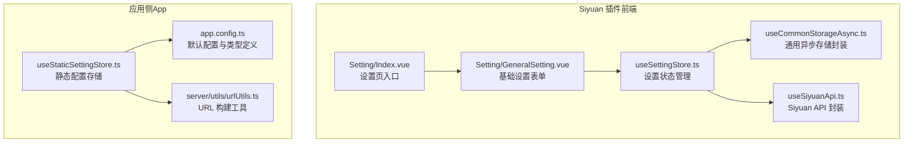
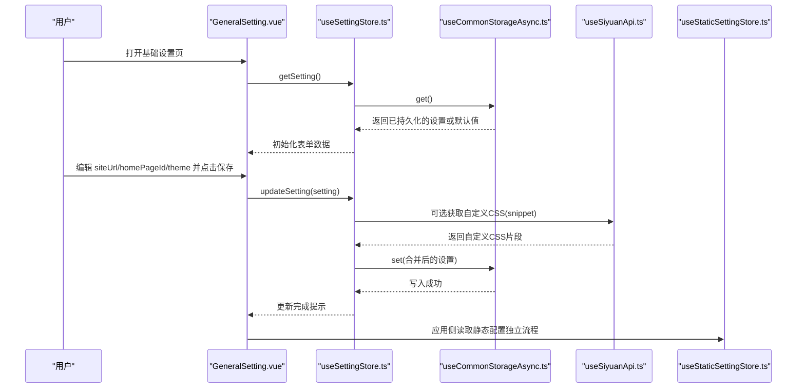
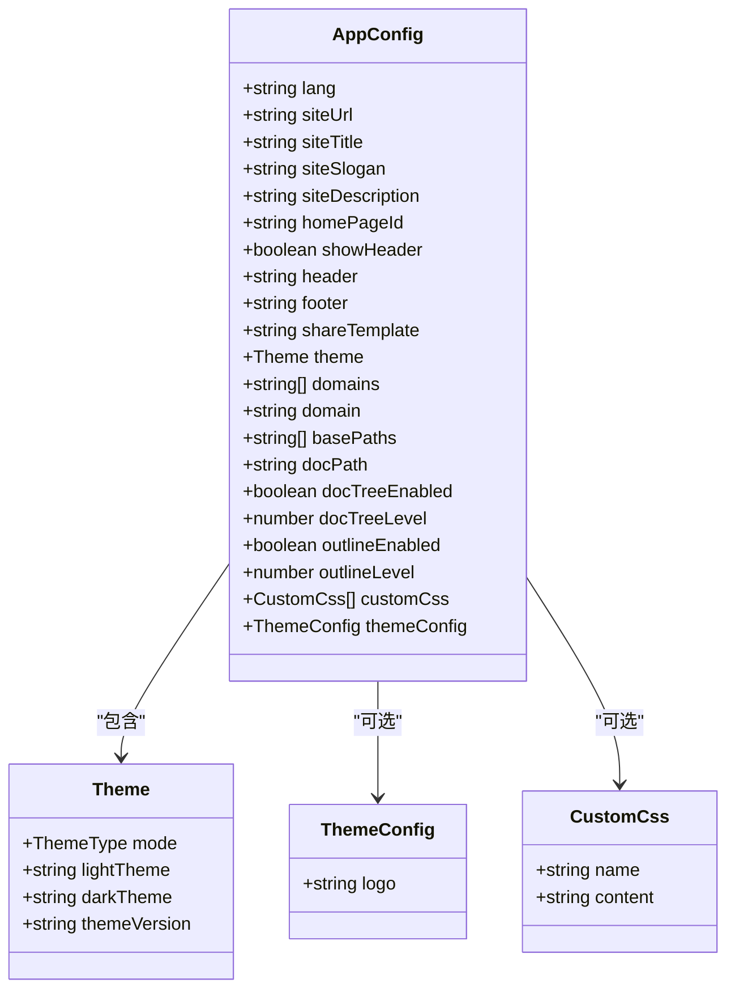
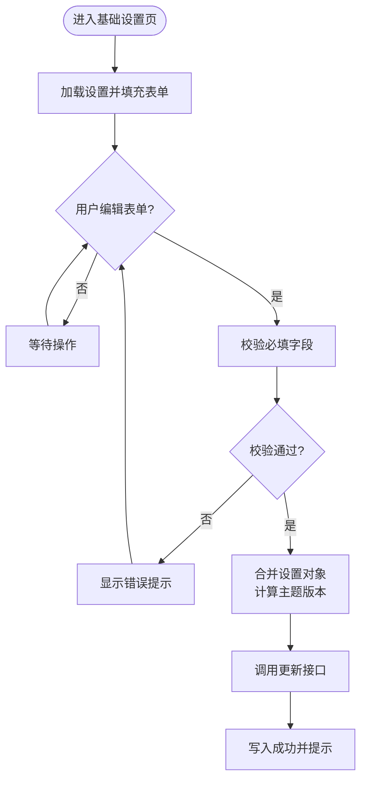
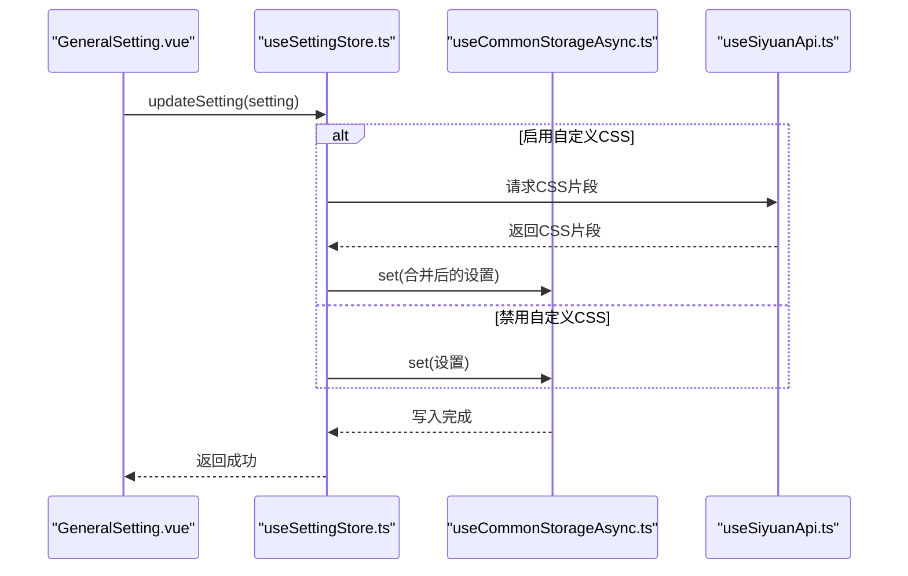
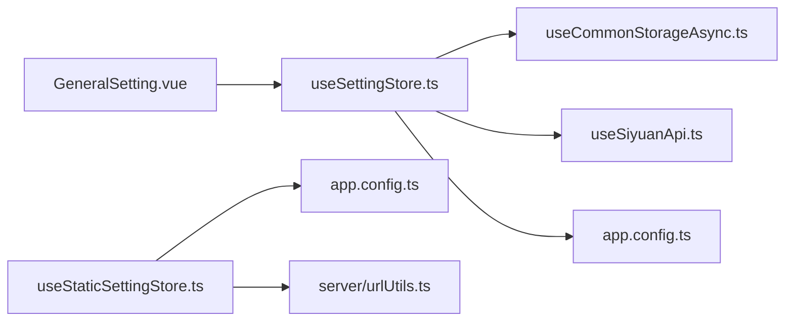

# 基础设置

<cite>
**本文引用的文件**
- [apps/siyuan/src/pages/Setting/Index.vue](file://apps/siyuan/src/pages/Setting/Index.vue)
- [apps/siyuan/src/pages/Setting/GeneralSetting.vue](file://apps/siyuan/src/pages/Setting/GeneralSetting.vue)
- [apps/siyuan/src/stores/useSettingStore.ts](file://apps/siyuan/src/stores/useSettingStore.ts)
- [apps/siyuan/src/stores/common/useCommonStorageAsync.ts](file://apps/siyuan/src/stores/common/useCommonStorageAsync.ts)
- [apps/siyuan/src/composables/useSiyuanApi.ts](file://apps/siyuan/src/composables/useSiyuanApi.ts)
- [apps/siyuan/src/utils/urlUtil.ts](file://apps/siyuan/src/utils/urlUtil.ts)
- [apps/app/stores/useStaticSettingStore.ts](file://apps/app/stores/useStaticSettingStore.ts)
- [apps/app/server/utils/urlUtils.ts](file://apps/app/server/utils/urlUtils.ts)
- [apps/app/app.config.ts](file://apps/app/app.config.ts)
</cite>

## 目录
1. [简介](#简介)
2. [项目结构](#项目结构)
3. [核心组件](#核心组件)
4. [架构总览](#架构总览)
5. [详细组件分析](#详细组件分析)
6. [依赖关系分析](#依赖关系分析)
7. [性能考量](#性能考量)
8. [故障排查指南](#故障排查指南)
9. [结论](#结论)
10. [附录](#附录)

## 简介
本文件围绕“基础设置”功能进行系统化技术文档编写，重点覆盖以下方面：
- 网站 URL 配置（siteUrl）
- 首页 ID 设置（homePageId）
- 主题选择（lightTheme/darkTheme）与版本映射（versionMap）
- 数据结构、验证规则与存储机制
- 设置表单的交互逻辑（数据绑定、表单验证、提交处理）
- 最佳实践与常见配置场景

该功能在 Siyuan 插件环境中通过前端设置页与后端存储机制协同完成，既支持本地持久化，也支持运行时动态加载与更新。

## 项目结构
基础设置涉及前后端两套实现路径：
- 前端设置页：位于 Siyuan 应用侧，提供基础配置的可视化表单与提交能力
- 后端静态配置：由应用侧提供静态 JSON 配置文件，前端通过统一的静态配置存储模块拉取与缓存

图表来源
- [apps/siyuan/src/pages/Setting/Index.vue:1-51](file://apps/siyuan/src/pages/Setting/Index.vue#L1-L51)
- [apps/siyuan/src/pages/Setting/GeneralSetting.vue:1-220](file://apps/siyuan/src/pages/Setting/GeneralSetting.vue#L1-L220)
- [apps/siyuan/src/stores/useSettingStore.ts:1-80](file://apps/siyuan/src/stores/useSettingStore.ts#L1-L80)
- [apps/siyuan/src/stores/common/useCommonStorageAsync.ts:1-91](file://apps/siyuan/src/stores/common/useCommonStorageAsync.ts#L1-L91)
- [apps/siyuan/src/composables/useSiyuanApi.ts:1-30](file://apps/siyuan/src/composables/useSiyuanApi.ts#L1-L30)
- [apps/app/stores/useStaticSettingStore.ts:1-28](file://apps/app/stores/useStaticSettingStore.ts#L1-L28)
- [apps/app/app.config.ts:1-92](file://apps/app/app.config.ts#L1-L92)
- [apps/app/server/utils/urlUtils.ts:1-15](file://apps/app/server/utils/urlUtils.ts#L1-L15)

章节来源
- [apps/siyuan/src/pages/Setting/Index.vue:1-51](file://apps/siyuan/src/pages/Setting/Index.vue#L1-L51)
- [apps/siyuan/src/pages/Setting/GeneralSetting.vue:1-220](file://apps/siyuan/src/pages/Setting/GeneralSetting.vue#L1-L220)
- [apps/siyuan/src/stores/useSettingStore.ts:1-80](file://apps/siyuan/src/stores/useSettingStore.ts#L1-L80)
- [apps/siyuan/src/stores/common/useCommonStorageAsync.ts:1-91](file://apps/siyuan/src/stores/common/useCommonStorageAsync.ts#L1-L91)
- [apps/siyuan/src/composables/useSiyuanApi.ts:1-30](file://apps/siyuan/src/composables/useSiyuanApi.ts#L1-L30)
- [apps/app/stores/useStaticSettingStore.ts:1-28](file://apps/app/stores/useStaticSettingStore.ts#L1-L28)
- [apps/app/app.config.ts:1-92](file://apps/app/app.config.ts#L1-L92)
- [apps/app/server/utils/urlUtils.ts:1-15](file://apps/app/server/utils/urlUtils.ts#L1-L15)

## 核心组件
- 设置页入口与标签页组织：负责承载基础设置与高级设置两个子页，并以垂直标签形式展示
- 基础设置表单：包含站点 URL、首页 ID、浅色/深色主题选择及保存按钮
- 设置状态管理：封装获取与更新设置的逻辑，内置初始值与远程存储交互
- 通用异步存储：基于 VueUse 的异步存储封装，自动序列化/反序列化并处理首次初始化
- Siyuan API 封装：提供与 Siyuan 内核通信的能力，用于获取自定义 CSS 等扩展数据
- 静态配置存储（应用侧）：从静态 JSON 文件拉取配置，解析为应用配置对象
- 默认配置与类型定义：集中声明配置字段、默认值与可选扩展字段

章节来源
- [apps/siyuan/src/pages/Setting/Index.vue:10-36](file://apps/siyuan/src/pages/Setting/Index.vue#L10-L36)
- [apps/siyuan/src/pages/Setting/GeneralSetting.vue:10-119](file://apps/siyuan/src/pages/Setting/GeneralSetting.vue#L10-L119)
- [apps/siyuan/src/stores/useSettingStore.ts:20-79](file://apps/siyuan/src/stores/useSettingStore.ts#L20-L79)
- [apps/siyuan/src/stores/common/useCommonStorageAsync.ts:21-63](file://apps/siyuan/src/stores/common/useCommonStorageAsync.ts#L21-L63)
- [apps/siyuan/src/composables/useSiyuanApi.ts:17-29](file://apps/siyuan/src/composables/useSiyuanApi.ts#L17-L29)
- [apps/app/stores/useStaticSettingStore.ts:10-27](file://apps/app/stores/useStaticSettingStore.ts#L10-L27)
- [apps/app/app.config.ts:28-92](file://apps/app/app.config.ts#L28-L92)

## 架构总览
下图展示了基础设置从前端表单到存储与应用侧静态配置的整体流程：

图表来源
- [apps/siyuan/src/pages/Setting/GeneralSetting.vue:95-118](file://apps/siyuan/src/pages/Setting/GeneralSetting.vue#L95-L118)
- [apps/siyuan/src/stores/useSettingStore.ts:38-76](file://apps/siyuan/src/stores/useSettingStore.ts#L38-L76)
- [apps/siyuan/src/stores/common/useCommonStorageAsync.ts:44-59](file://apps/siyuan/src/stores/common/useCommonStorageAsync.ts#L44-L59)
- [apps/siyuan/src/composables/useSiyuanApi.ts:20-28](file://apps/siyuan/src/composables/useSiyuanApi.ts#L20-L28)
- [apps/app/stores/useStaticSettingStore.ts:18-24](file://apps/app/stores/useStaticSettingStore.ts#L18-L24)

## 详细组件分析

### 数据模型与默认值
- 配置接口定义集中在应用配置文件中，涵盖语言、站点信息、首页 ID、主题模式与主题名称、域名/路径等扩展字段
- 默认配置提供初始值，确保首次访问时无需手动填写
- 支持扩展字段，便于后续功能迭代

图表来源
- [apps/app/app.config.ts:28-72](file://apps/app/app.config.ts#L28-L72)

章节来源
- [apps/app/app.config.ts:28-92](file://apps/app/app.config.ts#L28-L92)

### 设置表单交互逻辑
- 表单字段绑定：通过响应式对象收集 siteUrl、homePageId、lightTheme、darkTheme
- 初始化：在挂载阶段从设置存储读取当前值并填充表单
- 提交处理：将表单数据合并到设置对象，计算主题版本号，调用更新接口并提示结果

图表来源
- [apps/siyuan/src/pages/Setting/GeneralSetting.vue:95-118](file://apps/siyuan/src/pages/Setting/GeneralSetting.vue#L95-L118)

章节来源
- [apps/siyuan/src/pages/Setting/GeneralSetting.vue:25-118](file://apps/siyuan/src/pages/Setting/GeneralSetting.vue#L25-L118)

### 存储机制与持久化
- 设置存储采用异步存储封装，自动判断是否需要写入默认值，并对不同类型的初始值选择合适的序列化器
- 更新设置时，先合并当前内存中的设置对象，再写入存储；若启用自定义 CSS 功能，会额外请求内核获取 CSS 片段并写入设置
- 应用侧提供静态配置存储，从静态 JSON 文件读取配置并解析为应用配置对象

图表来源
- [apps/siyuan/src/stores/useSettingStore.ts:50-76](file://apps/siyuan/src/stores/useSettingStore.ts#L50-L76)
- [apps/siyuan/src/stores/common/useCommonStorageAsync.ts:44-59](file://apps/siyuan/src/stores/common/useCommonStorageAsync.ts#L44-L59)
- [apps/siyuan/src/composables/useSiyuanApi.ts:20-28](file://apps/siyuan/src/composables/useSiyuanApi.ts#L20-L28)

章节来源
- [apps/siyuan/src/stores/useSettingStore.ts:20-79](file://apps/siyuan/src/stores/useSettingStore.ts#L20-L79)
- [apps/siyuan/src/stores/common/useCommonStorageAsync.ts:21-63](file://apps/siyuan/src/stores/common/useCommonStorageAsync.ts#L21-L63)

### 验证规则与边界处理
- URL 规范化：应用侧提供 URL 构建工具，确保基础 URL 末尾无多余斜杠、路径开头无多余斜杠，避免拼接异常
- IP/Origin 探测：在特定设备类型下，可通过网络接口探测可用 IP，并替换本地回环地址，保证外网可访问性
- 主题版本映射：根据所选主题从版本映射表中取值，作为主题版本号写入设置对象
- 初始值与空值处理：异步存储在读取为空时写入默认值，避免后续逻辑出现空引用

章节来源
- [apps/app/server/utils/urlUtils.ts:10-14](file://apps/app/server/utils/urlUtils.ts#L10-L14)
- [apps/siyuan/src/utils/urlUtil.ts:47-77](file://apps/siyuan/src/utils/urlUtil.ts#L47-L77)
- [apps/siyuan/src/pages/Setting/GeneralSetting.vue:84-92](file://apps/siyuan/src/pages/Setting/GeneralSetting.vue#L84-L92)
- [apps/siyuan/src/stores/common/useCommonStorageAsync.ts:44-55](file://apps/siyuan/src/stores/common/useCommonStorageAsync.ts#L44-L55)

## 依赖关系分析
- 前端设置页依赖设置存储与通用异步存储；设置存储进一步依赖 Siyuan API 封装与应用配置类型
- 应用侧静态配置存储依赖静态配置文件与 URL 工具，用于构建最终的配置对象
- 组件间耦合度低，职责清晰：表单负责 UI 与交互，存储负责数据持久化，工具负责辅助计算

图表来源
- [apps/siyuan/src/pages/Setting/GeneralSetting.vue:10-21](file://apps/siyuan/src/pages/Setting/GeneralSetting.vue#L10-L21)
- [apps/siyuan/src/stores/useSettingStore.ts:10-26](file://apps/siyuan/src/stores/useSettingStore.ts#L10-L26)
- [apps/siyuan/src/stores/common/useCommonStorageAsync.ts:10-26](file://apps/siyuan/src/stores/common/useCommonStorageAsync.ts#L10-L26)
- [apps/siyuan/src/composables/useSiyuanApi.ts:10-23](file://apps/siyuan/src/composables/useSiyuanApi.ts#L10-L23)
- [apps/app/stores/useStaticSettingStore.ts:10-24](file://apps/app/stores/useStaticSettingStore.ts#L10-L24)
- [apps/app/server/utils/urlUtils.ts:10-14](file://apps/app/server/utils/urlUtils.ts#L10-L14)
- [apps/app/app.config.ts:74-92](file://apps/app/app.config.ts#L74-L92)

章节来源
- [apps/siyuan/src/pages/Setting/GeneralSetting.vue:10-21](file://apps/siyuan/src/pages/Setting/GeneralSetting.vue#L10-L21)
- [apps/siyuan/src/stores/useSettingStore.ts:10-26](file://apps/siyuan/src/stores/useSettingStore.ts#L10-L26)
- [apps/app/stores/useStaticSettingStore.ts:10-24](file://apps/app/stores/useStaticSettingStore.ts#L10-L24)

## 性能考量
- 首次访问时的初始化成本：异步存储在空值时写入默认值，避免后续重复初始化
- 更新策略：仅在启用自定义 CSS 功能时发起额外请求，其他场景直接写入，降低网络开销
- URL 构建与 IP 探测：仅在需要时执行，避免频繁 IO 操作
- 建议：对频繁变更的设置项采用节流/防抖策略，减少不必要的写入

## 故障排查指南
- 设置无法持久化
  - 检查异步存储是否成功写入，确认序列化器类型匹配
  - 确认存储键名一致且权限允许
- 主题版本号异常
  - 核对版本映射表中是否存在对应主题键
  - 若缺失，需补充映射或回退默认版本
- URL 拼接错误
  - 使用 URL 构建工具规范化基础 URL 与路径
  - 在多网卡环境下检查本地 IP 替换逻辑
- 自定义 CSS 未生效
  - 确认内核 API 请求成功返回片段
  - 检查片段内容是否为空或格式异常

章节来源
- [apps/siyuan/src/stores/common/useCommonStorageAsync.ts:44-59](file://apps/siyuan/src/stores/common/useCommonStorageAsync.ts#L44-L59)
- [apps/siyuan/src/pages/Setting/GeneralSetting.vue:104-118](file://apps/siyuan/src/pages/Setting/GeneralSetting.vue#L104-L118)
- [apps/app/server/utils/urlUtils.ts:10-14](file://apps/app/server/utils/urlUtils.ts#L10-L14)
- [apps/siyuan/src/utils/urlUtil.ts:68-77](file://apps/siyuan/src/utils/urlUtil.ts#L68-L77)
- [apps/siyuan/src/stores/useSettingStore.ts:64-76](file://apps/siyuan/src/stores/useSettingStore.ts#L64-L76)

## 结论
基础设置功能通过清晰的分层设计实现了“表单交互—状态管理—持久化—应用侧静态配置”的闭环。其数据模型以强类型接口约束，配合默认值与版本映射，兼顾易用性与扩展性。建议在生产环境中结合实际部署环境完善 URL 规范化与网络探测策略，并对敏感配置项增加必要的输入校验与安全检查。

## 附录

### 常见配置场景示例
- 单机部署（本地回环）
  - 将 siteUrl 设为本地回环地址，结合 IP 探测工具自动替换为可用局域网 IP
- 多域名/多路径发布
  - 使用 domains/basePaths 等扩展字段配置多入口，按需启用文档树与大纲功能
- 主题定制
  - 选择浅色/深色主题并维护版本映射，确保主题资源与版本一致

章节来源
- [apps/siyuan/src/utils/urlUtil.ts:47-77](file://apps/siyuan/src/utils/urlUtil.ts#L47-L77)
- [apps/siyuan/src/pages/Setting/GeneralSetting.vue:84-92](file://apps/siyuan/src/pages/Setting/GeneralSetting.vue#L84-L92)
- [apps/app/app.config.ts:49-68](file://apps/app/app.config.ts#L49-L68)