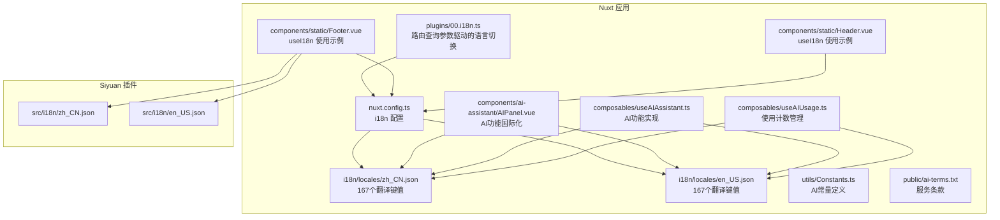
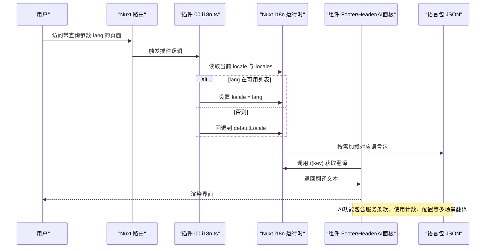
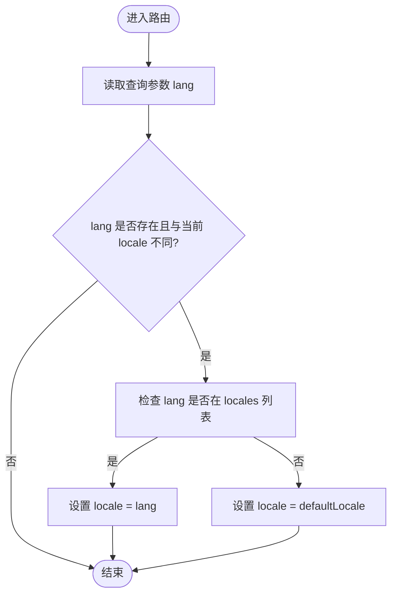
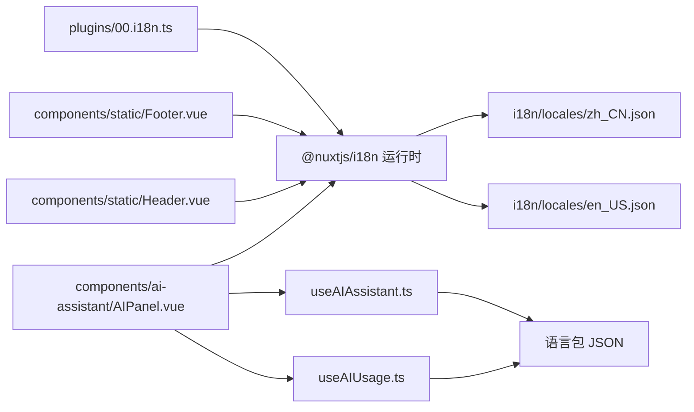

# 多语言支持

<cite>
**本文引用的文件**
- [apps/app/i18n/locales/zh_CN.json](file://apps/app/i18n/locales/zh_CN.json)
- [apps/app/i18n/locales/en_US.json](file://apps/app/i18n/locales/en_US.json)
- [apps/siyuan/src/i18n/zh_CN.json](file://apps/siyuan/src/i18n/zh_CN.json)
- [apps/siyuan/src/i18n/en_US.json](file://apps/siyuan/src/i18n/en_US.json)
- [apps/app/plugins/00.i18n.ts](file://apps/app/plugins/00.i18n.ts)
- [apps/app/nuxt.config.ts](file://apps/app/nuxt.config.ts)
- [apps/app/components/static/Footer.vue](file://apps/app/components/static/Footer.vue)
- [apps/app/components/static/Header.vue](file://apps/app/components/static/Header.vue)
- [apps/app/components/ai-assistant/AIPanel.vue](file://apps/app/components/ai-assistant/AIPanel.vue)
- [apps/app/composables/useAIAssistant.ts](file://apps/app/composables/useAIAssistant.ts)
- [apps/app/composables/useAIUsage.ts](file://apps/app/composables/useAIUsage.ts)
- [apps/app/utils/Constants.ts](file://apps/app/utils/Constants.ts)
- [apps/app/public/ai-terms.txt](file://apps/app/public/ai-terms.txt)
</cite>

## 更新摘要
**变更内容**
- 新增大量AI相关翻译内容，包括服务条款、使用限制、配置选项等
- 扩展AI助手功能的国际化支持，涵盖速读、问答、自由对话等场景
- 新增AI使用计数和模式切换的翻译键值
- 完善AI服务条款确认对话框的多语言支持

## 目录
1. [引言](#引言)
2. [项目结构](#项目结构)
3. [核心组件](#核心组件)
4. [架构总览](#架构总览)
5. [详细组件分析](#详细组件分析)
6. [AI功能国际化](#ai功能国际化)
7. [依赖分析](#依赖分析)
8. [性能考虑](#性能考虑)
9. [故障排查指南](#故障排查指南)
10. [结论](#结论)
11. [附录](#附录)

## 引言
本文件面向多语言支持功能，系统性梳理该项目在 Nuxt 应用与 Siyuan 插件两套运行环境下的国际化实现机制。内容涵盖语言包结构、翻译键值管理、动态语言切换、资源加载与缓存策略、性能优化建议以及最佳实践与常见问题处理方案。特别关注新增的AI功能国际化支持，包括服务条款、使用限制、配置选项等关键场景。

## 项目结构
项目在两个子应用中分别实现了国际化：
- Nuxt 应用（apps/app）：通过 Nuxt 的 @nuxtjs/i18n 模块进行配置与运行时切换，语言包位于 apps/app/i18n/locales 下，包含丰富的AI功能翻译内容。
- Siyuan 插件（apps/siyuan）：独立的语言包位于 apps/siyuan/src/i18n，用于插件内的文案与交互。

**图表来源**
- [apps/app/nuxt.config.ts:25-33](file://apps/app/nuxt.config.ts#L25-L33)
- [apps/app/plugins/00.i18n.ts:16-27](file://apps/app/plugins/00.i18n.ts#L16-L27)
- [apps/app/i18n/locales/zh_CN.json:1-167](file://apps/app/i18n/locales/zh_CN.json#L1-L167)
- [apps/app/i18n/locales/en_US.json:1-167](file://apps/app/i18n/locales/en_US.json#L1-L167)
- [apps/app/components/ai-assistant/AIPanel.vue:1-800](file://apps/app/components/ai-assistant/AIPanel.vue#L1-L800)
- [apps/app/composables/useAIAssistant.ts:1-488](file://apps/app/composables/useAIAssistant.ts#L1-L488)
- [apps/app/composables/useAIUsage.ts:1-115](file://apps/app/composables/useAIUsage.ts#L1-L115)
- [apps/app/utils/Constants.ts:18-29](file://apps/app/utils/Constants.ts#L18-L29)
- [apps/app/public/ai-terms.txt:1-19](file://apps/app/public/ai-terms.txt#L1-L19)

**章节来源**
- [apps/app/nuxt.config.ts:25-33](file://apps/app/nuxt.config.ts#L25-L33)
- [apps/app/plugins/00.i18n.ts:16-27](file://apps/app/plugins/00.i18n.ts#L16-L27)
- [apps/app/i18n/locales/zh_CN.json:1-167](file://apps/app/i18n/locales/zh_CN.json#L1-L167)
- [apps/app/i18n/locales/en_US.json:1-167](file://apps/app/i18n/locales/en_US.json#L1-L167)
- [apps/siyuan/src/i18n/zh_CN.json:1-53](file://apps/siyuan/src/i18n/zh_CN.json#L1-L53)
- [apps/siyuan/src/i18n/en_US.json:1-54](file://apps/siyuan/src/i18n/en_US.json#L1-L54)

## 核心组件
- 国际化配置（Nuxt）
  - 默认语言与可用语言列表、策略与浏览器语言检测开关均在 Nuxt 配置中集中声明，便于统一管理与扩展。
  - 关键字段：defaultLocale、locales、strategy、detectBrowserLanguage。
- 动态语言切换插件
  - 依据路由查询参数 lang 实时切换语言，若目标语言不在可用列表，则回退到默认语言。
- 组件中的语言使用
  - Footer 与 Header 等组件通过 useI18n 获取 t 与 locale，实现文案渲染与语言设置。
- 语言包结构
  - Nuxt 应用与 Siyuan 插件各自维护独立的 JSON 语言包，键名遵循统一命名规范，便于检索与替换。
- **新增** AI功能国际化
  - AI助手面板、使用计数管理、服务条款确认等功能的完整多语言支持。
  - 包含速读、问答、自由对话、配置选项等场景的翻译键值。

**章节来源**
- [apps/app/nuxt.config.ts:25-33](file://apps/app/nuxt.config.ts#L25-L33)
- [apps/app/plugins/00.i18n.ts:16-27](file://apps/app/plugins/00.i18n.ts#L16-L27)
- [apps/app/components/static/Footer.vue:21-69](file://apps/app/components/static/Footer.vue#L21-L69)
- [apps/app/components/static/Header.vue:10-29](file://apps/app/components/static/Header.vue#L10-L29)
- [apps/app/i18n/locales/zh_CN.json:99-167](file://apps/app/i18n/locales/zh_CN.json#L99-L167)
- [apps/app/i18n/locales/en_US.json:99-167](file://apps/app/i18n/locales/en_US.json#L99-L167)

## 架构总览
下图展示从路由到语言包加载与组件渲染的全链路，包括新增的AI功能国际化：

**图表来源**
- [apps/app/plugins/00.i18n.ts:16-27](file://apps/app/plugins/00.i18n.ts#L16-L27)
- [apps/app/nuxt.config.ts:25-33](file://apps/app/nuxt.config.ts#L25-L33)
- [apps/app/i18n/locales/zh_CN.json:1-167](file://apps/app/i18n/locales/zh_CN.json#L1-L167)
- [apps/app/i18n/locales/en_US.json:1-167](file://apps/app/i18n/locales/en_US.json#L1-L167)
- [apps/app/components/static/Footer.vue:21-84](file://apps/app/components/static/Footer.vue#L21-L84)
- [apps/app/components/ai-assistant/AIPanel.vue:200-250](file://apps/app/components/ai-assistant/AIPanel.vue#L200-L250)

## 详细组件分析

### Nuxt 国际化配置与策略
- 配置要点
  - defaultLocale：默认语言代码。
  - locales：语言列表，包含 code、name、file 字段，file 对应语言包文件名。
  - strategy：no_prefix 表示同一语言路径不加前缀，利于 SEO 与直连。
  - detectBrowserLanguage：关闭自动检测，避免与路由参数冲突。
- 扩展新语言
  - 在 locales 中新增一项，指定 code、name、file。
  - 在 i18n/locales 目录添加对应 JSON 文件，键名保持一致。
  - 如需保留浏览器语言检测，可开启 detectBrowserLanguage 并配合其他策略。

**章节来源**
- [apps/app/nuxt.config.ts:25-33](file://apps/app/nuxt.config.ts#L25-L33)

### 动态语言切换插件（路由参数驱动）
- 行为流程
  - 读取当前路由查询参数 lang。
  - 若 lang 存在且与当前 locale 不同：
    - 若 lang 属于 locales 列表，切换至该语言；
    - 否则回退到 defaultLocale。
- 容错与健壮性
  - 未匹配时回退默认语言，避免无效语言导致的渲染异常。
- 适用场景
  - 支持通过 URL 参数快速切换语言，便于测试与分享。

**图表来源**
- [apps/app/plugins/00.i18n.ts:16-27](file://apps/app/plugins/00.i18n.ts#L16-L27)

**章节来源**
- [apps/app/plugins/00.i18n.ts:16-27](file://apps/app/plugins/00.i18n.ts#L16-L27)

### 组件中的语言使用（Footer 与 Header）
- Footer
  - 在生命周期中可根据传入的设置对象覆盖默认语言。
  - 使用 t(key) 渲染多语言文案，如"名称""回到首页""关于"等。
- Header
  - 通过 useI18n 获取 t，用于站点标题与导航文案渲染。
- 最佳实践
  - 在组件初始化阶段优先读取外部传参以确定初始语言。
  - 使用 t(key) 时确保 key 在对应语言包中存在，避免渲染空白。

**章节来源**
- [apps/app/components/static/Footer.vue:21-84](file://apps/app/components/static/Footer.vue#L21-L84)
- [apps/app/components/static/Header.vue:10-29](file://apps/app/components/static/Header.vue#L10-L29)

### 语言包结构与键值管理
- 结构规范
  - JSON 键名为点分层级的标识，如 "share.to.web""setting.basic.homePageId""ai.assistant.config"，便于分组与检索。
  - 值为对应语言的文案字符串。
- 键值一致性
  - Nuxt 应用与 Siyuan 插件各自维护独立语言包，但建议在跨应用共享文案时约定统一键名，减少重复与歧义。
- 维护建议
  - 采用"按模块分组"的命名方式，如 "share." "setting." "blog." "ai."，提升可读性与可维护性。
  - 提供一份键名清单或映射表，便于翻译人员核对与校验。

**章节来源**
- [apps/app/i18n/locales/zh_CN.json:1-167](file://apps/app/i18n/locales/zh_CN.json#L1-L167)
- [apps/app/i18n/locales/en_US.json:1-167](file://apps/app/i18n/locales/en_US.json#L1-L167)
- [apps/siyuan/src/i18n/zh_CN.json:1-53](file://apps/siyuan/src/i18n/zh_CN.json#L1-L53)
- [apps/siyuan/src/i18n/en_US.json:1-54](file://apps/siyuan/src/i18n/en_US.json#L1-L54)

### 中英文双语支持配置方法
- Nuxt 应用
  - 在 locales 中配置 zh_CN 与 en_US，确保 file 指向正确的 JSON 文件。
  - 通过路由参数 lang 实现即时切换。
- Siyuan 插件
  - 在 src/i18n 目录下提供 zh_CN.json 与 en_US.json。
  - 组件中通过 useI18n 获取 t 与 locale，渲染对应语言文案。

**章节来源**
- [apps/app/nuxt.config.ts:25-33](file://apps/app/nuxt.config.ts#L25-L33)
- [apps/siyuan/src/i18n/zh_CN.json:1-53](file://apps/siyuan/src/i18n/zh_CN.json#L1-L53)
- [apps/siyuan/src/i18n/en_US.json:1-54](file://apps/siyuan/src/i18n/en_US.json#L1-L54)

### 扩展新语言的步骤
- 在 Nuxt 应用
  - 在 nuxt.config.ts 的 locales 中新增语言项（code、name、file）。
  - 在 apps/app/i18n/locales 添加对应 JSON 文件，键名与现有语言保持一致。
- 在 Siyuan 插件
  - 在 apps/siyuan/src/i18n 添加对应 JSON 文件。
- 验证
  - 通过访问带 lang 参数的 URL 测试切换效果。
  - 在组件中调用 t(key) 校验文案渲染。

**章节来源**
- [apps/app/nuxt.config.ts:25-33](file://apps/app/nuxt.config.ts#L25-L33)
- [apps/app/i18n/locales/zh_CN.json:1-167](file://apps/app/i18n/locales/zh_CN.json#L1-L167)
- [apps/app/i18n/locales/en_US.json:1-167](file://apps/app/i18n/locales/en_US.json#L1-L167)
- [apps/siyuan/src/i18n/zh_CN.json:1-53](file://apps/siyuan/src/i18n/zh_CN.json#L1-L53)
- [apps/siyuan/src/i18n/en_US.json:1-54](file://apps/siyuan/src/i18n/en_US.json#L1-L54)

## AI功能国际化

### AI服务条款与使用限制
- 服务条款确认
  - terms.title：AI服务须知/AI Service Notice
  - terms.body：详细的使用条款说明，包含数据处理、结果说明、服务说明、免责声明
  - terms.confirm：同意并继续/Agree & Continue
  - terms.cancel：取消/Cancel
- 使用限制提示
  - usage.remaining：今日剩余 {count} 次/{count} uses left today
  - usage.exhausted：今日次数已用完/Daily limit reached
  - usage.switch.hint：明日再试或切换至自定义配置/Try again tomorrow or switch to custom mode
  - usage.limited：（每日限次）/(daily limit)
  - usage.builtin.tooltip：内置模式使用系统资源，每日限 {limit} 次/Built-in mode uses system resources, limited to {limit} times per day
  - usage.custom.tooltip：自定义模式使用您的 API Key，无次数限制/Custom mode uses your own API Key, no usage limits
  - usage.custom.unlimited：自定义模式 · 无限畅用/Custom Mode · Unlimited

### AI配置选项国际化
- 配置标题与说明
  - config.title：AI配置/AI Configuration
  - config.mode：AI模式/AI Mode
  - config.mode.builtin：内置/Built-in
  - config.mode.custom：自定义/Custom
  - config.mode.builtin.hint：使用系统AI · {limit}次/Use system AI · {limit} uses per day
  - config.mode.custom.hint：使用您的API Key · 无限畅用/Use your API Key · Unlimited
  - config.baseurl：API Base URL/API Base URL
  - config.apikey：API Key/API Key
  - config.model：模型/Model
  - config.required：*/*

### AI功能场景翻译
- 速读功能
  - summary.btn：AI速读/AI Summary
  - summary.btn.title：智能提取摘要与要点，助您快速把握文档精髓/AI extracts summary and key points to help you quickly understand the document
  - summary.panel.title：AI速读/AI Summary
  - summary.loading：正在为您解读文档.../AI is reading the document...
  - summary.retry：重新尝试/Retry
  - summary.regenerate：重新生成/Regenerate
  - summary.empty：点击"AI速读"，快速掌握文档核心内容/Click "AI Summary" to get a quick overview
  - summary.start.btn：开始速读/Start
  - summary.section.summary：核心摘要/Summary
  - summary.section.keypoints：关键要点/Key Points
  - summary.section.thinking：延伸思考/Food for Thought
  - summary.thinking.answer.show：查看参考答案/View reference answer
  - summary.thinking.answer.hide：收起答案/Hide answer
  - summary.terms.title：AI速读服务须知/AI Summary Service Notice
  - summary.terms.body：本功能将文档内容发送至AI服务进行分析，生成摘要、要点及延伸思考/This feature sends document content to an AI service for analysis to generate summaries, key points, and follow-up questions
  - summary.terms.confirm：同意并继续/Agree & Continue
  - summary.terms.cancel：取消/Cancel

- 问答功能
  - qa.loading：正在生成问答.../Generating Q&A...
  - qa.empty：点击"提出问题"，获取文档相关问答/Click "Ask a Question" to generate Q&A about this document
  - qa.retry：重新尝试/Retry
  - qa.regenerate：重新生成问答/Regenerate Q&A
  - qa.section.title：文档问答/Document Q&A

- AI助手功能
  - assistant.title：AI助手 · 阅读助手/AI Assistant
  - assistant.tab：AI/AI
  - assistant.btn：AI/AI
  - assistant.btn.title：AI助手 - 速读、问答、自由对话/AI Assistant - Speed read, Q&A, and chat
  - assistant.speedread：速读本文/Speed Read
  - assistant.speedread.again：再次速读/Read Again
  - assistant.ask：提出问题/Ask a Question
  - assistant.config：配置/Config
  - assistant.config.title：AI配置/AI Configuration

- 错误处理
  - error.empty.content：文档内容为空/Document content is empty
  - error.empty.message：请输入您的问题/Please enter a message
  - error.generate.failed：生成失败，请重试/Generation failed, please retry
  - error.format.invalid：AI返回格式异常，请重试/AI returned invalid format, please retry
  - error.send.failed：发送失败，请重试/Send failed, please retry
  - error.network：网络连接失败，请检查网络/Network request failed
  - error.empty.ai.response：AI返回为空/AI returned empty response

- 聊天功能
  - chat.title：自由对话/Free Chat
  - chat.placeholder：请输入您的问题.../Type your question...
  - chat.send：发送/Send
  - chat.welcome：您好！我是您的 AI 阅读助手，随时为您解答关于这篇文档的任何疑问/Hi! I'm your AI reading assistant. Ask me anything about this document.
  - chat.clear：清空对话/Clear conversation
  - chat.error.empty：请输入您的问题/Please enter your question
  - chat.error.usage：今日次数已用完，请明日再试/Daily usage limit reached. Please try again tomorrow

**章节来源**
- [apps/app/i18n/locales/zh_CN.json:99-167](file://apps/app/i18n/locales/zh_CN.json#L99-L167)
- [apps/app/i18n/locales/en_US.json:99-167](file://apps/app/i18n/locales/en_US.json#L99-L167)
- [apps/app/components/ai-assistant/AIPanel.vue:200-250](file://apps/app/components/ai-assistant/AIPanel.vue#L200-L250)
- [apps/app/composables/useAIAssistant.ts:82-194](file://apps/app/composables/useAIAssistant.ts#L82-L194)
- [apps/app/composables/useAIUsage.ts:62-114](file://apps/app/composables/useAIUsage.ts#L62-L114)
- [apps/app/utils/Constants.ts:18-29](file://apps/app/utils/Constants.ts#L18-L29)
- [apps/app/public/ai-terms.txt:1-19](file://apps/app/public/ai-terms.txt#L1-L19)

## 依赖分析
- 模块耦合
  - 插件 00.i18n.ts 依赖 Nuxt i18n 运行时与路由；组件依赖 useI18n。
  - 语言包作为纯 JSON 资源被 i18n 模块按需加载。
  - **新增** AI功能依赖语言包中的翻译键值，包括服务条款、使用计数、配置选项等。
- 外部依赖
  - @nuxtjs/i18n：提供国际化配置与运行时能力。
  - vue-i18n：提供 useI18n 组合式 API。
  - **新增** Element Plus：AI面板中的图标和UI组件。
- 潜在风险
  - 语言包缺失键值会导致渲染空白，需建立键名清单与自动化校验。
  - 路由参数与浏览器语言检测策略需明确，避免冲突。
  - **新增** AI功能的翻译键值缺失可能导致AI服务条款确认、使用计数显示等问题。

**图表来源**
- [apps/app/plugins/00.i18n.ts:16-27](file://apps/app/plugins/00.i18n.ts#L16-L27)
- [apps/app/nuxt.config.ts:25-33](file://apps/app/nuxt.config.ts#L25-L33)
- [apps/app/i18n/locales/zh_CN.json:1-167](file://apps/app/i18n/locales/zh_CN.json#L1-L167)
- [apps/app/i18n/locales/en_US.json:1-167](file://apps/app/i18n/locales/en_US.json#L1-L167)
- [apps/app/components/static/Footer.vue:21-84](file://apps/app/components/static/Footer.vue#L21-L84)
- [apps/app/components/static/Header.vue:10-29](file://apps/app/components/static/Header.vue#L10-L29)
- [apps/app/components/ai-assistant/AIPanel.vue:22-25](file://apps/app/components/ai-assistant/AIPanel.vue#L22-L25)
- [apps/app/composables/useAIAssistant.ts:22-25](file://apps/app/composables/useAIAssistant.ts#L22-L25)
- [apps/app/composables/useAIUsage.ts:9](file://apps/app/composables/useAIUsage.ts#L9)

**章节来源**
- [apps/app/plugins/00.i18n.ts:16-27](file://apps/app/plugins/00.i18n.ts#L16-L27)
- [apps/app/nuxt.config.ts:25-33](file://apps/app/nuxt.config.ts#L25-L33)
- [apps/app/components/static/Footer.vue:21-84](file://apps/app/components/static/Footer.vue#L21-L84)
- [apps/app/components/static/Header.vue:10-29](file://apps/app/components/static/Header.vue#L10-L29)
- [apps/app/components/ai-assistant/AIPanel.vue:22-25](file://apps/app/components/ai-assistant/AIPanel.vue#L22-L25)
- [apps/app/composables/useAIAssistant.ts:22-25](file://apps/app/composables/useAIAssistant.ts#L22-L25)
- [apps/app/composables/useAIUsage.ts:9](file://apps/app/composables/useAIUsage.ts#L9)

## 性能考虑
- 按需加载
  - i18n 模块会按需加载对应语言包，避免一次性加载全部语言资源，降低首屏体积。
  - **新增** AI功能的翻译键值按需加载，不会影响其他功能的性能。
- 缓存策略
  - 建议在构建产物中加入版本号或哈希，结合 CDN 与浏览器缓存，减少重复下载。
  - **新增** AI使用计数和配置信息存储在localStorage中，避免每次刷新都重新计算。
- 渲染优化
  - 在组件中尽量复用 t(key) 的结果，避免频繁计算。
  - 对高频文案可考虑本地缓存（如组件内 ref 缓存），但需注意语言切换时的失效与更新。
  - **新增** AI面板中的消息列表使用虚拟滚动和增量更新，提升大文本渲染性能。
- 资源体积控制
  - 合理拆分语言包，避免单个文件过大；必要时可按模块拆分，仅加载当前页面所需文案。
  - **新增** AI功能的翻译键值集中在语言包中，不会增加额外的JavaScript体积。

## 故障排查指南
- 语言切换无效
  - 检查路由参数 lang 是否正确传递，以及是否在 locales 列表中。
  - 若不在列表，插件会回退到默认语言，需确认 defaultLocale 配置。
- 文案空白
  - 确认对应 key 是否存在于当前语言包；建议建立键名清单与自动化校验脚本。
  - **新增** 检查AI功能相关的翻译键值是否存在，特别是服务条款、使用计数、配置选项等。
- 浏览器语言检测冲突
  - 若开启 detectBrowserLanguage，可能与路由参数冲突；建议统一使用路由参数策略或关闭自动检测。
- 组件语言未按预期设置
  - 确认组件初始化时是否正确读取外部传参并设置 locale。
- **新增** AI功能问题
  - 检查AI服务条款确认对话框是否正常显示，确认localStorage中的AI使用状态。
  - 验证AI使用计数是否正确累加和重置。
  - 确认AI配置选项（API Key、模型等）的翻译是否正确显示。

**章节来源**
- [apps/app/plugins/00.i18n.ts:16-27](file://apps/app/plugins/00.i18n.ts#L16-L27)
- [apps/app/nuxt.config.ts:25-33](file://apps/app/nuxt.config.ts#L25-L33)
- [apps/app/components/static/Footer.vue:64-69](file://apps/app/components/static/Footer.vue#L64-L69)
- [apps/app/components/ai-assistant/AIPanel.vue:200-250](file://apps/app/components/ai-assistant/AIPanel.vue#L200-L250)
- [apps/app/composables/useAIUsage.ts:28-58](file://apps/app/composables/useAIUsage.ts#L28-L58)

## 结论
本项目在 Nuxt 应用与 Siyuan 插件两端均实现了完善的多语言支持：通过集中配置与按需加载的语言包、基于路由参数的动态切换、以及组件层面的统一使用方式，形成了清晰、可扩展的国际化体系。**新增的AI功能国际化支持进一步完善了系统的本地化能力，包括服务条款确认、使用计数管理、配置选项等多个关键场景。** 遵循本文的键值管理规范、扩展步骤与性能优化建议，可高效完成中英文双语配置与后续新语言扩展。

## 附录
- 最佳实践
  - 统一键名命名规范，按模块分组。
  - 维护键名清单与翻译对照表，便于多人协作与质量把控。
  - 在 CI 中增加键值一致性检查，防止遗漏或重复。
  - 对高频文案进行本地缓存，结合语言切换事件更新缓存。
  - **新增** 为AI功能建立专门的翻译键值清单，确保服务条款、使用限制、配置选项等场景的完整性。
- 常见问题
  - 语言包缺失键值：渲染空白。解决：补齐键值或提供默认回退文案。
  - 路由参数与自动检测冲突：行为不可预测。解决：统一策略或关闭自动检测。
  - 语言切换后未刷新：检查组件是否监听 locale 变更并触发重渲染。
  - **新增** AI服务条款确认：检查localStorage中的AI使用状态，确保条款确认对话框正常显示。
  - **新增** AI使用计数异常：验证localStorage中的使用数据格式和日期重置逻辑。
  - **新增** AI配置选项显示错误：检查翻译键值是否正确，特别是API Key、模型等敏感信息的本地化。