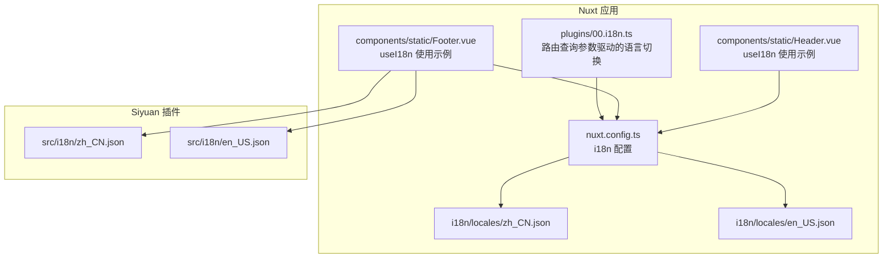
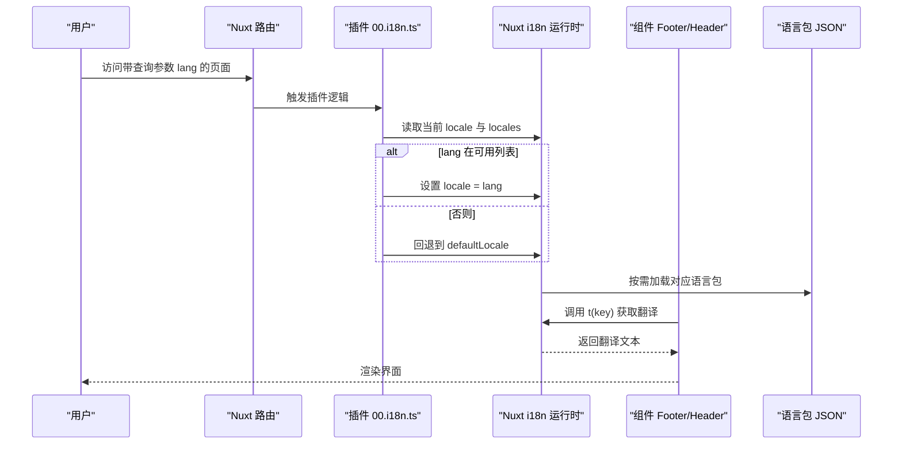
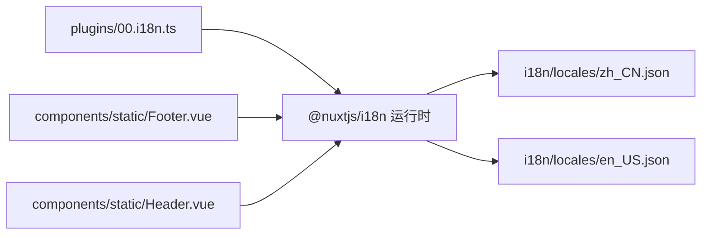

# 多语言支持

<cite>
**本文引用的文件**
- [apps/app/i18n/locales/zh_CN.json](file://apps/app/i18n/locales/zh_CN.json)
- [apps/app/i18n/locales/en_US.json](file://apps/app/i18n/locales/en_US.json)
- [apps/siyuan/src/i18n/zh_CN.json](file://apps/siyuan/src/i18n/zh_CN.json)
- [apps/siyuan/src/i18n/en_US.json](file://apps/siyuan/src/i18n/en_US.json)
- [apps/app/plugins/00.i18n.ts](file://apps/app/plugins/00.i18n.ts)
- [apps/app/nuxt.config.ts](file://apps/app/nuxt.config.ts)
- [apps/app/components/static/Footer.vue](file://apps/app/components/static/Footer.vue)
- [apps/app/components/static/Header.vue](file://apps/app/components/static/Header.vue)
</cite>

## 目录
1. [引言](#引言)
2. [项目结构](#项目结构)
3. [核心组件](#核心组件)
4. [架构总览](#架构总览)
5. [详细组件分析](#详细组件分析)
6. [依赖分析](#依赖分析)
7. [性能考虑](#性能考虑)
8. [故障排查指南](#故障排查指南)
9. [结论](#结论)
10. [附录](#附录)

## 引言
本文件面向多语言支持功能，系统性梳理该项目在 Nuxt 应用与 Siyuan 插件两套运行环境下的国际化实现机制。内容涵盖语言包结构、翻译键值管理、动态语言切换、资源加载与缓存策略、性能优化建议以及最佳实践与常见问题处理方案。读者可据此完成中英文双语配置与新语言扩展。

## 项目结构
项目在两个子应用中分别实现了国际化：
- Nuxt 应用（apps/app）：通过 Nuxt 的 @nuxtjs/i18n 模块进行配置与运行时切换，语言包位于 apps/app/i18n/locales 下。
- Siyuan 插件（apps/siyuan）：独立的语言包位于 apps/siyuan/src/i18n，用于插件内的文案与交互。

图表来源
- [apps/app/nuxt.config.ts:25-33](file://apps/app/nuxt.config.ts#L25-L33)
- [apps/app/plugins/00.i18n.ts:16-27](file://apps/app/plugins/00.i18n.ts#L16-L27)
- [apps/app/i18n/locales/zh_CN.json:1-100](file://apps/app/i18n/locales/zh_CN.json#L1-L100)
- [apps/app/i18n/locales/en_US.json:1-100](file://apps/app/i18n/locales/en_US.json#L1-L100)
- [apps/siyuan/src/i18n/zh_CN.json:1-53](file://apps/siyuan/src/i18n/zh_CN.json#L1-L53)
- [apps/siyuan/src/i18n/en_US.json:1-54](file://apps/siyuan/src/i18n/en_US.json#L1-L54)

章节来源
- [apps/app/nuxt.config.ts:25-33](file://apps/app/nuxt.config.ts#L25-L33)
- [apps/app/plugins/00.i18n.ts:16-27](file://apps/app/plugins/00.i18n.ts#L16-L27)
- [apps/app/i18n/locales/zh_CN.json:1-100](file://apps/app/i18n/locales/zh_CN.json#L1-L100)
- [apps/app/i18n/locales/en_US.json:1-100](file://apps/app/i18n/locales/en_US.json#L1-L100)
- [apps/siyuan/src/i18n/zh_CN.json:1-53](file://apps/siyuan/src/i18n/zh_CN.json#L1-L53)
- [apps/siyuan/src/i18n/en_US.json:1-54](file://apps/siyuan/src/i18n/en_US.json#L1-L54)

## 核心组件
- 国际化配置（Nuxt）
  - 默认语言与可用语言列表、策略与浏览器语言检测开关均在 Nuxt 配置中集中声明，便于统一管理与扩展。
  - 关键字段：defaultLocale、locales、strategy、detectBrowserLanguage。
- 动态语言切换插件
  - 依据路由查询参数 lang 实时切换语言，若目标语言不在可用列表，则回退到默认语言。
- 组件中的语言使用
  - Footer 与 Header 等组件通过 useI18n 获取 t 与 locale，实现文案渲染与语言设置。
- 语言包结构
  - Nuxt 应用与 Siyuan 插件各自维护独立的 JSON 语言包，键名遵循统一命名规范，便于检索与替换。

章节来源
- [apps/app/nuxt.config.ts:25-33](file://apps/app/nuxt.config.ts#L25-L33)
- [apps/app/plugins/00.i18n.ts:16-27](file://apps/app/plugins/00.i18n.ts#L16-L27)
- [apps/app/components/static/Footer.vue:21-69](file://apps/app/components/static/Footer.vue#L21-L69)
- [apps/app/components/static/Header.vue:10-29](file://apps/app/components/static/Header.vue#L10-L29)

## 架构总览
下图展示从路由到语言包加载与组件渲染的全链路：

图表来源
- [apps/app/plugins/00.i18n.ts:16-27](file://apps/app/plugins/00.i18n.ts#L16-L27)
- [apps/app/nuxt.config.ts:25-33](file://apps/app/nuxt.config.ts#L25-L33)
- [apps/app/i18n/locales/zh_CN.json:1-100](file://apps/app/i18n/locales/zh_CN.json#L1-L100)
- [apps/app/i18n/locales/en_US.json:1-100](file://apps/app/i18n/locales/en_US.json#L1-L100)
- [apps/app/components/static/Footer.vue:21-84](file://apps/app/components/static/Footer.vue#L21-L84)

## 详细组件分析

### Nuxt 国际化配置与策略
- 配置要点
  - defaultLocale：默认语言代码。
  - locales：语言列表，包含 code、name、file 字段，file 对应语言包文件名。
  - strategy：no_prefix 表示同一语言路径不加前缀，利于 SEO 与直连。
  - detectBrowserLanguage：关闭自动检测，避免与路由参数冲突。
- 扩展新语言
  - 在 locales 中新增一项，指定 code、name、file。
  - 在 i18n/locales 目录添加对应 JSON 文件，键名保持一致。
  - 如需保留浏览器语言检测，可开启 detectBrowserLanguage 并配合其他策略。

章节来源
- [apps/app/nuxt.config.ts:25-33](file://apps/app/nuxt.config.ts#L25-L33)

### 动态语言切换插件（路由参数驱动）
- 行为流程
  - 读取当前路由查询参数 lang。
  - 若 lang 存在且与当前 locale 不同：
    - 若 lang 属于 locales 列表，切换至该语言；
    - 否则回退到 defaultLocale。
- 容错与健壮性
  - 未匹配时回退默认语言，避免无效语言导致的渲染异常。
- 适用场景
  - 支持通过 URL 参数快速切换语言，便于测试与分享。

图表来源
- [apps/app/plugins/00.i18n.ts:16-27](file://apps/app/plugins/00.i18n.ts#L16-L27)

章节来源
- [apps/app/plugins/00.i18n.ts:16-27](file://apps/app/plugins/00.i18n.ts#L16-L27)

### 组件中的语言使用（Footer 与 Header）
- Footer
  - 在生命周期中可根据传入的设置对象覆盖默认语言。
  - 使用 t(key) 渲染多语言文案，如“名称”“回到首页”“关于”等。
- Header
  - 通过 useI18n 获取 t，用于站点标题与导航文案渲染。
- 最佳实践
  - 在组件初始化阶段优先读取外部传参以确定初始语言。
  - 使用 t(key) 时确保 key 在对应语言包中存在，避免渲染空白。

章节来源
- [apps/app/components/static/Footer.vue:21-84](file://apps/app/components/static/Footer.vue#L21-L84)
- [apps/app/components/static/Header.vue:10-29](file://apps/app/components/static/Header.vue#L10-L29)

### 语言包结构与键值管理
- 结构规范
  - JSON 键名为点分层级的标识，如 “share.to.web”“setting.basic.homePageId”，便于分组与检索。
  - 值为对应语言的文案字符串。
- 键值一致性
  - Nuxt 应用与 Siyuan 插件各自维护独立语言包，但建议在跨应用共享文案时约定统一键名，减少重复与歧义。
- 维护建议
  - 采用“按模块分组”的命名方式，如 “share.”“setting.”“blog.”，提升可读性与可维护性。
  - 提供一份键名清单或映射表，便于翻译人员核对与校验。

章节来源
- [apps/app/i18n/locales/zh_CN.json:1-100](file://apps/app/i18n/locales/zh_CN.json#L1-L100)
- [apps/app/i18n/locales/en_US.json:1-100](file://apps/app/i18n/locales/en_US.json#L1-L100)
- [apps/siyuan/src/i18n/zh_CN.json:1-53](file://apps/siyuan/src/i18n/zh_CN.json#L1-L53)
- [apps/siyuan/src/i18n/en_US.json:1-54](file://apps/siyuan/src/i18n/en_US.json#L1-L54)

### 中英文双语支持配置方法
- Nuxt 应用
  - 在 locales 中配置 zh_CN 与 en_US，确保 file 指向正确的 JSON 文件。
  - 通过路由参数 lang 实现即时切换。
- Siyuan 插件
  - 在 src/i18n 目录下提供 zh_CN.json 与 en_US.json。
  - 组件中通过 useI18n 获取 t 与 locale，渲染对应语言文案。

章节来源
- [apps/app/nuxt.config.ts:25-33](file://apps/app/nuxt.config.ts#L25-L33)
- [apps/siyuan/src/i18n/zh_CN.json:1-53](file://apps/siyuan/src/i18n/zh_CN.json#L1-L53)
- [apps/siyuan/src/i18n/en_US.json:1-54](file://apps/siyuan/src/i18n/en_US.json#L1-L54)

### 扩展新语言的步骤
- 在 Nuxt 应用
  - 在 nuxt.config.ts 的 locales 中新增语言项（code、name、file）。
  - 在 apps/app/i18n/locales 添加对应 JSON 文件，键名与现有语言保持一致。
- 在 Siyuan 插件
  - 在 apps/siyuan/src/i18n 添加对应 JSON 文件。
- 验证
  - 通过访问带 lang 参数的 URL 测试切换效果。
  - 在组件中调用 t(key) 校验文案渲染。

章节来源
- [apps/app/nuxt.config.ts:25-33](file://apps/app/nuxt.config.ts#L25-L33)
- [apps/app/i18n/locales/zh_CN.json:1-100](file://apps/app/i18n/locales/zh_CN.json#L1-L100)
- [apps/app/i18n/locales/en_US.json:1-100](file://apps/app/i18n/locales/en_US.json#L1-L100)
- [apps/siyuan/src/i18n/zh_CN.json:1-53](file://apps/siyuan/src/i18n/zh_CN.json#L1-L53)
- [apps/siyuan/src/i18n/en_US.json:1-54](file://apps/siyuan/src/i18n/en_US.json#L1-L54)

## 依赖分析
- 模块耦合
  - 插件 00.i18n.ts 依赖 Nuxt i18n 运行时与路由；组件依赖 useI18n。
  - 语言包作为纯 JSON 资源被 i18n 模块按需加载。
- 外部依赖
  - @nuxtjs/i18n：提供国际化配置与运行时能力。
  - vue-i18n：提供 useI18n 组合式 API。
- 潜在风险
  - 语言包缺失键值会导致渲染空白，需建立键名清单与自动化校验。
  - 路由参数与浏览器语言检测策略需明确，避免冲突。

图表来源
- [apps/app/plugins/00.i18n.ts:16-27](file://apps/app/plugins/00.i18n.ts#L16-L27)
- [apps/app/nuxt.config.ts:25-33](file://apps/app/nuxt.config.ts#L25-L33)
- [apps/app/i18n/locales/zh_CN.json:1-100](file://apps/app/i18n/locales/zh_CN.json#L1-L100)
- [apps/app/i18n/locales/en_US.json:1-100](file://apps/app/i18n/locales/en_US.json#L1-L100)
- [apps/app/components/static/Footer.vue:21-84](file://apps/app/components/static/Footer.vue#L21-L84)
- [apps/app/components/static/Header.vue:10-29](file://apps/app/components/static/Header.vue#L10-L29)

章节来源
- [apps/app/plugins/00.i18n.ts:16-27](file://apps/app/plugins/00.i18n.ts#L16-L27)
- [apps/app/nuxt.config.ts:25-33](file://apps/app/nuxt.config.ts#L25-L33)
- [apps/app/components/static/Footer.vue:21-84](file://apps/app/components/static/Footer.vue#L21-L84)
- [apps/app/components/static/Header.vue:10-29](file://apps/app/components/static/Header.vue#L10-L29)

## 性能考虑
- 按需加载
  - i18n 模块会按需加载对应语言包，避免一次性加载全部语言资源，降低首屏体积。
- 缓存策略
  - 建议在构建产物中加入版本号或哈希，结合 CDN 与浏览器缓存，减少重复下载。
- 渲染优化
  - 在组件中尽量复用 t(key) 的结果，避免频繁计算。
  - 对高频文案可考虑本地缓存（如组件内 ref 缓存），但需注意语言切换时的失效与更新。
- 资源体积控制
  - 合理拆分语言包，避免单个文件过大；必要时可按模块拆分，仅加载当前页面所需文案。

## 故障排查指南
- 语言切换无效
  - 检查路由参数 lang 是否正确传递，以及是否在 locales 列表中。
  - 若不在列表，插件会回退到默认语言，需确认 defaultLocale 配置。
- 文案空白
  - 确认对应 key 是否存在于当前语言包；建议建立键名清单与自动化校验脚本。
- 浏览器语言检测冲突
  - 若开启 detectBrowserLanguage，可能与路由参数冲突；建议统一使用路由参数策略或关闭自动检测。
- 组件语言未按预期设置
  - 确认组件初始化时是否正确读取外部传参并设置 locale。

章节来源
- [apps/app/plugins/00.i18n.ts:16-27](file://apps/app/plugins/00.i18n.ts#L16-L27)
- [apps/app/nuxt.config.ts:25-33](file://apps/app/nuxt.config.ts#L25-L33)
- [apps/app/components/static/Footer.vue:64-69](file://apps/app/components/static/Footer.vue#L64-L69)

## 结论
本项目在 Nuxt 应用与 Siyuan 插件两端均实现了完善的多语言支持：通过集中配置与按需加载的语言包、基于路由参数的动态切换、以及组件层面的统一使用方式，形成了清晰、可扩展的国际化体系。遵循本文的键值管理规范、扩展步骤与性能优化建议，可高效完成中英文双语配置与后续新语言扩展。

## 附录
- 最佳实践
  - 统一键名命名规范，按模块分组。
  - 维护键名清单与翻译对照表，便于多人协作与质量把控。
  - 在 CI 中增加键值一致性检查，防止遗漏或重复。
  - 对高频文案进行本地缓存，结合语言切换事件更新缓存。
- 常见问题
  - 语言包缺失键值：渲染空白。解决：补齐键值或提供默认回退文案。
  - 路由参数与自动检测冲突：行为不可预测。解决：统一策略或关闭自动检测。
  - 语言切换后未刷新：检查组件是否监听 locale 变更并触发重渲染。