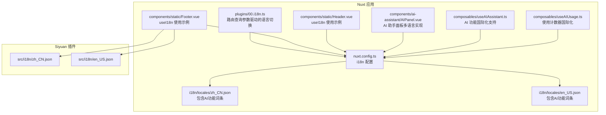
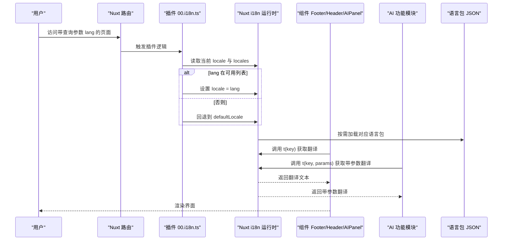
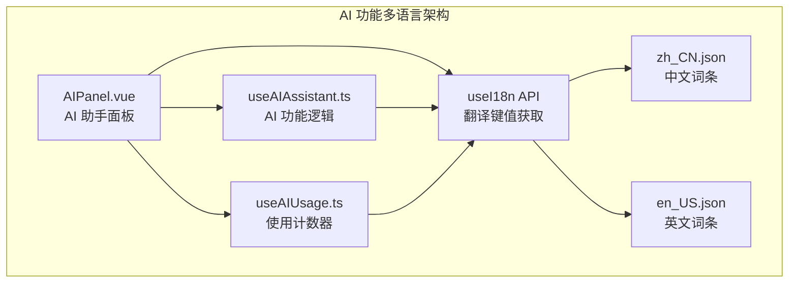
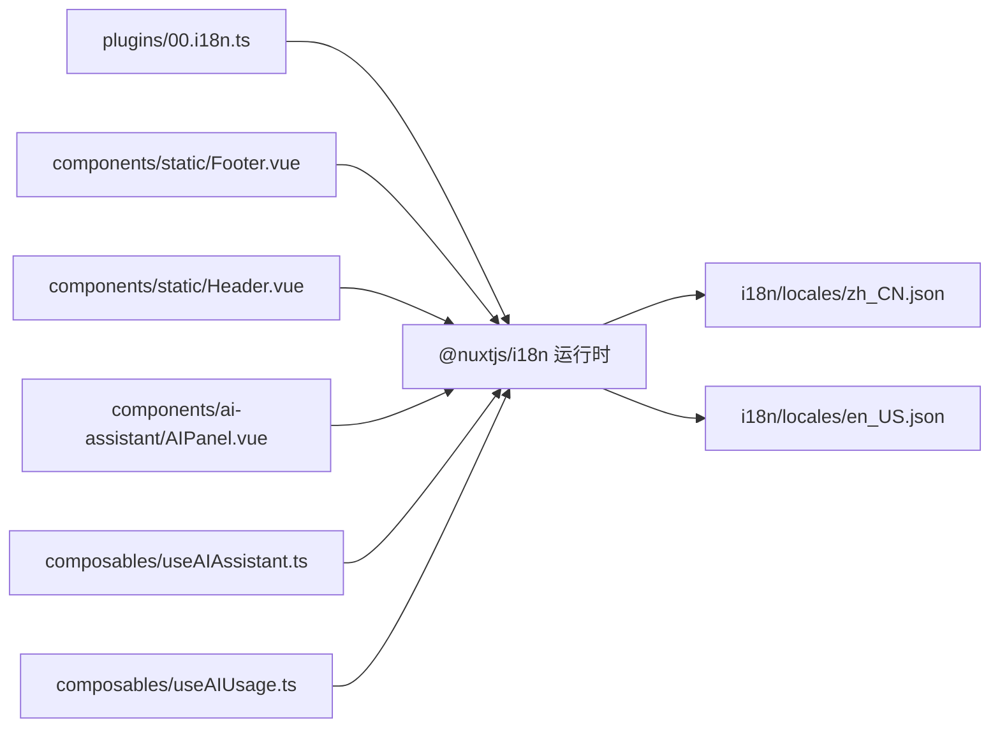

# 多语言支持

<cite>
**本文引用的文件**
- [apps/app/i18n/locales/zh_CN.json](file://apps/app/i18n/locales/zh_CN.json)
- [apps/app/i18n/locales/en_US.json](file://apps/app/i18n/locales/en_US.json)
- [apps/siyuan/src/i18n/zh_CN.json](file://apps/siyuan/src/i18n/zh_CN.json)
- [apps/siyuan/src/i18n/en_US.json](file://apps/siyuan/src/i18n/en_US.json)
- [apps/app/plugins/00.i18n.ts](file://apps/app/plugins/00.i18n.ts)
- [apps/app/nuxt.config.ts](file://apps/app/nuxt.config.ts)
- [apps/app/components/static/Footer.vue](file://apps/app/components/static/Footer.vue)
- [apps/app/components/static/Header.vue](file://apps/app/components/static/Header.vue)
- [apps/app/components/ai-assistant/AIPanel.vue](file://apps/app/components/ai-assistant/AIPanel.vue)
- [apps/app/composables/useAIAssistant.ts](file://apps/app/composables/useAIAssistant.ts)
- [apps/app/composables/useAIUsage.ts](file://apps/app/composables/useAIUsage.ts)
</cite>

## 更新摘要
**所做更改**
- 新增AI相关功能的多语言支持章节，涵盖AI速读、问答生成、自由聊天等功能的国际化翻译
- 更新语言包结构，添加AI服务条款、使用限制、配置选项等新词条
- 增强AI功能的使用计数器国际化，支持动态数量显示
- 完善AI助手面板的多语言实现，包括术语确认对话框和错误消息

## 目录
1. [引言](#引言)
2. [项目结构](#项目结构)
3. [核心组件](#核心组件)
4. [架构总览](#架构总览)
5. [详细组件分析](#详细组件分析)
6. [AI功能多语言支持](#ai功能多语言支持)
7. [依赖分析](#依赖分析)
8. [性能考虑](#性能考虑)
9. [故障排查指南](#故障排查指南)
10. [结论](#结论)
11. [附录](#附录)

## 引言
本文件面向多语言支持功能，系统性梳理该项目在 Nuxt 应用与 Siyuan 插件两套运行环境下的国际化实现机制。内容涵盖语言包结构、翻译键值管理、动态语言切换、资源加载与缓存策略、性能优化建议以及最佳实践与常见问题处理方案。特别关注AI相关功能的国际化实现，包括AI聊天、问答生成、摘要功能、使用限制等多语言词条的完整支持。

## 项目结构
项目在两个子应用中分别实现了国际化：
- Nuxt 应用（apps/app）：通过 Nuxt 的 @nuxtjs/i18n 模块进行配置与运行时切换，语言包位于 apps/app/i18n/locales 下，包含完整的AI功能多语言支持。
- Siyuan 插件（apps/siyuan）：独立的语言包位于 apps/siyuan/src/i18n，用于插件内的文案与交互。

**图表来源**
- [apps/app/nuxt.config.ts:25-33](file://apps/app/nuxt.config.ts#L25-L33)
- [apps/app/plugins/00.i18n.ts:16-27](file://apps/app/plugins/00.i18n.ts#L16-L27)
- [apps/app/i18n/locales/zh_CN.json:99-144](file://apps/app/i18n/locales/zh_CN.json#L99-L144)
- [apps/app/i18n/locales/en_US.json:99-144](file://apps/app/i18n/locales/en_US.json#L99-L144)
- [apps/app/components/ai-assistant/AIPanel.vue:34](file://apps/app/components/ai-assistant/AIPanel.vue#L34)
- [apps/app/composables/useAIAssistant.ts:296](file://apps/app/composables/useAIAssistant.ts#L296)
- [apps/app/composables/useAIUsage.ts:62](file://apps/app/composables/useAIUsage.ts#L62)

**章节来源**
- [apps/app/nuxt.config.ts:25-33](file://apps/app/nuxt.config.ts#L25-L33)
- [apps/app/plugins/00.i18n.ts:16-27](file://apps/app/plugins/00.i18n.ts#L16-L27)
- [apps/app/i18n/locales/zh_CN.json:99-144](file://apps/app/i18n/locales/zh_CN.json#L99-L144)
- [apps/app/i18n/locales/en_US.json:99-144](file://apps/app/i18n/locales/en_US.json#L99-L144)
- [apps/siyuan/src/i18n/zh_CN.json:1-53](file://apps/siyuan/src/i18n/zh_CN.json#L1-L53)
- [apps/siyuan/src/i18n/en_US.json:1-54](file://apps/siyuan/src/i18n/en_US.json#L1-L54)

## 核心组件
- 国际化配置（Nuxt）
  - 默认语言与可用语言列表、策略与浏览器语言检测开关均在 Nuxt 配置中集中声明，便于统一管理与扩展。
  - 关键字段：defaultLocale、locales、strategy、detectBrowserLanguage。
- 动态语言切换插件
  - 依据路由查询参数 lang 实时切换语言，若目标语言不在可用列表，则回退到默认语言。
- 组件中的语言使用
  - Footer 与 Header 等组件通过 useI18n 获取 t 与 locale，实现文案渲染与语言设置。
- 语言包结构
  - Nuxt 应用与 Siyuan 插件各自维护独立的 JSON 语言包，键名遵循统一命名规范，便于检索与替换。
- AI功能国际化
  - 完整支持AI速读、问答生成、自由聊天等核心功能的多语言实现
  - 包含使用计数器的动态数量显示（{count} 占位符）
  - 术语确认对话框的完整国际化支持

**章节来源**
- [apps/app/nuxt.config.ts:25-33](file://apps/app/nuxt.config.ts#L25-L33)
- [apps/app/plugins/00.i18n.ts:16-27](file://apps/app/plugins/00.i18n.ts#L16-L27)
- [apps/app/components/static/Footer.vue:21-69](file://apps/app/components/static/Footer.vue#L21-L69)
- [apps/app/components/static/Header.vue:10-29](file://apps/app/components/static/Header.vue#L10-L29)
- [apps/app/components/ai-assistant/AIPanel.vue:34](file://apps/app/components/ai-assistant/AIPanel.vue#L34)
- [apps/app/composables/useAIUsage.ts:78-79](file://apps/app/composables/useAIUsage.ts#L78-L79)

## 架构总览
下图展示从路由到语言包加载与组件渲染的全链路，包括AI功能的国际化支持：

**图表来源**
- [apps/app/plugins/00.i18n.ts:16-27](file://apps/app/plugins/00.i18n.ts#L16-L27)
- [apps/app/nuxt.config.ts:25-33](file://apps/app/nuxt.config.ts#L25-L33)
- [apps/app/i18n/locales/zh_CN.json:131](file://apps/app/i18n/locales/zh_CN.json#L131)
- [apps/app/i18n/locales/en_US.json:131](file://apps/app/i18n/locales/en_US.json#L131)
- [apps/app/components/ai-assistant/AIPanel.vue:292-296](file://apps/app/components/ai-assistant/AIPanel.vue#L292-L296)

## 详细组件分析

### Nuxt 国际化配置与策略
- 配置要点
  - defaultLocale：默认语言代码。
  - locales：语言列表，包含 code、name、file 字段，file 对应语言包文件名。
  - strategy：no_prefix 表示同一语言路径不加前缀，利于 SEO 与直连。
  - detectBrowserLanguage：关闭自动检测，避免与路由参数冲突。
- 扩展新语言
  - 在 locales 中新增一项，指定 code、name、file。
  - 在 i18n/locales 目录添加对应 JSON 文件，键名保持一致。
  - 如需保留浏览器语言检测，可开启 detectBrowserLanguage 并配合其他策略。

**章节来源**
- [apps/app/nuxt.config.ts:25-33](file://apps/app/nuxt.config.ts#L25-L33)

### 动态语言切换插件（路由参数驱动）
- 行为流程
  - 读取当前路由查询参数 lang。
  - 若 lang 存在且与当前 locale 不同：
    - 若 lang 属于 locales 列表，切换至该语言；
    - 否则回退到 defaultLocale。
- 容错与健壮性
  - 未匹配时回退默认语言，避免无效语言导致的渲染异常。
- 适用场景
  - 支持通过 URL 参数快速切换语言，便于测试与分享。

**图表来源**
- [apps/app/plugins/00.i18n.ts:16-27](file://apps/app/plugins/00.i18n.ts#L16-L27)

**章节来源**
- [apps/app/plugins/00.i18n.ts:16-27](file://apps/app/plugins/00.i18n.ts#L16-L27)

### 组件中的语言使用（Footer 与 Header）
- Footer
  - 在生命周期中可根据传入的设置对象覆盖默认语言。
  - 使用 t(key) 渲染多语言文案，如"名称""回到首页""关于"等。
- Header
  - 通过 useI18n 获取 t，用于站点标题与导航文案渲染。
- 最佳实践
  - 在组件初始化阶段优先读取外部传参以确定初始语言。
  - 使用 t(key) 时确保 key 在对应语言包中存在，避免渲染空白。

**章节来源**
- [apps/app/components/static/Footer.vue:21-84](file://apps/app/components/static/Footer.vue#L21-L84)
- [apps/app/components/static/Header.vue:10-29](file://apps/app/components/static/Header.vue#L10-L29)

### 语言包结构与键值管理
- 结构规范
  - JSON 键名为点分层级的标识，如 "share.to.web""setting.basic.homePageId""ai.summary.terms.title"，便于分组与检索。
  - 值为对应语言的文案字符串，支持占位符参数如 {count}。
- 键值一致性
  - Nuxt 应用与 Siyuan 插件各自维护独立语言包，但建议在跨应用共享文案时约定统一键名，减少重复与歧义。
- 维护建议
  - 采用"按模块分组"的命名方式，如 "share." "setting." "blog." "ai."，提升可读性与可维护性。
  - 提供一份键名清单或映射表，便于翻译人员核对与校验。

**章节来源**
- [apps/app/i18n/locales/zh_CN.json:99-144](file://apps/app/i18n/locales/zh_CN.json#L99-L144)
- [apps/app/i18n/locales/en_US.json:99-144](file://apps/app/i18n/locales/en_US.json#L99-L144)
- [apps/siyuan/src/i18n/zh_CN.json:1-53](file://apps/siyuan/src/i18n/zh_CN.json#L1-L53)
- [apps/siyuan/src/i18n/en_US.json:1-54](file://apps/siyuan/src/i18n/en_US.json#L1-L54)

### 中英文双语支持配置方法
- Nuxt 应用
  - 在 locales 中配置 zh_CN 与 en_US，确保 file 指向正确的 JSON 文件。
  - 通过路由参数 lang 实现即时切换。
  - 完整支持AI功能的多语言实现，包括速读、问答、聊天等。
- Siyuan 插件
  - 在 src/i18n 目录下提供 zh_CN.json 与 en_US.json。
  - 组件中通过 useI18n 获取 t 与 locale，渲染对应语言文案。

**章节来源**
- [apps/app/nuxt.config.ts:25-33](file://apps/app/nuxt.config.ts#L25-L33)
- [apps/siyuan/src/i18n/zh_CN.json:1-53](file://apps/siyuan/src/i18n/zh_CN.json#L1-L53)
- [apps/siyuan/src/i18n/en_US.json:1-54](file://apps/siyuan/src/i18n/en_US.json#L1-L54)

### 扩展新语言的步骤
- 在 Nuxt 应用
  - 在 nuxt.config.ts 的 locales 中新增语言项（code、name、file）。
  - 在 apps/app/i18n/locales 添加对应 JSON 文件，键名与现有语言保持一致。
  - 确保包含AI功能相关的所有词条，如 ai.summary.*、ai.qa.*、ai.chat.* 等。
- 在 Siyuan 插件
  - 在 apps/siyuan/src/i18n 添加对应 JSON 文件。
- 验证
  - 通过访问带 lang 参数的 URL 测试切换效果。
  - 在组件中调用 t(key) 校验文案渲染。
  - 特别验证AI功能的多语言显示，包括使用计数器的动态参数。

**章节来源**
- [apps/app/nuxt.config.ts:25-33](file://apps/app/nuxt.config.ts#L25-L33)
- [apps/app/i18n/locales/zh_CN.json:99-144](file://apps/app/i18n/locales/zh_CN.json#L99-L144)
- [apps/app/i18n/locales/en_US.json:99-144](file://apps/app/i18n/locales/en_US.json#L99-L144)
- [apps/siyuan/src/i18n/zh_CN.json:1-53](file://apps/siyuan/src/i18n/zh_CN.json#L1-L53)
- [apps/siyuan/src/i18n/en_US.json:1-54](file://apps/siyuan/src/i18n/en_US.json#L1-L54)

## AI功能多语言支持

### AI功能国际化架构
AI功能的多语言支持通过统一的useI18n组合式API实现，涵盖以下核心功能：
- AI速读功能：摘要生成、关键要点、延伸思考
- 问答生成功能：文档问答、问题生成、答案展示
- 自由聊天功能：对话界面、输入提示、错误处理
- 使用计数器：动态数量显示、使用限制提示

**图表来源**
- [apps/app/components/ai-assistant/AIPanel.vue:34](file://apps/app/components/ai-assistant/AIPanel.vue#L34)
- [apps/app/composables/useAIAssistant.ts:296](file://apps/app/composables/useAIAssistant.ts#L296)
- [apps/app/composables/useAIUsage.ts:62](file://apps/app/composables/useAIUsage.ts#L62)
- [apps/app/i18n/locales/zh_CN.json:99-144](file://apps/app/i18n/locales/zh_CN.json#L99-L144)
- [apps/app/i18n/locales/en_US.json:99-144](file://apps/app/i18n/locales/en_US.json#L99-L144)

### AI速读功能多语言支持
- 核心词条
  - ai.summary.btn：AI速读按钮文本
  - ai.summary.panel.title：AI速读面板标题
  - ai.summary.loading：加载提示文本
  - ai.summary.retry：重试按钮文本
  - ai.summary.regenerate：重新生成文本
  - ai.summary.empty：空状态提示
  - ai.summary.start.btn：开始速读按钮
  - ai.summary.section.summary：核心摘要标题
  - ai.summary.section.keypoints：关键要点标题
  - ai.summary.section.thinking：延伸思考标题
- 配置选项
  - ai.summary.config.title：自定义AI配置标题
  - ai.summary.config.model：模型选择标签
  - ai.summary.config.apikey.placeholder：API密钥占位符
  - ai.summary.thinking.answer.show/hide：查看/隐藏答案
- 服务条款
  - ai.summary.terms.title：AI速读服务须知标题
  - ai.summary.terms.body：服务条款内容
  - ai.summary.terms.confirm/cancel：确认/取消按钮

**章节来源**
- [apps/app/i18n/locales/zh_CN.json:99-118](file://apps/app/i18n/locales/zh_CN.json#L99-L118)
- [apps/app/i18n/locales/en_US.json:99-118](file://apps/app/i18n/locales/en_US.json#L99-L118)

### 问答生成功能多语言支持
- 核心词条
  - ai.qa.loading：问答生成加载提示
  - ai.qa.empty：空状态提示
  - ai.qa.retry：重试按钮
  - ai.qa.regenerate：重新生成问答
  - ai.qa.section.title：文档问答标题
- 实现机制
  - 通过useAIAssistant组合式API调用AI问答生成功能
  - 支持JSON格式的问答对生成和展示
  - 提供详细的问答内容和答案展开功能

**章节来源**
- [apps/app/i18n/locales/zh_CN.json:119-123](file://apps/app/i18n/locales/zh_CN.json#L119-L123)
- [apps/app/i18n/locales/en_US.json:119-123](file://apps/app/i18n/locales/en_US.json#L119-L123)
- [apps/app/composables/useAIAssistant.ts:373-421](file://apps/app/composables/useAIAssistant.ts#L373-L421)

### 自由聊天功能多语言支持
- 核心词条
  - ai.chat.title：自由聊天标题
  - ai.chat.placeholder：输入框占位符
  - ai.chat.send：发送按钮文本
  - ai.chat.welcome：欢迎消息
  - ai.chat.clear：清空对话按钮
  - ai.chat.error.empty：空输入错误提示
  - ai.chat.error.usage：使用限制错误提示
- 实现机制
  - 通过AIPanel组件提供统一的聊天界面
  - 支持连续对话和上下文记忆
  - 集成AI使用计数器功能

**章节来源**
- [apps/app/i18n/locales/zh_CN.json:137-143](file://apps/app/i18n/locales/zh_CN.json#L137-L143)
- [apps/app/i18n/locales/en_US.json:137-143](file://apps/app/i18n/locales/en_US.json#L137-L143)
- [apps/app/components/ai-assistant/AIPanel.vue:115-133](file://apps/app/components/ai-assistant/AIPanel.vue#L115-L133)

### 使用计数器国际化支持
- 核心词条
  - ai.assistant.usage.remaining：剩余使用次数
  - ai.assistant.usage.exhausted：使用次数耗尽提示
- 动态参数支持
  - 使用 {count} 占位符实现动态数量显示
  - 支持不同语言的数字格式化
- 实现机制
  - 通过useAIUsage组合式API管理每日使用限制
  - 支持localStorage持久化存储
  - 自动按日期重置使用计数

**章节来源**
- [apps/app/i18n/locales/zh_CN.json:131-132](file://apps/app/i18n/locales/zh_CN.json#L131-L132)
- [apps/app/i18n/locales/en_US.json:131-132](file://apps/app/i18n/locales/en_US.json#L131-L132)
- [apps/app/composables/useAIUsage.ts:78-79](file://apps/app/composables/useAIUsage.ts#L78-L79)

### 术语确认对话框多语言支持
- 核心词条
  - ai.assistant.terms.title：AI服务须知标题
  - ai.assistant.terms.body：服务条款内容
  - ai.assistant.terms.confirm/cancel：确认/取消按钮
- 实现机制
  - 通过AIPanel组件的条件渲染实现
  - 支持localStorage记忆用户选择
  - 提供模态对话框形式的服务条款展示

**章节来源**
- [apps/app/i18n/locales/zh_CN.json:133-136](file://apps/app/i18n/locales/zh_CN.json#L133-L136)
- [apps/app/i18n/locales/en_US.json:133-136](file://apps/app/i18n/locales/en_US.json#L133-L136)
- [apps/app/components/ai-assistant/AIPanel.vue:299-323](file://apps/app/components/ai-assistant/AIPanel.vue#L299-L323)

## 依赖分析
- 模块耦合
  - 插件 00.i18n.ts 依赖 Nuxt i18n 运行时与路由；组件依赖 useI18n。
  - 语言包作为纯 JSON 资源被 i18n 模块按需加载。
  - AI功能通过统一的useI18n API实现多语言支持。
- 外部依赖
  - @nuxtjs/i18n：提供国际化配置与运行时能力。
  - vue-i18n：提供 useI18n 组合式 API。
  - Element Plus：提供图标和UI组件支持。
- 潜在风险
  - 语言包缺失键值会导致渲染空白，需建立键名清单与自动化校验。
  - 路由参数与浏览器语言检测策略需明确，避免冲突。
  - AI功能的动态参数（{count}）需要正确传递给翻译函数。

**图表来源**
- [apps/app/plugins/00.i18n.ts:16-27](file://apps/app/plugins/00.i18n.ts#L16-L27)
- [apps/app/nuxt.config.ts:25-33](file://apps/app/nuxt.config.ts#L25-L33)
- [apps/app/i18n/locales/zh_CN.json:99-144](file://apps/app/i18n/locales/zh_CN.json#L99-L144)
- [apps/app/i18n/locales/en_US.json:99-144](file://apps/app/i18n/locales/en_US.json#L99-L144)
- [apps/app/components/static/Footer.vue:21-84](file://apps/app/components/static/Footer.vue#L21-L84)
- [apps/app/components/static/Header.vue:10-29](file://apps/app/components/static/Header.vue#L10-L29)
- [apps/app/components/ai-assistant/AIPanel.vue:34](file://apps/app/components/ai-assistant/AIPanel.vue#L34)
- [apps/app/composables/useAIAssistant.ts:296](file://apps/app/composables/useAIAssistant.ts#L296)
- [apps/app/composables/useAIUsage.ts:62](file://apps/app/composables/useAIUsage.ts#L62)

**章节来源**
- [apps/app/plugins/00.i18n.ts:16-27](file://apps/app/plugins/00.i18n.ts#L16-L27)
- [apps/app/nuxt.config.ts:25-33](file://apps/app/nuxt.config.ts#L25-L33)
- [apps/app/components/static/Footer.vue:21-84](file://apps/app/components/static/Footer.vue#L21-L84)
- [apps/app/components/static/Header.vue:10-29](file://apps/app/components/static/Header.vue#L10-L29)
- [apps/app/components/ai-assistant/AIPanel.vue:34](file://apps/app/components/ai-assistant/AIPanel.vue#L34)
- [apps/app/composables/useAIAssistant.ts:296](file://apps/app/composables/useAIAssistant.ts#L296)
- [apps/app/composables/useAIUsage.ts:62](file://apps/app/composables/useAIUsage.ts#L62)

## 性能考虑
- 按需加载
  - i18n 模块会按需加载对应语言包，避免一次性加载全部语言资源，降低首屏体积。
  - AI功能的多语言词条与主应用词条分离，进一步优化加载性能。
- 缓存策略
  - 建议在构建产物中加入版本号或哈希，结合 CDN 与浏览器缓存，减少重复下载。
  - AI功能的使用计数器通过localStorage缓存，避免每次刷新重新计算。
- 渲染优化
  - 在组件中尽量复用 t(key) 的结果，避免频繁计算。
  - 对高频文案可考虑本地缓存（如组件内 ref 缓存），但需注意语言切换时的失效与更新。
  - AI功能的动态参数（{count}）通过计算属性缓存，减少重复渲染。
- 资源体积控制
  - 合理拆分语言包，避免单个文件过大；必要时可按模块拆分，仅加载当前页面所需文案。
  - AI功能的多语言词条单独管理，便于按需加载。

## 故障排查指南
- 语言切换无效
  - 检查路由参数 lang 是否正确传递，以及是否在 locales 列表中。
  - 若不在列表，插件会回退到默认语言，需确认 defaultLocale 配置。
- 文案空白
  - 确认对应 key 是否存在于当前语言包；建议建立键名清单与自动化校验脚本。
  - 特别检查AI功能相关的词条是否存在，如 ai.summary.*、ai.qa.*、ai.chat.* 等。
- 浏览器语言检测冲突
  - 若开启 detectBrowserLanguage，可能与路由参数冲突；建议统一使用路由参数策略或关闭自动检测。
- 组件语言未按预期设置
  - 确认组件初始化时是否正确读取外部传参并设置 locale。
- AI功能多语言问题
  - 检查动态参数（{count}）是否正确传递给翻译函数。
  - 验证术语确认对话框的多语言显示是否正常。
  - 确认使用计数器的国际化显示是否正确。

**章节来源**
- [apps/app/plugins/00.i18n.ts:16-27](file://apps/app/plugins/00.i18n.ts#L16-L27)
- [apps/app/nuxt.config.ts:25-33](file://apps/app/nuxt.config.ts#L25-L33)
- [apps/app/components/static/Footer.vue:64-69](file://apps/app/components/static/Footer.vue#L64-L69)
- [apps/app/i18n/locales/zh_CN.json:99-144](file://apps/app/i18n/locales/zh_CN.json#L99-L144)
- [apps/app/i18n/locales/en_US.json:99-144](file://apps/app/i18n/locales/en_US.json#L99-L144)

## 结论
本项目在 Nuxt 应用与 Siyuan 插件两端均实现了完善的多语言支持，特别在AI功能方面提供了完整的国际化实现。通过集中配置与按需加载的语言包、基于路由参数的动态切换、组件层面的统一使用方式，以及AI功能特有的动态参数支持，形成了清晰、可扩展、功能完备的国际化体系。AI速读、问答生成、自由聊天等核心功能都得到了完整的多语言支持，包括使用计数器的动态显示和术语确认对话框的完整国际化。遵循本文的键值管理规范、扩展步骤与性能优化建议，可高效完成中英文双语配置与后续新语言扩展。

## 附录
- 最佳实践
  - 统一键名命名规范，按模块分组，特别是AI功能使用 ai.* 前缀。
  - 维护键名清单与翻译对照表，便于多人协作与质量把控。
  - 在 CI 中增加键值一致性检查，防止遗漏或重复。
  - 对高频文案进行本地缓存，结合语言切换事件更新缓存。
  - AI功能的动态参数（{count}）需要正确传递给翻译函数。
- 常见问题
  - 语言包缺失键值：渲染空白。解决：补齐键值或提供默认回退文案。
  - 路由参数与自动检测冲突：行为不可预测。解决：统一策略或关闭自动检测。
  - 语言切换后未刷新：检查组件是否监听 locale 变更并触发重渲染。
  - AI功能动态参数显示异常：检查 {count} 占位符是否正确传递。
  - 术语确认对话框多语言显示问题：验证 terms 对话框的多语言实现。