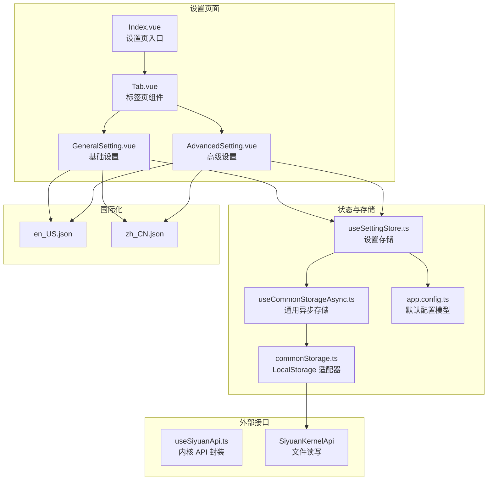
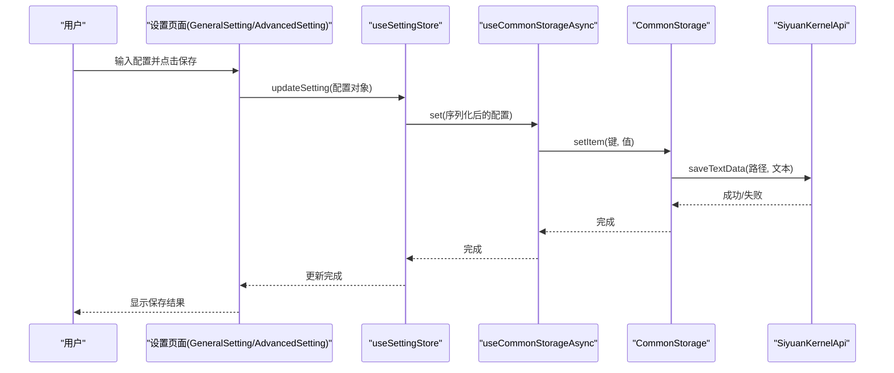
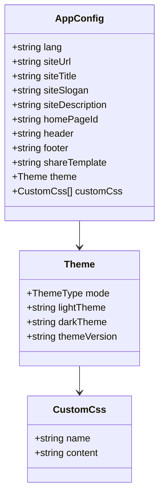
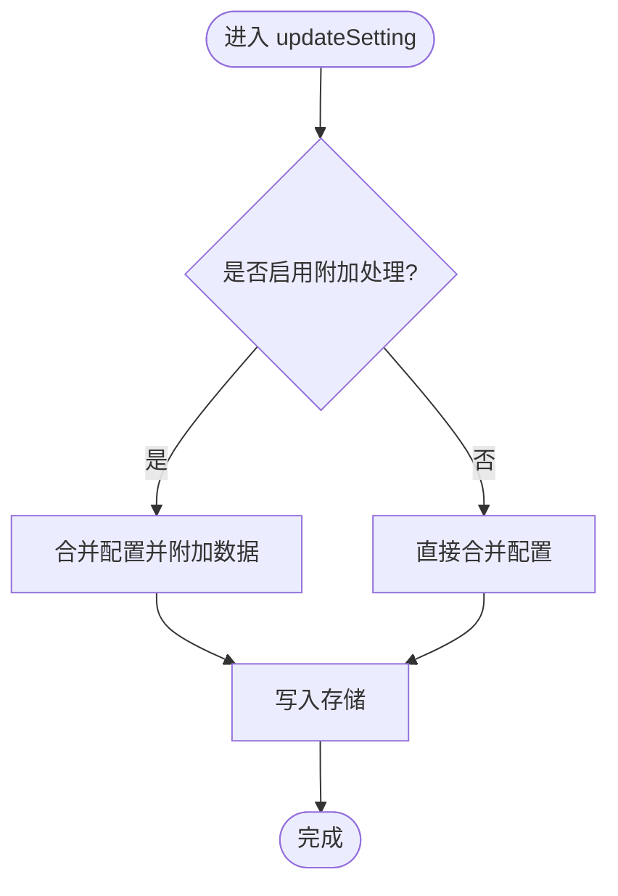
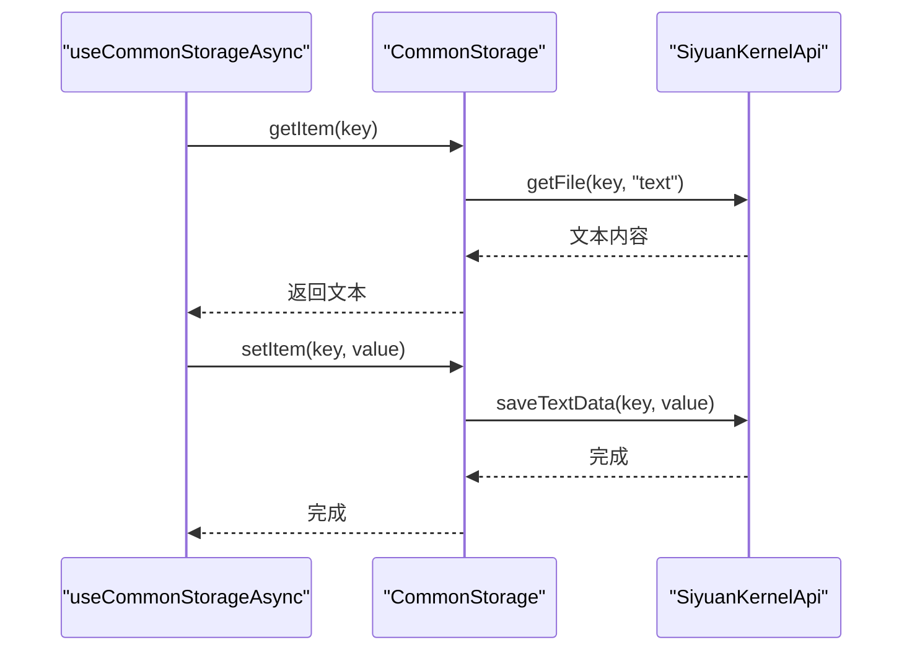
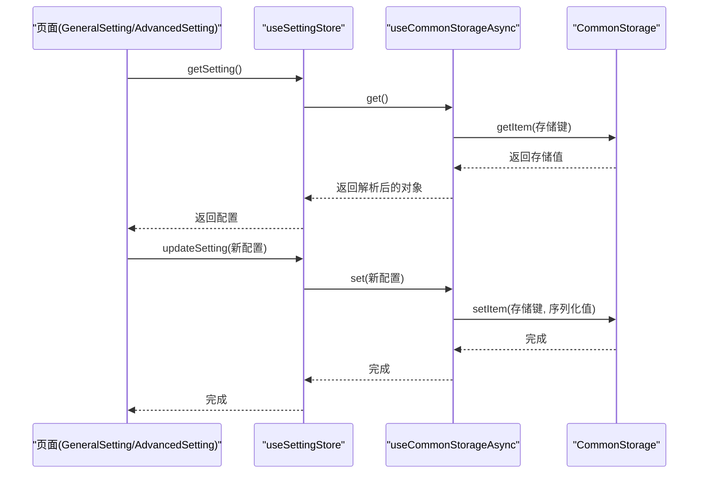
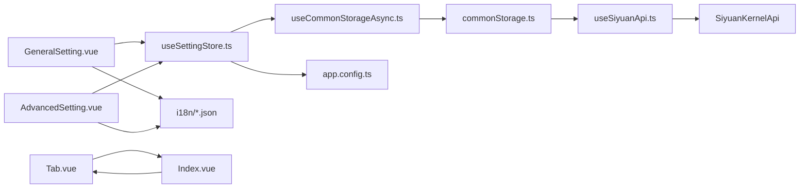

# 设置管理系统

<cite>
**本文引用的文件**
- [apps/siyuan/src/stores/useSettingStore.ts](file://apps/siyuan/src/stores/useSettingStore.ts)
- [apps/siyuan/src/stores/common/commonStorage.ts](file://apps/siyuan/src/stores/common/commonStorage.ts)
- [apps/siyuan/src/stores/common/useCommonStorageAsync.ts](file://apps/siyuan/src/stores/common/useCommonStorageAsync.ts)
- [apps/siyuan/src/pages/Setting/Index.vue](file://apps/siyuan/src/pages/Setting/Index.vue)
- [apps/siyuan/src/pages/Setting/GeneralSetting.vue](file://apps/siyuan/src/pages/Setting/GeneralSetting.vue)
- [apps/siyuan/src/pages/Setting/AdvancedSetting.vue](file://apps/siyuan/src/pages/Setting/AdvancedSetting.vue)
- [apps/siyuan/src/app.config.ts](file://apps/siyuan/src/app.config.ts)
- [apps/siyuan/src/composables/useSiyuanApi.ts](file://apps/siyuan/src/composables/useSiyuanApi.ts)
- [apps/siyuan/src/utils/appLogger.ts](file://apps/siyuan/src/utils/appLogger.ts)
- [apps/siyuan/src/i18n/en_US.json](file://apps/siyuan/src/i18n/en_US.json)
- [apps/siyuan/src/i18n/zh_CN.json](file://apps/siyuan/src/i18n/zh_CN.json)
- [apps/siyuan/src/Constants.ts](file://apps/siyuan/src/Constants.ts)
- [apps/siyuan/src/components/Tab.vue](file://apps/siyuan/src/components/Tab.vue)
- [apps/siyuan/src/utils/urlUtil.ts](file://apps/siyuan/src/utils/urlUtil.ts)
- [apps/siyuan/src/utils/pageUtil.ts](file://apps/siyuan/src/utils/pageUtil.ts)
- [apps/siyuan/src/bootstrap.ts](file://apps/siyuan/src/bootstrap.ts)
</cite>

## 目录
1. [简介](#简介)
2. [项目结构](#项目结构)
3. [核心组件](#核心组件)
4. [架构总览](#架构总览)
5. [详细组件分析](#详细组件分析)
6. [依赖关系分析](#依赖关系分析)
7. [性能考虑](#性能考虑)
8. [故障排查指南](#故障排查指南)
9. [结论](#结论)
10. [附录](#附录)

## 简介
本文件面向“设置管理系统”的技术文档，围绕基础设置与高级设置两大模块，系统性阐述以下内容：
- 配置项说明：网站 URL、分享模板、首页配置、多语言支持等
- 存储机制：本地存储、配置同步、备份与恢复思路
- 架构设计：状态管理、数据持久化、配置验证与日志
- 最佳实践与常见问题解决方案

## 项目结构
设置管理由“前端页面 + 状态存储 + 通用存储适配 + 国际化资源”构成，采用 Vue 组合式 API 与 Pinia 风格的状态封装，结合思源内核 API 实现配置读写。

**图表来源**
- [apps/siyuan/src/pages/Setting/Index.vue:1-51](file://apps/siyuan/src/pages/Setting/Index.vue#L1-L51)
- [apps/siyuan/src/pages/Setting/GeneralSetting.vue:1-220](file://apps/siyuan/src/pages/Setting/GeneralSetting.vue#L1-L220)
- [apps/siyuan/src/pages/Setting/AdvancedSetting.vue:1-184](file://apps/siyuan/src/pages/Setting/AdvancedSetting.vue#L1-L184)
- [apps/siyuan/src/components/Tab.vue:1-147](file://apps/siyuan/src/components/Tab.vue#L1-L147)
- [apps/siyuan/src/stores/useSettingStore.ts:1-80](file://apps/siyuan/src/stores/useSettingStore.ts#L1-L80)
- [apps/siyuan/src/stores/common/useCommonStorageAsync.ts:1-91](file://apps/siyuan/src/stores/common/useCommonStorageAsync.ts#L1-L91)
- [apps/siyuan/src/stores/common/commonStorage.ts:1-88](file://apps/siyuan/src/stores/common/commonStorage.ts#L1-L88)
- [apps/siyuan/src/composables/useSiyuanApi.ts:1-30](file://apps/siyuan/src/composables/useSiyuanApi.ts#L1-L30)
- [apps/siyuan/src/app.config.ts:1-59](file://apps/siyuan/src/app.config.ts#L1-L59)
- [apps/siyuan/src/i18n/en_US.json:1-54](file://apps/siyuan/src/i18n/en_US.json#L1-L54)
- [apps/siyuan/src/i18n/zh_CN.json:1-53](file://apps/siyuan/src/i18n/zh_CN.json#L1-L53)

**章节来源**
- [apps/siyuan/src/pages/Setting/Index.vue:1-51](file://apps/siyuan/src/pages/Setting/Index.vue#L1-L51)
- [apps/siyuan/src/components/Tab.vue:1-147](file://apps/siyuan/src/components/Tab.vue#L1-L147)

## 核心组件
- 设置存储与读写：通过 useSettingStore 提供 getSetting/updateSetting，内部使用通用异步存储进行持久化。
- 通用存储适配：useCommonStorageAsync + CommonStorage 实现对 localStorage-like 的异步存取，底层通过 SiyuanKernelApi 文件读写。
- 页面与表单：GeneralSetting.vue 和 AdvancedSetting.vue 分别承载基础与高级配置项的输入与提交。
- 国际化：英文与中文 i18n 字段覆盖设置页文案与提示。
- 日志与常量：appLogger 提供统一日志；Constants.ts 提供环境常量。

**章节来源**
- [apps/siyuan/src/stores/useSettingStore.ts:1-80](file://apps/siyuan/src/stores/useSettingStore.ts#L1-L80)
- [apps/siyuan/src/stores/common/useCommonStorageAsync.ts:1-91](file://apps/siyuan/src/stores/common/useCommonStorageAsync.ts#L1-L91)
- [apps/siyuan/src/stores/common/commonStorage.ts:1-88](file://apps/siyuan/src/stores/common/commonStorage.ts#L1-L88)
- [apps/siyuan/src/pages/Setting/GeneralSetting.vue:1-220](file://apps/siyuan/src/pages/Setting/GeneralSetting.vue#L1-L220)
- [apps/siyuan/src/pages/Setting/AdvancedSetting.vue:1-184](file://apps/siyuan/src/pages/Setting/AdvancedSetting.vue#L1-L184)
- [apps/siyuan/src/i18n/en_US.json:1-54](file://apps/siyuan/src/i18n/en_US.json#L1-L54)
- [apps/siyuan/src/i18n/zh_CN.json:1-53](file://apps/siyuan/src/i18n/zh_CN.json#L1-L53)
- [apps/siyuan/src/utils/appLogger.ts:1-22](file://apps/siyuan/src/utils/appLogger.ts#L1-L22)
- [apps/siyuan/src/Constants.ts:1-16](file://apps/siyuan/src/Constants.ts#L1-L16)

## 架构总览
设置管理采用“页面 -> 存储 -> 适配器 -> 内核 API”的分层设计，保证配置读写与 UI 解耦，便于扩展与维护。

**图表来源**
- [apps/siyuan/src/pages/Setting/GeneralSetting.vue:104-118](file://apps/siyuan/src/pages/Setting/GeneralSetting.vue#L104-L118)
- [apps/siyuan/src/pages/Setting/AdvancedSetting.vue:52-65](file://apps/siyuan/src/pages/Setting/AdvancedSetting.vue#L52-L65)
- [apps/siyuan/src/stores/useSettingStore.ts:50-62](file://apps/siyuan/src/stores/useSettingStore.ts#L50-L62)
- [apps/siyuan/src/stores/common/useCommonStorageAsync.ts:57-59](file://apps/siyuan/src/stores/common/useCommonStorageAsync.ts#L57-L59)
- [apps/siyuan/src/stores/common/commonStorage.ts:80-84](file://apps/siyuan/src/stores/common/commonStorage.ts#L80-L84)

## 详细组件分析

### 配置模型与默认值（AppConfig）
- 支持字段：语言、站点 URL、站点标题/副标题/描述、首页文档 ID、页眉页脚、分享模板、主题模式与主题名、自定义 CSS 片段等。
- 默认值：集中定义于 AppConfig，作为初始加载与回退值。
- 扩展性：通过字符串索引签名兼容动态字段。

**图表来源**
- [apps/siyuan/src/app.config.ts:12-37](file://apps/siyuan/src/app.config.ts#L12-L37)

**章节来源**
- [apps/siyuan/src/app.config.ts:1-59](file://apps/siyuan/src/app.config.ts#L1-L59)

### 设置存储与读写（useSettingStore）
- 初始化：以 AppConfig 为默认值，通过 useCommonStorageAsync 进行读写。
- 读取：getSettingRef 计算属性首次访问时触发异步加载，缓存于 ref 中，后续直接返回缓存。
- 更新：updateSetting 合并新旧配置并写入存储；可选附加处理（如注入自定义 CSS）。
- 日志：统一通过 appLogger 输出调试与错误信息。

**图表来源**
- [apps/siyuan/src/stores/useSettingStore.ts:50-62](file://apps/siyuan/src/stores/useSettingStore.ts#L50-L62)
- [apps/siyuan/src/stores/useSettingStore.ts:64-76](file://apps/siyuan/src/stores/useSettingStore.ts#L64-L76)

**章节来源**
- [apps/siyuan/src/stores/useSettingStore.ts:1-80](file://apps/siyuan/src/stores/useSettingStore.ts#L1-L80)

### 通用异步存储（useCommonStorageAsync + CommonStorage）
- 类型推断：根据初始值自动判断序列化类型（字符串/数字/布尔/对象/日期/集合等），使用对应序列化器。
- 初始值策略：若存储为空，写入初始值并返回。
- 适配器：CommonStorage 将 getItem/setItem 映射到 SiyuanKernelApi 的文件读写接口，实现“localStorage-like”行为。

**图表来源**
- [apps/siyuan/src/stores/common/useCommonStorageAsync.ts:44-56](file://apps/siyuan/src/stores/common/useCommonStorageAsync.ts#L44-L56)
- [apps/siyuan/src/stores/common/commonStorage.ts:43-61](file://apps/siyuan/src/stores/common/commonStorage.ts#L43-L61)
- [apps/siyuan/src/stores/common/commonStorage.ts:80-84](file://apps/siyuan/src/stores/common/commonStorage.ts#L80-L84)

**章节来源**
- [apps/siyuan/src/stores/common/useCommonStorageAsync.ts:1-91](file://apps/siyuan/src/stores/common/useCommonStorageAsync.ts#L1-L91)
- [apps/siyuan/src/stores/common/commonStorage.ts:1-88](file://apps/siyuan/src/stores/common/commonStorage.ts#L1-L88)

### 设置页面与表单（基础/高级）
- 基础设置（GeneralSetting.vue）
  - 字段：自定义域名、首页文档 ID、浅色/深色主题、主题版本映射。
  - 行为：加载时从存储读取，保存时写回存储并提示结果。
- 高级设置（AdvancedSetting.vue）
  - 字段：站点标题/副标题/描述、页脚、分享模板。
  - 行为：加载时填充默认值或从存储读取，保存时写回存储并提示结果。
- 标签页（Tab.vue）
  - 支持垂直布局与切换事件，承载基础/高级两个设置页。

**图表来源**
- [apps/siyuan/src/pages/Setting/GeneralSetting.vue:95-101](file://apps/siyuan/src/pages/Setting/GeneralSetting.vue#L95-L101)
- [apps/siyuan/src/pages/Setting/GeneralSetting.vue:104-118](file://apps/siyuan/src/pages/Setting/GeneralSetting.vue#L104-L118)
- [apps/siyuan/src/pages/Setting/AdvancedSetting.vue:36-49](file://apps/siyuan/src/pages/Setting/AdvancedSetting.vue#L36-L49)
- [apps/siyuan/src/pages/Setting/AdvancedSetting.vue:52-65](file://apps/siyuan/src/pages/Setting/AdvancedSetting.vue#L52-L65)
- [apps/siyuan/src/stores/useSettingStore.ts:28-48](file://apps/siyuan/src/stores/useSettingStore.ts#L28-L48)
- [apps/siyuan/src/stores/useSettingStore.ts:50-62](file://apps/siyuan/src/stores/useSettingStore.ts#L50-L62)

**章节来源**
- [apps/siyuan/src/pages/Setting/GeneralSetting.vue:1-220](file://apps/siyuan/src/pages/Setting/GeneralSetting.vue#L1-L220)
- [apps/siyuan/src/pages/Setting/AdvancedSetting.vue:1-184](file://apps/siyuan/src/pages/Setting/AdvancedSetting.vue#L1-L184)
- [apps/siyuan/src/components/Tab.vue:1-147](file://apps/siyuan/src/components/Tab.vue#L1-L147)

### 多语言支持（i18n）
- 英文与中文两套资源，覆盖设置页标签、占位提示、操作反馈等。
- 页面通过 props.pluginInstance.i18n 读取对应文案，保证 UI 与逻辑解耦。

**章节来源**
- [apps/siyuan/src/i18n/en_US.json:1-54](file://apps/siyuan/src/i18n/en_US.json#L1-L54)
- [apps/siyuan/src/i18n/zh_CN.json:1-53](file://apps/siyuan/src/i18n/zh_CN.json#L1-L53)
- [apps/siyuan/src/pages/Setting/Index.vue:21-33](file://apps/siyuan/src/pages/Setting/Index.vue#L21-L33)

### 配置项详解与最佳实践

- 网站 URL 配置（siteUrl）
  - 作用：对外分享链接使用的根地址，建议包含协议与端口。
  - 建议：与实际反向代理或域名解析一致；开发环境下可通过 IP 切换工具辅助定位。
  - 参考工具：IP 切换与可用 Origin 获取工具。

- 首页配置（homePageId）
  - 作用：指定首页文档 ID，需为已分享文档。
  - 建议：通过页面工具提取当前文档 ID 并填入；避免重复设置。

- 主题配置（theme.lightTheme/darkTheme/themeVersion）
  - 作用：分别控制浅色/深色主题与主题版本号。
  - 建议：保持 lightTheme 与 darkTheme 的版本映射一致，避免视觉不一致。

- 分享模板（shareTemplate）
  - 作用：分享消息的模板，支持占位符 [title]、[url]、[expired]。
  - 建议：根据业务需求定制文案与有效期提示，提升用户体验。

- 页脚与描述（footer/siteDescription）
  - 作用：页脚支持 HTML，描述用于 SEO 与社交分享摘要。
  - 建议：页脚更新需重新分享以生效。

- 多语言支持（lang）
  - 作用：控制界面语言，默认从环境读取。
  - 建议：与 i18n 资源保持一致，避免文案缺失。

**章节来源**
- [apps/siyuan/src/app.config.ts:12-37](file://apps/siyuan/src/app.config.ts#L12-L37)
- [apps/siyuan/src/pages/Setting/GeneralSetting.vue:25-93](file://apps/siyuan/src/pages/Setting/GeneralSetting.vue#L25-L93)
- [apps/siyuan/src/pages/Setting/AdvancedSetting.vue:28-34](file://apps/siyuan/src/pages/Setting/AdvancedSetting.vue#L28-L34)
- [apps/siyuan/src/utils/urlUtil.ts:68-77](file://apps/siyuan/src/utils/urlUtil.ts#L68-L77)
- [apps/siyuan/src/utils/pageUtil.ts:14-21](file://apps/siyuan/src/utils/pageUtil.ts#L14-L21)

## 依赖关系分析

**图表来源**
- [apps/siyuan/src/pages/Setting/GeneralSetting.vue:1-220](file://apps/siyuan/src/pages/Setting/GeneralSetting.vue#L1-L220)
- [apps/siyuan/src/pages/Setting/AdvancedSetting.vue:1-184](file://apps/siyuan/src/pages/Setting/AdvancedSetting.vue#L1-L184)
- [apps/siyuan/src/stores/useSettingStore.ts:1-80](file://apps/siyuan/src/stores/useSettingStore.ts#L1-L80)
- [apps/siyuan/src/stores/common/useCommonStorageAsync.ts:1-91](file://apps/siyuan/src/stores/common/useCommonStorageAsync.ts#L1-L91)
- [apps/siyuan/src/stores/common/commonStorage.ts:1-88](file://apps/siyuan/src/stores/common/commonStorage.ts#L1-L88)
- [apps/siyuan/src/composables/useSiyuanApi.ts:1-30](file://apps/siyuan/src/composables/useSiyuanApi.ts#L1-L30)
- [apps/siyuan/src/app.config.ts:1-59](file://apps/siyuan/src/app.config.ts#L1-L59)
- [apps/siyuan/src/i18n/en_US.json:1-54](file://apps/siyuan/src/i18n/en_US.json#L1-L54)
- [apps/siyuan/src/i18n/zh_CN.json:1-53](file://apps/siyuan/src/i18n/zh_CN.json#L1-L53)
- [apps/siyuan/src/pages/Setting/Index.vue:1-51](file://apps/siyuan/src/pages/Setting/Index.vue#L1-L51)
- [apps/siyuan/src/components/Tab.vue:1-147](file://apps/siyuan/src/components/Tab.vue#L1-L147)

**章节来源**
- [apps/siyuan/src/Constants.ts:10-16](file://apps/siyuan/src/Constants.ts#L10-L16)
- [apps/siyuan/src/utils/appLogger.ts:20-22](file://apps/siyuan/src/utils/appLogger.ts#L20-L22)

## 性能考虑
- 缓存策略：getSettingRef 首次加载后缓存于 ref，避免重复 IO。
- 序列化成本：根据初始值类型自动选择序列化器，减少不必要的转换。
- 异步写入：setItem 为异步操作，避免阻塞 UI；建议批量更新时合并多次变更。
- 日志级别：仅在开发模式开启详细日志，生产环境关闭以降低开销。

[本节为通用指导，无需特定文件引用]

## 故障排查指南
- 无法保存配置
  - 检查存储键是否存在以及权限是否正确。
  - 查看日志输出定位异常。
- 配置未生效
  - 确认是否需要重新分享以应用页脚等变更。
  - 检查主题版本映射是否匹配。
- 开发环境无法访问
  - 使用 IP 切换工具获取可用 IP 并替换 origin。
  - 确认服务已在“设置->关于->网络服务器”中启用。

**章节来源**
- [apps/siyuan/src/stores/common/commonStorage.ts:43-61](file://apps/siyuan/src/stores/common/commonStorage.ts#L43-L61)
- [apps/siyuan/src/stores/common/commonStorage.ts:80-84](file://apps/siyuan/src/stores/common/commonStorage.ts#L80-L84)
- [apps/siyuan/src/utils/urlUtil.ts:68-77](file://apps/siyuan/src/utils/urlUtil.ts#L68-L77)
- [apps/siyuan/src/utils/appLogger.ts:20-22](file://apps/siyuan/src/utils/appLogger.ts#L20-L22)

## 结论
设置管理系统通过清晰的分层设计与完善的存储适配，实现了配置的持久化、可扩展与易维护。结合国际化与日志体系，能够满足多场景下的配置管理需求。建议在生产环境中关注缓存命中率与序列化性能，并持续完善配置校验与回滚机制。

[本节为总结，无需特定文件引用]

## 附录

### 配置项一览（基于模型）
- 基础信息：lang、siteUrl、siteTitle、siteSlogan、siteDescription、homePageId、header、footer、shareTemplate
- 主题：theme.mode、theme.lightTheme、theme.darkTheme、theme.themeVersion
- 自定义 CSS：customCss 数组（name/content）

**章节来源**
- [apps/siyuan/src/app.config.ts:12-37](file://apps/siyuan/src/app.config.ts#L12-L37)

### 页面与容器挂载
- 页面统一通过 bootstrap 创建应用实例并挂载到容器，确保设置页在不同运行环境下的一致性。

**章节来源**
- [apps/siyuan/src/bootstrap.ts:12-14](file://apps/siyuan/src/bootstrap.ts#L12-L14)