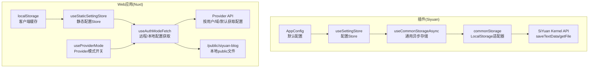
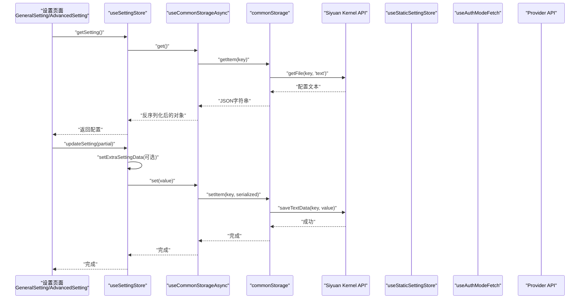
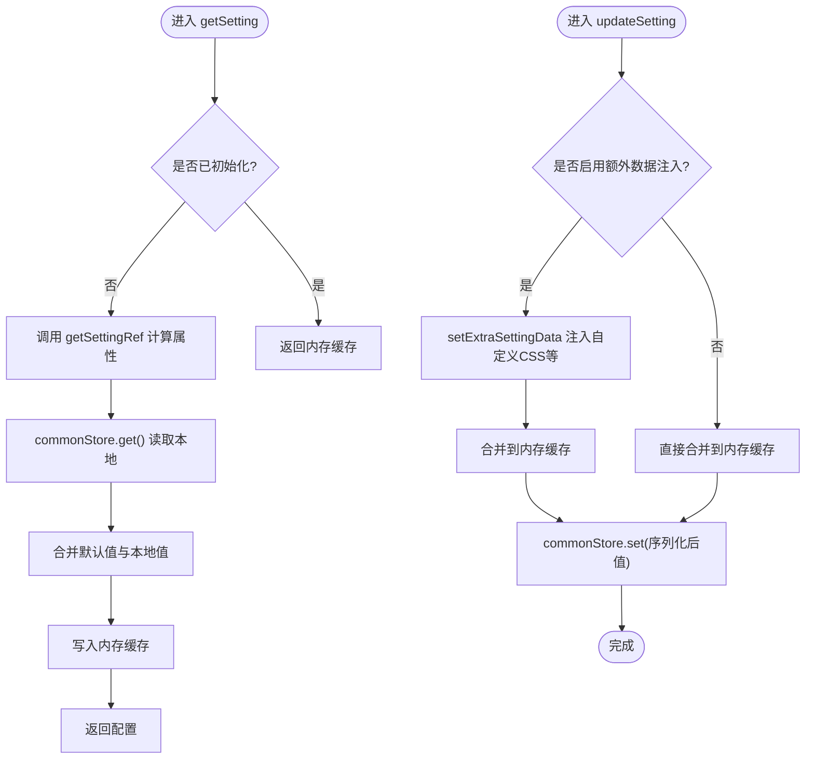
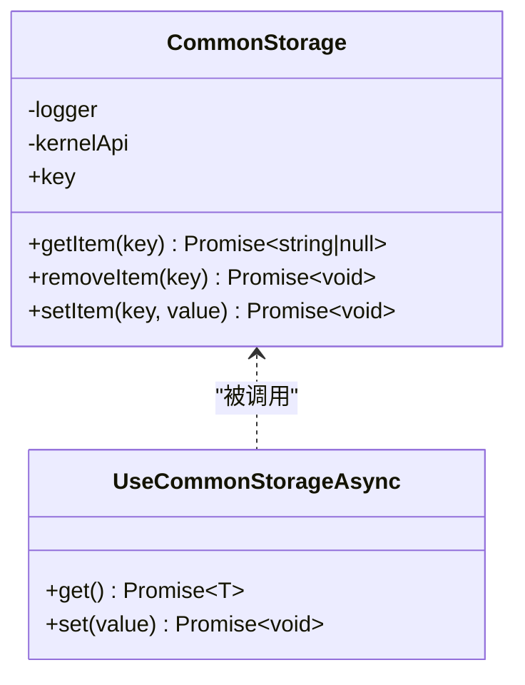
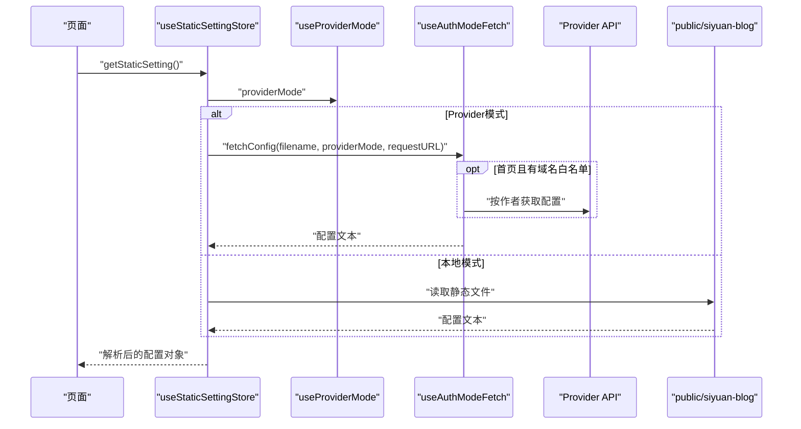
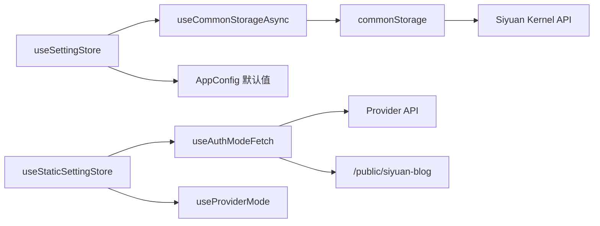

# 配置存储机制

<cite>
**本文档引用的文件**
- [apps/siyuan/src/stores/useSettingStore.ts](file://apps/siyuan/src/stores/useSettingStore.ts)
- [apps/siyuan/src/stores/common/commonStorage.ts](file://apps/siyuan/src/stores/common/commonStorage.ts)
- [apps/siyuan/src/stores/common/useCommonStorageAsync.ts](file://apps/siyuan/src/stores/common/useCommonStorageAsync.ts)
- [apps/app/stores/useStaticSettingStore.ts](file://apps/app/stores/useStaticSettingStore.ts)
- [apps/siyuan/src/app.config.ts](file://apps/siyuan/src/app.config.ts)
- [apps/siyuan/src/composables/useSiyuanApi.ts](file://apps/siyuan/src/composables/useSiyuanApi.ts)
- [apps/siyuan/src/utils/appLogger.ts](file://apps/siyuan/src/utils/appLogger.ts)
- [apps/siyuan/src/Constants.ts](file://apps/siyuan/src/Constants.ts)
- [apps/siyuan/src/pages/Setting/GeneralSetting.vue](file://apps/siyuan/src/pages/Setting/GeneralSetting.vue)
- [apps/siyuan/src/pages/Setting/AdvancedSetting.vue](file://apps/siyuan/src/pages/Setting/AdvancedSetting.vue)
- [apps/app/composables/useAuthModeFetch.ts](file://apps/app/composables/useAuthModeFetch.ts)
- [apps/app/composables/useProviderMode.ts](file://apps/app/composables/useProviderMode.ts)
</cite>

## 目录
1. [简介](#简介)
2. [项目结构](#项目结构)
3. [核心组件](#核心组件)
4. [架构总览](#架构总览)
5. [详细组件分析](#详细组件分析)
6. [依赖关系分析](#依赖关系分析)
7. [性能考量](#性能考量)
8. [故障排查指南](#故障排查指南)
9. [结论](#结论)
10. [附录](#附录)

## 简介
本文件系统性梳理了该 Siyuan 笔记插件项目的配置存储机制，涵盖本地存储实现、配置数据持久化、备份与恢复思路、Pinia Store 的使用与数据同步、错误处理策略、安全与性能优化、以及配置迁移与版本兼容性处理建议。文档以代码为依据，结合可视化图表帮助读者快速理解从配置读取、更新到持久化的完整流程。

## 项目结构
该项目采用“应用层 + 插件层”的双环境设计：
- 插件环境（Siyuan）：通过 Siyuan Kernel API 读写本地文件，实现配置持久化；使用 Pinia Store 管理配置状态。
- Web 应用环境（Nuxt）：支持两种配置来源模式（本地 public 文件与远端 Provider），并通过 Store 缓存与静态设置。

**图表来源**
- [apps/siyuan/src/stores/useSettingStore.ts:20-79](file://apps/siyuan/src/stores/useSettingStore.ts#L20-L79)
- [apps/siyuan/src/stores/common/useCommonStorageAsync.ts:21-63](file://apps/siyuan/src/stores/common/useCommonStorageAsync.ts#L21-L63)
- [apps/siyuan/src/stores/common/commonStorage.ts:25-85](file://apps/siyuan/src/stores/common/commonStorage.ts#L25-L85)
- [apps/siyuan/src/composables/useSiyuanApi.ts:17-29](file://apps/siyuan/src/composables/useSiyuanApi.ts#L17-L29)
- [apps/siyuan/src/app.config.ts:39-58](file://apps/siyuan/src/app.config.ts#L39-L58)
- [apps/app/stores/useStaticSettingStore.ts:10-27](file://apps/app/stores/useStaticSettingStore.ts#L10-L27)
- [apps/app/composables/useAuthModeFetch.ts:181-215](file://apps/app/composables/useAuthModeFetch.ts#L181-L215)
- [apps/app/composables/useProviderMode.ts:16-22](file://apps/app/composables/useProviderMode.ts#L16-L22)

**章节来源**
- [apps/siyuan/src/stores/useSettingStore.ts:20-79](file://apps/siyuan/src/stores/useSettingStore.ts#L20-L79)
- [apps/siyuan/src/stores/common/useCommonStorageAsync.ts:21-63](file://apps/siyuan/src/stores/common/useCommonStorageAsync.ts#L21-L63)
- [apps/siyuan/src/stores/common/commonStorage.ts:25-85](file://apps/siyuan/src/stores/common/commonStorage.ts#L25-L85)
- [apps/app/stores/useStaticSettingStore.ts:10-27](file://apps/app/stores/useStaticSettingStore.ts#L10-L27)
- [apps/app/composables/useAuthModeFetch.ts:181-215](file://apps/app/composables/useAuthModeFetch.ts#L181-L215)
- [apps/app/composables/useProviderMode.ts:16-22](file://apps/app/composables/useProviderMode.ts#L16-L22)

## 核心组件
- 插件侧配置 Store：封装配置读取、更新与额外数据注入逻辑，基于通用异步存储实现持久化。
- 通用异步存储：实现 StorageLikeAsync 接口，屏蔽底层存储差异，统一序列化/反序列化与初始值落盘。
- 本地适配器：通过 Siyuan Kernel API 实现文件读写，作为本地持久化后端。
- Web 应用侧静态配置 Store：根据 Provider 模式或本地 public 文件动态加载配置，并可缓存至 localStorage。
- 配置模型：定义站点基础信息、主题、自定义 CSS 等字段及默认值。

**章节来源**
- [apps/siyuan/src/stores/useSettingStore.ts:20-79](file://apps/siyuan/src/stores/useSettingStore.ts#L20-L79)
- [apps/siyuan/src/stores/common/useCommonStorageAsync.ts:21-63](file://apps/siyuan/src/stores/common/useCommonStorageAsync.ts#L21-L63)
- [apps/siyuan/src/stores/common/commonStorage.ts:25-85](file://apps/siyuan/src/stores/common/commonStorage.ts#L25-L85)
- [apps/app/stores/useStaticSettingStore.ts:10-27](file://apps/app/stores/useStaticSettingStore.ts#L10-L27)
- [apps/siyuan/src/app.config.ts:12-58](file://apps/siyuan/src/app.config.ts#L12-L58)

## 架构总览
下图展示了配置读取与更新的关键路径，包括插件侧与 Web 应用侧的差异与共同点。

**图表来源**
- [apps/siyuan/src/pages/Setting/GeneralSetting.vue:95-118](file://apps/siyuan/src/pages/Setting/GeneralSetting.vue#L95-L118)
- [apps/siyuan/src/pages/Setting/AdvancedSetting.vue:36-65](file://apps/siyuan/src/pages/Setting/AdvancedSetting.vue#L36-L65)
- [apps/siyuan/src/stores/useSettingStore.ts:38-76](file://apps/siyuan/src/stores/useSettingStore.ts#L38-L76)
- [apps/siyuan/src/stores/common/useCommonStorageAsync.ts:44-59](file://apps/siyuan/src/stores/common/useCommonStorageAsync.ts#L44-L59)
- [apps/siyuan/src/stores/common/commonStorage.ts:43-84](file://apps/siyuan/src/stores/common/commonStorage.ts#L43-L84)
- [apps/siyuan/src/composables/useSiyuanApi.ts:17-29](file://apps/siyuan/src/composables/useSiyuanApi.ts#L17-L29)

## 详细组件分析

### 插件侧配置 Store（Pinia）
- 设计要点
  - 使用 ref 与 computed 管理配置引用与惰性初始化，避免重复拉取。
  - 提供 getSetting 与 updateSetting 两个核心方法，支持增量更新与额外数据注入。
  - 支持可选的额外数据注入（如自定义 CSS），通过 Kernel API 请求片段并合并到最终配置。
- 数据流
  - 初始化时读取默认 AppConfig 作为初始值，若本地无数据则写入默认值。
  - 更新时先合并新值到内存缓存，再持久化到本地文件。
- 错误处理
  - 额外数据注入失败时记录错误日志但不阻断主流程。
  - 读取本地文件异常时返回空对象并回退为默认值。

**图表来源**
- [apps/siyuan/src/stores/useSettingStore.ts:28-76](file://apps/siyuan/src/stores/useSettingStore.ts#L28-L76)
- [apps/siyuan/src/stores/common/useCommonStorageAsync.ts:44-59](file://apps/siyuan/src/stores/common/useCommonStorageAsync.ts#L44-L59)

**章节来源**
- [apps/siyuan/src/stores/useSettingStore.ts:20-79](file://apps/siyuan/src/stores/useSettingStore.ts#L20-L79)
- [apps/siyuan/src/app.config.ts:39-58](file://apps/siyuan/src/app.config.ts#L39-L58)

### 通用异步存储与本地适配器
- 通用异步存储
  - 实现 StorageLikeAsync 接口，负责序列化与反序列化，自动处理初始值写入。
  - 根据传入的初始值类型推断序列化器，确保不同数据类型的正确持久化。
- 本地适配器
  - 通过 Siyuan Kernel API 的文件读写接口实现持久化。
  - 读取为空时返回空对象字符串，保证反序列化安全。
- 错误处理
  - 读取失败时记录错误日志并返回空值，避免中断流程。

**图表来源**
- [apps/siyuan/src/stores/common/commonStorage.ts:25-85](file://apps/siyuan/src/stores/common/commonStorage.ts#L25-L85)
- [apps/siyuan/src/stores/common/useCommonStorageAsync.ts:21-63](file://apps/siyuan/src/stores/common/useCommonStorageAsync.ts#L21-L63)

**章节来源**
- [apps/siyuan/src/stores/common/commonStorage.ts:25-85](file://apps/siyuan/src/stores/common/commonStorage.ts#L25-L85)
- [apps/siyuan/src/stores/common/useCommonStorageAsync.ts:21-91](file://apps/siyuan/src/stores/common/useCommonStorageAsync.ts#L21-L91)

### Web 应用侧静态配置 Store
- 功能概述
  - 在 Nuxt 环境下，根据 Provider 模式或本地 public 文件动态加载静态配置。
  - 支持域名白名单映射作者，按作者或默认方式获取配置。
  - 可将配置缓存到 localStorage，提升二次访问性能。
- 数据来源
  - Provider 模式：按用户/域/默认顺序尝试获取配置，失败回退到默认配置。
  - 本地模式：直接读取 /public/siyuan-blog 下的静态文件。
- 错误处理
  - Provider 请求失败时记录警告并回退到默认配置。
  - 非 2xx 状态码抛出错误，便于上层捕获。

**图表来源**
- [apps/app/stores/useStaticSettingStore.ts:10-27](file://apps/app/stores/useStaticSettingStore.ts#L10-L27)
- [apps/app/composables/useProviderMode.ts:16-22](file://apps/app/composables/useProviderMode.ts#L16-L22)
- [apps/app/composables/useAuthModeFetch.ts:181-215](file://apps/app/composables/useAuthModeFetch.ts#L181-L215)

**章节来源**
- [apps/app/stores/useStaticSettingStore.ts:10-27](file://apps/app/stores/useStaticSettingStore.ts#L10-L27)
- [apps/app/composables/useAuthModeFetch.ts:181-215](file://apps/app/composables/useAuthModeFetch.ts#L181-L215)
- [apps/app/composables/useProviderMode.ts:16-22](file://apps/app/composables/useProviderMode.ts#L16-L22)

### 配置模型与默认值
- 配置模型包含语言、站点信息、主题、分享模板、自定义 CSS 等字段。
- 默认值集中定义于 AppConfig，作为初始化与回退的基准。
- 支持扩展字段签名，兼容未来新增字段。

**章节来源**
- [apps/siyuan/src/app.config.ts:12-58](file://apps/siyuan/src/app.config.ts#L12-L58)

### 页面交互与数据同步
- 基础设置与高级设置页面通过 Pinia Store 读取与更新配置，提交后弹窗提示结果。
- 页面在挂载时从 Store 读取配置并填充表单，提交时将变更合并后写入 Store 与本地存储。

**章节来源**
- [apps/siyuan/src/pages/Setting/GeneralSetting.vue:95-118](file://apps/siyuan/src/pages/Setting/GeneralSetting.vue#L95-L118)
- [apps/siyuan/src/pages/Setting/AdvancedSetting.vue:36-65](file://apps/siyuan/src/pages/Setting/AdvancedSetting.vue#L36-L65)

## 依赖关系分析
- 插件侧
  - useSettingStore 依赖 useCommonStorageAsync 与 useSiyuanApi。
  - useCommonStorageAsync 依赖 CommonStorage 与序列化器。
  - CommonStorage 依赖 Siyuan Kernel API。
- Web 应用侧
  - useStaticSettingStore 依赖 useAuthModeFetch 与 useProviderMode。
  - useAuthModeFetch 内部根据 Provider 模式选择远程或本地获取路径。

**图表来源**
- [apps/siyuan/src/stores/useSettingStore.ts:20-79](file://apps/siyuan/src/stores/useSettingStore.ts#L20-L79)
- [apps/siyuan/src/stores/common/useCommonStorageAsync.ts:21-63](file://apps/siyuan/src/stores/common/useCommonStorageAsync.ts#L21-L63)
- [apps/siyuan/src/stores/common/commonStorage.ts:25-85](file://apps/siyuan/src/stores/common/commonStorage.ts#L25-L85)
- [apps/app/stores/useStaticSettingStore.ts:10-27](file://apps/app/stores/useStaticSettingStore.ts#L10-L27)
- [apps/app/composables/useAuthModeFetch.ts:181-215](file://apps/app/composables/useAuthModeFetch.ts#L181-L215)
- [apps/app/composables/useProviderMode.ts:16-22](file://apps/app/composables/useProviderMode.ts#L16-L22)

**章节来源**
- [apps/siyuan/src/stores/useSettingStore.ts:20-79](file://apps/siyuan/src/stores/useSettingStore.ts#L20-L79)
- [apps/siyuan/src/stores/common/useCommonStorageAsync.ts:21-63](file://apps/siyuan/src/stores/common/useCommonStorageAsync.ts#L21-L63)
- [apps/siyuan/src/stores/common/commonStorage.ts:25-85](file://apps/siyuan/src/stores/common/commonStorage.ts#L25-L85)
- [apps/app/stores/useStaticSettingStore.ts:10-27](file://apps/app/stores/useStaticSettingStore.ts#L10-L27)
- [apps/app/composables/useAuthModeFetch.ts:181-215](file://apps/app/composables/useAuthModeFetch.ts#L181-L215)
- [apps/app/composables/useProviderMode.ts:16-22](file://apps/app/composables/useProviderMode.ts#L16-L22)

## 性能考量
- 惰性初始化与内存缓存
  - 插件侧通过 ref 缓存配置，避免重复读取本地文件。
- 序列化与初始值落盘
  - 初次读取为空时自动写入默认值，减少后续分支判断成本。
- Provider 模式下的客户端缓存
  - Web 应用侧将配置写入 localStorage，降低重复请求与解析成本。
- 建议优化
  - 对频繁更新的字段进行防抖/节流。
  - 对大体积配置（如自定义 CSS）进行分片或按需加载。
  - 在 Provider 模式下增加本地缓存失效策略与版本号校验。

[本节为通用性能建议，无需特定文件引用]

## 故障排查指南
- 本地读取失败
  - 现象：读取配置为空或报错。
  - 排查：检查文件路径与权限，确认 Siyuan Kernel API 可用；查看日志定位异常。
- Provider 请求失败
  - 现象：远程配置获取失败，回退默认值。
  - 排查：确认 Provider 地址与鉴权配置；检查网络连通性与响应状态码。
- 配置更新未生效
  - 现象：页面显示旧配置。
  - 排查：确认 updateSetting 是否被调用；检查序列化/反序列化过程；验证持久化是否成功。
- 日志定位
  - 使用统一日志工厂创建日志器，便于在不同模块中定位问题。

**章节来源**
- [apps/siyuan/src/stores/common/commonStorage.ts:43-84](file://apps/siyuan/src/stores/common/commonStorage.ts#L43-L84)
- [apps/app/composables/useAuthModeFetch.ts:181-215](file://apps/app/composables/useAuthModeFetch.ts#L181-L215)
- [apps/siyuan/src/utils/appLogger.ts:20-22](file://apps/siyuan/src/utils/appLogger.ts#L20-L22)

## 结论
该配置存储机制在插件与 Web 应用两端分别提供了稳定的数据持久化与灵活的配置来源。通过 Pinia Store、通用异步存储与本地适配器，实现了跨环境的一致体验；通过 Provider 模式与本地 public 文件，满足了多租户与离线场景的需求。建议在生产环境中进一步完善版本控制、备份恢复与迁移策略，以增强系统的可维护性与可靠性。

[本节为总结性内容，无需特定文件引用]

## 附录

### 备份与恢复建议
- 备份
  - 定期导出配置文件（如 static.app.config.json 或对应路径），保存至安全位置。
  - 记录当前版本号与配置快照时间戳，便于回滚。
- 恢复
  - 将备份文件写回原路径，重启应用后自动加载。
  - 若出现格式不兼容，优先使用默认值回退，再逐步修复。

[本节为概念性建议，无需特定文件引用]

### 版本兼容与迁移
- 字段演进
  - 保持 AppConfig 的扩展字段签名，新增字段默认值应向后兼容。
- 版本标记
  - 在配置中加入版本字段，迁移时按版本号执行升级脚本。
- 回滚策略
  - 迁移失败时回退到上一版本配置，避免影响线上服务。

[本节为概念性建议，无需特定文件引用]