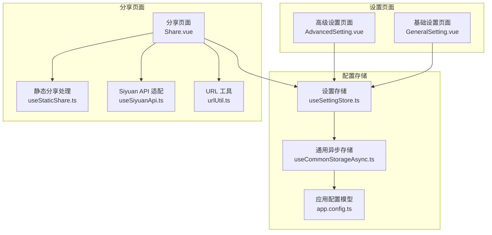
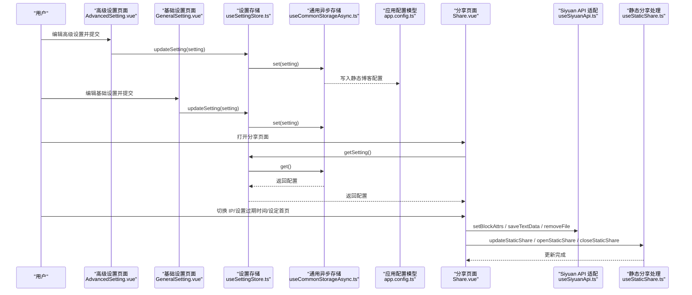
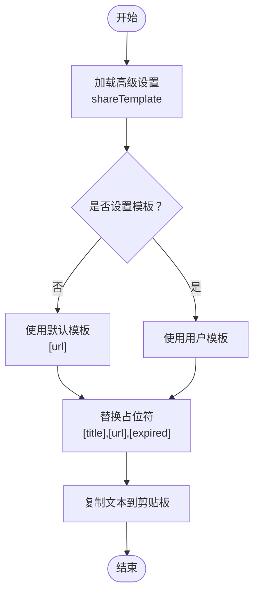
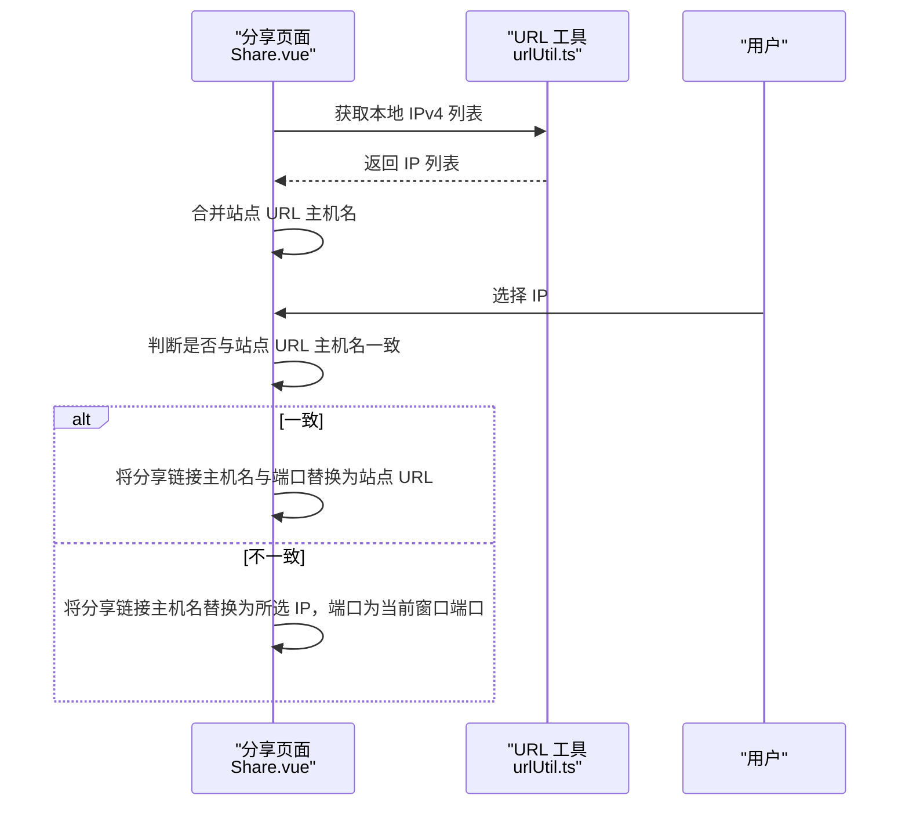
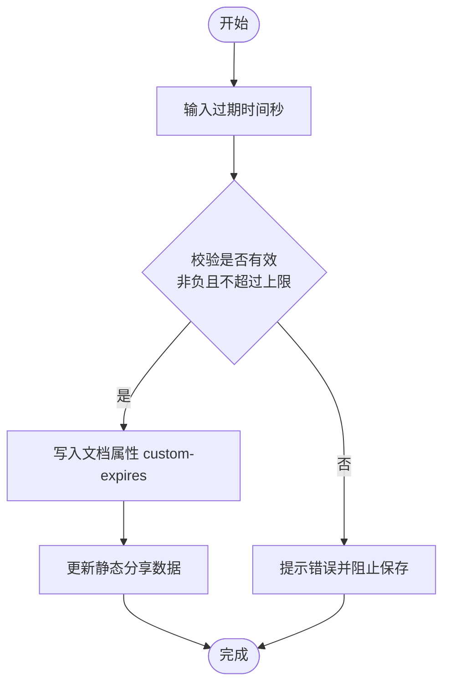
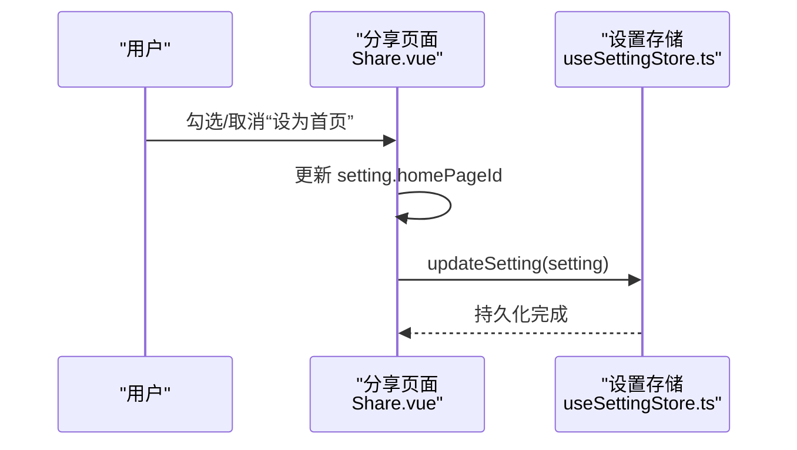
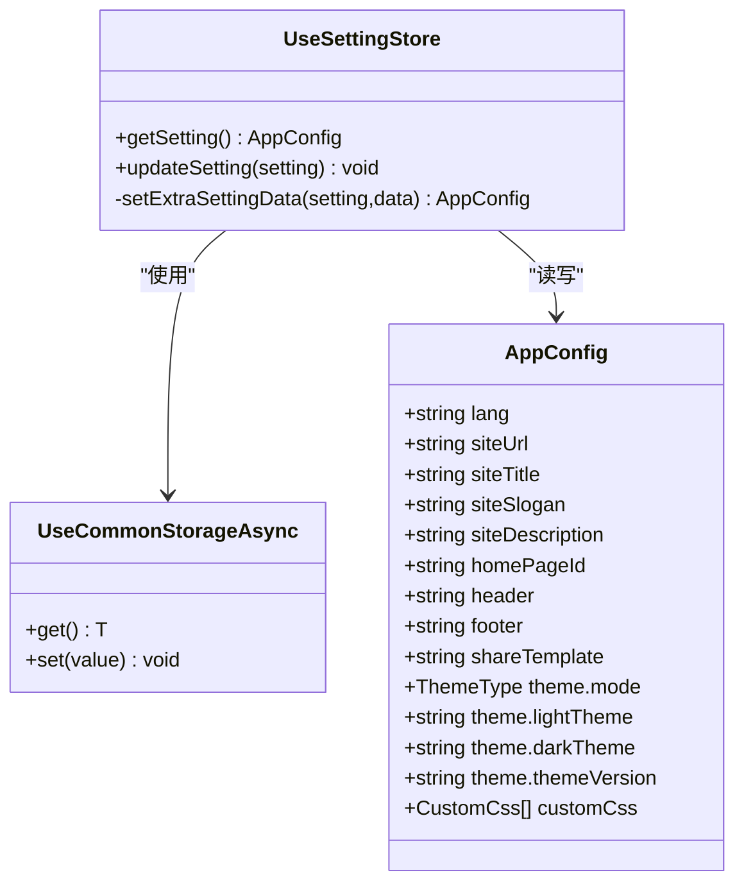
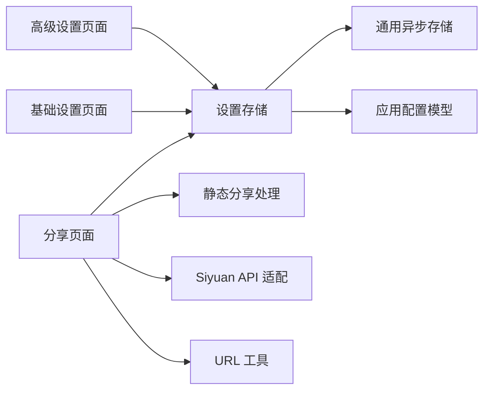

# 高级设置

<cite>
**本文引用的文件**
- [apps/siyuan/src/pages/Setting/AdvancedSetting.vue](file://apps/siyuan/src/pages/Setting/AdvancedSetting.vue)
- [apps/siyuan/src/pages/Setting/GeneralSetting.vue](file://apps/siyuan/src/pages/Setting/GeneralSetting.vue)
- [apps/siyuan/src/pages/Share.vue](file://apps/siyuan/src/pages/Share.vue)
- [apps/siyuan/src/stores/useSettingStore.ts](file://apps/siyuan/src/stores/useSettingStore.ts)
- [apps/siyuan/src/stores/common/useCommonStorageAsync.ts](file://apps/siyuan/src/stores/common/useCommonStorageAsync.ts)
- [apps/siyuan/src/composables/useStaticShare.ts](file://apps/siyuan/src/composables/useStaticShare.ts)
- [apps/siyuan/src/composables/useSiyuanApi.ts](file://apps/siyuan/src/composables/useSiyuanApi.ts)
- [apps/siyuan/src/utils/urlUtil.ts](file://apps/siyuan/src/utils/urlUtil.ts)
- [apps/siyuan/src/app.config.ts](file://apps/siyuan/src/app.config.ts)
</cite>

## 目录
1. [简介](#简介)
2. [项目结构](#项目结构)
3. [核心组件](#核心组件)
4. [架构总览](#架构总览)
5. [详细组件分析](#详细组件分析)
6. [依赖关系分析](#依赖关系分析)
7. [性能考量](#性能考量)
8. [故障排查指南](#故障排查指南)
9. [结论](#结论)
10. [附录](#附录)

## 简介
本文件面向“高级设置”功能，系统性梳理并解释以下高级配置项的技术实现与使用方法：
- 分享模板配置（分享文案模板语法）
- IP 地址管理（站点域名与分享链接的主机名替换）
- 过期时间控制（custom-expires 属性与静态分享更新）
- 首页设置（主页文档 ID 的设定与清除）

文档将从数据结构、配置逻辑、验证机制与安全考虑等方面进行深入解析，并提供使用场景与最佳实践建议。

## 项目结构
高级设置涉及前端设置页面、全局配置存储、分享页面以及与思源内核 API 的交互。关键模块如下：
- 设置页面：高级设置与基础设置页面负责收集用户输入并持久化
- 配置存储：基于通用异步存储封装，统一读写静态博客配置
- 分享页面：在分享流程中应用高级设置（模板、IP、过期时间、首页）
- 工具与适配：URL 工具、API 适配、静态分享处理

图表来源
- [apps/siyuan/src/pages/Setting/AdvancedSetting.vue:1-184](file://apps/siyuan/src/pages/Setting/AdvancedSetting.vue#L1-L184)
- [apps/siyuan/src/pages/Setting/GeneralSetting.vue:95-170](file://apps/siyuan/src/pages/Setting/GeneralSetting.vue#L95-L170)
- [apps/siyuan/src/stores/useSettingStore.ts:1-80](file://apps/siyuan/src/stores/useSettingStore.ts#L1-L80)
- [apps/siyuan/src/stores/common/useCommonStorageAsync.ts:1-91](file://apps/siyuan/src/stores/common/useCommonStorageAsync.ts#L1-L91)
- [apps/siyuan/src/app.config.ts:12-58](file://apps/siyuan/src/app.config.ts#L12-L58)
- [apps/siyuan/src/pages/Share.vue:1-499](file://apps/siyuan/src/pages/Share.vue#L1-L499)
- [apps/siyuan/src/composables/useStaticShare.ts:1-97](file://apps/siyuan/src/composables/useStaticShare.ts#L1-L97)
- [apps/siyuan/src/composables/useSiyuanApi.ts:1-30](file://apps/siyuan/src/composables/useSiyuanApi.ts#L1-L30)
- [apps/siyuan/src/utils/urlUtil.ts:1-78](file://apps/siyuan/src/utils/urlUtil.ts#L1-L78)

章节来源
- [apps/siyuan/src/pages/Setting/AdvancedSetting.vue:1-184](file://apps/siyuan/src/pages/Setting/AdvancedSetting.vue#L1-L184)
- [apps/siyuan/src/pages/Setting/GeneralSetting.vue:95-170](file://apps/siyuan/src/pages/Setting/GeneralSetting.vue#L95-L170)
- [apps/siyuan/src/stores/useSettingStore.ts:1-80](file://apps/siyuan/src/stores/useSettingStore.ts#L1-L80)
- [apps/siyuan/src/stores/common/useCommonStorageAsync.ts:1-91](file://apps/siyuan/src/stores/common/useCommonStorageAsync.ts#L1-L91)
- [apps/siyuan/src/app.config.ts:12-58](file://apps/siyuan/src/app.config.ts#L12-L58)
- [apps/siyuan/src/pages/Share.vue:1-499](file://apps/siyuan/src/pages/Share.vue#L1-L499)
- [apps/siyuan/src/composables/useStaticShare.ts:1-97](file://apps/siyuan/src/composables/useStaticShare.ts#L1-L97)
- [apps/siyuan/src/composables/useSiyuanApi.ts:1-30](file://apps/siyuan/src/composables/useSiyuanApi.ts#L1-L30)
- [apps/siyuan/src/utils/urlUtil.ts:1-78](file://apps/siyuan/src/utils/urlUtil.ts#L1-L78)

## 核心组件
- 高级设置页面：提供站点标题、副标题、描述、页脚、分享模板等字段的编辑与提交
- 基础设置页面：提供站点 URL、主页 ID、主题等基础配置
- 设置存储：封装配置读取与写入，支持异步存储与初始值注入
- 分享页面：在分享开关、复制链接、IP 切换、过期时间、首页设置等功能中应用高级设置
- 静态分享处理：将文章内容与资源导出至公开目录，供静态访问
- URL 工具：获取本地可用 IP 列表，辅助分享链接的主机名替换
- 应用配置模型：定义高级设置与基础设置的数据结构与默认值

章节来源
- [apps/siyuan/src/pages/Setting/AdvancedSetting.vue:28-65](file://apps/siyuan/src/pages/Setting/AdvancedSetting.vue#L28-L65)
- [apps/siyuan/src/pages/Setting/GeneralSetting.vue:95-118](file://apps/siyuan/src/pages/Setting/GeneralSetting.vue#L95-L118)
- [apps/siyuan/src/stores/useSettingStore.ts:20-79](file://apps/siyuan/src/stores/useSettingStore.ts#L20-L79)
- [apps/siyuan/src/pages/Share.vue:38-48](file://apps/siyuan/src/pages/Share.vue#L38-L48)
- [apps/siyuan/src/composables/useStaticShare.ts:17-96](file://apps/siyuan/src/composables/useStaticShare.ts#L17-L96)
- [apps/siyuan/src/utils/urlUtil.ts:47-66](file://apps/siyuan/src/utils/urlUtil.ts#L47-L66)
- [apps/siyuan/src/app.config.ts:12-58](file://apps/siyuan/src/app.config.ts#L12-L58)

## 架构总览
高级设置通过“页面 -> 存储 -> 内核 API”的链路实现配置持久化与分享流程联动。分享页面在渲染分享链接、切换 IP、设置过期时间、设定首页时，均会读取或更新高级设置。

图表来源
- [apps/siyuan/src/pages/Setting/AdvancedSetting.vue:52-65](file://apps/siyuan/src/pages/Setting/AdvancedSetting.vue#L52-L65)
- [apps/siyuan/src/pages/Setting/GeneralSetting.vue:104-118](file://apps/siyuan/src/pages/Setting/GeneralSetting.vue#L104-L118)
- [apps/siyuan/src/stores/useSettingStore.ts:50-62](file://apps/siyuan/src/stores/useSettingStore.ts#L50-L62)
- [apps/siyuan/src/stores/common/useCommonStorageAsync.ts:44-60](file://apps/siyuan/src/stores/common/useCommonStorageAsync.ts#L44-L60)
- [apps/siyuan/src/pages/Share.vue:219-244](file://apps/siyuan/src/pages/Share.vue#L219-L244)
- [apps/siyuan/src/composables/useStaticShare.ts:22-53](file://apps/siyuan/src/composables/useStaticShare.ts#L22-L53)
- [apps/siyuan/src/composables/useSiyuanApi.ts:17-29](file://apps/siyuan/src/composables/useSiyuanApi.ts#L17-L29)

## 详细组件分析

### 分享模板配置
- 数据结构
  - 高级设置页面维护一个包含分享模板字段的对象，提交后写入全局配置
  - 应用配置模型中提供 shareTemplate 字段，默认值为简化链接模板
- 模板语法
  - 在分享页面复制链接时，根据模板进行占位符替换
  - 支持的占位符包括：标题、链接、有效期（秒）
  - 当有效期为空或为 0 时，替换为“永久”
- 验证与回退
  - 若未设置模板，回退到当前分享链接
  - 若模板为空，回退到内置默认模板

图表来源
- [apps/siyuan/src/pages/Setting/AdvancedSetting.vue:46-48](file://apps/siyuan/src/pages/Setting/AdvancedSetting.vue#L46-L48)
- [apps/siyuan/src/pages/Share.vue:121-137](file://apps/siyuan/src/pages/Share.vue#L121-L137)
- [apps/siyuan/src/app.config.ts:48-48](file://apps/siyuan/src/app.config.ts#L48-L48)

章节来源
- [apps/siyuan/src/pages/Setting/AdvancedSetting.vue:28-65](file://apps/siyuan/src/pages/Setting/AdvancedSetting.vue#L28-L65)
- [apps/siyuan/src/pages/Share.vue:121-137](file://apps/siyuan/src/pages/Share.vue#L121-L137)
- [apps/siyuan/src/app.config.ts:12-58](file://apps/siyuan/src/app.config.ts#L12-L58)

### IP 地址管理
- 数据来源
  - 分享页面初始化时，从运行环境获取可用 IPv4 列表，并合并站点 URL 中的主机名
- 主机名替换逻辑
  - 当分享链接的主机名与站点 URL 的主机名一致时，将分享链接的主机名与端口替换为站点 URL 的主机名与端口
  - 否则，将分享链接的主机名替换为用户选择的 IP，并保留当前窗口的端口
- 工具函数
  - URL 工具提供获取本地可用 IP 列表的能力，确保在不同设备上生成可访问的分享链接

图表来源
- [apps/siyuan/src/pages/Share.vue:50-60](file://apps/siyuan/src/pages/Share.vue#L50-L60)
- [apps/siyuan/src/pages/Share.vue:139-164](file://apps/siyuan/src/pages/Share.vue#L139-L164)
- [apps/siyuan/src/utils/urlUtil.ts:47-66](file://apps/siyuan/src/utils/urlUtil.ts#L47-L66)

章节来源
- [apps/siyuan/src/pages/Share.vue:38-48](file://apps/siyuan/src/pages/Share.vue#L38-L48)
- [apps/siyuan/src/pages/Share.vue:139-164](file://apps/siyuan/src/pages/Share.vue#L139-L164)
- [apps/siyuan/src/utils/urlUtil.ts:15-66](file://apps/siyuan/src/utils/urlUtil.ts#L15-L66)

### 过期时间控制
- 数据结构
  - 分享页面维护一个过期时间字段（秒），默认为 0
  - 该值以自定义属性形式写入文档属性，作为“custom-expires”
- 控制逻辑
  - 用户输入过期时间后，点击保存
  - 校验范围：非负数且不超过最大值（例如 7 天的秒数上限）
  - 成功校验后，写入文档属性，并触发静态分享更新
- 静态分享更新
  - 通过静态分享处理模块重新生成公开 JSON 与资源目录，使过期时间生效

图表来源
- [apps/siyuan/src/pages/Share.vue:183-202](file://apps/siyuan/src/pages/Share.vue#L183-L202)
- [apps/siyuan/src/composables/useStaticShare.ts:71-74](file://apps/siyuan/src/composables/useStaticShare.ts#L71-L74)

章节来源
- [apps/siyuan/src/pages/Share.vue:183-202](file://apps/siyuan/src/pages/Share.vue#L183-L202)
- [apps/siyuan/src/composables/useStaticShare.ts:17-96](file://apps/siyuan/src/composables/useStaticShare.ts#L17-L96)

### 首页设置
- 数据结构
  - 全局配置中维护主页文档 ID 字段
- 设置逻辑
  - 在分享页面勾选“设为首页”时，将当前文档 ID 写入全局配置
  - 取消勾选时，清空主页 ID
  - 提交后通过设置存储持久化

图表来源
- [apps/siyuan/src/pages/Share.vue:166-181](file://apps/siyuan/src/pages/Share.vue#L166-L181)
- [apps/siyuan/src/stores/useSettingStore.ts:50-62](file://apps/siyuan/src/stores/useSettingStore.ts#L50-L62)

章节来源
- [apps/siyuan/src/pages/Share.vue:166-181](file://apps/siyuan/src/pages/Share.vue#L166-L181)
- [apps/siyuan/src/stores/useSettingStore.ts:20-79](file://apps/siyuan/src/stores/useSettingStore.ts#L20-L79)

### 配置持久化与读取
- 存储模型
  - 使用通用异步存储封装，自动处理序列化与初始值注入
  - 配置文件路径固定，避免跨版本迁移带来的兼容问题
- 读取策略
  - 首次读取时若无数据，注入默认值并写入存储
  - 后续读取直接返回缓存或从存储获取
- 写入策略
  - 合并新配置与现有配置，保证部分字段更新不影响其他字段

图表来源
- [apps/siyuan/src/app.config.ts:12-58](file://apps/siyuan/src/app.config.ts#L12-L58)
- [apps/siyuan/src/stores/useSettingStore.ts:20-79](file://apps/siyuan/src/stores/useSettingStore.ts#L20-L79)
- [apps/siyuan/src/stores/common/useCommonStorageAsync.ts:21-62](file://apps/siyuan/src/stores/common/useCommonStorageAsync.ts#L21-L62)

章节来源
- [apps/siyuan/src/stores/useSettingStore.ts:20-79](file://apps/siyuan/src/stores/useSettingStore.ts#L20-L79)
- [apps/siyuan/src/stores/common/useCommonStorageAsync.ts:21-62](file://apps/siyuan/src/stores/common/useCommonStorageAsync.ts#L21-L62)
- [apps/siyuan/src/app.config.ts:12-58](file://apps/siyuan/src/app.config.ts#L12-L58)

## 依赖关系分析
- 组件耦合
  - 高级设置页面与基础设置页面均依赖设置存储进行配置读写
  - 分享页面依赖设置存储、静态分享处理与 API 适配
- 外部依赖
  - 思源内核 API 用于写入文档属性与文件系统操作
  - URL 工具提供网络接口枚举与本地 IP 推断能力
- 循环依赖
  - 未发现直接循环依赖；各模块职责清晰，通过存储与 API 适配解耦

图表来源
- [apps/siyuan/src/pages/Setting/AdvancedSetting.vue:10-25](file://apps/siyuan/src/pages/Setting/AdvancedSetting.vue#L10-L25)
- [apps/siyuan/src/pages/Setting/GeneralSetting.vue:95-118](file://apps/siyuan/src/pages/Setting/GeneralSetting.vue#L95-L118)
- [apps/siyuan/src/pages/Share.vue:18-34](file://apps/siyuan/src/pages/Share.vue#L18-L34)
- [apps/siyuan/src/stores/useSettingStore.ts:20-79](file://apps/siyuan/src/stores/useSettingStore.ts#L20-L79)
- [apps/siyuan/src/composables/useStaticShare.ts:17-96](file://apps/siyuan/src/composables/useStaticShare.ts#L17-L96)
- [apps/siyuan/src/composables/useSiyuanApi.ts:17-29](file://apps/siyuan/src/composables/useSiyuanApi.ts#L17-L29)
- [apps/siyuan/src/utils/urlUtil.ts:47-66](file://apps/siyuan/src/utils/urlUtil.ts#L47-L66)

章节来源
- [apps/siyuan/src/pages/Setting/AdvancedSetting.vue:10-25](file://apps/siyuan/src/pages/Setting/AdvancedSetting.vue#L10-L25)
- [apps/siyuan/src/pages/Setting/GeneralSetting.vue:95-118](file://apps/siyuan/src/pages/Setting/GeneralSetting.vue#L95-L118)
- [apps/siyuan/src/pages/Share.vue:18-34](file://apps/siyuan/src/pages/Share.vue#L18-L34)
- [apps/siyuan/src/stores/useSettingStore.ts:20-79](file://apps/siyuan/src/stores/useSettingStore.ts#L20-L79)
- [apps/siyuan/src/composables/useStaticShare.ts:17-96](file://apps/siyuan/src/composables/useStaticShare.ts#L17-L96)
- [apps/siyuan/src/composables/useSiyuanApi.ts:17-29](file://apps/siyuan/src/composables/useSiyuanApi.ts#L17-L29)
- [apps/siyuan/src/utils/urlUtil.ts:47-66](file://apps/siyuan/src/utils/urlUtil.ts#L47-L66)

## 性能考量
- 配置读写
  - 使用异步存储封装，避免阻塞主线程；首次读取失败时自动注入默认值，减少异常分支
- 分享更新
  - 静态分享更新仅在过期时间变更或分享状态切换时触发，降低不必要的 IO
- IP 列表
  - 本地 IP 列表去重与过滤，减少无效地址对用户体验的影响

## 故障排查指南
- 分享链接无法访问
  - 检查站点 URL 与分享链接的主机名是否一致；若不一致，确认已正确切换 IP 并保留端口
  - 参考：[apps/siyuan/src/pages/Share.vue:139-164](file://apps/siyuan/src/pages/Share.vue#L139-L164)
- 过期时间无效
  - 确认输入值为非负数且不超过上限；保存后检查文档属性 custom-expires 是否更新
  - 参考：[apps/siyuan/src/pages/Share.vue:183-202](file://apps/siyuan/src/pages/Share.vue#L183-L202)
- 首页设置未生效
  - 确认已保存设置；检查全局配置中的主页 ID 是否与当前文档 ID 一致
  - 参考：[apps/siyuan/src/pages/Share.vue:166-181](file://apps/siyuan/src/pages/Share.vue#L166-L181)
- 配置未持久化
  - 检查设置存储是否成功写入；确认存储路径与默认值注入逻辑
  - 参考：[apps/siyuan/src/stores/useSettingStore.ts:50-62](file://apps/siyuan/src/stores/useSettingStore.ts#L50-L62), [apps/siyuan/src/stores/common/useCommonStorageAsync.ts:44-60](file://apps/siyuan/src/stores/common/useCommonStorageAsync.ts#L44-L60)

章节来源
- [apps/siyuan/src/pages/Share.vue:139-164](file://apps/siyuan/src/pages/Share.vue#L139-L164)
- [apps/siyuan/src/pages/Share.vue:183-202](file://apps/siyuan/src/pages/Share.vue#L183-L202)
- [apps/siyuan/src/pages/Share.vue:166-181](file://apps/siyuan/src/pages/Share.vue#L166-L181)
- [apps/siyuan/src/stores/useSettingStore.ts:50-62](file://apps/siyuan/src/stores/useSettingStore.ts#L50-L62)
- [apps/siyuan/src/stores/common/useCommonStorageAsync.ts:44-60](file://apps/siyuan/src/stores/common/useCommonStorageAsync.ts#L44-L60)

## 结论
高级设置通过统一的配置模型与存储机制，将分享模板、IP 管理、过期时间与首页设置整合为可维护、可扩展的功能集合。其设计强调：
- 明确的数据结构与默认值保障
- 严格的输入校验与错误反馈
- 与静态分享流程的无缝衔接
- 可靠的持久化与读取策略

## 附录
- 使用场景与最佳实践
  - 分享模板：建议包含标题与链接占位符，便于快速分享；可按需加入有效期提示
  - IP 管理：在多网卡环境下优先使用站点 URL 的主机名；内网访问时选择合适的本地 IP
  - 过期时间：合理设置有效期，避免过短影响体验或过长带来安全风险；定期清理过期分享
  - 首页设置：仅在确定为主页文档时启用，避免冲突
- 安全考虑
  - 静态分享内容公开，注意不要包含敏感信息
  - 过期时间应遵循最小权限原则，尽量缩短有效期
  - 首页设置应谨慎，避免误设造成入口混乱