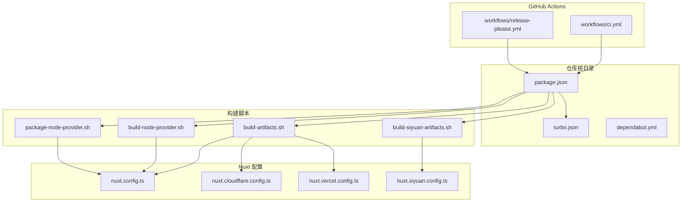
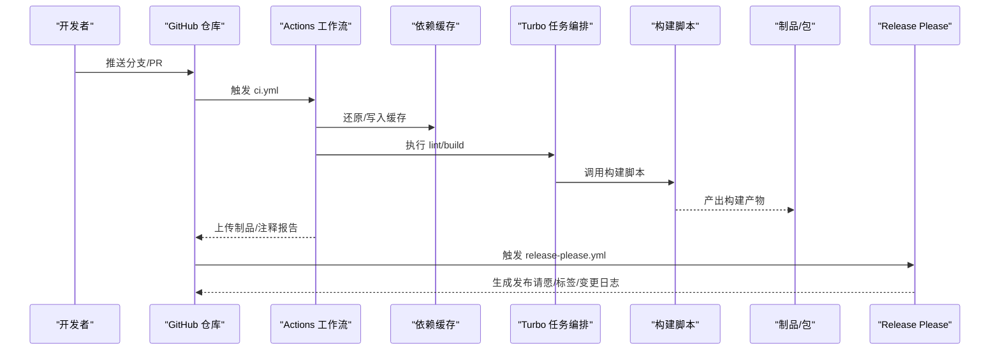
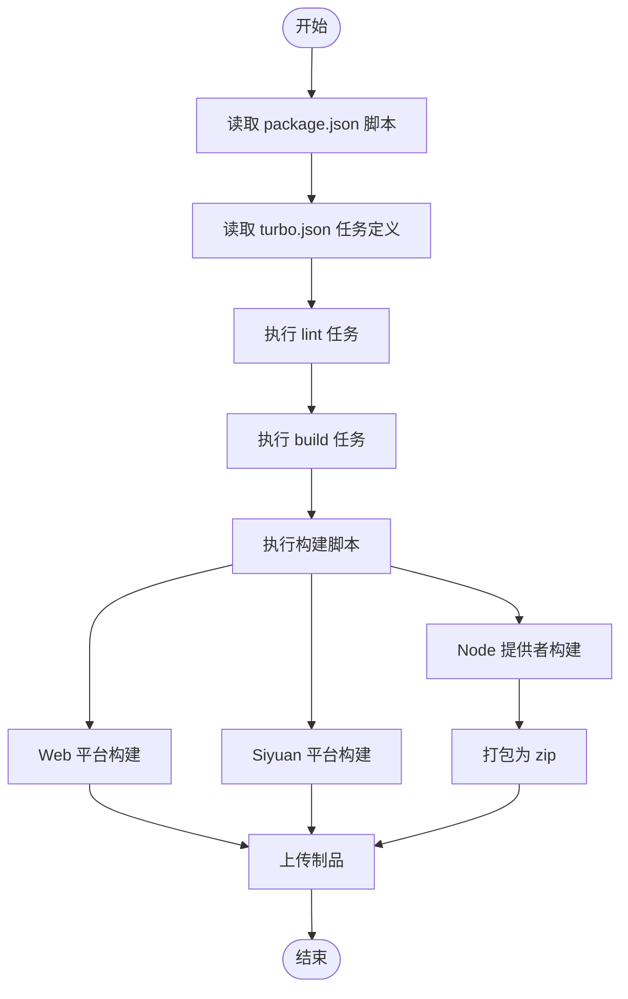
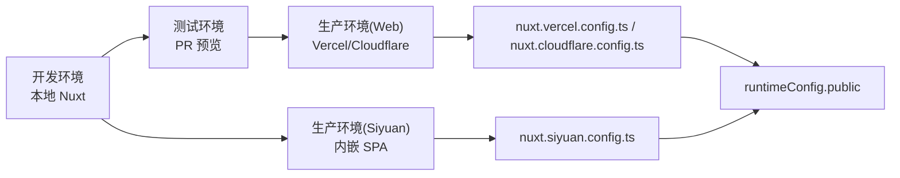
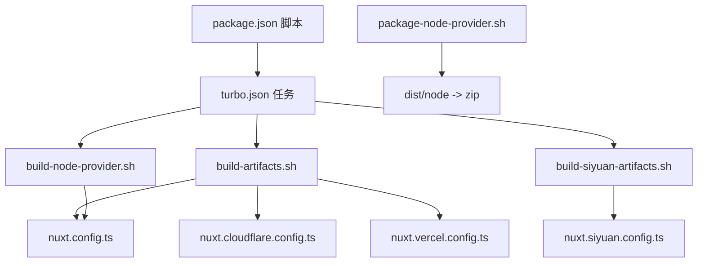

# CI/CD 流水线

<cite>
**本文引用的文件**
- [.github/dependabot.yml](file://.github/dependabot.yml)
- [.github/workflows/ci.yml](file://.github/workflows/ci.yml)
- [.github/workflows/release-please.yml](file://.github/workflows/release-please.yml)
- [package.json](file://package.json)
- [turbo.json](file://turbo.json)
- [build-artifacts.sh](file://build-artifacts.sh)
- [build-siyuan-artifacts.sh](file://build-siyuan-artifacts.sh)
- [build-node-provider.sh](file://build-node-provider.sh)
- [package-node-provider.sh](file://package-node-provider.sh)
- [apps/app/nuxt.config.ts](file://apps/app/nuxt.config.ts)
- [apps/app/nuxt.cloudflare.config.ts](file://apps/app/nuxt.cloudflare.config.ts)
- [apps/app/nuxt.vercel.config.ts](file://apps/app/nuxt.vercel.config.ts)
- [apps/app/nuxt.siyuan.config.ts](file://apps/app/nuxt.siyuan.config.ts)
</cite>

## 目录
1. [引言](#引言)
2. [项目结构](#项目结构)
3. [核心组件](#核心组件)
4. [架构总览](#架构总览)
5. [详细组件分析](#详细组件分析)
6. [依赖关系分析](#依赖关系分析)
7. [性能考虑](#性能考虑)
8. [故障排查指南](#故障排查指南)
9. [结论](#结论)
10. [附录](#附录)

## 引言
本文件系统化梳理该 SIYUAN 插件项目的 CI/CD 流水线配置与自动化构建部署实践，覆盖以下要点：
- GitHub Actions 工作流的配置与触发条件
- 构建脚本的自动化执行与产物处理
- 多环境部署策略（开发、测试、生产）
- 代码质量检查与测试自动化的集成
- 版本发布与回滚的自动化流程
- 安全扫描与依赖更新的自动化处理
- 通知与报告机制的配置建议

## 项目结构
该项目采用 monorepo 结构，使用 pnpm workspace + Turbo 管理多包，前端应用通过 Nuxt 多配置实现多平台构建（Vercel、Cloudflare Pages、Siyuan 内嵌 SPA）。CI/CD 关键资产分布如下：
- GitHub Actions：工作流与依赖自动更新
- 构建脚本：统一的构建与打包入口
- Nuxt 配置：按平台分离的运行时与构建目标
- 包管理与任务编排：Turbo 与 package.json

图表来源
- [package.json:1-27](file://package.json#L1-L27)
- [turbo.json:1-17](file://turbo.json#L1-L17)
- [.github/dependabot.yml:1-77](file://.github/dependabot.yml#L1-L77)
- [.github/workflows/ci.yml](file://.github/workflows/ci.yml)
- [.github/workflows/release-please.yml](file://.github/workflows/release-please.yml)
- [build-artifacts.sh:1-6](file://build-artifacts.sh#L1-L6)
- [build-siyuan-artifacts.sh:1-5](file://build-siyuan-artifacts.sh#L1-L5)
- [build-node-provider.sh:1-6](file://build-node-provider.sh#L1-L6)
- [package-node-provider.sh:1-10](file://package-node-provider.sh#L1-L10)
- [apps/app/nuxt.config.ts:1-125](file://apps/app/nuxt.config.ts#L1-L125)
- [apps/app/nuxt.cloudflare.config.ts:1-126](file://apps/app/nuxt.cloudflare.config.ts#L1-L126)
- [apps/app/nuxt.vercel.config.ts:1-134](file://apps/app/nuxt.vercel.config.ts#L1-L134)
- [apps/app/nuxt.siyuan.config.ts:1-133](file://apps/app/nuxt.siyuan.config.ts#L1-L133)

章节来源
- [package.json:1-27](file://package.json#L1-L27)
- [turbo.json:1-17](file://turbo.json#L1-L17)

## 核心组件
- 依赖自动更新（Dependabot）：按生态与目录维度定时拉起 PR，限制并发，指定审阅人与负责人，统一提交前缀与标签，便于流水线识别与合并。
- GitHub Actions 工作流：
  - ci.yml：负责拉取代码、安装依赖、缓存、执行 lint 与构建、上传制品等。
  - release-please.yml：基于提交规范与变更日志生成发布，请注意仓库需启用 GitHub Apps。
- 构建与打包脚本：
  - build-artifacts.sh：统一触发 Web 应用与 Siyuan 应用的构建。
  - build-siyuan-artifacts.sh：聚焦 Siyuan 平台构建。
  - build-node-provider.sh：仅构建 Node 服务端提供者产物。
  - package-node-provider.sh：将 Node 产物打包为 zip，供分发或部署使用。
- 任务编排与缓存：
  - turbo.json：定义 build/lint/dev/clean 的输入输出与缓存策略，提升重复执行效率。

章节来源
- [.github/dependabot.yml:1-77](file://.github/dependabot.yml#L1-L77)
- [.github/workflows/ci.yml](file://.github/workflows/ci.yml)
- [.github/workflows/release-please.yml](file://.github/workflows/release-please.yml)
- [build-artifacts.sh:1-6](file://build-artifacts.sh#L1-L6)
- [build-siyuan-artifacts.sh:1-5](file://build-siyuan-artifacts.sh#L1-L5)
- [build-node-provider.sh:1-6](file://build-node-provider.sh#L1-L6)
- [package-node-provider.sh:1-10](file://package-node-provider.sh#L1-L10)
- [turbo.json:1-17](file://turbo.json#L1-L17)

## 架构总览
下图展示从代码提交到多平台构建与发布的整体流程，以及各组件间的交互关系。

图表来源
- [.github/workflows/ci.yml](file://.github/workflows/ci.yml)
- [.github/workflows/release-please.yml](file://.github/workflows/release-please.yml)
- [turbo.json:1-17](file://turbo.json#L1-L17)
- [build-artifacts.sh:1-6](file://build-artifacts.sh#L1-L6)

## 详细组件分析

### GitHub Actions 工作流配置与触发条件
- 触发条件
  - 分支保护与 PR：建议在主分支启用保护规则，要求 ci.yml 成功后方可合并；对 PR 自动触发 ci.yml。
  - 事件类型：推送、PR、schedule（配合 Dependabot）。
- 关键步骤
  - 环境准备：设置 Node.js、pnpm、平台工具链。
  - 依赖安装与缓存：利用 Actions 缓存加速依赖安装。
  - 代码质量：执行 lint 与测试（如存在），失败即中断。
  - 构建与打包：调用 Turbo 与构建脚本，产出多平台制品。
  - 产物归档：上传构建产物以供后续部署或发布。
  - 通知与报告：在 PR 注释中附带构建状态与链接。
- 与 Dependabot 的联动
  - Dependabot 拉起的 PR 会携带标签与审阅人，便于流水线识别与合并策略。

章节来源
- [.github/dependabot.yml:1-77](file://.github/dependabot.yml#L1-L77)
- [.github/workflows/ci.yml](file://.github/workflows/ci.yml)
- [.github/workflows/release-please.yml](file://.github/workflows/release-please.yml)

### 构建脚本自动化与结果处理
- 统一入口
  - package.json 中定义了构建相关脚本，通过 Turbo 统一调度，确保跨包依赖顺序与缓存命中。
- 多平台构建
  - build-artifacts.sh：同时构建 Web 应用与 Siyuan 应用，适合全量发布。
  - build-siyuan-artifacts.sh：仅构建 Siyuan 平台产物，适合独立分发。
  - build-node-provider.sh：构建 Node 服务端提供者产物，便于独立部署。
  - package-node-provider.sh：将 dist/node 打包为 zip，便于分发与回滚。
- 结果处理
  - 产物目录：根据 Turbo 配置，构建输出位于 .nuxt、.output、dist 等目录。
  - 归档与上传：Actions 步骤中将上述目录作为制品上传。

图表来源
- [package.json:1-27](file://package.json#L1-L27)
- [turbo.json:1-17](file://turbo.json#L1-L17)
- [build-artifacts.sh:1-6](file://build-artifacts.sh#L1-L6)
- [build-siyuan-artifacts.sh:1-5](file://build-siyuan-artifacts.sh#L1-L5)
- [build-node-provider.sh:1-6](file://build-node-provider.sh#L1-L6)
- [package-node-provider.sh:1-10](file://package-node-provider.sh#L1-L10)

章节来源
- [package.json:1-27](file://package.json#L1-L27)
- [turbo.json:1-17](file://turbo.json#L1-L17)
- [build-artifacts.sh:1-6](file://build-artifacts.sh#L1-L6)
- [build-siyuan-artifacts.sh:1-5](file://build-siyuan-artifacts.sh#L1-L5)
- [build-node-provider.sh:1-6](file://build-node-provider.sh#L1-L6)
- [package-node-provider.sh:1-10](file://package-node-provider.sh#L1-L10)

### 多环境部署策略
- 开发环境
  - 使用 Nuxt 默认配置与本地开发服务器，便于联调与调试。
- 测试环境
  - 可复用 Vercel 或 Cloudflare Pages 的预览部署能力，结合 PR 部署预览链接。
- 生产环境
  - Web 应用：Vercel/Cloudflare Pages 部署，由对应 nuxt.*.config.ts 指定 Nitro 预设与运行时。
  - Siyuan 内嵌：使用 nuxt.siyuan.config.ts，SSR 关闭，路由采用 hash 模式，适配插件内嵌场景。
- 环境变量
  - 通过 Nuxt runtimeConfig.public 注入默认类型、API 地址、Provider 模式与地址等，支持不同平台差异化配置。

图表来源
- [apps/app/nuxt.config.ts:1-125](file://apps/app/nuxt.config.ts#L1-L125)
- [apps/app/nuxt.vercel.config.ts:1-134](file://apps/app/nuxt.vercel.config.ts#L1-L134)
- [apps/app/nuxt.cloudflare.config.ts:1-126](file://apps/app/nuxt.cloudflare.config.ts#L1-L126)
- [apps/app/nuxt.siyuan.config.ts:1-133](file://apps/app/nuxt.siyuan.config.ts#L1-L133)

章节来源
- [apps/app/nuxt.config.ts:1-125](file://apps/app/nuxt.config.ts#L1-L125)
- [apps/app/nuxt.vercel.config.ts:1-134](file://apps/app/nuxt.vercel.config.ts#L1-L134)
- [apps/app/nuxt.cloudflare.config.ts:1-126](file://apps/app/nuxt.cloudflare.config.ts#L1-L126)
- [apps/app/nuxt.siyuan.config.ts:1-133](file://apps/app/nuxt.siyuan.config.ts#L1-L133)

### 代码质量检查与测试自动化
- Lint 与测试
  - 在 Actions 中执行 lint 与测试任务，失败则中断流水线，保证合并质量。
- 与 Turbo 集成
  - 通过 turbo.json 定义 lint 任务，确保缓存与增量执行。
- 建议
  - 在 PR 中强制执行 lint 与测试，必要时加入覆盖率阈值与安全扫描前置。

章节来源
- [turbo.json:1-17](file://turbo.json#L1-L17)
- [.github/workflows/ci.yml](file://.github/workflows/ci.yml)

### 版本管理与发布自动化
- Release Please
  - 基于提交规范与变更日志生成发布请愿，自动打标签与生成变更日志。
- 与 Actions 集成
  - release-please.yml 在满足条件时触发，产出发布资产与 PR。
- 回滚策略
  - 通过 Git 标签与制品归档实现快速回滚；Node 提供者 zip 便于快速替换。

章节来源
- [.github/workflows/release-please.yml](file://.github/workflows/release-please.yml)
- [package-node-provider.sh:1-10](file://package-node-provider.sh#L1-L10)

### 通知与报告机制
- PR 注释与状态报告
  - 在 Actions 中将构建状态与链接写入 PR，便于审阅人快速定位问题。
- 依赖更新通知
  - Dependabot PR 自动分配审阅人与负责人，统一标签与提交前缀，便于追踪。

章节来源
- [.github/dependabot.yml:1-77](file://.github/dependabot.yml#L1-L77)
- [.github/workflows/ci.yml](file://.github/workflows/ci.yml)

### 安全扫描与依赖更新自动化
- Dependabot
  - 按生态与目录维度定时扫描，限制 PR 数量，自动分配与打标签，减少维护成本。
- 安全扫描建议
  - 在 Actions 中增加安全扫描步骤（如 npm audit、SAST、依赖漏洞扫描），失败即阻断。

章节来源
- [.github/dependabot.yml:1-77](file://.github/dependabot.yml#L1-L77)
- [.github/workflows/ci.yml](file://.github/workflows/ci.yml)

## 依赖关系分析
- 任务耦合与输入输出
  - Turbo 任务定义明确构建依赖与输出目录，避免重复构建，提升缓存命中率。
- 构建脚本与平台配置
  - 构建脚本统一调用各平台 Nuxt 配置，形成“脚本层-配置层”的清晰边界。
- Actions 与脚本
  - Actions 通过调用 package.json 脚本与构建脚本完成端到端流水线。

图表来源
- [package.json:1-27](file://package.json#L1-L27)
- [turbo.json:1-17](file://turbo.json#L1-L17)
- [build-artifacts.sh:1-6](file://build-artifacts.sh#L1-L6)
- [build-siyuan-artifacts.sh:1-5](file://build-siyuan-artifacts.sh#L1-L5)
- [build-node-provider.sh:1-6](file://build-node-provider.sh#L1-L6)
- [package-node-provider.sh:1-10](file://package-node-provider.sh#L1-L10)
- [apps/app/nuxt.config.ts:1-125](file://apps/app/nuxt.config.ts#L1-L125)
- [apps/app/nuxt.cloudflare.config.ts:1-126](file://apps/app/nuxt.cloudflare.config.ts#L1-L126)
- [apps/app/nuxt.vercel.config.ts:1-134](file://apps/app/nuxt.vercel.config.ts#L1-L134)
- [apps/app/nuxt.siyuan.config.ts:1-133](file://apps/app/nuxt.siyuan.config.ts#L1-L133)

章节来源
- [package.json:1-27](file://package.json#L1-L27)
- [turbo.json:1-17](file://turbo.json#L1-L17)

## 性能考虑
- 缓存优先：充分利用 Actions 缓存与 Turbo 输入输出缓存，减少重复计算。
- 并行与增量：通过 Turbo 的并行与增量构建，缩短构建时间。
- 构建脚本解耦：按平台拆分脚本，避免不必要的全量构建。
- 产物最小化：仅上传必要制品，降低网络传输与存储成本。

## 故障排查指南
- 依赖安装失败
  - 检查 Actions 缓存键与 pnpm 版本；确认 .npmrc 与 pnpm-workspace 配置。
- 构建失败
  - 查看 Turbo 任务日志与构建脚本输出；确认 Nuxt 配置中的运行时变量是否正确。
- 产物缺失
  - 核对 turbo.json 的 outputs 配置与构建脚本的输出目录。
- 发布异常
  - 检查 release-please.yml 触发条件与仓库权限；确认变更日志与提交规范。

章节来源
- [.github/workflows/ci.yml](file://.github/workflows/ci.yml)
- [.github/workflows/release-please.yml](file://.github/workflows/release-please.yml)
- [turbo.json:1-17](file://turbo.json#L1-L17)

## 结论
本项目已具备完善的 CI/CD 基础设施：通过 Dependabot 自动化依赖更新，借助 Actions 实现质量门禁与多平台构建，结合 Turbo 提升构建效率，并以多套 Nuxt 配置支撑不同部署环境。建议进一步在流水线中引入安全扫描与覆盖率门槛，完善回滚与灰度发布策略，持续提升交付质量与稳定性。

## 附录
- 关键文件速览
  - 依赖自动更新：[dependabot.yml:1-77](file://.github/dependabot.yml#L1-L77)
  - CI 工作流：[ci.yml](file://.github/workflows/ci.yml)
  - 发布工作流：[release-please.yml](file://.github/workflows/release-please.yml)
  - 任务编排：[turbo.json:1-17](file://turbo.json#L1-L17)
  - 构建脚本：[build-artifacts.sh:1-6](file://build-artifacts.sh#L1-L6)、[build-siyuan-artifacts.sh:1-5](file://build-siyuan-artifacts.sh#L1-L5)、[build-node-provider.sh:1-6](file://build-node-provider.sh#L1-L6)、[package-node-provider.sh:1-10](file://package-node-provider.sh#L1-L10)
  - 平台配置：[nuxt.config.ts:1-125](file://apps/app/nuxt.config.ts#L1-L125)、[nuxt.vercel.config.ts:1-134](file://apps/app/nuxt.vercel.config.ts#L1-L134)、[nuxt.cloudflare.config.ts:1-126](file://apps/app/nuxt.cloudflare.config.ts#L1-L126)、[nuxt.siyuan.config.ts:1-133](file://apps/app/nuxt.siyuan.config.ts#L1-L133)