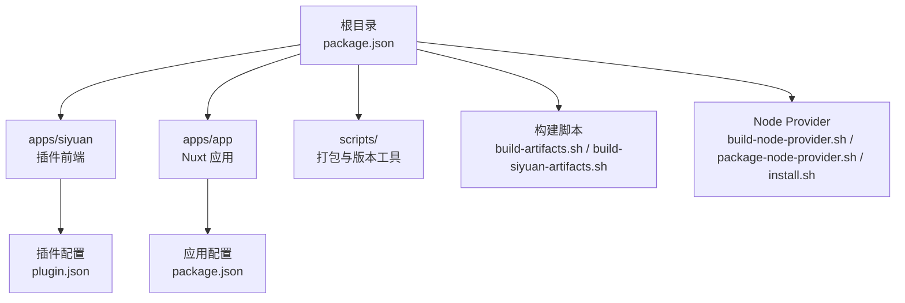
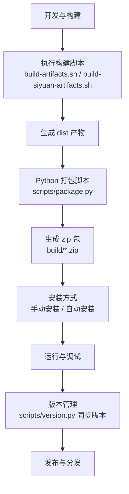
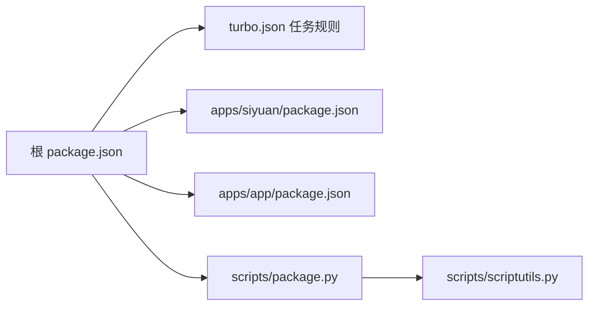
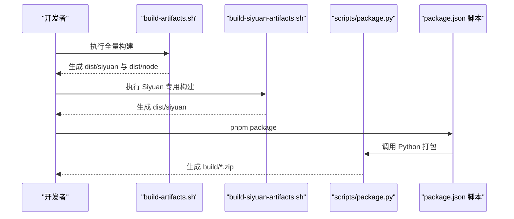

# Siyuan 插件部署

<cite>
**本文引用的文件**
- [plugin.json](file://plugin.json)
- [build-siyuan-artifacts.sh](file://build-siyuan-artifacts.sh)
- [build-artifacts.sh](file://build-artifacts.sh)
- [build-node-provider.sh](file://build-node-provider.sh)
- [package-node-provider.sh](file://package-node-provider.sh)
- [install.sh](file://install.sh)
- [package.py](file://scripts/package.py)
- [version.py](file://scripts/version.py)
- [scriptutils.py](file://scripts/scriptutils.py)
- [package.json](file://package.json)
- [turbo.json](file://turbo.json)
- [DEVELOPMENT.md](file://DEVELOPMENT.md)
- [README.md](file://README.md)
- [startup.example.sh](file://startup.example.sh)
- [apps/siyuan/plugin.json](file://apps/siyuan/plugin.json)
- [apps/siyuan/package.json](file://apps/siyuan/package.json)
- [apps/app/package.json](file://apps/app/package.json)
</cite>

## 目录
1. [简介](#简介)
2. [项目结构](#项目结构)
3. [核心组件](#核心组件)
4. [架构总览](#架构总览)
5. [详细组件分析](#详细组件分析)
6. [依赖关系分析](#依赖关系分析)
7. [性能与构建优化](#性能与构建优化)
8. [故障排查指南](#故障排查指南)
9. [结论](#结论)
10. [附录](#附录)

## 简介
本文件面向 Siyuan 插件开发者与维护者，系统化阐述插件的打包、安装与分发流程，详解 plugin.json 配置项的作用与最佳实践，提供构建脚本的使用指南（含 build-siyuan-artifacts.sh 的执行步骤），说明手动安装与自动安装方式，给出版本管理与更新机制的配置方法，并覆盖兼容性检查与测试流程以及插件市场发布的准备与审核要点。

## 项目结构
该项目采用多包工作区结构，核心插件位于根目录，同时包含一个前端应用包与一个用于 Node Provider 模式的后端服务构建产物。关键目录与文件如下：
- 根插件配置与脚本：plugin.json、build-artifacts.sh、build-siyuan-artifacts.sh、package.json、turbo.json
- Node Provider 相关：build-node-provider.sh、package-node-provider.sh、install.sh、startup.example.sh
- Python 打包与版本工具：scripts/package.py、scripts/version.py、scripts/scriptutils.py
- 子包：apps/siyuan（插件前端）、apps/app（Nuxt 应用）

图表来源
- [package.json:1-27](file://package.json#L1-L27)
- [apps/siyuan/package.json:1-43](file://apps/siyuan/package.json#L1-L43)
- [apps/app/package.json:1-41](file://apps/app/package.json#L1-L41)

章节来源
- [package.json:1-27](file://package.json#L1-L27)
- [turbo.json:1-17](file://turbo.json#L1-L17)

## 核心组件
- 插件配置文件 plugin.json：定义插件元数据、兼容平台、国际化、说明文档与资金支持等。
- 构建与打包脚本：统一构建入口与产物打包，支持 Siyuan 与 Node Provider 两种模式。
- 版本管理工具：同步修改多处版本号，确保一致性。
- Node Provider 安装脚本：支持自动解压与替换安装。

章节来源
- [plugin.json:1-43](file://plugin.json#L1-L43)
- [build-artifacts.sh:1-6](file://build-artifacts.sh#L1-L6)
- [build-siyuan-artifacts.sh:1-5](file://build-siyuan-artifacts.sh#L1-L5)
- [package.py:1-52](file://scripts/package.py#L1-L52)
- [version.py:1-74](file://scripts/version.py#L1-L74)
- [install.sh:1-11](file://install.sh#L1-L11)

## 架构总览
下图展示从开发到分发的关键流程：开发与构建 → 产物打包 → 安装与运行 → 版本管理与发布。

图表来源
- [build-artifacts.sh:1-6](file://build-artifacts.sh#L1-L6)
- [build-siyuan-artifacts.sh:1-5](file://build-siyuan-artifacts.sh#L1-L5)
- [package.py:1-52](file://scripts/package.py#L1-L52)
- [version.py:1-74](file://scripts/version.py#L1-L74)

## 详细组件分析

### plugin.json 配置详解
该文件是插件在 Siyuan 中的“元数据清单”，决定插件如何被识别、展示与分发。关键字段说明如下：
- name：插件唯一标识（建议使用小写、短横线或下划线）
- author：作者信息
- url：项目主页或仓库地址
- version：插件版本号，需与各子包保持一致
- minAppVersion：最低兼容的 Siyuan 版本
- backends：支持的后端平台（windows/linux/darwin/docker/android/ios）
- frontends：支持的前端环境（desktop/desktop-window/mobile/browser-desktop/browser-mobile）
- displayName：显示名称，支持多语言
- description：描述，支持多语言
- readme：说明文档路径，支持多语言
- i18n：支持的语言列表
- funding：资助信息，如自定义链接

章节来源
- [plugin.json:1-43](file://plugin.json#L1-L43)
- [apps/siyuan/plugin.json:1-43](file://apps/siyuan/plugin.json#L1-L43)

### 构建脚本与执行步骤
- build-artifacts.sh：统一构建 Nuxt 应用与 Siyuan 插件，生成多平台产物。
- build-siyuan-artifacts.sh：专门针对 Siyuan 插件的构建脚本，先构建前端应用再构建插件。
- build-node-provider.sh：仅构建 Node Provider 产物至 dist/node。
- package-node-provider.sh：将 dist/node 打包为 build/node-provider.zip，供安装脚本使用。
- install.sh：解压 build/node-provider.zip 并进行安装校验。

执行步骤示例（基于仓库脚本）：
1) 全量构建
- 运行：./build-artifacts.sh 或 ./build-siyuan-artifacts.sh
- 产出：dist/siyuan 与 dist/node
2) Node Provider 打包与安装
- 构建 Node Provider：./build-node-provider.sh
- 打包：./package-node-provider.sh
- 安装：./install.sh
3) Python 打包（生成最终分发包）
- 运行：pnpm package（调用 scripts/package.py）
- 产出：build/siyuan-plugin-blog-{version}.zip 与 build/package.zip

章节来源
- [build-artifacts.sh:1-6](file://build-artifacts.sh#L1-L6)
- [build-siyuan-artifacts.sh:1-5](file://build-siyuan-artifacts.sh#L1-L5)
- [build-node-provider.sh:1-6](file://build-node-provider.sh#L1-L6)
- [package-node-provider.sh:1-10](file://package-node-provider.sh#L1-L10)
- [install.sh:1-11](file://install.sh#L1-L11)
- [package.py:1-52](file://scripts/package.py#L1-L52)

### 安装方式：手动安装与自动安装
- 手动安装
  - 在本地完成构建与打包后，将生成的 zip 包上传至服务器或本地目录，然后在 Siyuan 插件管理中选择“从 zip 安装”。
  - 注意：确保 zip 包内顶层目录名为插件名，且包含有效的 plugin.json。
- 自动安装（Node Provider 模式）
  - 通过 package-node-provider.sh 生成 build/node-provider.zip
  - 使用 install.sh 解压并替换旧版本，随后启动服务
  - 启动命令可参考 startup.example.sh 或直接运行 pnpm start

章节来源
- [package-node-provider.sh:1-10](file://package-node-provider.sh#L1-L10)
- [install.sh:1-11](file://install.sh#L1-L11)
- [startup.example.sh:1-7](file://startup.example.sh#L1-L7)
- [README.md:1-32](file://README.md#L1-L32)

### 版本管理与更新机制
- 版本同步
  - 使用 scripts/version.py 同步修改多个位置的版本号（根 plugin.json、apps/siyuan/plugin.json、apps/siyuan/package.json、apps/app/package.json）
  - 支持传入 --version 指定新版本号，或复用根 package.json 的 version
- 更新机制
  - 在 CI/CD 中集成 prepareRelease（同步版本 + 解析变更日志）以自动化发布流程
  - 发布前建议先执行 prepareRelease，确保版本号一致

章节来源
- [version.py:1-74](file://scripts/version.py#L1-L74)
- [package.json:1-27](file://package.json#L1-L27)

### 兼容性检查与测试流程
- 平台与前端兼容性
  - 在 plugin.json 中明确声明 backends 与 frontends，确保覆盖目标用户环境
- 最低版本校验
  - 通过 minAppVersion 字段限制最低 Siyuan 版本，避免在过低版本中出现不兼容问题
- 测试建议
  - 在不同平台（Windows/Linux/macOS/Docker/Android/iOS）与前端（桌面/移动/浏览器）分别进行功能验证
  - 对比构建产物差异，确认 dist 结构与插件入口一致
  - 使用本地开发脚本进行端到端验证（参见 DEVELOPMENT.md）

章节来源
- [plugin.json:6-21](file://plugin.json#L6-L21)
- [apps/siyuan/plugin.json:6-21](file://apps/siyuan/plugin.json#L6-L21)
- [DEVELOPMENT.md:1-114](file://DEVELOPMENT.md#L1-L114)

### 插件市场发布准备与审核要求
- 准备工作
  - 确保 plugin.json 字段完整、准确，readme 路径正确，i18n 列表齐全
  - 生成符合规范的 zip 包（顶层目录为插件名，包含 plugin.json 与资源文件）
  - 提供清晰的变更日志与版本说明
- 审核要点
  - 插件名称与标识唯一性
  - 配置项完整性与准确性（尤其是 backends/frontends/minAppVersion）
  - 无敏感权限滥用与安全风险
  - 说明文档与多语言支持齐备
  - 产物大小与加载性能满足要求

章节来源
- [plugin.json:1-43](file://plugin.json#L1-L43)
- [apps/siyuan/plugin.json:1-43](file://apps/siyuan/plugin.json#L1-L43)
- [package.py:1-52](file://scripts/package.py#L1-L52)

## 依赖关系分析
- 工作区与任务编排
  - package.json 定义了多条脚本，结合 turbo.json 的任务规则实现增量构建与缓存控制
- 子包依赖
  - apps/siyuan 依赖 Vue 生态与 Siyuan 类型，用于插件前端
  - apps/app 为 Nuxt 应用，提供 Web 展示与分享能力
- Python 工具链
  - scripts/package.py 与 scripts/scriptutils.py 提供跨平台的打包与文件操作能力

图表来源
- [package.json:1-27](file://package.json#L1-L27)
- [turbo.json:1-17](file://turbo.json#L1-L17)
- [apps/siyuan/package.json:1-43](file://apps/siyuan/package.json#L1-L43)
- [apps/app/package.json:1-41](file://apps/app/package.json#L1-L41)
- [package.py:1-52](file://scripts/package.py#L1-L52)
- [scriptutils.py:1-237](file://scripts/scriptutils.py#L1-L237)

章节来源
- [package.json:1-27](file://package.json#L1-L27)
- [turbo.json:1-17](file://turbo.json#L1-L17)
- [apps/siyuan/package.json:1-43](file://apps/siyuan/package.json#L1-L43)
- [apps/app/package.json:1-41](file://apps/app/package.json#L1-L41)
- [package.py:1-52](file://scripts/package.py#L1-L52)
- [scriptutils.py:1-237](file://scripts/scriptutils.py#L1-L237)

## 性能与构建优化
- 使用 Turbo 管道进行增量构建，减少重复编译
- 分离 Node Provider 与 Siyuan 插件构建，按需构建降低等待时间
- Python 打包脚本采用临时目录复制与压缩，避免污染源码
- 建议在 CI/CD 中启用缓存与并行任务，缩短构建周期

章节来源
- [turbo.json:1-17](file://turbo.json#L1-L17)
- [build-artifacts.sh:1-6](file://build-artifacts.sh#L1-L6)
- [build-siyuan-artifacts.sh:1-5](file://build-siyuan-artifacts.sh#L1-L5)
- [package.py:1-52](file://scripts/package.py#L1-L52)

## 故障排查指南
- 构建失败
  - 检查 Node 与 pnpm 版本是否满足要求；查看 Turbo 缓存与输出目录清理
  - 参考 DEVELOPMENT.md 的开发与构建步骤进行本地复现
- 打包异常
  - 确认 dist 目录存在且内容完整；检查 Python 脚本的工作目录切换逻辑
- 安装失败
  - Node Provider 模式下，确认 build/node-provider.zip 是否生成；执行 install.sh 后检查解压与替换是否成功
  - 若为手动安装，确认 zip 包结构与 plugin.json 路径正确

章节来源
- [DEVELOPMENT.md:1-114](file://DEVELOPMENT.md#L1-L114)
- [package.py:1-52](file://scripts/package.py#L1-L52)
- [install.sh:1-11](file://install.sh#L1-L11)

## 结论
本部署文档围绕 plugin.json 配置、构建脚本、安装与分发、版本管理与更新机制、兼容性与测试、以及市场发布准备等方面提供了系统化的指导。通过遵循本文流程与最佳实践，可显著提升插件开发与发布的效率与质量。

## 附录

### 构建与打包序列图（基于实际脚本）

图表来源
- [build-artifacts.sh:1-6](file://build-artifacts.sh#L1-L6)
- [build-siyuan-artifacts.sh:1-5](file://build-siyuan-artifacts.sh#L1-L5)
- [package.py:1-52](file://scripts/package.py#L1-L52)
- [package.json:1-27](file://package.json#L1-L27)