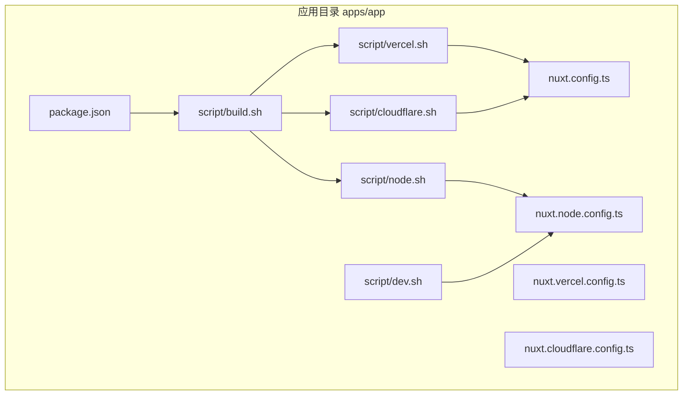
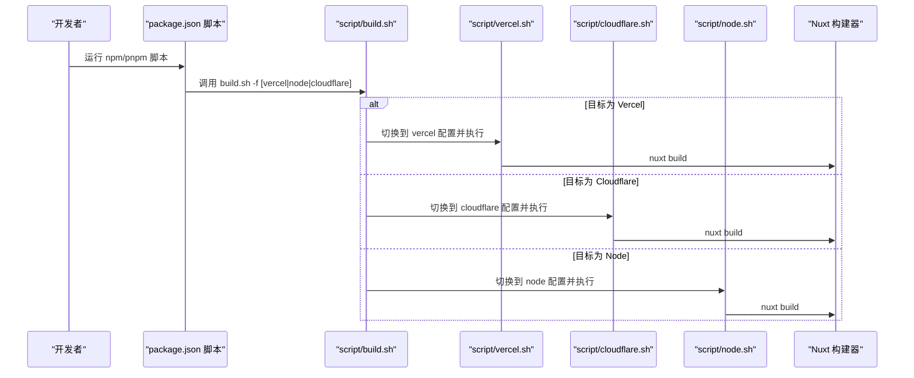
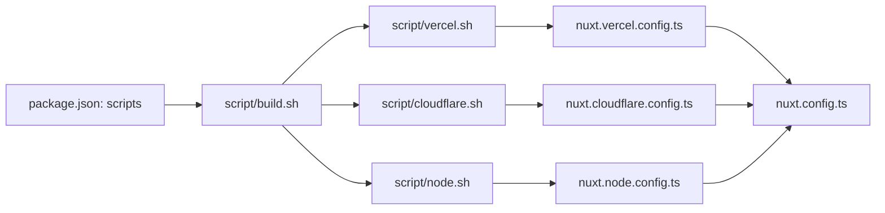

# Web 应用部署

<cite>
**本文引用的文件**
- [apps/app/nuxt.config.ts](file://apps/app/nuxt.config.ts)
- [apps/app/nuxt.node.config.ts](file://apps/app/nuxt.node.config.ts)
- [apps/app/nuxt.cloudflare.config.ts](file://apps/app/nuxt.cloudflare.config.ts)
- [apps/app/nuxt.vercel.config.ts](file://apps/app/nuxt.vercel.config.ts)
- [apps/app/package.json](file://apps/app/package.json)
- [apps/app/script/build.sh](file://apps/app/script/build.sh)
- [apps/app/script/vercel.sh](file://apps/app/script/vercel.sh)
- [apps/app/script/cloudflare.sh](file://apps/app/script/cloudflare.sh)
- [apps/app/script/node.sh](file://apps/app/script/node.sh)
- [apps/app/script/dev.sh](file://apps/app/script/dev.sh)
</cite>

## 目录
1. [引言](#引言)
2. [项目结构](#项目结构)
3. [核心组件](#核心组件)
4. [架构总览](#架构总览)
5. [详细组件分析](#详细组件分析)
6. [依赖关系分析](#依赖关系分析)
7. [性能考虑](#性能考虑)
8. [故障排查指南](#故障排查指南)
9. [结论](#结论)
10. [附录](#附录)

## 引言
本文件面向需要部署基于 Nuxt.js 的前端应用（SPA/SSR）的工程团队与运维人员，系统性梳理从本地开发到多平台部署（Vercel、Cloudflare Pages、传统服务器）的完整流程，并对静态站点生成、CDN 缓存策略、HTTPS 与域名配置、性能优化等关键环节给出可操作的建议与参考路径。

## 项目结构
该仓库采用多包工作区组织，应用位于 apps/app。与部署密切相关的文件集中在以下位置：
- Nuxt 配置：nuxt.config.ts（默认）、nuxt.node.config.ts、nuxt.vercel.config.ts、nuxt.cloudflare.config.ts
- 构建与运行脚本：script/*.sh
- 依赖与脚本入口：package.json

图表来源
- [apps/app/package.json:1-41](file://apps/app/package.json#L1-L41)
- [apps/app/script/build.sh:1-63](file://apps/app/script/build.sh#L1-L63)
- [apps/app/script/vercel.sh:1-16](file://apps/app/script/vercel.sh#L1-L16)
- [apps/app/script/cloudflare.sh:1-16](file://apps/app/script/cloudflare.sh#L1-L16)
- [apps/app/script/node.sh:1-31](file://apps/app/script/node.sh#L1-L31)
- [apps/app/script/dev.sh:1-15](file://apps/app/script/dev.sh#L1-L15)

章节来源
- [apps/app/package.json:1-41](file://apps/app/package.json#L1-L41)
- [apps/app/script/build.sh:1-63](file://apps/app/script/build.sh#L1-L63)

## 核心组件
- 默认 Nuxt 配置：apps/app/nuxt.config.ts，作为通用默认配置，适用于本地开发与部分部署场景。
- 平台专用配置：
  - apps/app/nuxt.node.config.ts：Node SSR 部署使用。
  - apps/app/nuxt.vercel.config.ts：Vercel 平台部署使用。
  - apps/app/nuxt.cloudflare.config.ts：Cloudflare Pages 部署使用。
- 构建与运行脚本：
  - script/build.sh：统一入口，按参数选择目标平台。
  - script/vercel.sh、script/cloudflare.sh、script/node.sh：分别切换对应配置并执行构建。
  - script/dev.sh：本地开发时切换 Node 配置并启动开发服务器。
- 依赖与脚本入口：apps/app/package.json 中定义了开发、构建与平台构建脚本。

章节来源
- [apps/app/nuxt.config.ts:1-125](file://apps/app/nuxt.config.ts#L1-L125)
- [apps/app/nuxt.node.config.ts:1-125](file://apps/app/nuxt.node.config.ts#L1-L125)
- [apps/app/nuxt.vercel.config.ts:1-134](file://apps/app/nuxt.vercel.config.ts#L1-L134)
- [apps/app/nuxt.cloudflare.config.ts:1-126](file://apps/app/nuxt.cloudflare.config.ts#L1-L126)
- [apps/app/package.json:1-41](file://apps/app/package.json#L1-L41)
- [apps/app/script/build.sh:1-63](file://apps/app/script/build.sh#L1-L63)
- [apps/app/script/vercel.sh:1-16](file://apps/app/script/vercel.sh#L1-L16)
- [apps/app/script/cloudflare.sh:1-16](file://apps/app/script/cloudflare.sh#L1-L16)
- [apps/app/script/node.sh:1-31](file://apps/app/script/node.sh#L1-L31)
- [apps/app/script/dev.sh:1-15](file://apps/app/script/dev.sh#L1-L15)

## 架构总览
下图展示了从命令行到最终产物的关键流程，以及不同部署平台的差异化配置注入点。

图表来源
- [apps/app/package.json:5-11](file://apps/app/package.json#L5-L11)
- [apps/app/script/build.sh:46-63](file://apps/app/script/build.sh#L46-L63)
- [apps/app/script/vercel.sh:12-15](file://apps/app/script/vercel.sh#L12-L15)
- [apps/app/script/cloudflare.sh:12-15](file://apps/app/script/cloudflare.sh#L12-L15)
- [apps/app/script/node.sh:12-18](file://apps/app/script/node.sh#L12-L18)

## 详细组件分析

### Nuxt 配置体系与环境差异
- 默认配置（nuxt.config.ts）
  - 开发工具：根据 NODE_ENV 控制 devtools 开关。
  - 国际化：i18n 默认语言与策略，禁用浏览器语言检测。
  - 应用元数据：head 中注入样式与脚本，开发模式下额外注入调试脚本。
  - Vite：全局常量注入 DEV_MODE、APP_BASE、SSR。
  - 运行时配置：public 区域暴露默认类型、SiYuan API 地址、Provider 模式与地址。
- Node 平台配置（nuxt.node.config.ts）
  - 与默认配置一致，用于 Node SSR 部署。
- Vercel 平台配置（nuxt.vercel.config.ts）
  - 在 Node 配置基础上增加 Nitro 预设为 vercel，并配置外部依赖别名映射以解决打包问题。
- Cloudflare Pages 配置（nuxt.cloudflare.config.ts）
  - 在 Node 配置基础上增加 Nitro 预设为 cloudflare_pages，并配置外部依赖别名映射。

章节来源
- [apps/app/nuxt.config.ts:15-124](file://apps/app/nuxt.config.ts#L15-L124)
- [apps/app/nuxt.node.config.ts:15-124](file://apps/app/nuxt.node.config.ts#L15-L124)
- [apps/app/nuxt.vercel.config.ts:15-133](file://apps/app/nuxt.vercel.config.ts#L15-L133)
- [apps/app/nuxt.cloudflare.config.ts:15-125](file://apps/app/nuxt.cloudflare.config.ts#L15-L125)

### 构建与运行脚本
- 统一入口：script/build.sh 接收 -f/--from 参数，支持 vercel、node、cloudflare、siyuan。
- 平台脚本：
  - script/vercel.sh：复制 nuxt.vercel.config.ts 到 nuxt.config.ts 后执行 nuxt build。
  - script/cloudflare.sh：复制 nuxt.cloudflare.config.ts 到 nuxt.config.ts 后执行 nuxt build。
  - script/node.sh：复制 nuxt.node.config.ts 到 nuxt.config.ts 后执行 nuxt build，并在构建后拷贝输出至 dist/node。
- 开发脚本：script/dev.sh 复制 Node 配置到 nuxt.config.ts，执行 nuxt postinstall 并启动开发服务器。

章节来源
- [apps/app/script/build.sh:12-63](file://apps/app/script/build.sh#L12-L63)
- [apps/app/script/vercel.sh:12-15](file://apps/app/script/vercel.sh#L12-L15)
- [apps/app/script/cloudflare.sh:12-15](file://apps/app/script/cloudflare.sh#L12-L15)
- [apps/app/script/node.sh:12-31](file://apps/app/script/node.sh#L12-L31)
- [apps/app/script/dev.sh:12-15](file://apps/app/script/dev.sh#L12-L15)

### 静态站点生成与预渲染
- 生成策略
  - SPA 模式：通过 Nuxt 的默认配置与平台配置即可直接产出静态资源，适合托管于任意静态服务器或 CDN。
  - SSR/SSG 混合：若需服务端渲染或预渲染，可在平台配置中启用相应 Nitro 预设（如 vercel、cloudflare），并在构建后将 .output/public 目录作为静态站点发布。
- 关键配置要点
  - baseURL/head/link/script 注入：确保静态资源路径正确，避免相对路径在不同子路径下失效。
  - 运行时公共配置：通过 public 区域注入 API 地址、Provider 模式等，便于在不同环境切换。
- 参考路径
  - baseURL/head/link/script 注入位置：[apps/app/nuxt.config.ts:35-87](file://apps/app/nuxt.config.ts#L35-L87)
  - 运行时公共配置：[apps/app/nuxt.config.ts:114-121](file://apps/app/nuxt.config.ts#L114-L121)

章节来源
- [apps/app/nuxt.config.ts:35-87](file://apps/app/nuxt.config.ts#L35-L87)
- [apps/app/nuxt.config.ts:114-121](file://apps/app/nuxt.config.ts#L114-L121)

### 不同部署环境的配置差异
- 开发环境
  - 使用 script/dev.sh 启动，自动切换 Node 配置并开启 devtools。
  - 开发模式下 head 中注入调试脚本，便于本地联调。
- 测试/生产环境
  - 通过 script/build.sh -f vercel|cloudflare|node 选择目标平台，脚本会复制对应平台配置到 nuxt.config.ts 并执行构建。
  - 平台配置已内置 Nitro 预设与外部依赖别名映射，减少打包问题。

章节来源
- [apps/app/script/dev.sh:12-15](file://apps/app/script/dev.sh#L12-L15)
- [apps/app/nuxt.config.ts:20-21](file://apps/app/nuxt.config.ts#L20-L21)
- [apps/app/nuxt.vercel.config.ts:90-97](file://apps/app/nuxt.vercel.config.ts#L90-L97)
- [apps/app/nuxt.cloudflare.config.ts:105-112](file://apps/app/nuxt.cloudflare.config.ts#L105-L112)

### 传统 Web 服务器部署（Apache/Nginx）
- 发布目录
  - Node 平台构建完成后，脚本会将 .output/ 与 dist/ 内容拷贝至 dist/node，可将该目录作为静态站点发布。
- Apache 配置要点
  - 虚拟主机指向发布目录。
  - 启用重写模块，将所有未命中路由回退到 index.html，以支持前端路由。
  - 设置静态资源缓存头（见“性能优化”）。
- Nginx 配置要点
  - root 指向发布目录。
  - 使用 try_files 将未命中路由回退到 index.html。
  - 配置 gzip/HTTP2/HTTPS，设置静态资源缓存头。
- 注意事项
  - 确保 baseURL/head/link/script 注入的资源路径与服务器根路径一致。
  - 若使用子路径部署，需调整 baseURL 与资源前缀。

章节来源
- [apps/app/script/node.sh:20-31](file://apps/app/script/node.sh#L20-L31)
- [apps/app/nuxt.config.ts:35-87](file://apps/app/nuxt.config.ts#L35-L87)

### CDN 集成与缓存策略
- 资源版本控制
  - 配置中通过动态版本号（分钟级）附加到静态资源查询参数，实现强缓存下的资源更新。
  - 参考路径：[apps/app/nuxt.config.ts:5-13](file://apps/app/nuxt.config.ts#L5-L13)、[apps/app/nuxt.config.ts:46-57](file://apps/app/nuxt.config.ts#L46-L57)
- CDN 缓存建议
  - HTML：短缓存或不缓存，确保路由回退逻辑生效。
  - JS/CSS/字体：长缓存（如一年），结合查询参数版本号。
  - 动态接口：按需缓存，避免过期。
- 回源与边缘规则
  - 对 /_nuxt/* 与静态资源设置长缓存。
  - 对 /api/* 或动态接口设置短缓存或不缓存。

章节来源
- [apps/app/nuxt.config.ts:5-13](file://apps/app/nuxt.config.ts#L5-L13)
- [apps/app/nuxt.config.ts:46-57](file://apps/app/nuxt.config.ts#L46-L57)

### 性能优化配置（压缩、代码分割、懒加载）
- 代码分割与懒加载
  - 使用 Nuxt 的路由级组件拆分与动态导入，减少首屏体积。
  - 第三方库（如 Element Plus、echarts、katex）按需引入，降低打包体积。
- 资源压缩
  - 启用 gzip/deflate 压缩（Nginx/Apache）。
  - 使用 CDN 提供的压缩能力（如 Cloudflare Workers Assets、Vercel Edge Functions）。
- 构建优化
  - Node SSR 构建时提升内存上限，避免打包失败。
  - 参考路径：[apps/app/script/node.sh:14-18](file://apps/app/script/node.sh#L14-L18)
- 运行时优化
  - 将非关键脚本标记为 defer async，减少阻塞。
  - 参考路径：[apps/app/nuxt.config.ts:60-86](file://apps/app/nuxt.config.ts#L60-L86)

章节来源
- [apps/app/script/node.sh:14-18](file://apps/app/script/node.sh#L14-L18)
- [apps/app/nuxt.config.ts:60-86](file://apps/app/nuxt.config.ts#L60-L86)

### 域名配置与 HTTPS 设置
- 域名绑定
  - 在 CDN/平台控制台绑定自定义域名。
  - 若使用子路径部署，确保 baseURL/head/link/script 与子路径一致。
- HTTPS
  - CDN/平台通常提供免费证书与自动续期。
  - 如需强制跳转 HTTPS，可在 CDN/平台规则中添加 301/308 跳转。
- 参考路径
  - baseURL/head/link/script 注入：[apps/app/nuxt.config.ts:35-87](file://apps/app/nuxt.config.ts#L35-L87)

章节来源
- [apps/app/nuxt.config.ts:35-87](file://apps/app/nuxt.config.ts#L35-L87)

## 依赖关系分析
- 脚本耦合
  - package.json 的 scripts 通过 shell 脚本串联各平台构建。
  - script/build.sh 作为统一入口，按参数分派到具体平台脚本。
- 配置耦合
  - 各平台配置均以 nuxt.node.config.ts 为基础，仅在 Nitro 预设与外部依赖别名映射处差异化。
- 外部依赖
  - Nuxt 3、Nitro、@nuxtjs/i18n、@element-plus/nuxt、@pinia/nuxt 等。

图表来源
- [apps/app/package.json:5-11](file://apps/app/package.json#L5-L11)
- [apps/app/script/build.sh:46-63](file://apps/app/script/build.sh#L46-L63)
- [apps/app/script/vercel.sh:14](file://apps/app/script/vercel.sh#L14)
- [apps/app/script/cloudflare.sh:14](file://apps/app/script/cloudflare.sh#L14)
- [apps/app/script/node.sh:14](file://apps/app/script/node.sh#L14)
- [apps/app/nuxt.vercel.config.ts:15-133](file://apps/app/nuxt.vercel.config.ts#L15-L133)
- [apps/app/nuxt.cloudflare.config.ts:15-125](file://apps/app/nuxt.cloudflare.config.ts#L15-L125)
- [apps/app/nuxt.node.config.ts:15-124](file://apps/app/nuxt.node.config.ts#L15-L124)

章节来源
- [apps/app/package.json:5-11](file://apps/app/package.json#L5-L11)
- [apps/app/script/build.sh:46-63](file://apps/app/script/build.sh#L46-L63)

## 性能考虑
- 构建阶段
  - 提升 Node SSR 构建内存上限，避免打包失败。
  - 使用平台预设（vercel/cloudflare）以获得更优的边缘执行与缓存。
- 运行阶段
  - 启用 CDN 边缘缓存与压缩。
  - 将非关键脚本 defer 加载，减少首屏阻塞。
- 资源管理
  - 通过动态版本号实现强缓存下的资源更新。
  - 对第三方库进行按需引入与懒加载。

章节来源
- [apps/app/script/node.sh:14-18](file://apps/app/script/node.sh#L14-L18)
- [apps/app/nuxt.config.ts:5-13](file://apps/app/nuxt.config.ts#L5-L13)
- [apps/app/nuxt.config.ts:60-86](file://apps/app/nuxt.config.ts#L60-L86)

## 故障排查指南
- 构建失败（打包过大）
  - 提升 Node SSR 构建内存上限。
  - 检查外部依赖别名映射是否正确。
- 平台构建异常
  - 确认已正确复制平台配置到 nuxt.config.ts。
  - 检查 Nitro 预设与外部依赖别名映射。
- 资源 404
  - 检查 baseURL/head/link/script 注入的资源路径是否与服务器根路径一致。
  - 若使用子路径部署，确保资源前缀与 baseURL 一致。
- CDN 缓存问题
  - 确认静态资源查询参数版本号生效。
  - 检查 CDN 缓存策略与回源规则。

章节来源
- [apps/app/script/node.sh:14-18](file://apps/app/script/node.sh#L14-L18)
- [apps/app/nuxt.vercel.config.ts:90-97](file://apps/app/nuxt.vercel.config.ts#L90-L97)
- [apps/app/nuxt.cloudflare.config.ts:105-112](file://apps/app/nuxt.cloudflare.config.ts#L105-L112)
- [apps/app/nuxt.config.ts:35-87](file://apps/app/nuxt.config.ts#L35-L87)

## 结论
本项目通过统一的构建入口与平台化配置，实现了对 Vercel、Cloudflare Pages 与传统服务器的灵活适配。配合 CDN 缓存、资源版本控制与性能优化策略，可在不同环境下稳定交付高质量的前端应用。建议在实际部署中结合自身平台特性进一步细化缓存与安全策略。

## 附录
- 快速开始（Node SSR）
  - 执行：[apps/app/script/node.sh:12-18](file://apps/app/script/node.sh#L12-L18)
  - 发布目录：dist/node
- 快速开始（Vercel）
  - 执行：[apps/app/script/vercel.sh:12-15](file://apps/app/script/vercel.sh#L12-L15)
  - 平台预设：nitro preset vercel
- 快速开始（Cloudflare Pages）
  - 执行：[apps/app/script/cloudflare.sh:12-15](file://apps/app/script/cloudflare.sh#L12-L15)
  - 平台预设：nitro preset cloudflare_pages
- 统一入口
  - 执行：[apps/app/script/build.sh:46-63](file://apps/app/script/build.sh#L46-L63)