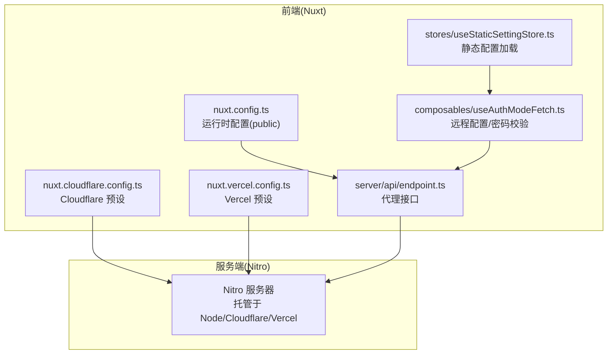
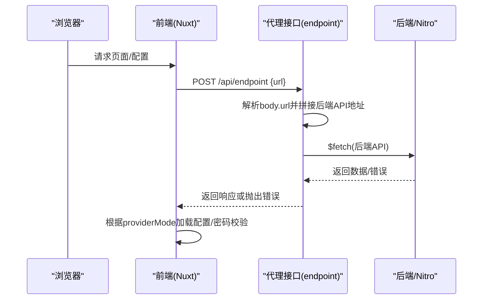
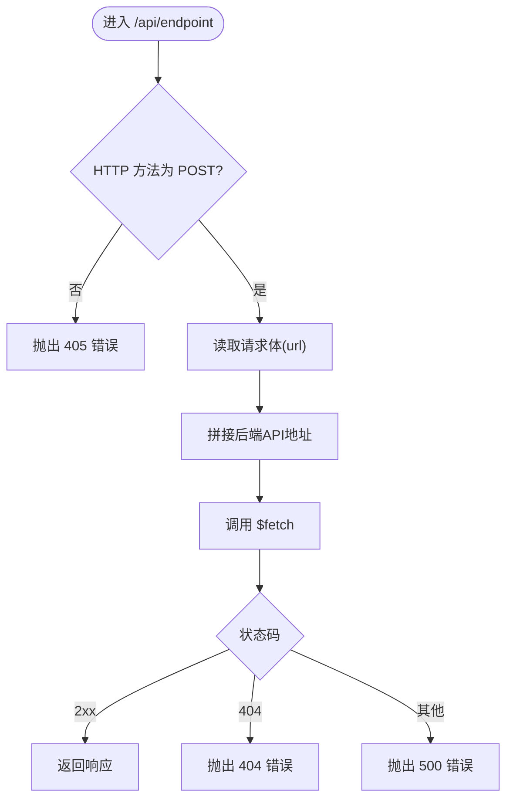
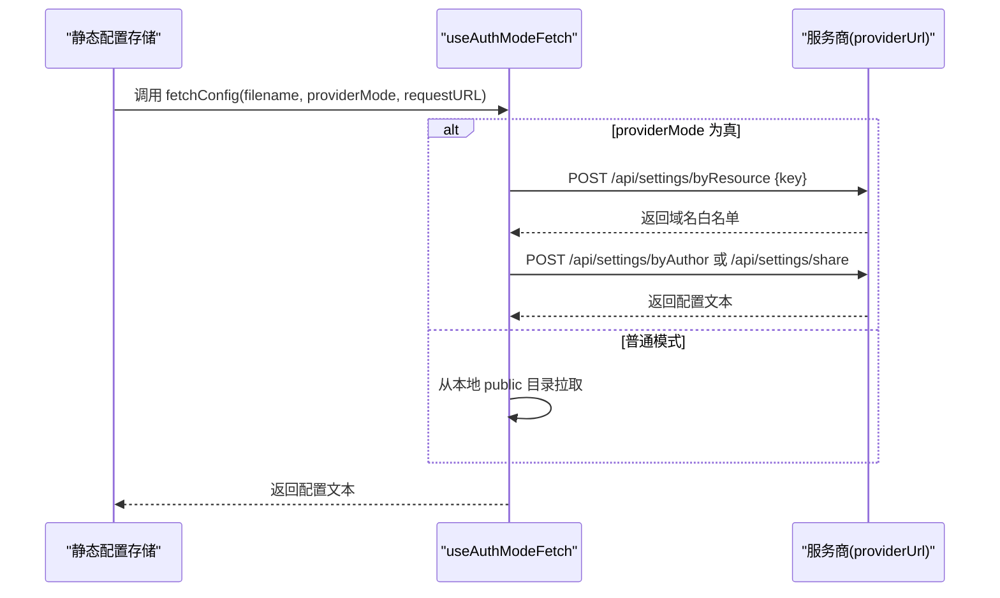
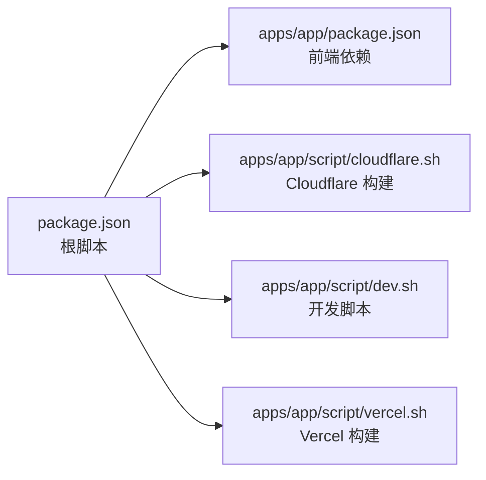

# 安全配置

<cite>
**本文引用的文件**
- [apps/app/nuxt.config.ts](file://apps/app/nuxt.config.ts)
- [apps/app/nuxt.cloudflare.config.ts](file://apps/app/nuxt.cloudflare.config.ts)
- [apps/app/nuxt.vercel.config.ts](file://apps/app/nuxt.vercel.config.ts)
- [apps/app/server/api/endpoint.ts](file://apps/app/server/api/endpoint.ts)
- [apps/app/server/utils/urlUtils.ts](file://apps/app/server/utils/urlUtils.ts)
- [apps/app/composables/useAuthModeFetch.ts](file://apps/app/composables/useAuthModeFetch.ts)
- [apps/app/composables/useProviderMode.ts](file://apps/app/composables/useProviderMode.ts)
- [apps/app/stores/useStaticSettingStore.ts](file://apps/app/stores/useStaticSettingStore.ts)
- [apps/app/utils/appLogger.ts](file://apps/app/utils/appLogger.ts)
- [apps/app/app.config.ts](file://apps/app/app.config.ts)
- [apps/app/composables/useAppBase.ts](file://apps/app/composables/useAppBase.ts)
- [apps/app/package.json](file://apps/app/package.json)
- [package.json](file://package.json)
- [apps/app/script/cloudflare.sh](file://apps/app/script/cloudflare.sh)
</cite>

## 目录
1. [简介](#简介)
2. [项目结构](#项目结构)
3. [核心组件](#核心组件)
4. [架构总览](#架构总览)
5. [详细组件分析](#详细组件分析)
6. [依赖分析](#依赖分析)
7. [性能考虑](#性能考虑)
8. [故障排查指南](#故障排查指南)
9. [结论](#结论)
10. [附录](#附录)

## 简介
本指南面向在生产环境中部署该应用的工程团队，提供一套可落地的安全配置与最佳实践，覆盖 HTTPS/SSL、API 安全、身份认证与授权、数据传输与存储加密、安全日志与监控、常见威胁防护（XSS、CSRF、SQL 注入）、安全审计与漏洞扫描以及安全事件响应流程。由于仓库中未包含生产环境的反向代理或平台托管配置文件，本指南以现有 Nuxt 配置与前端/后端交互逻辑为基础，结合通用安全原则，给出可执行的加固建议。

## 项目结构
应用采用多环境构建配置与运行时环境变量管理，前端通过 Nuxt 的不同配置文件适配不同托管平台（Node、Cloudflare、Vercel），并通过统一的运行时配置注入公共参数（如 API 地址、提供商模式开关等）。服务端 API 通过 Nitro 的路由实现，前端通过统一的 fetch 组件访问资源与配置。

图表来源
- [apps/app/nuxt.config.ts:114-121](file://apps/app/nuxt.config.ts#L114-L121)
- [apps/app/nuxt.cloudflare.config.ts:105-122](file://apps/app/nuxt.cloudflare.config.ts#L105-L122)
- [apps/app/nuxt.vercel.config.ts:90-130](file://apps/app/nuxt.vercel.config.ts#L90-L130)
- [apps/app/server/api/endpoint.ts:12-39](file://apps/app/server/api/endpoint.ts#L12-L39)
- [apps/app/composables/useAuthModeFetch.ts:15-318](file://apps/app/composables/useAuthModeFetch.ts#L15-L318)
- [apps/app/stores/useStaticSettingStore.ts:10-26](file://apps/app/stores/useStaticSettingStore.ts#L10-L26)

章节来源
- [apps/app/nuxt.config.ts:114-121](file://apps/app/nuxt.config.ts#L114-L121)
- [apps/app/nuxt.cloudflare.config.ts:105-122](file://apps/app/nuxt.cloudflare.config.ts#L105-L122)
- [apps/app/nuxt.vercel.config.ts:90-130](file://apps/app/nuxt.vercel.config.ts#L90-L130)
- [apps/app/server/api/endpoint.ts:12-39](file://apps/app/server/api/endpoint.ts#L12-L39)
- [apps/app/composables/useAuthModeFetch.ts:15-318](file://apps/app/composables/useAuthModeFetch.ts#L15-L318)
- [apps/app/stores/useStaticSettingStore.ts:10-26](file://apps/app/stores/useStaticSettingStore.ts#L10-L26)

## 核心组件
- 运行时配置与环境变量
  - 前端通过运行时配置注入公共参数，如 API 地址、提供商模式开关、默认类型等，便于在不同环境间切换。
- 代理接口 endpoint
  - 仅允许 POST 方法，读取请求体中的目标 URL，并拼接后端 API 地址进行转发，返回结果或错误。
- 远程配置与鉴权
  - 提供“服务商模式”与“普通模式”的配置拉取策略；支持基于域名白名单的作者识别与密码校验。
- 日志记录
  - 统一的日志记录器，按开发/生产环境输出不同级别日志，便于问题定位与安全审计。

章节来源
- [apps/app/nuxt.config.ts:114-121](file://apps/app/nuxt.config.ts#L114-L121)
- [apps/app/server/api/endpoint.ts:12-39](file://apps/app/server/api/endpoint.ts#L12-L39)
- [apps/app/composables/useAuthModeFetch.ts:15-318](file://apps/app/composables/useAuthModeFetch.ts#L15-L318)
- [apps/app/utils/appLogger.ts:20-22](file://apps/app/utils/appLogger.ts#L20-L22)

## 架构总览
下图展示了前端如何通过代理接口访问后端 API，并在服务商模式下从远端获取配置与文档元数据，同时支持密码校验与域名白名单控制。

图表来源
- [apps/app/server/api/endpoint.ts:12-39](file://apps/app/server/api/endpoint.ts#L12-L39)
- [apps/app/server/utils/urlUtils.ts:10-14](file://apps/app/server/utils/urlUtils.ts#L10-L14)
- [apps/app/composables/useAuthModeFetch.ts:181-215](file://apps/app/composables/useAuthModeFetch.ts#L181-L215)

## 详细组件分析

### 组件A：代理接口与 URL 构建
- 功能要点
  - 仅接受 POST 方法，读取请求体中的目标 URL，拼接运行时配置中的后端 API 地址，调用 $fetch 并返回结果或错误。
  - 对 404 错误进行特殊处理，抛出对应的错误对象。
- 安全影响
  - 该接口作为前端与后端之间的唯一入口，应严格限制允许的后端地址范围，并对输入进行白名单校验，避免 SSRF。
  - 建议增加来源校验与速率限制，防止滥用。

图表来源
- [apps/app/server/api/endpoint.ts:12-39](file://apps/app/server/api/endpoint.ts#L12-L39)
- [apps/app/server/utils/urlUtils.ts:10-14](file://apps/app/server/utils/urlUtils.ts#L10-L14)

章节来源
- [apps/app/server/api/endpoint.ts:12-39](file://apps/app/server/api/endpoint.ts#L12-L39)
- [apps/app/server/utils/urlUtils.ts:10-14](file://apps/app/server/utils/urlUtils.ts#L10-L14)

### 组件B：远程配置与鉴权流程
- 功能要点
  - 支持两种模式：服务商模式与普通模式；服务商模式下优先从 providerUrl 拉取配置，支持按资源、作者、当前用户文档 ID 拉取；普通模式从本地 public 目录拉取。
  - 支持域名白名单解析作者，首页根据白名单选择作者或回退默认作者。
  - 支持密码校验接口，返回校验结果与数据。
- 安全影响
  - 服务商模式下的所有网络请求均需在可信边界内进行，建议对 providerUrl 进行白名单与 TLS 校验。
  - 密码校验接口需配合服务端限流与防爆破策略。

图表来源
- [apps/app/stores/useStaticSettingStore.ts:18-24](file://apps/app/stores/useStaticSettingStore.ts#L18-L24)
- [apps/app/composables/useAuthModeFetch.ts:181-215](file://apps/app/composables/useAuthModeFetch.ts#L181-L215)
- [apps/app/composables/useAuthModeFetch.ts:58-79](file://apps/app/composables/useAuthModeFetch.ts#L58-L79)
- [apps/app/composables/useAuthModeFetch.ts:103-126](file://apps/app/composables/useAuthModeFetch.ts#L103-L126)
- [apps/app/composables/useAuthModeFetch.ts:134-157](file://apps/app/composables/useAuthModeFetch.ts#L134-L157)

章节来源
- [apps/app/stores/useStaticSettingStore.ts:10-26](file://apps/app/stores/useStaticSettingStore.ts#L10-L26)
- [apps/app/composables/useAuthModeFetch.ts:15-318](file://apps/app/composables/useAuthModeFetch.ts#L15-L318)

### 组件C：日志记录与运行时配置
- 日志记录
  - 统一的日志记录器，按开发/生产环境输出不同级别日志，便于问题定位与安全审计。
- 运行时配置
  - 前端通过运行时配置注入公共参数，如 API 地址、提供商模式开关、默认类型等，便于在不同环境间切换。

章节来源
- [apps/app/utils/appLogger.ts:20-22](file://apps/app/utils/appLogger.ts#L20-L22)
- [apps/app/nuxt.config.ts:114-121](file://apps/app/nuxt.config.ts#L114-L121)

## 依赖分析
- 构建与托管
  - 不同托管平台使用不同的 Nuxt 配置文件，分别预设 Nitro 托管目标（Node、Cloudflare Pages、Vercel）。
- 运行时依赖
  - 前端依赖包含 Nuxt、Vue、Pinia、Element Plus 等，用于构建应用与组件生态。
- 环境脚本
  - 提供针对不同平台的构建脚本，便于在 CI/CD 中选择合适的构建配置。

图表来源
- [package.json:4-26](file://package.json#L4-L26)
- [apps/app/package.json:12-40](file://apps/app/package.json#L12-L40)
- [apps/app/script/cloudflare.sh:12-15](file://apps/app/script/cloudflare.sh#L12-L15)

章节来源
- [package.json:4-26](file://package.json#L4-L26)
- [apps/app/package.json:12-40](file://apps/app/package.json#L12-L40)
- [apps/app/script/cloudflare.sh:12-15](file://apps/app/script/cloudflare.sh#L12-L15)

## 性能考虑
- CDN 与缓存
  - 静态资源版本号动态生成，有助于浏览器缓存与更新控制。
- 代理接口
  - 合理设置超时与重试策略，避免阻塞前端渲染。
- 服务商模式
  - 对远端配置与文档元数据进行本地缓存，减少重复请求。

## 故障排查指南
- 代理接口错误
  - 若出现 405，请确认前端请求方法为 POST。
  - 若出现 404，请检查目标 URL 是否正确且资源存在。
  - 若出现 500，请查看后端日志与网络连通性。
- 远程配置加载失败
  - 检查 providerUrl 是否可达且 TLS 正常。
  - 确认域名白名单与作者映射是否正确。
- 密码校验失败
  - 确认传入的文档 ID、密码与加密密码是否一致。
- 日志定位
  - 开发环境下日志更详细，生产环境下日志级别降低，可通过日志定位问题。

章节来源
- [apps/app/server/api/endpoint.ts:22-32](file://apps/app/server/api/endpoint.ts#L22-L32)
- [apps/app/composables/useAuthModeFetch.ts:264-298](file://apps/app/composables/useAuthModeFetch.ts#L264-L298)
- [apps/app/utils/appLogger.ts:20-22](file://apps/app/utils/appLogger.ts#L20-L22)

## 结论
本指南基于现有代码结构，给出了 HTTPS/SSL、API 安全、身份认证与授权、数据传输与存储加密、安全日志与监控、常见威胁防护、安全审计与漏洞扫描以及安全事件响应的实施建议。实际生产部署中，应结合平台托管配置（如 Cloudflare/Vercel 的安全策略）与企业安全基线进一步完善。

## 附录

### HTTPS 与 SSL/TLS 配置建议
- 使用平台提供的托管证书或自签证书，确保全站 HTTPS。
- 在 Cloudflare/Vercel 等平台启用 HSTS、OCSP Stapling、TLS 版本升级与强密码套件。
- 为 API 服务端配置强 TLS 参数与证书自动续期。

### API 安全防护
- CORS
  - 明确允许的来源列表，避免使用通配符；对敏感接口启用凭据支持时谨慎配置。
- 请求验证
  - 对代理接口的 URL 进行白名单校验，防止 SSRF；对服务商模式的请求地址进行可信域名校验。
- 速率限制
  - 对代理接口与密码校验接口实施速率限制与 IP 黑名单机制。

### 身份认证与授权
- 基于会话/令牌的认证策略，结合 CSP 与 SameSite Cookie。
- 对首页与文档详情页的访问控制，结合域名白名单与作者映射。

### 数据传输与存储加密
- 传输：强制 HTTPS，禁用明文协议；TLS 版本不低于 1.2。
- 存储：对敏感配置与密码进行加密存储；密钥轮换与最小权限原则。

### 安全日志与监控
- 前端与后端统一日志格式与级别；生产环境保留关键审计日志。
- 集成安全监控告警，对异常请求与错误进行实时告警。

### 常见威胁防护
- XSS：内容输出转义、CSP、子资源完整性（SRI）。
- CSRF：同源策略、CSRF Token、Strict Cookies。
- SQL 注入：参数化查询、ORM 最小权限、输入过滤。

### 安全审计与漏洞扫描
- 定期进行依赖扫描与补丁更新；对前端静态资源启用 SRI。
- 对托管平台的安全策略进行定期审查与合规检查。

### 安全事件响应与应急处理
- 建立事件分级与响应流程；快速隔离受影响的服务端点与接口。
- 回滚至稳定版本、封禁可疑 IP、重置密钥与证书。