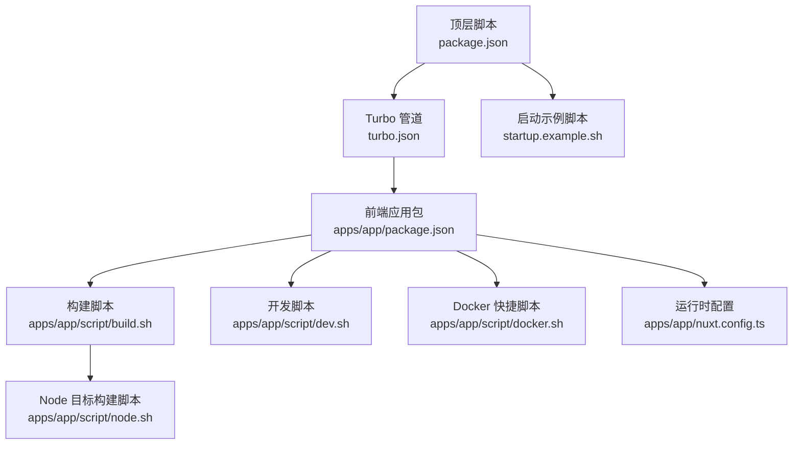
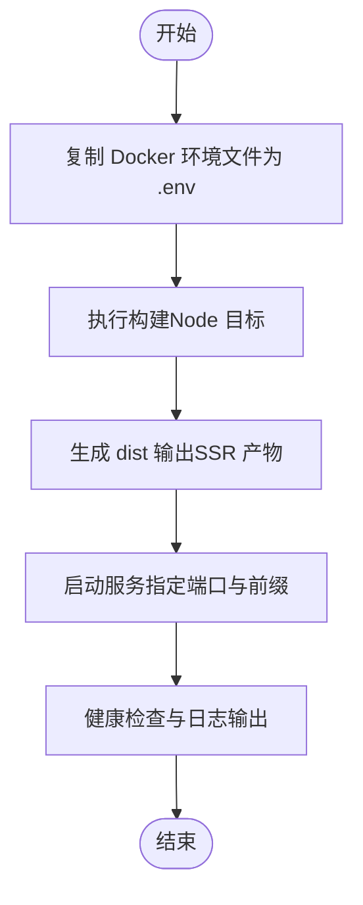
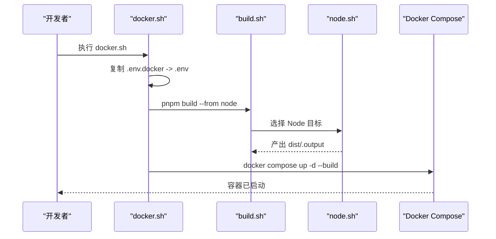
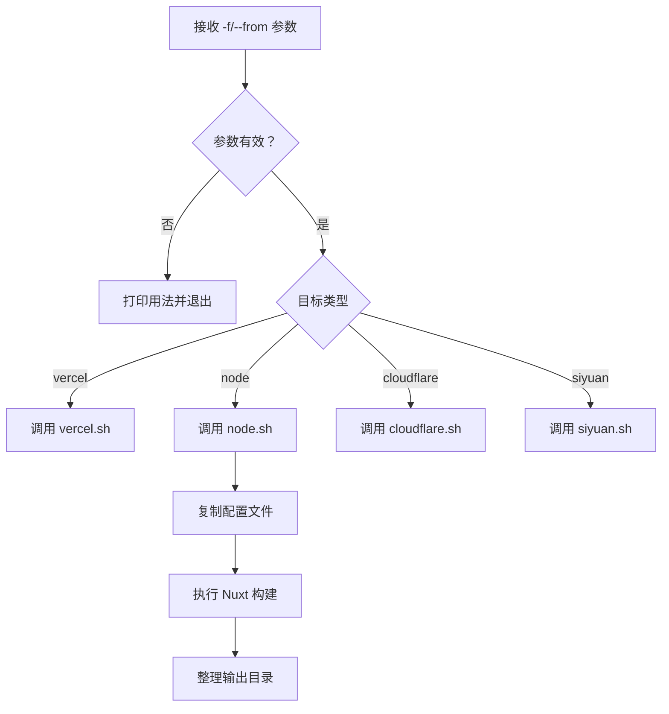
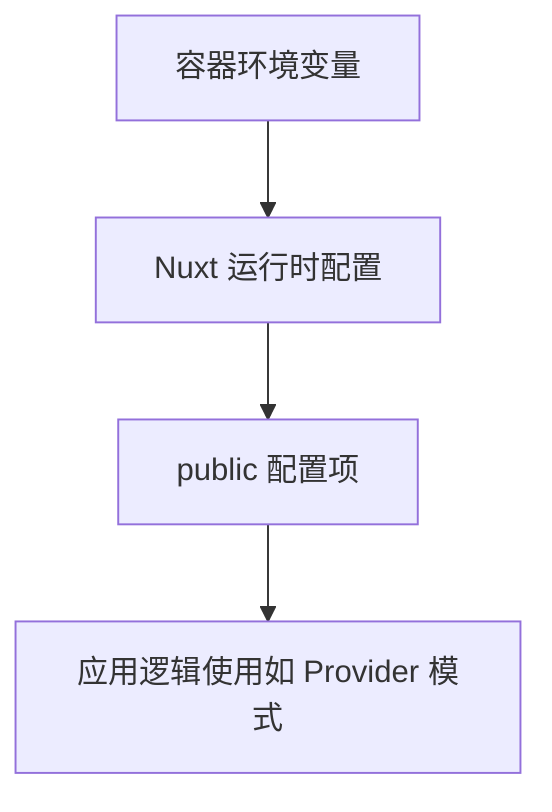
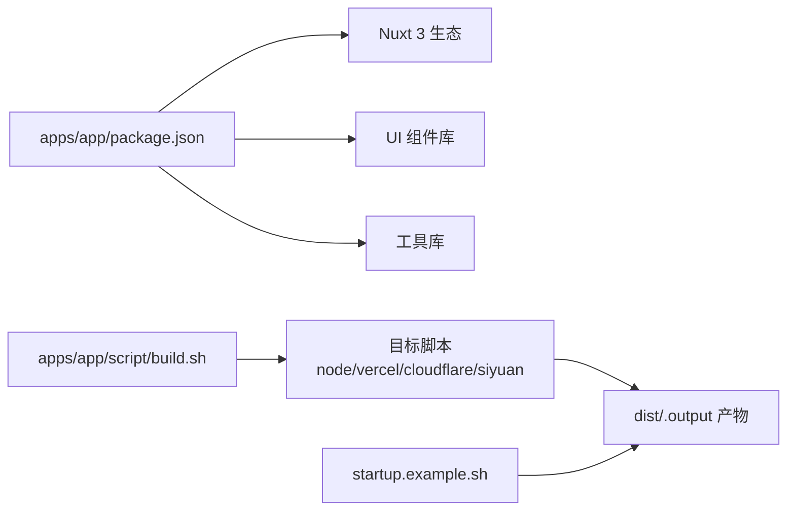

# 容器化部署

<cite>
**本文引用的文件**
- [apps/app/script/docker.sh](file://apps/app/script/docker.sh)
- [apps/app/script/build.sh](file://apps/app/script/build.sh)
- [apps/app/script/node.sh](file://apps/app/script/node.sh)
- [apps/app/script/dev.sh](file://apps/app/script/dev.sh)
- [startup.example.sh](file://startup.example.sh)
- [turbo.json](file://turbo.json)
- [apps/app/nuxt.config.ts](file://apps/app/nuxt.config.ts)
- [package.json](file://package.json)
- [apps/app/package.json](file://apps/app/package.json)
</cite>

## 目录
1. [简介](#简介)
2. [项目结构](#项目结构)
3. [核心组件](#核心组件)
4. [架构总览](#架构总览)
5. [详细组件分析](#详细组件分析)
6. [依赖分析](#依赖分析)
7. [性能考虑](#性能考虑)
8. [故障排查指南](#故障排查指南)
9. [结论](#结论)
10. [附录](#附录)

## 简介
本文件面向希望在容器环境中部署前端应用（基于 Nuxt 3 的单页应用）的工程团队，提供从镜像构建到运行时配置、编排与运维的完整指南。该仓库采用多包工作区与 Turbo 管道进行统一构建，前端应用通过 Node SSR 方案打包输出静态资源与服务端入口，适合以容器方式运行与分发。

## 项目结构
- 工程采用 pnpm monorepo + Turbo 工作流，顶层脚本统一调度各子包构建。
- 前端应用位于 apps/app，使用 Nuxt 3，支持多平台构建目标（如 node、vercel、cloudflare、siyuan），其中 node 目标用于 SSR 运行。
- 提供一键 Docker 化脚本，结合环境变量与启动示例，实现本地快速容器化部署。

图表来源
- [package.json:1-27](file://package.json#L1-L27)
- [turbo.json:1-17](file://turbo.json#L1-L17)
- [apps/app/package.json:1-41](file://apps/app/package.json#L1-L41)
- [apps/app/script/build.sh:1-63](file://apps/app/script/build.sh#L1-L63)
- [apps/app/script/node.sh:1-31](file://apps/app/script/node.sh#L1-L31)
- [apps/app/script/dev.sh:1-15](file://apps/app/script/dev.sh#L1-L15)
- [apps/app/script/docker.sh:1-18](file://apps/app/script/docker.sh#L1-L18)
- [apps/app/nuxt.config.ts:1-125](file://apps/app/nuxt.config.ts#L1-L125)
- [startup.example.sh:1-7](file://startup.example.sh#L1-L7)

章节来源
- [package.json:1-27](file://package.json#L1-L27)
- [turbo.json:1-17](file://turbo.json#L1-L17)
- [apps/app/package.json:1-41](file://apps/app/package.json#L1-L41)

## 核心组件
- 构建管道与任务
  - 顶层通过脚本统一触发构建，底层由 Turbo 管理任务依赖与缓存。
  - 关键任务：build、dev、lint、clean。
- 前端应用构建
  - 支持多目标构建，Node 目标用于 SSR 运行；Vercel/Cloudflare/Siyuan 目标用于各自平台。
  - Node 目标构建会复制配置文件并执行 Nuxt 构建，随后整理输出目录。
- 运行时配置
  - Nuxt 运行时公开配置项包含默认类型、Provider 模式开关与 Provider 地址等，便于容器注入环境变量。
- 启动示例
  - 提供示例启动脚本，展示如何在 Node 目标下以指定端口与可选前缀路径运行服务端入口。

章节来源
- [turbo.json:1-17](file://turbo.json#L1-L17)
- [apps/app/script/build.sh:1-63](file://apps/app/script/build.sh#L1-L63)
- [apps/app/script/node.sh:1-31](file://apps/app/script/node.sh#L1-L31)
- [apps/app/nuxt.config.ts:113-121](file://apps/app/nuxt.config.ts#L113-L121)
- [startup.example.sh:1-7](file://startup.example.sh#L1-L7)

## 架构总览
下图展示了从“构建到运行”的整体流程，以及与环境变量的关系：

图表来源
- [apps/app/script/docker.sh:15-18](file://apps/app/script/docker.sh#L15-L18)
- [apps/app/script/build.sh:46-63](file://apps/app/script/build.sh#L46-L63)
- [apps/app/script/node.sh:13-31](file://apps/app/script/node.sh#L13-L31)
- [startup.example.sh:4-7](file://startup.example.sh#L4-L7)

## 详细组件分析

### 组件一：Docker 化快捷脚本
- 功能要点
  - 将 Docker 环境文件复制为 .env，确保构建阶段读取正确的环境变量。
  - 触发 Node 目标构建，并使用 Docker Compose 以“后台构建”方式启动服务。
- 最佳实践建议
  - 在 CI/CD 中，建议显式传入环境变量或在 Compose 中声明环境文件，避免硬编码。
  - 若需多阶段构建，可在脚本中增加条件分支以切换构建模式。

图表来源
- [apps/app/script/docker.sh:15-18](file://apps/app/script/docker.sh#L15-L18)
- [apps/app/script/build.sh:46-63](file://apps/app/script/build.sh#L46-L63)
- [apps/app/script/node.sh:13-31](file://apps/app/script/node.sh#L13-L31)

章节来源
- [apps/app/script/docker.sh:1-18](file://apps/app/script/docker.sh#L1-L18)

### 组件二：构建脚本与目标选择
- 功能要点
  - 通过 -f/--from 参数选择构建目标（vercel、node、cloudflare、siyuan）。
  - Node 目标会复制特定配置文件并执行 Nuxt 构建，随后整理输出目录。
- 性能与稳定性
  - Node 目标构建时设置较大的堆内存上限，有助于减少打包阶段的 OOM 风险。
  - 构建后对特定依赖进行重命名处理，避免打包工具链的兼容性问题。

图表来源
- [apps/app/script/build.sh:13-63](file://apps/app/script/build.sh#L13-L63)
- [apps/app/script/node.sh:13-31](file://apps/app/script/node.sh#L13-L31)

章节来源
- [apps/app/script/build.sh:1-63](file://apps/app/script/build.sh#L1-L63)
- [apps/app/script/node.sh:1-31](file://apps/app/script/node.sh#L1-L31)

### 组件三：运行时配置与环境变量
- 关键配置项
  - defaultType：默认运行类型（如 node）。
  - providerMode：Provider 模式开关。
  - providerUrl：Provider 服务地址。
  - siyuanApiUrl：Siyuan API 地址。
- 注入方式
  - 通过 Nuxt 的 runtimeConfig.public 注入，可在容器中以环境变量形式传递。
  - 示例启动脚本展示了如何在 Node 目标下设置端口与可选前缀路径。

图表来源
- [apps/app/nuxt.config.ts:113-121](file://apps/app/nuxt.config.ts#L113-L121)
- [startup.example.sh:4-7](file://startup.example.sh#L4-L7)

章节来源
- [apps/app/nuxt.config.ts:113-121](file://apps/app/nuxt.config.ts#L113-L121)
- [startup.example.sh:1-7](file://startup.example.sh#L1-L7)

### 组件四：开发与本地调试
- 开发脚本
  - 复制 Node 配置文件，执行 Nuxt 开发服务器并开启主机访问。
- 适用场景
  - 本地联调、热更新与调试，不涉及容器镜像构建。

章节来源
- [apps/app/script/dev.sh:1-15](file://apps/app/script/dev.sh#L1-L15)

## 依赖分析
- 顶层依赖
  - 通过脚本统一触发构建与开发任务，任务定义与输入输出由 Turbo 管理。
- 应用包依赖
  - 前端应用依赖 Nuxt 3、Element Plus、Pinia 等生态组件，构建脚本负责适配不同目标平台。
- 关键耦合点
  - 构建脚本与目标配置文件存在复制关系，确保构建产物符合预期。
  - 运行时配置与环境变量强相关，容器部署时应保证变量正确注入。

图表来源
- [apps/app/package.json:12-40](file://apps/app/package.json#L12-L40)
- [apps/app/script/build.sh:46-63](file://apps/app/script/build.sh#L46-L63)
- [startup.example.sh:4-7](file://startup.example.sh#L4-L7)

章节来源
- [package.json:1-27](file://package.json#L1-L27)
- [apps/app/package.json:1-41](file://apps/app/package.json#L1-L41)
- [turbo.json:1-17](file://turbo.json#L1-L17)

## 性能考虑
- 构建阶段
  - Node 目标构建时提升堆内存上限，降低大体积应用打包失败概率。
  - 对打包产物进行必要的目录整理，避免后续运行时缺失依赖。
- 运行阶段
  - 通过环境变量控制运行模式与 Provider 地址，避免在容器内硬编码。
  - 使用可选前缀路径（如 /blog）以适配反向代理或子路径部署。

章节来源
- [apps/app/script/node.sh:15-29](file://apps/app/script/node.sh#L15-L29)
- [startup.example.sh:6-7](file://startup.example.sh#L6-L7)

## 故障排查指南
- 构建失败
  - 检查 -f/--from 参数是否正确传入，确认目标脚本是否存在。
  - 确认 Node 目标构建前的配置复制步骤是否成功。
- 运行异常
  - 确认环境变量是否正确注入（defaultType、providerMode、providerUrl、siyuanApiUrl）。
  - 检查端口占用与容器网络映射是否正确。
- 日志与健康检查
  - 建议在容器中启用标准输出日志采集，并在启动脚本中输出关键状态信息以便健康检查判断。

章节来源
- [apps/app/script/build.sh:13-63](file://apps/app/script/build.sh#L13-L63)
- [apps/app/nuxt.config.ts:113-121](file://apps/app/nuxt.config.ts#L113-L121)
- [startup.example.sh:4-7](file://startup.example.sh#L4-L7)

## 结论
该工程提供了完整的前端应用容器化部署路径：通过统一的构建脚本与目标选择机制，配合运行时环境变量注入，能够在容器环境中稳定地运行 Nuxt 3 SSR 应用。建议在生产环境中进一步完善 Dockerfile 多阶段构建、健康检查与日志采集策略，以满足更高的可靠性与可观测性要求。

## 附录
- 快速开始
  - 在本地执行 Docker 化脚本，自动完成环境准备、构建与容器启动。
  - 如需自定义端口或前缀路径，请参考启动示例脚本中的参数设置。
- 参考文件路径
  - [apps/app/script/docker.sh](file://apps/app/script/docker.sh)
  - [apps/app/script/build.sh](file://apps/app/script/build.sh)
  - [apps/app/script/node.sh](file://apps/app/script/node.sh)
  - [apps/app/script/dev.sh](file://apps/app/script/dev.sh)
  - [startup.example.sh](file://startup.example.sh)
  - [turbo.json](file://turbo.json)
  - [apps/app/nuxt.config.ts](file://apps/app/nuxt.config.ts)
  - [package.json](file://package.json)
  - [apps/app/package.json](file://apps/app/package.json)