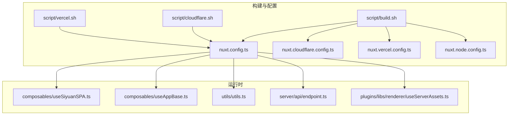
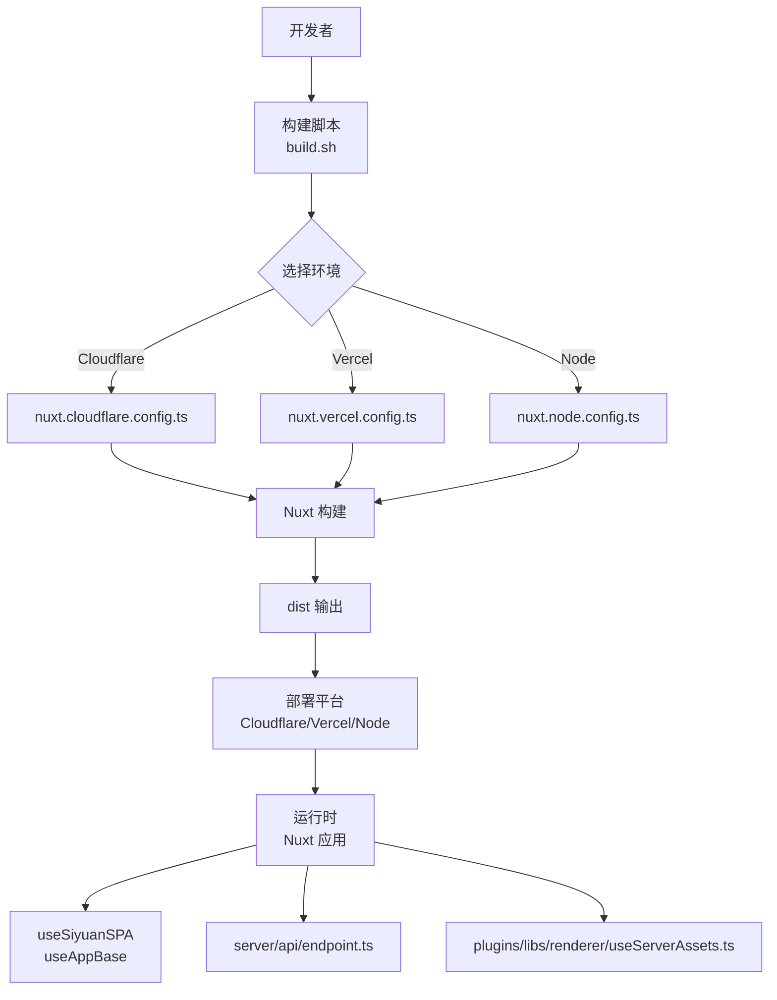
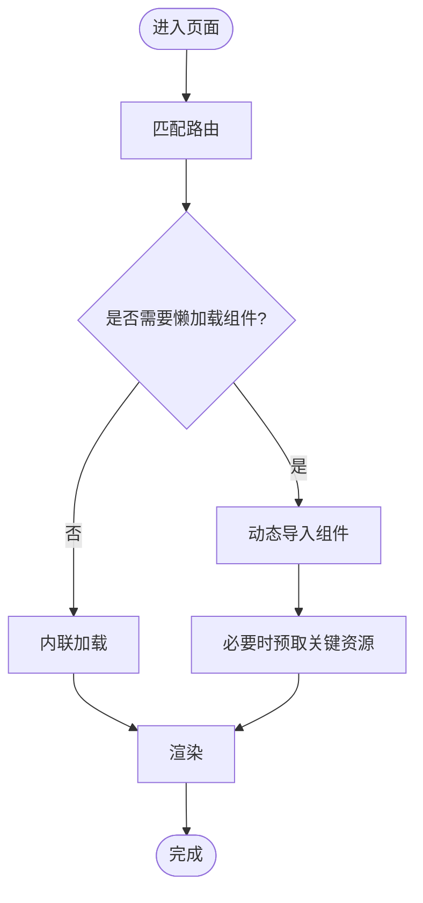
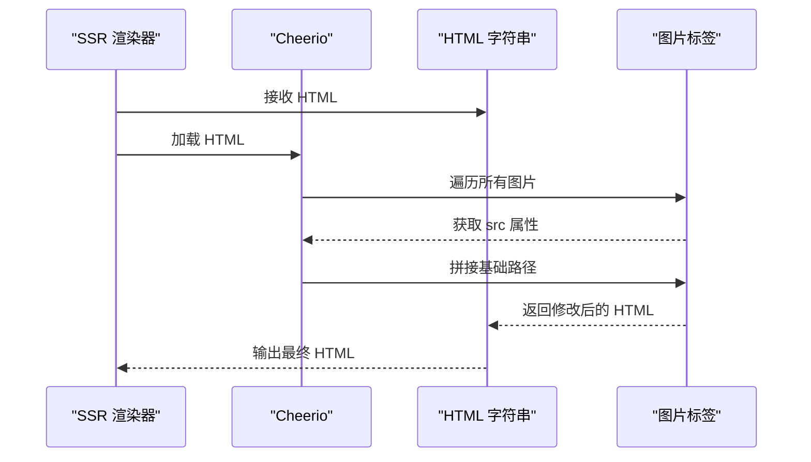
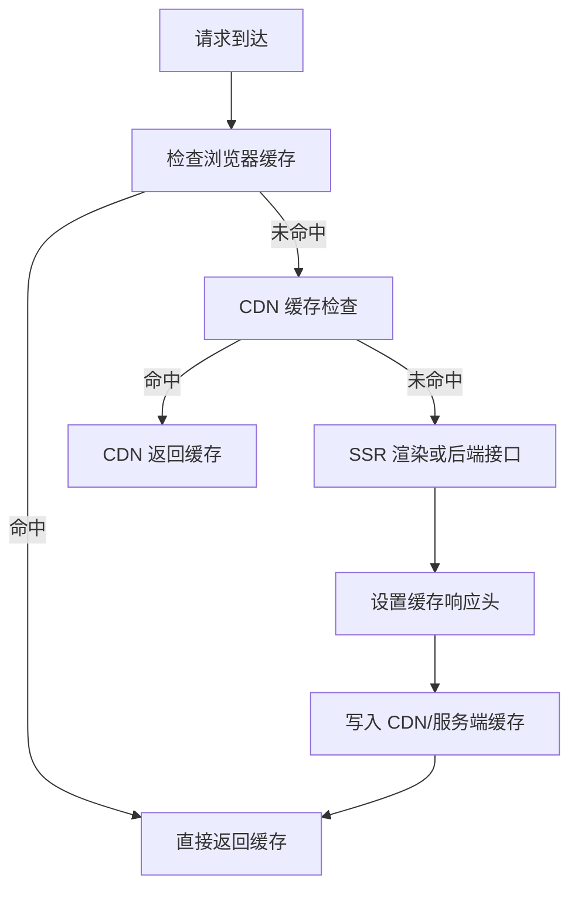
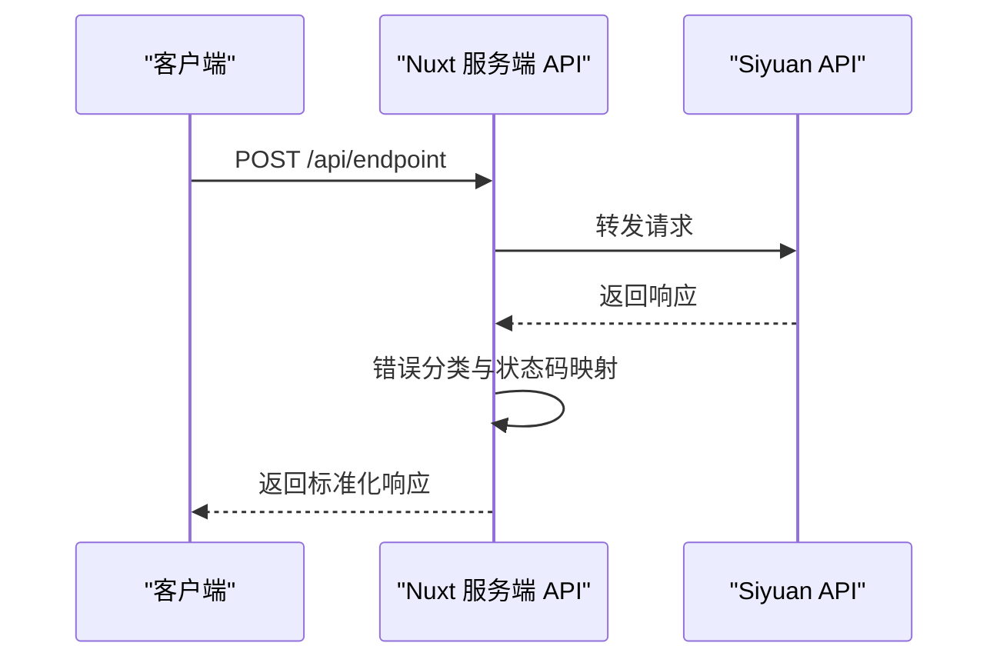
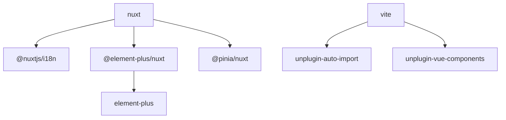

# 性能优化

<cite>
**本文引用的文件**
- [apps/app/nuxt.config.ts](file://apps/app/nuxt.config.ts)
- [apps/app/nuxt.cloudflare.config.ts](file://apps/app/nuxt.cloudflare.config.ts)
- [apps/app/nuxt.vercel.config.ts](file://apps/app/nuxt.vercel.config.ts)
- [apps/app/nuxt.node.config.ts](file://apps/app/nuxt.node.config.ts)
- [apps/app/package.json](file://apps/app/package.json)
- [apps/app/script/build.sh](file://apps/app/script/build.sh)
- [apps/app/script/cloudflare.sh](file://apps/app/script/cloudflare.sh)
- [apps/app/script/vercel.sh](file://apps/app/script/vercel.sh)
- [apps/app/composables/useSiyuanSPA.ts](file://apps/app/composables/useSiyuanSPA.ts)
- [apps/app/composables/useAppBase.ts](file://apps/app/composables/useAppBase.ts)
- [apps/app/utils/utils.ts](file://apps/app/utils/utils.ts)
- [apps/app/server/api/endpoint.ts](file://apps/app/server/api/endpoint.ts)
- [apps/app/plugins/libs/renderer/useServerAssets.ts](file://apps/app/plugins/libs/renderer/useServerAssets.ts)
</cite>

## 目录
1. [简介](#简介)
2. [项目结构](#项目结构)
3. [核心组件](#核心组件)
4. [架构总览](#架构总览)
5. [详细组件分析](#详细组件分析)
6. [依赖分析](#依赖分析)
7. [性能考量](#性能考量)
8. [故障排查指南](#故障排查指南)
9. [结论](#结论)
10. [附录](#附录)

## 简介
本指南围绕 Nuxt.js 应用在构建、运行与部署阶段的性能优化展开，结合本仓库现有配置与实现，系统阐述以下方面：
- 代码分割、懒加载与预取配置
- 静态资源优化（图片、CSS、JS）
- 缓存策略（浏览器、CDN、服务端）
- API 性能优化（请求合并、响应缓存）
- 数据库查询与索引最佳实践（概念性指导）
- 监控指标与性能分析工具使用
- 移动端性能优化的特殊考虑

## 项目结构
该应用采用多环境构建配置，通过不同 Nuxt 配置文件适配不同部署平台，并配合脚本切换构建目标。关键目录与文件如下：
- 多环境 Nuxt 配置：nuxt.config.ts（默认）、nuxt.cloudflare.config.ts、nuxt.vercel.config.ts、nuxt.node.config.ts
- 构建脚本：script/build.sh、script/cloudflare.sh、script/vercel.sh
- 运行时组合式函数：composables/useSiyuanSPA.ts、composables/useAppBase.ts
- 工具函数：utils/utils.ts
- 服务端 API：server/api/endpoint.ts
- 静态资源处理：plugins/libs/renderer/useServerAssets.ts

**图表来源**
- [apps/app/nuxt.config.ts:1-125](file://apps/app/nuxt.config.ts#L1-L125)
- [apps/app/nuxt.cloudflare.config.ts:1-126](file://apps/app/nuxt.cloudflare.config.ts#L1-L126)
- [apps/app/nuxt.vercel.config.ts:1-134](file://apps/app/nuxt.vercel.config.ts#L1-L134)
- [apps/app/nuxt.node.config.ts:1-125](file://apps/app/nuxt.node.config.ts#L1-L125)
- [apps/app/script/build.sh:1-63](file://apps/app/script/build.sh#L1-L63)
- [apps/app/script/cloudflare.sh:1-16](file://apps/app/script/cloudflare.sh#L1-L16)
- [apps/app/script/vercel.sh:1-16](file://apps/app/script/vercel.sh#L1-L16)
- [apps/app/composables/useSiyuanSPA.ts:1-16](file://apps/app/composables/useSiyuanSPA.ts#L1-L16)
- [apps/app/composables/useAppBase.ts:1-22](file://apps/app/composables/useAppBase.ts#L1-L22)
- [apps/app/utils/utils.ts:1-35](file://apps/app/utils/utils.ts#L1-L35)
- [apps/app/server/api/endpoint.ts:1-40](file://apps/app/server/api/endpoint.ts#L1-L40)
- [apps/app/plugins/libs/renderer/useServerAssets.ts:43-70](file://apps/app/plugins/libs/renderer/useServerAssets.ts#L43-L70)

**章节来源**
- [apps/app/nuxt.config.ts:1-125](file://apps/app/nuxt.config.ts#L1-L125)
- [apps/app/nuxt.cloudflare.config.ts:1-126](file://apps/app/nuxt.cloudflare.config.ts#L1-L126)
- [apps/app/nuxt.vercel.config.ts:1-134](file://apps/app/nuxt.vercel.config.ts#L1-L134)
- [apps/app/nuxt.node.config.ts:1-125](file://apps/app/nuxt.node.config.ts#L1-L125)
- [apps/app/script/build.sh:1-63](file://apps/app/script/build.sh#L1-L63)
- [apps/app/script/cloudflare.sh:1-16](file://apps/app/script/cloudflare.sh#L1-L16)
- [apps/app/script/vercel.sh:1-16](file://apps/app/script/vercel.sh#L1-L16)

## 核心组件
- 多环境 Nuxt 配置：统一管理模块、国际化、Head 注入、Vite 插件、运行时配置等；Cloudflare/Vercel 配置额外指定 Nitro 预设与外部依赖别名。
- 构建脚本：通过命令行参数选择构建目标，自动替换 nuxt.config.ts 并执行 nuxt build。
- 组合式函数：useSiyuanSPA 用于识别当前运行模式；useAppBase 提供应用基础路径。
- 工具函数：摘要生成、过期判断等辅助逻辑。
- 服务端 API：统一转发到上游 Siyuan API，集中错误处理。
- 静态资源处理：服务端渲染时为 HTML 内图片 src 添加服务端基础路径。

**章节来源**
- [apps/app/nuxt.config.ts:1-125](file://apps/app/nuxt.config.ts#L1-L125)
- [apps/app/nuxt.cloudflare.config.ts:1-126](file://apps/app/nuxt.cloudflare.config.ts#L1-L126)
- [apps/app/nuxt.vercel.config.ts:1-134](file://apps/app/nuxt.vercel.config.ts#L1-L134)
- [apps/app/nuxt.node.config.ts:1-125](file://apps/app/nuxt.node.config.ts#L1-L125)
- [apps/app/composables/useSiyuanSPA.ts:1-16](file://apps/app/composables/useSiyuanSPA.ts#L1-L16)
- [apps/app/composables/useAppBase.ts:1-22](file://apps/app/composables/useAppBase.ts#L1-L22)
- [apps/app/utils/utils.ts:1-35](file://apps/app/utils/utils.ts#L1-L35)
- [apps/app/server/api/endpoint.ts:1-40](file://apps/app/server/api/endpoint.ts#L1-L40)
- [apps/app/plugins/libs/renderer/useServerAssets.ts:43-70](file://apps/app/plugins/libs/renderer/useServerAssets.ts#L43-L70)

## 架构总览
下图展示从构建到运行的关键流程，以及与部署平台的耦合关系：

**图表来源**
- [apps/app/script/build.sh:1-63](file://apps/app/script/build.sh#L1-L63)
- [apps/app/script/cloudflare.sh:1-16](file://apps/app/script/cloudflare.sh#L1-L16)
- [apps/app/script/vercel.sh:1-16](file://apps/app/script/vercel.sh#L1-L16)
- [apps/app/nuxt.cloudflare.config.ts:1-126](file://apps/app/nuxt.cloudflare.config.ts#L1-L126)
- [apps/app/nuxt.vercel.config.ts:1-134](file://apps/app/nuxt.vercel.config.ts#L1-L134)
- [apps/app/nuxt.node.config.ts:1-125](file://apps/app/nuxt.node.config.ts#L1-L125)
- [apps/app/composables/useSiyuanSPA.ts:1-16](file://apps/app/composables/useSiyuanSPA.ts#L1-L16)
- [apps/app/composables/useAppBase.ts:1-22](file://apps/app/composables/useAppBase.ts#L1-L22)
- [apps/app/server/api/endpoint.ts:1-40](file://apps/app/server/api/endpoint.ts#L1-L40)
- [apps/app/plugins/libs/renderer/useServerAssets.ts:43-70](file://apps/app/plugins/libs/renderer/useServerAssets.ts#L43-L70)

## 详细组件分析

### Nuxt 配置与代码分割、懒加载、预取
- 代码分割与懒加载
  - Nuxt 默认按路由拆分页面与共享模块，结合动态导入可进一步细化组件级懒加载。
  - 当前配置启用 Element Plus 自动导入与组件扫描，减少手动引入开销。
- 预取与预加载
  - 可通过路由级 meta 或 Nuxt 的预取机制对关键页面进行预取，缩短首屏等待。
  - Head 中注入的 CSS/JS 已使用版本号参数，有助于缓存控制与更新。
- 关键实现位置
  - 模块与 UI 集成：[apps/app/nuxt.config.ts:23-23](file://apps/app/nuxt.config.ts#L23-L23)、[apps/app/nuxt.config.ts:108-111](file://apps/app/nuxt.config.ts#L108-L111)
  - Head 注入与版本号：[apps/app/nuxt.config.ts:46-87](file://apps/app/nuxt.config.ts#L46-L87)

**章节来源**
- [apps/app/nuxt.config.ts:23-23](file://apps/app/nuxt.config.ts#L23-L23)
- [apps/app/nuxt.config.ts:46-87](file://apps/app/nuxt.config.ts#L46-L87)
- [apps/app/nuxt.config.ts:108-111](file://apps/app/nuxt.config.ts#L108-L111)

### 静态资源优化（图片、CSS、JS）
- 图片优化
  - 服务端渲染时为 HTML 中的图片 src 自动添加基础路径，确保资源正确加载。
  - 建议在生产环境使用现代格式（WebP/AVIF）与合适的尺寸裁剪，结合 CDN 缓存。
- CSS 与 JS 压缩
  - Nuxt/Vite 默认启用压缩；Head 中注入的 CSS/JS 已带版本号参数，便于缓存失效与增量更新。
- 关键实现位置
  - 图片路径处理：[apps/app/plugins/libs/renderer/useServerAssets.ts:43-70](file://apps/app/plugins/libs/renderer/useServerAssets.ts#L43-L70)
  - Head 注入与版本号：[apps/app/nuxt.config.ts:46-87](file://apps/app/nuxt.config.ts#L46-L87)

**图表来源**
- [apps/app/plugins/libs/renderer/useServerAssets.ts:43-70](file://apps/app/plugins/libs/renderer/useServerAssets.ts#L43-L70)

**章节来源**
- [apps/app/plugins/libs/renderer/useServerAssets.ts:43-70](file://apps/app/plugins/libs/renderer/useServerAssets.ts#L43-L70)
- [apps/app/nuxt.config.ts:46-87](file://apps/app/nuxt.config.ts#L46-L87)

### 缓存策略配置（浏览器、CDN、服务端）
- 浏览器缓存
  - 版本号参数（如 ?v=yyyyMMddHHmm）用于强制刷新与缓存失效。
  - Head 中的 CSS/JS 已附加版本号，建议对静态资源采用长缓存策略。
- CDN 缓存
  - Cloudflare/Vercel 预设由各自配置文件指定；建议为不同资源类型设置差异化 TTL。
- 服务端缓存
  - 服务端 API 可增加响应头以控制缓存；对不常变动的数据可启用内存或分布式缓存。
- 关键实现位置
  - 版本号生成与 Head 注入：[apps/app/nuxt.config.ts:5-17](file://apps/app/nuxt.config.ts#L5-L17)、[apps/app/nuxt.config.ts:46-87](file://apps/app/nuxt.config.ts#L46-L87)
  - Nitro 预设（Cloudflare/Vercel）：[apps/app/nuxt.cloudflare.config.ts:105-112](file://apps/app/nuxt.cloudflare.config.ts#L105-L112)、[apps/app/nuxt.vercel.config.ts:90-97](file://apps/app/nuxt.vercel.config.ts#L90-L97)

**章节来源**
- [apps/app/nuxt.config.ts:5-17](file://apps/app/nuxt.config.ts#L5-L17)
- [apps/app/nuxt.config.ts:46-87](file://apps/app/nuxt.config.ts#L46-L87)
- [apps/app/nuxt.cloudflare.config.ts:105-112](file://apps/app/nuxt.cloudflare.config.ts#L105-L112)
- [apps/app/nuxt.vercel.config.ts:90-97](file://apps/app/nuxt.vercel.config.ts#L90-L97)

### API 性能优化（请求合并、响应缓存）
- 请求合并
  - 将多个小请求合并为批量请求，减少网络往返与服务端压力。
- 响应缓存
  - 为稳定数据设置强缓存（ETag/Last-Modified），为动态数据设置合理 max-age。
- 错误处理与降级
  - 对上游 API 的异常进行分类处理，避免级联失败。
- 关键实现位置
  - 代理转发与错误处理：[apps/app/server/api/endpoint.ts:12-39](file://apps/app/server/api/endpoint.ts#L12-L39)

**图表来源**
- [apps/app/server/api/endpoint.ts:12-39](file://apps/app/server/api/endpoint.ts#L12-L39)

**章节来源**
- [apps/app/server/api/endpoint.ts:12-39](file://apps/app/server/api/endpoint.ts#L12-L39)

### 数据库查询优化与索引配置（概念性指导）
- 查询优化
  - 使用 EXPLAIN 分析慢查询；避免 N+1 查询；合理使用连接与子查询。
- 索引策略
  - 为高频过滤字段建立复合索引；定期维护统计信息。
- 缓存与读写分离
  - 对只读数据开启缓存；热点数据放入缓存；读写分离降低锁竞争。
- 本仓库说明
  - 本仓库为前端应用，数据库层优化属于概念性建议，不涉及具体实现文件。

[本节为通用指导，不直接分析具体文件]

### 监控指标与性能分析工具
- 指标建议
  - 前端：FP/FCP/LCP/FID/CLS、首屏时间、TTFB、资源体积与请求数。
  - 后端：QPS、P95/P99 延迟、错误率、缓存命中率。
- 工具建议
  - 前端：Lighthouse、WebPageTest、Sentry、Google Analytics。
  - 后端：Prometheus/Grafana、APM（如 New Relic/DataDog）。
- 本仓库说明
  - 本仓库未包含专门的监控集成代码，建议在部署环境中接入相应探针与上报。

[本节为通用指导，不直接分析具体文件]

### 移动端性能优化的特殊考虑
- 资源优化
  - 使用更小的图片尺寸与格式；减少首屏 JS 体积；启用 Gzip/Brotli。
- 交互体验
  - 减少主线程阻塞；使用 Web Workers 处理重任务；合理使用虚拟滚动。
- 缓存与离线
  - Service Worker 缓存关键资源；支持离线访问。
- 本仓库说明
  - 主题与模块中包含移动端样式文件，可在主题层面进行针对性优化。

[本节为通用指导，不直接分析具体文件]

## 依赖分析
- Nuxt 与生态
  - Nuxt 3、@nuxtjs/i18n、@element-plus/nuxt、@pinia/nuxt 等模块提供国际化、UI 与状态管理能力。
- 构建工具
  - Vite 插件（AutoImport、Components）与 Stylus 支持样式开发。
- 关键实现位置
  - 依赖声明：[apps/app/package.json:12-32](file://apps/app/package.json#L12-L32)

**图表来源**
- [apps/app/package.json:12-32](file://apps/app/package.json#L12-L32)

**章节来源**
- [apps/app/package.json:12-32](file://apps/app/package.json#L12-L32)

## 性能考量
- 构建与打包
  - 使用多环境配置按需启用功能，避免不必要的依赖进入生产包。
  - 通过版本号参数与 CDN 缓存策略平衡更新与缓存收益。
- 运行时
  - 动态导入与懒加载减少初始包体积；服务端渲染时处理静态资源路径。
  - API 层统一错误处理与状态码映射，提升稳定性。
- 部署
  - Cloudflare/Vercel 预设适配不同平台特性；Nitro 外部依赖别名减少打包体积。

[本节为综合建议，不直接分析具体文件]

## 故障排查指南
- 构建问题
  - 确认构建脚本参数正确，目标配置文件已复制到 nuxt.config.ts。
  - 查看各平台预设是否正确加载。
- 运行时问题
  - 检查运行时配置项（如 API 地址）是否正确。
  - 若图片路径异常，确认服务端资产前缀处理逻辑。
- API 问题
  - 关注服务端 API 的错误分类与状态码映射，定位上游异常。
- 关键实现位置
  - 构建脚本与环境切换：[apps/app/script/build.sh:22-37](file://apps/app/script/build.sh#L22-L37)、[apps/app/script/cloudflare.sh:13-15](file://apps/app/script/cloudflare.sh#L13-L15)、[apps/app/script/vercel.sh:13-15](file://apps/app/script/vercel.sh#L13-L15)
  - 运行时配置读取：[apps/app/composables/useSiyuanSPA.ts:11-12](file://apps/app/composables/useSiyuanSPA.ts#L11-L12)、[apps/app/composables/useAppBase.ts:18-19](file://apps/app/composables/useAppBase.ts#L18-L19)
  - 资源路径处理：[apps/app/plugins/libs/renderer/useServerAssets.ts:49-66](file://apps/app/plugins/libs/renderer/useServerAssets.ts#L49-L66)
  - API 错误处理：[apps/app/server/api/endpoint.ts:19-32](file://apps/app/server/api/endpoint.ts#L19-L32)

**章节来源**
- [apps/app/script/build.sh:22-37](file://apps/app/script/build.sh#L22-L37)
- [apps/app/script/cloudflare.sh:13-15](file://apps/app/script/cloudflare.sh#L13-L15)
- [apps/app/script/vercel.sh:13-15](file://apps/app/script/vercel.sh#L13-L15)
- [apps/app/composables/useSiyuanSPA.ts:11-12](file://apps/app/composables/useSiyuanSPA.ts#L11-L12)
- [apps/app/composables/useAppBase.ts:18-19](file://apps/app/composables/useAppBase.ts#L18-L19)
- [apps/app/plugins/libs/renderer/useServerAssets.ts:49-66](file://apps/app/plugins/libs/renderer/useServerAssets.ts#L49-L66)
- [apps/app/server/api/endpoint.ts:19-32](file://apps/app/server/api/endpoint.ts#L19-L32)

## 结论
本项目通过多环境 Nuxt 配置与构建脚本实现了灵活的部署适配，结合版本号参数与 CDN 缓存策略提升了静态资源的缓存效率。服务端 API 提供了统一的代理与错误处理机制。为进一步提升性能，建议在现有基础上完善代码分割与懒加载策略、引入更严格的静态资源优化方案、完善 API 缓存与监控体系，并针对移动端场景进行专项优化。

[本节为总结，不直接分析具体文件]

## 附录
- 快速参考
  - 切换构建环境：使用 build.sh 的 -f/--from 参数选择 vercel、node、cloudflare 或 siyuan。
  - 运行时模式检测：useSiyuanSPA 用于识别当前运行模式。
  - 基础路径获取：useAppBase 提供应用基础路径。
  - 资源路径处理：服务端渲染时为图片 src 添加基础路径。
  - API 代理：server/api/endpoint.ts 统一转发并处理错误。

**章节来源**
- [apps/app/script/build.sh:13-37](file://apps/app/script/build.sh#L13-L37)
- [apps/app/composables/useSiyuanSPA.ts:10-15](file://apps/app/composables/useSiyuanSPA.ts#L10-L15)
- [apps/app/composables/useAppBase.ts:16-21](file://apps/app/composables/useAppBase.ts#L16-L21)
- [apps/app/plugins/libs/renderer/useServerAssets.ts:43-70](file://apps/app/plugins/libs/renderer/useServerAssets.ts#L43-L70)
- [apps/app/server/api/endpoint.ts:12-39](file://apps/app/server/api/endpoint.ts#L12-L39)