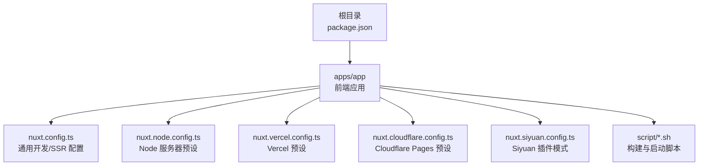
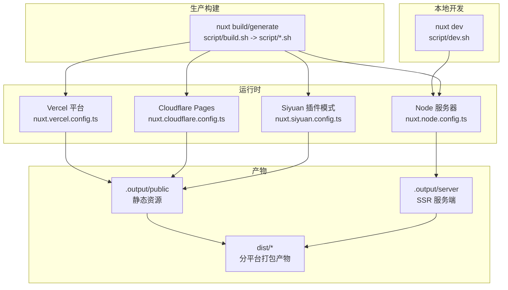
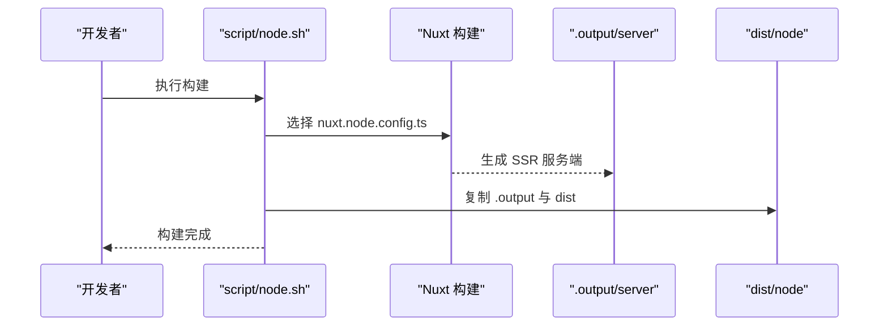
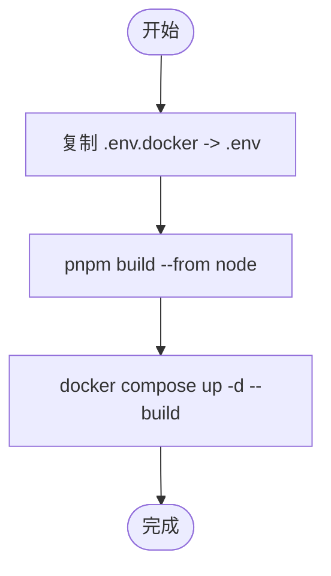
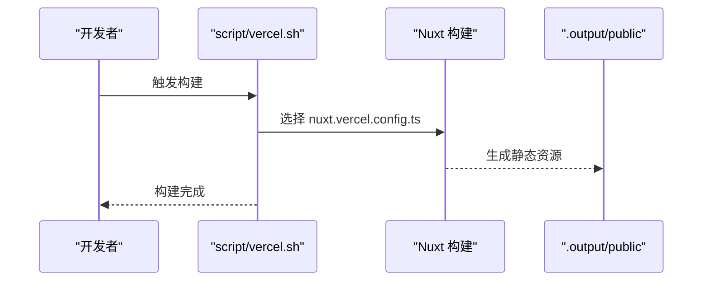
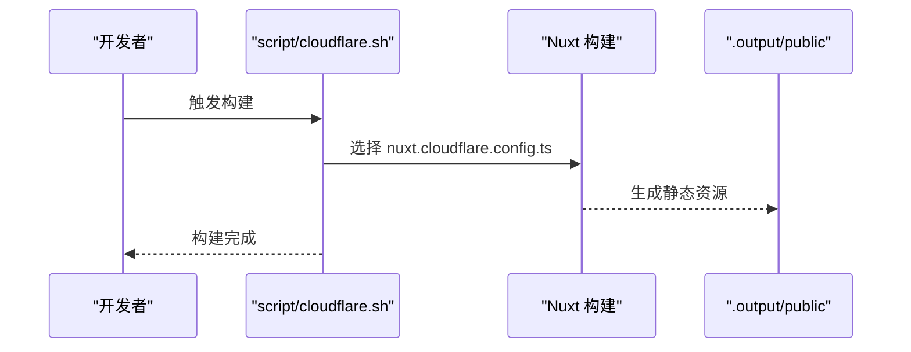
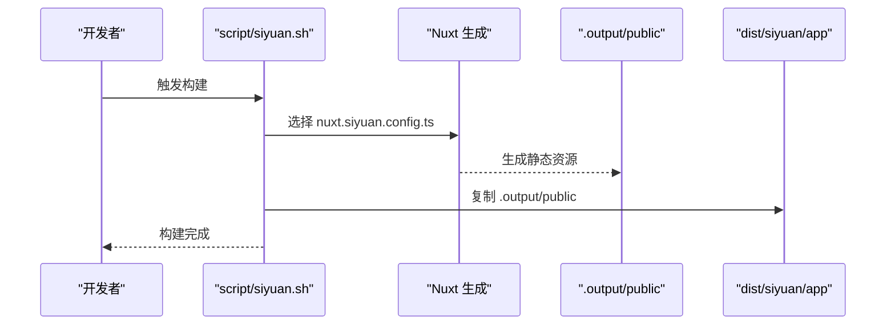
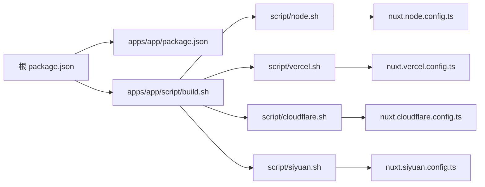
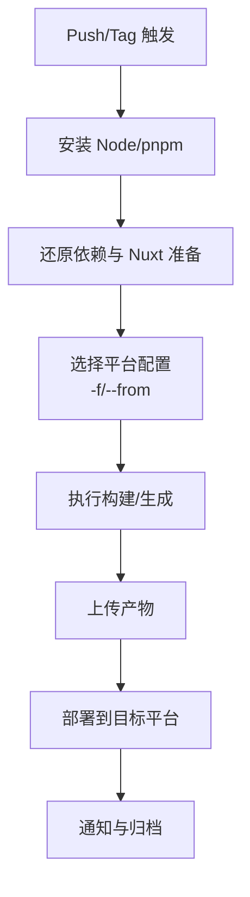

# 部署指南

<cite>
**本文引用的文件**
- [package.json](file://package.json)
- [apps/app/package.json](file://apps/app/package.json)
- [apps/app/nuxt.config.ts](file://apps/app/nuxt.config.ts)
- [apps/app/nuxt.siyuan.config.ts](file://apps/app/nuxt.siyuan.config.ts)
- [apps/app/nuxt.node.config.ts](file://apps/app/nuxt.node.config.ts)
- [apps/app/nuxt.vercel.config.ts](file://apps/app/nuxt.vercel.config.ts)
- [apps/app/nuxt.cloudflare.config.ts](file://apps/app/nuxt.cloudflare.config.ts)
- [apps/app/script/build.sh](file://apps/app/script/build.sh)
- [apps/app/script/dev.sh](file://apps/app/script/dev.sh)
- [apps/app/script/docker.sh](file://apps/app/script/docker.sh)
- [apps/app/script/node.sh](file://apps/app/script/node.sh)
- [apps/app/script/siyuan.sh](file://apps/app/script/siyuan.sh)
- [apps/app/script/vercel.sh](file://apps/app/script/vercel.sh)
- [apps/app/script/cloudflare.sh](file://apps/app/script/cloudflare.sh)
</cite>

## 目录
1. [引言](#引言)
2. [项目结构](#项目结构)
3. [核心组件](#核心组件)
4. [架构总览](#架构总览)
5. [详细组件分析](#详细组件分析)
6. [依赖分析](#依赖分析)
7. [性能考虑](#性能考虑)
8. [安全配置](#安全配置)
9. [监控与日志](#监控与日志)
10. [CI/CD 流水线](#cicd-流水线)
11. [故障排除与回滚](#故障排除与回滚)
12. [结论](#结论)

## 引言
本指南面向希望将 Siyuan Plugin Blog 部署到生产环境的用户，覆盖多种部署方式：传统 Web 服务器部署、容器化部署（Docker）、以及云平台部署（Vercel、Cloudflare Pages）。文档同时提供 Docker 容器化部署的完整流程与配置要点、CI/CD 流水线（GitHub Actions）配置思路、性能优化策略（缓存、压缩、CDN）、安全配置（HTTPS、访问控制、数据保护）、监控与日志最佳实践，以及故障排除与回滚策略。

## 项目结构
该仓库采用多包工作区结构，核心应用位于 apps/app，包含 Nuxt 3 配置与多套构建脚本，用于适配不同运行环境（Node、Vercel、Cloudflare Pages、Siyuan 插件模式）。

图表来源
- [apps/app/nuxt.config.ts:1-125](file://apps/app/nuxt.config.ts#L1-L125)
- [apps/app/nuxt.node.config.ts:1-125](file://apps/app/nuxt.node.config.ts#L1-L125)
- [apps/app/nuxt.vercel.config.ts:1-134](file://apps/app/nuxt.vercel.config.ts#L1-L134)
- [apps/app/nuxt.cloudflare.config.ts:1-126](file://apps/app/nuxt.cloudflare.config.ts#L1-L126)
- [apps/app/nuxt.siyuan.config.ts:1-133](file://apps/app/nuxt.siyuan.config.ts#L1-L133)
- [apps/app/script/build.sh:1-63](file://apps/app/script/build.sh#L1-L63)

章节来源
- [package.json:1-27](file://package.json#L1-L27)
- [apps/app/package.json:1-41](file://apps/app/package.json#L1-L41)

## 核心组件
- Nuxt 3 应用：统一的前端框架，支持 SSR、静态生成与多平台预设。
- 多环境配置：通过 nuxt.*.config.ts 切换不同运行时与平台特性。
- 构建脚本：集中于 apps/app/script，按目标平台选择对应配置并执行构建或生成。
- 运行时配置：通过 runtimeConfig.public 注入默认类型、API 地址、Provider 模式等关键参数。

章节来源
- [apps/app/nuxt.config.ts:114-121](file://apps/app/nuxt.config.ts#L114-L121)
- [apps/app/nuxt.siyuan.config.ts:122-129](file://apps/app/nuxt.siyuan.config.ts#L122-L129)
- [apps/app/nuxt.node.config.ts:114-121](file://apps/app/nuxt.node.config.ts#L114-L121)
- [apps/app/nuxt.vercel.config.ts:122-130](file://apps/app/nuxt.vercel.config.ts#L122-L130)
- [apps/app/nuxt.cloudflare.config.ts:115-122](file://apps/app/nuxt.cloudflare.config.ts#L115-L122)

## 架构总览
下图展示应用在不同部署方式下的运行时与资源流向：

图表来源
- [apps/app/script/dev.sh:12-15](file://apps/app/script/dev.sh#L12-L15)
- [apps/app/script/build.sh:46-63](file://apps/app/script/build.sh#L46-L63)
- [apps/app/script/node.sh:14-29](file://apps/app/script/node.sh#L14-L29)
- [apps/app/script/vercel.sh:14-15](file://apps/app/script/vercel.sh#L14-L15)
- [apps/app/script/cloudflare.sh:14-15](file://apps/app/script/cloudflare.sh#L14-L15)
- [apps/app/script/siyuan.sh:14-23](file://apps/app/script/siyuan.sh#L14-L23)

## 详细组件分析

### 传统 Web 服务器部署（Node）
- 适用场景：自有服务器或 PaaS 平台（如 Heroku、Railway），需要 SSR 或静态托管。
- 关键配置：
  - 使用 nuxt.node.config.ts，启用 SSR，Nitro 默认 Node 预设。
  - 通过 runtimeConfig.public 注入 API 地址与 Provider 模式开关。
- 构建与运行：
  - 使用 script/node.sh 执行构建并复制输出至 dist/node。
  - 启动命令可参考根脚本中的启动脚本路径。

图表来源
- [apps/app/script/node.sh:14-29](file://apps/app/script/node.sh#L14-L29)
- [apps/app/nuxt.node.config.ts:1-125](file://apps/app/nuxt.node.config.ts#L1-L125)

章节来源
- [apps/app/nuxt.node.config.ts:114-121](file://apps/app/nuxt.node.config.ts#L114-L121)
- [apps/app/script/node.sh:14-29](file://apps/app/script/node.sh#L14-L29)

### 容器化部署（Docker）
- 适用场景：需要隔离运行环境、快速扩缩容与标准化交付。
- 关键步骤：
  - 准备 .env.docker 文件，作为 Docker 构建期的环境变量源。
  - 使用 script/docker.sh：复制 .env.docker 至 .env，调用构建并使用 docker compose 启动。
  - 构建阶段会根据 -f/--from 参数选择平台配置（如 node），随后进行镜像构建与服务编排。
- 注意事项：
  - 确保 Docker Compose 文件已配置好服务端口映射与卷挂载。
  - 生产环境建议分离构建与运行阶段，并使用只读根文件系统与最小化镜像。

图表来源
- [apps/app/script/docker.sh:16-18](file://apps/app/script/docker.sh#L16-L18)

章节来源
- [apps/app/script/docker.sh:1-18](file://apps/app/script/docker.sh#L1-L18)
- [apps/app/script/build.sh:46-63](file://apps/app/script/build.sh#L46-L63)

### 云平台部署（Vercel）
- 适用场景：静态站点加速与全球分发，适合以静态生成为主的博客。
- 关键配置：
  - 使用 nuxt.vercel.config.ts，Nitro 预设为 vercel。
  - 通过 runtimeConfig.public 注入默认类型与 API 地址。
- 构建与发布：
  - 使用 script/vercel.sh 选择配置并执行 nuxt build，产物位于 .output/public，供 Vercel 部署。

图表来源
- [apps/app/script/vercel.sh:14-15](file://apps/app/script/vercel.sh#L14-L15)
- [apps/app/nuxt.vercel.config.ts:90-97](file://apps/app/nuxt.vercel.config.ts#L90-L97)

章节来源
- [apps/app/nuxt.vercel.config.ts:122-130](file://apps/app/nuxt.vercel.config.ts#L122-L130)
- [apps/app/script/vercel.sh:14-15](file://apps/app/script/vercel.sh#L14-L15)

### 云平台部署（Cloudflare Pages）
- 适用场景：边缘网络加速与低延迟访问，适合静态站点。
- 关键配置：
  - 使用 nuxt.cloudflare.config.ts，Nitro 预设为 cloudflare_pages。
  - 处理依赖别名（@sxzz/popperjs-es -> @popperjs/core）以适配打包。
- 构建与发布：
  - 使用 script/cloudflare.sh 选择配置并执行 nuxt build，产物由 Cloudflare Pages 提供托管。

图表来源
- [apps/app/script/cloudflare.sh:14-15](file://apps/app/script/cloudflare.sh#L14-L15)
- [apps/app/nuxt.cloudflare.config.ts:105-112](file://apps/app/nuxt.cloudflare.config.ts#L105-L112)

章节来源
- [apps/app/nuxt.cloudflare.config.ts:115-122](file://apps/app/nuxt.cloudflare.config.ts#L115-L122)
- [apps/app/script/cloudflare.sh:14-15](file://apps/app/script/cloudflare.sh#L14-L15)

### Siyuan 插件模式（静态生成）
- 适用场景：将应用作为 Siyuan 内部插件运行，无需外部服务器。
- 关键配置：
  - 使用 nuxt.siyuan.config.ts，禁用 SSR，路由采用 hash 模式。
  - 通过 nuxt generate 生成静态资源，放置于 dist/siyuan/app。
- 构建与分发：
  - 使用 script/siyuan.sh 生成静态资源并复制到 dist/siyuan/app。

图表来源
- [apps/app/script/siyuan.sh:14-23](file://apps/app/script/siyuan.sh#L14-L23)
- [apps/app/nuxt.siyuan.config.ts:36-41](file://apps/app/nuxt.siyuan.config.ts#L36-L41)

章节来源
- [apps/app/nuxt.siyuan.config.ts:122-129](file://apps/app/nuxt.siyuan.config.ts#L122-L129)
- [apps/app/script/siyuan.sh:14-23](file://apps/app/script/siyuan.sh#L14-L23)

## 依赖分析
- 包管理与工作区：根 package.json 使用 pnpm workspace，统一管理脚本与依赖。
- 应用依赖：apps/app/package.json 定义 Nuxt 3、Element Plus、Pinia、Vue 等核心依赖。
- 构建脚本耦合：script/build.sh 作为入口，按 -f/--from 参数分派到具体平台脚本；各平台脚本再切换对应的 nuxt.*.config.ts。

图表来源
- [package.json:1-27](file://package.json#L1-L27)
- [apps/app/package.json:1-41](file://apps/app/package.json#L1-L41)
- [apps/app/script/build.sh:46-63](file://apps/app/script/build.sh#L46-L63)
- [apps/app/script/node.sh:14-15](file://apps/app/script/node.sh#L14-L15)
- [apps/app/script/vercel.sh:14-15](file://apps/app/script/vercel.sh#L14-L15)
- [apps/app/script/cloudflare.sh:14-15](file://apps/app/script/cloudflare.sh#L14-L15)
- [apps/app/script/siyuan.sh:14-15](file://apps/app/script/siyuan.sh#L14-L15)

章节来源
- [package.json:1-27](file://package.json#L1-L27)
- [apps/app/package.json:1-41](file://apps/app/package.json#L1-L41)
- [apps/app/script/build.sh:46-63](file://apps/app/script/build.sh#L46-L63)

## 性能考虑
- 缓存策略
  - 静态资源版本号：通过动态版本号（分钟级）避免缓存污染，同时利于长期缓存命中。
  - CDN：在 Vercel/Cloudflare Pages 上利用平台缓存与全球节点；自建服务器可结合反向代理缓存策略。
- 资源压缩
  - 启用构建期压缩与 Tree-shaking（Nuxt/Vite 默认行为）；确保生产环境关闭开发工具与调试脚本。
- 资源加载
  - 按需引入第三方库，减少首屏体积；对字体与 KaTeX 等资源使用 defer 加载。
- SSR 与静态生成
  - 对交互复杂或内容频繁更新的站点优先考虑静态生成；对需要实时数据的场景使用 SSR。

章节来源
- [apps/app/nuxt.config.ts:5-13](file://apps/app/nuxt.config.ts#L5-L13)
- [apps/app/nuxt.vercel.config.ts:5-13](file://apps/app/nuxt.vercel.config.ts#L5-L13)
- [apps/app/nuxt.cloudflare.config.ts:5-13](file://apps/app/nuxt.cloudflare.config.ts#L5-L13)
- [apps/app/nuxt.siyuan.config.ts:5-13](file://apps/app/nuxt.siyuan.config.ts#L5-L13)

## 安全配置
- HTTPS
  - 在反向代理或平台入口开启 TLS 终止，确保全站 HTTPS。
- 访问控制
  - 限制敏感 API 的访问范围，使用平台提供的访问令牌或 IP 白名单。
- 数据保护
  - 不在客户端暴露敏感密钥；通过后端接口或平台环境变量注入运行时配置。
- 内容安全
  - 合理配置 CSP，仅允许必要的外链资源；对 KaTeX、图表库等资源使用可信 CDN。

章节来源
- [apps/app/nuxt.config.ts:114-121](file://apps/app/nuxt.config.ts#L114-L121)
- [apps/app/nuxt.vercel.config.ts:122-130](file://apps/app/nuxt.vercel.config.ts#L122-L130)
- [apps/app/nuxt.cloudflare.config.ts:115-122](file://apps/app/nuxt.cloudflare.config.ts#L115-L122)

## 监控与日志
- 日志
  - 服务器侧：记录请求日志、错误日志与健康检查状态；在容器环境中使用标准输出与日志驱动。
  - 前端：通过运行时配置注入日志开关，生产环境谨慎开启调试日志。
- 监控
  - 页面性能：关注 TTFB、FCP、LCP 等指标；结合平台自带监控或 APM 工具。
  - 可用性：设置健康检查端点与告警阈值，确保快速发现异常。

章节来源
- [apps/app/nuxt.config.ts:114-121](file://apps/app/nuxt.config.ts#L114-L121)
- [apps/app/nuxt.node.config.ts:114-121](file://apps/app/nuxt.node.config.ts#L114-L121)

## CI/CD 流水线
- 流水线目标
  - 自动构建：根据分支与标签触发不同构建（开发/预发布/正式版）。
  - 多平台发布：自动选择平台配置并上传产物。
  - 质量门禁：集成 Lint、测试与安全扫描。
- GitHub Actions 建议步骤
  - 触发条件：push 到 main 分支或打标签。
  - 步骤建议：
    - 安装 Node 与 pnpm。
    - 还原依赖与准备 Nuxt。
    - 选择平台配置并构建（基于标签或分支选择 -f/--from）。
    - 上传构建产物（.output/public 或 dist/*）。
    - 部署到目标平台（Vercel/Cloudflare Pages/容器编排）。
- 版本与变更记录
  - 使用根脚本中的版本同步与变更记录脚本，保持发布一致性。

图表来源
- [apps/app/script/build.sh:46-63](file://apps/app/script/build.sh#L46-L63)
- [apps/app/script/vercel.sh:14-15](file://apps/app/script/vercel.sh#L14-L15)
- [apps/app/script/cloudflare.sh:14-15](file://apps/app/script/cloudflare.sh#L14-L15)
- [apps/app/script/node.sh:14-15](file://apps/app/script/node.sh#L14-L15)
- [apps/app/script/siyuan.sh:14-15](file://apps/app/script/siyuan.sh#L14-L15)

章节来源
- [package.json:13-20](file://package.json#L13-L20)
- [apps/app/script/build.sh:13-16](file://apps/app/script/build.sh#L13-L16)

## 故障排除与回滚
- 常见问题
  - 构建失败：检查平台配置是否正确切换（nuxt.*.config.ts），确认环境变量与依赖别名处理。
  - 资源 404：核对 baseURL 与静态资源路径；在 Siyuan 模式下注意 hash 路由与相对路径。
  - SSR 与静态不一致：确认运行时配置与 API 地址是否随环境变化。
- 回滚策略
  - 保留最近 N 个版本的构建产物与容器镜像。
  - 通过平台回滚功能快速恢复；若使用自建服务器，保留上一个稳定版本的 dist 目录。
  - 在 CI 中记录构建 ID 与镜像标签，便于精准回滚。

章节来源
- [apps/app/nuxt.siyuan.config.ts:66-119](file://apps/app/nuxt.siyuan.config.ts#L66-L119)
- [apps/app/nuxt.node.config.ts:35-88](file://apps/app/nuxt.node.config.ts#L35-L88)

## 结论
通过多套 Nuxt 配置与统一的构建脚本，Siyuan Plugin Blog 支持从传统服务器到云平台与容器化的多样化部署。建议在生产环境中结合 CDN、HTTPS、访问控制与监控体系，配合 CI/CD 实现自动化与可追溯的发布流程，并制定明确的回滚策略以保障稳定性。