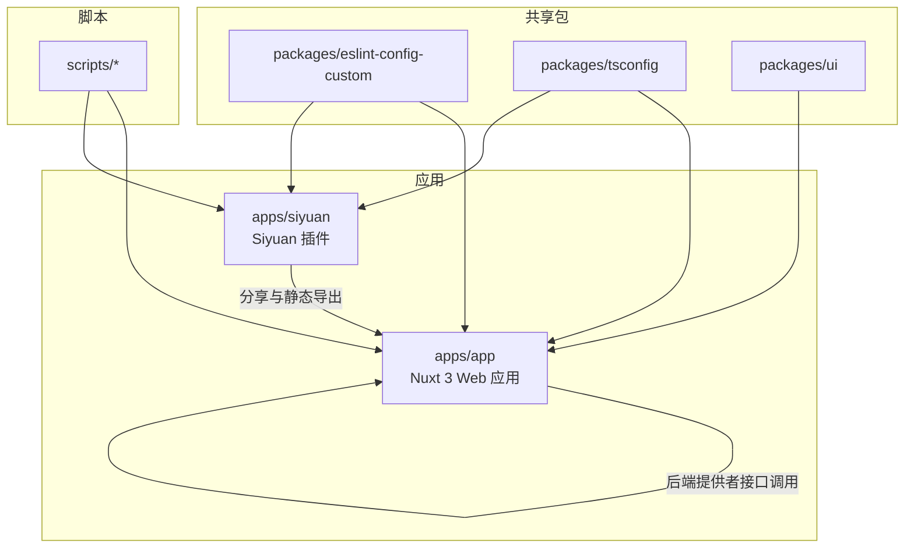
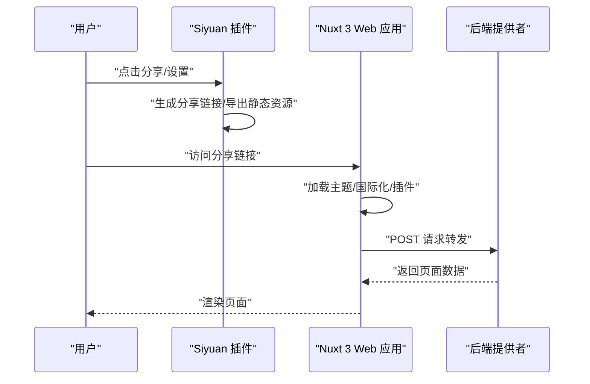
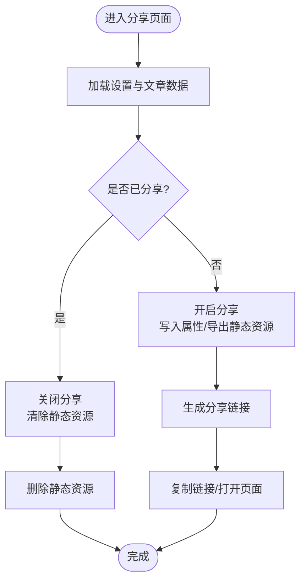
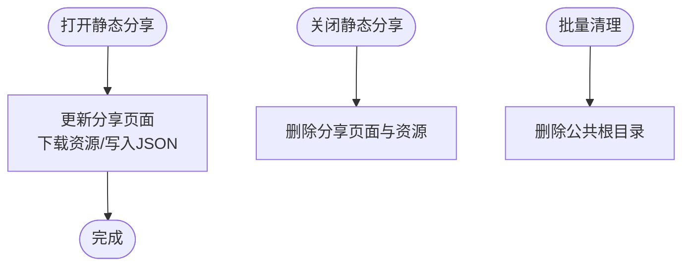
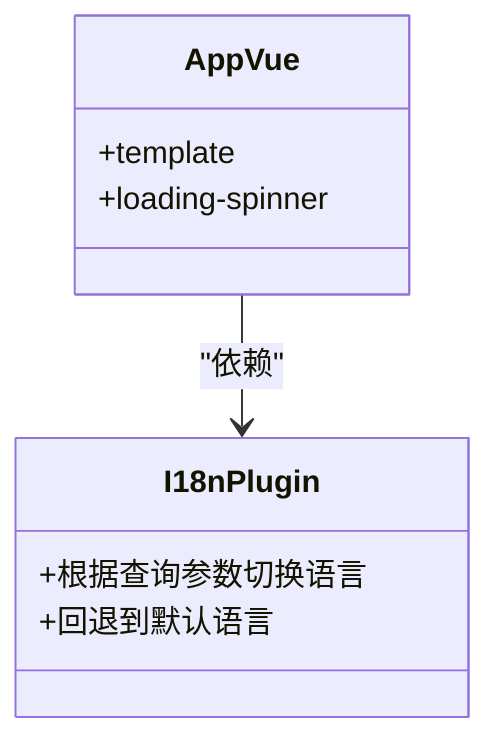
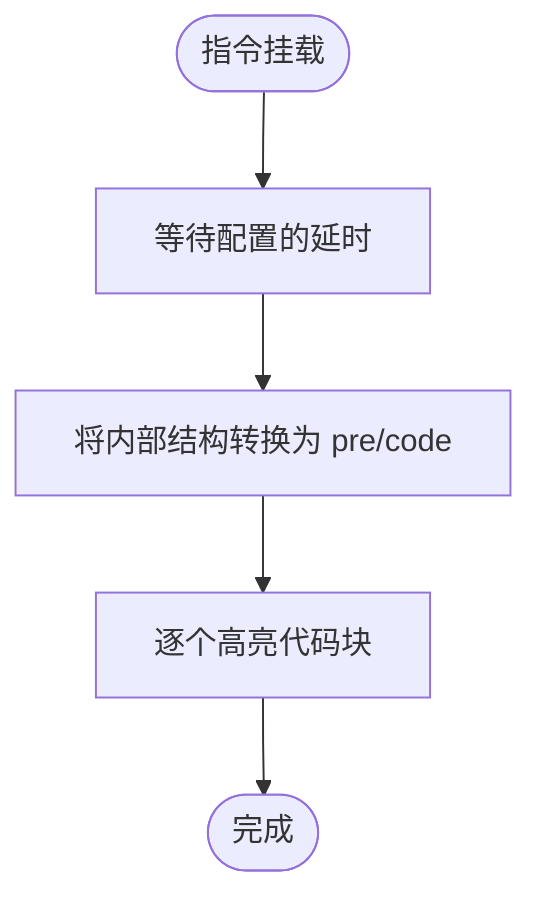
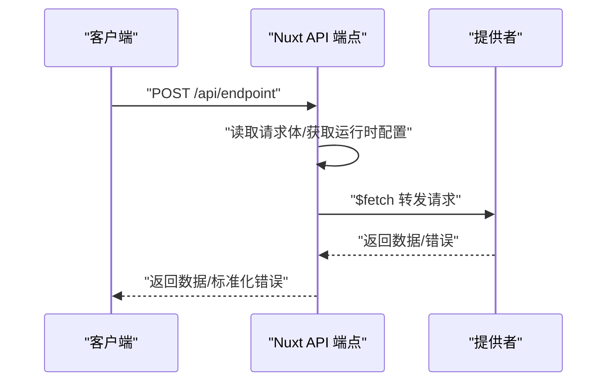
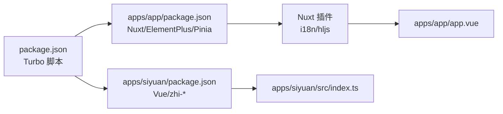

# 项目概述

<cite>
**本文档引用的文件**
- [README.md](file://README.md)
- [package.json](file://package.json)
- [apps/app/package.json](file://apps/app/package.json)
- [apps/siyuan/package.json](file://apps/siyuan/package.json)
- [plugin.json](file://plugin.json)
- [apps/app/nuxt.config.ts](file://apps/app/nuxt.config.ts)
- [apps/app/app.vue](file://apps/app/app.vue)
- [apps/siyuan/src/main.ts](file://apps/siyuan/src/main.ts)
- [apps/siyuan/src/index.ts](file://apps/siyuan/src/index.ts)
- [apps/app/server/api/endpoint.ts](file://apps/app/server/api/endpoint.ts)
- [apps/siyuan/src/pages/Share.vue](file://apps/siyuan/src/pages/Share.vue)
- [apps/siyuan/src/composables/useStaticShare.ts](file://apps/siyuan/src/composables/useStaticShare.ts)
- [apps/app/plugins/00.i18n.ts](file://apps/app/plugins/00.i18n.ts)
- [apps/app/plugins/01.hljs.client.ts](file://apps/app/plugins/01.hljs.client.ts)
</cite>

## 目录
1. [引言](#引言)
2. [项目结构](#项目结构)
3. [核心组件](#核心组件)
4. [架构总览](#架构总览)
5. [详细组件分析](#详细组件分析)
6. [依赖关系分析](#依赖关系分析)
7. [性能考虑](#性能考虑)
8. [故障排除指南](#故障排除指南)
9. [结论](#结论)

## 引言
本项目是一个自托管的 Notion 替代方案，专注于将 Siyuan 笔记内容安全地分享为可访问的网页。它通过一个桌面端插件与一个基于 Nuxt 3 的 Web 应用配合工作：前者负责在本地笔记中发起分享、生成分享链接并管理静态资源导出；后者负责接收请求、渲染页面并与后端提供者交互，最终向用户展示美观、可定制的主题化博客页面。

项目的主要特性包括：
- 内容分享系统：支持将单篇或主页内容发布为静态网页，支持过期时间控制与一键清空所有分享。
- 多平台支持：同时适配桌面端、移动端与浏览器端，覆盖 Windows、Linux、macOS、Android、iOS 以及 Docker 环境。
- 主题系统：内置多种主题（如 Zhihu、Tsundoku、Daylight、Midnight、Pink-Room 等），并支持自定义扩展。
- 插件机制：采用模块化的插件体系，涵盖国际化、代码高亮、折叠、嵌入块、图表等能力，便于按需启用与扩展。

技术选型方面，项目采用 Vue 3 + Nuxt 3 + TypeScript 的现代化前端技术栈，结合 Pinia 状态管理、Element Plus 组件库、Vite 构建工具与 Stylus 样式预处理，确保开发体验与运行性能的平衡。

## 项目结构
该项目采用 Monorepo 结构，主要包含两个应用与共享包：
- apps/app：基于 Nuxt 3 的 Web 应用，负责页面渲染、国际化、主题加载与与后端提供者的交互。
- apps/siyuan：Siyuan 桌面端插件，提供分享界面、设置管理与静态资源导出能力。
- packages：共享的 ESLint 配置与 UI 组件库（当前仓库未包含具体实现）。
- scripts：构建、打包与版本管理脚本。

**图表来源**
- [apps/app/nuxt.config.ts:1-125](file://apps/app/nuxt.config.ts#L1-L125)
- [apps/siyuan/src/index.ts:1-49](file://apps/siyuan/src/index.ts#L1-L49)
- [apps/app/app.vue:1-42](file://apps/app/app.vue#L1-L42)

**章节来源**
- [package.json:1-27](file://package.json#L1-L27)
- [apps/app/package.json:1-41](file://apps/app/package.json#L1-L41)
- [apps/siyuan/package.json:1-43](file://apps/siyuan/package.json#L1-L43)

## 核心组件
- 插件入口与生命周期：Siyuan 插件通过入口类初始化工具栏与图标，提供统一的分享与设置界面。
- 分享页面：提供开关分享、复制链接、IP 切换、过期时间设置、设为主页等功能。
- 静态分享逻辑：将文章内容与资源导出至公共目录，支持更新与批量清理。
- Web 应用骨架：Nuxt 3 应用负责国际化、主题加载、路由与页面渲染。
- 后端提供者代理：通过服务器端 API 将请求转发到指定的提供者地址，实现跨域与安全控制。
- 插件系统：包含国际化查询参数切换、代码高亮等客户端插件，提升用户体验与可扩展性。

**章节来源**
- [apps/siyuan/src/index.ts:22-48](file://apps/siyuan/src/index.ts#L22-L48)
- [apps/siyuan/src/pages/Share.vue:1-499](file://apps/siyuan/src/pages/Share.vue#L1-L499)
- [apps/siyuan/src/composables/useStaticShare.ts:1-97](file://apps/siyuan/src/composables/useStaticShare.ts#L1-L97)
- [apps/app/app.vue:10-24](file://apps/app/app.vue#L10-L24)
- [apps/app/server/api/endpoint.ts:12-39](file://apps/app/server/api/endpoint.ts#L12-L39)
- [apps/app/plugins/00.i18n.ts:16-27](file://apps/app/plugins/00.i18n.ts#L16-L27)
- [apps/app/plugins/01.hljs.client.ts:37-79](file://apps/app/plugins/01.hljs.client.ts#L37-L79)

## 架构总览
下图展示了从 Siyuan 插件到 Web 应用再到后端提供者的完整流程：

**图表来源**
- [apps/siyuan/src/pages/Share.vue:66-119](file://apps/siyuan/src/pages/Share.vue#L66-L119)
- [apps/app/server/api/endpoint.ts:12-39](file://apps/app/server/api/endpoint.ts#L12-L39)
- [apps/app/app.vue:10-24](file://apps/app/app.vue#L10-L24)

## 详细组件分析

### 分享页面与静态导出
该组件负责：
- 控制分享开关并更新块属性；
- 生成分享链接并支持复制模板化链接；
- 支持 IP 切换以适配不同网络环境；
- 设置过期时间并更新静态分享；
- 提供一键清空所有分享的功能。

**图表来源**
- [apps/siyuan/src/pages/Share.vue:66-119](file://apps/siyuan/src/pages/Share.vue#L66-L119)
- [apps/siyuan/src/pages/Share.vue:219-244](file://apps/siyuan/src/pages/Share.vue#L219-L244)

**章节来源**
- [apps/siyuan/src/pages/Share.vue:36-244](file://apps/siyuan/src/pages/Share.vue#L36-L244)

### 静态分享逻辑
该组合式函数封装了静态分享的核心操作：
- 更新分享页面：下载资源到公共目录、裁剪输出字段并写入 JSON；
- 关闭分享：删除对应 JSON 与资源目录；
- 批量清理：删除整个公共分享根目录。

**图表来源**
- [apps/siyuan/src/composables/useStaticShare.ts:22-53](file://apps/siyuan/src/composables/useStaticShare.ts#L22-L53)
- [apps/siyuan/src/composables/useStaticShare.ts:89-93](file://apps/siyuan/src/composables/useStaticShare.ts#L89-L93)

**章节来源**
- [apps/siyuan/src/composables/useStaticShare.ts:17-96](file://apps/siyuan/src/composables/useStaticShare.ts#L17-L96)

### Web 应用骨架与国际化
- 应用骨架：使用 Suspense 包裹页面，在加载时显示旋转指示器，提升用户体验。
- 国际化：默认语言为简体中文，支持通过查询参数切换语言，自动回退到默认语言。

**图表来源**
- [apps/app/app.vue:10-24](file://apps/app/app.vue#L10-L24)
- [apps/app/plugins/00.i18n.ts:16-27](file://apps/app/plugins/00.i18n.ts#L16-L27)

**章节来源**
- [apps/app/app.vue:10-42](file://apps/app/app.vue#L10-L42)
- [apps/app/plugins/00.i18n.ts:16-27](file://apps/app/plugins/00.i18n.ts#L16-L27)

### 代码高亮插件
- 在客户端挂载指令，延迟执行高亮，先将内部结构转换为标准的 pre/code 结构再进行高亮处理。
- 通过运行时配置等待时间，避免 DOM 还未完全渲染导致的高亮失败。

**图表来源**
- [apps/app/plugins/01.hljs.client.ts:43-78](file://apps/app/plugins/01.hljs.client.ts#L43-L78)

**章节来源**
- [apps/app/plugins/01.hljs.client.ts:37-79](file://apps/app/plugins/01.hljs.client.ts#L37-L79)

### 后端提供者代理
- 仅允许 POST 方法，读取请求体中的目标 URL；
- 使用运行时配置的提供者地址拼接完整路径；
- 对 404 与异常情况进行错误包装，返回标准化错误响应。

**图表来源**
- [apps/app/server/api/endpoint.ts:12-39](file://apps/app/server/api/endpoint.ts#L12-L39)

**章节来源**
- [apps/app/server/api/endpoint.ts:12-39](file://apps/app/server/api/endpoint.ts#L12-L39)

## 依赖关系分析
- 项目采用 pnpm 工作区与 Turbo 并行构建，统一管理脚本与依赖。
- Web 应用依赖 Nuxt 3、Pinia、Element Plus、VueUse 等现代化前端生态。
- Siyuan 插件依赖 Vue 3 与 zhi-* 生态，提供与桌面端的集成能力。
- 插件系统通过 Nuxt 插件机制注入，支持国际化与代码高亮等能力。

**图表来源**
- [package.json:4-21](file://package.json#L4-L21)
- [apps/app/package.json:12-41](file://apps/app/package.json#L12-L41)
- [apps/siyuan/package.json:14-43](file://apps/siyuan/package.json#L14-L43)
- [apps/app/plugins/00.i18n.ts:16-27](file://apps/app/plugins/00.i18n.ts#L16-L27)
- [apps/app/plugins/01.hljs.client.ts:37-79](file://apps/app/plugins/01.hljs.client.ts#L37-L79)
- [apps/app/app.vue:10-24](file://apps/app/app.vue#L10-L24)
- [apps/siyuan/src/index.ts:22-48](file://apps/siyuan/src/index.ts#L22-L48)

**章节来源**
- [package.json:1-27](file://package.json#L1-L27)
- [apps/app/package.json:1-41](file://apps/app/package.json#L1-L41)
- [apps/siyuan/package.json:1-43](file://apps/siyuan/package.json#L1-L43)

## 性能考虑
- 客户端延迟高亮：通过延时策略避免 DOM 未就绪导致的高亮失败，减少重排与闪烁。
- 动态版本号：为静态资源生成动态版本号，便于缓存控制与增量更新。
- 懒加载与按需插件：仅在需要时加载国际化与代码高亮等插件，降低首屏负担。
- 服务端代理：集中处理跨域与错误包装，减少客户端复杂度与网络往返。

## 故障排除指南
- 访问分享链接空白或加载缓慢：检查提供者地址配置与网络连通性；确认静态资源已正确导出到公共目录。
- 代码高亮不生效：确认高亮插件已加载且延时配置合理；检查 DOM 结构是否符合预处理要求。
- 国际化语言切换无效：确认查询参数合法且存在于可用语言列表中；否则将回退到默认语言。
- 清理分享后仍可见：确认公共根目录已被删除；必要时手动检查并清理残留文件。

**章节来源**
- [apps/app/plugins/01.hljs.client.ts:43-78](file://apps/app/plugins/01.hljs.client.ts#L43-L78)
- [apps/app/plugins/00.i18n.ts:20-26](file://apps/app/plugins/00.i18n.ts#L20-L26)
- [apps/siyuan/src/composables/useStaticShare.ts:89-93](file://apps/siyuan/src/composables/useStaticShare.ts#L89-L93)

## 结论
本项目通过“桌面端插件 + Web 应用 + 后端提供者”的分层架构，实现了对 Siyuan 笔记内容的安全分享与主题化展示。其现代化技术栈与模块化插件体系，既保证了开发效率，也为后续扩展提供了清晰的路径。对于希望构建自托管知识分享平台的用户而言，该项目具备良好的可定制性与跨平台支持，能够满足从个人博客到团队知识库的多样化场景需求。