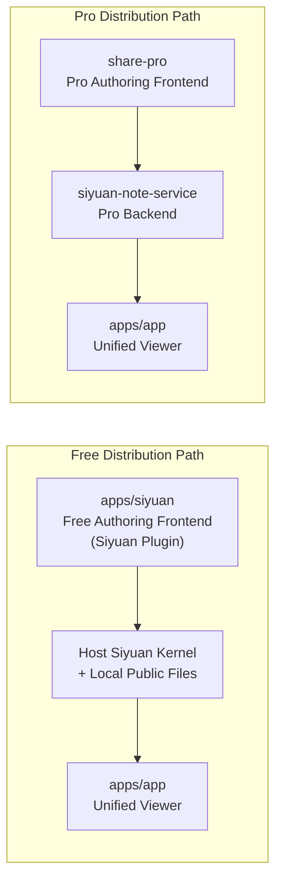

[中文](README_zh_CN.md)

# Share to web

Your self-hosted notion alternative

## Architecture

This repository only contains part of the full product family.

Inside this repo:

- `apps/siyuan`: the free edition authoring frontend, implemented as a Siyuan plugin.
- `apps/app`: the unified viewer application used by different deployment targets.

Outside this repo:

- `share-pro`: the paid/professional authoring frontend.
- `siyuan-note-service`: the paid/professional backend service.

So there are two different product flows:

- Free path:
  `apps/siyuan` -> host Siyuan kernel / local public files -> `apps/app` viewer
- Pro path:
  `share-pro` -> `siyuan-note-service` -> `apps/app` viewer

The important distinction is:

- The free authoring frontend talks directly to the host Siyuan instance.
- It does not use an application backend owned by this repo during authoring.
- The backend only exists in the separate pro product line.



## Startup Via Node provider as debug

```bash
# run apps/app from the monorepo root
pnpm dev
```

## Startup Via Node provider

```bash
# cp ./startup.example.sh ./startup.sh
# change NUXT_PUBLIC_PROVIDER_URL or use default
./startup.sh
```

## Build Via Node provider

```bash
pnpm buildNodeProvider
pnpm packageNodeProvider
```

## Viewer Targets

### `siyuan`

- Build command: `pnpm build -F @terwer/share-pro-app -- --from siyuan`
- Output type: free SPA viewer
- The generated viewer is distributed under `/plugins/siyuan-blog/app/`

### `node` / `vercel` / `cloudflare`

- These are server-capable viewer targets

## Root Monorepo Commands

```bash
# default: start apps/app from the monorepo root
pnpm dev

# explicit alias
pnpm dev:app

# start the Siyuan plugin watcher from the monorepo root
pnpm dev:siyuan

# run every workspace dev task through turbo
pnpm dev:all
```

## More

[Click here](https://siyuan.wiki/s/20250111132959-xvao9ll)
