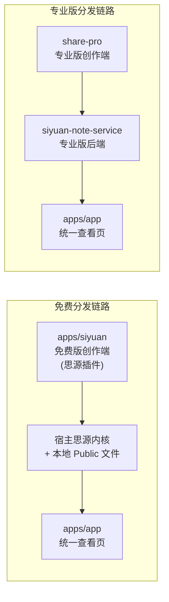

[English](README.md)

# 在线分享

您的自部署 notion 替代品

## 架构

当前仓库只包含整个产品体系中的一部分。

本仓库内：

- `apps/siyuan`
  免费版创作端前端，以思源插件的形式存在，负责创作与触发分享。
- `apps/app`
  统一查看页，服务不同部署目标。

本仓库外：

- `share-pro`
  收费版 / 专业版创作端前端。
- `siyuan-note-service`
  收费版 / 专业版后端服务。

因此实际存在两条不同链路：

- 免费链路：
  `apps/siyuan` -> 宿主思源内核 / 本地 public 文件 -> `apps/app` 查看页
- 专业版链路：
  `share-pro` -> `siyuan-note-service` -> `apps/app` 查看页

真正重要的区别是：

- 免费创作端直接和宿主思源交互。
- 免费创作链路没有使用你自己的业务后端。
- 你自己的后端只存在于独立的专业版产品线中。



## 服务商开发模式启动

```bash
# 在 monorepo 根目录直接启动 apps/app
pnpm dev
```

## 服务商生产模式启动

```bash
# cp ./startup.example.sh ./startup.sh
# 修改 NUXT_PUBLIC_PROVIDER_URL，或者使用默认
./startup.sh
```

## 服务商生产模式打包

```bash
pnpm buildNodeProvider
pnpm packageNodeProvider
```

## 查看页目标

### `siyuan`

- 构建命令：`pnpm build -F @terwer/share-pro-app -- --from siyuan`
- 产物类型：免费版 SPA 查看页
- 产物分发路径：`/plugins/siyuan-blog/app/`

### `node` / `vercel` / `cloudflare`

- 这三类是带 server 能力的查看页目标

## 根目录常用命令

```bash
# 默认：在 monorepo 根目录启动 apps/app
pnpm dev

# 显式别名
pnpm dev:app

# 在 monorepo 根目录启动 Siyuan 插件 watch
pnpm dev:siyuan

# 通过 turbo 同时跑所有 workspace 的 dev 任务
pnpm dev:all
```

## 详细了解

[功能介绍](https://siyuan.wiki/s/20250111132959-fv1bjrw)
