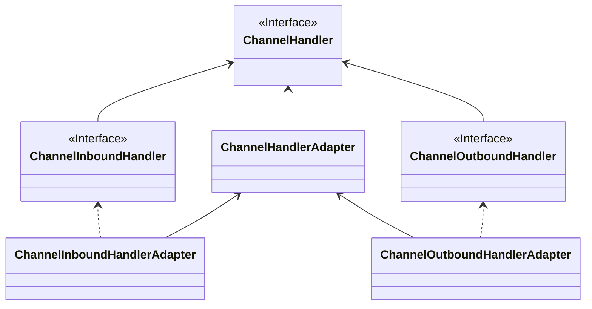

本文介绍了Netty的核心API以及他们的使用。

<!-- more -->

### Netty核心API介绍

#### ChannelHandler及其实现类

API关系如下：

> 如果图片无法显示，请看这里
>
> 

Netty开发中需要定义一个Handler类去实现ChannelHandler接口或其子类或其实现类，然后通过重写相关方法实现业务逻辑：

- public void channelActive(ChannelHandlerContext ctx)：通道就绪事件
- public void read(ChannelHandlerContext ctx, Object msg)：通道读取数据事件
- public void readComplete(ChannelHandlerContext ctx)：数据读取完毕事件
- publi void exceptionCaught(ChannelHandlerContext ctx, Throwable cause)：通道发生异常事件

#### ChannelPipline

ChannelPipline是一个handler集合，它负责处理和拦截inbound和outbound事件和操作，相当于一个贯穿Netty的责任链。

如果客户端和服务端的handler是一样的，那么消息从客户端到服务端或者反过来，每个inbound类型或许outbound类型只会经过一次，混合类型（同时实现了inbound和outbound的handler）的handler会经过两次。

ChannelPipline中的每个ChannelHandlerContext中都含有一个ChannelHandler。

**InboundHandler是按照Pipline的加载顺序顺序执行，OutboundHandler是按照Pipline的加载顺序逆序执行。**

#### ChannelHandlerContext

事件处理器上下文对象，Pipline链中的实际处理节点。

每个处理节点ChannelhandlerContxet包含一个具体的处理器ChannelHandler，同时ChannelHandlerContext中也绑定了对应的ChannelPipline和Channel的信息，方便对ChannelHandler进行调用。常用方法如下：

- ChannelFuture close()：关闭通道
- ChannelOutboundInvoker flush()：刷新
- ChannelFuture writeAndFlush(Object msg)：将数据写入ChannelPipline中当前ChannelHandler的下一个ChannelHandler开始处理（出站）

#### ChannelOption

Netty在创建Channel实例后，一般都需要设置ChannelOption参数。

ChannelOption是socket的标准参数，不是Netty特有的。常见的参数如下：

- ChannelOption.SO_BACKLOG：对应TCP/IP协议listen函数中的backlog参数，用来初始化服务器可连接队列大小。

  服务端处理客户端连接请求是顺序处理的，所以同一时间只能处理一个客户端连接。

  多个客户端来的时候，服务端将不能处理的客户端请求放在等待队列里，backlog参数指定了队列的大小。

- ChannelOption.SO_KEEPALIVE：一直保存连接处于活动状态。该参数用于设置TCP连接。

  当设置该选项之后，会测试连接的状态，用于可能长时间没有数据交流的连接。

  当设置该选项后，如果两小时内没有数据通信时，TCP会自动发送一个活动探测数据报文。

#### ChannelFuture

表示Channel中异步I/O操作的结果。

在Netty中所有的I/O操作都是异步的，IO的调用会直接返回，调用者并不能立即获得结果，但是可以通过ChannelFuture来获取I/O操作的处理状态。

常用方法如下： 

- Channel channel()：返回当前正在进行IO操作的通道
- ChannelFuture sync()：等待异步操作执行完毕，将异步改为同步

#### EventLoopGroup和实现类NioEventLoopGroup

EventLoopGroup是一组EventLoop的抽象，Netty为了更好的利用多核CPU的资源，一般会有多个EventLoop同时同工作，每个EventLoop维护着一个Selector对象。

EventLoopGroup提供next接口，可以从组里面按照一定规则，获取其中一个EventLoop来处理任务。

在Netty的服务端编程中，一般需要提供两个EventLoopGroup，例如：BossEventLoopGroup和WorkerEventLoopGroup。

通常一个服务端口就是一个ServerSocketChannel，对应一个Selector和一个EventLoop线程。

BossEventLoop负责接收客户端连接，并将SocketChannel交给WorkerEventLoopGroup进行I/O处理。

BossEventLoopGroup通常是一个单线程的EventLoop，EventLoop维护者一个注册了ServerSocketChannel的Selector实例。

BossEventLoop不断轮询Selector，将连接事件分离出来，通常是ON_ACCEPT事件，然后将接收到的SocketChannel交给WorkerEventLoopGroup。

WorkerEventLoopGroup会由next选择其中一个EventLoopGroup来讲这个SocketChannel注册到其维护的Selector，并对其后的IO事件进行处理。

一般情况下都是使用NioEventLoopGroup，常用方法如下：

- public NioEventLoopGroup()：构造方法，创建线程组
- public Future<?> shutdownGracefully()：断开连接，关闭线程

#### ServerBootStrap和Bootstrap

ServerBootstrap是Netty中的服务端启动助手，通过它可以完成服务端的各种配置。

Bootstrap是Netty中的客户端启动助手，通过它可以完成客户端的各种配置。常见方法如下：

- public ServerBootstrap group(EventLoopGroup parentGroup, EventLoopGroup childGroup)：用于服务端，用于设置两个EventLoop
- public B group(EventLoopGroup group)：用于客户端，用于设置一个EventLoop
- public B channel(Class<? Extends C> channelClass)：该方法用于设置服务端的通道实现
- public B option(ChannelOption option, T value)：用来给ServerChannel添加配置
- public ServerBootstrap childOption(ChannelOption option, T value)：用来给接收到的通道添加配置
- public ServerBootstrap childHandler(ChannelHandler childHandler)：该方法设置业务处理类，自定义Handler
- public ChannelFuture bind(int inetPort)：该方法用于服务端，用来设置占用的端口号
- public ChannelFuture connect(String inetPort, int inetPort)：该方法用于客户端，用于连接服务端

#### Unpooled类

这是Netty提供的一个专门用来操作缓冲区的工具类，常用方法如下：

- public static ByteBuf copiedBuffer(CharSequence string, Charset charset)：通过给定的数据和字符编码返回一个BuyeBuf对象，类似于NIO中的ByteBuffer对象。