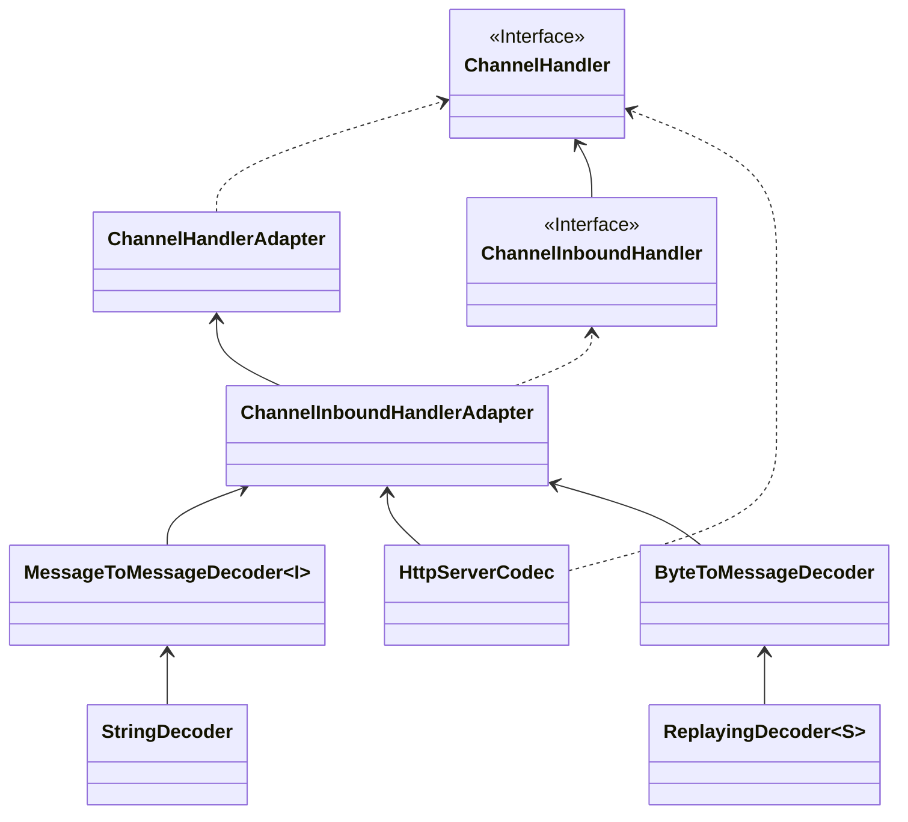
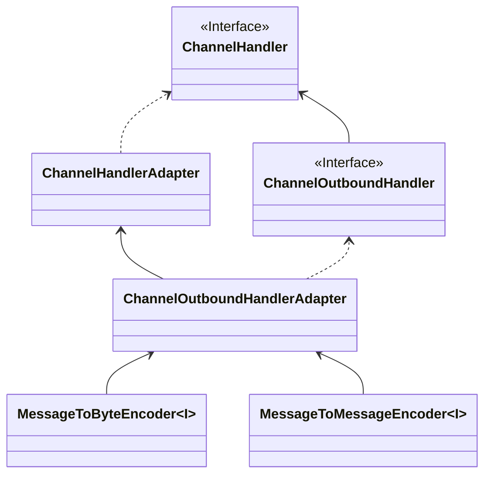
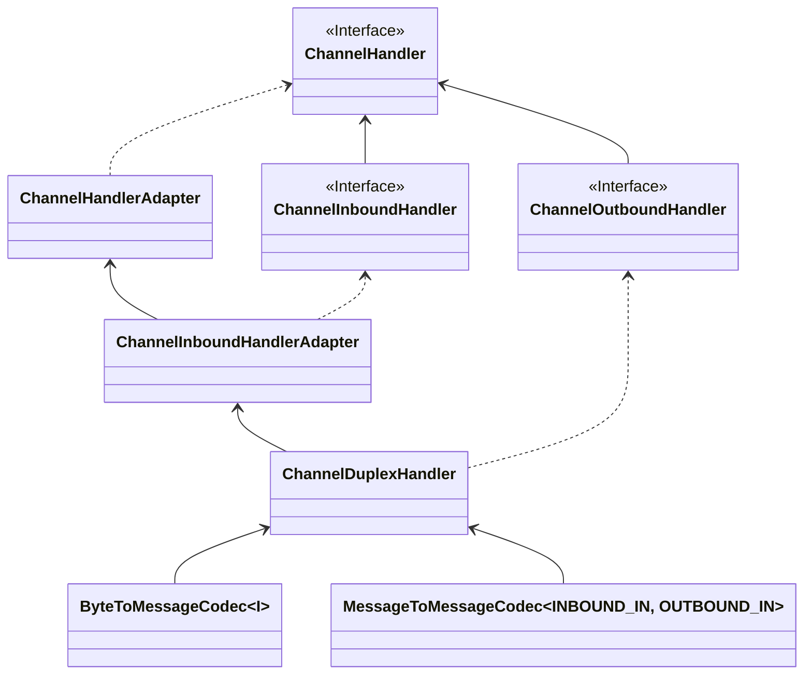

本文介绍了Netty编解码器的继承体系、常用API以及实际应用。

<!-- more -->

## netty高级

### Netty编解码器

#### Java的编解码

1. 编码（Encode）称为序列化，它将对象序列为字节数组，用于网络传输、数据持久化或者其他用途。

2. 解码（Decode）称为反序列化，它将从网络、磁盘等读取的字节数组还原成原始对象（通常是原始对象），以方便后面的业务逻辑操作。

   

   Java序列化只需要实现 `java.io.Serializable` 接口并生成序列化ID，这个类能够通过 `java.io.ObjectInput` 和`java.io.ObjectOutput` 序列化和反序列化。

   Java序列化目的：1.网络传输。 2. 对象初始化。

   Java序列化缺点：1. 无法跨语言。 2. 序列化后码流太大。3. 序列化性能太低。

   Java序列化仅仅是Java编解码技术的一种，由于它的缺陷，衍生出了很多编解码框架，这些框架可以实现信息的搞笑序列化。

#### Netty编解码器

##### 概念

网络应用需要实现某种编解码器，将原始字节数据与自定义消息之间进行转换。

网络中是以字节码的形式进行传输的，服务器编码数据之后发送到客户端，客户端需要对数据进行解码。

对Netty来说，编解码器分为两部分：编码器和解码器。

Netty的编解码器实现了 `ChannelHandlerAdaptor` ，他是一种特殊的 `ChannelHandler` ，依赖于 `ChannelPipline`，可以将多个编解码器连接在一起，实现复杂的转换逻辑。

**Nertty的编解码**

解码器：负责处理入站InboundHandler数据从一种格式到另一种格式。

编码器：负责处理出站OuboundHandler数据

##### 解码器（Decoder）

解码器负责入站数据，解码器处理入站数据是ChannelInboundHandler的实现。需要将解码器放在ChannelPipline中。

对于解码器，Netty中提供了抽象基类 `ByteToMessageDecoder` 和 `MessageToMessageDecoder`。


> 如果图片无法显示，请看这里
>
> 

- 抽象解码器

  - ByteToMessageDecoder：用于将字节转为消息，需要检测缓冲区是否有足够的字节

  - ReplayingDecoder：继承自ByteToMessageDecoder，不需要检测缓冲区是否有足够的字节，但是ReplayingDecoder的速度略慢于ByteToMessageDecoder，而且并不是所有的ByteBuf都支持。

    项目复杂度高用ReplayingDecoder，否则使用ByteToMessageDecoder。

  - MessageToMessageDecoder：从一种消息解码为另一种消息，例如POJO到POJO

- 核心方法

  ```java
  decode(ChannelhandlerContext ctx, ByteBuf msg, List<Object> out)
  ```

- 代码实现

  解码器：

  ```java
  /**
   * 消息解码器
   *
   * @name: MessageDecoder
   * @author: terwer
   * @date: 2022-04-26 21:03
   **/
  public class MessageDecoder extends MessageToMessageDecoder {
      @Override
      protected void decode(ChannelHandlerContext ctx, Object msg, List out) throws Exception {
          System.out.println("正在进行消息解码");
          ByteBuf byteBuf = (ByteBuf)msg;
          // 传递到下一个handler
          out.add(byteBuf.toString(CharsetUtil.UTF_8));
      }
  }
  ```
  
  通道方法实现：
  
  ```java
      /**
       * 通道读取事件
       *
       * @param ctx
       * @param msg
       * @throws Exception
       */
      @Override
      public void channelRead(ChannelHandlerContext ctx, Object msg) throws Exception {
  //        ByteBuf byteBuf = (ByteBuf) msg;
  //        System.out.println("客户端发过来的消息：" + byteBuf.toString(CharsetUtil.UTF_8));
          System.out.println("客户端发过来的消息：" + msg);
      }
  ```
  
  启动类：
  
  ```java
  // 添加解码器，要放在自定义解码器之前
  ch.pipeline().addLast("MessageDecoder", new MessageDecoder());
  // 8. 向pipeline中添加自定义业务处理handler
  ch.pipeline().addLast(new NettyServerHandler());
  ```

实现效果：


##### 编码器（Encoder）

与解码器对应，Netty也提供了对应的编码器MessageToByteEncoder和MessageToMessageEncoder，它们都实现了ChannelOutboundHandler。

继承关系如下：



> 如果图片无法显示，请看这里
>
> 

- 抽象编码器

  - MessageToByteEncoder：将消息转化为字节

  - MessageToMessageEncoder：用于从一种消息编码为另外一种消息，例如从POJO到POJO

- 核心方法

  ```java
  encode(ChannelhandlerContext ctx, String msg, List<Object> out)
  ```
  
- 代码实现

  编码器：

  ```java
  /**
   * 消息编码器
   *
   * @name: MessageEncoder
   * @author: terwer
   * @date: 2022-04-26 21:28
   **/
  public class MessageEncoder extends MessageToMessageEncoder {
  
      @Override
      protected void encode(ChannelHandlerContext ctx, Object msg, List out) throws Exception {
          System.out.println("消息正在编码");
          String str = (String) msg;
          out.add(Unpooled.copiedBuffer(str, CharsetUtil.UTF_8));
      }
  }
  ```

  通道写入方法：

  ```java
      /**
       * 通道读取完成事件
       *
       * @param ctx
       * @throws Exception
       */
      @Override
      public void channelReadComplete(ChannelHandlerContext ctx) throws Exception {
  //        ctx.writeAndFlush(Unpooled.copiedBuffer("你好，我是Netty服务端。", CharsetUtil.UTF_8));
          ctx.writeAndFlush("你好，我是Netty服务端。");
      }
  ```

  启动类：

  ```java
  // 添加解码器，要放在自定义解码器之前
  ch.pipeline().addLast("MessageDecoder", new MessageDecoder());
  // 添加编码器
  ch.pipeline().addLast("MessageEncoder",new MessageEncoder());
  // 8. 向pipeline中添加自定义业务处理handler
  ch.pipeline().addLast(new NettyServerHandler());
  ```

  实现效果：

  

##### 编码解码器（Codec）

编码解码器：同时具备编码和解码功能。

特点是同时实现了ChannelInboundHandler和ChannelOutboundHandler接口，在输入和输出时都能进行处理。

继承关系如下：



> 如果图片无法查看，请看这里
>
> 

Netty提供了一个ChannelDuplexHandler适配器类，他是编码和解码器的抽象基类，ByteToMessageCodec和MessageToMessageCodec都继承自此基类。

- 代码实现

编解码器：

```java
/**
 * 编解码器
 *
 * @name: MessageCodec
 * @author: terwer
 * @date: 2022-04-27 01:58
 **/
public class MessageCodec extends MessageToMessageCodec {

    /**
     * 编码
     * @param ctx
     * @param msg
     * @param out
     * @throws Exception
     */
    @Override
    protected void encode(ChannelHandlerContext ctx, Object msg, List out) throws Exception {
        System.out.println("消息正在编码，使用编解码器");
        String str = (String) msg;
        out.add(Unpooled.copiedBuffer(str, CharsetUtil.UTF_8));
    }

    /**
     *
     * @param ctx
     * @param msg
     * @param out
     * @throws Exception
     */
    @Override
    protected void decode(ChannelHandlerContext ctx, Object msg, List out) throws Exception {
        System.out.println("正在进行消息解码，使用编解码器");
        ByteBuf byteBuf = (ByteBuf)msg;
        // 传递到下一个handler
        out.add(byteBuf.toString(CharsetUtil.UTF_8));
    }
}
```

启动类：

```java
// // 添加解码器，要放在自定义解码器之前
// ch.pipeline().addLast("MessageDecoder", new MessageDecoder());
// // 添加编码器
// ch.pipeline().addLast("MessageEncoder",new MessageEncoder());
// 添加编解码器
ch.pipeline().addLast("MessageCodec", new MessageCodec());
// 8. 向pipeline中添加自定义业务处理handler
ch.pipeline().addLast(new NettyServerHandler());
```

运行效果：

