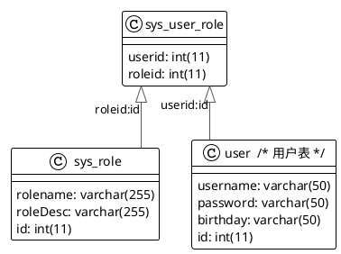

## 多对多查询的模型

用户表和角色表的关系为，一个用户有多个角色，一个角色被多个用户使用。

多对多查询的需求：查询所有用户的同时查询出该用户对应的所有角色。



> 如果图片无法查看，请看这里
>
> ​
>

## 多对多查询的语句

对应的sql语句：

```sql
select u.id,u.username,r.id,r.rolename from user u left join sys_user_role ur on u.id=ur.userid
inner join sys_role r on r.id= ur.roleid
```

查询结果如下：

|id|username|id|rolename|
| :---| :---------| :---| :---------|
|1|lucy|1|CTO|
|2|tom|1|CTO|
|1|lucy|2|CEO|
|2|tom|2|CEO|

## 创建Role实体，修改User实体

User

<code-group>

<code-block title="Kotlin" active>

```kotlin
class User {
    var id: Int? = null
    var username: String? = null

    // 代表当前用户具备那些订单
    var orderList: List<Order>? = null

    // 代表当前用户具备的那些角色
    var roleList: List<Role>? = null
    override fun toString(): String {
        return "User{" +
                "id=" + id +
                ", username='" + username + '\'' +
                ", orderList=" + orderList +
                ", roleList=" + roleList +
                '}'
    }
}
```

</code-block>

<code-block title="Java">

```java
public class User {
    private Integer id;
    private String username;

    // 代表当前用户具备那些订单
    private List<Order> orderList;

    // 代表当前用户具备的那些角色
    private List<Role> roleList;

    public Integer getId() {
        return id;
    }

    public void setId(Integer id) {
        this.id = id;
    }

    public String getUsername() {
        return username;
    }

    public void setUsername(String username) {
        this.username = username;
    }

    public List<Order> getOrderList() {
        return orderList;
    }

    public void setOrderList(List<Order> orderList) {
        this.orderList = orderList;
    }

    public List<Role> getRoleList() {
        return roleList;
    }

    public void setRoleList(List<Role> roleList) {
        this.roleList = roleList;
    }

    @Override
    public String toString() {
        return "User{" +
                "id=" + id +
                ", username='" + username + '\'' +
                ", orderList=" + orderList +
                ", roleList=" + roleList +
                '}';
    }
}
```

</code-block>

</code-group>

Role

<code-group>

<code-block title="Kotlin" active>

```kotlin
class Role {
    private val id: Int? = null
    private val rolename: String? = null
  
    override fun toString(): String {
      return "Role{" +
      "id=" + id +
      ", rolename='" + rolename + '\'' +
      '}'
    }
}
```

</code-block>

<code-block  title="Java">

```java
public class Role {
    private Integer id;
    private String rolename;
  
  @Override
  public String toString() {
      return "Role{" +
              "id=" + id +
              ", rolename='" + rolename + '\'' +
              '}';
  }
}
```

</code-block>

</code-group>

## UserMapper添加接口方法

<code-group>

<code-block title="Kotlin" active>

```kotlin
/**
 * 查询所有用户以及对应的角色
 * @return
 */
fun findAllUserAndRole(): List<User?>?
```

</code-block>

<code-block  title="Java">

```java
/**
 * 查询所有用户以及对应的角色
 * @return
 */
public List<User> findAllUserAndRole();
```

</code-block>

</code-group>

## 配置UserMapper.xml

```xml
<resultMap id="userRoleMap" type="com.terwergreen.pojo.User">
    <result property="id" column="id"></result>
    <result property="username" column="username"></result>

    <collection property="roleList" ofType="com.terwergreen.pojo.Role">
        <result column="rid" property="id"></result>
        <result column="rolename" property="rolename"></result>
    </collection>
</resultMap>

<select id="findAllUserAndRole" resultMap="userRoleMap">
    select u.id,u.username,r.id,r.rolename from user u left join sys_user_role ur on u.id=ur.userid
    inner join sys_role r on r.id=ur.roleid
</select>
```

## 测试结果

```plaintext
==>  Preparing: select u.id,u.username,r.id as rid,r.rolename from user u left join sys_user_role ur on u.id=ur.userid inner join sys_role r on r.id=ur.roleid
==> Parameters: 
<==    Columns: id, username, rid, rolename
<==        Row: 1, lucy, 1, CTO
<==        Row: 2, tom, 1, CTO
<==        Row: 1, lucy, 2, CEO
<==        Row: 2, tom, 2, CEO
<==      Total: 4
User{id=1, username='lucy', orderList=null, roleList=[Role{id=1, rolename='CTO'}, Role{id=2, rolename='CEO'}]}
User{id=2, username='tom', orderList=null, roleList=[Role{id=1, rolename='CTO'}, Role{id=2, rolename='CEO'}]}
```

## 知识总结

MyBatis多表配置方式:

**一对一配置:使用做配置**

**一对多配置:使用+做配置**

**多对多配置:使用+做配置**

## 本文代码地址

[mybatis-multitable](https://github.com/terwer/senior-java-engineer-road/tree/master/p7-skill/framework/mybatis/mybatis-multitable "mybatis-multitable")

> 
> ![NOTE]
> 文章更新历史
>
> 2022/05/08 feat:新增Kotlin支持。
>
> 2022/05/04 feat:初稿。
>